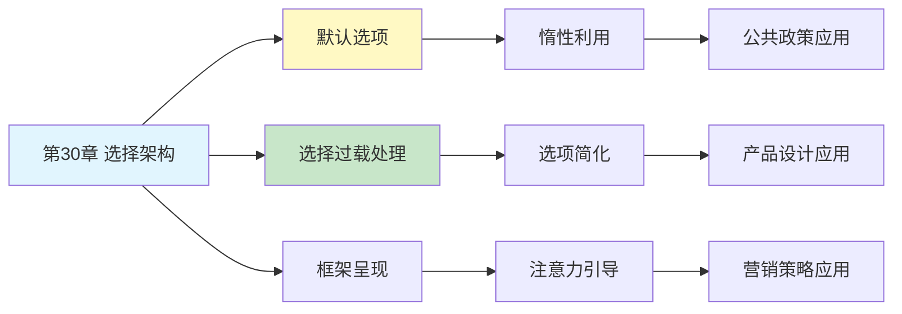

# 第30章 选择架构

## 📍 章节定位

### 全书位置
> 第30章探讨选择架构设计——如何通过改变决策环境而非限制选择自由来"助推"人们做出更好的决策，揭示了默认选项、选项呈现方式等设计元素对行为的巨大影响。

- **全书核心问题**: 人类的决策如何被环境设计影响？如何帮助人们做出更好选择？
- **本章回答的问题**: 在不限制自由的前提下，如何设计更好的选择环境？
- **角色类型**: 应用实践型（从理论到政策应用的桥梁）
- **论证位置**: 从认知偏误研究转向实际应用，连接学术研究与公共政策

### 章节序列
| 方向 | 章节标题 | 逻辑连接 |
|------|----------|----------|
| 前章 | [[第29章-心理账户]] | 心理账户是选择架构设计的重要考量 |
| 后章 | [[第31章-框架效应]] | 框架是选择架构的核心工具之一 |
| 整书 | [[思考快与慢-丹尼尔·卡尼曼-拆解记录]] | 从偏误研究走向应用实践 |

### 一句话定位
> 第30章展示了"助推"的力量——通过精心设计默认选项、信息呈现和选择环境，可以在不剥夺自由的前提下大幅改善人们的决策质量。

---

## 🎯 核心观点

### 第一层：表层案例

| 案例名称 | 简要描述 | 页码 | 关键引文 |
|----------|----------|------|----------|
| 器官捐赠默认 | 不同国家器官捐赠率差异巨大，只因默认设置不同 | p.— | "默认选项改变一切" |
| 养老金自动加入 | 自动加入养老金计划提升参与率 | p.— | "懒得退出就成了参与" |
| 自助餐布局 | 健康食物放在显眼位置增加选择 | p.— | "位置决定选择" |
| 药品剂量设计 | 简化服药方案提高依从性 | p.— | "选择越简单越好" |
| 碳排放标签 | 环保信息呈现影响购买决策 | p.— | "信息呈现塑造行为" |

### 第二层：中层机制

| 机制名称 | 组成要素 | 因果链条 | 证据来源 |
|----------|----------|----------|----------|
| 默认效应 | 惰性 + 认知资源节省 | 默认选项→接受而非改变→行为定型 | 行为公共政策研究 |
| 选择过载 | 选项数量 + 决策难度 | 选项过多→决策瘫痪→不做选择或随机选择 | 消费行为研究 |
| 框架呈现 | 信息组织 + 认知引导 | 呈现方式→注意力分配→选择偏好 | 框架效应研究 |
| 社会规范 | 从众心理 + 规范感知 | 知道他人选择→跟随规范→行为趋同 | 社会影响研究 |

### 第三层：底层规律

| 规律陈述 | 抽象层级 | 知识连接 | 适用范围 |
|----------|----------|----------|----------|
| 自由家长主义 | 政策哲学 | [[助推理论]], [[行为公共政策]] | 公共政策设计 |
| 选择环境决定论 | 环境心理学 | [[情境认知理论]], [[生态心理学]] | 所有选择场景 |
| 认知路径依赖 | 认知心理学 | [[系统1/2理论]], [[认知经济学]] | 决策行为 |

---

## 💬 降维翻译

### 观点1: 默认选项有巨大力量

#### 原文表达
> "在器官捐赠的跨国比较中，研究发现一个惊人的现象：捐赠率高达90%以上的国家和捐赠率不足20%的国家之间的差异，几乎完全可以用默认选项来解释。默认加入、需要主动退出的国家捐赠率远高于默认不加入、需要主动申请的国家。这个简单的设置差异，决定了无数人的生死。"

> p.—

#### 降维翻译（中学生能懂）
你去注册驾照的时候，表格上有这么一栏：
- 方案A：你想捐赠器官吗？□是 □否（需要主动勾选）
- 方案B：你同意捐赠器官，除非你勾选不同意

同样的意思，但是：
- 用方案A的国家，只有15%的人同意
- 用方案B的国家，90%以上都同意

为什么？因为大多数人懒得动，默认是什么就是什么。

#### 日常类比（奶奶能懂）
就像手机里的隐私设置，默认开启的很少人会去关，默认关闭的也很少人会去开。不是说大家不在乎，是懒得折腾。设计的人知道这个，就把默认设置成他们想要的结果。

#### 检验
- Q: 如果一个中学生问你这是什么意思？
- A: 默认选项的力量在于人的惰性。大多数人不会改默认设置，所以设置什么默认值就等于替大多数人做了决定。

### 观点2: 好的选择架构是"助"而非"推"

#### 原文表达
> "选择架构设计的核心原则是'自由家长主义'——保留人们的选择自由，但通过环境设计帮助他们做出更好的决定。这不是强制，不是操纵，而是承认人类认知的局限性，为这种局限性提供支持性的决策环境。好的选择架构就像学校食堂把健康食品放在显眼位置——你仍可以选择垃圾食品，但做出健康选择变得更容易。"

> p.—

#### 降维翻译（中学生能懂）
"助推"不是逼你做什么，而是让你更容易做对的事。

比如：
- 不禁止卖垃圾食品，但把沙拉放在最显眼的位置
- 不强迫你存钱，但养老金默认就是"自动加入"
- 不禁止不运动，但楼梯比电梯更显眼

自由还在，只是"对的选择"更容易了。

#### 日常类比（奶奶能懂）
就像家里把水果放在茶几上，零食藏在柜子深处。你想吃零食还是能找到，但随手能拿到的都是水果。这就是"助推"，不强迫，但引导。

#### 检验
- Q: 如果一个中学生问你这是什么意思？
- A: 好的选择设计不是限制你的自由，而是让你更容易做出对自己好的选择。

---

## ✨ 金句库

### 原书金句
| 金句 | 页码 | 适用场景 |
|------|------|----------|
| "默认选项可能是最有力的公共政策工具" | p.— | 政策设计讨论 |
| "助推保留自由，但引导方向" | p.— | 助推理念科普 |
| "好的选择架构是隐形的帮手" | p.— | 设计思维教育 |

### 降维金句
| 金句 | 来源观点 | 适用场景 |
|------|----------|----------|
| "懒得改默认，就是默认的力量" | 默认效应 | 行为分析 |
| "助推不是推你，是帮你" | 自由家长主义 | 政策科普 |
| "选择的设计者比选择者更重要" | 环境设计 | 权力分析 |

## 🔗 当下映射

### 💰 财富应用
| 场景 | 具体行动 | 预期效果 | 风险提示 |
|------|----------|----------|----------|
| 养老金参与 | 选择自动加入计划 | 确保长期储蓄 | 可能影响短期流动性 |
| 健康保险 | 设置合理的默认计划 | 避免因惰性选错 | 需要定期评估 |
| 投资配置 | 选择目标日期基金作为默认 | 简化投资决策 | 可能不适合所有人 |

### 💼 职场应用
| 场景 | 具体行动 | 所需能力 | 适用职级 |
|------|----------|----------|----------|
| 会议设计 | 默认不参会，需要主动加入 | 组织设计能力 | 所有管理者 |
| 福利选择 | 推荐套餐作为默认选项 | HR专业知识 | HR及管理层 |
| 流程优化 | 减少不必要的决策点 | 流程设计能力 | 流程负责人 |

### 🏠 生活应用
| 场景 | 具体行动 | 可行性 | 见效时间 |
|------|----------|--------|----------|
| 健康习惯 | 把健康食品放在显眼位置 | 高 | 即时生效 |
| 时间管理 | 手机默认专注模式 | 高 | 即时生效 |
| 学习计划 | 日历默认安排学习时间 | 高 | 长期见效 |

### 72小时行动计划
1. **明天可以做的第一件事**: 检查你的手机、电脑中有哪些默认设置影响你的行为
2. **本周内可以尝试的事**: 重新设计你的一个日常选择环境（比如桌面布局）
3. **需要准备资源才能做的事**: 系统性地审视生活中的选择架构，重新设计"助推"环境

---

## 🕸️ 章节关联

### 向上关联 → 整书
- **贡献**: 将认知偏误研究转化为实际应用，展示行为科学的政策价值
- **位置**: 从理论转向实践，连接学术研究与公共政策

### 横向关联 → 章节间
| 章节编号 | 章节标题 | 关联类型 | 连接描述 |
|----------|----------|----------|----------|
| 第29章 | 心理账户 | 前置 | 心理账户是选择架构设计的考量因素 |
| 第31章 | 框架效应 | 延续 | 框架是选择架构的核心工具 |
| 第7章 | 过度自信的锚点 | 相关 | 锚定效应也是选择架构的利用点 |
| 第28章 | 公平偏好 | 相关 | 社会规范助推需要考虑公平感 |

### 向下关联 → 具体应用
| 应用场景 | 难度 | 前置知识 |
|----------|------|----------|
| 公共政策设计 | 高 | 行为经济学、政策学 |
| 产品设计 | 中 | 用户体验、行为心理 |
| 个人习惯养成 | 低 | 自我管理知识 |

### 跨书关联 → 知识网络
| 书籍 | 概念 | 关系 | 备注 |
|------|------|------|------|
| [[思考快与慢-丹尼尔·卡尼曼-拆解记录]] | 选择架构 | 同源 | 理论基础 |
| [[助推-塞勒-拆解记录]] | 助推理论 | 核心来源 | 塞勒是助推概念创始人 |
| [[助推2.0-塞勒-拆解记录]] | 助推应用 | 延伸 | 更多实践案例 |
| [[设计心理学-诺曼-拆解记录]] | 设计思维 | 相关 | 环境设计视角 |

### 关联可视化

---

## ❓ 问答设计

### Q1: [记忆型问题]
**认知层次**: 记忆
**难度**: 低
**描述**: 什么是选择架构？
**答案要点**:
- 决策环境的设计方式
- 影响人们选择的呈现方式
- 不限制自由但引导方向

### Q2: [理解型问题]
**认知层次**: 理解
**难度**: 中
**描述**: 为什么默认选项有如此大的力量？
**答案要点**:
- 人有惰性，懒得改变
- 改变默认需要认知努力
- 系统2参与有限

### Q3: [应用型问题]
**认知层次**: 应用
**难度**: 中
**描述**: 如何用选择架构帮助自己养成健康习惯？
**答案要点**:
- 把健康选项设为默认
- 减少不健康选项的便利性
- 简化健康行为的步骤

### Q4: [分析型问题]
**认知层次**: 分析
**难度**: 中
**描述**: "自由家长主义"与强制政策有什么区别？
**答案要点**:
- 自由家长主义保留选择自由
- 不禁止选项，只是引导
- 尊重个体自主性

### Q5: [创造型问题]
**认知层次**: 创造
**难度**: 高
**描述**: 设计一个利用选择架构提高环保行为的项目？
**答案要点**:
- 默认选项设置
- 社会规范展示
- 简化环保行为步骤

### Q6: [理解型问题]
**认知层次**: 理解
**难度**: 中
**描述**: 选择过载如何影响决策质量？
**答案要点**:
- 选项过多导致决策瘫痪
- 增加"不做选择"的概率
- 降低决策满意度

### Q7: [应用型问题]
**认知层次**: 应用
**难度**: 中
**描述**: 在组织管理中如何运用选择架构？
**答案要点**:
- 设计合理的默认流程
- 简化决策选项
- 引导期望的行为方向

### Q8: [分析型问题]
**认知层次**: 分析
**难度**: 高
**描述**: 选择架构的伦理边界在哪里？
**答案要点**:
- 透明度：谁在设计、目的是什么
- 是否真正保留选择自由
- 是否服务于设计者还是选择者的利益

### Q9: [理解型问题]
**认知层次**: 高
**描述**: 选择架构与系统1/2的关系是什么？
**答案要点**:
- 利用系统1的惰性和直觉
- 减少系统2的认知负担
- 设计符合认知习惯的环境

### Q10: [创造型问题]
**认知层次**: 创造
**难度**: 高
**描述**: 如何设计一个帮助人们存钱的选择架构系统？
**答案要点**:
- 自动转账作为默认
- 视觉化展示储蓄进度
- 减少取款的便利性

---
