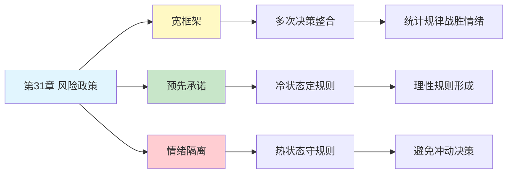

# 第31章 风险政策

## 📍 章节定位

### 全书位置
> 第31章探讨风险政策的制定——如何通过预设决策规则来克服损失厌恶和窄框架带来的非理性风险态度，揭示"提前决定"比"临场反应"更能产生明智的风险决策。

- **全书核心问题**: 如何克服人类天生的风险态度偏误，做出更理性的风险决策？
- **本章回答的问题**: 为什么预先制定的规则比临场决策更可靠？如何设计个人或组织的风险政策？
- **角色类型**: 应用实践型（从偏误理论到决策策略的桥梁）
- **论证位置**: 从前景理论的应用转向具体的风险管理策略，是理论到实践的关键转化

### 章节序列
| 方向 | 章节标题 | 逻辑连接 |
|------|----------|----------|
| 前章 | [[第30章-选择架构]] | 选择架构是风险政策的实施环境 |
| 后章 | [[第32章-两个自我]] | 风险政策连接经历自我与记忆自我 |
| 整书 | [[思考快与慢-丹尼尔卡尼曼-拆解记录]] | 前景理论的核心应用章节 |

### 一句话定位
> 第31章的核心洞察是：聪明的风险管理者不依赖临场判断，而是提前制定规则——用"宽框架"整合多次决策，让统计规律战胜每次决策时的情绪波动。

---

## 🎯 核心观点

### 第一层：表层案例

| 案例名称 | 简要描述 | 页码 | 关键引文 |
|----------|----------|------|----------|
| 企业风险政策 | 公司规定所有项目风险决策统一标准 | p.— | "统一规则避免情绪化" |
| 投资组合再平衡 | 定期而非根据市场情绪调整配置 | p.— | "规则战胜直觉" |
| 保险购买决策 | 预先决定保险范围，非事故后决定 | p.— | "提前锁定风险态度" |
| 止损规则 | 交易前设定止损点，严格执行 | p.— | "事前规则事中遵守" |
| 供应商选择 | 建立评分体系，而非每次重新谈判 | p.— | "标准化降低偏差" |

### 第二层：中层机制

| 机制名称 | 组成要素 | 因果链条 | 证据来源 |
|----------|----------|----------|----------|
| 宽框架效应 | 多次决策整合 + 统计视角 | 多次决策→波动抵消→风险态度趋稳 | 前景理论实验 |
| 预先承诺 | 规则前置 + 执行隔离 | 提前设定→情绪中立期→理性规则形成 | 行为经济学研究 |
| 情绪隔离 | 冷热状态分离 + 规则代理 | 冷状态制定→热状态执行→避免冲动 | 自我控制研究 |
| 损失厌恶对抗 | 规则保护 + 统计视野 | 规则覆盖→单次损失感钝化→理性坚持 | 投资行为研究 |

### 第三层：底层规律

| 规律陈述 | 抽象层级 | 知识连接 | 适用范围 |
|----------|----------|----------|----------|
| 宽框架定律 | 决策心理学核心 | [[前景理论]], [[窄框架]] | 所有风险决策场景 |
| 预先承诺原理 | 行为经济学基础 | [[时间不一致性]], [[自我控制]] | 长期决策与执行 |
| 情绪冷热分离 | 认知心理学 | [[冷热共情鸿沟]], [[状态依赖]] | 冲动控制领域 |

---

## 💬 降维翻译

### 观点1: 宽框架让风险决策变聪明

#### 原文表达
> "窄框架的决策者把每个选择都当作孤立事件，因此在面对损失时表现出强烈的厌恶。但如果采用宽框架，将多次类似决策视为一个组合，损失和收益会在统计上相互抵消，风险态度会更加理性。这就是为什么保险公司能够接受个别保单的赔付——它们看的是整个组合，而不是单个案例。"

> p.—

#### 降维翻译（中学生能懂）
想象你要玩一个抛硬币游戏：
- 正面赢100元，反面输100元
- 只玩一次：你可能不敢玩，因为怕输
- 玩100次：你肯定玩，因为长远看输赢基本抵消，而且还能赚手续费

把100次决策当成1次来看，这就是"宽框架"。

窄框架 = 每次都纠结"要不要玩"
宽框架 = 提前想好"玩100次，不管单次输赢"

后者更理性，因为单次的输赢是运气，100次的输赢是统计。

#### 日常类比（奶奶能懂）
就像做生意，不要盯着一笔赚亏。有的人今天亏了就睡不着，明天赚了就高兴得睡不着。聪明的人看一年下来赚了多少，不纠结单笔买卖。

#### 检验
- Q: 如果一个中学生问你这是什么意思？
- A: 把很多次决定放一起看，比每次单独看更不容易被情绪带跑。统计打败情绪。

### 观点2: 好的风险政策是冷状态制定的

#### 原文表达
> "风险政策的核心原则是：在情绪稳定时制定规则，在情绪波动时遵守规则。当面临实际风险决策时，损失厌恶和恐惧会强烈干扰判断，这时候执行预先设定的规则比临场判断更可靠。好的投资者在市场平静时设定止损点，在市场剧烈波动时严格执行，而不是在恐慌中重新思考。"

> p.—

#### 降维翻译（中学生能懂）
你有没有发现：
- 考试前发誓"下次一定好好复习"
- 考完试又放松了，复习计划泡汤
- 下次考试前又开始后悔

问题在哪？你总是在"冷状态"（不着急时）做计划，在"热状态"（着急时）被情绪带跑。

风险政策就是：
- 不着急的时候想清楚规则
- 着急的时候只管执行规则

不是"到时候再说"，是"早就说好了"。

#### 日常类比（奶奶能懂）
就像打牌之前先说好"今天输100块就不玩了"，比输到100块的时候再想"要不要继续"靠谱。因为你输钱的时候脑子不清醒，容易越输越多。

#### 检验
- Q: 如果一个中学生问你这是什么意思？
- A: 好的规则是在心情平静的时候定的，不是在慌张的时候临时想的。慌张的时候执行规则，不要重新想。

### 观点3: 组织比个人更擅长风险政策

#### 原文表达
> "有效的组织都会建立风险政策，明确规定什么样的风险可以接受、什么样的必须规避。这种制度化有两个好处：一是避免了个人决策时的情绪波动，二是让相似情况得到相似处理，保证了公平性和一致性。个人可以向组织学习，为自己建立类似的风险管理框架。"

> p.—

#### 降维翻译（中学生能懂）
公司做生意有规矩：
- 哪些客户可以赊账，有明确规定
- 哪些投资能做，有评分标准
- 谁来签字批准，有流程

为什么？因为不能每次都让员工自己拍脑袋决定。情绪来了、关系近了，判断就歪了。

个人也可以学：
- 什么情况下买/不买，提前定规矩
- 什么情况下投资/不投资，提前定标准
- 什么情况下辞职/不辞职，提前想清楚

规矩是情绪的刹车片。

#### 日常类比（奶奶能懂）
就像老话说"丑话说在前头"，先把规矩立好，后面少闹矛盾。公司有制度，家里也要有规矩，不是每次都临时商量。

#### 检验
- Q: 如果一个中学生问你这是什么意思？
- A: 公司有制度防止员工乱来。你也可以给自己定制度，防止自己情绪上来乱来。

---

## ✨ 金句库

### 原书金句
| 金句 | 页码 | 适用场景 |
|------|------|----------|
| "宽框架是风险决策的理性基础" | p.— | 投资决策教育 |
| "预先承诺战胜即时诱惑" | p.— | 自我管理讨论 |
| "冷状态制定的规则保护热状态的自己" | p.— | 情绪管理 |
| "风险政策是个人理性的外包" | p.— | 决策策略讨论 |

### 降维金句
| 金句 | 来源观点 | 适用场景 |
|------|----------|----------|
| "不要临时想，要提前定" | 预先承诺原则 | 决策教育 |
| "统计打败情绪，规则战胜直觉" | 宽框架效应 | 投资心理 |
| "冷时定规矩，热时守规矩" | 情绪隔离 | 自我管理 |
| "把100次当成1次看" | 宽框架方法 | 风险决策 |

## 🔗 当下映射

### 💰 财富应用
| 场景 | 具体行动 | 预期效果 | 风险提示 |
|------|----------|----------|----------|
| 投资决策 | 提前设定资产配置比例和再平衡规则 | 避免追涨杀跌 | 需要长期坚持 |
| 止损策略 | 买入前设定止损点，严格执行 | 限制单次损失 | 可能卖早了 |
| 保险规划 | 预先评估风险敞口，统一购买 | 避免过度或不足保险 | 需要定期评估 |

### 💼 职场应用
| 场景 | 具体行动 | 所需能力 | 适用职级 |
|------|----------|----------|----------|
| 项目评估 | 建立标准化的风险评估框架 | 风险管理能力 | 项目经理 |
| 决策流程 | 将重大决策规则化、流程化 | 流程设计能力 | 管理层 |
| 职业选择 | 预先设定职业风险承受标准 | 自我认知 | 所有职级 |

### 🏠 生活应用
| 场景 | 具体行动 | 可行性 | 见效时间 |
|------|----------|--------|----------|
| 消费决策 | 设定冲动消费的"冷却期"规则 | 高 | 即时生效 |
| 健康投资 | 预先承诺健康检查和保健投入 | 高 | 长期见效 |
| 人际边界 | 提前设定人际关系的边界规则 | 中 | 持续生效 |

### 72小时行动计划
1. **明天可以做的第一件事**: 回顾最近一次让你后悔的风险决策，分析是否因为没有提前定规则
2. **本周内可以尝试的事**: 选一个你经常纠结的决策领域（比如消费、投资、健康），写下3条明确的决策规则
3. **需要准备资源才能做的事**: 建立个人的"风险政策手册"，覆盖投资、消费、职业等主要决策领域

---

## 🕸️ 章节关联

### 向上关联 → 整书
- **贡献**: 将前景理论和损失厌恶研究转化为可操作的风险管理策略
- **位置**: 从理论偏误走向实践对策，是应用层面的关键章节

### 横向关联 → 章节间
| 章节编号 | 章节标题 | 关联类型 | 连接描述 |
|----------|----------|----------|----------|
| 第30章 | 选择架构 | 前置 | 选择架构是风险政策的实施环境 |
| 第32章 | 两个自我 | 延续 | 风险政策连接经历自我与记忆自我 |
| 第13章 | 损失厌恶 | 溯源 | 风险政策对抗的核心偏误 |
| 第20章 | 系统性风险偏好 | 相关 | 窄框架导致风险偏好不一致 |

### 向下关联 → 具体应用
| 应用场景 | 难度 | 前置知识 |
|----------|------|----------|
| 个人投资规划 | 中 | 投资基础、风险认知 |
| 企业风险管理 | 高 | 管理学、风险理论 |
| 家庭财务规划 | 中 | 理财基础 |

### 跨书关联 → 知识网络
| 书籍 | 概念 | 关系 | 备注 |
|------|------|------|------|
| [[思考快与慢-丹尼尔卡尼曼-拆解记录]] | 风险政策 | 同源 | 核心理论来源 |
| [[非对称风险-塔勒布-拆解记录]] | 切身利益 | 互补 | 风险承担的伦理视角 |
| [[反脆弱-塔勒布-拆解记录]] | 杠铃策略 | 延伸 | 风险管理的另一种框架 |
| [[助推-塞勒-拆解记录]] | 预先承诺 | 相关 | 行为干预策略 |

### 关联可视化

---

## ❓ 问答设计

### Q1: [记忆型问题]
**认知层次**: 记忆
**难度**: 低
**描述**: 什么是风险政策？
**答案要点**:
- 预先制定的风险决策规则
- 在冷静时设定，在情绪波动时执行
- 旨在克服损失厌恶和窄框架带来的偏误

### Q2: [理解型问题]
**认知层次**: 理解
**难度**: 中
**描述**: 为什么"宽框架"能改善风险决策？
**答案要点**:
- 多次决策的损失和收益会统计抵消
- 单次损失的情绪冲击被稀释
- 更接近理性经济人的决策模式

### Q3: [应用型问题]
**认知层次**: 应用
**难度**: 中
**描述**: 如何为自己设计一个简单的投资风险政策？
**答案要点**:
- 在市场平静时设定资产配置比例
- 设定止损和止盈规则
- 定期（非情绪驱动）再平衡
- 写下来，严格执行

### Q4: [分析型问题]
**认知层次**: 分析
**难度**: 中
**描述**: 风险政策与损失厌恶有什么关系？
**答案要点**:
- 风险政策是对抗损失厌恶的工具
- 预先设定规则避免了临场情绪干扰
- 宽框架稀释了单次损失的痛苦感

### Q5: [创造型问题]
**认知层次**: 创造
**难度**: 高
**描述**: 设计一个帮助年轻人做消费决策的风险政策框架？
**答案要点**:
- 设定冲动消费的冷却期（如24小时）
- 区分"需要"和"想要"的判断标准
- 大额消费的强制咨询机制
- 月度消费上限和预警系统

### Q6: [理解型问题]
**认知层次**: 理解
**难度**: 中
**描述**: 为什么说组织比个人更擅长执行风险政策？
**答案要点**:
- 组织有制度化的决策流程
- 避免了个人情绪波动的影响
- 保证了相似情况得到相似处理

### Q7: [应用型问题]
**认知层次**: 应用
**难度**: 中
**描述**: 在职业发展中如何应用风险政策的思维？
**答案要点**:
- 预先设定跳槽的触发条件
- 明确职业风险的承受底线
- 定期评估而非临时决定
- 建立决策清单避免冲动

### Q8: [分析型问题]
**认知层次**: 分析
**难度**: 高
**描述**: 风险政策的局限性是什么？
**答案要点**:
- 无法覆盖所有意外情况
- 过于僵化可能错失机会
- 规则本身可能有设计缺陷
- 需要定期审视和调整

### Q9: [理解型问题]
**认知层次**: 理解
**难度**: 中
**描述**: "冷状态定规则，热状态守规则"的心理学原理是什么？
**答案要点**:
- 冷热共情鸿沟：冷状态无法预测热状态的行为
- 预先承诺：利用时间隔离来保护决策
- 情绪对认知的干扰作用

### Q10: [创造型问题]
**认知层次**: 创造
**难度**: 高
**描述**: 如何设计一个家庭的财务风险政策手册？
**答案要点**:
- 明确各类支出的决策层级
- 设定紧急储备金的使用规则
- 投资风险承受度的界定
- 重大财务决策的"冷静期"机制
- 定期（如季度）的家庭财务会议

---
