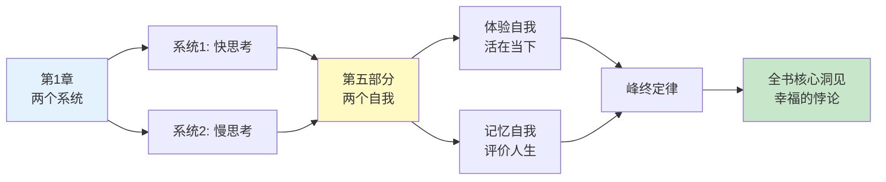
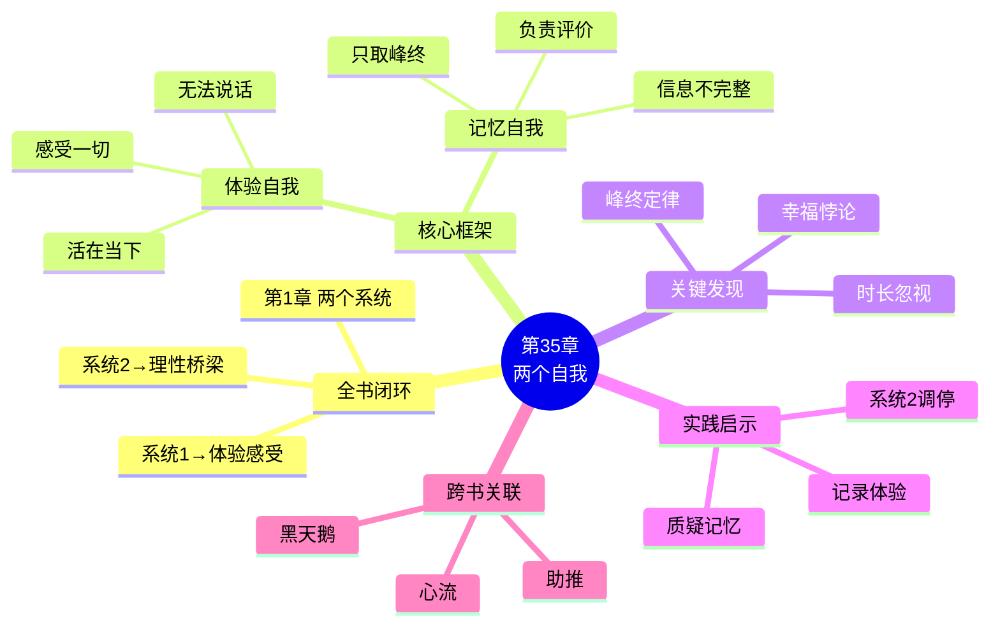
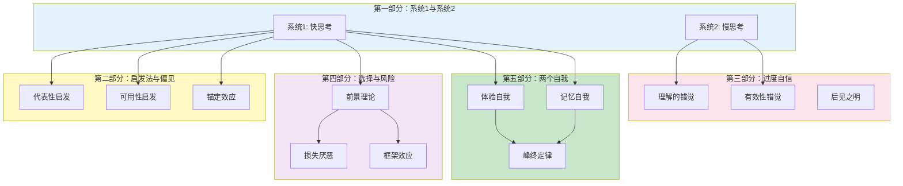

# 第35章 两个自我

## 📍 章节定位

### 全书位置
> 第35章是全书终章，完成了一个精妙的闭环设计：从第1章的"两个系统"（系统1/系统2），到第35章的"两个自我"（体验自我/记忆自我），卡尼曼用双重二元框架解构了人类判断、决策与幸福的本质。

- **全书核心问题**: 人类的判断为什么经常出错？我们如何认识自己的认知局限？什么是幸福？
- **本章回答的问题**: 谁在体验你的人生？谁在评价你的人生？幸福究竟是当下的感受还是回顾的评价？
- **角色类型**: 终章闭环型（全书理论的哲学升华与实践落地）
- **论证位置**: 全书的理论终局，从认知科学上升至人生哲学

### 全书闭环设计

### 章节序列
| 方向 | 章节标题 | 逻辑连接 |
|------|----------|----------|
| 前章 | [[第34章-体验幸福]] | 如何科学测量体验幸福 |
| 本章 | 第35章 两个自我 | 全书理论的哲学总结与闭环 |
| 终章 | 全书完结 | 从认知偏误到人生智慧的跃迁 |

### 一句话定位
> 第35章用一个反直觉的结论完成全书闭环：你的人生被两个"自我"瓜分——体验自我活在每一刻，却无法说话；记忆自我负责评价人生，却只掌握峰终信息。幸福的悖论在于：我们用体验自我度过人生，却用记忆自我来评价人生。

---

## 🎯 核心观点

### 第一层：表层案例

| 案例名称 | 简要描述 | 页码 | 关键引文 |
|----------|----------|------|----------|
| 结肠镜实验回顾 | 病人对治疗的评价完全由峰终决定，时长被忽视 | p.— | "两个自我对同一经历给出完全不同的评价" |
| 假期评价悖论 | 假期中的即时感受与事后回忆几乎没有相关性 | p.— | "体验是热的，记忆是冷的" |
| 分手效应 | 关系的结束方式决定整段感情的记忆评价 | p.— | "结尾重写历史" |
| 生活满意度调查 | 问"你有多幸福"得到的是记忆自我而非体验自我的回答 | p.— | "我们问错了问题" |
| 收入与幸福分离 | 收入与满意度相关，但与日常体验几乎无关 | p.— | "钱能买满意，买不到快乐" |

### 第二层：中层机制

| 机制名称 | 组成要素 | 因果链条 | 证据来源 |
|----------|----------|----------|----------|
| 两个自我分离 | 体验自我 + 记忆自我 | 当下体验→无法留存→记忆重构→评价偏离 | 峰终定律实验 |
| 记忆代理问题 | 记忆自我决策权 + 信息不完整 | 需要做决定→调用记忆→记忆只有峰终→决策失真 | 经历重复选择实验 |
| 幸福测量悖论 | 体验测量vs满意度测量 | 问"满意度"→记忆自我回答→与真实体验脱节 | DRM研究 |
| 时间忽视机制 | 时长信息被丢弃 | 编码记忆→只取峰值和结尾→时长被压缩 | 结肠镜、冷水实验 |

### 第三层：底层规律

| 规律陈述 | 抽象层级 | 知识连接 | 适用范围 |
|----------|----------|----------|----------|
| 双自我架构 | 认知心理学基础 | [[自我理论]], [[意识哲学]] | 所有人生评价与决策 |
| 体验-记忆分离定律 | 记忆认知规律 | [[峰终定律]], [[时长忽视]] | 所有回顾性评价 |
| 幸福评价代理原则 | 哲学/心理学整合 | [[幸福研究]], [[行为经济学-拆解记录]] | 幸福感研究与政策 |
| 系统映射原理 | 理论整合规律 | [[双系统理论-拆解记录]] | 认知科学基础 |

---

## 💬 降维翻译

### 观点1: 你体内有两个"你"

#### 原文表达
> "我们每个人体内都住着两个自我，它们对同一人生给出完全不同的评价。体验自我活在每一个当下，感受快乐与痛苦，但它没有话语权，无法告诉别人'我感觉怎么样'。记忆自我负责回顾和评价，但它掌握的信息极其有限——只有高峰和结尾。结果是：我们用体验自我度过人生，却用记忆自我来评价人生。"

> p.—

#### 降维翻译（中学生能懂）
想象你体内住着两个人：

**体验自我**：
- 活在每一分每一秒
- 吃饭时知道饭好不好吃
- 开会时知道烦不烦
- 但它不会说话，过一秒忘一秒

**记忆自我**：
- 负责回顾和讲故事
- 它会告诉你"这顿饭很棒""这个会太无聊了"
- 但它的信息来源很少——只看了"高潮"和"结局"

问题来了：谁来评价你的人生？
- 是记忆自我
- 但记忆自我掌握的信息不到1%

#### 日常类比（奶奶能懂）
就像看戏，演员在台上演（体验自我），观众在看（记忆自我）。演员知道每一分钟是什么感觉，但观众只记得高潮和大结局。最后写剧评的是观众，不是演员。

#### 检验
- Q: 如果一个中学生问你这是什么意思？
- A: 你活着的时候是一种感觉，回想起来又是另一种感觉。评价人生的是"回想"那个你，不是"活着"那个你。

### 观点2: 幸福的悖论——记忆自我是"不合格的会计师"

#### 原文表达
> "记忆自我是一个极其不合格的会计师。它不记录'多久'，只记录'多痛'和'怎么结束'。这意味着，一个经历了24分钟痛苦但结尾温和的病人，对治疗的评价可能比经历了8分钟剧烈痛苦的病人更好——尽管前者的痛苦总量是后者的三倍。这种系统性偏差影响了医疗决策、司法判断、人生选择。"

> p.—

#### 降维翻译（中学生能懂）
你的记忆会"作弊"。

假设你要评价一次旅行：
- 你以为你会算：7天里每天的感受加起来，算个平均分
- 但你的记忆根本不这么干

它只抓两件事：
1. 最爽（或最惨）的那一瞬间
2. 最后的印象

中间过得好不好？它不关心。

所以：
- 假期最后一天下雨，整个假期印象都打折
- 一段感情分手很难看，回忆起来全是灰
- 医生最后温柔一下，整个痛苦治疗都"还行"

#### 日常类比（奶奶能懂）
就像记账，正常的会计师会把每一笔都记下来。但你的记忆会计师很懒，它只记"最大的一笔"和"最后的一笔"，中间的全扔了。

#### 检验
- Q: 如果一个中学生问你这是什么意思？
- A: 你的记忆不诚实。它只记最刺激的时候和结束的时候，中间的全忘了。所以你对人生的评价可能是错的。

### 观点3: 两个系统与两个自我的映射——卡尼曼的精妙闭环

#### 原文表达
> "本书始于两个系统的区分——系统1快速、自动、直觉；系统2缓慢、努力、理性。本书终于两个自我的区分——体验自我活在当下，记忆自我活在回顾。这两组区分有着深刻的内在联系：体验自我是系统1的直接感受，记忆自我是系统1对过去的重构，而系统2的努力介入是弥合两个自我差距的唯一途径。"

> p.—

#### 降维翻译（中学生能懂）
卡尼曼设计了一个精妙的"闭环"：

**开头**：两个系统
- 系统1：快、直觉、自动
- 系统2：慢、理性、费劲

**结尾**：两个自我
- 体验自我：活在每一刻，感受一切
- 记忆自我：回顾人生，做出评价

**连接**：
- 体验自我 ≈ 系统1的直接感受
- 记忆自我 ≈ 系统1的记忆重构
- 只有系统2努力介入，才能让记忆更准确

#### 日常类比（奶奶能懂）
就像拍照和看照片。拍照时你是在现场（体验自我，系统1感受），看照片时你是在回忆（记忆自我，系统1重构）。只有认真看每一张照片（系统2），你才能知道真正发生了什么。

#### 检验
- Q: 如果一个中学生问你这是什么意思？
- A: 卡尼曼的书是一个圈。开头讲脑子怎么想（快vs慢），结尾讲人生怎么过（体验vs记忆）。两组概念是相通的。

### 观点4: 理性的有限救赎——系统2能做什么

#### 原文表达
> "我们无法消除两个自我之间的鸿沟，但我们可以减少它的危害。系统2的努力介入是唯一的救赎途径：记录当下感受，定期回顾，质疑记忆的叙述，在重要决策前强迫自己查看'原始数据'而非依赖记忆。理性不是消灭系统1，而是学会识别它的局限并加以弥补。"

> p.—

#### 降维翻译（中学生能懂）
两个自我的矛盾能解决吗？
- 完全解决？不可能
- 减少？可以

怎么做？
1. 记录：当下感受写下来，别等记忆"美化"或"丑化"
2. 回顾：定期看记录，看看真实的每一天
3. 质疑：记忆说"那段日子很美好"，问它"真的吗？每一天都美好？"
4. 决策：重要决定前，查客观数据，别只靠"印象"

#### 日常类比（奶奶能懂）
就像记账。如果你不记账，只会觉得"这月好像花了很多"。记账了，才知道到底花了多少、花在哪。理性就是给自己的人生"记账"。

#### 检验
- Q: 如果一个中学生问你这是什么意思？
- A: 你改变不了记忆会作弊的事实，但你可以记录、检查、质疑。理性就是给自己的人生做审计。

---

## ✨ 金句库

### 原书金句
| 金句 | 页码 | 适用场景 |
|------|------|----------|
| "我们用体验自我度过人生，却用记忆自我来评价人生" | p.— | 人生哲学 |
| "记忆自我是一个不合格的会计师" | p.— | 认知反思 |
| "体验是热的，记忆是冷的" | p.— | 认知心理学 |
| "幸福的悖论：我们问错了问题" | p.— | 幸福研究 |
| "系统2是两个自我之间的桥梁" | p.— | 理性与智慧 |
| "你无法消除鸿沟，但可以减少危害" | p.— | 实践智慧 |

### 降维金句
| 金句 | 来源观点 | 适用场景 |
|------|----------|----------|
| "活着的是一个你，评价的是另一个你" | 两个自我 | 人生哲学 |
| "记忆只记高峰和句号，中间全是空白" | 峰终定律 | 认知科普 |
| "问'你幸福吗'，答的是记忆不是体验" | 幸福测量 | 科普讲解 |
| "理性是给自己的人生做审计" | 系统2救赎 | 自我提升 |
| "两个自我在打架，系统2来调停" | 闭环设计 | 认知整合 |

## 🔗 当下映射

### 💰 财富应用
| 场景 | 具体行动 | 预期效果 | 风险提示 |
|------|----------|----------|----------|
| 投资回顾 | 用客观数据评估投资表现，不依赖"感觉" | 减少情绪化决策 | 需要建立记录习惯 |
| 消费体验 | 区分"体验价值"和"记忆价值" | 更理性的消费选择 | 两个自我可能冲突 |
| 财富规划 | 关注日常财务体验而非仅最终数字 | 更可持续的财富观 | 可能忽视长期目标 |

### 💼 职场应用
| 场景 | 具体行动 | 所需能力 | 适用职级 |
|------|----------|----------|----------|
| 职业选择 | 记录日常工作感受，不被"高光时刻"蒙蔽 | 自我觉察能力 | 求职者 |
| 项目评估 | 记录项目过程中每个阶段的感受 | 记录习惯 | 所有管理者 |
| 团队管理 | 关注团队日常体验而非仅考核结果 | 情绪感知能力 | 管理者 |

### 🏠 生活应用
| 场景 | 具体行动 | 可行性 | 见效时间 |
|------|----------|--------|----------|
| 人生回顾 | 建立"体验日记"，定期回顾真实感受 | 高 | 长期见效 |
| 关系经营 | 重视每次互动的结尾印象 | 高 | 即时生效 |
| 旅行规划 | 确保旅行最后一天精彩 | 高 | 即时生效 |
| 幸福追踪 | 每天记录情绪峰值和结尾 | 中 | 持续改善 |

### 72小时行动计划
1. **明天可以做的第一件事**: 回忆最近一段重要经历，区分"当时的感受"和"现在的评价"，看看两者有多大差距
2. **本周内可以尝试的事**: 建立一个简单的"体验日记"，每天记录3个情绪时刻
3. **需要准备资源才能做的事**: 设计一个个人"幸福感追踪表"，长期监测体验自我与记忆自我的差异

---

## 🕸️ 章节关联

### 向上关联 → 整书
- **贡献**: 完成全书闭环，从"两个系统"到"两个自我"，从认知偏误到人生智慧
- **位置**: 终章总结，是理论与实践、科学与哲学的桥梁

### 横向关联 → 章节间
| 章节编号 | 章节标题 | 关联类型 | 连接描述 |
|----------|----------|----------|----------|
| 第1章 | 两个系统 | 闭环起点 | 从系统1/2到体验/记忆自我，形成理论闭环 |
| 第33章 | 对经历的记忆 | 核心证据 | 峰终定律是记忆自我运作的核心机制 |
| 第34章 | 体验幸福 | 方法论 | DRM方法是测量体验自我的工具 |
| 第32章 | 两个自我 | 理论框架 | 两个自我概念的首次完整阐述 |
| 第11章 | 焦虑情绪和概率错觉 | 相关 | 系统1的情绪如何影响判断 |

### 向下关联 → 具体应用
| 应用场景 | 难度 | 前置知识 |
|----------|------|----------|
| 个人幸福感追踪 | 低 | 自我觉察能力 |
| 人生重大决策 | 高 | 理解双系统与双自我 |
| 职业规划 | 中 | 体验与记忆的区分 |
| 亲密关系经营 | 中 | 峰终定律应用 |

### 跨书关联 → 知识网络
| 书籍 | 概念 | 关系 | 备注 |
|------|------|------|------|
| [[思考快与慢-丹尼尔·卡尼曼-拆解记录]] | 双系统/双自我 | 同源 | 全书核心理论 |
| [[心流-契克森米哈赖-拆解记录]] | 心流体验 | 对话 | 关注当下体验而非记忆评价 |
| [[助推-理查德·塞勒-拆解记录]] | 选择架构 | 延伸 | 如何设计更好的决策环境 |
| [[黑天鹅-塔勒布-拆解记录]] | 认知谦卑 | 呼应 | 承认认知的局限 |
| [[非对称风险-塔勒布-拆解记录]] | 切肤之痛 | 互补 | 体验与责任的关系 |

### 关联可视化

---

---

## ❓ 问答设计

### Q1: [记忆型问题]
**认知层次**: 记忆
**难度**: 低
**描述**: 什么是"两个自我"？
**答案要点**:
- 体验自我：活在当下，感受每一刻
- 记忆自我：回顾人生，做出评价
- 两者对同一经历可能给出完全不同的评价

### Q2: [理解型问题]
**认知层次**: 理解
**难度**: 中
**描述**: 为什么说"我们用体验自我度过人生，却用记忆自我来评价人生"？
**答案要点**:
- 体验自我没有话语权，只能感受
- 评价、回忆、决策都由记忆自我完成
- 记忆自我掌握的信息极其有限（只有峰终）

### Q3: [应用型问题]
**认知层次**: 应用
**难度**: 中
**描述**: 如何减少两个自我之间的鸿沟？
**答案要点**:
- 记录当下感受（不让记忆"作弊"）
- 定期回顾真实记录
- 在重要决策前查看客观数据
- 用系统2的努力介入来弥补系统1的局限

### Q4: [分析型问题]
**认知层次**: 分析
**难度**: 中
**描述**: "两个系统"与"两个自我"有什么内在联系？
**答案要点**:
- 体验自我 ≈ 系统1的直接感受
- 记忆自我 ≈ 系统1的记忆重构
- 系统2的努力是弥合两个自我的唯一途径
- 形成了全书的闭环结构

### Q5: [创造型问题]
**认知层次**: 创造
**难度**: 高
**描述**: 如何设计一个"人生审计系统"来帮助人们更准确地认识自己的人生？
**答案要点**:
- 实时记录：每天记录关键情绪时刻
- 定期回顾：每周/每月汇总分析
- 峰终识别：标记峰值和结尾体验
- 决策支持：重要决定前查看客观数据
- 偏差提醒：当记忆与记录差异过大时发出警告

### Q6: [理解型问题]
**认知层次**: 理解
**难度**: 中
**描述**: 为什么说记忆自我是"不合格的会计师"？
**答案要点**:
- 不记录"多久"，只记录"多痛"和"怎么结束"
- 时长信息被完全丢弃
- 用两个数据点概括整个经历
- 导致系统性的评价偏差

### Q7: [应用型问题]
**认知层次**: 应用
**难度**: 中
**描述**: 在职业选择中，如何平衡体验自我和记忆自我？
**答案要点**:
- 记录日常工作的真实感受（体验自我）
- 警惕"高光时刻"的诱惑（记忆自我）
- 考虑长期体验而非仅考虑最终成就
- 用客观数据而非仅凭"印象"做决定

### Q8: [分析型问题]
**认知层次**: 分析
**难度**: 高
**描述**: 卡尼曼为什么用"两个自我"作为全书的终章？
**答案要点**:
- 形成与第1章"两个系统"的闭环
- 从认知科学上升到人生哲学
- 将理论应用于最重要的人生问题：什么是幸福
- 展示认知偏误研究的终极意义

### Q9: [评价型问题]
**认知层次**: 评价
**难度**: 高
**描述**: 两个自我的理论对公共政策有什么启示？
**答案要点**:
- GDP不是唯一指标，需要关注公民的日常体验
- 政策效果要看体验改善而非满意度变化
- 需要测量"体验幸福"而非仅问"满意吗"
- 关注减少痛苦时间而非增加满意评价

### Q10: [创造型问题]
**认知层次**: 创造
**难度**: 高
**描述**: 如果让你向一个完全没读过这本书的人解释"两个自我"的概念，你会怎么说？
**答案要点**:
- 用生活化类比（如演员和观众、日记和自传）
- 强调体验与记忆的分离
- 说明记忆只取峰终、忽略时长的特点
- 解释这对人生评价的影响

---
