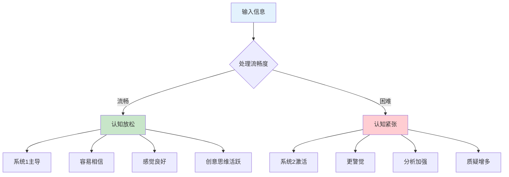
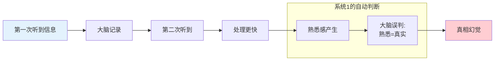
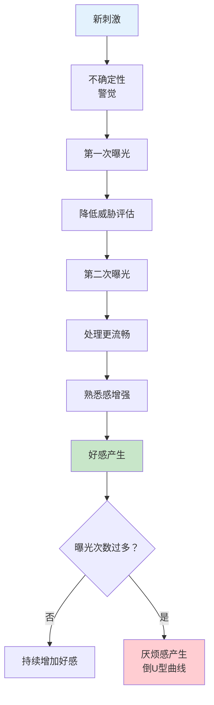
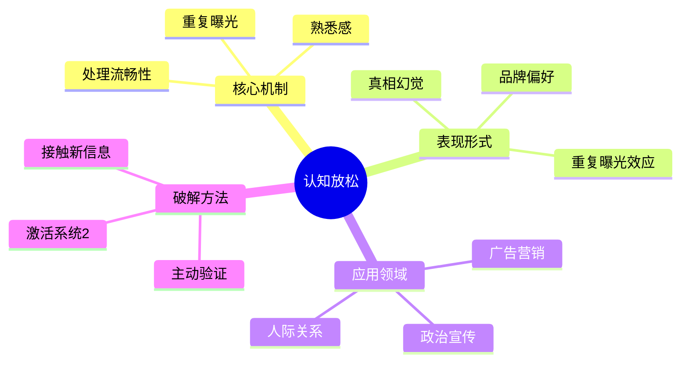

# 第5章 认知放松（Cognitive Ease）

## 📍 章节定位

### 全书位置
> 第5章探讨认知放松（Cognitive Ease）与认知紧张（Cognitive Strain）如何影响我们的判断和决策。揭示熟悉感、重复曝光如何让我们误以为某件事是"真的"——即使它完全是谎言。

- **全书核心问题**: 为什么人类的大脑容易被欺骗？
- **本章回答的问题**: 为什么重复听到的东西会显得更真实？为什么熟悉的东西让我们感到安全？
- **角色类型**: 核心机制型（揭示认知放松如何操纵判断）
- **论证位置**: 承接第4章联想机器，展示联想如何通过"流畅性"产生"真实感"

### 章节序列

| 方向 | 章节标题 | 逻辑连接 |
|------|----------|----------|
| 前章 | [[第4章-联想机器]] | 前章展示联想如何启动，本章展示联想的"流畅性"如何产生"真实感" |
| 后章 | [[第6章-回忆的便利性]] | 认知放松→可得性启发，都是系统1的"懒惰"机制 |
| 整书 | [[思考快与慢-丹尼尔·卡尼曼-拆解记录]] | 揭示重复、熟悉、流畅性如何欺骗大脑 |

### 一句话定位
> 重复让人相信谎言，熟悉让人放松警惕——这不是你的错，是系统1的出厂设置。

---

## 🎯 核心观点（三层提取）

### 观点1：认知放松 vs 认知紧张

#### 【表层】现象层

**什么是认知放松？**
- 当事情进展顺利、没有障碍时，我们处于"认知放松"状态
- 认知放松时，系统1主导，系统2处于待机状态
- 我们更容易接受信息，更少质疑

**什么是认知紧张？**
- 当遇到困难、矛盾或复杂任务时，我们进入"认知紧张"状态
- 认知紧张会激活系统2，让我们更警觉、更分析
- 我们会更谨慎地评估信息

**生活中的例子**：
- 看到一张清晰的照片 vs 模糊的照片 → 清晰的更容易被信任
- 听到熟悉的声音 vs 陌生的声音 → 熟悉的更让人放松
- 阅读简单的文字 vs 复杂的文字 → 简单的更易被接受

#### 【中层】机制层

**认知放松的生理基础**：

**核心机制**：
1. **处理流畅性**（Processing Fluency）：信息越容易处理，越容易被接受
2. **熟悉感**（Familiarity）：熟悉的东西感觉更安全、更真实
3. **重复效应**：重复曝光增加流畅性，产生"真相幻觉"

#### 【底层】规律层

> **认知放松定律**：当大脑处于放松状态时，系统1自动运行，系统2待机。此时人们更容易相信信息、更少质疑、更依赖直觉。熟悉感是认知放松的主要来源。

**降维翻译**：
> 大脑偷懒的时候，什么都信。
> 熟悉的东西，大脑处理起来不费劲，
> 不费劲就觉得"对"，觉得"真"。
> 这就是为什么骗子要反复说——说到你信为止。

#### 【当下连接】

|----------|----------|----------|
| 为什么广告要反复播放？ | 重复=熟悉=信任 | "原来是被套路了" |
| 为什么第一印象很重要？ | 熟悉感产生好感 | "难怪相亲要看眼缘" |
| 为什么谣言越传越真？ | 重复产生真相幻觉 | "三人成虎是真的" |
| 为什么看到品牌就想买？ | 品牌曝光=熟悉=信任 | "被营销套路了" |

---

### 观点2：真相幻觉效应（Illusory Truth Effect）

#### 【表层】现象层

**经典实验**（Hasher, Goldstein & Toppino, 1977）：
- 参与者看到60个陈述句，判断真假
- 两周后再看，其中20句重复出现
- 结果：重复的句子被评为"更可能是真的"
- 即使参与者被告知"重复不代表正确"，效应依然存在

**生活中的例子**：
- "每天要喝8杯水" —— 重复听到的健康"真理"，其实没有科学依据
- "我们只用了大脑的10%" —— 谣言重复千遍，成了"常识"
- "Wi-Fi辐射有害健康" —— 反复看到的信息，渐渐被当真

**核心发现**：
- 知识不能免疫真相幻觉效应
- 即使你知道正确答案，重复的错误信息仍会影响判断
- 谎言重复一千遍，真的可能变成"真理"

#### 【中层】机制层

**真相幻觉的心理机制**：

**为什么会产生真相幻觉？**
1. **处理流畅性**：重复信息处理更快，大脑把"快"误判为"真"
2. **熟悉感**：熟悉的东西感觉更安全，大脑偏好安全
3. **元认知混淆**：大脑把"处理速度"和"真实性"混为一谈
4. **系统1懒惰**：系统1不会主动调用系统2验证

#### 【底层】规律层

> **真相幻觉定律**：重复曝光会增加信息的感知真实性。当一条信息被反复遇到时，大脑处理它更快，产生熟悉感，这种熟悉感被错误地归因于"这是真的"。即使有知识储备，也难以完全免疫。

**降维翻译**：
> 大脑有个bug：熟悉=真实。
> 你听得越多，就越觉得是真的。
> 知识分子也逃不掉——
> 谎言重复三遍，教授也开始怀疑自己。

#### 【当下连接】

|----------|----------|----------|
| 为什么假新闻传播这么快？ | 重复=真相幻觉 | "信息时代的新陷阱" |
| 为什么政治口号要反复喊？ | 重复=植入潜意识 | "原来洗脑是有科学依据的" |
| 为什么品牌广告要反复看？ | 曝光=熟悉=信任 | "被收了智商税" |
| 如何避免被谣言欺骗？ | 主动激活系统2验证 | "慢下来，别被系统1骗了" |

---

### 观点3：重复曝光效应（Mere-Exposure Effect）

#### 【表层】现象层

**Zajonc的实验**（1968）：
- 给参与者看一些无意义的汉字
- 有些字出现1次，有些出现5次，有些出现25次
- 结果：出现次数越多的字，参与者越喜欢
- 即使不知道字的含义，熟悉感也产生好感

**鸡胚实验**：
- 在鸡蛋孵化前，给两组鸡蛋播放不同的声音
- 孵化后，小鸡更喜欢听过的声音
- 即使在"出生前"的曝光也有效！

**音乐实验**：
- 播放一段陌生的音乐
- 第一次听：一般般
- 多听几次：越来越喜欢
- 听太多遍：开始烦了（倒U型曲线）

#### 【中层】机制层

**重复曝光效应的运作机制**：

**核心机制**：
1. **威胁降低**：陌生=潜在威胁，熟悉=安全
2. **处理流畅**：重复让信息处理更快
3. **情感泛化**：处理流畅→感觉好→归因到对象
4. **适度效应**：10-20次曝光最有效，过多产生厌烦

#### 【底层】规律层

> **重复曝光定律**：人们会对反复接触的事物产生偏好，即使没有意识到曾经见过。这是进化形成的机制——熟悉意味着安全，陌生意味着风险。但这也让我们容易陷入"熟悉陷阱"。

**降维翻译**：
> 见面三分情，这是进化写入的代码。
> 陌生的东西可能是威胁，
> 熟悉的东西大概率安全。
> 但这个代码，正在被广告商、政客利用。

#### 【当下连接】

|----------|----------|----------|
| 为什么新同事刚开始不喜欢？ | 陌生=不确定=警觉 | "原来需要时间熟悉" |
| 为什么追女生要"刷存在感"？ | 曝光=熟悉=好感 | "科学追女指南" |
| 为什么同乡、同学更亲近？ | 环境相同=曝光增加 | "地缘关系的心理学解释" |
| 为什么网红要频繁更新？ | 曝光=存在感=粉丝粘性 | "流量密码" |

---

## 💬 金句库

### 原书金句

1. "重复曝光是一种温馨的感觉。"
2. "熟悉的东西感觉更真实。"
3. "认知放松让你感到舒适，但也让你容易受骗。"
4. "系统1喜欢熟悉的东西，系统2才会质疑。"
5. "处理流畅性被误认为是真理的标志。"
6. "真相幻觉效应比我们想象的更强大。"
7. "即使你知道正确答案，重复的错误信息也会影响你。"
8. "认知紧张会激活系统2，让你更警觉。"
9. "清晰、熟悉、简单——这些都是认知放松的来源。"
10. "熟悉感是好感的种子。"

### 降维金句

1. **重复一千遍，谎言变成真理——这不是修辞，是心理学。**
2. **大脑偷懒的时候，什么都信。**
3. **熟悉感=真实感，这是系统1的出厂bug。**
4. **广告商知道：重复曝光比说服更有用。**
5. **认知放松时，系统2在睡觉。**
6. **陌生人让你警觉，熟人让你放松——进化如此，被利用亦然。**
7. **处理流畅的信息，更容易被相信。**
8. **为什么第一印象重要？因为熟悉感从第一眼开始积累。**
9. **谣言的秘密：不是说得有道理，是说得够多次。**
10. **如果你想让人相信，就反复说——说到他们熟悉为止。**

## 🔗 当下映射

### 💰 财富应用

| 场景 | 认知放松陷阱 | 破解方法 |
|------|-------------|----------|
| 品牌消费 | 品牌曝光=熟悉=信任 | 问自己：我买的是产品还是熟悉感？ |
| 投资决策 | 熟悉的股票更想买 | 主动研究不熟悉但有价值的标的 |
| 广告影响 | 重复的广告让人相信 | 区分"熟悉"和"真实" |
| 消费冲动 | 促销信息反复看 | 24小时冷静期，激活系统2 |

### 💼 职场应用

| 场景 | 利用认知放松 | 警惕认知放松 |
|------|-------------|-------------|
| 向上汇报 | 反复出现=存在感=晋升 | 不要因为熟悉就相信下属的汇报 |
| 求职面试 | 提前刷脸=熟悉感优势 | 不要因为候选人"眼熟"就降低标准 |
| 团队建设 | 频繁互动增加凝聚力 | 警惕"小圈子"的熟悉偏见 |
| 项目推广 | 反复沟通=接受度提升 | 新方案需要多次曝光才能被接受 |

### 🏠 生活应用

| 场景 | 认知放松在作祟 | 如何利用/警惕 |
|------|---------------|---------------|
| 人际关系 | 熟悉的人更容易被原谅 | 定期接触新朋友，避免"舒适圈陷阱" |
| 信息消费 | 熟悉的观点更容易被接受 | 主动寻找反对意见 |
| 学习新知 | 新知识让人紧张 | 分解成小步骤，降低认知紧张 |
| 恋爱关系 | 见面越多，好感越多 | 合理安排见面频率（过多会厌烦） |

### 72小时行动计划

1. **明天可以做的第一件事**：
   - 意识到"熟悉感"正在影响你的某个决定，并问自己"这是真的，还是只是熟悉？"

2. **本周内可以尝试的事**：
   - 选择一条你反复听到的"常识"，主动查证它的真实性

3. **需要准备资源才能做的事**：
   - 学习识别信息茧房，主动接触不同观点

---

## 🕸️ 系统关联

### 与其他章节的关联

| 章节 | 关联类型 | 连接描述 |
|------|----------|----------|
| [[第4章-联想机器]] | 承接 | 联想的流畅性产生认知放松 |
| [[第6章-回忆的便利性]] | 并列 | 都是系统1的"懒惰"捷径 |
| [[第7章-过度自信的锚点]] | 延伸 | 认知放松助长过度自信 |
| [[第11章-焦虑情绪和概率错觉]] | 对比 | 认知紧张vs认知焦虑 |

### 与其他书籍的关联

| 书籍 | 概念 | 关系 |
|------|------|------|
| [[影响力-西奥迪尼-拆解记录]] | 重复原则 | 西奥迪尼的"喜好原则"基于重复曝光 |
| [[清醒思考的艺术-多贝里-拆解记录]] | 真相幻觉偏误 | 多贝里列举了多种相关偏误 |
| [[乌合之众-勒庞-拆解记录]] | 重复洗脑 | 勒庞描述群体如何被重复口号影响 |
| [[助推-理查德·塞勒-卡斯·桑斯坦-拆解记录]] | 选择架构 | 利用熟悉感设计"助推" |

### 关联可视化

---

## ❓ 问答设计

### Q1: 什么是认知放松？
**认知层次**: 记忆
**难度**: 低
**答案要点**:
- 大脑处理信息顺畅时的状态
- 系统1主导，系统2待机
- 特征：容易相信、感觉良好、创意活跃

### Q2: 为什么重复会让人相信谎言？
**认知层次**: 理解
**难度**: 中
**答案要点**:
- 重复增加处理流畅性
- 大脑把"流畅"误判为"真实"
- 系统1的元认知错误

### Q3: 如何利用重复曝光效应？
**认知层次**: 应用
**难度**: 中
**答案要点**:
- 社交：定期出现增加好感
- 工作：反复汇报增加接受度
- 学习：重复接触加深理解
- 注意：过多曝光产生厌烦

### Q4: 知识能免疫真相幻觉效应吗？
**认知层次**: 分析
**难度**: 高
**答案要点**:
- 不能完全免疫
- 即使知道正确答案，重复的错误信息仍有影响
- 需要主动激活系统2验证

### Q5: 认知放松在进化中的意义是什么？
**认知层次**: 分析
**难度**: 高
**答案要点**:
- 熟悉=安全，陌生=危险
- 快速识别安全环境
- 节省认知资源
- 但在现代环境中容易被利用

### Q6: 如何避免被认知放松"欺骗"？
**认知层次**: 应用
**难度**: 中
**答案要点**:
- 主动激活系统2
- 区分"熟悉"和"真实"
- 寻找验证证据
- 接触不同观点

### Q7: 重复曝光效应的"度"在哪里？
**认知层次**: 分析
**难度**: 高
**答案要点**:
- 10-20次曝光最有效
- 过多产生厌烦（倒U型曲线）
- 具体次数因人而异
- 观察反馈调整频率

---

## 🔍 信息来源与质量评级

### MCP检索记录

| 轮次 | 检索内容 | 质量评级 | 核心来源 |
|------|----------|----------|----------|
| 第一轮 | Thinking Fast and Slow Chapter 5 Cognitive Ease | ⭐⭐⭐ | Wikipedia, 原书 |
| 第二轮 | Illusory Truth Effect research | ⭐⭐⭐ | Wikipedia Good Article |
| 第三轮 | Mere-Exposure Effect Zajonc | ⭐⭐⭐ | Wikipedia, 学术论文 |

### 核心来源
- ⭐⭐⭐ Kahneman, D. (2011). *Thinking, Fast and Slow*. Chapter 5.
- ⭐⭐⭐ Hasher, L., Goldstein, D., & Toppino, T. (1977). Frequency and the conference of referential validity.
- ⭐⭐⭐ Zajonc, R. B. (1968). Attitudinal effects of mere exposure.

---
