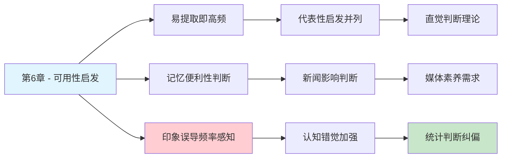

# 第6章 回忆的便利性

## 📍 章节定位

### 全书位置
> 第6章探讨可用性启发法（availability heuristic）——人们倾向于根据信息的易获取或易回忆程度来判断事件发生的频率或概率，导致高估容易想起的事件，低估难以回忆的事件。

- **全书核心问题**: 为什么人类的判断经常偏离理性？
- **本章回答的问题**: 人们如何根据记忆获取的便利程度判断事件频率或可能性？
- **角色类型**: 核心概念型（阐述可用性启发法机制及效应）
- **论证位置**: 与第5章代表性启发法并列，阐述两大核心直觉启发法则之一

### 章节序列
| 方向 | 章节标题 | 逻辑连接 |
|------|----------|----------|
| 前章 | [[第5章-直觉的判断]] | 与代表性启发法并列为两大主要非统计直觉判断方式 |
| 后章 | [[第7章-过度自信的锚点]] | 两者均属直觉判断偏差，可结合形成锚定与可用性互动效应 |
| 整书 | [[思考快与慢-丹尼尔·卡尼曼-拆解记录]] | 阐述重要认知偏误——可用性启发法 |

### 一句话定位
> 第6章揭示了人类如何因为记忆的易得性而高估近期或印象深刻的事件概率，展示了记忆特性对判断产生的系统性影响。

---

## 🎯 核心观点

### 第一层：表层案例

| 案例名称 | 简要描述 | 页码 | 关键引文 |
|----------|----------|------|----------|
| 音字母词判断 | 判断以K开头的词多还是中间是K的词多 | p. — | "人们认为以K开头的单词更多，因为更容易回忆" |
| 新闻事件频率 | 空难、地震等事件发生频率的主观判断 | p. — | "最近报道多的事件被认为发生频率高" |
| 朋友特征评估 | 回忆朋友的例子来判断其人格特质 | p. — | "容易想到例子的特质被认为更明显" |
| 健康风险估计 | 根据近期见闻判断疾病发生率 | p. — | "刚听说的病容易认为是流行病" |

### 第二层：中层机制

| 机制名称 | 组成要素 | 因果链条 | 证据来源 |
|----------|----------|----------|----------|
| 可用性启发法 | 记忆提取便利性 + 覃性判断 | 易提取→认为频繁→判断频率 | 记忆提取实验分析 |
| 情感印记强度 | 情感强度 -> 提取便利 | 情绪强烈→易于记忆→频率高估 | 神经认知心理学研究 |
| 时间衰减效应 | 回忆便利递减 + 时效性影响 | 近期事件→便利回忆→频率高估 | 心理物理学实验 |
| 曝光频率偏差 | 媒体曝光→记忆便利性 | 大众传媒→重复曝光→频率高估 | 传媒心理学研究 |

### 第三层：底层规律

| 规律陈述 | 抽象层级 | 知识连接 | 适用范围 |
|----------|----------|----------|----------|
| 心理便利性原则 | 认知资源限制规律 | [[认知加工理论]], [[记忆机制理论]] | 人类判断决策领域 |
| 提取可得性偏向 | 人类记忆加工特性 | [[回忆心理学]], [[遗忘曲线理论]] | 认知处理机制 |
| 经验易得性偏差 | 信息处理启发式 | [[心理捷径法则]], [[直觉判断模式]] | 所有判断领域 |

---

## 💬 降维翻译

### 观点1: 可用性启发法的本质

#### 原文表达
> "我们可以很自然地把事件容易被回忆的程度与事件发生的概率联系起来。也就是说，我们的大脑倾向于认为那些容易想起来的事情是更常见的。这种判断方式是可用性启发法的核心特征。"

> p.—

#### 降维翻译（中学生能懂）
我们判断一件事发生频率时，大脑会自动寻找相关的事例：
- 看电视上火灾新闻很多 → 觉得火灾比以前多
- 容易想到身边有肺癌患者 → 觉得肺癌比例很高
- 很难想起坐火车事故 → 觉得火车比飞机安全得多（实际上不是）

其实这是我们的记忆在“骗”我们。印象深刻的、最近看到的总是最先冒出来，但这不代表真的更常见。

#### 日常类比（奶奶能懂）
就像看集市买卖，你觉得今天卖鱼的小贩多还是卖菜的多？如果你能马上想起很多个卖鱼的，就认为他们多，虽然实际上可能不是。因为能马上想起的容易让你觉得“到处都是”。

#### 检验
- Q: 如果一个中学生问你这是什么意思？
- A: 人总是更容易被能马上想到的事例影响判断，但这可能不是真实频率。

### 观点2: 记忆便利性对判断的影响

#### 原文表达
> "我们判断事件的频率时，经常是基于从记忆中提取相关信息的难易程度。如果一个例子很容易被回忆起来，我们就会错误地估计该事件的发生频率要高过实际水平。"

> p.—

#### 降维翻译（中学生能懂）
比如：
- 刚看了一篇车祸报道，就觉得开车太危险了
- 经常梦见被蛇咬，就觉得现实中被蛇咬是常事
- 身边朋友离婚多，就觉得现在离婚很普遍

这些都是因为那些例子在脑中最明显最易回忆，但并不能代表实际情况。

#### 日常类比（奶奶能懂）
就像村里最近谁家出了事，就会觉得最近多灾多难。其实只是因为记得清印象深刻的事情容易被想到，不代表真的频率变多了。

#### 检验
- Q: 如果一个中学生问你这是什么意思？
- A: 记得清楚的事情容易被认为更常发生，这是人的判断陷阱。

---

## ✨ 金句库

### 原书金句
| 金句 | 页码 | 适用场景 |
|------|------|----------|
| "易提取即高频率" | p.— | 认知偏误科普 |
| "记忆便利性误导概率判断" | p.— | 记忆心理学文章 |
| "印象深刻的不等于常见的" | p.— | 理性思维普及 |

### 降维金句
| 金句 | 来源观点 | 适用场景 |
|------|----------|----------|
| "能记住的 ≠ 经常发生" | 可用性偏差 | 概率判断提醒 |
| "印象深刻不是普遍现象" | 记忆影响判断 | 批判思维培养 |
| "容易想起不代表经常出现" | 提取便利性错觉 | 理性分析 |

## 🔗 当下映射

### 💰 财富应用
| 场景 | 具体行动 | 预期效果 | 风险提示 |
|------|----------|----------|----------|
| 投资风险评估 | 不仅依据近期市场波动判断风险 | 减少情绪化投资决策 | 需要数据和历史视野 |
| 消费决定 | 避免因近期新闻而冲动消费同类产品 | 降低冲动消费 | 逆向思维有一定认知负荷 |
| 保险购买 | 利用客观数据而非新闻影响选择 | 更合理配置保险 | 忽视新兴威胁可能性 |

### 💼 职场应用
| 场景 | 具体行动 | 所需能力 | 适用职级 |
|------|----------|----------|----------|
| 人才评估 | 不仅基于突出表现或缺点判断 | 数据导向思维 | 管理层 |
| 风险管理 | 引入历史数据校正直觉风险判断 | 数据分析能力 | 执行级以上 |
| 项目规划 | 全面调研而非依据典型案例 | 系统性调研 | 项目经理 |

### 🏠 生活应用
| 场景 | 具体行动 | 可行性 | 见效时间 |
|------|----------|--------|----------|
| 心理健康管理 | 理解担忧可能因新闻过多影响 | 高 | 即时见效 |
| 学习方法改进 | 了解记忆偏差改进学习策略 | 中 | 数周见效 |
| 社交圈拓宽 | 避免因少数案例对群体刻板印象 | 中 | 数月见效 |

### 72小时行动计划
1. **明天可以做的第一件事**: 询问自己今天做过的某个判断是否受最近记忆的影响：这件事真的是大概率发生的吗？
2. **本周内可以尝试的事**: 针对一个重大决定，不直接根据印象而查找客观数据或询问更多样本
3. **需要准备资源才能做的事**: 建立个人认知偏误日志，记录受可用性启发影响的案例

---

## 🕸️ 章节关联

### 向上关联 → 整书
- **贡献**: 阐释第二种主要的直观判断启发法，完善认知偏误理论体系
- **位置**: 与代表性启发法共同构成直观判断的主要模式

### 横向关联 → 章节间
| 章节编号 | 章节标题 | 关联类型 | 连接描述 |
|----------|----------|----------|----------|
| 第5章 | 直觉的判断 | 并列 | 代表性启发 vs 可用性启发，两大主要非统计直觉法 |
| 第3章 | 惰性思维与延迟折扣 | 承接 | 系统2懒惰导致未纠正系统1的判断偏差 |
| 第7章 | 过度自信的锚点 | 合作 | 锚点可能影响可用性判断的标准参照 |
| 第25章 | 更多信息未必有用 | 因果 | 过多信息可能使错误事件更易提取 |

### 向下关联 → 具体应用
| 应用场景 | 难度 | 前置知识 |
|----------|------|----------|
| 媒体信息判断 | 中 | 基础媒体素养 |
| 数据驱动决策 | 高 | 统计数据处理能力 |
| 反偏误训练 | 高 | 系统思维训练 |

### 跨书关联 → 知识网络
| 书籍 | 概念 | 关系 | 备注 |
|------|------|------|------|
| [[思考快与慢-丹尼尔·卡尼曼-拆解记录]] | 可用性启发法 | 同源 | 理论源头 |
| [[清醒思考的艺术-多贝里-拆解记录]] | 第32条现成偏误 | 系列化应用 | 可用性启发法的具体表现之一 |
| [[影响力-西奥迪尼-拆解记录]] | 社会认同原理 | 关联 | 可用性的社会版本：容易想起的代表常见 |
| [[03-Resources/书籍拆解/1-拆解记录/心理学与生活-津巴多-拆解记录]] | 记忆与认知错觉 | 相容 | 记忆机制支持理论解读 |

### 关联可视化

---

## ❓ 问答设计

### Q1: [记忆型问题]
**认知层次**: 记忆
**难度**: 低
**描述**: 什么是可用性启发法？
**答案要点**:
- 基于回忆便利性判断事件频率
- 易想起 ≠ 高频率
- 非统计推理方式

### Q2: [理解型问题]
**认知层次**: 理解
**难度**: 中
**描述**: 为什么容易回忆的事件被认为是更常见的？
**答案要点**:
- 记忆提取便利性的误导
- 节省认知资源机制
- 系统2未做深入统计

### Q3: [应用型问题]
**认知层次**: 应用
**难度**: 中
**描述**: 如何避免可用性启发的影响？
**答案要点**:
- 查找客观统计数据
- 寻找反例验证印象
- 设置冷静观察期

### Q4: [分析型问题]
**认知层次**: 分析
**难度**: 中
**描述**: 可用性启发与代表性启发的关系？
**答案要点**:
- 都是非统计启发式判断
- 相依性判断 vs 频率判断
- 同为系统1简化处理模式

### Q5: [创造型问题]
**认知层次**: 创造
**难度**: 高
**描述**: 设计一个检测个人可用性启发倾向的测试？
**答案要点**:
- 设置对比性判断题目
- 混合真实数据进行测试
- 评估印象与统计的偏离程度

### Q6: [理解型问题]
**认知层次**: 理解
**难度**: 中
**描述**: 为什么新闻报道会影响我们判断事件频率？
**答案要点**:
- 媒体曝光增加记忆可用性
- 重复曝光增强印象深刻度
- 可提取度影响频率评估

### Q7: [应用型问题]
**认知层次**: 应用
**难度**: 中
**描述**: 在投资决策中如何防范可用性偏差？
**答案要点**:
- 基于历史长周期数据分析
- 不被突发事件影响决策
- 建立客观风险评估体系

### Q8: [分析型问题]
**认知层次**: 分析
**难度**: 高
**描述**: 可用性启发与情感记忆的关系？
**答案要点**:
- 情绪化事件易于记忆
- 情绪影响回忆便利性
- 导致情感化频率估计

### Q9: [理解型问题]
**认知层次**: 理解
**难度**: 高
**描述**: 时间间隔如何影响可用性偏差？
**答案要点**:
- 近期事件可用性更高
- 典型事件即使久远也可用
- 媒介可以延长影响时限

### Q10: [创造型问题]
**认知层次**: 创造
**难度**: 高
**描述**: 如何设计认知训练减少可用性偏差？
**答案要点**:
- 意识提升与实例演练
- 数据思维与统计学习
- 定期反思与模式校正

---
