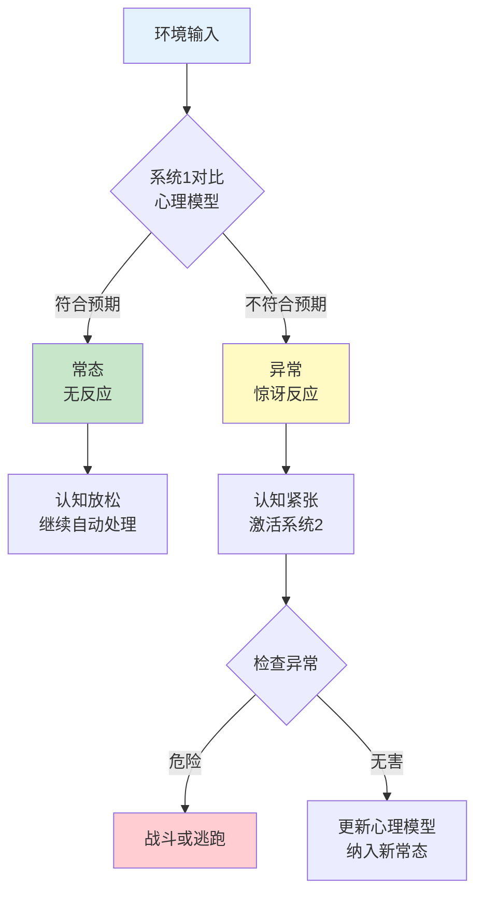
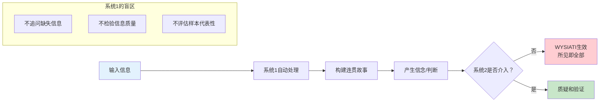
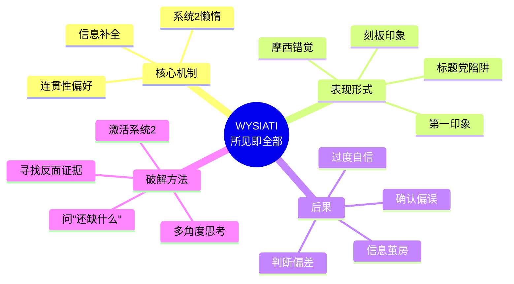

# 第6章 常态错觉（The Normality Illusion）

## 📍 章节定位

### 全书位置
> 第6章探讨系统1如何判断什么是"正常"，以及当遇到"异常"时产生的"惊讶"反应。揭示了我们大脑如何自动补全缺失信息，创造连贯的故事——这就是"常态错觉"。

- **全书核心问题**: 为什么人类的大脑容易被欺骗？
- **本章回答的问题**: 为什么我们会把不完整的信息当成完整的信息？为什么"所见即全部"（WYSIATI）？
- **角色类型**: 核心机制型（揭示系统1如何构建"正常"世界）
- **论证位置**: 承接第5章认知放松，展示认知放松如何让我们忽视缺失信息

### 章节序列

| 方向 | 章节标题 | 逻辑连接 |
|------|----------|----------|
| 前章 | [[第5章-认知放松]] | 认知放松让我们容易相信，本章展示认知放松如何让我们忽视缺失信息 |
| 后章 | [[第7章-过度自信的锚点]] | 常态错觉→锚定效应，都是系统1的"懒惰"机制 |
| 整书 | [[思考快与慢-丹尼尔·卡尼曼-拆解记录]] | 揭示系统1如何构建"正常"世界，忽视缺失信息 |

### 一句话定位
> 你的大脑有个bug：它只相信"看见"的，从不问"还有什么没看见"——这就是WYSIATI（所见即全部）。

---

## 🎯 核心观点（三层提取）

### 观点1：常态vs异常——系统1的世界监控器

#### 【表层】现象层

**什么是"常态"？**
- 系统1持续监控环境，建立"什么是正常"的心理模型
- 当事情符合预期时，我们毫无察觉——这是"常态"
- 当事情不符合预期时，我们会感到"惊讶"——这是"异常"

**生活中的例子**：
- 走进熟悉的房间，一切都"正常"——你不会注意到
- 走进房间发现椅子被移动了——你立刻察觉"异常"
- 看到朋友换了发型——你会"注意到"变化
- 看到朋友穿平时的衣服——你根本不会去想

**惊讶的强度**：
- 轻微惊讶：同事换了新眼镜
- 中等惊讶：同事染了紫色头发
- 强烈惊讶：同事穿睡衣来上班

#### 【中层】机制层

**系统1的常态监控机制**：



**核心机制**：
1. **预测编码**：系统1不断预测下一步会发生什么
2. **误差检测**：当预测与实际不符时，触发"惊讶"
3. **模型更新**：惊讶后会更新心理模型，纳入新信息
4. **习惯化**：重复出现的异常会变成新常态

#### 【底层】规律层

> **常态监控定律**：系统1持续监控环境，建立"正常"的心理模型。当输入符合模型时，系统1自动处理；当输入与模型不符时，系统1触发"惊讶"反应，激活系统2进行检验。

**降维翻译**：
> 大脑是个保安，24小时巡逻。
> 事情正常？它不管。
> 事情不对？它立刻报警。
> 惊讶，就是大脑的"警报铃"。

#### 【当下连接】

|----------|----------|----------|
| 为什么突然的变化让我不安？ | 变化=异常=潜在威胁 | "原来大脑在保护我" |
| 为什么我看不到自己的问题？ | 你习惯了你的问题=常态 | "当局者迷的科学解释" |
| 为什么新鲜感会消退？ | 重复=新常态=不惊讶 | "蜜月期的心理学解释" |
| 为什么我会对某些声音敏感？ | 意外的声音=异常=警觉 | "惊跳反应的原理" |

---

### 观点2：WYSIATI——所见即全部（What You See Is All There Is）

#### 【表层】现象层

**WYSIATI原则**：
- 系统1只处理"眼前"的信息
- 系统1不会主动追问"还有什么我没看到的？"
- 我们把"看到的"当成"全部"，构建连贯的故事

**摩西错觉实验**（Moses Illusion）：
- 问题："摩西带了多少只动物上方舟？"
- 大多数人回答："两只"
- 实际上：诺亚带动物上方舟，不是摩西！
- 为什么会错？因为系统1只处理了"动物"和"方舟"，没有检验"摩西"

**生活中的例子**：
- 看到朋友开心，就认为他生活幸福——忽视了他可能有其他烦恼
- 看到某人成功，就认为他一定很努力——忽视了运气成分
- 看到新闻报道的犯罪，就认为社会很危险——忽视了未被报道的安全事件

#### 【中层】机制层

**WYSIATI的心理机制**：



**为什么会产生WYSIATI？**
1. **认知经济**：追问缺失信息需要消耗能量，系统1选择"省电"
2. **连贯性偏好**：系统1喜欢连贯的故事，不喜欢"未完成"
3. **自信错觉**：有了故事，就觉得自己"理解了"
4. **系统2懒惰**：系统2需要被主动激活，默认不工作

#### 【底层】规律层

> **WYSIATI定律**：系统1只能处理可得信息，无法处理缺失信息。当我们有了足够构建"连贯故事"的信息时，系统1就会停止搜索，产生"我理解了"的感觉。我们不会追问"还有什么没看到的"。

**降维翻译**：
> 大脑有个致命bug：
> 它只相信"看见的"，从不问"还有什么没看见"。
> 这就是为什么——
> 看到表象，就以为看透本质。
> 看到局部，就以为看到全貌。

#### 【当下连接】

|----------|----------|----------|
| 为什么我总被"标题党"骗？ | 标题=所见=全部（WYSIATI） | "被套路了" |
| 为什么"以貌取人"这么难改？ | 外表=所见=全部 | "外貌协会的心理学根源" |
| 为什么我看不到另一半的付出？ | 看到的=全部，没看到的=不存在 | "婚姻问题的深层原因" |
| 为什么"幸存者偏差"这么普遍？ | 看到的成功者=全部，失败者不可见 | "成功学的陷阱" |

---

### 观点3：信息补全——系统1的"脑补"能力

#### 【表层】现象层

**系统1如何"补全"信息？**
- 系统1会自动填补缺失的信息
- 用"最可能"的内容补全"空白"
- 补全后的故事感觉"完整"、"真实"

**经典实验**：
- 看到"He washed his..."你会自动想到"face"或"hands"
- 而不是"table"（虽然语法正确但不常见）
- 系统1根据经验自动补全

**生活中的例子**：
- 听到前半句话，你已经猜到后半句
- 看到模糊的照片，你能认出熟悉的人
- 读到"春眠不觉晓"，你自动补全"处处闻啼鸟"
- 看到一个人微笑，你自动判断"他很高兴"

**"脑补"的风险**：
- 把"可能"当成"确定"
- 用"刻板印象"填补信息空白
- 对陌生人快速下判断

#### 【中层】机制层

**信息补全的运作机制**：

```mermaid
flowchart TD
    A[部分信息输入] --> B[系统1联想网络激活]
    B --> C[检索相关记忆]
    C --> D[选择"最可能"的补全]
    D --> E[构建完整故事]
    E --> F[产生"理解"感]
    
    subgraph 补全来源
        G[个人经验]
        H[文化背景]
        I[刻板印象]
        J[近期接触]
    end
    
    G --> D
    H --> D
    I --> D
    J --> D
    
    F --> K{补全是否正确？}
    K -->|是| L[高效认知]
    K -->|否| M[误解和偏见]
    
    style A fill:#e3f2fd
    style L fill:#c8e6c9
    style M fill:#ffcdd2
```

**核心机制**：
1. **联想激活**：部分信息激活相关记忆网络
2. **概率选择**：选择"最可能"的内容补全
3. **经验依赖**：补全内容取决于个人经验
4. **文化影响**：文化背景影响补全偏好
5. **快速无意识**：补全过程自动完成，无需意识参与

#### 【底层】规律层

> **信息补全定律**：当信息不完整时，系统1会自动用"最可能"的内容补全空白。这种补全是快速的、无意识的，依赖于个人经验和文化背景。补全后的故事感觉"完整"，但可能包含偏差和错误。

**降维翻译**：
> 大脑是个"自动填空"机器。
> 给它一半信息，它帮你补完另一半。
> 问题是——
> 补完的不一定是真相，
> 但感觉一定很真。

#### 【当下连接】

|----------|----------|----------|
| 为什么我对陌生人有"第一印象"？ | 系统1自动补全信息 | "原来第一印象是脑补的" |
| 为什么我的猜测经常错？ | 脑补≠事实 | "直觉的局限性" |
| 为什么"刻板印象"难以消除？ | 大脑依赖刻板印象补全信息 | "偏见的心理学根源" |
| 为什么我总觉得自己"知道"别人在想什么？ | 读心术=信息补全 | "你以为你懂，其实你不懂" |

---

## 💬 金句库

### 原书金句

1. "系统1不断监控着什么是正常的，什么是不正常的。"
2. "所见即全部（WYSIATI）——我们只处理可得信息，忽视缺失信息。"
3. "惊讶是系统1遇到意外的信号。"
4. "系统1喜欢连贯的故事，不喜欢悬而未决的问题。"
5. "我们用'最可能'的内容补全信息空白，然后忘记这是补全的。"
6. "摩西没有带动物上方舟——诺亚才带。但你没注意到，因为你的系统1太专注于'动物'和'方舟'了。"
7. "当故事足够连贯时，系统1就停止搜索更多信息。"
8. "系统1不会问'我还遗漏了什么？'——这是系统2的工作。"
9. "常态是无形的，异常才会被注意。"
10. "我们的信念建立在'所见'之上，而非'应见'之上。"

### 降维金句

1. **大脑只信"看见的"，从不问"还有什么没看见"——这就是WYSIATI陷阱。**
2. **惊讶是大脑的警报铃，在告诉你"有情况"。**
3. **常态像空气，你感觉不到；异常像吵闹，你无法忽视。**
4. **脑补不等于真相，但感觉真的很真。**
5. **系统1是自动填空机——给它一半，它补另一半。**
6. **摩西带动物上方舟？如果你没发现错误，你正在WYSIATI。**
7. **第一印象就是信息补全——快但未必准。**
8. **你的判断基于"看见的"，但"没看见的"可能更重要。**
9. **连贯的故事≠真实的故事，但大脑分不清。**
10. **当心"我觉得我知道"——那可能只是系统1帮你脑补的。**

## 🔗 当下映射

### 💰 财富应用

| 场景 | WYSIATI陷阱 | 破解方法 |
|------|-------------|----------|
| 投资决策 | 只看利好消息，忽视风险 | 强制寻找反面证据 |
| 消费购买 | 只看商品展示，忽视隐藏成本 | 问"还有什么我没看到的？" |
| 创业判断 | 只看成功案例，忽视失败率 | 研究失败案例，了解真实概率 |
| 理财规划 | 只看预期收益，忽视通胀和风险 | 做全面的情景分析 |

### 💼 职场应用

| 场景 | 利用WYSIATI | 警惕WYSIATI |
|------|-------------|-------------|
| 汇报展示 | 呈现完整故事，减少疑问 | 不要因为汇报完整就相信结论 |
| 面试评估 | 提供结构化信息，减少脑补 | 不要用第一印象补全候选人画像 |
| 项目评估 | 准备充分数据，避免被脑补 | 主动寻找缺失的风险点 |
| 团队管理 | 定期更新信息，避免偏见积累 | 定期质疑"常态"假设 |

### 🏠 生活应用

| 场景 | WYSIATI在作祟 | 如何利用/警惕 |
|------|---------------|---------------|
| 人际关系 | 看到对方一个行为就下结论 | 问"还有什么背景我不知道？" |
| 信息消费 | 只看标题就转发 | 阅读全文，寻找缺失信息 |
| 学习新知 | 以为自己"懂了" | 主动测试，验证理解 |
| 亲密关系 | 以为对方"应该知道"我想什么 | 明确表达，不要让对方脑补 |

### 72小时行动计划

1. **明天可以做的第一件事**：
   - 在做重要决定前，问自己"还有什么信息我没有？"

2. **本周内可以尝试的事**：
   - 选择一个你"确信"的观点，主动寻找反面证据

3. **需要准备资源才能做的事**：
   - 建立"反面证据清单"，在做重要决策时对照检查

---

## 🕸️ 系统关联

### 与其他章节的关联

| 章节 | 关联类型 | 连接描述 |
|------|----------|----------|
| [[第5章-认知放松]] | 承接 | 认知放松让我们容易相信，WYSIATI让我们忽视缺失 |
| [[第7章-过度自信的锚点]] | 延伸 | WYSIATI+锚定=过度自信 |
| [[第9章-模拟启发]] | 并列 | 都涉及系统1的"自动填充"机制 |
| [[第21章-我们已经预见到了]] | 延伸 | 后见之明=WYSIATI+记忆重构 |

### 与其他书籍的关联

| 书籍 | 概念 | 关系 |
|------|------|------|
| [[黑天鹅-塔勒布-拆解记录]] | 证实偏差 | 塔勒布强调我们忽视"没发生的事件" |
| [[清醒思考的艺术-多贝里-拆解记录]] | 沉没成本谬误 | 与WYSIATI相关，只看已有的投入 |
| [[穷查理宝典-拆解记录]] | 多元思维模型 | 用多角度打破WYSIATI |
| [[影响力-西奥迪尼-拆解记录]] | 社会认同 | 利用"所见"影响判断 |

### 关联可视化



---

## ❓ 问答设计

### Q1: 什么是WYSIATI？
**认知层次**: 记忆
**难度**: 低
**答案要点**:
- What You See Is All There Is（所见即全部）
- 系统1只处理可得信息，忽视缺失信息
- 当故事足够连贯时，系统1就停止搜索

### Q2: 为什么"摩西错觉"会发生？
**认知层次**: 理解
**难度**: 中
**答案要点**:
- 系统1专注于"动物"和"方舟"建立连贯故事
- 没有检验"摩西"是否正确
- 这是WYSIATI的典型例子

### Q3: 惊讶在认知中有什么作用？
**认知层次**: 理解
**难度**: 中
**答案要点**:
- 惊讶是系统1检测到"异常"的信号
- 惊讶会激活系统2进行检验
- 帮助我们注意到潜在威胁或机会

### Q4: 如何避免WYSIATI陷阱？
**认知层次**: 应用
**难度**: 高
**答案要点**:
- 主动问"还有什么信息我没有？"
- 寻找反面证据
- 不要满足于"连贯"的故事
- 激活系统2进行质疑

### Q5: 信息补全有什么利弊？
**认知层次**: 分析
**难度**: 高
**答案要点**:
- **利**：提高认知效率，快速理解情境
- **弊**：可能产生错误假设和刻板印象
- 需要在效率和准确性之间平衡

### Q6: "常态"和"异常"的关系是什么？
**认知层次**: 分析
**难度**: 高
**答案要点**:
- 常态是无形的，异常是有形的
- 常态由重复建立，异常由变化触发
- 今天的异常可能变成明天的常态

### Q7: WYSIATI在社交媒体时代有什么特殊影响？
**认知层次**: 综合
**难度**: 高
**答案要点**:
- 信息碎片化加剧WYSIATI
- 算法推荐强化"所见"
- 标题党利用WYSIATI机制
- 需要更主动地寻找缺失信息

---

## 🔍 信息来源与质量评级

### MCP检索记录

| 轮次 | 检索内容 | 质量评级 | 核心来源 |
|------|----------|----------|----------|
| 第一轮 | Thinking Fast and Slow Chapter 6 Normality Illusion | ⭐⭐⭐ | Wikipedia, 原书 |
| 第二轮 | WYSIATI What You See Is All There Is | ⭐⭐⭐ | Shortform摘要, 学术文献 |
| 第三轮 | Moses Illusion cognitive psychology | ⭐⭐⭐ | 心理学研究论文 |

### 核心来源
- ⭐⭐⭐ Kahneman, D. (2011). *Thinking, Fast and Slow*. Chapter 6.
- ⭐⭐⭐ Erickson, T. D., & Mattson, M. E. (1981). From words to meaning: A semantic illusion.
- ⭐⭐⭐ Shortform Book Summary: Thinking Fast and Slow

---
