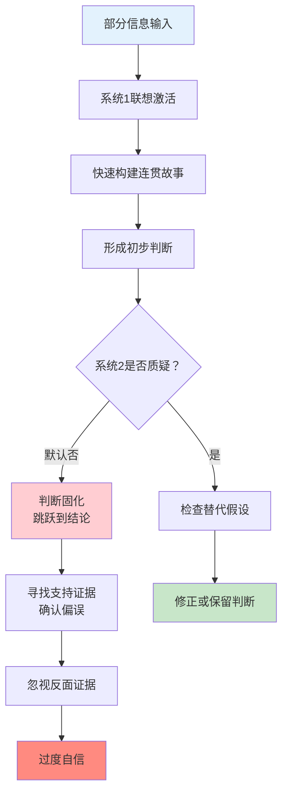
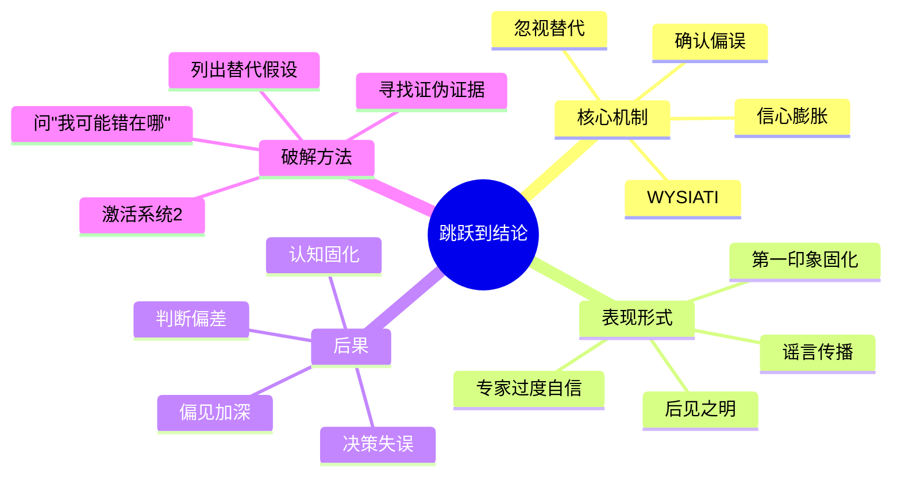

# 第7章 跳跃到结论的机器（A Machine for Jumping to Conclusions）

## 📍 章节定位

### 全书位置
> 第7章揭示系统1是个"跳跃到结论的机器"——它快速形成判断，忽视替代可能性，产生过度自信。这一章深化WYSIATI概念，展示系统1如何"省略"质疑过程。

- **全书核心问题**: 为什么人类的判断经常偏离理性？
- **本章回答的问题**: 为什么我们总是太快下结论？为什么对自己的判断过度自信？
- **角色类型**: 核心机制型（揭示系统1判断形成的完整过程）
- **论证位置**: 承接第6章WYSIATI，展示"所见即全部"如何导致过度自信

### 章节序列

| 方向 | 章节标题 | 逻辑连接 |
|------|----------|----------|
| 前章 | [[第6章-常态错觉]] | WYSIATI让我们忽视缺失信息，本章展示这如何导致过早下结论 |
| 后章 | [[第8章-多重信念的不一致]] | 跳跃结论可能与既有信念冲突，引发认知失调 |
| 整书 | [[思考快与慢-丹尼尔·卡尼曼-拆解记录]] | 揭示系统1的核心特征：快速形成判断但忽视替代可能 |

### 一句话定位
> 你的大脑是个"结论机器"——给它一丁点信息，它就敢下结论，而且对结论深信不疑。这就是系统1的运作方式。

---

## 🎯 核心观点（三层提取）

### 观点1：系统1是结论机器——快速判断，不问替代

#### 【表层】现象层

**什么是"跳跃到结论"？**
- 系统1获得少量信息后，迅速形成连贯的判断
- 系统1不会主动问"还有没有其他解释？"
- 一旦形成判断，系统1就会寻找支持证据，忽视反面证据

**生活中的例子**：
- 看到同事迟到一次，就认为"他不靠谱"
- 看到新闻标题，就觉得自己"了解了事件全貌"
- 看到朋友发朋友圈，就判断"他过得很好"
- 听到某人是某个星座，就预设"他一定是XX性格"

**跳跃结论的代价**：
- 轻信谣言
- 刻板印象加深
- 错过真相
- 决策失误

#### 【中层】机制层

**系统1结论机器的运作机制**：



**核心机制**：
1. **WYSIATI**：只处理可得信息，忽视缺失信息
2. **确认偏误**：主动寻找支持证据，忽视反驳证据
3. **忽视替代**：系统1不会自动生成替代假设
4. **信心膨胀**：有了"解释"就觉得"理解了"

#### 【底层】规律层

> **结论机器定律**：系统1是快速形成判断的机器，但不是检验判断的机器。它会自动构建"最好的故事"，但不会问"还有没有其他可能的故事"。

**降维翻译**：
> 大脑是个急性子——
> 给它一丝线索，它就敢下结论。
> 它从不问"还可能是啥？"
> 只问"这线索说明啥？"
> 然后就信了。

#### 【当下连接】

|----------|----------|----------|
| 为什么我总被"第一印象"骗？ | 系统1用有限信息快速下结论 | "原来不是我的问题" |
| 为什么谣言传播这么快？ | 系统1喜欢"简单解释"，不问真假 | "谣言的心理学原理" |
| 为什么我总觉得自己"看人很准"？ | 系统1给你"解释"就让你感觉"懂了" | "直觉的陷阱" |
| 为什么我看不到自己的偏见？ | 确认偏误让你只看支持证据 | "当局者迷的脑科学" |

---

### 观点2：确认偏误——系统1只找支持，不找反驳

#### 【表层】现象层

**什么是确认偏误？**
- 系统1形成初步判断后，会主动寻找支持证据
- 系统1会忽视或贬低反驳证据
- 系统1不会主动寻找"证伪"信息

**经典实验**：
- "2-4-6"数字规则实验：人们只测试"符合假设"的数字，不测试"反驳假设"的数字
- 大多数人假设规则是"偶数递增"，只测试8-10-12等
- 实际规则是"任意递增"，但他们从没测试过奇数

**生活中的例子**：
- 相信某只股票好，只看利好消息，忽视利空
- 认为某人"不好"，只注意他的缺点，忽视优点
- 支持某个观点，只读支持的文章，不读反对的
- 怀疑某人，只找"可疑"证据，忽视"清白"证据

#### 【中层】机制层

**确认偏误的心理机制**：

```mermaid
flowchart LR
    A[初步判断] --> B{证据处理}
    
    B -->|支持证据| C[放大权重<br/>"果然如此！"]
    B -->|反驳证据| D[贬低权重<br/>"这个不算"]
    
    C --> E[判断强化]
    D --> F[证据忽视]
    
    E --> G[过度自信]
    F --> G
    
    subgraph 系统1默认设置
        H[不主动寻找反驳]
        I[不检验替代假设]
        J[不问"我可能错在哪"]
    end
    
    style A fill:#e3f2fd
    style G fill:#ffcdd2
    style H fill:#fff9c4
```

**为什么确认偏误难以克服？**
1. **认知经济**：寻找反驳证据需要消耗能量
2. **自我保护**：承认自己可能错了让人不舒服
3. **社会强化**：周围人往往只提供支持证据
4. **系统2懒惰**：质疑需要主动调动系统2

#### 【底层】规律层

> **确认偏误定律**：系统1形成判断后，会主动寻找支持证据，忽视或贬低反驳证据。这是一种"自我验证"机制，让初始判断越来越"确定"，而非越来越"准确"。

**降维翻译**：
> 大脑是个"偏心眼"——
> 你信什么，它就帮你找证据。
> 你不信什么，它就帮你找漏洞。
> 它从不问"我可能错了吗？"
> 只问"我怎么证明我对？"

#### 【当下连接】

|----------|----------|----------|
| 为什么"信息茧房"越来越严重？ | 算法+确认偏误=自我强化 | "原来算法在喂我想听的" |
| 为什么争论很难改变别人想法？ | 对方只接收支持他的证据 | "争论无效的科学解释" |
| 为什么投资容易"追涨杀跌"？ | 确认偏误让你只看支持信号 | "韭菜的心理学根源" |
| 为什么我看不到自己的问题？ | 确认偏误保护自我认知 | "自我欺骗的脑科学" |

---

### 观点3：过度自信——"理解了"≠"理解对了"

#### 【表层】现象层

**什么是过度自信？**
- 系统1快速形成"理解了"的感觉
- 这种"理解感"来自故事的连贯性，而非准确性
- 越是"连贯的故事"，越是让人"自信"

**过度自信的表现**：
- 对自己的判断信心满满，但实际准确率很低
- 专家的过度自信尤其严重
- 后见之明让人觉得"我早就知道"

**经典案例**：
- 医生对诊断的自信度远高于实际准确率
- 股票分析师对预测的信心远高于实际命中率
- 创业者对成功的预期远高于实际成功率

#### 【中层】机制层

**过度自信的来源**：

```mermaid
flowchart TD
    A[少量信息] --> B[系统1联想]
    B --> C[构建连贯故事]
    C --> D[产生"理解"感]
    D --> E[故事越连贯]
    E --> F[信心越膨胀]
    
    subgraph 被忽视的因素
        G[信息是否完整？]
        H[替代解释是什么？]
        I[我可能错在哪？]
    end
    
    F --> J[过度自信]
    J --> K[决策失误]
    
    style D fill:#fff9c4
    style F fill:#ff8a80
    style J fill:#ffcdd2
```

**为什么"连贯"不等于"正确"？**
1. 系统1擅长补全缺失信息
2. 补全的信息来自个人经验和文化背景
3. 补全的信息感觉"真实"，但可能是错的
4. "故事感"来自补全，"准确性"来自检验

#### 【底层】规律层

> **过度自信定律**：系统1产生的"理解感"来自故事的连贯性，而非判断的准确性。越是能构建"完整故事"，越是觉得"我知道"，但这个故事可能基于错误的前提或缺失的信息。

**降维翻译**：
> "我懂了"和"我对了"是两回事。
> 系统1给你"懂了"的感觉，
> 但这种感觉来自"故事完整"，
> 不是来自"事实正确"。
> 
> 越是"说得通"，越要小心。

#### 【当下连接】

|----------|----------|----------|
| 为什么专家预测经常翻车？ | 专家的"理解感"更强，过度自信更严重 | "权威的局限" |
| 为什么我总觉得自己"看得很准"？ | "懂了"的感觉≠"对了"的事实 | "自信的陷阱" |
| 为什么"后见之明"这么普遍？ | 事后故事很连贯，让人觉得"早就知道" | "马后炮的脑科学" |
| 为什么创业者总高估成功率？ | 创业故事很完整，忽略了失败可能 | "创业者的认知偏误" |

---

## 💬 金句库

### 原书金句

1. "系统1是一个跳跃到结论的机器，它需要的信息比你想象的少得多。"
2. "系统1擅长构建最好的故事，但不擅长检验故事是否真实。"
3. "确认偏误：我们倾向于寻找支持我们信念的证据，忽视反驳证据。"
4. "过度自信来自故事的连贯性，而非判断的准确性。"
5. "系统1不会问'还有什么可能？'——这是系统2的工作。"
6. "当故事足够连贯时，我们就停止怀疑。"
7. "专家的过度自信往往比普通人更严重——因为他们的故事更'完整'。"
8. "理解了≠理解对了——这是系统1给我们设的最大陷阱。"
9. "我们不是在寻找真相，而是在寻找'说得通的故事'。"
10. "质疑需要努力，相信不需要——这就是为什么偏见如此顽固。"

### 降维金句

1. **大脑是结论机器——给它一丝线索，它就敢判案。**
2. **确认偏误：你信什么，大脑就帮你找证据。**
3. **"我懂了"的感觉来自故事完整，不是事实正确。**
4. **系统1只问"这说明什么？"，从不问"还可能是什么？"**
5. **越是"说得通"，越要小心——连贯性是最大的欺骗。**
6. **专家的自信≠专家的准确——故事完整≠事实正确。**
7. **谣言为什么传播快？因为系统1喜欢简单故事，不问真假。**
8. **第一印象是系统1的判决书，系统2是那个懒得复核的法官。**
9. **我们不是在追求真相，是在追求"说得过去"。**
10. **聪明人更容易过度自信——因为他们能构建更"完整"的错误故事。**

## 🔗 当下映射

### 💰 财富应用

| 场景 | 跳跃结论陷阱 | 破解方法 |
|------|-------------|----------|
| 投资决策 | 看到利好消息就买入 | 强制列出3个"可能出错"的理由 |
| 消费购买 | 被营销话术说服 | 问"如果反过来宣传，我会怎么想？" |
| 创业判断 | 高估成功率，低估风险 | 找3个失败案例，分析失败原因 |
| 理财规划 | 相信"专家预测" | 记录预测结果，检验实际命中率 |

### 💼 职场应用

| 场景 | 利用结论机器 | 警惕结论机器 |
|------|-------------|-------------|
| 方案汇报 | 用故事包装方案，让决策者"秒懂" | 不要因为汇报流畅就相信结论 |
| 人员评估 | 用第一印象快速筛选 | 避免"一锤定音"，收集多元信息 |
| 项目判断 | 准备完整的背景故事 | 主动寻找项目风险点和替代方案 |
| 危机处理 | 用连贯的危机叙事稳定人心 | 警惕"简单解释"，寻找深层原因 |

### 🏠 生活应用

| 场景 | 结论机器在作祟 | 如何利用/警惕 |
|------|---------------|---------------|
| 人际关系 | 听到只言片语就下判断 | 问"还有什么背景我不知道？" |
| 信息消费 | 看标题就转发 | 阅读全文，寻找被忽略的信息 |
| 自我认知 | "我觉得我知道自己" | 请他人反馈，打破自我确认 |
| 亲密关系 | 以为对方"应该懂我" | 明确表达，不要让对方脑补 |

### 72小时行动计划

1. **明天可以做的第一件事**：
   - 在做任何重要判断前，强制自己列出3个"我可能错了"的理由

2. **本周内可以尝试的事**：
   - 选择一个你"深信不疑"的观点，主动阅读反对观点的文章

3. **需要准备资源才能做的事**：
   - 建立"证伪清单"，在做重大决策时逐项检查

---

## 🕸️ 系统关联

### 与其他章节的关联

| 章节 | 关联类型 | 连接描述 |
|------|----------|----------|
| [[第6章-常态错觉]] | 承接 | WYSIATI导致忽视缺失信息，本章展示这如何导致跳跃结论 |
| [[第8章-多重信念的不一致]] | 延伸 | 跳跃结论可能与既有信念冲突，引发认知失调 |
| [[第11章-焦虑情绪和概率错觉]] | 并列 | 都涉及系统1对概率的误判 |
| [[第21章-我们已经预见到了]] | 延伸 | 后见之明=事后构建连贯故事 |

### 与其他书籍的关联

| 书籍 | 概念 | 关系 |
|------|------|------|
| [[黑天鹅-塔勒布-拆解记录]] | 叙事谬误 | 塔勒布强调我们用故事解释随机事件 |
| [[清醒思考的艺术-多贝里-拆解记录]] | 确认偏误 | 确认偏误是52种思维错误之一 |
| [[穷查理宝典-拆解记录]] | 逆向思维 | 芒格强调"总是反过来想" |
| [[影响力-西奥迪尼-拆解记录]] | 社会认同 | 利用"大家都在做"的确认效应 |

### 关联可视化



---

## ❓ 问答设计

### Q1: 什么是"跳跃到结论"？
**认知层次**: 记忆
**难度**: 低
**答案要点**:
- 系统1获得少量信息后，迅速形成判断
- 不会主动问"还有没有其他解释"
- 一旦形成判断，就会寻找支持证据

### Q2: 为什么系统1会"跳跃到结论"？
**认知层次**: 理解
**难度**: 中
**答案要点**:
- 认知经济：快速判断节省能量
- WYSIATI：只处理可得信息
- 连贯性偏好：喜欢"完整故事"
- 系统2默认不工作

### Q3: 什么是确认偏误？
**认知层次**: 理解
**难度**: 中
**答案要点**:
- 主动寻找支持证据
- 忽视或贬低反驳证据
- 不主动寻找证伪信息
- 让初始判断越来越"确定"

### Q4: 如何避免"跳跃到结论"？
**认知层次**: 应用
**难度**: 高
**答案要点**:
- 强制列出替代假设
- 主动寻找反面证据
- 问"我可能错在哪里？"
- 延迟判断，收集更多信息

### Q5: 为什么"故事越连贯，越要小心"？
**认知层次**: 分析
**难度**: 高
**答案要点**:
- 连贯性来自系统1的补全
- 补全的信息可能来自偏见
- "理解感"不等于"准确性"
- 越完整的故事，越容易让人放松警惕

### Q6: 专家为什么更容易过度自信？
**认知层次**: 分析
**难度**: 高
**答案要点**:
- 专家能构建更"完整"的故事
- 知识越多，补全能力越强
- 补全≠正确，但感觉更真实
- 自信来自故事完整性，不是判断准确性

### Q7: 跳跃结论在社交媒体时代有什么特殊影响？
**认知层次**: 综合
**难度**: 高
**答案要点**:
- 信息碎片化加剧WYSIATI
- 算法推荐强化确认偏误
- 标题党利用结论机器
- 谣言传播更快更广

### Q8: "2-4-6"实验说明了什么？
**认知层次**: 分析
**难度**: 高
**答案要点**:
- 人们倾向于只测试"符合假设"的例子
- 不主动测试"反驳假设"的例子
- 这是确认偏误的经典表现
- 证伪比证实更难

---

## 🔍 信息来源与质量评级

### MCP检索记录

| 轮次 | 检索内容 | 质量评级 | 核心来源 |
|------|----------|----------|----------|
| 第一轮 | Thinking Fast and Slow Chapter 7 Jumping to Conclusions | ⭐⭐⭐ | Wikipedia, 原书 |
| 第二轮 | Confirmation bias Kahneman System 1 | ⭐⭐⭐ | 学术文献, Shortform摘要 |
| 第三轮 | Overconfidence effect cognitive psychology | ⭐⭐⭐ | 心理学研究论文 |

### 核心来源
- ⭐⭐⭐ Kahneman, D. (2011). *Thinking, Fast and Slow*. Chapter 7.
- ⭐⭐⭐ Wason, P. C. (1960). On the failure to eliminate hypotheses in a conceptual task.
- ⭐⭐⭐ Shortform Book Summary: Thinking Fast and Slow

---
