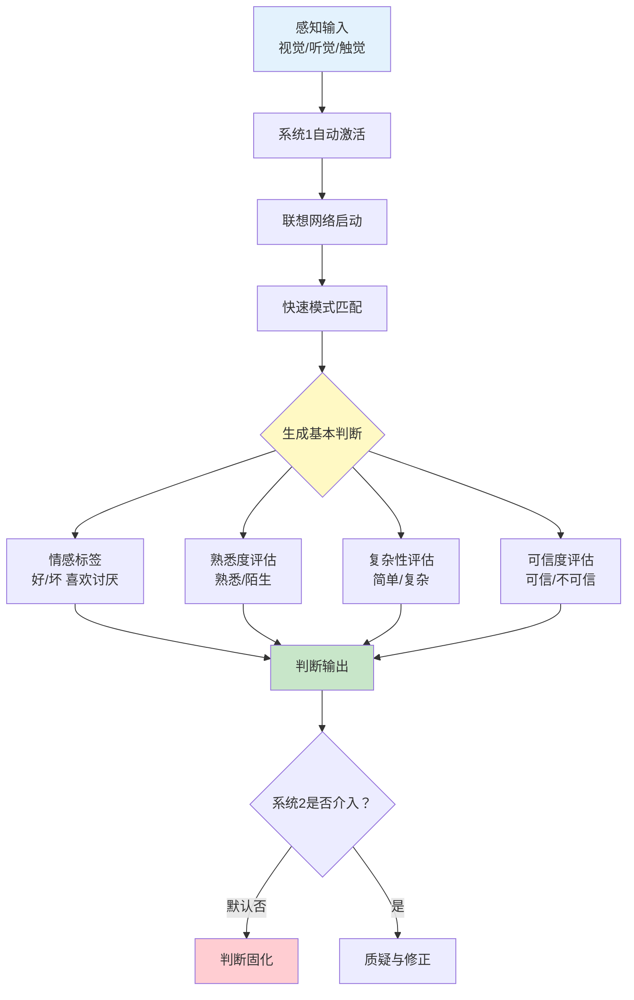
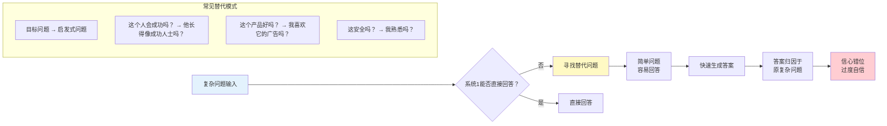
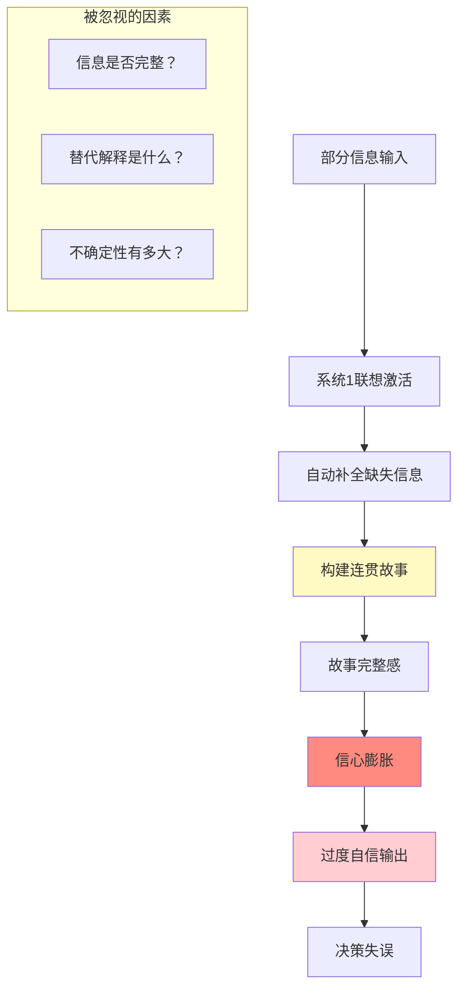
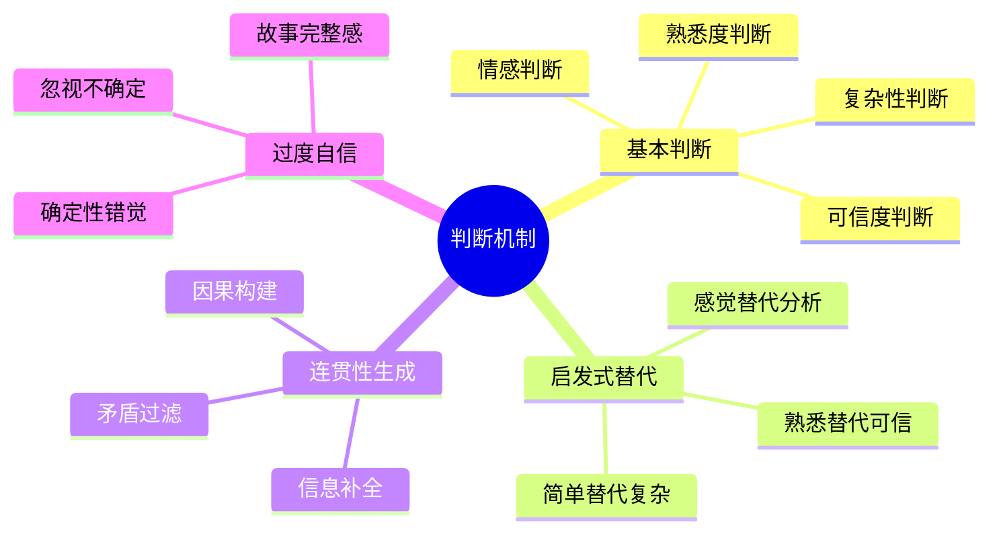

# 第8章 判断是怎样进行的（How Judgments Happen）

## 📍 章节定位

### 全书位置
> 第8章揭示系统1如何快速生成"基本判断"——一种无需意识参与的自动化评估，包括好/坏、喜欢/厌恶、简单/复杂等二元评估。这种判断机制是所有更复杂决策的基础。

- **全书核心问题**: 为什么人类的判断经常偏离理性？
- **本章回答的问题**: 判断是如何在大脑中产生的？系统1如何进行"基本判断"？
- **角色类型**: 核心机制型（揭示判断形成的底层机制）
- **论证位置**: 承接第7章跳跃结论，展示判断的"原材料"是如何生成的

### 章节序列

| 方向 | 章节标题 | 逻辑连接 |
|------|----------|----------|
| 前章 | [[第7章-跳跃到结论的机器]] | 前章展示系统1如何下结论，本章展示判断的基础机制 |
| 后章 | [[第9章-模拟启发]] | 判断之后，大脑如何进行"如果...会怎样"的模拟 |
| 整书 | [[思考快与慢-丹尼尔·卡尼曼-拆解记录]] | 揭示判断形成的底层心理机制 |

### 一句话定位
> 你的大脑每秒都在做"基本判断"——好还是坏？喜欢还是讨厌？安全还是危险？这些判断在你意识到之前就已经完成了。

---

## 🎯 核心观点（三层提取）

### 观点1：基本判断——系统1的自动化评估

#### 【表层】现象层

**什么是"基本判断"？**
- 系统1自动进行的快速二元评估
- 无需意识参与，瞬间完成
- 包括：好/坏、喜欢/厌恶、熟悉/陌生、简单/复杂

**生活中的例子**：
- 看到一张脸，0.1秒内判断"可信还是不可信"
- 听到一句话，瞬间感觉"有道理还是没道理"
- 进入一个房间，立刻判断"安全还是不安全"
- 看到一个产品，第一眼就知道"想买还是不想买"

**基本判断的特点**：
- 无法关闭——你无法"不看就判断"
- 速度快——比眨眼还快（约100毫秒）
- 无意识——你感觉不到自己在判断
- 持续不断——大脑从不停止

#### 【中层】机制层

**基本判断的形成机制**：

**四大基本判断类型**：

| 判断类型 | 触发条件 | 典型表现 | 影响范围 |
|----------|----------|----------|----------|
| 情感判断 | 任何刺激 | 瞬间好恶 | 所有决策 |
| 熟悉度判断 | 重复接触 | 越看越顺眼 | 偏好形成 |
| 复杂性判断 | 信息量 | 简单vs复杂 | 信息处理 |
| 可信度判断 | 面孔/语言 | 信任vs怀疑 | 社交决策 |

#### 【底层】规律层

> **基本判断定律**：系统1会自动对任何进入意识的刺激进行快速二元评估。这种评估是所有复杂判断和决策的基础，我们无法关闭它，但可以意识到它的存在。

**降维翻译**：
> 大脑是个"评价机器"——
> 任何东西进来，它就自动打分。
> 好还是坏？
> 喜欢还是讨厌？
> 安全还是危险？
> 你还没意识到，分数已经出来了。

#### 【当下连接】

|----------|----------|----------|
| 为什么第一印象这么重要？ | 系统1在0.1秒内就完成了基本判断 | "原来这么快" |
| 为什么我无法控制自己的喜好？ | 基本判断是自动的，无法关闭 | "不是我的错" |
| 为什么有些事一眼就知道？ | 系统1的模式匹配速度极快 | "直觉的奥秘" |
| 为什么重复的东西更顺眼？ | 熟悉度判断带来好感 | "曝光效应的原理" |

---

### 观点2：启发式判断——用简单问题替代复杂问题

#### 【表层】现象层

**什么是"启发式判断"？**
- 系统1用简单问题替代复杂问题
- 用"容易回答的"替代"难以回答的"
- 用"直觉感受"替代"理性分析"

**经典案例**：
- 问："这个人幸福吗？" → 答其实："他现在在笑吗？"
- 问："这家公司值得投资吗？" → 答其实："我喜欢他们的产品吗？"
- 问："这个政策好不好？" → 答其实："它对我有好处吗？"
- 问："这个人靠谱吗？" → 答其实："他长得像我认识的好人吗？"

**替代的后果**：
- 答非所问——你以为在回答A，实际在回答B
- 自信满满——简单问题容易答，信心被错位
- 偏差系统性——同样的替代模式反复出现

#### 【中层】机制层

**启发式替代的心理机制**：

**为什么系统1会替代问题？**
1. **认知经济**：复杂问题需要消耗大量能量
2. **速度优先**：进化要求快速反应，而非准确分析
3. **信息缺失**：复杂问题往往缺乏足够信息
4. **系统2懒惰**：慢系统默认不介入

#### 【底层】规律层

> **启发式替代定律**：当面对难以回答的问题时，系统1会自动寻找一个相关的、容易回答的替代问题。人们往往意识不到这种替代，以为自己回答的是原问题。

**降维翻译**：
> 大脑喜欢偷懒——
> 你问它"这个投资值不值？"
> 它回答"我喜不喜欢这个logo？"
> 
> 你问它"这个人怎么样？"
> 它回答"他笑得好看吗？"
> 
> 你以为在深思熟虑，
> 其实一直在答非所问。

#### 【当下连接】

|----------|----------|----------|
| 为什么我总被表面特征影响？ | 系统1用简单问题替代复杂问题 | "原来一直被骗" |
| 为什么"喜欢"不等于"好"？ | 喜欢是简单判断，好是复杂评估 | "两个问题的区别" |
| 为什么面试表现不等于工作能力？ | 面试感受替代了能力评估 | "HR的陷阱" |
| 为什么广告有效？ | 广告好感替代产品评估 | "营销的心理学" |

---

### 观点3：判断的连贯性与过度自信

#### 【表层】现象层

**什么是"判断连贯性"？**
- 系统1会自动构建连贯的故事
- 把零散信息整合成"说得通"的叙事
- 越连贯的故事，越让人自信

**连贯性的来源**：
- 信息补全——自动填补缺失信息
- 因果联想——自动构建因果关系
- 情感一致——让所有信息朝一个方向解释
- 忽视矛盾——自动过滤不一致的信息

**过度自信的表现**：
- 对自己的判断深信不疑
- 低估不确定性
- 忽视相反证据
- 相信"直觉"胜过数据

#### 【中层】机制层

**连贯性如何产生过度自信**：

**为什么"连贯"不等于"正确"？**
1. 补全的信息来自个人经验，可能错误
2. 连贯性来自心理需求，不是客观事实
3. 简单的故事往往忽略了复杂性
4. 越是"说得通"，越可能是事后合理化

#### 【底层】规律层

> **连贯性-自信定律**：系统1产生的"理解感"来自故事的连贯性，而非判断的准确性。越是能构建"完整故事"，越是觉得"我知道"，但这个故事可能基于错误的前提或缺失的信息。

**降维翻译**：
> "说得通"不等于"是对的"。
> 
> 系统1喜欢故事，
> 给它一点线索，
> 它就帮你编个完整的故事。
> 
> 故事越完整，
> 你越觉得自己懂了。
> 
> 但完整的故事，
> 可能全是脑补。

#### 【当下连接】

|----------|----------|----------|
| 为什么"后见之明"这么普遍？ | 事后构建的故事很连贯 | "马后炮的脑科学" |
| 为什么专家也经常预测错误？ | 连贯故事带来过度自信 | "权威的局限" |
| 为什么"简单解释"容易传播？ | 简单故事更容易构建连贯性 | "谣言的心理基础" |
| 为什么我总觉得"我早就知道"？ | 记忆会被重新构建成连贯故事 | "记忆的欺骗性" |

---

## 💬 金句库

### 原书金句

1. "系统1在无意识中持续产生基本判断，我们无法关闭这个过程。"
2. "当你无法回答一个困难问题时，你会回答一个相关的简单问题。"
3. "判断的信心来自故事的连贯性，而非判断的准确性。"
4. "基本判断是所有复杂决策的基础——好还是坏？喜欢还是讨厌？"
5. "系统1不区分'我想到的'和'我知道的'。"
6. "启发式判断让我们快速行动，但也带来系统性偏误。"
7. "熟悉度判断是曝光效应的基础——看得越多，越喜欢。"
8. "我们用'感觉'替代'思考'，而且往往意识不到。"
9. "连贯的故事不等于真实的解释——但感觉上一样。"
10. "判断的质量取决于替代问题的质量，而非原始问题。"

### 降维金句

1. **大脑每秒都在打分——好还是坏，你还没意识到，分数就出来了。**
2. **问复杂问题，答简单问题——这就是启发式判断的真相。**
3. **"我说得通"和"我是对的"是两回事。**
4. **连贯性是最大的欺骗——故事完整不等于事实正确。**
5. **系统1喜欢偷懒，用"喜欢"替代"好"，用"熟悉"替代"可信"。**
6. **第一印象是0.1秒的基本判断，不是深思熟虑。**
7. **熟悉的东西看着顺眼，不代表它真的好。**
8. **你以为在理性分析，其实在用直觉替代。**
9. **信心来自故事完整，不来自判断准确。**
10. **简单问题容易答，但答的不是你问的。**

## 🔗 当下映射

### 💰 财富应用

| 场景 | 基本判断陷阱 | 破解方法 |
|------|-------------|----------|
| 投资决策 | 把"喜欢产品"等同于"好股票" | 分开评估：产品体验≠投资价值 |
| 消费购买 | 被"熟悉感"影响品牌选择 | 列出3个客观标准再决定 |
| 创业判断 | 高估成功概率（故事太连贯） | 找失败案例，检验故事漏洞 |
| 理财规划 | 相信"说得通"的预测 | 问"我可能错在哪里？" |

### 💼 职场应用

| 场景 | 利用基本判断 | 警惕基本判断 |
|------|-------------|-------------|
| 方案汇报 | 用故事让方案"说得通" | 不要因为流畅就相信结论 |
| 人员评估 | 用第一印象快速筛选 | 避免"一眼定乾坤"，收集多元信息 |
| 项目判断 | 让复杂信息变得简单易懂 | 简化≠正确，保留关键复杂性 |
| 危机处理 | 用连贯叙事稳定人心 | 警惕"简单解释"，寻找深层原因 |

### 🏠 生活应用

| 场景 | 基本判断在作祟 | 如何利用/警惕 |
|------|---------------|---------------|
| 人际关系 | 0.1秒判断可信度 | 给第二次机会，打破第一印象 |
| 信息消费 | "说得通"就相信 | 问"证据是什么？" |
| 自我认知 | "我感觉对"就行动 | 区分"感觉"和"事实" |
| 亲密关系 | 熟悉感带来好感 | 利用曝光效应，也要警惕惯性 |

### 72小时行动计划

1. **明天可以做的第一件事**：
   - 观察自己一天中的"基本判断"——记录5次你"一眼就知道"的时刻

2. **本周内可以尝试的事**：
   - 选择一个重要判断，问自己"我真正回答的是什么问题？"

3. **需要准备资源才能做的事**：
   - 建立"替代问题清单"，在做重大决策时逐项检查

---

## 🕸️ 系统关联

### 与其他章节的关联

| 章节 | 关联类型 | 连接描述 |
|------|----------|----------|
| [[第7章-跳跃到结论的机器]] | 前置 | 基本判断是跳跃结论的"原材料" |
| [[第9章-模拟启发]] | 延伸 | 判断之后，大脑如何进行情景模拟 |
| [[第5章-直觉的判断]] | 深化 | 基本判断是直觉判断的底层机制 |
| [[第6章-常态错觉]] | 相关 | 熟悉度判断带来"正常感" |
| [[第21章-我们已经预见到了]] | 延伸 | 后见之明来自事后构建连贯故事 |

### 与其他书籍的关联

| 书籍 | 概念 | 关系 |
|------|------|------|
| [[黑天鹅-塔勒布-拆解记录]] | 叙事谬误 | 塔勒布强调我们用故事解释随机事件 |
| [[清醒思考的艺术-多贝里-拆解记录]] | 替代偏误 | 用简单问题替代复杂问题 |
| [[穷查理宝典-拆解记录]] | 逆向思维 | 芒格强调"总是反过来想" |
| [[影响力-西奥迪尼-拆解记录]] | 熟悉效应 | 重复曝光带来好感 |

### 关联可视化

---

## ❓ 问答设计

### Q1: 什么是"基本判断"？
**认知层次**: 记忆
**难度**: 低
**答案要点**:
- 系统1自动进行的快速二元评估
- 包括好/坏、喜欢/厌恶、熟悉/陌生等
- 无法关闭，持续不断
- 是所有复杂决策的基础

### Q2: 为什么系统1会用简单问题替代复杂问题？
**认知层次**: 理解
**难度**: 中
**答案要点**:
- 认知经济：复杂问题消耗能量
- 速度优先：进化要求快速反应
- 信息缺失：复杂问题往往信息不足
- 系统2懒惰：慢系统默认不介入

### Q3: 基本判断有什么特点？
**认知层次**: 理解
**难度**: 中
**答案要点**:
- 自动化——无法关闭
- 速度快——约100毫秒
- 无意识——感觉不到在判断
- 持续性——从不停止

### Q4: 如何避免"替代问题"带来的判断错误？
**认知层次**: 应用
**难度**: 高
**答案要点**:
- 意识到自己在做替代
- 明确原始问题是什么
- 区分"感觉"和"事实"
- 延迟判断，收集更多信息

### Q5: 为什么"连贯的故事"会导致过度自信？
**认知层次**: 分析
**难度**: 高
**答案要点**:
- 连贯性来自系统1的补全
- 补全的信息可能来自偏见
- "理解感"不等于"准确性"
- 越完整的故事，越让人放松警惕

### Q6: 熟悉度判断如何影响我们的决策？
**认知层次**: 分析
**难度**: 高
**答案要点**:
- 曝光效应：看得越多越喜欢
- 用"熟悉"替代"可信"
- 惯性选择：保持已有选项
- 品牌忠诚的心理学基础

### Q7: 基本判断在社交媒体时代有什么特殊影响？
**认知层次**: 综合
**难度**: 高
**答案要点**:
- 信息碎片化加剧替代判断
- 标题党利用"说得通"的故事
- 算法推荐强化熟悉度偏好
- 第一印象在短时间内固化

### Q8: 如何利用基本判断的机制改善沟通？
**认知层次**: 创造
**难度**: 高
**答案要点**:
- 让信息简单易懂
- 建立情感连接
- 重复关键信息（熟悉度）
- 构建连贯的叙事

---

## 🔍 信息来源与质量评级

### MCP检索记录

| 轮次 | 检索内容 | 质量评级 | 核心来源 |
|------|----------|----------|----------|
| 第一轮 | Thinking Fast and Slow Chapter 8 How Judgments Happen | ⭐⭐⭐ | Wikipedia, 原书 |
| 第二轮 | Basic assessment System 1 Kahneman judgment | ⭐⭐⭐ | 学术文献, 摘要网站 |
| 第三轮 | Heuristic substitution cognitive psychology | ⭐⭐⭐ | 心理学研究论文 |

### 核心来源
- ⭐⭐⭐ Kahneman, D. (2011). *Thinking, Fast and Slow*. Chapter 8.
- ⭐⭐⭐ Dual Process Theory Research
- ⭐⭐⭐ Heuristic Judgment Studies

---
