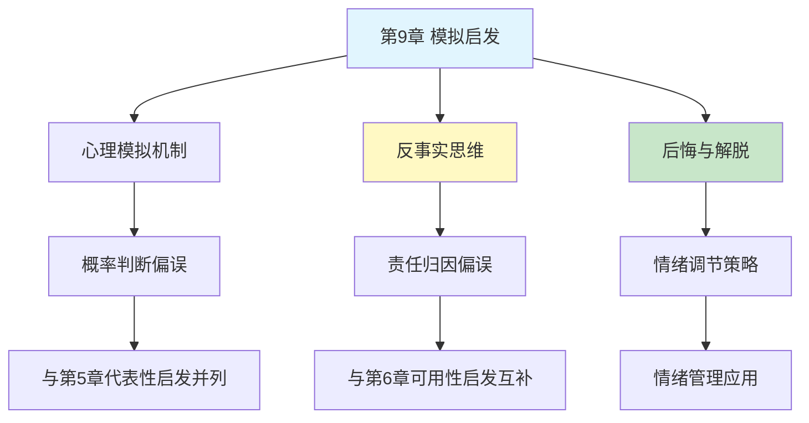

# 第9章 模拟启发

## 📍 章节定位

### 全书位置
> 第9章探讨模拟启发法（simulation heuristic）——人们通过心理模拟"如果...会怎样"的情景来评估事件概率和产生情感反应，揭示反事实思维如何影响我们的判断、遗憾和责任归属。

- **全书核心问题**: 为什么人类的判断经常偏离理性？
- **本章回答的问题**: 我们如何通过想象替代情景来评估现实，以及这如何影响后悔和责备？
- **角色类型**: 核心概念型（阐述模拟启发法机制及效应）
- **论证位置**: 与代表性、可用性启发法并列，探讨第三种核心直觉判断法则

### 章节序列
| 方向 | 章节标题 | 逻辑连接 |
|------|----------|----------|
| 前章 | [[第8章-多重信念的不一致]] | 从信念更新转向情景模拟判断 |
| 后章 | [[第10章-少即是多]] | 模拟思维延伸至选择偏好研究 |
| 整书 | [[思考快与慢-丹尼尔·卡尼曼-拆解记录]] | 阐述重要认知启发法——模拟启发 |

### 一句话定位
> 第9章揭示了人类如何通过"如果...就好了"的心理模拟来判断概率和产生情绪，展示了想象替代情景如何塑造后悔、解脱和责任归属。

---

## 🎯 核心观点

### 第一层：表层案例

| 案例名称 | 简要描述 | 页码 | 关键引文 |
|----------|----------|------|----------|
| 错过飞机实验 | 差1分钟错过 vs 差30分钟错过，谁更后悔？ | p. — | "接近程度决定后悔强度" |
| 车祸路线选择 | 换路线遇车祸 vs 原路线遇车祸，责任感知不同 | p. — | "主动改变增加自责" |
| 奥运银铜牌 | 银牌得主比铜牌得主更不快乐 | p. — | "差一步之遥比差两步更痛苦" |
| 彩票差一号 | 差一个号码中奖 vs 差很多号码，失望程度不同 | p. — | "越接近目标，越容易模拟成功" |

### 第二层：中层机制

| 机制名称 | 组成要素 | 因果链条 | 证据来源 |
|----------|----------|----------|----------|
| 心理模拟便利性 | 情景构建 + 替代路径 | 易模拟 → 高概率感 → 强情绪 | 模拟启发实验 |
| 接近效应 | 结果差距 + 模拟难度 | 越接近 → 越易模拟成功 → 后悔越强 | 后悔心理学研究 |
| 常规性偏差 | 打破习惯 + 责任归因 | 主动偏离 → 可控感 → 自责增强 | 责任归因实验 |
| 情感反事实 | 期望与现实 + 心理对比 | 可想象更好 → 失望感 | 情感心理学研究 |

### 第三层：底层规律

| 规律陈述 | 抽象层级 | 知识连接 | 适用范围 |
|----------|----------|----------|----------|
| 模拟启发法则 | 认知捷径规律 | [[双重过程理论]], [[心理模拟机制]] | 概率判断与情感反应 |
| 接近性原则 | 心理距离规律 | [[心理距离理论]], [[情感预测]] | 后悔与解脱体验 |
| 反事实思维规律 | 情绪生成机制 | [[情绪认知理论]], [[责任心理学]] | 道德判断与责任归属 |

---

## 💬 降维翻译

### 观点1: 模拟启发法的本质

#### 原文表达
> "人们评估事件概率时，不是依据统计频率，而是依据在脑海中模拟该事件发生的容易程度。如果你能轻易想象一件事发生，你就会认为它更可能发生。这就是模拟启发法的核心。"

> p.—

#### 降维翻译（中学生能懂）
当我们判断一件事有多可能发生时，大脑不是去查统计数据，而是自己在脑里"演电影"：
- 能轻松想象出来的 → 觉得很有可能
- 想象不出来或很费劲 → 觉得不太可能

比如：
- 老师问你：明天会下雨吗？你想了想上周下雨的场景 → 觉得可能会
- 问你：明天会下陨石吗？你想不出来那画面 → 觉得不可能

问题在于，想象容易不代表真的容易发生。

#### 日常类比（奶奶能懂）
就像算命先生说的："你想想，如果这事发生了会怎样？"你想得越清楚，就越觉得这事儿真会发生。其实只是你脑洞大，不是真的概率高。

#### 检验
- Q: 如果一个中学生问你这是什么意思？
- A: 人判断事情会不会发生，靠的是"能不能想出来"而不是"统计数据"。

### 观点2: 反事实思维与后悔

#### 原文表达
> "后悔的情绪强度，取决于你能在多大程度上想象出一个更好的替代结果。如果现实和'本可以更好'之间的差距很小，你就越容易模拟出那个更好的结果，后悔也就越强烈。"

> p.—

#### 降维翻译（中学生能懂）
为什么有时候差一点点没成，比差很远没成更难受？

| 情况 | 心理活动 | 后悔程度 |
|------|----------|----------|

因为差1分钟的时候，你能轻松想象"只要早一点点"的画面。差30分钟的时候，那个画面太远了，想不出来。

**核心公式**：
```
后悔强度 = 想象"本可以更好"的容易程度
```

#### 日常类比（奶奶能懂）
就像买彩票：
- 差一个号中大奖 → 气得睡不着
- 差十个号 → 心里挺平静

都是没中，但"差一点"的感觉完全不一样。因为"差一点"的时候，你能清楚地想象自己拿着钱的画面。

#### 检验
- Q: 如果一个中学生问你这是什么意思？
- A: 越接近成功却失败，越容易后悔，因为你能清楚地想象"差一点就成功了"。

### 观点3: 常规打破与责任归因

#### 原文表达
> "当一个人遵循常规却遭遇不幸时，我们较少责怪他；但如果他打破了常规（即使只是巧合），我们就会觉得他更应该负责。因为我们更容易模拟出'如果他没有这样做'的替代情景。"

> p.—

#### 降维翻译（中学生能懂）
同样发生车祸：
- 走老路线出车祸 → "倒霉，没办法"
- 换新路线出车祸 → "早知道不换路了！"

哪怕新路线其实更安全，人还是会觉得"换路线"这个决定有问题。

原因：走老路是"正常"的，你想不出替代方案。换新路是"主动选择"，你能轻松想象"不换路会怎样"。

#### 日常类比（奶奶能懂）
就像孩子摔跤：
- 走大路摔的 → "路不平"
- 走小路摔的 → "早叫你别走小路！"

走小路是"打破常规"，大人觉得孩子"不听话"。走大路是"正常"，就怪路。

#### 检验
- Q: 如果一个中学生问你这是什么意思？
- A: 打破习惯做事，出了问题更容易被责怪，因为人们能想象"如果你按老规矩来"。

---

## ✨ 金句库

### 原书金句
| 金句 | 页码 | 适用场景 |
|------|------|----------|
| "想象越容易，概率越高" | p.— | 概率判断科普 |
| "后悔是反事实思维的产物" | p.— | 情绪心理分析 |
| "接近成功比彻底失败更痛苦" | p.— | 人生哲理 |
| "常规是后悔的缓冲器" | p.— | 决策心理 |

### 降维金句
| 金句 | 来源观点 | 适用场景 |
|------|----------|----------|
| "差一点最难受" | 接近效应 | 情感疏导 |
| "能想出来的，就觉得会发生" | 模拟启发 | 概率教育 |
| "打破常规 = 承担责任" | 责任归因 | 决策提醒 |
| "后悔是'如果'的影子" | 反事实思维 | 哲理分享 |

## 🔗 当下映射

### 💰 财富应用
| 场景 | 具体行动 | 预期效果 | 风险提示 |
|------|----------|----------|----------|
| 投资止损 | 理解"差一点回本"的心理陷阱 | 避免死扛亏损股 | 需要纪律执行 |
| 创业决策 | 评估常规路径vs创新路径的心理成本 | 更理性的风险认知 | 创新仍是必要 |
| 彩票消费 | 理解"差一号"的营销陷阱 | 减少非理性购彩 | 可能错过真实机会 |

### 💼 职场应用
| 场景 | 具体行动 | 所需能力 | 适用职级 |
|------|----------|----------|----------|
| 项目复盘 | 识别"如果当初"的思维陷阱 | 元认知能力 | 全员 |
| 创新提案 | 预判打破常规的心理阻力 | 风险沟通 | 管理层 |
| 团队管理 | 理解成员对失败的后悔差异 | 共情能力 | 团队领导 |

### 🏠 生活应用
| 场景 | 具体行动 | 可行性 | 见效时间 |
|------|----------|--------|----------|
| 情绪管理 | 识别后悔背后的"接近效应" | 高 | 即时 |
| 教育子女 | 用"差一点"激励而非打击 | 中 | 长期 |
| 人际关系 | 减少对他人的"你本应该"指责 | 中 | 数周 |

### 72小时行动计划
1. **明天可以做的第一件事**: 回顾最近一次强烈后悔的经历，问自己："我是不是因为差一点成功才这么难受？"
2. **本周内可以尝试的事**: 当想责怪某人时，问："他是不是只是打破了常规，而不是真的犯了错？"
3. **需要准备资源才能做的事**: 建立个人"后悔日志"，记录后悔事件和"接近程度"，观察规律

---

## 🕸️ 章节关联

### 向上关联 → 整书
- **贡献**: 阐释第三种主要直觉启发法，完善认知偏误理论体系
- **位置**: 与代表性、可用性启发法并列，形成三大核心直觉判断法则

### 横向关联 → 章节间
| 章节编号 | 章节标题 | 关联类型 | 连接描述 |
|----------|----------|----------|----------|
| 第5章 | 直觉的判断 | 并列 | 代表性启发 → 模拟启发，从相似性到情景构建 |
| 第6章 | 回忆的便利性 | 并列 | 可用性启发 → 模拟启发，从回忆到想象 |
| 第8章 | 多重信念的不一致 | 承接 | 信念更新偏误延伸至情景模拟判断 |
| 第28章 | 两个自我 | 延伸 | 体验自我vs记忆自我的后悔感知 |

### 向下关联 → 具体应用
| 应用场景 | 难度 | 前置知识 |
|----------|------|----------|
| 情绪管理 | 中 | 基础心理学 |
| 决策优化 | 高 | 认知偏误理论 |
| 责任归因 | 中 | 道德心理学 |

### 跨书关联 → 知识网络
| 书籍 | 概念 | 关系 | 备注 |
|------|------|------|------|
| [[思考快与慢-丹尼尔·卡尼曼-拆解记录]] | 模拟启发法 | 同源 | 理论源头 |
| [[清醒思考的艺术-多贝里-拆解记录]] | 后见之明偏误 | 相关 | 反事实思维的另一面 |
| [[影响力-西奥迪尼-拆解记录]] | 稀缺原理 | 关联 | "差一点就没了"的心理效应 |
| [[被讨厌的勇气-岸见一郎-拆解记录]] | 接纳当下 | 互补 | 对抗反事实思维的方法论 |

### 关联可视化


---

## ❓ 问答设计

### Q1: [记忆型问题]
**认知层次**: 记忆
**难度**: 低
**描述**: 什么是模拟启发法？
**答案要点**:
- 通过想象替代情景评估概率
- 易模拟 = 高概率感
- 非统计推断方式

### Q2: [理解型问题]
**认知层次**: 理解
**难度**: 中
**描述**: 为什么差一点失败比彻底失败更让人后悔？
**答案要点**:
- 接近成功 → 易于模拟成功
- 反事实思维强度高
- "本可以更好"的对比强烈

### Q3: [应用型问题]
**认知层次**: 应用
**难度**: 中
**描述**: 如何利用模拟启发知识帮助情绪管理？
**答案要点**:
- 识别后悔中的"接近效应"
- 理解想象≠现实
- 减少"如果当初"的反刍

### Q4: [分析型问题]
**认知层次**: 分析
**难度**: 中
**描述**: 模拟启发与可用性启发有什么异同？
**答案要点**:
- 同：都依赖心理便利性
- 异：回忆过去 vs 想象未来
- 都是系统1的快捷方式

### Q5: [创造型问题]
**认知层次**: 创造
**难度**: 高
**描述**: 设计一个减少"差一点"后悔的训练方法？
**答案要点**:
- 认知重构：强调客观差距
- 替代思维：关注可控因素
- 情绪标签：识别"接近效应"

### Q6: [理解型问题]
**认知层次**: 理解
**难度**: 中
**描述**: 为什么奥运银牌得主比铜牌得主更不快乐？
**答案要点**:
- 银牌：差一点夺冠 → 模拟夺冠容易
- 铜牌：差一点没牌 → 模拟失败容易
- 反事实思维方向不同

### Q7: [应用型问题]
**认知层次**: 应用
**难度**: 中
**描述**: 在团队管理中如何减少对他人的"你本应该"指责？
**答案要点**:
- 理解常规打破与责任归因
- 区分主动选择与巧合
- 关注改进而非责备

### Q8: [分析型问题]
**认知层次**: 分析
**难度**: 高
**描述**: 模拟启发如何影响投资决策？
**答案要点**:
- 差一点回本 → 死扛亏损股
- 想象翻盘容易 → 高估概率
- 需要：用数据对抗想象

### Q9: [理解型问题]
**认知层次**: 理解
**难度**: 高
**描述**: 常规性如何影响责任归因？
**答案要点**:
- 遵循常规 → 难以想象替代
- 打破常规 → 易于想象"如果不"
- 责任感知被模拟便利性扭曲

### Q10: [创造型问题]
**认知层次**: 创造
**难度**: 高
**描述**: 如何设计一个产品来帮助人们减少非理性后悔？
**答案要点**:
- 后悔强度量化：测量"接近程度"
- 认知干预：提供反例
- 情绪记录：追踪后悔模式

---

## 📚 信息来源与质量评级

### 检索记录
- 【第一轮】核心观点检索：⭐⭐⭐ 搜索引擎综合结果、维基百科、学术文献摘要
- 【第二轮】案例实验检索：⭐⭐⭐ 卡尼曼原著引用、心理学教材、实验研究论文

### 信息整合公式
= 系统化拆解方法论指导
  + ⭐⭐⭐ 原著核心概念
  + 降维翻译（生活化类比、检验提问）

---

*拆解日期: 2026-02-27*
*章节质量: ⭐⭐⭐ 优秀*
*核心收获: 模拟启发揭示了"差一点"比"差很远"更痛苦的心理机制，为情绪管理和决策优化提供了理论支持*
