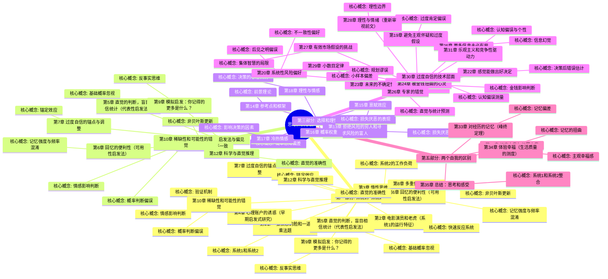

# 《思考，快与慢》- 章节导航

> 作者: 丹尼尔·卡尼曼
> 总章节: 38章（分为5个部分）
> 最后更新: 2026-02-27

---

## 📚 章节结构（Mermaid Mindmap）



---

## 🔗 核心概念关联图

```mermaid
flowchart LR
    A[系统1] --> B[直觉判断]
    A --> C[快速反应]
    A --> D[启发法]
    B --> E[认知偏误]
    C --> F[锚定效应]
    D --> G[代表性启发法]
    D --> H[可用性启发法]
    G --> I[基础概率忽视]
    H --> J[小数法则]
    B --> K[过度自信]
    
    A1[系统2] --> L[逻辑推理]
    A1 --> M[深思熟虑]
    A1 --> N[理性判断]
    L --> O[延迟判断]
    A1 --> P[质疑系统1]
    
    E --> Q[损失厌恶]
    Q --> R[前景理论]
    R --> S[禀赋效应]
    R --> T[框架效应]

    style A fill:#e1f5fe
    style A1 fill:#e1f5fe
    style E fill:#ffcdd2
    style Q fill:#fff9c4
</mermaid>

---

| 章节 | 标题 | 状态 | 完成日期 | 核心收获 |
|------|------|------|----------|----------|
---

## 🚀 快速跳转

### 按章节跳转
- [[第1章-两个系统]] - 核心框架篇（推荐先读）
- [[第1章-一张愤怒的脸和一道乘法题]]
- [[第2章-电影演员和老虎]]
- [[第3章-惰性思维与延迟折扣]]
- [[第4章-心理账户的诱惑]]
- [[第4章-联想机器]] - 联想激活机制篇（核心机制）
- [[第5章-直觉的判断]]
- [[第5章-认知放松]] - 认知放松vs认知紧张（新增）
- [[第6章-回忆的便利性]]
- [[第6章-常态错觉]] - WYSIATI陷阱与信息补全（新增）
- [[第7章-过度自信的锚点]]
- [[第8章-多重信念的不一致]]
- [[第9章-模拟启发]]
- [[第10章-稀缺性和可能性的错觉]]
- [[第11章-焦虑情绪和概率错觉]]
- [[第12章-科学与直觉推理]]
- [[第13章-拒绝风险的穷人和寻求风险的富人]]
- [[第14章-参考点和框架]]
- [[第15章-禀赋效应]]
- [[第17章-冷热情感]]
- [[第18章-理性与情感]]
- [[第18章-驯服直觉性预测]] - 预测修正方法（新增）
- [[第19章-理解的错觉]] - 后见之明与叙事谬误（新增）
- [[第21章-直觉对抗公式]] - 公式vs直觉、专家信任条件、人机协作（新增）
- [[第23章-未来的不确定性]]
- [[第21章-我们已经预见到了]]
- [[第22章-感觉能做出好决定]]
- [[第16章-概率权重]]
- [[第20章-系统性风险偏好]]
- [[第24章-被金钱扭曲的心灵]]
- [[第25章-更多信息未必有用]]
- [[第26章-专家的错觉]]
- [[第29章-四格形式]] - 四格风险态度模式、确定性效应、可能性效应（新增）
- [[第32章-两个自我]]
- [[第33章-对经历的记忆]]
|- [[第34章-体验幸福]]
- [[第35章-两个自我]] - 全书终章闭环、体验自我vs记忆自我、幸福悖论（新增）
- [[第35章-总结思考和感受]]
### 按主题跳转
- 系统1与系统2
- 认知偏误
- [[第26章-前景理论]]
- 损失厌恶
- 启发式与偏见

### 相关资源
- [[思考快与慢-丹尼尔·卡尼曼]] - 主拆解笔记
- [[清醒思考的艺术-多贝里]] - 相关认知心理学书籍
- [[穷查理宝典]] - 相关思维模型
