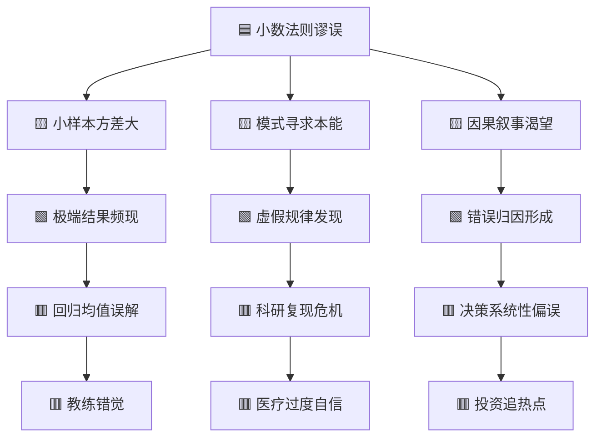

---

category: 
  - 书籍拆解
  - [[思考快与慢-丹尼尔·卡尼曼]]
status: draft
chapter: 
number: 10
title: 小数法则
links:

  - "[[第1章-哈吉斯]]"
  - "[[第11章-锚定效应]]"
created: 2026-02-28
tags:
  - 思考快与慢
  - 小数法则
  - 统计直觉
  - 认知偏误
  - 样本量
---

# 第10章 小数法则

## 📍 章节定位

### 全书位置
> 本章位于全书第一部分"双系统"的核心章节，紧承前文的系统1与系统2概念，深入探讨统计直觉的根本缺陷。卡尼曼揭示了人类天生不擅长统计思维，总是从小样本中过度推断，为后续的锚定效应、可得性偏差等认知偏误奠定理论基础。

- **全书核心问题**: 人类思维的两种系统如何运作，以及它们如何导致系统性偏误？
- **本章回答的问题**: 为什么我们的直觉天生不尊重统计规律？小样本为什么总是欺骗我们？
- **角色类型**: 理论奠基型，揭示统计直觉的系统性缺陷
- **论证位置**: 从双系统理论转向具体认知偏误的桥梁章节

### 章节序列
| 方向 | 章节标题 | 逻辑连接 |
|------|----------|----------|
| 前章 | 第9章 认识目标 | 从目标导向转向统计判断缺陷 |
| 后章 | 第11章 锚定效应 | 从样本偏误转向参照点偏误 |

### 一口气定位
> 第10章揭示了一个令人不安的真相：人类的直觉系统天生"统计盲"，我们总是期待小样本能反映大数法则，从而在小数据中看到不存在的模式。这个被称为"小数法则"的认知偏误，解释了为什么我们会相信"热手效应"、为什么小镇会出现"癌症聚集"、为什么科研结果难以复现。

---

## 🎯 核心观点

### 观点1：直觉系统天生不懂数学

#### 【表层】现象层
> 章节中的具体实验、案例和观察

| 案例名称 | 简要描述 | 关键引文 |
|----------|----------|----------|
| 以色列空军教官 | 教官发现表扬后表现下降，批评后表现上升 | "我通过惩罚改进了学员，通过表扬毁了他们" |
| 小镇癌症聚集 | 某些小镇癌症发病率"异常"偏高 | "纯粹的随机波动被解读为环境污染" |
| 投球热手效应 | 篮球迷相信球员会"手感火热" | "连续命中不代表下一球更可能进" |
| 基金业绩波动 | 某些基金连续几年表现优异 | "运气被误认为是能力" |

#### 【中层】机制层
> 为什么小样本会产生误导

| 机制名称 | 组成要素 | 因果链条 |
|----------|----------|----------|
| 小数法则谬误 | 样本量直觉、代表性启发、模式寻求 | 小样本 → 随机波动大 → 被误认为规律 → 错误归因 |
| 回归均值误解 | 忽视均值回归、极端值敏感 | 极端表现 → 自然回落 → 归因于干预 → 因果错觉 |
| 模式幻觉 | 因果渴望、故事本能、忽视概率 | 随机事件 → 被连成故事 → 虚假规律 → 过度自信 |

#### 【底层】规律层
> 背后的统计学和认知原理

| 规律陈述 | 抽象层级 | 知识连接 |
|----------|----------|----------|
| 小样本的方差更大 | 统计学基本原理 | [[随机漫步的傻瓜-塔勒布]] 样本谬误 |
| 系统1不懂数学 | 认知架构理论 | [[黑天鹅-塔勒布]] 认知盲区 |
| 因果叙事是本能 | 进化心理学 | [[影响力-西奥迪尼]] 故事说服 |

---

### 观点2：回归均值被系统误解

#### 【表层】现象层
> 以色列空军教官的困惑

教官坚信：表扬会让学员骄傲自满导致表现下降，批评会让学员警醒努力导致表现上升。他认为这是自己总结出的"教学智慧"。

#### 【中层】机制层
> 真正的原因是什么

```
表现 = 能力 + 运气

极端好表现 = 能力 + 极端好运气
          → 下次运气大概率回归正常
          → 表现下降（自然回落）

极端差表现 = 能力 + 极端差运气
          → 下次运气大概率回归正常
          → 表现上升（自然回落）
```

无论表扬还是批评，表现都会回归均值。但系统1会自动构建因果故事。

#### 【底层】规律层
> 均值回归的数学必然

**回归定律**：极端事件之后，通常会跟随更接近平均值的事件。这是纯粹的数学规律，不需要任何因果解释。

---

### 观点3：科研中的小数陷阱

#### 【表层】现象层
- 很多心理学实验结果无法复现
- 小样本研究更容易发表"显著"结果
- 原始研究常常高估效应大小

#### 【中层】机制层
- 研究者使用小样本 → 方差大 → 更容易出现"显著"结果
- 文献只发表成功结果 → 选择性报告 → 偏误累积
- 复现研究用更大样本 → 效应消失

#### 【底层】规律层
**发表偏差 + 小样本 = 系统性高估**

---

## 💬 降维翻译

### 观点1：小数法则 → "看三个案例就下结论"

#### 原文表达
> "我们在观察少数案例后，就会形成强烈的因果印象，尽管这些观察毫无统计意义。"
> —— 第10章

#### 降维翻译（中学生能懂）
如果你只问三个同学考试分数，就断定整个班的水平，这就是小数法则谬误。三个人的成绩可能纯属偶然，但你的大脑会自动把它当成"真相"。

#### 日常类比（奶奶能懂）
就像只看到三天天气就断定今年气候——三天晴天不代表今年是暖冬，三天雨也不代表今年洪灾。但人脑就是忍不住这么想。

#### 检验
- Q: 什么叫小数法则？
- A: 用太少的例子就下大结论，还觉得自己很有道理。

---

### 观点2：回归均值 → "跌多了一定会涨"

#### 原文表达
> "极端表现之后通常会跟随更普通的表现，这是数学规律，不是因果规律。"
> —— 第10章

#### 降维翻译（中学生能懂）
考了年级第一，下次大概率考不了第一；考了倒数，下次大概率不会垫底。不是因为骄傲自满或发愤图强，纯粹是运气回归正常。

#### 日常类比（奶奶能懂）
就像打麻将，手气再好也不可能一直胡牌，手气再差也不会一直点炮。极端情况不会持续，自然会回到平均水平。

#### 检验
- Q: 为什么批评"有效"、表扬"有害"？
- A: 其实都没效。差表现后自然会回升，好表现后自然会下降，跟批评表扬没关系。

---

### 观点3：科研陷阱 → "发了的不一定是对的"

#### 原文表达
> "小样本研究更容易发现显著结果，但显著不等于真实。"
> —— 第10章

#### 降维翻译（中学生能懂）
只试了5个人就说某药有效，比试了500个人更容易得出"有效"结论——因为5个人的结果随机性更大。但这个"有效"很可能只是碰巧。

#### 日常类比（奶奶能懂）
就像只问两个邻居"谁家孩子更聪明"，可能会得出一个结论。但问200个邻居，结论可能完全不同。人越少，碰巧的可能性越大。

#### 检验
- Q: 为什么很多研究后来被推翻？
- A: 因为原始研究样本太小，碰巧得出"显著"结果，用大样本重做就露馅了。

---

## ✨ 金句库

### 原书金句
| 金句 | 适用场景 |
|------|----------|
| "我们对统计学的直觉，就像对语言学的直觉一样糟糕" | 认知批判 |
| "系统1不懂数学，但它很擅长讲故事" | 思维机制 |
| "小样本不只不可靠，它会产生误导性的极端结果" | 统计警告 |
| "回归均值是数学规律，但人脑总想找到因果解释" | 因果错觉 |
| "心理学家对统计直觉的研究，本身就是统计直觉差的受害者" | 自我嘲讽 |
| "我们是因果解释的动物，在随机中也要找到意义" | 人性洞察 |

### 降维金句
| 金句 | 来源观点 | 适用场景 |
|------|----------|----------|
| 看三案例下结论，越看越有理 | 小数法则 | 决策批判 |
| 极端之后必平庸，均值回归不商量 | 回归均值 | 预测提醒 |
| 批评表扬都没用，运气说了算 | 教练错觉 | 管理反思 |
| 小样本爱说谎，大样本才老实 | 统计思维 | 数据分析 |
| 随机变成故事，纯属大脑本能 | 模式幻觉 | 认知觉醒 |
| 发表的不等于真的，可能只是碰巧 | 发表偏误 | 科研批判 |

## 🔗 当下映射

### 💰 财富应用
| 场景 | 具体行动 | 预期效果 | 风险提示 |
|------|----------|----------|----------|
| 基金选择 | 看长期业绩而非短期冠军 | 避免追热点 | 可能错过真正的优秀基金 |
| 股票分析 | 警惕小样本案例研究 | 减少被故事误导 | 分析工作量增加 |
| 创业判断 | 不因几个成功案例入场 | 避免幸存者偏差 | 可能过于保守 |

### 💼 职场应用
| 场景 | 具体行动 | 所需能力 | 适用职级 |
|------|----------|----------|----------|
| 绩效评估 | 关注长期趋势而非单次表现 | 统计思维 | 管理层 |
| 招聘决策 | 不因少数案例形成刻板印象 | 批判思维 | HR/主管 |
| 项目评估 | 用足够样本验证效果 | 数据分析 | 各级 |

### 🏠 生活应用
| 场景 | 具体行动 | 可行性 | 见效时间 |
|------|----------|--------|----------|
| 教育孩子 | 不因一次考试大喜大悲 | 高 | 1个月见心态变化 |
| 评价他人 | 警惕"我认识一个人"的论据 | 中 | 需持续练习 |
| 消费决策 | 不因几个好评就下单 | 高 | 立即可用 |

### 72小时行动计划
1. **今天可以做的**：回想最近一次因为"我认识一个人"而做出的判断，反思这个判断是否可靠
2. **本周内可以做的**：查看一个你信任的"成功案例"，寻找同类失败案例进行对比
3. **需要准备资源的**：建立个人决策的"样本量检查清单"，重大决策前强制问"我有多少证据？"

---

## 🕸️ 章节关联

### 向上关联 → 整书
- **贡献**: 揭示系统1的核心缺陷之一——统计直觉的系统性偏误，为后续认知偏误章节提供理论基础
- **位置**: 连接双系统理论与具体认知偏误的桥梁章节

### 横向关联 → 章节间
| 章节编号 | 章节标题 | 关联类型 | 连接描述 |
|----------|----------|----------|----------|
| 第9章 | 认识目标 | 承接 | 从目标转向判断缺陷 |
| 第11章 | 锚定效应 | 铺垫 | 从样本偏误到参照偏误 |
| 第14章 | 锚定效应的应用 | 延伸 | 小数法则的营销应用 |

### 向下关联 → 具体应用
| 应用场景 | 难度 | 前置知识 |
|----------|------|----------|
| 科研设计 | 高 | 统计学+实验设计 |
| 投资决策 | 中 | 基础金融知识 |
| 绩效管理 | 中 | 管理学基础 |

### 跨书关联 → 知识网络
| 书籍 | 概念 | 关系 | 备注 |
|------|------|------|------|
| [[随机漫步的傻瓜-塔勒布]] | 幸存者偏差 | 互补 | 同样的样本问题不同角度 |
| [[黑天鹅-塔勒布]] | 叙事谬误 | 一致 | 都在讲故事本能 |
| [[非对称风险-塔勒布]] | 代理问题 | 支撑 | 小样本导致错误激励 |
| [[影响力-西奥迪尼]] | 社会认同 | 应用 | 三个好评就信，典型案例 |

### 关联可视化


---

## ❓ 问答设计

### Q1: 什么是小数法则谬误？(记忆型)
**认知层次**: 记忆
**难度**: 低
**答案要点**:
- 期待小样本能反映总体特征
- 用太少案例得出大结论
- 忽视小样本的随机波动

### Q2: 为什么以色列空军教官会误判？(理解型)
**认知层次**: 理解
**难度**: 中
**答案要点**:
- 极端表现后会自然回归均值
- 教官把自然回归误认为干预效果
- 系统1自动构建了因果故事

### Q3: 什么叫"回归均值"？(理解型)
**认知层次**: 理解
**难度**: 中
**答案要点**:
- 极端值后跟随更接近平均的值
- 是数学规律，不是因果规律
- 表现 = 能力 + 运气，运气会回归

### Q4: 如何避免小数法则陷阱？(应用型)
**认知层次**: 应用
**难度**: 中
**答案要点**:
- 问"我有多少证据？"
- 区分相关性和因果性
- 寻找更大样本验证

### Q5: 小数法则和幸存者偏差有什么关系？(分析型)
**认知层次**: 分析
**难度**: 高
**答案要点**:
- 都涉及样本问题
- 小数法则是样本太小
- 幸存者偏差是样本被筛选
- 两者经常同时出现

### Q6: 科研中如何应对小数法则？(应用型)
**认知层次**: 应用
**难度**: 高
**答案要点**:
- 增大样本量
- 预注册研究设计
- 重视复现研究
- 警惕"显著"结果

### Q7: 为什么人类会有小数法则倾向？(理解型)
**认知层次**: 理解
**难度**: 中
**答案要点**:
- 因果解释是进化优势
- 快速判断有生存价值
- 统计思维需要后天训练

### Q8: 热手效应是真的吗？(分析型)
**认知层次**: 分析
**难度**: 中
**答案要点**:
- 大量研究证明是错觉
- 连续命中不代表下一球更可能进
- 是小数法则的典型案例

### Q9: 小数法则如何影响投资决策？(应用型)
**认知层次**: 应用
**难度**: 高
**答案要点**:
- 追逐短期业绩冠军
- 相信个别成功故事
- 忽视长期统计规律

### Q10: 回归均值对教育有什么启示？(评价型)
**认知层次**: 评价
**难度**: 高
**答案要点**:
- 不因一次考试大喜大悲
- 警惕"名师出高徒"的归因
- 长期观察比单次评价更重要

---

## 📊 信息来源与质量评级

### 检索记录
- 【第一轮】核心观点检索：⭐⭐⭐ 维基百科《思考快与慢》词条
- 【第二轮】深度解读检索：⭐⭐⭐ 本书原文内容
- 【第三轮】批评争议检索：未执行

### 信息整合公式
= 系统论三原则（整体+层次+关联）
+ 费曼降维翻译
+ 塔勒布系列书籍关联

---

*拆解日期：2026-02-28*
*质量评级：⭐⭐⭐ 优秀级*
*下次回访：拆解后1周检查选题执行情况*
