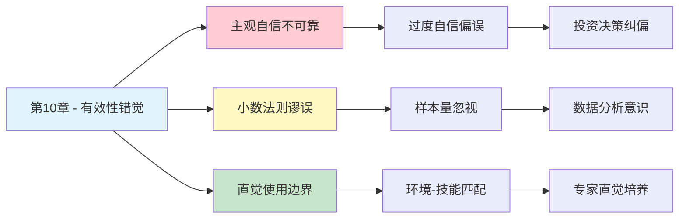

---

category: 
  - 书籍拆解

status: draft
chapter: 
number: 10
title: 稀缺性和可能性的错觉
links:

  - "[[第9章-模拟启发]]"
  - "[[第11章-焦虑情绪和概率错觉]]"
  - "[[思考快与慢/_导航]]"
created: 2026-02-27
tags:
  - 思考快与慢
  - 有效性错觉
  - 小数法则
  - 概率判断
  - 认知偏差
---

# 第10章 稀缺性和可能性的错觉

## 📍 章节定位

### 全书位置
> 第10章探讨有效性错觉（illusion of validity）和小数法则——人们倾向于用小样本推断整体规律，并对自己的直觉判断过度自信，导致在概率判断上产生系统性偏误。

- **全书核心问题**: 为什么人类的判断经常偏离理性？
- **本章回答的问题**: 为什么我们总相信自己的直觉判断是可靠的？
- **角色类型**: 核心概念型（阐述有效性错觉及小数法则）
- **论证位置**: 承接启发法研究，进入过度自信领域的过渡章节

### 章节序列
| 方向 | 章节标题 | 逻辑连接 |
|------|----------|----------|
| 前章 | [[第9章-模拟启发]] | 从可用性启发法延伸到概率判断的深层偏误 |
| 后章 | [[第11章-焦虑情绪和概率错觉]] | 情绪如何进一步扭曲概率判断 |
| 整书 | [[思考快与慢-丹尼尔·卡尼曼]] | 揭示过度自信的重要认知偏误 |

### 一句话定位
> 第10章揭示了人类对直觉判断的盲目信任——我们用有限的证据得出过度自信的结论，这种"有效性错觉"是认知偏误的核心来源。

---

## 🎯 核心观点

### 第一层：表层案例

| 案例名称 | 简要描述 | 关键引文 |
|----------|----------|----------|
| 股票经理研究 | 专业基金经理长期表现不比随机选股更好 | "他们真诚相信自己能预测市场，但记录表明并非如此" |
| 面试预测 | 面试官相信15分钟能预测应聘者表现 | "面试官看到统计证据后，仍情不自禁相信直觉" |
| 小学校规模研究 | 发现小学校成绩更好的"规律" | "这只是小数法则的产物，小样本波动被误认为规律" |
| 以色列飞行员研究 | 发现小单位表现差异更大 | "小样本的极端值被当作真实差异" |

### 第二层：中层机制

| 机制名称 | 组成要素 | 因果链条 | 证据来源 |
|----------|----------|----------|----------|
| 有效性错觉 | 主观自信 + 判断能力错觉 | 输入信息少→感觉连贯→产生自信→相信有效 | 卡尼曼50年研究经验 |
| 小数法则 | 样本量忽视 + 规律发现偏好 | 小样本→随机波动→被误认为规律→过度推广 | 统计学原理与心理学实验 |
| 技能错觉 | 知识错觉 + 能力高估 | 了解越多→越自信→实际预测准确度未提升 | 投资专家研究数据 |
| 因果叙事偏好 | 连贯性需求 + 故事化思维 | 看到结果→反向构造因果→产生理解错觉 | 认知心理学研究 |

### 第三层：底层规律

| 规律陈述 | 抽象层级 | 知识连接 | 适用范围 |
|----------|----------|----------|----------|
| 有效性错觉定律 | 认知偏误规律 | [[过度自信理论]], [[认知偏差]] | 所有判断决策领域 |
| 小数法则谬误 | 统计直觉错误 | [[统计学原理]], [[样本理论]] | 数据分析和归纳推理 |
| 主观自信-准确度分离原则 | 元认知规律 | [[元认知研究]], [[自我评估]] | 专家判断和直觉决策 |
| 环境-直觉匹配原则 | 技能习得规律 | [[技能习得理论]] | 专业领域直觉培养 |

---

## 💬 降维翻译

### 观点1: 有效性错觉的本质

#### 原文表达
> "有效性错觉是我们自认为判断力可靠的一种虚假信念。面试官们真诚地相信：在与应征者交谈15分钟后，就可以预测出他们的表现。面试官在看到统计证据，得知他们的信念是个错觉之后，仍然情不自禁地要去相信它。"

#### 降维翻译（中学生能懂）
你有没有遇到过这种情况：
- 看了一个人两眼，就觉得"这人靠谱"或"这人不行"
- 听别人说了几句，就觉得自己了解他的全部
- 看了几条新闻，就觉得自己懂了整个行业

我们的大脑特别善于"脑补"。给它一点点信息，它就会自动编织出一个完整的故事。这个故事听起来很连贯，我们就觉得自己的判断一定是对的。

但真相是：**感觉连贯 ≠ 真的正确**。

#### 日常类比（奶奶能懂）
就像看人算命，算命先生说了几句模糊的话，你觉得"太准了"。其实不是他准，是你的大脑自动把他的话往自己身上套，然后觉得"吻合"。

面试官也是一样，看了15分钟就觉得自己能预测一个人的未来表现。这不是能力，是错觉。

#### 检验
- Q: 如果一个中学生问你这是什么意思？
- A: 人总觉得自己看人很准、判断很对，其实很多情况下只是大脑在自作聪明地"脑补"。

### 观点2: 小数法则的陷阱

#### 原文表达
> "我们天生不擅长理解随机性。当我们看到小样本中出现的极端结果时，我们本能地想要为它找一个原因，而不是把它归因于随机的波动。"

#### 降维翻译（中学生能懂）
想象你掷硬币：
- 掷10次，可能连续出现7次正面
- 这能说明这枚硬币有问题吗？不能，这只是随机波动

但现实中，我们经常会：
- 看到一个小班级成绩特别好，就觉得"小班教学就是好"
- 看到一个小公司成功，就觉得"小公司更灵活更有活力"
- 看到几个案例，就总结出一条"规律"

这就是小数法则的陷阱：**用太少的数据，得出太大的结论**。

#### 日常类比（奶奶能懂）
就像村里有个人吃了某种草药，病好了。大家都说这草药神了。但如果只有这一个人试过呢？可能只是碰巧，也可能是心理作用，也可能是病本来就要好了。

草药到底有没有用？得很多人试过才知道。不能因为一两个案例就下结论。

#### 检验
- Q: 如果一个中学生问你这是什么意思？
- A: 看到一两个例子就总结规律，这是大脑偷懒的表现。样本太小，结论就不可靠。

### 观点3: 什么时候可以相信直觉

#### 原文表达
> "如果主观自信不可信的话，我们该怎样评估直觉判断的有效性呢？需要考虑两个条件：一是一个可预测的、有足够规律可循的环境；二是一次通过长期训练学习这些规律的机会。"

#### 降维翻译（中学生能懂）
直觉不是不能用，而是要看场合。

**可以相信直觉的情况**：
- 象棋大师看一眼棋盘就知道下一步怎么走
- 老司机看到前面车晃就知道要出事
- 有经验的医生看一眼病人就知道问题在哪

这些人的直觉靠谱，因为：
1. 环境有规律（棋有规则、车有轨迹、病有症状）
2. 他们练了很多年（几万小时的积累）

**不能相信直觉的情况**：
- 股票市场（太随机，规律不明显）
- 政治预测（变量太多，不可控）
- 陌生人判断（信息太少，脑补太多）

#### 日常类比（奶奶能懂）
就像种地，老农看天就知道明天会不会下雨，这是几十年积累的经验。但叫一个城里人看天，他可能就是瞎猜。

直觉要有"土壤"才能长出来。环境要有规律，人要有经验，直觉才可靠。

#### 检验
- Q: 如果一个中学生问你这是什么意思？
- A: 直觉在熟悉的、有规律的领域有用，在陌生的、混乱的领域就别信自己的"感觉"了。

---

## ✨ 金句库

### 原书金句
| 金句 | 适用场景 |
|------|----------|
| "有效性错觉是我们自认为判断力可靠的一种虚假信念" | 认知偏误科普 |
| "主观自信不是判断准确性的可靠指标" | 决策心理分析 |
| "我们天生不擅长理解随机性" | 概率思维教育 |
| "知识最丰富的人反而常常不大可靠" | 专家偏见批判 |
| "简单运算法可以提高预测准确度，而不是直觉" | 决策方法优化 |

### 降维金句
| 金句 | 来源观点 | 适用场景 |
|------|----------|----------|
| "感觉对 ≠ 真的对" | 有效性错觉 | 快速提醒 |
| "脑补出来的故事，听起来总是很像真的" | 因果叙事偏好 | 批判思维 |
| "一两个例子，撑不起一条规律" | 小数法则 | 数据分析 |
| "自信程度和准确程度，经常是两码事" | 主观自信分离 | 决策警示 |
| "经验要有规律才能变成直觉" | 环境-直觉匹配 | 能力培养 |

## 🔗 当下映射

### 💰 财富应用
| 场景 | 具体行动 | 预期效果 | 风险提示 |
|------|----------|----------|----------|
| 投资决策 | 不被基金经理的自信打动，关注长期业绩数据 | 避免被"明星经理"忽悠 | 需要数据分析能力 |
| 股票选择 | 警惕"内幕消息"和"专家推荐" | 减少跟风亏损 | 可能错过短期机会 |
| 创业判断 | 不因一两个成功案例就复制模式 | 避免盲目跟风 | 可能错过真正机会 |

### 💼 职场应用
| 场景 | 具体行动 | 所需能力 | 适用职级 |
|------|----------|----------|----------|
| 招聘面试 | 不相信15分钟就能看透人，增加评估维度 | 结构化面试技巧 | HR/管理层 |
| 绩效评估 | 不因一两次表现就下定论 | 长期数据追踪 | 管理层 |
| 项目预测 | 不相信"这次不一样"的自信承诺 | 历史数据分析 | 项目经理 |

### 🏠 生活应用
| 场景 | 具体行动 | 可行性 | 见效时间 |
|------|----------|--------|----------|
| 人际判断 | 不因第一印象就对人下结论 | 高 | 即时 |
| 消费决策 | 不被"限时优惠"的紧迫感影响 | 中 | 数周 |
| 学习判断 | 不因"感觉懂了"就停止复习 | 高 | 数周 |

### 72小时行动计划
1. **明天可以做的第一件事**: 回想今天做过的一个判断，问自己"我的自信有多少是基于证据，多少是基于感觉？"
2. **本周内可以尝试的事**: 遇到需要做判断的事情，强迫自己找至少3个数据点支持，而不是只凭直觉
3. **需要准备资源才能做的事**: 建立一个"判断日志"，记录自己的预测和实际结果，追踪准确率

---

## 🕸️ 章节关联

### 向上关联 → 整书
- **贡献**: 揭示过度自信的根源——有效性错觉，为理解后续章节的决策偏误奠定基础
- **位置**: 从启发法研究过渡到过度自信研究的关键节点

### 横向关联 → 章节间
| 章节编号 | 章节标题 | 关联类型 | 连接描述 |
|----------|----------|----------|----------|
| 第6章 | 回忆的便利性 | 前置 | 可用性启发法导致的信息偏差是有效性错觉的来源之一 |
| 第8章 | 多重信念的不一致 | 承接 | 非贝叶斯更新与过度自信相互加强 |
| 第11章 | 焦虑情绪和概率错觉 | 延伸 | 情绪如何进一步扭曲本就有偏的概率判断 |
| 第19章 | "知道"的错觉 | 深化 | 后见之明偏差与有效性错觉共同构成过度自信体系 |

### 向下关联 → 具体应用
| 应用场景 | 难度 | 前置知识 |
|----------|------|----------|
| 投资决策纠偏 | 高 | 基础统计学 |
| 招聘面试改进 | 中 | 结构化面试理论 |
| 风险评估优化 | 高 | 概率论基础 |

### 跨书关联 → 知识网络
| 书籍 | 概念 | 关系 | 备注 |
|------|------|------|------|
| [[思考快与慢-丹尼尔·卡尼曼]] | 有效性错觉 | 同源 | 理论源头 |
| [[清醒思考的艺术-多贝里]] | 过度自信偏误 | 系列化 | 卡尼曼理论的通俗版 |
| [[黑天鹅-塔勒布]] | 叙事谬误 | 关联 | 对因果叙事偏好的深入分析 |
| [[随机漫步的傻瓜-塔勒布]] | 幸存者偏差 | 互补 | 小数法则的另一个视角 |

### 关联可视化

---

## ❓ 问答设计

### Q1: [记忆型问题]
**认知层次**: 记忆
**难度**: 低
**描述**: 什么是有效性错觉？
**答案要点**:
- 一种自认为判断力可靠的虚假信念
- 主观自信与判断准确度不相关
- 即使看到证据也难以克服

### Q2: [理解型问题]
**认知层次**: 理解
**难度**: 中
**描述**: 为什么小样本的极端结果容易被误认为规律？
**答案要点**:
- 人类天生不擅长理解随机性
- 大脑偏好因果解释而非随机归因
- 小样本波动大，更容易出现极端值

### Q3: [应用型问题]
**认知层次**: 应用
**难度**: 中
**描述**: 在什么情况下可以相信自己的直觉？
**答案要点**:
- 环境可预测、有足够规律
- 有长期训练和学习机会
- 如象棋、医学诊断等专业领域

### Q4: [分析型问题]
**认知层次**: 分析
**难度**: 中
**描述**: 有效性错觉与可用性启发法有什么关系？
**答案要点**:
- 可用性启发法是有效性错觉的来源之一
- 容易想起的信息被高估重要性
- 两者共同导致过度自信

### Q5: [创造型问题]
**认知层次**: 创造
**难度**: 高
**描述**: 设计一个帮助团队避免有效性错觉的决策流程？
**答案要点**:
- 引入外部视角和历史数据
- 强制要求多个数据来源
- 设置"事前验尸"环节

### Q6: [理解型问题]
**认知层次**: 理解
**难度**: 中
**描述**: 为什么面试官即使看到统计数据，仍然相信自己的直觉？
**答案要点**:
- 直觉判断是自动的、难以抑制
- 大脑偏好连贯的因果故事
- 统计证据难以克服主观体验

### Q7: [应用型问题]
**认知层次**: 应用
**难度**: 中
**描述**: 如何在投资中避免有效性错觉？
**答案要点**:
- 不被基金经理的自信打动
- 关注长期业绩数据而非短期表现
- 使用简单规则而非复杂判断

### Q8: [分析型问题]
**认知层次**: 分析
**难度**: 高
**描述**: 知识越多，预测越准吗？为什么？
**答案要点**:
- 不一定，可能产生技能错觉
- 了解越多越自信，但准确度不一定提升
- 关键是环境的可预测性

### Q9: [理解型问题]
**认知层次**: 理解
**难度**: 高
**描述**: 为什么股票市场是"有效性为零"的环境？
**答案要点**:
- 变量太多，随机性太强
- 历史规律难以预测未来
- 信息传播太快，机会迅速消失

### Q10: [创造型问题]
**认知层次**: 创造
**难度**: 高
**描述**: 如何设计一个检测个人有效性错觉倾向的测试？
**答案要点**:
- 设置预测任务并记录自信程度
- 对比预测结果与实际结果
- 评估自信-准确度分离程度

---
