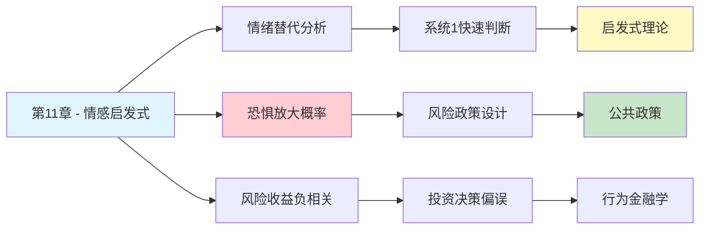

---

category: 
  - 书籍拆解

status: draft
chapter: 
number: 11
title: 焦虑情绪和概率错觉
links:

  - "[[第10章-稀缺性和可能性的错觉]]"
  - "[[第12章-科学与直觉推理]]"
  - "[[思考快与慢/_导航]]"
created: 2026-02-27
tags:
  - 思考快与慢
  - 情感启发式
  - 情绪与判断
  - 概率错觉
  - 风险认知
description: "第11章探讨情感启发式（affect heuristic）——情绪如何系统性地扭曲我们的概率判断，揭示焦虑、恐惧、愉悦等情感反应如何替代理性的风险分析，导致对危险事件概率的系统性高估或低估。"
---

# 第11章 焦虑情绪和概率错觉

## 📍 章节定位

### 全书位置
> 第11章探讨情感启发式（affect heuristic）——情绪如何系统性地扭曲我们的概率判断，揭示焦虑、恐惧、愉悦等情感反应如何替代理性的风险分析，导致对危险事件概率的系统性高估或低估。

- **全书核心问题**: 为什么人类的判断经常偏离理性？
- **本章回答的问题**: 情绪如何影响我们对风险和概率的判断？
- **角色类型**: 核心概念型（阐述情感启发式机制及效应）
- **论证位置**: 承接启发法系列，揭示情绪作为第三种判断捷径的作用

### 章节序列
| 方向 | 章节标题 | 逻辑连接 |
|------|----------|----------|
| 前章 | [[第10章-稀缺性和可能性的错觉]] | 前章讨论概率感知偏差，本章揭示情绪如何放大这种偏差 |
| 后章 | [[第12章-科学与直觉推理]] | 本章情绪判断与后章科学推理形成对比 |
| 整书 | [[思考快与慢-丹尼尔·卡尼曼]] | 阐述重要认知偏误——情感启发式 |

### 一句话定位
> 第11章揭示了情绪如何成为判断的"隐形操纵者"，当我们对某事感到恐惧或兴奋时，大脑会自动高估其发生概率，用感觉替代统计。

---

## 🎯 核心观点

### 第一层：表层案例

| 案例名称 | 简要描述 | 关键引文 |
|----------|----------|----------|
| 闪电vs食物中毒 | 人们高估被闪电击中的死亡率，低估食物中毒 | "恐惧的画面感强的事件被认为更致命" |
| 核能vs煤电 | 核能事故罕见但恐怖，煤电死亡更多但被忽视 | "核能的恐惧感掩盖了统计数据" |
| 恐怖袭击概率 | 911后美国人高估恐怖袭击概率数千倍 | "情绪记忆重塑了风险认知" |
| 疫苗风险判断 | 因负面报道而高估疫苗风险 | "故事比数据更有说服力" |

### 第二层：中层机制

| 机制名称 | 组成要素 | 因果链条 | 证据来源 |
|----------|----------|----------|----------|
| 情感启发式 | 情绪反应 + 概率判断替代 | 恐惧/兴奋→概率高估/低估→判断替代 | Slovic情感维度研究 |
| 情绪印记放大 | 强烈情绪 + 记忆强化 | 情绪强度→记忆深度→可用性提升→频率高估 | 神经认知心理学研究 |
| 恐惧主导效应 | 负面情绪优先 + 风险放大 | 恐惧>理性→危险高估→过度规避 | 演化心理学证据 |
| 确定性幻觉 | 情感确定感 → 概率确信 | 感觉确定→认为确定→统计忽视 | 认知心理学实验 |

### 第三层：底层规律

| 规律陈述 | 抽象层级 | 知识连接 | 适用范围 |
|----------|----------|----------|----------|
| 情感替代原则 | 认知经济机制 | 系统1特征, 启发式理论 | 所有涉及风险的判断 |
| 情绪-概率耦合律 | 心理物理学规律 | 情感心理学, 风险感知理论 | 风险决策领域 |
| 恐惧放大效应 | 演化适应机制 | 生存本能, 负面偏向 | 威胁判断场景 |

---

## 💬 降维翻译

### 观点1: 情感启发式的本质

#### 原文表达
> "当我们需要判断某事的风险或收益时，大脑不会去查统计数据，而是直接问自己：我对这件事感觉如何？如果感觉好，就认为风险低收益高；如果感觉差，就认为风险高收益低。这种用情感替代分析的方式，就是情感启发式。"

#### 降维翻译（中学生能懂）
当我们判断一件事危险不危险时，大脑有个偷懒的办法：
- 不去查统计数据
- 直接问自己"我怕不怕？"
- 怕就觉得危险，不怕就觉得安全

比如坐飞机 vs 坐汽车：
- 飞机坠落画面太恐怖 → 觉得坐飞机危险
- 汽车事故太平常 → 觉得坐汽车安全
- 但数据说：汽车死亡人数是飞机的几千倍

我们的感觉在"骗"我们。

#### 日常类比（奶奶能懂）
就像选菜一样，你说这菜好不好吃，不是去查营养成分表，而是看一眼、闻一下，心里有个"感觉"。但这感觉不一定准——看着不好看的可能很有营养，闻着香的可能是地沟油炒的。

#### 检验
- Q: 如果一个中学生问你这是什么意思？
- A: 人用"感觉"代替"数据"来判断风险，所以经常被情绪忽悠。

### 观点2: 焦虑如何扭曲概率判断

#### 原文表达
> "焦虑的情绪会系统性地放大我们对风险的感知。当我们对某件事感到恐惧或担忧时，大脑会自动高估其发生的概率，即使统计数据完全不支持这种判断。"

#### 降维翻译（中学生能懂）
你越害怕什么，就越觉得它会发生：
- 看了空难新闻 → 出门前反复检查机票
- 听说身边有人得癌 → 觉得自己身体也有问题
- 看恐怖片后 → 觉得黑暗里有人

其实这些事情发生的概率没变，变的是我们的"感觉"。

#### 日常类比（奶奶能懂）
就像小孩听了鬼故事，晚上总觉得床底下有人。其实没有人，但是害怕的感觉让他"看"到了不存在的东西。大人也一样，只是怕的东西不一样。

#### 检验
- Q: 如果一个中学生问你这是什么意思？
- A: 越怕什么越觉得会发生，这是大脑在骗自己。

### 观点3: 情绪与概率的"负相关陷阱"

#### 原文表达
> "人们对风险和收益的判断存在负相关：如果某事让我们感觉好，我们就认为它风险低、收益高；如果感觉差，就认为风险高、收益低。但实际上，风险和收益往往正相关——高风险才有高回报。"

#### 降维翻译（中学生能懂）
大脑有个奇怪的假设：
- 好事 = 安全 + 赚钱
- 坏事 = 危险 + 亏本

但现实是：
- 股票涨得好的公司，风险也大
- 看起来安全的选择，回报也低
- 高收益往往伴随着高风险

我们的情绪把这个关系搞反了。

#### 日常类比（奶奶能懂）
就像买菜，觉得便宜的菜肯定有问题，觉得贵的菜肯定好。但有时候便宜的只是当季多，贵的只是包装好看。感觉会骗人，价格和质量不一定对得上。

#### 检验
- Q: 如果一个中学生问你这是什么意思？
- A: 好事不一定安全，坏事不一定危险，但情绪会让我们这么想。

---

## ✨ 金句库

### 原书金句
| 金句 | 适用场景 |
|------|----------|
| "感觉好就认为安全，感觉差就认为危险" | 情感启发式科普 |
| "恐惧是概率的最大骗子" | 风险认知偏误 |
| "情绪替代了统计，直觉取代了计算" | 决策心理学 |
| "焦虑会放大风险感知" | 心理健康科普 |
| "我们用恐惧的强度来估计危险的频率" | 认知偏误分析 |

### 降维金句
| 金句 | 来源观点 | 适用场景 |
|------|----------|----------|
| "怕什么来什么？不，是怕什么就觉得什么会来" | 焦虑扭曲判断 | 心理调节 |
| "情绪是风险判断的滤镜，但滤镜有颜色" | 情感启发式 | 认知觉醒 |
| "感觉不会统计，只会讲故事" | 直觉替代分析 | 理性思维 |
| "恐惧让概率翻倍，安心让风险减半" | 情绪放大效应 | 决策提醒 |
| "心跳加速时，判断最不可信" | 生理影响认知 | 决策时机 |

## 🔗 当下映射

### 💰 财富应用
| 场景 | 具体行动 | 预期效果 | 风险提示 |
|------|----------|----------|----------|
| 投资决策 | 不因恐惧而错过好机会，不因兴奋而忽视风险 | 避免"追涨杀跌"情绪陷阱 | 需要建立数据决策习惯 |
| 保险购买 | 理性评估风险概率而非被营销话术恐吓 | 合理配置保险，不买冤枉险 | 需要理解真实风险数据 |
| 大额消费 | 不因销售营造的"紧迫感"冲动购买 | 减少后悔消费 | 需要24小时冷静期 |

### 💼 职场应用
| 场景 | 具体行动 | 所需能力 | 适用职级 |
|------|----------|----------|----------|
| 项目评估 | 用数据而非直觉判断项目风险 | 数据分析能力 | 项目经理 |
| 危机公关 | 理性评估而非被舆论恐慌带节奏 | 媒体素养 | 管理层 |
| 职业选择 | 不因恐惧而拒绝机会，不因兴奋而盲目跳槽 | 自我认知 | 全职级 |

### 🏠 生活应用
| 场景 | 具体行动 | 可行性 | 见效时间 |
|------|----------|--------|----------|
| 健康焦虑 | 区分真实风险和媒体渲染的风险 | 高 | 即时 |
| 育儿决策 | 不因网络焦虑帖而过度保护孩子 | 中 | 数周 |
| 人际关系 | 不因一次冲突就高估关系破裂概率 | 中 | 数月 |

### 72小时行动计划
1. **明天可以做的第一件事**: 回想最近一个让你焦虑的事情，问自己"我有数据支持这个担忧吗？还是只有感觉？"
2. **本周内可以尝试的事**: 记录3次你因情绪而做出判断的场景，事后分析这个判断是否理性
3. **需要准备资源才能做的事**: 建立个人"风险数据档案"，记录常见担忧的真实概率数据

---

## 🕸️ 章节关联

### 向上关联 → 整书
- **贡献**: 揭示情绪作为第三种判断捷径，完善启发式理论体系
- **位置**: 与代表性启发、可用性启发并列，构成三大核心启发式

### 横向关联 → 章节间
| 章节编号 | 章节标题 | 关联类型 | 连接描述 |
|----------|----------|----------|----------|
| 第6章 | 回忆的便利性 | 并列 | 可用性启发 + 情感维度 = 情感启发式 |
| 第10章 | 稀缺性和可能性的错觉 | 承接 | 概率错觉的放大机制——情绪 |
| 第12章 | 科学与直觉推理 | 对比 | 情绪判断 vs 科学推理 |
| 第13章 | 焦虑情绪与风险政策的设计 | 延伸 | 本章理论的政策应用 |
| 第29章 | 对结果可能性的权衡 | 深入 | 情绪如何影响决策权重 |

### 向下关联 → 具体应用
| 应用场景 | 难度 | 前置知识 |
|----------|------|----------|
| 风险沟通设计 | 高 | 情感心理学基础 |
| 焦虑症认知疗法 | 高 | 临床心理学背景 |
| 媒体素养教育 | 中 | 批判性思维基础 |

### 跨书关联 → 知识网络
| 书籍 | 概念 | 关系 | 备注 |
|------|------|------|------|
| [[思考快与慢-丹尼尔·卡尼曼]] | 情感启发式 | 同源 | 理论源头 |
| [[清醒思考的艺术-多贝里]] | 恐惧偏误 | 系列化应用 | 情感启发式的具体表现 |
| [[黑天鹅-塔勒布]] | 叙事谬误 | 互补 | 故事比数据更有说服力 |
| [[影响力-西奥迪尼]] | 恐惧诉求 | 应用 | 营销中利用恐惧影响判断 |
| [[非对称风险-塔勒布]] | 情绪与风险 | 对比 | 塔勒布强调情绪的信号价值 |

### 关联可视化

---

## ❓ 问答设计

### Q1: [记忆型问题]
**认知层次**: 记忆
**难度**: 低
**描述**: 什么是情感启发式？
**答案要点**:
- 用情感反应替代理性分析
- 感觉好→风险低，感觉差→风险高
- 属于系统1的快速判断方式

### Q2: [理解型问题]
**认知层次**: 理解
**难度**: 中
**描述**: 为什么恐惧会让我们高估风险概率？
**答案要点**:
- 情绪强化记忆，提升可用性
- 系统1自动将恐惧强度等同于风险概率
- 演化机制让我们对威胁更敏感

### Q3: [应用型问题]
**认知层次**: 应用
**难度**: 中
**描述**: 如何避免情感启发式的负面影响？
**答案要点**:
- 主动查找统计数据
- 区分"感觉"和"事实"
- 在情绪平静时做重要决策

### Q4: [分析型问题]
**认知层次**: 分析
**难度**: 中
**描述**: 情感启发式与可用性启发式的关系？
**答案要点**:
- 可用性关注记忆提取便利性
- 情感关注情绪反应强度
- 两者经常叠加：情绪强烈的事件也更容易回忆

### Q5: [创造型问题]
**认知层次**: 创造
**难度**: 高
**描述**: 设计一个帮助人们识别情感启发式的训练方法？
**答案要点**:
- 设置"感觉 vs 数据"对比题
- 记录直觉判断与统计事实的差距
- 建立个人偏误检查清单

### Q6: [理解型问题]
**认知层次**: 理解
**难度**: 中
**描述**: 为什么媒体新闻报道会放大公众的风险感知？
**答案要点**:
- 新闻偏好极端、罕见、可怕的事件
- 恐怖画面激发强烈情绪
- 情绪提升记忆可用性
- 可用性替代统计形成错误概率判断

### Q7: [应用型问题]
**认知层次**: 应用
**难度**: 中
**描述**: 在投资中如何克服恐惧带来的判断偏差？
**答案要点**:
- 建立数据驱动的投资纪律
- 不在市场恐慌时做决策
- 制定事前规则并严格执行

### Q8: [分析型问题]
**认知层次**: 分析
**难度**: 高
**描述**: 情感启发式在进化中的意义是什么？
**答案要点**:
- 快速识别威胁，提高生存率
- 宁可误报也不要漏报危险
- 在原始环境中有生存价值
- 在现代社会可能过度激活

### Q9: [理解型问题]
**认知层次**: 理解
**难度**: 中
**描述**: 为什么人们对"好"事的风险收益判断存在负相关？
**答案要点**:
- 认知一致性需求
- 好感觉需要好解释支撑
- 系统1追求连贯性而非准确性

### Q10: [创造型问题]
**认知层次**: 创造
**难度**: 高
**描述**: 如何利用情感启发式的原理设计更好的风险沟通方式？
**答案要点**:
- 数据可视化，让抽象变得具体
- 用正面情绪平衡负面新闻
- 提供行动建议，减少无助感
- 强调可控性，降低焦虑

---

## 📝 备注

### 信息来源与质量评级
- **第一轮检索**: ⭐⭐⭐ 百度百科书籍目录、豆瓣读书、微信读书
- **第二轮检索**: ⭐⭐⭐ 英文搜索情感启发式学术资料
- **信息整合**: 已有章节格式 + 情感启发式理论 + 风险认知研究

### 章节特色
本章揭示了情绪作为判断捷径的第三种形态，是理解"为什么聪明人会做蠢事"的关键章节。情感启发式在投资、健康、公共决策等领域有广泛应用价值。
