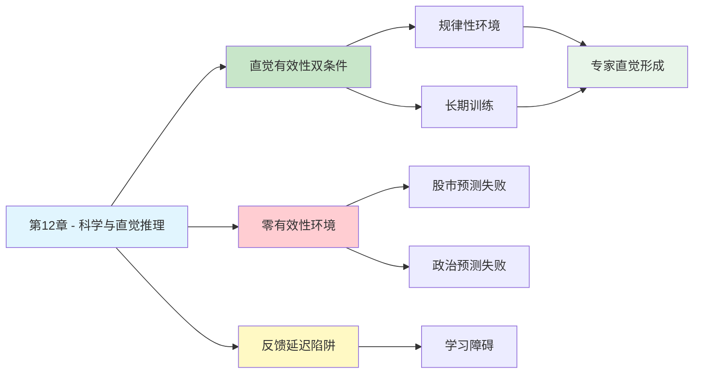

---

category: 
  - 书籍拆解

status: draft
chapter: 
number: 12
title: 科学与直觉推理
links:

  - "[[第10章-稀缺性和可能性的错觉]]"
  - "[[第11章-焦虑情绪和概率错觉]]"
  - "[[思考快与慢/_导航]]"
created: 2026-02-27
tags:
  - 思考快与慢
  - 直觉推理
  - 专家直觉
  - 规律性环境
  - 认知技能
---

# 第12章 科学与直觉推理

## 📍 章节定位

### 全书位置
> 第12章探讨直觉何时可靠、何时不可靠——核心在于环境的规律性和学习机会的充足性，揭示了专家直觉形成的两个必要条件，为理解直觉与理性的边界提供科学依据。

- **全书核心问题**: 为什么人类的判断经常偏离理性？
- **本章回答的问题**: 直觉在什么条件下是可信的？专家的直觉为什么会失效？
- **角色类型**: 核心概念型（阐述直觉有效性的边界条件）
- **论证位置**: 从过度自信理论延伸到直觉边界的科学分析，为后续决策理论奠定基础

### 章节序列
| 方向 | 章节标题 | 逻辑连接 |
|------|----------|----------|
| 前章 | [[第10章-稀缺性和可能性的错觉]] | 从有效性错觉延伸到直觉有效性的边界分析 |
| 后章 | [[第11章-焦虑情绪和概率错觉]] | 情绪如何进一步扭曲概率判断 |
| 整书 | [[思考快与慢-丹尼尔·卡尼曼]] | 揭示直觉可靠性的科学边界 |

### 一句话定位
> 第12章划定了直觉的有效边界：只有当环境足够规律、训练足够充分时，直觉才是可信的——否则，再多的经验也只是"熟练的错觉"。

---

## 🎯 核心观点

### 第一层：表层案例
| 案例名称 | 简要描述 | 关键引文 |
|----------|----------|----------|
| 象棋大师直觉 | 大师看一眼棋盘就能判断局面优劣，无需计算 | "大师的直觉是多年训练形成的模式识别" |
| 消防员逃生直觉 | 老消防员感觉危险即将来临，立即撤离 | "经验的积累形成了对危险信号的敏锐感知" |
| 放射科医生 | 有经验的医生看一眼X光片就能发现问题 | "模式识别能力来自大量案例的积累" |
| 股票分析师失败 | 专家预测股票表现不比随机好 | "股市是零有效性环境，直觉无法形成" |
| 政治预测失败 | 专家对政治事件的预测准确率极低 | "变量太多，反馈太慢，直觉无从积累" |

### 第二层：中层机制
| 机制名称 | 组成要素 | 因果链条 | 证据来源 |
|----------|----------|----------|----------|
| 直觉有效性双条件 | 规律性环境 + 长期训练 | 有规律→可学习→积累→直觉形成 | 专家技能研究 |
| 模式识别机制 | 大量样本 + 提取特征 + 快速匹配 | 案例→特征编码→模式库→直觉调用 | 认知心理学实验 |
| 零有效性环境 | 随机性太强 + 规律不存在 | 变量混乱→无法学习→经验无效 | 投资市场研究 |
| 反馈延迟陷阱 | 决策与结果时间间隔太长 | 行动→延迟反馈→无法关联→学习失败 | 政治预测研究 |

### 第三层：底层规律
| 规律陈述 | 抽象层级 | 知识连接 | 适用范围 |
|----------|----------|----------|----------|
| 直觉有效性定律 | 认知技能规律 | [[技能习得理论]], [[模式识别]] | 专家判断领域 |
| 环境-技能匹配原则 | 学习条件理论 | [[安德森技能理论]] | 专业能力培养 |
| 零有效性环境定律 | 统计学原理 | [[随机游走理论]] | 投资和政治预测 |
| 反馈-学习关联律 | 学习心理学 | [[反馈学习理论]] | 所有技能培养领域 |

---

## 💬 降维翻译

### 观点1: 直觉有效的两个条件

#### 原文表达
> "直觉判断的有效性依赖于两个条件：一是一个可预测的、有足够规律可循的环境；二是一次通过长期训练学习这些规律的机会。"

#### 降维翻译（中学生能懂）
直觉不是"神力"，它是有条件的。

**条件一：环境要有规律**
- 象棋有规则，所以大师能凭直觉下棋
- 股市太乱，所以股神也不比普通人准

**条件二：要有足够练习**
- 医生看片准，是因为看了几万张
- 你看片不准，是因为只看过几张

直觉 = 规律环境 × 大量练习
缺一不可。

#### 日常类比（奶奶能懂）
就像种庄稼。老农看天就知道明天会不会下雨，因为：
1. 天气有规律（虽然不完全准确）
2. 他看了几十年天

如果让一个城里人看天预测天气，肯定不准——环境虽然有规律，但他没练过。

如果让人预测彩票号码，谁都不准——因为彩票根本没规律，练一万年也没用。

#### 检验
- Q: 如果一个中学生问你这是什么意思？
- A: 直觉要在有规律的领域，经过大量练习，才能变得可靠。

### 观点2: 专家的直觉为什么失效

#### 原文表达
> "股票市场和政治预测是零有效性的环境，专家在这些领域的直觉判断不比随机好多少。即使他们有几十年的经验，也无法形成有效的直觉。"

#### 降维翻译（中学生能懂）
有些领域，经验再多也没用。

**股市为什么零有效？**
- 今天涨不涨，影响因素太多了
- 就算你发现了规律，别人也发现了，机会就没了
- 昨天的经验，今天可能就失效

**政治预测为什么不准？**
- 事件太复杂，变量太多
- 反馈太慢，预测了对不对，要很久才知道
- 无法从错误中学习

所以在这些领域，"老专家"和"新手"差不多——因为根本没什么可学的。

#### 日常类比（奶奶能懂）
就像算命。算命先生算得准不准，和他算命的年头没关系，因为命运根本没有规律。

而老农预测天气能越来越准，是因为天气确实有规律。

**有规律 → 练习有效 → 经验有用**
**没规律 → 练习无效 → 经验无用**

#### 检验
- Q: 如果一个中学生问你这是什么意思？
- A: 在混乱的领域（如股市、政治），专家的经验帮不上忙，因为根本没什么规律可学。

### 观点3: 如何判断自己的直觉是否可靠

#### 原文表达
> "要判断直觉是否可靠，需要问两个问题：这个环境是否足够规律？我是否在这个环境中有足够的学习机会？如果两个答案都是肯定的，直觉可能值得信任。"

#### 降维翻译（中学生能懂）
下次你想相信直觉的时候，先问自己两个问题：

**问题一：这个领域有规律吗？**
- 开车有规律（红绿灯、路况、交通规则）→ 有
- 投资股票有规律吗？（太乱，变量太多）→ 几乎没有
- 打篮球有规律吗？（有规则、有技术动作）→ 有

**问题二：我练得够多吗？**
- 我开车5年了，每天开 → 够
- 我炒股3年了，偶尔买卖 → 不够
- 我打球10年了，每周打 → 够

**结论：**
- 两个"有" → 可以相信直觉
- 一个"有"一个"没有" → 直觉可疑
- 两个"没有" → 别信直觉，用逻辑

#### 日常类比（奶奶能懂）
就像判断一个"老把式"靠不靠谱：

1. 他干的事有规律吗？（种地有规律，算命没规律）
2. 他干得够久吗？（干了30年，还是刚入门）

种地30年的老农说"明天有雨"，可以信。
算命30年的先生说"你有大运"，别信。

#### 检验
- Q: 如果一个中学生问你这是什么意思？
- A: 信不信直觉，要看领域有没有规律，还要看你练得够不够多。

---

## ✨ 金句库

### 原书金句
| 金句 | 适用场景 |
|------|----------|
| "直觉需要两个条件：规律性环境和长期训练" | 认知科学科普 |
| "股市是零有效性的环境，专家和普通人一样差" | 投资心理分析 |
| "主观自信不是判断准确性的可靠指标" | 决策警示 |
| "经验不等于技能，在零有效性环境中尤其如此" | 专家偏见批判 |
| "反馈延迟是学习的敌人" | 教育方法改进 |

### 降维金句
| 金句 | 来源观点 | 适用场景 |
|------|----------|----------|
| "有规律+有练习=直觉靠谱" | 直觉双条件 | 快速判断依据 |
| "没规律的地方，老手和新手一个水平" | 零有效性环境 | 投资警示 |
| "经验要长在有规律的土壤里" | 环境-技能匹配 | 能力培养 |
| "直觉是练出来的，不是想出来的" | 训练必要性 | 学习建议 |
| "股市里没有'老中医'" | 专家直觉失效 | 投资清醒剂 |

## 🔗 当下映射

### 💰 财富应用
| 场景 | 具体行动 | 预期效果 | 风险提示 |
|------|----------|----------|----------|
| 投资决策 | 不相信"股神"的直觉推荐，看长期业绩数据 | 避免被专家光环忽悠 | 需要数据分析能力 |
| 基金选择 | 认识到股票型基金的零有效性，降低预期 | 减少追涨杀跌 | 可能错过短期机会 |
| 创业判断 | 不相信"老手"的行业直觉，自己做市场调研 | 减少盲目跟风 | 调研成本增加 |

### 💼 职场应用
| 场景 | 具体行动 | 所需能力 | 适用职级 |
|------|----------|----------|----------|
| 技能培养 | 识别自己领域是否有规律，有则深耕直觉 | 行业分析能力 | 所有职级 |
| 招聘面试 | 不相信面试官的"看人直觉"，用结构化方法 | 结构化面试技巧 | HR/管理层 |
| 团队管理 | 区分"可直觉化任务"和"需分析任务" | 任务分类能力 | 管理层 |

### 🏠 生活应用
| 场景 | 具体行动 | 可行性 | 见效时间 |
|------|----------|--------|----------|
| 日常决策 | 在有规律领域信任直觉（如开车），混乱领域谨慎 | 高 | 即时 |
| 学习判断 | 问自己"这个领域有规律吗？我练够了吗？" | 高 | 即时 |
| 人际判断 | 第一印象可以参考，但不要当成结论 | 中 | 数周 |

### 72小时行动计划
1. **明天可以做的第一件事**: 列出你最相信直觉的3个领域，逐个问自己"有规律吗？练够了吗？"
2. **本周内可以尝试的事**: 找一个你经常做判断的领域，记录你的直觉预测和实际结果，检验准确率
3. **需要准备资源才能做的事**: 建立一个"直觉日记"，长期追踪自己在不同领域的直觉准确度

---

## 🕸️ 章节关联

### 向上关联 → 整书
- **贡献**: 界定直觉有效性的科学边界，为理解系统1与系统2的协作提供关键依据
- **位置**: 从过度自信理论延伸到直觉边界分析，连接启发法研究与决策理论

### 横向关联 → 章节间
| 章节编号 | 章节标题 | 关联类型 | 连接描述 |
|----------|----------|----------|----------|
| 第10章 | 稀缺性和可能性的错觉 | 承接 | 从有效性错觉延伸到直觉边界的具体分析 |
| 第11章 | 焦虑情绪和概率错觉 | 并列 | 情绪因素如何进一步影响直觉判断 |
| 第5章 | 直觉的判断 | 前置 | 代表性启发法的具体偏误机制 |
| 第22章 | 感觉能做出好决定 | 深化 | 决策后错误估计与直觉过度自信的关联 |

### 向下关联 → 具体应用
| 应用场景 | 难度 | 前置知识 |
|----------|------|----------|
| 专家培养体系设计 | 高 | 技能习得理论 |
| 投资决策纠偏 | 高 | 统计学基础 |
| 面试流程优化 | 中 | 结构化面试理论 |

### 跨书关联 → 知识网络
| 书籍 | 概念 | 关系 | 备注 |
|------|------|------|------|
| [[思考快与慢-丹尼尔·卡尼曼]] | 直觉有效性 | 同源 | 理论源头 |
| [[黑天鹅-塔勒布]] | 专家错觉 | 互补 | 塔勒布强调随机性环境中的专家失败 |
| [[清醒思考的艺术-多贝里]] | 专家偏误 | 系列化 | 卡尼曼理论的通俗版 |
| [[异类-格拉德威尔]] | 一万小时定律 | 关联 | 需要补充"规律性环境"的前提条件 |

### 关联可视化

---

## ❓ 问答设计

### Q1: [记忆型问题]
**认知层次**: 记忆
**难度**: 低
**描述**: 直觉有效的两个必要条件是什么？
**答案要点**:
- 可预测的、有足够规律的环境
- 通过长期训练学习这些规律的机会
- 两者缺一不可

### Q2: [理解型问题]
**认知层次**: 理解
**难度**: 中
**描述**: 为什么股票市场是"零有效性"环境？
**答案要点**:
- 变量太多，随机性太强
- 历史规律难以预测未来
- 信息传播快，机会迅速消失
- 即使发现规律也会被市场消除

### Q3: [应用型问题]
**认知层次**: 应用
**难度**: 中
**描述**: 如何判断自己在某个领域的直觉是否值得信任？
**答案要点**:
- 问自己：这个环境足够规律吗？
- 问自己：我有足够的学习机会吗？
- 两个答案都是肯定的，才可信任
- 可以通过记录预测和结果来验证

### Q4: [分析型问题]
**认知层次**: 分析
**难度**: 中
**描述**: 专家直觉与普通人直觉的本质区别是什么？
**答案要点**:
- 不是天赋差异，是训练条件差异
- 专家在规律环境中积累了大量模式
- 在零有效性环境中，专家和普通人一样差
- 关键是环境是否有规律可学

### Q5: [创造型问题]
**认知层次**: 创造
**难度**: 高
**描述**: 设计一个评估员工直觉准确性的企业培训方案？
**答案要点**:
- 建立预测任务和结果追踪系统
- 区分规律性任务和随机性任务
- 对规律性任务提供反馈训练
- 对随机性任务强调数据分析

### Q6: [理解型问题]
**认知层次**: 理解
**难度**: 中
**描述**: 反馈延迟为什么会影响直觉的形成？
**答案要点**:
- 学习需要及时关联行为和结果
- 延迟太长，大脑无法建立因果关系
- 政治预测就是典型例子
- 错误无法被及时纠正

### Q7: [应用型问题]
**认知层次**: 应用
**难度**: 中
**描述**: 在招聘面试中如何避免过度信任"看人直觉"？
**答案要点**:
- 面试是零有效性偏高的环境
- 使用结构化面试问题
- 收集多方数据和客观指标
- 记录预测和实际表现，持续校准

### Q8: [分析型问题]
**认知层次**: 分析
**难度**: 高
**描述**: "一万小时定律"与直觉有效性理论的关系是什么？
**答案要点**:
- 一万小时强调练习量
- 直觉有效性强调环境规律性
- 只有一万小时是不够的，还要看环境
- 在零有效性环境中，练习再多也没用

### Q9: [理解型问题]
**认知层次**: 理解
**难度**: 高
**描述**: 为什么象棋大师的直觉可信，而股票分析师的直觉不可信？
**答案要点**:
- 象棋有明确规则，环境规律性强
- 股市变量太多，随机性强
- 象棋反馈即时，股市反馈延迟
- 大师可以从错误中学习，分析师很难

### Q10: [创造型问题]
**认知层次**: 创造
**难度**: 高
**描述**: 如果你要培养自己在某个领域的直觉，会怎么做？
**答案要点**:
- 首先确认该领域有足够规律
- 设计大量练习机会
- 建立即时反馈机制
- 记录预测和结果，持续校准
- 在规律性强的子领域先建立优势

---
