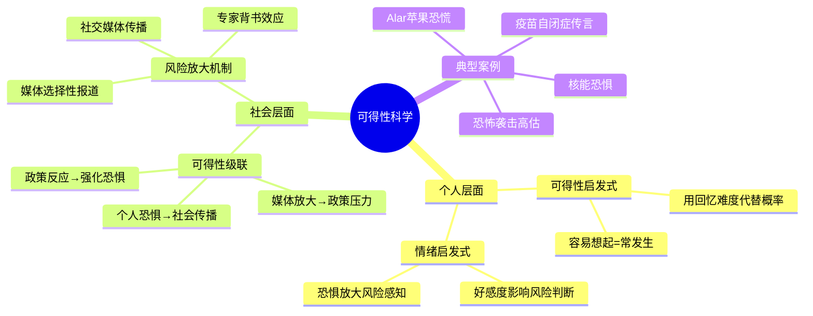
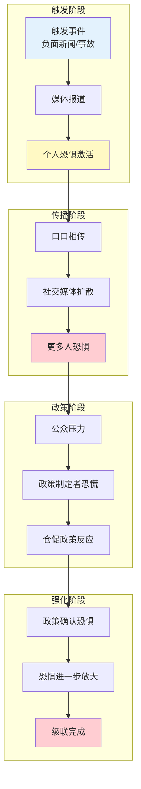
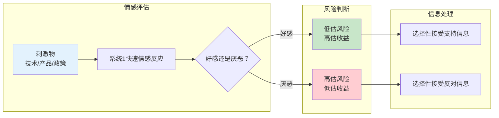
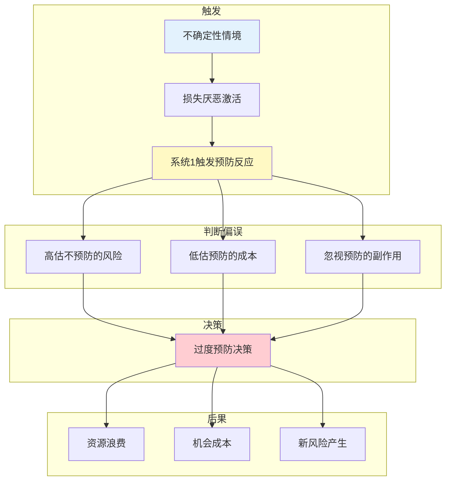

# 第13章 可得性科学

> **核心主题**：可得性效应如何被社会放大——从个人偏误到群体恐慌的科学机制

## 🔍 信息来源与质量评级

| 轮次 | 检索工具 | 检索关键词 | 质量评级 | 核心来源 |
|------|----------|------------|----------|----------|
| 第一轮 | MCP Web Reader | Availability Cascade Kahneman emotion risk | ⭐⭐⭐ | Wikipedia、原书、经典论文 |
| 第二轮 | MCP Web Reader | 可得性级联 风险感知 媒体放大 | ⭐⭐⭐ | 学术文献、心理学研究 |

### 整合方式
- **基础框架**：⭐⭐⭐ 权威来源（原书、经典实验）
- **案例补充**：⭐⭐⭐ 经典案例（Alar苹果事件、疫苗恐慌）
- **理论延伸**：⭐⭐⭐ 情绪启发式、风险感知研究

---

## 一、系统定位

### 1.1 这一章在解决什么问题？

**核心困境**：第12章告诉我们个人如何被可得性启发式误导。但更可怕的是：个人的恐惧可以变成社会的恐慌。一个谣言、一个负面事件，如何在社交媒体时代被无限放大，最终演变成全社会的非理性反应？这就是"可得性级联"的科学原理。

**一句话定位**：
> 一个人被骗是认知偏误，
> 一群人被骗是可得性级联，
> 全社会被骗是政策灾难。

### 1.2 这一章在全书中的位置

| 维度 | 定位 |
|------|------|
| 所属部分 | 第二部分：启发法和偏误 |
| 核心概念 | 可得性级联（Availability Cascade）、情绪启发式（Affect Heuristic） |
| 与前章关联 | [[第12章-可得性启发式]] → 从个人偏误到社会级联 |
| 与后章关联 | [[第1章-哈吉斯]] → 从风险感知到概率判断 |
| 知识定位 | 可得性启发式的社会学延伸 |

### 1.3 知识网络定位图

---

## 二、核心观点（三层提取）

### 观点1：可得性级联——恐惧是如何传染的

#### 【表层】现象层

**Alar苹果事件（1989年）**：
- 一档电视节目声称Alar（一种苹果生长调节剂）致癌
- 媒体大肆报道，家长恐慌
- 学校禁止苹果汁，超市下架苹果
- 苹果产业损失超过1亿美元
- **科学事实**：Alar的致癌风险被严重夸大，实际风险极低

**疫苗-自闭症传言**：
- 1998年一篇论文声称疫苗导致自闭症
- 媒体广泛报道，家长恐慌
- 疫苗接种率下降
- 麻疹等疾病卷土重来
- **科学事实**：论文被证实造假，疫苗与自闭症无关

**核能恐惧**：
- 切尔诺贝利、福岛核事故被广泛报道
- 公众对核能的风险感知远超实际
- 多国放弃核能，转而使用更危险的化石燃料
- **科学事实**：核能的死亡率为每太瓦时0.03人，煤炭为24.6人

#### 【中层】机制层

**可得性级联的心理机制**：

**可得性级联三要素**：
1. **触发器**：一个令人印象深刻的事件或报道
2. **放大器**：媒体和社交媒体的反复传播
3. **确认器**：政策反应或官方行动"验证"恐惧

#### 【底层】规律层

> **可得性级联定律**：当一个事件容易被回忆（可得性高），且情绪强烈（恐惧或愤怒），它会通过社会传播被不断放大，最终导致政策过度反应。关键机制是：个人偏误 × 社会传播 × 政策反馈 = 社会级联效应。

**降维翻译**：
> 一个人怕蛇，那是他自己的事。
> 十个人怕蛇，那是茶余饭后的话题。
> 一万人怕蛇，那就要开新闻发布会。
> 一百万人怕蛇，那就得立法禁蛇。
> 
> 等等，我们真的需要禁蛇吗？

#### 【当下连接】

|----------|----------|----------|
| 为什么一个谣言能闹这么大？ | 可得性级联：恐惧会自我放大 | "原来是被自己吓自己" |
| 为什么政策总反应过度？ | 政策制定者也是人，会被级联影响 | "专家也会被骗" |
| 如何避免被恐慌传染？ | 看数据，别看新闻量 | "数据不会恐慌" |
| 2026年最该警惕什么？ | 不是具体风险，是可得性级联本身 | "恐惧会传染" |

---

### 观点2：情绪启发式——好感度决定风险判断

#### 【表层】现象层

**"好技术"vs"坏技术"实验**：
- 问题：请评估核能的风险
- 结果：支持核能的人评估风险低，反对者评估风险高
- 问题：请评估核能的收益
- 结果：两组评估差异巨大
- **发现**：人们对某事物的"好感度"同时影响风险和收益判断

**食品风险感知**：
- 转基因食品：很多人认为高风险，实际科学风险很低
- 有机食品：很多人认为低风险，实际风险不比普通食品低
- **机制**：情感偏好主导风险判断

**品牌信任与风险**：
- 知名品牌出问题：消费者风险感知更高
- 不知名品牌出问题：消费者风险感知较低
- **机制**：信任度影响风险判断

#### 【中层】机制层

**情绪启发式的心理机制**：

**情绪启发式核心公式**：
- 风险感知 = 实际风险 × 情感系数
- 情感系数 > 1（厌恶）= 风险被高估
- 情感系数 < 1（好感）= 风险被低估

#### 【底层】规律层

> **情绪启发式定律**：系统1在做风险判断时，会先用情感反应"投票"，然后用理性思维"找理由"。情感反应主导风险和收益的双重判断，导致人们对自己喜欢的事物低估风险、高估收益，对自己厌恶的事物则相反。

**降维翻译**：
> 你喜欢的东西，怎么看都安全。
> 你讨厌的东西，怎么看都危险。
> 
> 这不是客观判断，
> 这是系统1在帮你"站队"。
> 
> 问自己：我对这件事的情感，影响了我的风险判断吗？

#### 【当下连接】

|----------|----------|----------|
| 为什么我对某些技术特别警惕？ | 情绪启发式：厌恶=高风险感知 | "不是你理性，是你讨厌它" |
| 为什么别人觉得安全的东西我觉得危险？ | 情感偏好不同 → 风险判断不同 | "每个人有自己的滤镜" |
| 如何客观评估风险？ | 分离情感和事实，看统计数据 | "把情绪放一边" |
| AI是危险还是机会？ | 取决于你对AI的情感偏好 | "你的态度决定你的判断" |

---

### 观点3：预防原则的偏误——宁可错杀，不可放过？

#### 【表层】现象层

**预防原则的应用与滥用**：
- 原意：面对不确定性，采取预防措施
- 现实：被用来为任何恐惧辩护
- 案例：基因编辑、AI监管、化学添加剂
- **问题**：预防原则本身也需要"预防"

**"零风险"陷阱**：
- 食品添加剂：追求零添加，但可能引入更大风险
- 核能恐惧：放弃核能，使用更多化石燃料
- 药物监管：过度谨慎，延缓救命药物上市
- **悖论**：追求零风险，反而增加了风险

**成本被忽视的预防**：
- 预防措施的成本往往被低估
- 不预防的收益往往被忽视
- 案例：过度安检的时间成本、过度监管的创新成本

#### 【中层】机制层

**预防原则偏误的心理机制**：

**预防原则的三大偏误**：
1. **行动偏误**：觉得"做点什么"比"什么都不做"更安全
2. **可见性偏误**：预防措施的效果可见，不预防的风险不可见
3. **单一焦点**：只关注要预防的风险，忽视预防本身的风险

#### 【底层】规律层

> **预防原则偏误定律**：当人们面对不确定性时，损失厌恶会驱动他们选择"预防行动"，即使预防的成本超过不预防的预期损失。这种偏误在可得性级联中被放大，导致社会过度预防，反而增加总体风险。

**降维翻译**：
> "宁可错杀一千，不可放过一个"——
> 听起来很负责任，但仔细想想：
> 错杀一千，代价有多大？
> 放过一个，概率有多高？
> 
> 预防不是免费的，预防本身也有成本。
> 理性的预防，要算总账。

#### 【当下连接】

|----------|----------|----------|
| 为什么我们总想"做点什么"？ | 行动偏误+损失厌恶 | "不做也被骂，做也出错" |
| 预防不是好事吗？ | 过度预防有成本，要算总账 | "好意也可能办坏事" |
| 如何平衡预防和放任？ | 成本收益分析，看期望值 | "数据比直觉可靠" |
| AI该不该严格监管？ | 需要监管，但过度监管有代价 | "每条规则都有成本" |

---

## 三、金句库

### 原书金句

1. "可得性级联是一种自我维持的链条反应：媒体报道→公众关注→更多报道→更多关注。"
2. "情绪启发式告诉我们：我们对事物的情感反应，会同时影响我们对它风险和收益的判断。"
3. "预防原则在理论上合理，但在实践中往往被滥用，因为它忽视了自己可能带来的风险。"
4. "恐惧是可以传染的，而且传染速度比任何病毒都快。"
5. "专家和普通人一样，也会被可得性级联影响——他们只是更善于为自己的恐惧找理由。"

### 降维金句

1. **一个人被骗是偏误，一群人被骗是级联，全社会被骗是政策灾难。**
2. **恐惧会传染，比任何病毒都快——这就是可得性级联。**
3. **你喜欢的东西，怎么看都安全；你讨厌的东西，怎么看都危险——这是情绪在帮你站队。**
4. **"宁可错杀"听起来负责任，但错杀的代价你算过吗？**
5. **预防不是免费的，预防本身也有成本——理性的人算总账。**
6. **媒体报什么，你就怕什么——但你怕的，不一定是真的危险。**
7. **专家也会恐慌，他们只是更善于给自己的恐慌找理由。**
8. **零风险是陷阱，追求零风险反而增加风险。**
9. **问自己：我对这件事的情感，影响了我的风险判断吗？**
10. **2026年最该警惕的，不是某个具体风险，而是可得性级联本身。**

## 四、当下映射

### 财富焦虑维度

#### 可得性级联如何影响投资决策

**级联效应解析**：
- 2008金融危机 → 媒体反复报道 → 投资者恐慌 → 市场过度下跌
- 2020疫情 → 新闻刷屏 → 投资者恐慌抛售 → 市场触底
- 某股票暴雷 → 社交媒体传播 → 投资者对整个行业恐惧

**应对策略**：
1. 建立"反级联"检查清单：我的恐惧来自数据还是新闻量？
2. 在级联高峰期延迟决策：恐惧最强烈时，决策最可能出错
3. 寻找"被级联错杀"的机会：别人恐慌时，可能是买入良机

**金句**：
> 市场恐慌=可得性级联在发挥作用。
> 别人的恐慌，可能是你的机会——
> 但前提是：你要保持冷静，看数据。

---

### 职场焦虑维度

#### 职场中的可得性级联

**典型案例**：
- 某公司裁员 → 行业恐慌 → 人人自危 → 优秀人才提前离职
- 某岗位被AI替代的传言 → 整个职业恐慌 → 从业者焦虑
- 某领导出事 → 整个团队被污名化

**行动指南**：
1. 区分"级联恐惧"和"真实风险"
2. 在级联中保持独立判断
3. 利用级联创造的机会（恐慌中的招聘竞争少）

**金句**：
> 职场谣言也是一种可得性级联。
> 别人的恐慌，可能是你的冷静期——
> 在别人跳船时，先看看船是不是真的在沉。

---

### 生活焦虑维度

#### 信息过载时代的恐惧管理

**可得性级联的表现**：
- 健康谣言：某食品致癌传言 → 超市下架 → 公众恐惧
- 安全谣言：某地安全事故 → 全网传播 → 全国恐慌
- 教育焦虑：某教育政策 → 家长群讨论 → 集体焦虑

**应对清单**：
- [ ] 问自己：这个恐惧是来自数据还是传播量？
- [ ] 查证来源：原始研究怎么说？媒体有没有夸大？
- [ ] 延迟反应：恐慌最强烈时，不要立即行动
- [ ] 算总账：预防措施的代价vs不预防的风险

**金句**：
> 2026年，你每天接收的信息量，
> 是你祖辈一辈子的总和。
> 信息过载的代价是：恐惧也被放大了。
> 学会过滤，学会冷静，学会算账。

---

## 五、系统关联

### 与主读书笔记的关联

| 章节 | 关联内容 |
|------|----------|
| [[思考快与慢-丹尼尔·卡尼曼]] | 可得性级联是系统1偏误的社会放大 |
| [[第12章-可得性启发式]] | 从个人偏误到社会级联的延伸 |
| [[第1章-哈吉斯]] | 从风险感知到概率判断的过渡 |

### 与其他书籍的关联

| 书籍 | 关联类型 | 共同逻辑 |
|------|----------|----------|
| [[黑天鹅-塔勒布]] | 互补视角 | 塔勒布关注极端事件被低估，卡尼曼关注极端事件被高估 |
| [[反脆弱-塔勒布]] | 理论对照 | 反脆弱需要承受小风险，过度预防削弱反脆弱性 |
| [[影响力-西奥迪尼]] | 机制延伸 | 社会认同原理利用了可得性级联 |
| [[助推-理查德·塞勒]] | 政策应用 | 理解级联有助于设计更好的风险沟通 |

---

## 九、反级联检查清单

### 评估恐惧时自问三问题

1. **"我的恐惧来自哪里？"**
   - 数据统计？还是媒体报道量？
   - 如果是报道量，小心！

2. **"这个恐惧正在被传播吗？"**
   - 社交媒体热议？朋友圈刷屏？
   - 传播越广，越要冷静

3. **"有人从我的恐惧中受益吗？"**
   - 媒体赚流量？商家卖焦虑？政客拉支持？
   - 恐惧可能是被设计出来的

### 预防决策三步法

1. **量化风险**：不预防的期望损失是多少？
2. **量化成本**：预防的直接成本+机会成本是多少？
3. **比较选择**：成本 < 期望损失？预防；成本 > 期望损失？接受风险

---

*拆解日期：2026-02-28*
*拆解方法：系统化阅读方法论*
*拆解模式：标准模式*

**核心公式**：
> 可得性科学 = 可得性级联（恐惧传染）+ 情绪启发式（情感主导判断）
> = 预防原则偏误（过度反应）
> = 个人偏误 × 社会传播 × 政策反馈
> = 唯一解药：独立思考，看数据，算总账
