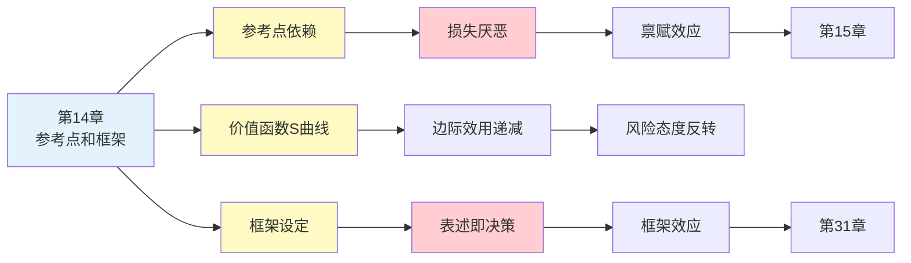

---

category: 
  - 书籍拆解

status: draft
chapter: 
number: 14
title: 参考点和框架
links:

  - "[[第13章-拒绝风险的穷人和寻求风险的富人]]"
  - "[[第15章-禀赋效应]]"
  - "[[第31章-框架效应]]"
  - "[[思考快与慢/_导航]]"
created: 2026-02-27
tags:
  - 思考快与慢
  - 参考点
  - 框架效应
  - 前景理论
  - 价值函数
  - 损失厌恶
---

# 第14章 参考点和框架

## 📍 章节定位

### 全书位置
> 第14章是前景理论的核心章节，系统阐述"参考点"如何决定价值判断——你现在的处境决定了什么算"得"、什么算"失"。这是理解人类决策非理性的关键枢纽。

- **全书核心问题**: 为什么人们对同样的事物会有截然不同的价值判断？
- **本章回答的问题**: 参考点如何影响决策？为什么决策框架比决策内容更重要？
- **角色类型**: 理论核心型（前景理论的数学化表达）
- **论证位置**: 位于第三部分"选择和理性"的中心，承接损失厌恶概念，延伸至框架效应

### 章节序列
| 方向 | 章节标题 | 逻辑连接 |
|------|----------|----------|
| 前章 | [[第13章-拒绝风险的穷人和寻求风险的富人]] | 从风险偏好现象进入理论解释 |
| 后章 | [[第15章-禀赋效应]] | 参考点理论在所有权场景的应用 |
| 延伸 | [[第31章-框架效应]] | 框架效应的实战案例展开 |

### 一句话定位
> 第14章揭示了一个颠覆性的真相：价值不是绝对的，而是相对于参考点的——"我拥有什么"决定了"我想要什么"，而改变参考点，就能改变一切。

---

## 🎯 核心观点

### 第一层：表层案例

| 案例名称 | 简要描述 | 页码 | 关键引文 |
|----------|----------|------|----------|
| 薪水谈判 | 同样的薪水，对刚毕业和对跳槽的人意义不同 | p.— | "参考点决定满意度" |
| 股价盈亏 | 买入价决定盈亏感知，而非当前价值 | p.— | "10元买入 vs 20元买入，15元卖出感受不同" |
| 房价锚定 | 买入价成为不可撼动的参考点 | p.— | "亏本卖房比割肉还痛" |
| 升职预期 | 预期升职没升 vs 没预期却意外升职 | p.— | "预期就是参考点" |
| 理发价格 | 同样50元，在小店觉得贵，在酒店觉得便宜 | p.— | "环境设定参考点" |

### 第二层：中层机制

| 机制名称 | 组成要素 | 因果链条 | 证据来源 |
|----------|----------|----------|----------|
| 参考点依赖 | 当前状态 + 期望状态 + 社会比较 | 状态对比→价值判断→决策偏好 | 卡尼曼-特沃斯基实验 |
| 价值函数 | S形曲线 + 参考点 + 边际递减 | 得失计算→价值评估→选择行为 | 前景理论数学模型 |
| 框架设定 | 表述方式 + 参考点选择 | 框架激活→参考点移动→决策改变 | 亚洲病问题变体 |
| 损失厌恶放大 | 参考点锁定 + 禀赋效应 | 参考点固定→损失感放大→拒绝交易 | 禀赋效应实验 |

### 第三层：底层规律

| 规律陈述 | 抽象层级 | 知识连接 | 适用范围 |
|----------|----------|----------|----------|
| **参考点依赖原理** | 前景理论核心 | [[损失厌恶]], [[第26章-前景理论]] | 所有价值判断 |
| **价值相对性原则** | 行为经济学基础 | [[比较心理学]], [[相对剥夺感]] | 消费、投资、社交 |
| **框架即决策** | 认知心理学 | [[系统1主导]], [[启发式处理]] | 信息呈现与选择 |

---

## 💬 降维翻译

### 观点1: 价值是相对的，不是绝对的

#### 原文表达
> "前景理论的核心假设是：价值是相对于某个参考点定义的，而不是绝对的。同一个结果，从不同的参考点看，可以是收益，也可以是损失。你站在哪里，决定了你看到什么。"

> p.—

#### 降维翻译（中学生能懂）
价值不是一个数字，而是要看你从哪里算起。

举个例子：
- 你花了10块钱买了个杯子，现在有人说5块钱回收
- 你觉得亏了，因为你的起点是10块
- 但如果这个杯子是捡来的（起点0块），5块钱卖掉就是赚

同一个杯子，同一个5块钱，但你的感受完全不同。
为什么？因为你站的位置不一样。

#### 日常类比（奶奶能懂）
就像卖菜，同样的白菜卖3块钱：
- 如果你昨天卖5块，今天3块就觉得亏
- 如果你昨天卖2块，今天3块就觉得赚
- 菜还是那颗菜，价还是那个价，但心情取决于昨天卖多少

#### 检验
- Q: 如果一个中学生问你这是什么意思？
- A: 东西值不值钱，不是看它本身，是看你以前花多少钱。你站的位置决定你的判断。

---

### 观点2: 框架决定参考点，参考点决定选择

#### 原文表达
> "决策框架指的是决策者对与选择相关的行动、结果和偶然性的看法。框架部分由问题的表述方式决定，部分由决策者的规范、习惯和个性特征决定。改变框架，就改变了参考点，从而改变了选择。"

> p.—

#### 降维翻译（中学生能懂）
同一个问题，怎么问，决定了你怎么答。

比如医生告诉你：
- 说法A："这个手术成功率90%"
- 说法B："这个手术失败率10%"

两句话说的是一回事，但你选不选手术，答案不一样。
- A让你觉得"多数人能活"，想选
- B让你觉得"10个人里有1个会死"，不敢选

问题不是手术本身，是问题的"框"怎么设。

#### 日常类比（奶奶能懂）
就像买衣服，店员说：
- "这件衣服打7折" → 你觉得划算
- "这件衣服恢复原价了，之前打5折" → 你觉得亏

衣服还是那件，但怎么介绍，决定了你买不买。

#### 检验
- Q: 如果一个中学生问你这是什么意思？
- A: 怎么问问题，比问题本身更重要。同样的事，换个说法就能改变人的决定。

---

### 观点3: 改变参考点，就能改变行为

#### 原文表达
> "一个有效的策略是主动改变参考点。比如，不要把当前状态作为参考点，而是把可能失去的东西作为参考点——想象一下如果不行动会失去什么。这种重新框架可以激发更强的行动动机。"

> p.—

#### 降维翻译（中学生能懂）
你可以主动换一个"起点"来改变自己的决定。

比如你想存钱：
- 默认参考点：我现在有1000块，存500块只剩500了 → 舍不得存
- 换个参考点：我每个月都在花光，不存钱一年后还是0 → 应该存

同样的钱，换个角度想，存不存的决定就变了。

#### 日常类比（奶奶能懂）
就像讲价，你嫌贵：
- 想着"买这个要花100块" → 舍不得
- 想着"不买这个，一年下来能省多少" → 更不想买了

但如果换个方向：
- 想着"这东西能用5年，一天才几毛钱" → 突然觉得值了

同样的价格，怎么算，结果不一样。

#### 检验
- Q: 如果一个中学生问你这是什么意思？
- A: 你可以自己换个角度看问题。同一个选择，换个起点想，可能就会做出更好的决定。

---

## ✨ 金句库

### 原书金句
| 金句 | 页码 | 适用场景 |
|------|------|----------|
| "价值是相对于参考点定义的" | p.— | 前景理论核心 |
| "你站在哪里，决定了你看到什么" | p.— | 视角与判断 |
| "改变框架，就改变了参考点，从而改变了选择" | p.— | 框架效应科普 |
| "参考点通常是现状，但也可能是期望或规范" | p.— | 心理学应用 |

### 降维金句
| 金句 | 来源观点 | 适用场景 |
|------|----------|----------|
| "价值不是绝对的，是看从哪里算" | 参考点依赖 | 消费心理 |
| "起点决定终点，参考点决定选择" | 价值相对性 | 决策教育 |
| "换个角度算账，答案就不一样" | 框架重置 | 理性思考 |
| "你的位置决定你的判断" | 视角效应 | 认知科普 |

## 🔗 当下映射

### 💰 财富应用
| 场景 | 具体行动 | 预期效果 | 风险提示 |
|------|----------|----------|----------|
| 投资决策 | 把参考点从"买入价"换成"合理估值" | 减少因亏损不愿割肉 | 需要估值能力 |
| 购物决策 | 把参考点从"原价"换成"实际需要" | 减少被促销套路 | 可能错过真正优惠 |
| 薪资谈判 | 了解市场价作为参考点，而非自己期望值 | 更现实的谈判策略 | 可能低估自己价值 |
| 财富目标 | 把参考点从"别人赚多少"换成"自己进步多少" | 减少焦虑，保持动力 | 可能缺乏竞争意识 |

### 💼 职场应用
| 场景 | 具体行动 | 所需能力 | 适用职级 |
|------|----------|----------|----------|
| 绩效评估 | 把参考点从"去年表现"换成"行业标准" | 行业洞察 | 中高层 |
| 薪资比较 | 把参考点从"同事薪资"换成"市场价值" | 信息收集 | 所有层级 |
| 职业规划 | 把参考点从"同龄人"换成"自己的长期目标" | 自我认知 | 所有层级 |
| 项目评估 | 把参考点从"理想目标"换成"实际可行" | 务实态度 | 项目负责人 |

### 🏠 生活应用
| 场景 | 具体行动 | 可行性 | 见效时间 |
|------|----------|--------|----------|
| 情绪管理 | 把参考点从"理想状态"换成"一年前的自己" | 高 | 即时 |
| 人际关系 | 把参考点从"对方应该做"换成"对方实际做了" | 中 | 短期 |
| 学习进步 | 把参考点从"别人成绩"换成"自己起点" | 高 | 中期 |
| 消费决策 | 把参考点从"商品原价"换成"实际效用" | 高 | 即时 |

### 72小时行动计划
1. **明天可以做的第一件事**: 回想最近一次让你纠结的决定，分析你的参考点是什么
2. **本周内可以尝试的事**: 主动换一个参考点重新评估这个决定，看结论是否改变
3. **需要准备资源才能做的事**: 建立个人"参考点意识"清单，在做重要决定前检查自己站在哪里

---

## 🕸️ 章节关联

### 向上关联 → 整书
- **贡献**: 系统阐述参考点理论，是前景理论的数学核心
- **位置**: 第三部分"选择和理性"的理论枢纽章节

### 横向关联 → 章节间
| 章节编号 | 章节标题 | 关联类型 | 连接描述 |
|----------|----------|----------|----------|
| 第13章 | 拒绝风险的穷人和寻求风险的富人 | 前置 | 风险偏好现象的理论解释 |
| 第15章 | 禀赋效应 | 延伸 | 参考点在所有权场景的放大效应 |
| 第28章 | 公平偏好 | 应用 | 公平感也是一种参考点依赖 |
| 第31章 | 框架效应 | 深化 | 框架如何操控参考点的实战展示 |
| 第29章 | 心理账户 | 相关 | 不同账户有不同的参考点 |

### 向下关联 → 具体应用
| 应用场景 | 难度 | 前置知识 |
|----------|------|----------|
| 投资决策 | 中 | 了解损失厌恶 |
| 消费行为分析 | 低 | 基本心理学概念 |
| 薪资谈判 | 中 | 市场信息收集能力 |

### 跨书关联 → 知识网络
| 书籍 | 概念 | 关系 | 备注 |
|------|------|------|------|
| [[思考快与慢-丹尼尔·卡尼曼]] | 前景理论 | 同源 | 核心理论来源 |
| [[助推-理查德·塞勒]] | 默认选项 | 延伸 | 默认即参考点 |
| [[影响力-西奥迪尼]] | 对比原理 | 相关 | 对比就是参考点操控 |
| [[非对称风险-塔勒布]] | 切肤之痛 | 互补 | 参考点与风险承担 |

### 关联可视化

---

## ❓ 问答设计

### Q1: [记忆型问题]
**认知层次**: 记忆
**难度**: 低
**描述**: 什么是参考点？
**答案要点**:
- 参考点是价值判断的基准
- 高于参考点算收益，低于参考点算损失
- 通常是现状，也可以是期望或规范

### Q2: [理解型问题]
**认知层次**: 理解
**难度**: 中
**描述**: 为什么同样的金额，从不同参考点看会有不同的价值感受？
**答案要点**:
- 价值是相对的，不是绝对的
- 损失厌恶使损失感受大于同等收益
- 参考点决定什么是"得"、什么是"失"

### Q3: [应用型问题]
**认知层次**: 应用
**难度**: 中
**描述**: 如何利用参考点理论帮助自己做更好的消费决策？
**答案要点**:
- 把参考点从"商品原价"换成"实际需要"
- 问自己"如果没有这个促销，我会买吗"
- 把参考点从"省了多少钱"换成"花了多少钱"

### Q4: [分析型问题]
**认知层次**: 分析
**难度**: 中
**描述**: 参考点理论与损失厌恶的关系是什么？
**答案要点**:
- 参考点定义了什么是损失
- 损失厌恶依赖于参考点的存在
- 参考点移动会改变损失感受

### Q5: [创造型问题]
**认知层次**: 创造
**难度**: 高
**描述**: 设计一个利用参考点理论促进员工绩效的激励机制？
**答案要点**:
- 把参考点从"基本工资"换成"可能的奖金总额"
- 用可视化展示不努力会失去什么
- 定期重置参考点，保持激励效果

### Q6: [理解型问题]
**认知层次**: 理解
**难度**: 中
**描述**: 为什么改变问题的表述方式能改变人的决策？
**答案要点**:
- 表述设定了参考点
- 不同的参考点导致不同的得失判断
- 系统1快速响应框架，不会深究实质

### Q7: [应用型问题]
**认知层次**: 应用
**难度**: 中
**描述**: 在投资中，如何避免被买入价这个参考点"绑架"？
**答案要点**:
- 定期重新评估合理价值
- 把参考点换成"当前市场价格"
- 设置止损线并严格执行
- 区分"浮亏"和"实际亏损"

### Q8: [分析型问题]
**认知层次**: 分析
**难度**: 高
**描述**: 参考点理论如何解释"升米恩，斗米仇"？
**答案要点**:
- 小恩小惠时，参考点是"没有恩惠"，感到收益
- 大恩大惠后，参考点变成"应该得到"，稍少就感到损失
- 参考点随恩惠量级上升而上升
- 损失感受远大于收益感受

### Q9: [理解型问题]
**认知层次**: 理解
**难度**: 中
**描述**: 为什么预期也是一种参考点？
**答案要点**:
- 预期设定了心理基准
- 超过预期=收益，低于预期=损失
- 预期落空的痛苦来自参考点效应

### Q10: [创造型问题]
**认知层次**: 创造
**难度**: 高
**描述**: 如何帮助他人"重新框架"，从负面情绪中走出来？
**答案要点**:
- 帮助对方识别当前参考点
- 提供替代参考点（如过去的进步）
- 用"得到了什么"替代"失去了什么"
- 把参考点从"理想状态"换成"最坏情况"

---
