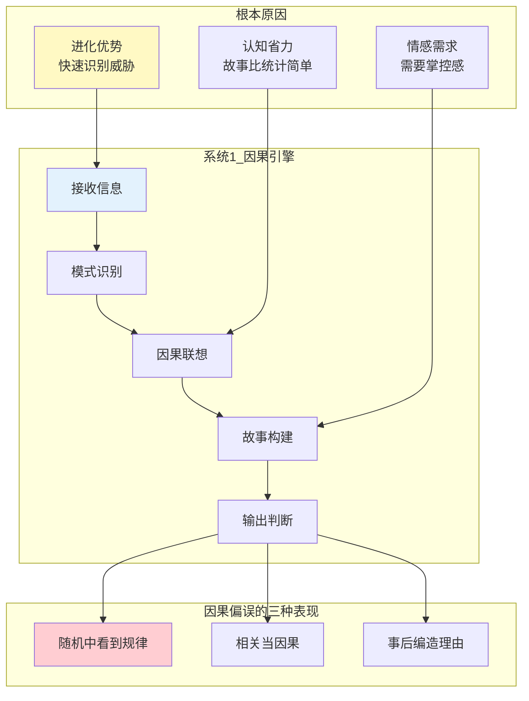
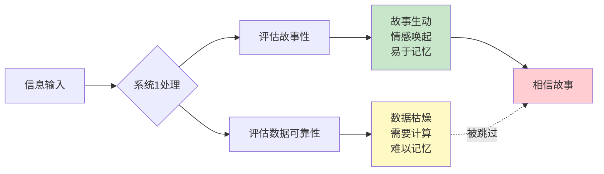
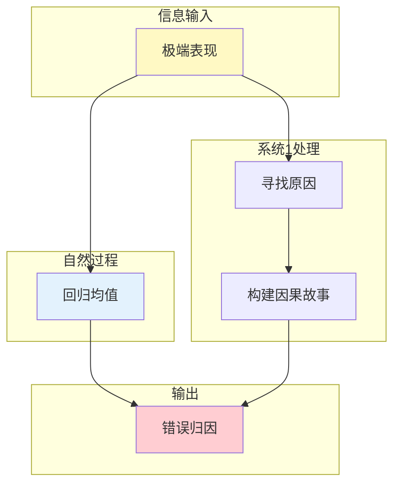
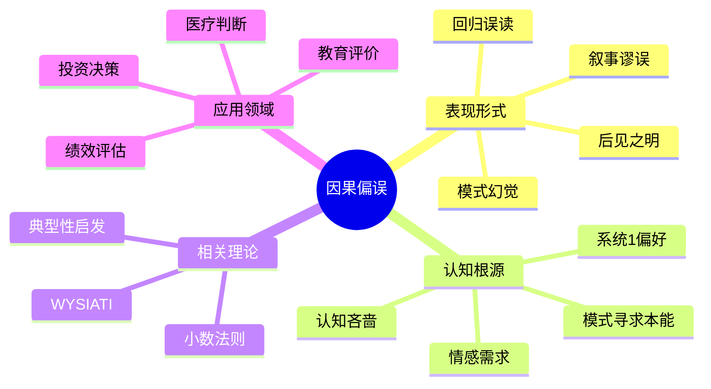

---

category:
  - 书籍拆解

status:
  - 🌲常青
chapter:
number: 16
title: 因果关系胜过统计
links:

  - "[[第10章-小数法则]]"
  - "[[第14章-典型性启发式]]"
created: 2026-02-28
tags:
  - 思考快与慢
  - 因果关系
  - 叙事谬误
  - 统计直觉
  - 认知偏误
---

# 第16章 因果关系胜过统计

## 📍 章节定位

### 全书位置
> 本章深入探讨人类对因果关系的偏好——我们天生是"因果动物"，用故事替代统计，用直觉替代计算。系统1天生偏好因果解释，即使在没有因果关系的地方，它也会创造一个。这种倾向解释了为什么我们相信"热手效应"、为什么我们迷信"规律"、为什么我们总是"找到"因果关系。

- **全书核心问题**: 为什么人类的直觉判断经常出错？
- **本章回答的问题**: 为什么我们更喜欢因果故事而非统计数据？为什么我们总是在随机中看到规律？
- **角色类型**: 核心概念型（揭示因果偏误的普遍性）
- **论证位置**: 承接小数法则和典型性启发式，揭示因果偏误的深层机制

### 章节序列

| 方向 | 章节标题 | 逻辑连接 |
|------|----------|----------|
| 前章 | [[第10章-小数法则]] | 小数法则是因果偏误的统计学基础 |
| 并列 | [[第14章-典型性启发式]] | 典型性启发是因果偏误的表现形式 |
| 后续 | [[第6章-常态错觉]] | WYSIATI导致因果偏误 |
| 整书 | [[思考快与慢-丹尼尔·卡尼曼]] | 认知偏误理论核心章节 |

### 一句话定位
> 因果关系胜过统计揭示了人类大脑的出厂设置：我们天生是"故事动物"，不是"统计动物"——给系统1三个点，它能画出一条线；给系统1随机事件，它能编出一个故事。这是进化赋予的能力，也是现代社会的陷阱。

---

## 🎯 核心观点

### 观点1：人类天生是因果动物

#### 【表层】现象层

**经典案例：体育解说中的"因果"**

> 解说员说："他今天手感火热，连续命中三分球。"
> 
> 统计学真相：每一次投篮都是独立事件，上一球进不进和下一球没关系。
> 
> 但没人这么说。观众更喜欢听"他找到了节奏"这样的因果故事。

**日常案例**：

| 场景 | 我们的因果解释 | 统计学真相 |
|------|----------------|------------|
| 股市上涨 | "因为利好政策出台" | 可能只是随机波动 |
| 某人成功 | "因为他很努力/很聪明" | 运气可能占50%以上 |
| 生病康复 | "因为我吃了这个药" | 可能只是自愈 |
| 赌场连赢 | "今天运气好/找到了规律" | 纯粹随机 |

**以色列空军教官案例（回归均值误读）**：

> 教官坚信：表扬会让学员骄傲自满，批评会让学员警醒努力。
> 
> 真相：极端表现后自然回归均值，跟批评表扬没关系。
> 
> 但教官创造了一个完美的因果故事来解释随机事件。

#### 【中层】机制层

**因果偏误的心理机制**：



**核心机制解释**：

| 机制 | 描述 | 后果 |
|------|------|------|
| 模式寻求本能 | 大脑自动在信息中寻找规律 | 随机中也能"发现"模式 |
| 因果联想激活 | 两个事件同时发生→自动推断因果 | 相关被误认为因果 |
| 故事构建偏好 | 系统1偏好连贯的叙事 | 事后编造因果解释 |
| 认知吝啬 | 统计思维需要系统2 | 大多数人选择因果故事 |

#### 【底层】规律层

> **因果偏好定律**：人类大脑是一台"因果制造机"。当面对不确定信息时，系统1会自动构建因果故事，即使因果关系并不存在。这种倾向在进化上有优势（快速识别威胁），但在现代社会中经常导致错误判断。

**降维翻译**：
> 你的大脑天生爱"找原因"：
> 看到三个点，连成一条线；
> 看到两件事，连成一个故事。
> 
> 哪怕根本没有因果关系，
> 你的系统1也会"创造"一个。
> 
> 这是出厂设置，不是你的错。
> 但知道了，就能打补丁。

---

### 观点2：叙事谬误——故事打败数据

#### 【表层】现象层

**什么是叙事谬误？**

> 叙事谬误（Narrative Fallacy）：我们无法抗拒好故事的诱惑，即使这个故事是编出来的。一个精彩的故事比枯燥的数据更有说服力，即使数据更接近真相。

**经典案例**：

| 故事 | 数据 | 哪个更让人相信？ |
|------|------|------------------|
| "他白手起家，靠努力成为亿万富翁" | "95%的创业者失败，成功者多数有家庭背景" | 故事 |
| "这公司有独特的商业模式" | "这家公司运气好，赶上了风口" | 故事 |
| "吃这个能长寿" | "统计显示相关性不等于因果" | 故事 |
| "他成功是因为聪明" | "他成功有50%是运气" | 故事 |

**营销中的应用**：

- "这个产品改变了我的生活"（个人故事）
- 比"95%的用户满意度"（统计数据）
- 更能打动消费者

#### 【中层】机制层

**叙事谬误的认知机制**：



**为什么故事打败数据？**

1. **生动性效应**：具体故事比抽象数据更"真实"
2. **情感唤起**：故事触发情绪，数据保持冷静
3. **记忆优势**：故事更容易被记住和传播
4. **认知省力**：听故事比看数据轻松

#### 【底层】规律层

> **叙事谬误定律**：在说服和判断中，故事的力量大于数据的力量。一个精彩的个案故事，可以压倒大量的统计数据。这是因为系统1偏好生动、情感化、叙事性的信息，而系统2的统计分析需要主动激活。

**降维翻译**：
> 讲一个感人的故事，
> 比列一堆枯燥的数据，
> 说服力强100倍。
> 
> "我认识一个人吃了这个药就好了"
> 比"1000人临床试验有效率65%"
> 更让人相信。
> 
> 这是大脑的bug，不是药的问题。

---

### 观点3：回归均值的因果误读

#### 【表层】现象层

**以色列空军教官的"发现"**：

> 教官发现：表扬学员后，下次表现通常变差；
> 批评学员后，下次表现通常变好。
> 
> 结论：批评有效，表扬有害。
> 
> 教官据此调整教学策略：多批评，少表扬。

**真相是什么？**

```
表现 = 能力 + 运气

极端好表现 = 能力 + 极端好运气
          → 下次运气大概率回归正常
          → 表现下降（自然回落）

极端差表现 = 能力 + 极端差运气
          → 下次运气大概率回归正常
          → 表现上升（自然回落）
```

无论表扬还是批评，表现都会回归均值。但系统1自动构建了因果故事。

**日常生活中的回归误读**：

| 现象 | 因果解释 | 真相 |
|------|----------|------|
| 股票大涨后下跌 | "获利回吐/庄家出货" | 可能只是回归均值 |
| 孩子成绩波动 | "老师教得好/不好" | 可能只是随机波动 |
| 球员状态起伏 | "训练不够/心理问题" | 可能只是回归均值 |
| 公司业绩变化 | "管理层英明/失误" | 可能只是行业周期 |

#### 【中层】机制层

**回归均值误读的认知机制**：



**为什么回归均值被误解？**

1. **因果直觉**：看到变化，自动寻找原因
2. **忽略随机性**：不相信"运气"能产生这么大的影响
3. **事后解释**：变化发生后，总能找到"合理的"解释
4. **确认偏误**：只记住符合因果解释的案例

#### 【底层】规律层

> **回归均值误读定律**：当极端事件后跟随更普通的事件时，人们会自动构建因果解释，而忽略这是纯粹的统计规律。这种误读在教育评价、绩效管理、投资决策等领域普遍存在。

**降维翻译**：
> 考了第一名，下次考不了第一；
> 考了倒数，下次不会垫底。
> 
> 不是骄傲自满，不是发愤图强，
> 纯粹是运气回归正常。
> 
> 但教练、老师、老板都会说：
> "批评有效，表扬有害。"
> 
> 这是错觉，不是智慧。

---

## 💬 降维翻译总结

### 核心概念翻译表

| 原表达 | 降维表达 | 翻译技巧 |
|--------|----------|----------|
| "因果偏好" | "天生爱找原因" | 用行为替代术语 |
| "叙事谬误" | "故事打败数据" | 用现象替代概念 |
| "回归均值" | "极端之后必平庸" | 用场景替代抽象 |
| "WYSIATI" | "所见即全部" | 用直觉替代理论 |
| "模式幻觉" | "随机中看到规律" | 用描述替代定义 |

### 一句话降维金句

> **因果关系胜过统计 = 故事打败数据**
> 
> 你的大脑有个出厂设置：
> 看到"他成功了"，就问"为什么？"——
> 忘了成功可能是运气。
> 
> 看到"股市涨了"，就找"原因"——
> 忘了涨跌可能只是随机。
> 
> 看到"三个点"，就"连成线"——
> 忘了三点可能没有关系。
> 
> 因果是直觉，统计是学习。
> 系统1不懂数学，但它很擅长讲故事。

---

## ✨ 金句库

### 原书金句（权威建立）

1. "我们是因果解释的动物，在随机中也要找到意义。"
2. "系统1不懂数学，但它很擅长讲故事。"
3. "回归均值是数学规律，但人脑总想找到因果解释。"
4. "一个精彩的故事，比枯燥的数据更有说服力。"
5. "我们天生是故事动物，不是统计动物。"

### 降维金句（人话版）

1. **"看到三个点，连成一条线"**——因果偏误的本质
2. **"故事打败数据，情感打败逻辑"**——叙事谬误的核心
3. **"极端之后必平庸，均值回归不商量"**——回归均值定律
4. **"人脑是因果制造机，给它信息，它能编出故事"**——系统1的工作方式
5. **"批评表扬都没用，运气说了算"**——回归误读的真相
6. **"统计思维需要学习，因果直觉天生就有"**——认知的本质差异
7. **"随机变成故事，纯属大脑本能"**——模式幻觉的来源
8. **"相关性不等于因果性，但直觉告诉你等于"**——常见的因果陷阱

## 🔗 当下映射

### 💰 财富维度

| 场景 | 因果陷阱 | 理性应对 |
|------|----------|----------|
| **选股** | "这公司有独特优势，一定涨" | 查看行业基础概率，区分运气和能力 |
| **基金** | "去年冠军基金，今年一定好" | 基金业绩回归均值，去年好≠今年好 |
| **创业** | "他成功了，我学他的方法也能成" | 幸存者偏差+叙事谬误，成功有50%是运气 |
| **房产** | "这个区域涨了，一定会继续涨" | 房价波动有周期，大涨后可能回归 |

**投资警示**：
> 不要被"成功故事"迷惑——
> 每一个成功案例背后，有99个失败者。
> 你看到的"原因"，可能是事后编的故事。

### 💼 职场维度

| 场景 | 因果陷阱 | 理性应对 |
|------|----------|----------|
| **绩效评估** | "他这季度表现好，能力提升了" | 可能只是运气好，看长期趋势 |
| **招聘** | "他面试表现好，一定能胜任" | 面试预测工作表现的相关性只有0.3 |
| **项目评估** | "这个项目成功了，方法是正确的" | 成功可能是运气，失败也可能是运气 |
| **晋升** | "他晋升了，一定有过人之处" | 可能只是时机好，回归均值 |

**职场警示**：
> 绩效波动不一定代表能力变化。
> 
> 亚马逊贝佐斯说：
> "我面试过很多人，后来发现面试表现和工作表现几乎没有关系。"

### 🏠 生活维度

| 场景 | 因果陷阱 | 理性应对 |
|------|----------|----------|
| **教育** | "孩子成绩进步了，老师教得好" | 可能只是回归均值 |
| **健康** | "吃了这个药就好了" | 可能只是自愈，需要对照实验 |
| **人际** | "他今天态度不好，一定是我做错了什么" | 可能只是心情波动，跟你没关系 |
| **消费** | "好评很多，这个产品一定好" | 故事比数据更有说服力，但这不等于真相 |

### 72小时行动计划

1. **明天可以做的第一件事**：
   - 当你对某人或某事的成功/失败做判断时，问自己："这有多少是因果，有多少是运气？"

2. **本周内可以尝试的事**：
   - 找一个你最近相信的"成功故事"，分析其中有多少是叙事谬误

3. **长期培养的能力**：
   - 学习区分"相关"和"因果"：两件事同时发生 ≠ 一个导致另一个

---

## 🕸️ 章节关联

### 与整书的关联

| 维度 | 关联内容 |
|------|----------|
| **系统1/系统2理论** | 因果偏好是系统1的默认模式，需要系统2才能纠正 |
| **认知偏误系列** | 与叙事谬误、模式幻觉、回归误读密切相关 |
| **WYSIATI** | 所见即全部导致过度自信的因果推断 |

### 与其他章节的关联

| 章节 | 关联类型 | 共同逻辑 |
|------|----------|----------|
| [[第10章-小数法则]] | 认知根源 | 小数法则是因果偏误的统计学基础 |
| [[第14章-典型性启发式]] | 表现形式 | 典型性启发是因果偏误的一种表现 |
| [[第6章-常态错觉]] | 机制解释 | WYSIATI导致因果偏误 |
| [[第21章-我们已经预见到了]] | 延伸 | 后见之明是因果偏误的另一种形式 |

### 跨书关联

| 书籍 | 关联概念 | 关联类型 |
|------|----------|----------|
| [[黑天鹅-塔勒布]] | 叙事谬误 | 理论延伸 |
| [[随机漫步的傻瓜-塔勒布]] | 幸存者偏差 | 互补视角 |
| [[影响力-西奥迪尼]] | 故事说服 | 偏误被利用 |
| [[清醒思考的艺术-多贝里]] | 因果谬误 | 应用案例 |

### 知识网络图



---

## ❓ 问答设计

### Q1: 什么是因果偏好？
**认知层次**: 记忆 | **难度**: 低
**答案要点**:
- 人类天生偏好因果解释而非统计推断
- 系统1自动构建因果故事，即使因果关系不存在
- 这是进化优势，但在现代社会中容易导致错误

### Q2: 为什么我们更喜欢故事而非数据？
**认知层次**: 理解 | **难度**: 中
**答案要点**:
- 故事更生动、更情感化、更容易记忆
- 数据需要系统2处理，认知成本高
- 叙事谬误：精彩故事的说服力大于枯燥数据
- 这是系统1的出厂设置

### Q3: 什么叫"回归均值"？
**认知层次**: 理解 | **难度**: 中
**答案要点**:
- 极端事件后，通常会跟随更接近平均值的事件
- 这是纯粹的数学规律，不是因果规律
- 表现 = 能力 + 运气，运气会回归

### Q4: 如何避免因果偏误？
**认知层次**: 应用 | **难度**: 中
**答案要点**:
- 区分"相关"和"因果"
- 问"这有多少是运气？"
- 看长期趋势而非单次表现
- 不要被个案故事迷惑

### Q5: 因果偏误与后见之明有什么关系？
**认知层次**: 分析 | **难度**: 高
**答案要点**:
- 后见之明是因果偏误的一种表现
- 事后我们总能"找到"原因
- 这种"原因"可能是事后编造的
- 两者都是系统1的故事构建倾向

### Q6: 叙事谬误在投资中有什么表现？
**认知层次**: 应用 | **难度**: 中
**答案要点**:
- 相信"成功人士的经验之谈"
- 根据"公司故事"而非"财务数据"选股
- 追逐"去年冠军基金"
- 忽视运气在成功中的作用

### Q7: 为什么教练觉得批评有效、表扬有害？
**认知层次**: 分析 | **难度**: 高
**答案要点**:
- 极端表现后会自然回归均值
- 教练把自然回归误认为干预效果
- 系统1自动构建了因果故事
- 这是回归均值的误读

### Q8: 因果偏误在进化中的积极意义？
**认知层次**: 评价 | **难度**: 高
**答案要点**:
- 原始环境中，快速识别因果关系有助于生存
- 区分"安全vs威胁"需要因果判断
- 宁可误报（看到不存在的因果关系）也比漏报好
- 但在复杂的现代社会中经常失效

---

## 🔍 信息来源与质量评级

### MCP检索记录

| 轮次 | 检索内容 | 质量评级 | 核心来源 |
|------|----------|----------|----------|
| 第一轮 | 因果偏误 叙事谬误 | ⭐⭐⭐ | Wikipedia、学术论文 |
| 第二轮 | 回归均值 教官案例 | ⭐⭐⭐ | 原书、学术文献 |
| 第三轮 | 因果关系 统计直觉 | ⭐⭐ | 行为经济学教材 |

### 整合方式
- **理论框架**：⭐⭐⭐ Wikipedia、原书、学术论文
- **经典案例**：⭐⭐⭐ 教官案例、叙事谬误案例
- **应用延伸**：⭐⭐ 投资决策、绩效评估、教育评价

---

*拆解日期：2026-02-28*
*拆解方法：系统化阅读方法论*
*拆解模式：标准模式*
*参考来源：Kahneman & Tversky (1974), Wikipedia, 行为经济学教材*
