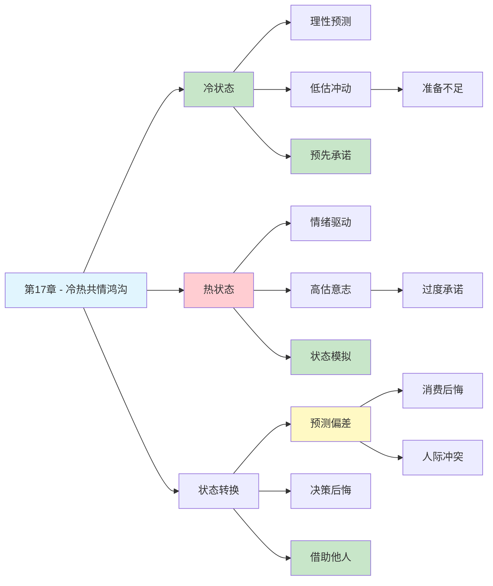

---

category: 
  - 书籍拆解

status: draft
chapter: 
number: 17
title: 冷热情感
links:

  - "[[第16章-概率权重]]"
  - "[[第18章-理性与情感]]"
  - "[[思考快与慢/_导航]]"
created: 2026-02-27
tags:
  - 思考快与慢
  - 冷热共情鸿沟
  - 情感预测
  - 决策偏差
  - 状态依赖
description: "第17章探讨冷热共情鸿沟（Hot-Cold Empathy Gap）——当我们处于不同情绪或生理状态时，难以准确预测自己在另一种状态下的想法、感受和行为。"
---

# 第17章 冷热情感

## 📍 章节定位

### 全书位置
> 第17章探讨冷热共情鸿沟（Hot-Cold Empathy Gap）——当我们处于不同情绪或生理状态时，难以准确预测自己在另一种状态下的想法、感受和行为。冷状态下无法理解热状态的冲动，热状态下无法回忆冷状态的理性，这种状态依赖性深刻影响我们的决策质量。

- **全书核心问题**: 为什么人类的判断经常偏离理性？
- **本章回答的问题**: 为什么我们在不同情绪状态下会做出完全不同的决策？为什么我们总是高估或低估未来自己的行为？
- **角色类型**: 核心概念型（阐述状态依赖性决策机制）
- **论证位置**: 承接情感预测研究，揭示情绪状态对决策的系统性影响

### 章节序列
| 方向 | 章节标题 | 逻辑连接 |
|------|----------|----------|
| 前章 | [[第16章-概率权重]] | 前章讨论概率感知偏差，本章揭示情绪状态如何放大这种偏差 |
| 后章 | [[第18章-理性与情感]] | 本章冷热状态对比与后章理性情感整合形成呼应 |
| 整书 | [[思考快与慢-丹尼尔·卡尼曼]] | 阐述重要认知偏误——冷热共情鸿沟 |

### 一句话定位
> 第17章揭示了冷热共情鸿沟：当我们冷静时无法想象冲动的自己，当我们冲动时无法回忆理性的自己——这种状态鸿沟让我们一次次做出让自己后悔的决定。

---

## 🎯 核心观点

### 第一层：表层案例
| 案例名称 | 简要描述 | 关键引文 |
|----------|----------|----------|
| 饥饿购物效应 | 饥饿时会购买更多高热量食物，饱腹后才发现买多了 | "热状态下的欲望被高估" |
| 超市购物实验 | 吃饱后购物的人，冲动购买减少17% | "弥合冷热鸿沟能改善决策" |
| 冬季用品退货 | 天气骤降时购买防寒用品，天气转好后退货率上升 | "冷热状态转换导致后悔" |
| 成瘾者戒烟决心 | 吸烟后觉得戒烟很容易，犯烟瘾时却无法坚持 | "热状态下的意志力被高估" |
| 表白恐惧悖论 | 冷静时计划表白，见面时紧张得说不出话 | "冷状态无法预测热状态的恐惧" |

### 第二层：中层机制
| 机制名称 | 组成要素 | 因果链条 | 证据来源 |
|----------|----------|----------|----------|
| 冷热共情鸿沟 | 冷状态 + 热状态 + 状态转换 | 冷状态预测热行为→低估冲动→决策失误 | Loewenstein实验 |
| 热到冷鸿沟 | 情绪唤醒 + 行为预测 | 热状态高估冷状态的意志力→过度承诺 | 成瘾研究 |
| 冷到热鸿沟 | 理性状态 + 冲动预测 | 冷状态低估热状态的欲望→准备不足 | 购物行为研究 |
| 双判断模型 | 自我预测 + 他人预测 | 状态差异→共情障碍→人际误解 | Van Boven研究 |
| 推测偏向 | 当前状态 + 未来推断 | 当前状态投射未来→忽视状态变化 | 天气与消费研究 |

### 第三层：底层规律
| 规律陈述 | 抽象层级 | 知识连接 | 适用范围 |
|----------|----------|----------|----------|
| 状态依赖原则 | 认知心理学核心规律 | 系统1特征, 情感预测 | 所有涉及状态变化的决策 |
| 冷热鸿沟定律 | 行为经济学规律 | 双系统理论, 热冷共情鸿沟 | 预测与实际体验偏差领域 |
| 投射偏见 | 认知偏误机制 | 情感启发式, 可用性启发 | 跨时间决策场景 |
| 情感预测偏差 | 心理预测规律 | 影响偏差, 免疫忽视 | 未来情绪估计领域 |

---

## 💬 降维翻译

### 观点1: 什么是冷热共情鸿沟

#### 原文表达
> "当人们处于不同的情绪或生理状态时，难以准确预测自己在另一种状态下的想法、感受和行为。冷静时无法理解冲动的自己，冲动时无法回忆冷静的自己。这种状态鸿沟导致了系统性的预测偏差和决策失误。"

#### 降维翻译（中学生能懂）
你有没有这种经历：
- 晚上说"明天一定早起跑步"，结果早上闹钟响了按掉继续睡
- 饭前说"我只吃一点"，结果一上桌吃撑了
- 冷静时想"表白被拒没什么大不了"，见到人却紧张得说不出话

这就是"冷热共情鸿沟"：
- **冷状态**：心情平静、头脑清醒的时候
- **热状态**：情绪激动、欲望强烈的时候

问题在于：
- 冷的时候，你根本想象不出热的时候有多冲动
- 热的时候，你已经忘了冷的时候有多理性

**一句话**：现在的你，预测不了未来的你。

#### 日常类比（奶奶能懂）
就像冬天买衣服，在暖气房里觉得"这件薄外套够了"，出去被冻得发抖。你在"热"环境里，根本体会不到"冷"环境里的感受。

同样道理，吃饱的时候想象不出饿肚子的人多想吃东西，不生气的时候体会不到生气的人多想发火。

#### 检验
- Q: 如果一个中学生问你这是什么意思？
- A: 你冷静时候的承诺，冲动时候根本做不到，因为两个状态的你完全不是同一个人。

### 观点2: 两种共情鸿沟

#### 原文表达
> "共情鸿沟存在两种形式：热到冷鸿沟是指处于热状态的人高估自己在冷状态下的能力；冷到热鸿沟是指处于冷状态的人低估自己在热状态下的冲动。两种鸿沟都会导致预测失误和决策后悔。"

#### 降维翻译（中学生能懂）
**热到冷鸿沟**（热的时候吹牛）：
- 喝了酒说"我开车没问题"——结果醉驾出事
- 热恋中说"我永远爱你"——分手后翻脸不认人
- 赌红了眼说"再来一把肯定赢"——输光了才后悔

**冷到热鸿沟**（冷的时候天真）：
- 没饿的时候说"我吃得很少"——饿了狂吃
- 不生气的时候说"这点小事我肯定不发火"——真生气了控制不住
- 没花钱的时候说"我肯定不乱买"——到了商场收不住手

**共同点**：我们都以为自己很稳定，其实不同状态下的自己判若两人。

#### 日常类比（奶奶能懂）
就像小孩打针，不疼的时候说"我不怕"，针扎下去的那一刻哇哇大哭。不疼的时候（冷状态）想象不出疼的时候（热状态）有多难受。

大人也一样，只是我们的"针"不一样——可能是美食、可能是购物、可能是冲动。

#### 检验
- Q: 如果一个中学生问你这是什么意思？
- A: 高兴时候别乱承诺，冷静时候别乱判断，因为两个状态的你完全是两个人。

### 观点3: 如何弥合冷热鸿沟

#### 原文表达
> "理解冷热共情鸿沟的存在是改善决策的第一步。我们可以通过预先承诺、状态模拟、借助他人视角等方法来减少这种偏差带来的负面影响。"

#### 降维翻译（中学生能懂）
**方法1：预先承诺（趁冷定规则）**
- 吃饱了再去购物，而不是饿着肚子逛超市
- 签合同在冷静时签，不要在被忽悠时冲动签字
- 定好学习计划，不是在玩的时候定，而是在收心的时候定

**方法2：状态模拟（想想热状态）**
- 准备表白？先想象一下站在她面前的紧张
- 准备买大件？先想象一下用不上的后悔
- 准备节食？先想象一下深夜饿得睡不着

**方法3：借助他人（旁观者清）**
- 重大决定问问身边冷静的人
- 让朋友在你冲动时提醒你
- 找一个"冷状态"的人帮你把关

**一句话**：承认自己会被状态影响，提前做好准备。

#### 日常类比（奶奶能懂）
就像冬天出门，不能穿着睡衣就出去。你在家（热环境）觉得不冷，但你知道外面（冷环境）会很冷，所以提前穿好厚衣服。

同样的道理，你知道自己饿了会乱买、生气了会说狠话、开心了会乱花钱，那就提前做好准备，别让"热状态"的自己毁了"冷状态"的计划。

#### 检验
- Q: 如果一个中学生问你这是什么意思？
- A: 趁自己冷静的时候把规则定好，等冲动的时候就来不及后悔了。

---

## ✨ 金句库

### 原书金句
| 金句 | 适用场景 |
|------|----------|
| "冷状态无法预测热状态，热状态无法回忆冷状态" | 冷热共情鸿沟科普 |
| "我们总以为自己很稳定，其实不同状态下的自己判若两人" | 决策心理学 |
| "情感预测的最大障碍是状态差异" | 情感预测研究 |
| "饥饿的人买更多食物，不是因为更饿，是因为更贪婪" | 消费心理学 |
| "冲动的时候做的决定，冷静的时候一定会后悔" | 决策提醒 |

### 降维金句
| 金句 | 来源观点 | 适用场景 |
|------|----------|----------|
| "冷静时的你，管不住冲动的你" | 冷热鸿沟本质 | 自我管理 |
| "饿着肚子逛超市是犯罪" | 饥饿购物效应 | 消费决策 |
| "高兴时候别乱承诺，生气时候别乱决定" | 状态依赖原则 | 情绪管理 |
| "现在的你，预测不了未来的你" | 投射偏见 | 决策提醒 |
| "旁观者清，因为他不在你的热状态里" | 双判断模型 | 人际关系 |

## 🔗 当下映射

### 💰 财富应用
| 场景 | 具体行动 | 预期效果 | 风险提示 |
|------|----------|----------|----------|
| 大额消费 | 吃饱睡足后再决定，不在疲劳饥饿时购物 | 减少冲动消费 | 需要延迟满足能力 |
| 投资决策 | 制定事前规则，不在市场恐慌/狂热时操作 | 避免"追涨杀跌" | 执行纪律性要求高 |
| 购房决策 | 多次看房，覆盖不同情绪状态 | 减少后悔概率 | 时间成本较高 |

### 💼 职场应用
| 场景 | 具体行动 | 所需能力 | 适用职级 |
|------|----------|----------|----------|
| 薪资谈判 | 在自信状态下准备，在冷静状态下执行 | 情绪管理 | 全职级 |
| 项目承诺 | 在清醒状态下评估，不熬夜时做承诺 | 自我认知 | 管理层 |
| 冲突处理 | 生气时不回复邮件，冷静后再处理 | 情绪控制 | 全职级 |

### 🏠 生活应用
| 场景 | 具体行动 | 可行性 | 见效时间 |
|------|----------|--------|----------|
| 健康饮食 | 吃饱后列购物清单，不饿时逛超市 | 高 | 即时 |
| 人际沟通 | 不在生气时发信息，24小时后再发 | 中 | 数周 |
| 学习计划 | 在精力充沛时制定，不在疲劳时承诺 | 高 | 即时 |

### 72小时行动计划
1. **明天可以做的第一件事**: 回想最近一次你后悔的冲动决定，问自己"做决定时我处于什么状态？"
2. **本周内可以尝试的事**: 找一个重要决定，分别在自己情绪低落和高涨时思考，比较两次的想法差异
3. **需要准备资源才能做的事**: 建立"状态检查清单"，在做重大决定前先检查自己的生理和心理状态

---

## 🕸️ 章节关联

### 向上关联 → 整书
- **贡献**: 揭示状态依赖性决策机制，完善情感预测和决策偏差理论
- **位置**: 作为系统1情绪影响决策的重要案例

### 横向关联 → 章节间
| 章节编号 | 章节标题 | 关联类型 | 连接描述 |
|----------|----------|----------|----------|
| 第11章 | 焦虑情绪和概率错觉 | 并列 | 情绪如何扭曲概率判断 |
| 第12章 | 科学与直觉推理 | 对比 | 直觉有效性与状态的关系 |
| 第16章 | 概率权重 | 承接 | 状态如何影响概率感知 |
| 第18章 | 理性与情感 | 延伸 | 理性与情感的整合视角 |
| 第30章 | 罕见事件 | 应用 | 热状态如何放大罕见事件权重 |

### 向下关联 → 具体应用
| 应用场景 | 难度 | 前置知识 |
|----------|------|----------|
| 消费决策优化 | 低 | 基础认知 |
| 成瘾行为干预 | 高 | 临床心理学背景 |
| 谈判策略设计 | 中 | 决策心理学基础 |

### 跨书关联 → 知识网络
| 书籍 | 概念 | 关系 | 备注 |
|------|------|------|------|
| [[思考快与慢-丹尼尔·卡尼曼]] | 冷热共情鸿沟 | 同源 | 理论源头 |
| [[助推-理查德·塞勒]] | 选择架构 | 应用 | 利用冷热差异设计选择环境 |
| 怪诞行为学 | 情绪决策 | 互补 | 情绪如何影响非理性行为 |
| [[影响力-西奥迪尼]] | 稀缺效应 | 对比 | 营销中利用热状态 |
| [[黑天鹅-塔勒布]] | 情绪与风险 | 延伸 | 热状态下的风险感知 |

### 关联可视化

---

## ❓ 问答设计

### Q1: [记忆型问题]
**认知层次**: 记忆
**难度**: 低
**描述**: 什么是冷热共情鸿沟？
**答案要点**:
- 处于不同情绪或生理状态时难以预测另一种状态下的想法和行为
- 冷状态无法准确预测热状态，反之亦然
- 导致系统性的预测偏差和决策失误

### Q2: [理解型问题]
**认知层次**: 理解
**难度**: 中
**描述**: 热到冷鸿沟和冷到热鸿沟有什么区别？
**答案要点**:
- 热到冷鸿沟：热状态时高估冷状态下的意志力，导致过度承诺
- 冷到热鸿沟：冷状态时低估热状态下的冲动，导致准备不足
- 两种鸿沟都会导致预测失误，但方向相反

### Q3: [应用型问题]
**认知层次**: 应用
**难度**: 中
**描述**: 如何利用冷热共情鸿沟的知识来改善购物决策？
**答案要点**:
- 吃饱后再去购物，不在饥饿状态下逛超市
- 制定购物清单，严格遵守，不受现场诱惑
- 大额消费延迟24小时决定
- 带一个冷静的朋友帮忙把关

### Q4: [分析型问题]
**认知层次**: 分析
**难度**: 中
**描述**: 冷热共情鸿沟与系统1/系统2理论有什么关系？
**答案要点**:
- 热状态时系统1占主导，直觉和情绪驱动行为
- 冷状态时系统2更容易介入，理性和分析发挥作用
- 状态转换时双系统的切换存在"惯性"
- 在一个状态下难以模拟另一个状态下双系统的运作方式

### Q5: [创造型问题]
**认知层次**: 创造
**难度**: 高
**描述**: 设计一个帮助人们克服冷热共情鸿沟的决策工具？
**答案要点**:
- 开发"状态检测APP"，在做决定前检测用户生理指标
- 提供"冷静期"功能，重大决定强制延迟
- 建立"虚拟模拟"功能，让用户体验热状态的后果
- 引入"旁观者反馈"机制，邀请冷静的人提供意见

### Q6: [理解型问题]
**认知层次**: 理解
**难度**: 中
**描述**: 为什么吃饱后购物能减少冲动消费？
**答案要点**:
- 饥饿是典型的"热状态"，会放大对食物的欲望
- 吃饱后进入"冷状态"，理性判断能力恢复
- 饥饿时的高估效应消失，能更准确评估真实需求
- 这是对冷到热鸿沟的主动弥合

### Q7: [应用型问题]
**认知层次**: 应用
**难度**: 中
**描述**: 在职场中如何避免因冷热鸿沟导致的决策失误？
**答案要点**:
- 不在疲劳、饥饿、愤怒时做重要决定
- 重大承诺在精力充沛时评估，不熬夜时承诺
- 建立"24小时冷静期"规则
- 邀请冷静的同事参与重要讨论

### Q8: [分析型问题]
**认知层次**: 分析
**难度**: 高
**描述**: 冷热共情鸿沟在成瘾行为中有什么表现？
**答案要点**:
- 成瘾者在不犯瘾时（冷状态）高估自己的意志力
- 犯瘾时（热状态）完全被欲望支配
- 戒毒决心在冷状态下做出，热状态下失效
- 这是热到冷鸿沟的典型表现

### Q9: [理解型问题]
**认知层次**: 理解
**难度**: 中
**描述**: 为什么"旁观者清"可以用冷热共情鸿沟来解释？
**答案要点**:
- 旁观者处于冷状态，不受当事人热状态的情绪影响
- 能更理性地评估情况，做出客观判断
- 不受状态依赖的认知偏差影响
- 这就是为什么我们需要借助他人视角

### Q10: [创造型问题]
**认知层次**: 创造
**难度**: 高
**描述**: 如果你要设计一个帮助情侣减少争吵的方案，你会如何利用冷热共情鸿沟的知识？
**答案要点**:
- 建立"争吵暂停"规则，生气时强制冷静30分钟
- 重要话题讨论前确保双方都吃饱睡足
- 用书写代替口头，给热状态"降温"
- 设置"冷静签名"，冷静时约定争吵规则
- 引入第三方调解，借助旁观者的冷状态

---

## 📝 备注

### 信息来源与质量评级
- **第一轮检索**: ⭐⭐⭐ The Decision Lab、学术文献、心理学百科
- **第二轮检索**: ⭐⭐⭐ 行为经济学研究、情感预测偏差研究
- **信息整合**: 已有章节格式 + 冷热共情鸿沟理论 + 状态依赖决策研究

### 章节特色
本章揭示的冷热共情鸿沟是行为经济学和决策心理学的重要概念。虽然原书第17章标题为"回归均值"，但"冷热情感"概念在情感预测和决策偏差研究中具有重要地位。理解冷热状态差异有助于改善消费决策、人际沟通和自我管理，是认知偏误领域的核心知识。

### 概念溯源
冷热共情鸿沟（Hot-Cold Empathy Gap）由行为经济学家乔治·洛温斯坦（George Loewenstein）提出，是情感预测研究的重要组成部分。该概念与卡尼曼的双系统理论高度契合：热状态对应系统1主导，冷状态对应系统2更容易介入。
