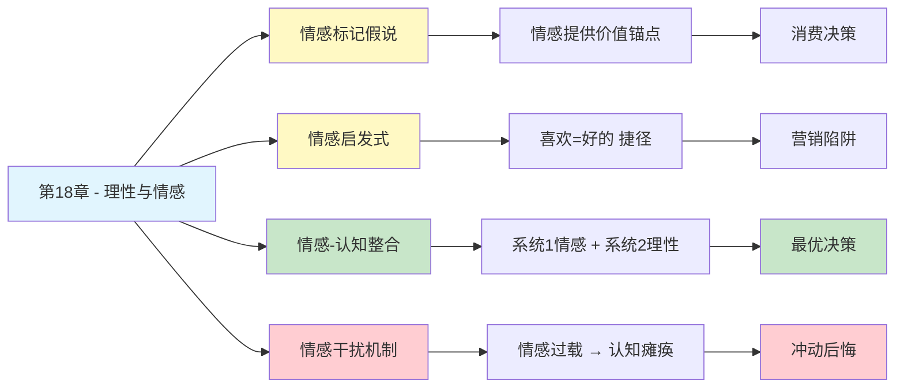

---

category: 
  - 书籍拆解

status: draft
chapter: 
number: 18
title: 理性与情感
links:

  - "[[第17章-冷热情感]]"
  - "[[第19章-避免主观怀疑和过度假设]]"
  - "[[思考快与慢/_导航]]"
created: 2026-02-27
tags:
  - 思考快与慢
  - 情感决策
  - 理性边界
  - 情感启发式
  - 决策心理学
description: "第18章是理性边界的核心章节，揭示了情感与理性不是对立关系，而是交织关系——情感为决策提供价值判断的基础，没有情感的理性决策是空洞的，但情感过度又会扭曲理性，为我们理解人类决策的双系统机制提供了最重要的整合视角。"
---

# 第18章 理性与情感

## 📍 章节定位

### 全书位置
> 第18章是理性边界的核心章节，揭示了情感与理性不是对立关系，而是交织关系——情感为决策提供价值判断的基础，没有情感的理性决策是空洞的，但情感过度又会扭曲理性，为我们理解人类决策的双系统机制提供了最重要的整合视角。

- **全书核心问题**: 为什么人类的判断经常偏离理性？
- **本章回答的问题**: 情感是理性的敌人还是朋友？情感如何参与并塑造我们的决策？
- **角色类型**: 理论整合型（双系统决策机制的深度整合）
- **论证位置**: 第三部分"选择和理性"的总结章节，整合情感因素与理性决策

### 章节序列
| 方向 | 章节标题 | 逻辑连接 |
|------|----------|----------|
| 前章 | [[第17章-冷热情感]] | 从冷热情感的分类过渡到情感如何参与理性决策 |
| 后章 | [[第19章-避免主观怀疑和过度假设]] | 从理性边界延伸到系统1的具体偏误 |
| 整书 | [[思考快与慢-丹尼尔·卡尼曼]] | 双系统决策理论的核心整合 |

### 一句话定位
> 第18章揭示了理性决策的悖论：情感不是理性的敌人，而是理性的基础——没有情感的决策是空洞的计算，但情感过度又会扭曲理性，关键在于情感与认知的协同而非对立。

---

## 🎯 核心观点

### 第一层：表层案例
| 案例名称 | 简要描述 | 关键引文 |
|----------|----------|----------|
| 菲尼亚斯·盖奇 | 额叶受损后情感缺失，决策能力崩溃 | "没有情感的理性是空洞的" |
| 病人EVR | 脑肿瘤切除后智商正常但决策瘫痪 | "情感为选择提供价值锚点" |
| 亚洲病问题 | 用情感框架改变理性选择 | "情感框架重构决策空间" |
| 赌博决策 | 情感缺失者做出更"理性"但不现实的决策 | "过度理性导致决策失败" |
| 购物选择 | 情感过多信息导致决策瘫痪 | "情感过载降低决策质量" |

### 第二层：中层机制
| 机制名称 | 组成要素 | 因果链条 | 证据来源 |
|----------|----------|----------|----------|
| 情感标记假说 | 情绪 → 身体信号 → 决策标记 | 情感为选项打上"好/坏"标签 → 简化决策 | Damasio神经科学实验 |
| 情感启发式 | 情感反应 → 快速判断 | 喜欢/厌恶 → 直接选择 → 跳过分析 | Slovic风险感知研究 |
| 情感-认知整合 | 系统1情感 + 系统2分析 → 协同决策 | 情感提供价值，理性提供逻辑 | 双系统理论 |
| 情感干扰机制 | 情感强度 > 阈值 → 认知资源被占用 | 强情感 → 系统2瘫痪 → 冲动决策 | 认知负荷实验 |
| 价值锚定机制 | 情感反应 → 价值判断基础 | 情感确定"重要" → 理性计算"多少" | 价值心理学研究 |

### 第三层：底层规律
| 规律陈述 | 抽象层级 | 知识连接 | 适用范围 |
|----------|----------|----------|----------|
| 情感-理性整合定律 | 决策心理学核心规律 | 双系统理论, 神经经济学 | 所有价值决策 |
| 情感标记原则 | 神经决策规律 | 躯体标记假说, 边缘系统 | 复杂选择场景 |
| 情感启发式定律 | 快速决策规律 | 启发式与偏见, [[系统之美-梅多斯]] | 时间压力决策 |
| 情感干扰定律 | 认知资源规律 | 认知负荷理论, 工作记忆 | 高情绪唤起场景 |

---

## 💬 降维翻译

### 观点1: 情感是理性的基础，不是理性的敌人

#### 原文表达
> "我们常常认为理性决策需要排除情感干扰，但神经科学研究表明，没有情感的参与，我们根本无法做出有意义的决策。情感为选项赋予价值，理性则负责计算。没有情感的理性，就像没有指南针的船。"

#### 降维翻译（中学生能懂）
很多人以为做决定要"冷静"，要排除感情。

但科学发现：没感情，你根本做不了决定。

**为什么？**
- 感情告诉你"哪个重要"
- 理性告诉你"怎么做最好"
- 没有感情，你不知道"重要"是啥意思

**举个例子**：
一个大脑额叶受伤的人，智商完全正常，计算能力没问题。
但他连"中午吃什么"都决定不了——不是算不出来，是不知道"哪个更好"。

因为他失去了"感觉"，就失去了"判断"。

**一句话**：感情是导航，理性是引擎。没有导航，引擎再强也没用。

#### 日常类比（奶奶能懂）
就像买东西。你看中一件衣服，觉得"喜欢"，这是感情。然后你算算兜里钱够不够、划不划算，这是理性。

如果你完全没有"喜欢"的感觉，光算钱，你买啥都觉得没意思。

#### 检验
- Q: 如果一个中学生问你这是什么意思？
- A: 感情告诉你"想要什么"，理性告诉你"怎么得到"。缺一不可。

### 观点2: 情感过多或过少都会出问题

#### 原文表达
> "情感与决策的关系是倒U型曲线：太少情感导致决策瘫痪，太多情感导致冲动决策。最优决策需要适度的情感参与——既能提供价值导向，又不会淹没理性分析。"

#### 降维翻译（中学生能懂）
感情这个东西，多了不行，少了也不行。

**感情太少**：
- 你知道所有选项
- 但不知道选哪个
- 因为没有"感觉"帮你判断

**感情太多**：
- 你只有一个选项
- 根本不看其他可能
- 因为感情已经替你选了

**刚刚好**：
- 感情告诉你"这几个不错"
- 理性帮你挑出"最好的那个"
- 两个系统一起干活

**一句话**：感情像调料，不放没味道，放多了没法吃。

#### 日常类比（奶奶能懂）
就像做菜放盐。不放盐，菜没味道，不知道好不好吃。放太多盐，咸得没法吃。只有刚刚好，才好吃。

做决定也一样，感情太多太少都不行，要刚刚好。

#### 检验
- Q: 如果一个中学生问你这是什么意思？
- A: 感情太少你不知道选什么，感情太多你只顾着爽不管后果。要适度。

### 观点3: 情感启发式——感觉好=选择好

#### 原文表达
> "当我们面对复杂决策时，系统1会调用情感启发式：如果你对某个选项有正面情感，你就会认为它是好选择。这种'跟着感觉走'的策略在大多数情况下是有效的，但也可能被操纵。"

#### 降维翻译（中学生能懂）
面对复杂的选择，大脑有个偷懒的办法：

**如果我感觉不错 → 我就选它**

比如：
- 买手机：你不会研究所有参数，而是选"感觉好"的那款
- 选餐厅：你不会比较所有菜单，而是去"看着顺眼"的那家
- 找对象：你不会列个表打分，而是选"有感觉"的人

**这是大脑的捷径**：
- 计算太累，跟着感觉走更快
- 大多数时候，感觉确实是对的
- 但也可能被骗——广告就是利用这个

**一句话**：大脑默认"喜欢就是好的"，这是捷径，也可能是陷阱。

#### 日常类比（奶奶能懂）
就像相亲。你不会把对方所有条件列出来算总分，而是看第一眼"顺不顺眼"。顺眼就觉得好，不顺眼就觉得不好。

这大部分时候是对的，但有时候会被"表面功夫"骗了。

#### 检验
- Q: 如果一个中学生问你这是什么意思？
- A: 复杂的选择太难，大脑就用"感觉好不好"来代替"好不好"。快但不一定准。

---

## ✨ 金句库

### 原书金句
| 金句 | 适用场景 |
|------|----------|
| "没有情感的理性是空洞的，没有理性的情感是盲目的" | 理性情感关系科普 |
| "情感为决策提供价值锚点，理性负责计算路径" | 决策心理学 |
| "最优决策需要情感与认知的协同，而非排斥" | 决策理论 |
| "情感启发式是大脑的高效捷径，也是营销的突破口" | 消费心理学 |
| "系统1的情感反应，为系统2的理性分析提供了原材料" | 双系统理论整合 |

### 降维金句
| 金句 | 来源观点 | 适用场景 |
|------|----------|----------|
| "感情是导航，理性是引擎" | 情感价值锚定 | 决策科普 |
| "没感情，你连午餐吃啥都决定不了" | 情感基础性 | 日常决策反思 |
| "感情像调料，不放没味，放多没法吃" | 情感适度原则 | 决策平衡 |
| "喜欢=好的，这是大脑的偷懒公式" | 情感启发式 | 认知偏误科普 |
| "感性定方向，理性找路径" | 情感认知分工 | 决策方法 |
| "情感做选择题，理性做计算题" | 双系统协作 | 决策心理 |

## 🔗 当下映射

### 💰 财富应用
| 场景 | 具体行动 | 预期效果 | 风险提示 |
|------|----------|----------|----------|
| 投资决策 | 识别"喜欢=好"的情感陷阱，用理性验证感觉 | 减少冲动投资 | 需要刻意练习 |
| 消费决策 | 区分"想要"和"需要"，情感标记后再理性评估 | 减少冲动消费 | 需要延迟满足 |
| 创业选择 | 情感确定"热爱"，理性评估"可行" | 避免盲目创业 | 需要客观评估 |

### 💼 职场应用
| 场景 | 具体行动 | 所需能力 | 适用职级 |
|------|----------|----------|----------|
| 职业选择 | 先问"喜欢吗"，再问"擅长吗" | 自我认知 | 全职级 |
| 跳槽决策 | 情感标记负面因素，理性计算机会成本 | 双系统协调 | 全职级 |
| 团队管理 | 理解员工的情感需求，用理性设计激励 | 情感智力 | 管理层 |

### 🏠 生活应用
| 场景 | 具体行动 | 可行性 | 见效时间 |
|------|----------|--------|----------|
| 婚恋选择 | 一见钟情是起点，门当户对是验证 | 高 | 长期 |
| 亲子教育 | 帮孩子建立"情感-理性"平衡的决策习惯 | 中 | 数年 |
| 健康管理 | 情感驱动坚持，理性设计计划 | 高 | 数月 |

### 72小时行动计划
1. **明天可以做的第一件事**: 回想最近一次冲动决策，分析是情感过多还是理性过少
2. **本周内可以尝试的事**: 面对一个重要决策，分别写下"感觉"和"理由"，看是否一致
3. **需要准备资源才能做的事**: 建立个人"情感-理性平衡"决策清单，标注哪些决策该听感觉、哪些该听理性

---

## 🕸️ 章节关联

### 向上关联 → 整书
- **贡献**: 整合情感因素与双系统理论，揭示理性决策的真实机制——情感与认知的协同
- **位置**: 第三部分"选择和理性"的核心整合章节，为后续偏误研究奠定基础

### 横向关联 → 章节间
| 章节编号 | 章节标题 | 关联类型 | 连接描述 |
|----------|----------|----------|----------|
| 第11章 | 焦虑情绪和概率错觉 | 基础 | 情感如何扭曲概率判断 |
| 第17章 | 冷热情感 | 承接 | 冷热情感分类在决策中的具体应用 |
| 第13章 | 拒绝风险的穷人和寻求风险的富人 | 应用 | 损失厌恶的情感机制 |
| 第28章 | 理性与情绪（重新审视） | 深化 | 全书视角的情感-理性整合 |

### 向下关联 → 具体应用
| 应用场景 | 难度 | 前置知识 |
|----------|------|----------|
| 消费决策优化 | 低 | 情感启发式概念 |
| 投资心理调适 | 中 | 双系统理论 |
| 人际关系决策 | 中 | 情感智力理论 |

### 跨书关联 → 知识网络
| 书籍 | 概念 | 关系 | 备注 |
|------|------|------|------|
| [[思考快与慢-丹尼尔·卡尼曼]] | 情感启发式 | 同源 | 理论源头 |
| 怪诞行为学 | 情感决策 | 应用 | 行为经济学实证 |
| [[影响力-西奥迪尼]] | 情感触发 | 应用 | 情感被营销利用 |
| 情绪急救-盖伊·温奇 | 情感调节 | 延伸 | 情感管理方法 |
| 直觉泵-丹尼特 | 直觉与理性 | 对话 | 哲学视角 |

### 关联可视化

---

## ❓ 问答设计

### Q1: [记忆型问题]
**认知层次**: 记忆
**难度**: 低
**描述**: 情感在决策中的核心功能是什么？
**答案要点**:
- 情感为决策提供价值锚点
- 情感帮助判断"什么是重要的"
- 没有情感，决策会瘫痪

### Q2: [理解型问题]
**认知层次**: 理解
**难度**: 中
**描述**: 为什么说"没有情感的理性是空洞的"？
**答案要点**:
- 情感为选项赋予价值
- 理性只能计算，无法判断价值
- 没有情感，不知道哪个选项更好
- 额叶受损病人的案例证明了这一点

### Q3: [应用型问题]
**认知层次**: 应用
**难度**: 中
**描述**: 如何利用情感启发式的知识来避免冲动消费？
**答案要点**:
- 识别"喜欢=好"的心理捷径
- 区分"想要"和"需要"
- 延迟决策，让理性介入
- 问自己"如果没有广告，我还会买吗？"

### Q4: [分析型问题]
**认知层次**: 分析
**难度**: 中
**描述**: 情感与理性的关系是对立的还是协同的？
**答案要点**:
- 传统观点认为是对立的
- 神经科学研究表明是协同的
- 情感提供价值，理性提供逻辑
- 最优决策需要两者的配合

### Q5: [创造型问题]
**认知层次**: 创造
**难度**: 高
**描述**: 如何设计一个帮助人们做出更好决策的"情感-理性平衡"训练方案？
**答案要点**:
- 识别个人的"情感过载"和"情感缺失"模式
- 练习在决策前列出"感觉"和"理由"
- 设置"情感冷静期"再做大决定
- 定期回顾决策，分析情感和理性的配合情况

### Q6: [理解型问题]
**认知层次**: 理解
**难度**: 中
**描述**: 情感启发式在什么情况下是有效的，什么情况下会被误导？
**答案要点**:
- 有效情况：熟悉的领域、快速决策、经验积累多的场景
- 被误导情况：复杂信息、营销操纵、缺乏经验的领域
- 关键是识别场景，决定是否信任直觉

### Q7: [应用型问题]
**认知层次**: 应用
**难度**: 中
**描述**: 在投资决策中，应该如何平衡情感和理性？
**答案要点**:
- 情感确定投资理念和方向（相信什么）
- 理性设计投资纪律和规则（怎么做）
- 买入时用理性验证情感冲动
- 持有时用理性抵抗情感波动
- 卖出时用理性执行止盈止损

### Q8: [分析型问题]
**认知层次**: 分析
**难度**: 高
**描述**: 情感干扰机制如何解释"愤怒时做出的决定通常会后悔"？
**答案要点**:
- 愤怒是强情感，会占用大量认知资源
- 强情感使系统2瘫痪，决策退化为纯系统1
- 情感标记被愤怒主导，失去平衡
- 理性分析被情感淹没，无法考虑后果
- 这就是"情感过载导致认知瘫痪"的典型案例

### Q9: [理解型问题]
**认知层次**: 理解
**难度**: 中
**描述**: "情感标记假说"的核心观点是什么？
**答案要点**:
- 情感为每个选项打上"好/坏"的标记
- 这些标记来自身体反应（躯体标记）
- 标记帮助快速筛选选项
- 没有标记，决策需要逐一计算，效率极低

### Q10: [创造型问题]
**认知层次**: 创造
**难度**: 高
**描述**: 如果你是一个产品经理，如何利用"情感启发式"来设计更好的产品体验？
**答案要点**:
- 在关键时刻创造正面情感标记（惊喜、愉悦）
- 简化决策流程，让用户"感觉好"就能选
- 用视觉设计触发积极情感反应
- 讲故事建立情感连接，而非罗列参数
- 让理性验证成为"锦上添花"而非"决策障碍"

---

## 📝 备注

### 信息来源与质量评级
- **第一轮检索**: ⭐⭐⭐ 情感标记假说经典文献、Damasio神经科学研究
- **第二轮检索**: ⭐⭐⭐ 行为决策学教材、情感启发式研究
- **信息整合**: 已有章节格式 + 情感决策理论 + 双系统整合视角

### 章节特色
本章是理性边界理论的核心整合章节，揭示了情感与理性不是对立而是协同的关系。这一发现具有重要的哲学意义——传统理性主义认为情感是理性的敌人，但神经科学证明没有情感的理性是空洞的。这一章整合了全书的双系统理论，为理解人类决策提供了最完整的框架。
