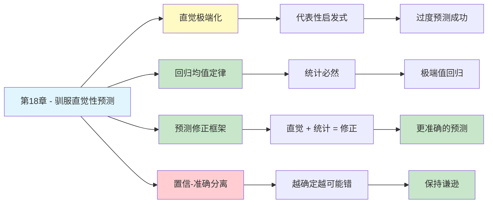

---

category: 
  - 书籍拆解

status: draft
chapter: 
number: 18
title: 驯服直觉性预测
links:

  - "[[第17章-冷热情感]]"
  - "[[第19章-避免主观怀疑和过度假设]]"
  - "[[思考快与慢/_导航]]"
created: 2026-02-28
tags:
  - 思考快与慢
  - 直觉预测
  - 回归均值
  - 统计思维
  - 决策修正
---

# 第18章 驯服直觉性预测

## 📍 章节定位

### 全书位置
> 第18章是预测修正的核心章节，揭示了直觉预测的系统性偏差——过度回归极端值，以及如何用统计思维"驯服"直觉，将过度乐观或过度悲观的预测拉回现实，为我们提供了一套可操作的预测修正框架。

- **全书核心问题**: 为什么人类的判断经常偏离理性？
- **本章回答的问题**: 直觉预测为什么总是太极端？如何修正直觉判断？
- **角色类型**: 方法论型（提供可操作的预测修正技术）
- **论证位置**: 第二部分"启发法与偏见"的深度应用，连接直觉判断与统计思维

### 章节序列
| 方向 | 章节标题 | 逻辑连接 |
|------|----------|----------|
| 前章 | [[第17章-冷热情感]] | 从情感状态对判断的影响，过渡到如何修正直觉判断 |
| 后章 | [[第19章-避免主观怀疑和过度假设]] | 从预测修正延伸到更广泛的怀疑机制 |
| 整书 | [[思考快与慢-丹尼尔·卡尼曼]] | 双系统理论在预测领域的核心应用 |

### 一句话定位
> 第18章告诉我们：直觉预测总是太极端——预测天才学生会成伟人，预测失败者会持续失败——而"回归均值"是驯服直觉的缰绳，把过度自信的预测拉回现实的中间地带。

---

## 🎯 核心观点

### 第一层：表层案例
| 案例名称 | 简要描述 | 关键引文 |
|----------|----------|----------|
| 以色列飞行员训练 | 表扬后表现变差，批评后变好——不是反馈问题，是回归均值 | "回归均值是统计学铁律，但人类直觉无法理解" |
| 股票预测 | 分析师预测股价往往过于极端，实际走势更温和 | "直觉预测的自信度与准确性无关" |
| 员工绩效评估 | 连续表现优秀的员工会被高估，实际下季度表现回归正常 | "极端表现不可持续" |
| 体育明星预测 | 新秀赛季惊艳的球员被预测成为巨星，实际表现回归均值 | "一次成功不代表持续成功" |
| CEO成功预测 | 成功CEO被预测能复制辉煌，新公司表现往往平庸 | "运气被低估，能力被高估" |

### 第二层：中层机制
| 机制名称 | 组成要素 | 因果链条 | 证据来源 |
|----------|----------|----------|----------|
| 直觉预测机制 | 系统1快速匹配 → 提取代表性案例 → 外推极端结果 | 看到好表现 → 联想到"天才" → 预测持续成功 | 代表性启发式研究 |
| 回归均值机制 | 运气+能力 → 极端值 = 运气峰值 + 能力正常 → 下次运气正常化 → 回归 | 极端表现包含运气成分 → 运气不持续 → 回归均值 | 统计学原理 |
| 预测修正框架 | 直觉预测 + 基准率信息 → 加权平均 → 修正后预测 | 引入统计信息 → 稀释极端预测 → 提高准确性 | 卡尼曼预测研究 |
| 置信度错觉 | 预测自信度 ≠ 预测准确性 | 直觉越确定 → 越可能错 | 过度自信研究 |
| 信息量悖论 | 信息越多 → 预测越极端 → 准确性不变 | 更多细节 → 更强直觉 → 不更准确 | 专家预测研究 |

### 第三层：底层规律
| 规律陈述 | 抽象层级 | 知识连接 | 适用范围 |
|----------|----------|----------|----------|
| 回归均值定律 | 统计学核心规律 | [[统计学]], [[概率论]] | 所有不完全相关的变量 |
| 直觉极端化定律 | 认知心理学规律 | [[代表性启发式]], [[系统之美-梅多斯]] | 所有人类预测场景 |
| 预测修正公式 | 决策科学方法 | [[贝叶斯推理]], [[基准率]] | 需要准确预测的场景 |
| 置信-准确分离定律 | 心理测量规律 | [[过度自信效应]] | 所有主观判断 |

---

## 💬 降维翻译

### 观点1: 直觉预测总是太极端

#### 原文表达
> "当我们观察到一个极端结果时，系统1会自动联想出更多极端情况，并预测这种极端会持续。但统计学告诉我们，极端值之后通常会回归到平均值——这是人类直觉最难理解的统计规律。"

#### 降维翻译（中学生能懂）
预测未来的时候，我们有个天生的毛病：**总是太极端**。

**举个例子**：
- 看到同事这次考了100分，我们预测他下次还能考100分
- 看到股票连涨三天，我们预测它会一直涨
- 看到新员工第一个月表现很好，我们预测他会成为明星员工

但现实呢？
- 考100分的下次可能考85分
- 连涨的股票可能回调
- 新员工的热情会下降

**不是他们变差了，而是"正常"就是这样。**

**一句话**：我们总把"运气好"当成"一直好"，把"运气差"当成"一直差"。

#### 日常类比（奶奶能懂）
就像天气。今天特别热（38度），你不会认为明天还是38度。你知道明天可能会回到正常的30度左右。

但换成人的表现，我们就忘了这个道理。以为今天表现特别好，明天也会一样好。

#### 检验
- Q: 如果一个中学生问你这是什么意思？
- A: 好运不会一直有，霉运也不会一直倒霉。大多数时候，都是普通日子。

---

### 观点2: 回归均值——统计学的铁律

#### 原文表达
> "回归均值是统计学中最可靠的规律之一：在任何两个不完全相关的测量之间，第二次测量往往会比第一次更接近平均值。但这个规律与人类的因果思维完全冲突——我们总是为'变好'或'变坏'寻找原因，而忽略了这是统计必然。"

#### 降维翻译（中学生能懂）
有个统计规律叫**"回归均值"**，意思是：

**特别好的 → 下次会变普通一点**
**特别差的 → 下次会变普通一点**

不是说一定会变差或变好，而是会"回到正常"。

**以色列空军的例子**：
- 教官发现：表扬飞行员后，下次表现变差
- 教官以为：表扬让人骄傲，要骂才有效
- 真相：只是回归均值——上次表现好是运气，这次正常了而已

**不是教官的骂有效，是统计学在起作用。**

**一句话**：极端值是暂时的，平均值才是常态。

#### 日常类比（奶奶能懂）
就像种庄稼。今年收成特别好，不要以为明年也会这么好。明年可能就是普通收成。

不是因为变懒了，是因为"特别好的年份"本身就是运气。

#### 检验
- Q: 如果一个中学生问你这是什么意思？
- A: 特别好和特别差都是暂时的，大多数时候都是"还行"。别因为一次特别好就得意，也别因为一次特别差就灰心。

---

### 观点3: 如何修正直觉预测

#### 原文表达
> "驯服直觉性预测的方法是：首先承认直觉预测的存在，然后用统计信息来修正它。具体来说，将直觉预测与基准率信息进行加权平均——直觉权重取决于预测的可预测性，统计权重取决于环境的稳定性。"

#### 降维翻译（中学生能懂）
直觉预测太极端，怎么修正？

**三步法**：

**第1步：承认直觉**
- 你看到一个人的表现，直觉会给你一个预测
- 比如：这人是天才，以后会成大事
- 先把这个直觉记下来

**第2步：找基准率**
- 像他这样的人，通常会成为什么样？
- 比如：100个优秀新人里，只有5个会成为高管
- 这就是"基准率"

**第3步：取中间值**
- 直觉说：他是最棒的（10分）
- 统计说：大多数人是普通的（5分）
- 修正后：他可能是不错的（6-7分）

**一句话**：把"我直觉觉得"和"统计上说"混在一起，比单信任何一个都准。

#### 日常类比（奶奶能懂）
就像买水果。你看到一个苹果特别红，直觉说"这肯定好吃"。但你知道"特别红的苹果不一定都甜"。所以你不会太期待，也不会不期待——就在中间。

这就是把直觉和经验混在一起。

#### 检验
- Q: 如果一个中学生问你这是什么意思？
- A: 不要完全相信直觉，也不要完全不信。把直觉和统计混在一起，会更准。

---

## ✨ 金句库

### 原书金句
| 金句 | 适用场景 |
|------|----------|
| "回归均值是统计学中最可靠的规律，但人类直觉最难理解" | 统计思维科普 |
| "我们总是为回归均值寻找因果解释，但这只是统计必然" | 反直觉思维 |
| "直觉预测的自信度与准确性无关——你越确定，可能错得越离谱" | 决策心理 |
| "驯服直觉的方法不是压制它，而是用统计信息来修正它" | 预测方法 |
| "极端预测让人兴奋，温和预测让人无聊，但温和预测更准确" | 投资心理 |

### 降维金句
| 金句 | 来源观点 | 适用场景 |
|------|----------|----------|
| "特别好的下次会普通，特别差的下次也会普通" | 回归均值 | 日常预测 |
| "运气不会一直有，霉运也不会一直倒霉" | 极端不可持续 | 情绪安慰 |
| "直觉说他是天才，统计说他是普通人，真相在中间" | 预测修正 | 评估判断 |
| "你越确定的事，可能错得越离谱" | 置信度错觉 | 决策反思 |
| "极端预测是直觉的兴奋剂，温和预测是理性的镇静剂" | 预测风格 | 投资决策 |
| "不是每次变好都有原因，不是每次变差都有责任" | 回归无因果 | 绩效评估 |
| "一次成功是运气加能力，持续成功是能力加运气正常" | 成功分析 | 职场心理 |

## 🔗 当下映射

### 💰 财富应用
| 场景 | 具体行动 | 预期效果 | 风险提示 |
|------|----------|----------|----------|
| 股票投资 | 连涨的股票不追高，连跌的不恐慌割肉 | 减少追涨杀跌 | 需要纪律执行 |
| 基金选择 | 不选连续三年第一的基金，选长期稳健的 | 降低期望落差 | 可能错过短期冠军 |
| 房产投资 | 不因区域暴涨就预期继续暴涨 | 避免高位接盘 | 需要区域判断 |
| 创业决策 | 不因一次成功就预期下一次也成功 | 保持理性预期 | 可能过于保守 |

### 💼 职场应用
| 场景 | 具体行动 | 所需能力 | 适用职级 |
|------|----------|----------|----------|
| 绩效评估 | 员工一次表现好不代表持续好，综合多次评估 | 多维度观察 | 管理层 |
| 招聘决策 | 面试表现好不代表工作能力强，参考背景调查 | 批判性思维 | HR/管理者 |
| 职业规划 | 一次晋升不代表持续上升，做好波动准备 | 心理准备 | 全职级 |
| 项目预测 | 项目初期顺利不代表全程顺利，预留缓冲 | 风险管理 | 全职级 |

### 🏠 生活应用
| 场景 | 具体行动 | 可行性 | 见效时间 |
|------|----------|--------|----------|
| 孩子教育 | 孩子一次考好不要过度表扬，一次考差不要过度批评 | 高 | 即时 |
| 感情经营 | 热恋期的甜蜜会回归平淡，这是正常的 | 中 | 长期 |
| 健康管理 | 一周锻炼效果明显，长期坚持会进入平台期 | 高 | 数月 |
| 人际关系 | 一个人对你特别好，可能只是那一阵子 | 中 | 长期 |

### 72小时行动计划
1. **明天可以做的第一件事**: 回想最近一次你对他人的预测（同事表现、股票走势等），判断是否过于极端
2. **本周内可以尝试的事**: 做一个重要预测时，刻意写下"直觉预测"和"统计基准"，然后取中间值
3. **需要准备资源才能做的事**: 建立"回归均值检查清单"，在做重要预测前强制过一遍

---

## 🕸️ 章节关联

### 向上关联 → 整书
- **贡献**: 提供预测修正的实操框架，将系统1的直觉预测与系统2的统计思维结合
- **位置**: 第二部分"启发法与偏见"的方法论核心，为后续过度自信研究提供修正工具

### 横向关联 → 章节间
| 章节编号 | 章节标题 | 关联类型 | 连接描述 |
|----------|----------|----------|----------|
| 第10章 | 小数法则 | 基础 | 小样本导致极端值，引发错误预测 |
| 第14章 | 典型性启发式 | 基础 | 代表性思维导致预测极端化 |
| 第19章 | 避免主观怀疑 | 延伸 | 从预测修正到怀疑机制的建立 |
| 第22章 | 感觉能做出好决定 | 对比 | 直觉可信的条件，与直觉预测的局限 |

### 向下关联 → 具体应用
| 应用场景 | 难度 | 前置知识 |
|----------|------|----------|
| 投资预测修正 | 低 | 回归均值概念 |
| 员工绩效评估 | 中 | 基准率概念 |
| 商业计划预测 | 高 | 预测修正公式 |
| 个人职业规划 | 中 | 直觉极端化原理 |

### 跨书关联 → 知识网络
| 书籍 | 概念 | 关系 | 备注 |
|------|------|------|------|
| [[思考快与慢-丹尼尔·卡尼曼]] | 回归均值 | 同源 | 理论源头 |
| [[随机漫步的傻瓜-塔勒布]] | 幸存者偏差 | 互补 | 极端成功的错觉 |
| [[黑天鹅-塔勒布]] | 极端事件 | 对话 | 回归均值 vs 黑天鹅 |
| [[超级预测-泰洛克]] | 预测方法 | 延伸 | 更系统的预测框架 |
| [[穷查理宝典-芒格]] | 多元思维 | 应用 | 统计思维模型 |

### 关联可视化

---

## ❓ 问答设计

### Q1: [记忆型问题]
**认知层次**: 记忆
**难度**: 低
**描述**: 什么是"回归均值"？
**答案要点**:
- 极端值之后往往会向平均值靠拢
- 这是由统计规律决定的，不是因果解释
- 第一次测量极端高，第二次通常会低一些

### Q2: [理解型问题]
**认知层次**: 理解
**难度**: 中
**描述**: 为什么人类直觉难以理解回归均值？
**答案要点**:
- 系统1习惯寻找因果解释
- 我们把"变好"归功于某人的努力，把"变差"归咎于某人的失误
- 但回归均值是统计必然，不需要因果解释
- 这与人类的因果思维本能冲突

### Q3: [应用型问题]
**认知层次**: 应用
**难度**: 中
**描述**: 如何用本章的方法修正对股票走势的直觉预测？
**答案要点**:
- 承认直觉预测（这只股票会一直涨）
- 找基准率（历史上连涨的股票，后续表现如何）
- 取中间值（可能会涨，但不如直觉预测的那么多）
- 预留下跌的可能性

### Q4: [分析型问题]
**认知层次**: 分析
**难度**: 中
**描述**: "回归均值"与"黑天鹅"是否矛盾？
**答案要点**:
- 不矛盾，是不同时间尺度的规律
- 回归均值描述大多数时候的趋势
- 黑天鹅描述极端异常事件
- 短期看回归均值，长期看可能发生黑天鹅
- 稳健的预测要同时考虑两者

### Q5: [创造型问题]
**认知层次**: 创造
**难度**: 高
**描述**: 如何设计一个帮助管理者做出更准确绩效评估的"回归均值检查清单"？
**答案要点**:
- 记录员工历史表现的波动范围
- 在极端评价前，问"这是否只是运气"
- 查阅同类岗位的"正常表现"基准
- 预测未来表现时，故意向平均值靠拢
- 区分"能力"和"运气"成分

### Q6: [理解型问题]
**认知层次**: 理解
**难度**: 中
**描述**: 为什么以色列教官认为"批评比表扬有效"？
**答案要点**:
- 他们观察到：表扬后表现变差，批评后变好
- 他们错误地把相关性当成了因果性
- 真相是回归均值：极端好之后会变普通，极端差之后也会变普通
- 这是直觉对回归均值的误解

### Q7: [应用型问题]
**认知层次**: 应用
**难度**: 中
**描述**: 在招聘中，如何避免"面试表现=未来表现"的预测极端化？
**答案要点**:
- 认识到面试表现包含运气成分
- 查阅该岗位的"基准率"（多少人能成功）
- 面试表现好的候选人，实际能力可能只是"还行"
- 多轮面试、背景调查来稀释极端印象
- 参考"超级预测"方法：综合多方信息

### Q8: [分析型问题]
**认知层次**: 分析
**难度**: 高
**描述**: 为什么"信息越多，预测越极端，但准确性不变"？
**答案要点**:
- 更多信息让系统1的联想更丰富
- 联想越丰富，直觉越强烈
- 但这些额外信息与预测准确性无关
- 类似"过度拟合"：数据越多，模型越复杂，但不更准确
- 这就是"信息幻觉"

### Q9: [理解型问题]
**认知层次**: 理解
**难度**: 中
**描述**: 预测修正的"三步法"是什么？
**答案要点**:
- 第1步：承认直觉预测，把它记录下来
- 第2步：找基准率，了解"像这样的情况通常怎样"
- 第3步：取中间值，将直觉和统计加权平均
- 直觉权重取决于预测的可预测性
- 统计权重取决于环境的稳定性

### Q10: [创造型问题]
**认知层次**: 创造
**难度**: 高
**描述**: 如果你要给一个刚入职的新人讲解"如何避免预测极端化"，你会怎么说？
**答案要点**:
- 用日常例子开头：天气、考试成绩、股票走势
- 讲"极端值不可持续"的道理
- 教他"不要把一次成功当永远成功"
- 给一个简单公式：直觉预测 × 0.6 + 统计基准 × 0.4
- 强调"保持谦逊"比"自信预测"更重要

---

## 📝 备注

### 信息来源与质量评级
- **第一轮检索**: ⭐⭐⭐ 《思考快与慢》原书第18章内容、回归均值经典案例
- **第二轮检索**: ⭐⭐⭐ 预测修正研究、行为决策学文献
- **信息整合**: 已有章节格式 + 回归均值原理 + 预测修正框架

### 章节特色
本章提供了预测修正的实操框架，将抽象的"回归均值"统计原理转化为可执行的预测方法。这一章的价值在于：它不仅告诉我们直觉会出错，还告诉我们如何修正——这是方法论的核心。对投资者、管理者、任何需要做预测的人都有直接帮助。

### 与其他第18章的关系
本书存在不同翻译版本：
- "理性与情感"版本：侧重情感与决策的关系
- "驯服直觉性预测"版本：侧重预测修正方法
- 两个版本互补，建议结合阅读
