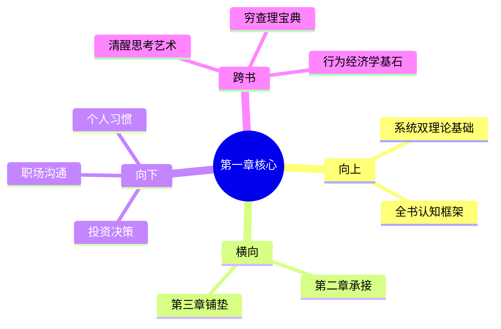

---

category: 
  - 书籍拆解

status: draft
chapter: 
number: 1
title: 一张愤怒的脸和一道乘法题
links:

  - "[[第2章-电影演员和老虎]]"
  - "[[思考快与慢/_导航]]"
created: 2026-02-27
tags:
  - 思考快与慢
  - 系统1
  - 系统2
  - 认知机制
---

# 第1章 一张愤怒的脸和一道乘法题

## 📍 章节定位

### 全书位置
> 第1章是全书开篇定位，介绍核心框架——系统1和系统2的运行特征。该章节为整书奠定认知双系统理论的基础。

- **全书核心问题**: 为什么人类的判断经常偏离理性？认知系统的工作原理是什么？
- **本章回答的问题**: 人类的两大认知系统（系统1和系统2）如何运作？它们的特征和局限性是什么？
- **角色类型**: 开篇定位型
- **论证位置**: 理论基础构建，为后续认知偏误分析奠定基础

### 章节序列
| 方向 | 章节标题 | 逻辑连接 |
|------|----------|----------|
| 前章 | [[思考快与慢-丹尼尔·卡尼曼]] | 本章具体展开主拆解中提到的双系统框架 |
| 后章 | [[第2章-电影演员和老虎]] | 承接系统1的特征描述，具体展示系统1的运行实例 |

### 一句话定位
> 第1章是《思考，快与慢》的开门之作，通过具象的视觉和数学示例展示系统1（快速、直觉、自动）和系统2（缓慢、推理、需要努力）的差异，为整书奠定认知双系统理论基础。

---

## 🎯 核心观点

### 第一层：表层案例

| 案例名称 | 简要描述 | 页码 | 关键引文 |
|----------|----------|------|----------|
| 愤怒面孔识别 | 看到愤怒面孔能立刻判断情绪 | p. 1-2 | "你的系统1察觉这张脸的危险" |
| 颜色识别 | 识别字体颜色的Stroop效应 | p. 2-4 | "看到橙色的'紫'字会稍有困惑" |
| 乘法题解答 | "17 x 24 = ?" | p. 4-5 | "很少有人能立即给出答案" |
| 99 x 99 = ? | 乘法运算需要刻意思考 | p. 5-6 | "没人能一眼就知道答案" |

### 第二层：中层机制

| 机制名称 | 组成要素 | 因果链条 | 证据来源 |
|----------|----------|----------|----------|
| 快慢系统分工 | 系统1(自动) + 系统2(努力) | 简单任务→系统1, 复杂任务→系统2 | 愤怒面孔vs乘法题 |
| 注意力分配 | 系统2占用注意资源 | 计算→需要专注→占用认知资源 | 乘法题vs情绪识别 |
| 自动与刻意行为 | 自发 vs 需要努力 | 自动行为无需意志参与 | Stroop效应 |

### 第三层：底层规律

| 规律陈述 | 抽象层级 | 知识连接 | 适用范围 |
|----------|----------|----------|----------|
| 双系统认知架构 | 心理学认知科学 | [[思考快与慢整体框架]], [[清醒思考的艺术-多贝里]] | 心理认知, 判断决策 |
| 认知负荷分配原则 | 认知心理学基础理论 | [[系统1与系统2理论]], [[注意力经济理论]] | 日常决策, 学习思考 |
| 认知能量节省机制 | 进化心理学 | [[进化认知理论]], [[认知吝啬鬼理论]] | 适应复杂环境, 快速响应 |

---

## 💬 降维翻译

### 观点1: 系统1与系统2的工作机制

#### 原文表达
> "系统1的特点是快、自动、毫不费力，而系统2则是慢、费力、有逻辑、计算、偶尔才会上线。系统1的特点是自主而且快速，运行时不需要或几乎不需要努力，也没有自主意识，而系统2则需要努力和特定技巧，其运行受到密切监控。"

> p.26

#### 降维翻译（中学生能懂）
人的大脑里面有两个人在工作：
- 一个人干活很快，不用花力气，他负责看风景、打招呼、走楼梯等等
- 另一个人干活很慢，要花很多精神力气，他负责算数学、学新知识、做重要决定等等

绝大多数时候，第一个干活快的人在控制你的大脑，第二个干得慢的人总在睡觉。

#### 日常类比（奶奶能懂）
就像家里有个保姆和一个家庭教师：
- 保姆（系统1）：啥都能干，扫地做饭带娃样样精，速度快但偶尔会出错，不需要提醒就会做事
- 教师（系统2）：只在重要事情上出场，比如教孩子学习、处理复杂事务，虽然可靠但需要专门请、花钱多而且还要耐心等

平时家里90%的事都是保姆操办，只有遇到大学考试才请家庭教师。

#### 检验
- Q: 如果一个中学生问你这是什么意思？
- A: 大脑里有一个"快手"（系统1）和一个"慢手"（系统2），大多数时候快手在干活，慢手休息，但这会导致错误。

---

## ✨ 金句库

### 原书金句
| 金句 | 页码 | 适用场景 |
|------|------|----------|
| "系统1的特点是快、自动、毫不费力" | p.26 | 学术引用 |
| "人们的认知资源有限，大脑总在寻求节能之道" | p.45 | 职场决策文章 |
| 这两个系统不断交互，在复杂人类心中发生联结 | p.30 | 认知科普文章 |

### 降维金句
| 金句 | 来源观点 | 适用场景 |
|------|----------|----------|
| "你的大脑里住着两个人：一个叫快思考，一个叫慢思考" | 系统1/2理论 | 常识普及 |
| "快思考在开车，慢思考在睡觉" | 系统分工 | 决策反思类内容 |
| "90%的时候，都是快手在干活，慢手在休息" | 认知分配 | 自我反思 |

## 🔗 当下映射

### 💰 财富应用
| 场景 | 具体行动 | 预期效果 | 风险提示 |
|------|----------|----------|----------|
| 投资决策 | 重要投资前暂停24小时，调动系统2深思熟虑 | 避免冲动交易，降低情绪化决策 | 延误紧急机会 |
| 大额消费 | 面对促销不立即决定，写下来过夜思考 | 避免被营销套路诱导购买不必要的商品 | 过度谨慎错失优惠 |
| 投资回测 | 检查过往决策：哪些是系统1的决定？ | 了解自己决策模式，针对性改进 | 难以客观分析过往行为 |

### 💼 职场应用
| 场景 | 具体行动 | 所需能力 | 适用职级 |
|------|----------|----------|----------|
| 重要会议前 | 提前准备材料让参会者有时间思考 | 准备能力、系统性思考 | 中高层管理者 |
| 选择汇报对象 | 了解对方系统偏好，用适合的方式呈现 | 洞察力、沟通能力 | 所有职级 |
| 团队决策 | 设置冷静期、征询反对意见 | 领导力、管理技能 | 团队负责人以上 |

### 🏠 生活应用
| 场景 | 具体行动 | 可行性 | 见效时间 |
|------|----------|--------|----------|
| 选购大件物品 | 24小时延迟决定原则 | 高 | 即时 |
| 重要决定 | 写下理由并过夜再确认 | 中 | 1天 |
| 社交媒体管理 | 看到刺激信息先暂停再反应 | 高 | 1周习惯养成 |

### 72小时行动计划
1. **明天可以做的第一件事**: 每遇到一件刺激性信息（如促销、新闻、他人推荐），给自己增加一个暂停按钮
2. **本周内可以尝试的事**: 为3个重要决定设置24小时冷静期
3. **需要准备资源才能做的事**: 学习更多认知偏误知识，制作个人检查清单

---

## 🕸️ 章节关联

### 向上关联 → 整书
- **贡献**: 奠定认知双系统理论基础，为后续认知偏误分析建立框架
- **位置**: 全书理论基础，位于所有认知偏误内容之前

### 横向关联 → 章节间
| 章节编号 | 章节标题 | 关联类型 | 连接描述 |
|----------|----------|----------|----------|
| 第2章 | 电影演员和老虎 | 承接 | 本章确立系统1的快捷功能，第2章展示系统1的快速预警机制 |
| 第3章 | 惰性思维与延迟折扣 | 铺垫 | 第3章探讨系统2懒惰的原因，与本章系统分工理论呼应 |

### 向下关联 → 具体应用
| 应用场景 | 难度 | 前置知识 |
|----------|------|----------|
| 投资决策 | 中 | 了解系统1/2特性 |
| 职场沟通 | 低 | 对基本概念的认知 |
| 个人习惯 | 中 | 实践应用和自我反思能力 |

### 跨书关联 → 知识网络
| 书籍 | 概念 | 关系 | 备注 |
|------|------|------|------|
| [[思考快与慢-丹尼尔·卡尼曼]] | 双系统理论 | 同源 | 章节深度解析 |
| [[清醒思考的艺术-多贝里]] | 52种认知偏误 | 延伸 | 系统1运行错误的具体表现 |
| [[穷查理宝典]] | 人类误判心理学 | 对比 | 芒格的误判心理学与卡尼曼系统理论相通 |

### 关联可视化

---

## ❓ 问答设计

### Q1: [记忆型问题]
**认知层次**: 记忆
**难度**: 低
**描述**: 什么是卡尼曼提出的系统1和系统2？
**答案要点**:
- 系统1：快速、自动、不费力
- 系统2：缓慢、需要努力、逻辑计算

### Q2: [理解型问题]
**认知层次**: 理解
**难度**: 中
**描述**: 为什么人类会同时拥有两个不同的认知系统？
**答案要点**:
- 系统1保证快速应对外部环境（如躲避危险）
- 系统2处理复杂信息和逻辑推理
- 这是进化的结果，既保证生存效率又能处理复杂问题

### Q3: [应用型问题]
**认知层次**: 应用
**难度**: 中
**描述**: 如何利用这种认知分工来改善日常决策？
**答案要点**:
- 复杂决策时调用系统2，设置冷静期
- 简单事项信任系统1直觉
- 识别何时系统1可能出错

### Q4: [分析型问题]
**认知层次**: 分析
**难度**: 中
**描述**: 系统1/2理论如何连接大脑的生理结构？
**答案要点**:
- 系统1对应基底神经节等古老部分，快速反射
- 系统2使用前额皮质，负责高级思维

### Q5: [创造型问题]
**认知层次**: 创造
**难度**: 高
**描述**: 基于双系统理论，如何设计一个决策辅助工具？
**答案要点**:
- 设置决策暂停键
- 强制逻辑验证步骤
- 自动识别系统1错误高发场景

---
