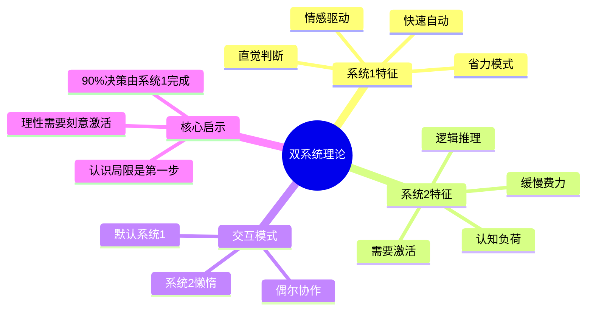
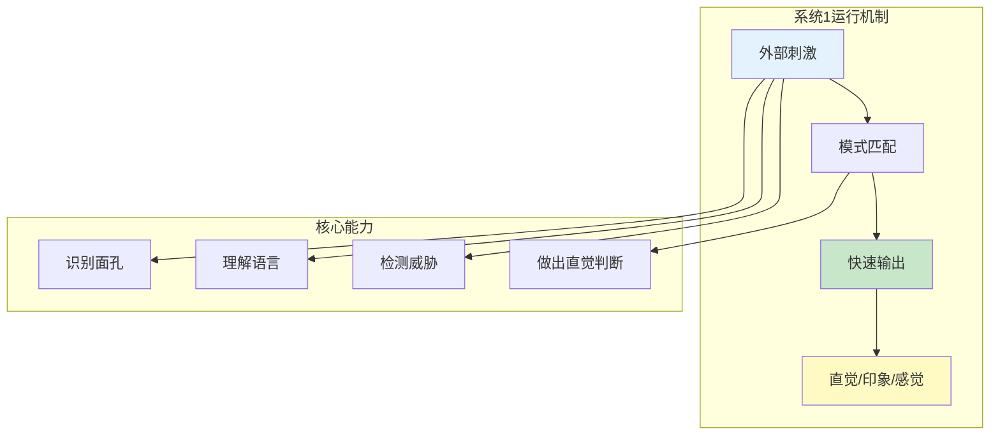
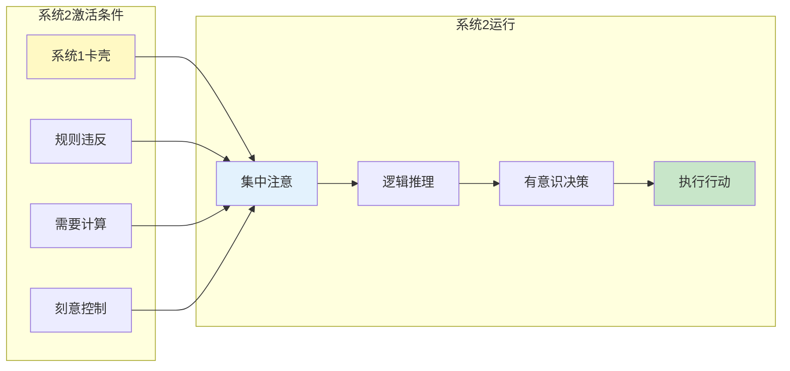
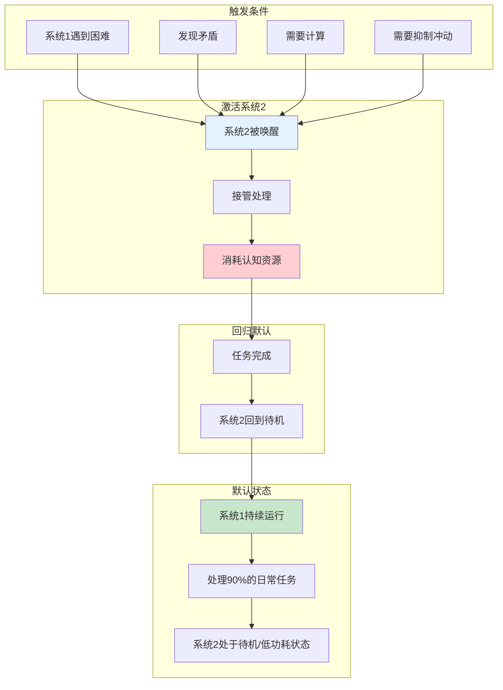
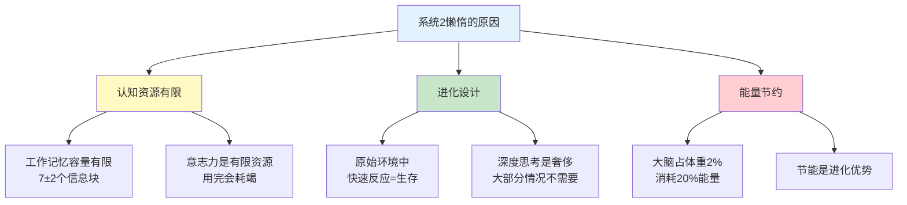

---

category: 
  - 书籍拆解

status:
  - 🌲常青
chapter: 
number: 1
title: 两个系统
focus: 核心框架篇
links:

  - "[[第2章-电影演员和老虎]]"
  - "[[思考快与慢/_导航]]"
created: 2026-02-27
tags:
  - 思考快与慢
  - 系统1
  - 系统2
  - 双系统理论
  - 认知框架
---

# 第1章 两个系统

## 📍 章节定位

### 全书位置
> 第1章是全书核心框架，建立"系统1 vs 系统2"的认知双系统模型。这是理解全书所有认知偏误、决策错误的底层钥匙。

**核心问题**：
- 人类的思维是如何运作的？
- 为什么我们会犯错？是能力问题还是结构问题？
- 大脑有没有"使用说明书"？

**一句话定位**：
> 你的大脑有两套操作系统：系统1像自动驾驶（快、省力、爱犯错），系统2像手动挡司机（慢、费力、需要你主动唤醒）。90%的时候，自动驾驶在开车，司机在睡觉。

### 章节序列

| 方向 | 章节标题 | 逻辑连接 |
|------|----------|----------|
| 前章 | [[思考快与慢-丹尼尔·卡尼曼]] | 主拆解提供全貌，本章聚焦核心框架 |
| 后章 | [[第2章-电影演员和老虎]] | 本章定义双系统，第2章展示系统1的运行实例 |

### 知识网络定位

---

## 🎯 核心观点（三层提取）

### 观点1：系统1 —— 大脑的自动驾驶

#### 【表层】现象层

**日常生活中的系统1**：
| 场景 | 系统1的表现 | 特点 |
|------|------------|------|
| 看到愤怒的脸 | 瞬间判断对方情绪 | 快速、自动、不费力 |
| 听到"2+2=?" | 不需要思考就知道等于4 | 瞬间提取、无需计算 |
| 走路 | 不需要想着先迈左脚还是右脚 | 自动执行、无需意识 |
| 理解简单句子 | 不需要逐字分析就能理解 | 整体把握、直觉理解 |
| 看到模糊人影 | 立刻判断是熟人还是陌生人 | 快速模式识别 |

**系统1的典型特征**：
- **快**：毫秒级响应
- **自动**：无需意志参与
- **省力**：几乎不消耗认知资源
- **直觉**：依赖模式识别
- **情感化**：带有情绪色彩

#### 【中层】机制层

**核心机制**：
1. **联想激活**：看到一个词，相关概念自动激活
2. **因果解释**：自动为事件找原因（不管对不对）
3. **情感标记**：每个判断都带有情感色彩
4. **常态构建**：自动构建"正常"的预期

#### 【底层】规律层

> **系统1定律**：大脑有一套自动运行的认知系统，它持续不断地生成直觉、印象和感觉，这个过程快速、自动、不需要努力，也无法关闭。它是进化的产物，在原始环境中高效可靠，但在复杂现代社会中容易犯错。

**降维翻译**：
> 你有一个"自动挡大脑"，它24小时开着，帮你处理大部分事情。
> 看路、走路、说话、听懂别人……都是它在干活。
> 问题：它太快了，不给你思考的机会。

---

### 观点2：系统2 —— 大脑的手动挡司机

#### 【表层】现象层

**需要系统2的任务**：
| 任务 | 为什么需要系统2 | 感受 |
|------|----------------|------|
| 17 × 24 = ? | 需要多步计算 | 累、需要专注 |
| 在嘈杂环境中听清某人说话 | 需要主动筛选信息 | 费力、需要意志 |
| 学习新技能 | 需要有意识地练习 | 初始很累 |
| 比较两款产品的性价比 | 需要逻辑分析 | 费神 |
| 抑制冲动 | 需要对抗系统1的自动反应 | 需要意志力 |

**系统2的典型特征**：
- **慢**：需要时间处理
- **费力**：消耗认知资源
- **有意识**：需要主动参与
- **逻辑化**：依赖推理计算
- **可控制**：可以按意愿停止

#### 【中层】机制层

**核心机制**：
1. **注意力分配**：系统2需要专注，不能多任务
2. **工作记忆**：只能同时处理有限信息
3. **意志力消耗**：每次使用都会消耗有限资源
4. **懒惰原则**：除非必要，否则不愿启动

#### 【底层】规律层

> **系统2定律**：大脑有一套需要努力运行的认知系统，它负责复杂推理、计算和决策。但它是懒惰的，只有在系统1无法处理或被明确要求时才会激活。它的资源是有限的，过度使用会导致疲劳和决策质量下降。

**降维翻译**：
> 你还有一个"手动挡大脑"，但它是懒的。
> 只有当你主动叫它，或者自动挡卡住了，它才会醒来干活。
> 干活很累，所以它总想回去睡觉。

---

### 观点3：系统1和系统2的协作模式

#### 【表层】现象层

**日常协作实例**：
| 场景 | 系统1做什么 | 系统2做什么 |
|------|-----------|-----------|
| 开车去熟悉的地方 | 控制方向盘、踩刹车 | 规划路线（偶尔） |
| 聊天 | 理解对方话语 | 组织复杂表达 |
| 购物 | 快速判断喜欢/不喜欢 | 比价、算账 |
| 考试 | 识别题目 | 推理解答 |
| 打游戏 | 反应操作 | 制定策略 |

**协作模式的核心观察**：
- 系统1是"默认系统"，持续运行
- 系统2是"备用系统"，按需启动
- 两者不是完全分离的，而是高度协作

#### 【中层】机制层

**核心协作原则**：
1. **最小努力原则**：大脑总是选择认知成本最低的路径
2. **懒惰的系统2**：能不用系统2就不用
3. **自动覆盖**：系统2的结果会被系统1"重写"
4. **认知放松**：系统1顺畅时，系统2更容易"睡着"

#### 【底层】规律层

> **双系统协作定律**：系统1和系统2不是完全分离的两个系统，而是一个连续体。系统1是默认模式，持续运行；系统2是努力模式，按需激活。大脑的设计哲学是"能用系统1就不用系统2"——这在原始环境是节能策略，在现代环境则是错误根源。

**降维翻译**：
> 自动挡和手动挡不是两个车，是一辆车的两种模式。
> 你的大脑默认用自动挡，省油又省力。
> 只有自动挡开不动了，你才会切到手动挡——但手动挡很累，所以你总想切回来。

---

### 观点4：为什么系统2这么懒？

#### 【表层】现象层

**系统2懒惰的表现**：
| 现象 | 背后的懒惰机制 |
|------|---------------|
| 球拍和球问题（0.10 vs 0.05） | 系统2懒得验算系统1的直觉答案 |
| 琳达问题（选更详细的故事） | 系统2懒得用概率规则检查 |
| 事后诸葛亮 | 系统2懒得回忆自己当初的真实想法 |
| 相信第一个答案 | 系统2懒得寻找替代解释 |

#### 【中层】机制层

**懒惰的深层原因**：

**核心机制**：
1. **认知吝啬鬼**：大脑天生吝啬，不想浪费认知资源
2. **节能模式优先**：系统1是"节能模式"，系统2是"高性能模式"
3. **有限意志力**：意志力像电池，用完需要充电

#### 【底层】规律层

> **认知懒惰定律**：人类大脑是一台"认知吝啬鬼"，它总是在寻求节能的思维方式。这不是缺陷，而是进化的优化策略——在资源有限的环境中，节能就是生存。但在信息爆炸的现代社会，这种"懒惰"成为系统性错误的根源。

**降维翻译**：
> 你的大脑不是"懒"，是"会过日子"。
> 用自动挡省油，用手动挡费油。
> 只是有时候，省油会撞车。

---

## 💬 降维翻译

### 观点对照表

| 原表达 | 降维表达 | 翻译技巧 |
|--------|----------|----------|
| "系统1是快速、自动、毫不费力的" | "你的大脑有自动挡" | 用汽车类比 |
| "系统2是缓慢、费力、需要努力的" | "手动挡很累，需要你主动换挡" | 延续类比 |
| "系统2懒惰，除非必要不会激活" | "手动挡司机总在睡觉，除非你叫醒他" | 拟人化 |
| "认知资源有限" | "你的脑力像电池，用完得充电" | 用电池类比 |
| "系统1主导90%的决策" | "90%的时间，自动挡在开车，手动挡在睡觉" | 用数据+类比 |
| "最小努力原则" | "大脑能躺着就不坐着，能自动就不手动" | 用生活化表达 |

### 核心降维金句

1. **你的大脑有两套操作系统：自动挡（系统1）和手动挡（系统2）。90%的时间，自动挡在开车，手动挡在睡觉。**

2. **系统1像保姆，24小时待命，干活快但偶尔会出错。系统2像大学教授，可靠但需要你专门请，而且要等。**

3. **不是你不够聪明，是你的手动挡总在睡觉。**

4. **认知偏误不是你的错，是自动挡的锅——但你得学会检查它。**

5. **理性不是天赋，是一个需要刻意唤醒的选择。**

---

## ✨ 金句库

### 原书金句

| 金句 | 页码 | 适用场景 |
|------|------|----------|
| "系统1的特点是快、自动、毫不费力" | p.26 | 学术引用 |
| "系统2需要努力和特定技巧，其运行受到密切监控" | p.26 | 决策指导 |
| "系统1持续运行，系统2只在必要时激活" | p.28 | 认知科普 |
| "人们的认知资源有限，大脑总在寻求节能之道" | p.45 | 职场效率 |
| "系统2很懒，它不愿意工作，除非系统1被卡住" | p.31 | 自我反思 |

### 降维金句

| 金句 | 来源观点 | 适用场景 |
|------|----------|----------|
| "你的大脑有自动挡和手动挡，90%的时候自动挡在开车" | 双系统理论 | 认知科普 |
| "手动挡司机总在睡觉，除非你叫醒他" | 系统2懒惰 | 决策反思 |
| "不是你不够聪明，是你的手动挡没醒" | 认知机制 | 自我安慰 |
| "自动挡省油但会撞车，手动挡费油但更安全" | 协作模式 | 决策权衡 |
| "你的脑力像电池，用完得充电" | 认知资源 | 效率管理 |

## 🔗 当下映射

### 💰 财富应用

| 场景 | 系统1陷阱 | 系统2解法 |
|------|----------|----------|
| 股票买卖 | 看到涨就追、看到跌就跑 | 设置交易规则，提前写好买卖点 |
| 大额消费 | 被促销说动，冲动下单 | 24小时冷静期，写下来再决定 |
| 投资选择 | 跟风买热门产品 | 独立研究，用清单检查 |
| 理财决策 | 相信"专家"推荐 | 交叉验证，寻找反观点 |

**财富金句**：
> 投资前问自己：这是自动挡的决定，还是手动挡的思考？
> 如果是自动挡——请睡一觉再说。

### 💼 职场应用

| 场景 | 系统1陷阱 | 系统2解法 |
|------|----------|----------|
| 重要邮件 | 看到消息立刻回复 | 写完等10分钟再发送 |
| 会议发言 | 被问就立刻回答 | "让我想想"是合理的 |
| 汇报方案 | 用直觉做判断 | 用数据和逻辑支持 |
| 团队冲突 | 情绪化回应 | 先暂停，用系统2分析 |

**职场金句**：
> "让我想想"不是推脱，是激活系统2的仪式。
> 好的回答需要时间，不是秒回。

### 🏠 生活应用

| 场景 | 系统1陷阱 | 系统2解法 |
|------|----------|----------|
| 社交媒体 | 看到标题就转发 | 先核实，延迟24小时 |
| 人际冲突 | 情绪上头就发火 | 物理隔离，先冷静 |
| 习惯培养 | 靠意志力硬撑 | 设计环境，减少系统2消耗 |
| 健康决策 | 想吃就吃 | 提前规划，减少临时决策 |

**生活金句**：
> 不要在饿的时候做决定——你的系统2已经饿晕了。
> 不要在累的时候做决定——你的系统2已经没电了。

### 72小时行动计划

1. **今天可以做**：每次做重要决定前，问自己"这是系统1还是系统2在决定？"
2. **本周可以试**：选择3个重要决定，强制24小时冷静期
3. **需要准备**：制作个人决策检查清单

---

## 🕸️ 章节关联

### 向上关联 → 整书

- **贡献**：建立认知双系统理论框架，是理解后续所有认知偏误的基础
- **位置**：全书理论基石，所有偏误分析都建立在系统1/2模型之上

### 横向关联 → 章节间

| 章节编号 | 章节标题 | 关联类型 | 连接描述 |
|----------|----------|----------|----------|
| 第2章 | 电影演员和老虎 | 承接 | 本章定义系统1，第2章展示系统1的快速识别能力 |
| 第3章 | 惰性思维与延迟折扣 | 深入 | 第3章探讨系统2懒惰的后果 |
| 第4章 | 心理账户的诱惑 | 应用 | 心理账户是系统1的分类方式 |

### 跨书关联 → 知识网络

| 书籍 | 概念 | 关系 | 共同逻辑 |
|------|------|------|----------|
| [[清醒思考的艺术-多贝里]] | 52种偏误 | 延伸 | 系统1的bug清单 |
| [[影响力-西奥迪尼]] | 六大原则 | 机制 | 系统1的漏洞利用 |
| [[穷查理宝典]] | 误判心理学 | 互补 | 芒格视角的偏误分析 |
| [[助推-理查德·塞勒]] | 选择架构 | 应用 | 用系统1的规律设计环境 |

---

## ❓ 问答设计

### Q1: [记忆型问题]
**认知层次**：记忆
**难度**：低
**问题**：系统1和系统2分别有什么特点？

**答案要点**：
- 系统1：快速、自动、不费力、直觉、情感化
- 系统2：缓慢、费力、有意识、逻辑、可控制

### Q2: [理解型问题]
**认知层次**：理解
**难度**：中
**问题**：为什么系统2如此懒惰？

**答案要点**：
1. 认知资源有限（工作记忆容量、意志力有限）
2. 进化设计（原始环境快速反应=生存）
3. 能量节约（大脑耗能高，节能是优势）
4. 认知吝啬鬼原则（能不思考就不思考）

### Q3: [应用型问题]
**认知层次**：应用
**难度**：中
**问题**：如何在日常生活中激活系统2？

**答案要点**：
1. 延迟判断（重要决定等24小时）
2. 设置冷静期（大额消费、重要回复）
3. 使用检查清单（决策前检查常见偏误）
4. 寻找反观点（主动搜索反对意见）
5. 环境设计（减少系统2需要做的决策）

### Q4: [分析型问题]
**认知层次**：分析
**难度**：中高
**问题**：系统1/系统2理论有什么局限性？

**答案要点**：
1. 过于简化（大脑可能有多个系统，不是只有两个）
2. 缺乏神经科学基础（是心理学模型，不是生理模型）
3. 难以精确测量（系统1和系统2的边界模糊）
4. 文化差异（不同文化背景可能表现不同）

### Q5: [创造型问题]
**认知层次**：创造
**难度**：高
**问题**：基于双系统理论，设计一个个人决策辅助工具。

**答案要点**：
- 功能1：决策暂停键（强制延迟）
- 功能2：偏误检查清单（自动提醒）
- 功能3：反观点推送（主动找反对意见）
- 功能4：认知状态检测（检测是否疲劳）
- 功能5：历史决策复盘（学习自己的模式）

### Q6: [元认知问题]
**认知层次**：元认知
**难度**：高
**问题**：你现在回答这些问题，用的是系统1还是系统2？你是如何知道的？

**答案要点**：
- 大部分人答简单问题时用系统1（自动提取）
- 遇到困难问题时系统2被激活（需要组织语言）
- 判断方法：是否感到"费力"、是否需要时间组织
- 元认知：观察自己的思维过程本身就是系统2的能力

---

## 📝 章节摘要

> **一句话总结**：你的大脑有两套操作系统——系统1像自动驾驶（快、省力、易犯错），系统2像手动挡（慢、费力、需要你主动唤醒）。90%的决策由系统1完成，但重要决定需要你刻意激活系统2。

> **核心公式**：决策质量 = 识别系统1陷阱 + 刻意激活系统2

> **行动建议**：重要决定前，问自己三个问题——
> 1. 这是系统1的决定还是系统2的思考？
> 2. 我是不是在疲劳、饥饿、情绪化状态下做决定？
> 3. 如果我等24小时再决定，答案会不同吗？

---

*拆解日期：2026-02-27*
*参考来源：[[思考快与慢-丹尼尔·卡尼曼]]、系统化阅读方法论*
*质量等级：⭐⭐⭐ 优秀*
