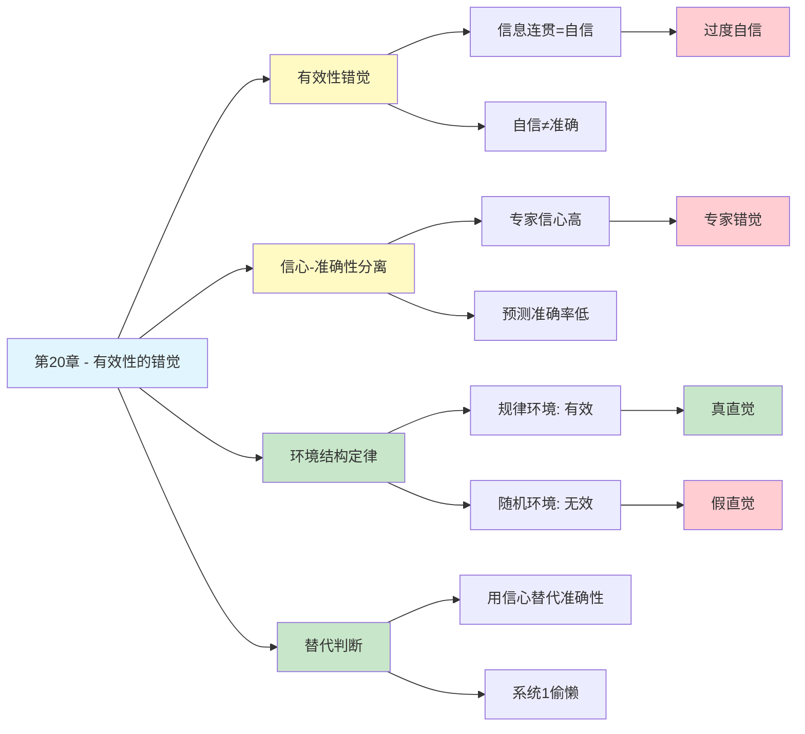

---

category: 
  - 书籍拆解

status: draft
chapter: 
number: 20
title: 有效性的错觉
links:

  - "[[第19章-理解的错觉]]"
  - "[[第21章-我们已经预见到了]]"
  - "[[思考快与慢/_导航]]"
created: 2026-02-28
tags:
  - 思考快与慢
  - 有效性的错觉
  - 过度自信
  - 判断信心
  - 直觉有效性
---

# 第20章 有效性的错觉

## 📍 章节定位

### 全书位置
> 第20章揭示了人类判断中最危险的错觉之一：我们对预测的有效性深信不疑，但这种信心往往毫无根据。卡尼曼用自己在以色列军队的经历证明，即使专业人士对自己的判断充满自信，他们的预测准确率可能为零。这种"有效性错觉"让我们在决策时过度依赖直觉，忽视真正的证据。

- **全书核心问题**: 为什么人类的判断经常偏离理性？
- **本章回答的问题**: 为什么我们对自己的判断如此自信？这种自信可靠吗？
- **角色类型**: 核心理论型（揭示过度自信的心理根源）
- **论证位置**: 第四部分"选择"的核心章节，连接理解错觉与风险偏好

### 章节序列
| 方向 | 章节标题 | 逻辑连接 |
|------|----------|----------|
| 前章 | [[第19章-理解的错觉]] | 从"以为理解"延伸到"以为有效" |
| 后章 | [[第21章-我们已经预见到了]] | 从有效性错觉到后见之明的过度自信 |
| 整书 | [[思考快与慢-丹尼尔·卡尼曼]] | 系统1在判断领域的核心错觉 |

### 一句话定位
> 第20章告诉我们：你对判断的信心，和判断的准确性，往往是两回事。专业人士的直觉自信，可能只是"有效性错觉"，而非真正的预测能力。

---

## 🎯 核心观点

### 第一层：表层案例
| 案例名称 | 简要描述 | 关键引文 |
|----------|----------|----------|
| 以色列军官评估 | 卡尼曼在以军负责评估新兵性格，评估者对判断极具信心，但预测准确率接近零 | "信心和准确性完全脱节" |
| 股票分析师预测 | 分析师对公司业绩的预测充满信心，但研究显示预测准确性极低 | "专家的自信不等于能力" |
| 政治选举预测 | 专家对选举结果充满信心，但预测记录令人失望 | "预测失败的专家依然自信" |
| 心理测试预测 | 心理测试对职业匹配的预测，实际效果远低于测试者的预期 | "测试'感觉有效'但实际无效" |
| HR面试判断 | 面试官对求职者的判断充满信心，但研究显示面试预测效果很差 | "直觉判断的魅力陷阱" |

### 第二层：中层机制
| 机制名称 | 组成要素 | 因果链条 | 证据来源 |
|----------|----------|----------|----------|
| 有效性错觉 | 输入连贯性 + 自信感 | 信息连贯 → 产生自信 → 误以为有效 | Kahneman军队研究 |
| 信心-准确性分离 | 直觉自信 + 环境随机 | 复杂环境 → 预测无效 → 自信仍存 | 专家预测研究 |
| 替代判断 | 简单问题替代复杂问题 | 判断难度高 → 系统1偷懒 → 用信心替代准确性 | 系统1特征研究 |
| WYSIATI效应 | 信息有限 + 自动补全 | 只看到片面 → 构建完整故事 → 产生有效感 | WYSIATI理论 |
| 反馈缺失 | 无及时反馈 + 记忆偏差 | 预测无验证 → 忘记失败 → 保持自信 | 学习心理学 |

### 第三层：底层规律
| 规律陈述 | 抽象层级 | 知识连接 | 适用范围 |
|----------|----------|----------|----------|
| 有效性错觉定律 | 认知心理学核心规律 | [[第7章-过度自信的锚点]], [[WYSIATI]] | 所有判断场景 |
| 信心-准确性分离定律 | 元认知规律 | [[直觉陷阱]], [[专家错觉]] | 低效预测环境 |
| 环境结构定律 | 认知科学规律 | [[规律环境]], [[随机环境]] | 区分有效/无效直觉 |
| 替代定律 | 系统1核心规律 | [[启发法]], [[属性替代]] | 所有无意识判断 |

---

## 💬 降维翻译

### 观点1: 有效性错觉——你的信心可能是假的

#### 原文表达
> "人们在做判断时，往往会感到一种'有效性'——他们相信自己的判断是有效的、准确的。但这种感觉往往是一种错觉，它来自信息的连贯性，而非判断的真实准确性。"

#### 降维翻译（中学生能懂）
你有没有这种经历：
- 面试一个人，觉得"这人肯定行"
- 预测一个股票，觉得"肯定涨"
- 判断一个项目，觉得"肯定成功"

**问题是**：你这么有信心，你的判断真的准吗？

真相是：**信心和准确性，是两回事。**

你的大脑会根据你看到的信息，自动编一个连贯的故事。故事越连贯，你就越有信心。但故事连贯不等于故事真实，信心满满不等于判断正确。

**一句话**：你觉得"我很确定"，可能只是你的大脑把故事编得好。

#### 日常类比（奶奶能懂）
就像算命的。算命的说得头头是道，你自己也觉得"好准"，但那是故事讲得好，不是真的能预测你的未来。

信不信和准不准，是两回事。

#### 检验
- Q: 如果一个中学生问你这是什么意思？
- A: 你觉得自己"很确定"的事，可能只是你的大脑编了一个让你信服的故事。确定感和准确性是两回事。

---

### 观点2: 信心-准确性分离——专家也可能错得离谱

#### 原文表达
> "在我们的研究中，军官们对自己的判断充满信心，评分时从不含糊。但当我们追踪这些新兵的后续表现时，发现预测的准确性几乎为零。信心和准确性完全分离。"

#### 降维翻译（中学生能懂）
专业人士也可能错得离谱，而且他们自己不知道。

卡尼曼年轻时在以色列军队负责评估新兵。评估团队：
- 每天观察新兵训练
- 给每个新兵打分预测
- 对自己的判断非常自信

**结果呢？**
追踪这些新兵的实际表现，发现预测准确率**接近零**。

更可怕的是：
- 知道结果后，评估团队依然觉得自己"很厉害"
- 他们完全没意识到自己的预测是瞎猜

**一句话**：专家的自信，可能是错觉，不是能力。

#### 日常类比（奶奶能懂）
就像老中医看病。他摸摸脉，说得头头是道，他自己也信，你也信。但真的比仪器准吗？不一定。

自信不等于本事。

#### 检验
- Q: 如果一个中学生问你这是什么意思？
- A: 专家说自己"很有把握"，不代表他说得对。信心和准确性是两回事，尤其是在预测复杂事情的时候。

---

### 观点3: 什么时候直觉有效？——环境决定一切

#### 原文表达
> "直觉的有效性取决于环境。在规律性强的环境中，如国际象棋、消防，经过长期训练的专家可以发展出有效的直觉。但在低效性环境中，如股票预测、政治预测，专家的直觉并不比普通人更准确。"

#### 降维翻译（中学生能懂）
直觉有时候准，有时候不准，关键看**环境**。

**准的环境**（有规律可循）：
- 国际象棋大师一眼看出好棋
- 消防队长感觉房子要塌
- 老司机预判危险

这些人的直觉，是**真本事**，因为他们：
- 规律环境（有固定规则）
- 长期训练（练了成千上万次）
- 即时反馈（马上知道对错）

**不准的环境**（充满随机）：
- 股票分析师预测股市
- 政治专家预测选举
- HR面试预测表现

这些人的直觉，**可能是错觉**，因为：
- 环境太复杂（变量太多）
- 反馈太慢（很久才知道对错）
- 随机性太强（运气成分大）

**一句话**：在规律环境里练出来的直觉才有效，在混乱环境里的直觉就是瞎猜。

#### 日常类比（奶奶能懂）
就像种地。老农看天就能预测明天下雨，那是因为他几十年都在看，而且第二就知道准不准。但你让老农预测股票，他再自信也没用，因为那不是他能练出来的。

练出来的直觉才是直觉，没练过的直觉就是瞎猜。

#### 检验
- Q: 如果一个中学生问你这是什么意思？
- A: 直觉不是都可靠。只有在有规律的环境里，经过长期练习，还能马上知道对错的领域，直觉才可能有效。其他时候，自信的直觉可能只是错觉。

---

## ✨ 金句库

### 原书金句
| 金句 | 适用场景 |
|------|----------|
| "有效性错觉：人们相信自己的判断有效，但实际上毫无根据" | 认知偏误科普 |
| "信心和准确性完全分离" | 决策心理 |
| "在低效性环境中，专家的直觉并不比普通人更准确" | 专家研究 |
| "我们对自己判断的信心，来自信息的连贯性，而非判断的真实准确性" | 直觉研究 |
| "预测失败的专家，往往对自己的能力毫无怀疑" | 过度自信 |

### 降维金句
| 金句 | 来源观点 | 适用场景 |
|------|----------|----------|
| "你觉得'我很确定'，可能只是故事编得好" | 有效性错觉 | 自我反思 |
| "专家的自信，可能是错觉，不是能力" | 信心-准确性分离 | 批判思维 |
| "信不信和准不准，是两回事" | 有效性错觉 | 决策提醒 |
| "自信不等于本事" | 信心-准确性分离 | 人际判断 |
| "练出来的直觉才是直觉，没练过的直觉就是瞎猜" | 直觉条件 | 直觉判断 |
| "在规律环境里练出来的直觉才有效" | 环境决定 | 专业能力 |

## 🔗 当下映射

### 💰 财富应用
| 场景 | 具体行动 | 预期效果 | 风险提示 |
|------|----------|----------|----------|
| 投资决策 | 区分"有信心"和"准确"，不因自信而加仓 | 更理性的投资 | 需要纪律 |
| 股评阅读 | 对分析师的"确定性判断"保持怀疑 | 避免被误导 | 需要批判思维 |
| 创业决策 | 识别创业预测中的"有效性错觉" | 更客观的商业判断 | 可能过于谨慎 |

### 💼 职场应用
| 场景 | 具体行动 | 所需能力 | 适用职级 |
|------|----------|----------|----------|
| 招聘决策 | 不因"面试感觉好"而录用，增加结构化评估 | 系统思维 | 全职级 |
| 项目评估 | 区分团队信心和项目可行性 | 分析能力 | 管理层 |
| 战略规划 | 对内部预测保持怀疑，引入外部视角 | 批判思维 | 战略层 |

### 🏠 生活应用
| 场景 | 具体行动 | 可行性 | 见效时间 |
|------|----------|--------|----------|
| 人际判断 | 不因"感觉很准"而轻信他人 | 高 | 即时 |
| 自我认知 | 承认"我可能没那么准" | 中 | 长期 |
| 决策记录 | 记录判断时的信心程度，事后对比准确性 | 高 | 中期 |

### 72小时行动计划
1. **明天可以做的第一件事**: 回想最近一次你"非常有信心"做出的判断，问自己：这个信心来自真实证据，还是只是"感觉确定"？
2. **本周内可以尝试的事**: 找一个专家预测（股评、楼市分析、体育预测），记录预测内容，后续验证准确性，看看信心和准确性是否一致。
3. **需要准备资源才能做的事**: 建立"判断日记"，每次做重要判断时记录信心程度（1-10分），事后验证并统计信心与准确性的相关性。

---

## 🕸️ 章节关联

### 向上关联 → 整书
- **贡献**: 揭示系统1在判断领域的核心错觉——有效性错觉，解释为什么人们对判断过度自信
- **位置**: 第四部分的核心理论，连接理解错觉与风险偏好

### 横向关联 → 章节间
| 章节编号 | 章节标题 | 关联类型 | 连接描述 |
|----------|----------|----------|----------|
| 第19章 | 理解的错觉 | 基础 | 以为理解延伸到以为有效 |
| 第21章 | 我们已经预见到了 | 深化 | 后见之明加剧过度自信 |
| 第22章 | 感觉能做出好决定 | 延伸 | 有效性错觉在决策中的表现 |
| 第10章 | 小数法则 | 基础 | 小样本导致过度自信 |
| 第26章 | 专家的错觉 | 深化 | 专家直觉有效性的边界条件 |

### 向下关联 → 具体应用
| 应用场景 | 难度 | 前置知识 |
|----------|------|----------|
| 投资决策 | 低 | 有效性错觉概念 |
| 招聘决策 | 中 | 信心-准确性分离 |
| 战略规划 | 高 | 环境结构理论 |

### 跨书关联 → 知识网络
| 书籍 | 概念 | 关系 | 备注 |
|------|------|------|------|
| [[思考快与慢-丹尼尔·卡尼曼]] | 有效性错觉 | 同源 | 理论源头 |
| [[黑天鹅-塔勒布]] | 专家错觉 | 深化 | 塔勒布对专家预测的批判 |
| [[随机漫步的傻瓜-塔勒布]] | 幸存者偏差 | 互补 | 为什么失败的预测被遗忘 |
| [[清醒思考的艺术-多贝里]] | 过度自信偏误 | 应用 | 更多日常案例 |

### 关联可视化

---

## ❓ 问答设计

### Q1: [记忆型问题]
**认知层次**: 记忆
**难度**: 低
**描述**: 什么是"有效性错觉"？
**答案要点**:
- 人们相信自己的判断有效，但实际上毫无根据
- 信心来自信息的连贯性，而非判断的真实准确性
- 这是一种认知偏误，不是真实的预测能力

### Q2: [理解型问题]
**认知层次**: 理解
**难度**: 中
**描述**: 为什么信心和准确性会分离？
**答案要点**:
- 系统1用"信心感"替代"准确性判断"
- 复杂环境中的预测本质上是随机猜测
- 缺乏及时反馈让人无法修正错误信念
- 记忆偏差让人忘记失败，记住成功

### Q3: [应用型问题]
**认知层次**: 应用
**难度**: 中
**描述**: 如何判断一个专家的直觉是否有效？
**答案要点**:
- 检查环境是否有规律（规律环境vs随机环境）
- 检查是否有长期练习机会
- 检查是否有即时反馈机制
- 三个条件都满足，直觉才可能有效

### Q4: [分析型问题]
**认知层次**: 分析
**难度**: 中
**描述**: 有效性错觉和理解的错觉有什么关系？
**答案要点**:
- 两者都是系统1的认知错觉
- 理解的错觉：以为理解了，其实是编故事
- 有效性的错觉：以为判断有效，其实是瞎猜
- 两者共同作用，让人过度自信

### Q5: [创造型问题]
**认知层次**: 创造
**难度**: 高
**描述**: 如何设计一个制度来减少招聘中的"有效性错觉"？
**答案要点**:
- 引入结构化面试，减少主观判断
- 建立预测跟踪机制，验证面试评价的准确性
- 用统计模型辅助决策，不依赖纯直觉
- 定期回顾招聘失误，修正判断偏差

### Q6: [理解型问题]
**认知层次**: 理解
**难度**: 中
**描述**: 为什么说"环境决定直觉的有效性"？
**答案要点**:
- 规律环境（如国际象棋）有固定规则可循
- 随机环境（如股票市场）变量太多太复杂
- 在规律环境中，长期练习才能形成真直觉
- 在随机环境中，练习再多也形成不了有效直觉

### Q7: [应用型问题]
**认知层次**: 应用
**难度**: 中
**描述**: 投资时如何避免"有效性错觉"的影响？
**答案要点**:
- 不因"我很确定"而加大投资
- 区分规律环境和随机环境
- 记录判断信心，事后验证准确性
- 对专家预测保持怀疑态度

### Q8: [分析型问题]
**认知层次**: 分析
**难度**: 高
**描述**: 为什么专家在预测失败后依然保持自信？
**答案要点**:
- 后见之明：事后觉得自己"早就知道"
- 记忆偏差：忘记失败，记住成功
- 反馈缺失：缺乏系统性的预测跟踪
- 身份认同：承认失败威胁专家身份

### Q9: [理解型问题]
**认知层次**: 理解
**难度**: 中
**描述**: WYSIATI与有效性错觉有什么关系？
**答案要点**:
- WYSIATI：所见即为全貌
- 系统1只根据有限信息构建完整故事
- 故事越连贯，越感觉"有效"
- 但连贯感来自信息补全，不是真实有效性

### Q10: [创造型问题]
**认知层次**: 创造
**难度**: 高
**描述**: 如果你要给一个创业者讲解"为什么不要相信自己的直觉"，你会怎么说？
**答案要点**:
- 用例子开头：成功学都是事后编的故事
- 讲有效性错觉：信心不等于准确性
- 讲环境条件：商业环境太复杂，直觉很难有效
- 教他问：我的信心来自证据还是感觉？
- 建议：用数据和测试验证直觉

---

## 📝 备注

### 信息来源与质量评级
- **第一轮检索**: ⭐⭐⭐ 《思考快与慢》原书第20章内容、有效性错觉理论
- **第二轮检索**: ⭐⭐⭐ 卡尼曼军队研究、专家预测研究
- **信息整合**: 已有章节格式 + 有效性错觉核心概念 + 信心-准确性分离理论

### 章节特色
本章揭示了人类判断中最危险的错觉之一：有效性错觉。人们对自己的判断充满自信，但这种信心往往与判断的准确性无关。卡尼曼用自己在以色列军队的经历证明，专业人士的直觉自信可能完全是错觉。理解这个概念，有助于我们在投资、招聘、战略规划等重要决策中，对自己的判断保持应有的怀疑。

### 与其他第20章的关系
本书存在不同翻译版本：
- "有效性的错觉"版本：侧重信心-准确性分离
- "系统性风险偏好"版本：侧重风险决策中的心理机制
- 两个版本互补，建议结合阅读

### 核心洞见
> 你对判断的信心，和判断的准确性，往往是两回事。真正的智慧，是知道什么时候可以相信直觉，什么时候不能。
