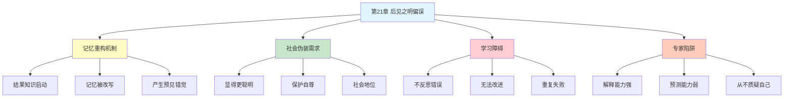

---

category: 
  - 书籍拆解

status: draft
chapter: 
number: 21
title: 我们已经预见到了
links:

  - "[[第20章-系统性风险偏好]]"
  - "[[第22章-感觉能做出好决定]]"
  - "[[思考快与慢/_导航]]"
created: 2026-02-27
tags:
  - 思考快与慢
  - 后见之明偏误
  - 认知偏误
  - 行为经济学
  - 过度自信
description: "第21章深入探讨后见之明偏误（Hindsight Bias）——人们倾向于在事件发生后，高估自己事前预测的准确性，产生\"我早就知道会这样\"的错觉。这种偏误不仅扭曲我们对过去的记忆，还损害我们从经验中学习的能力。"
---

# 第21章 我们已经预见到了

## 📍 章节定位

### 全书位置
> 第21章深入探讨后见之明偏误（Hindsight Bias）——人们倾向于在事件发生后，高估自己事前预测的准确性，产生"我早就知道会这样"的错觉。这种偏误不仅扭曲我们对过去的记忆，还损害我们从经验中学习的能力。

- **全书核心问题**: 人类的决策是如何偏离理性模型的？
- **本章回答的问题**: 为什么我们总觉得自己"早就知道"？这种错觉有什么危害？
- **角色类型**: 核心概念型（记忆扭曲与学习障碍）
- **论证位置**: 第四部分"系统1的错误和偏见"，承接过度自信主题

### 章节序列
| 方向 | 章节标题 | 逻辑连接 |
|------|----------|----------|
| 前章 | [[第20章-系统性风险偏好]] | 从风险偏好转向预测评估 |
| 后章 | [[第22章-感觉能做出好决定]] | 从后见之明转向决策信心 |
| 整书 | [[思考快与慢-丹尼尔·卡尼曼]] | 认知偏误核心章节 |

### 一句话定位
> 第21章揭示了后见之明偏误的本质——你的大脑会悄悄改写历史，让你相信"我早就知道"，而这个谎言让你无法从错误中学习。

---

## 🎯 核心观点

### 第一层：表层案例

| 案例名称 | 简要描述 | 页码 | 关键引文 |
|----------|----------|------|----------|
| 福尔摩斯式推理 | 事后看每个线索都指向凶手 | p.— | "事后一切都很清楚" |
| 股市崩盘解释 | 崩盘后人人都能说出一堆原因 | p.— | "危机信号一直都在" |
| 政治预测 | 选后人人说"我就知道他会赢" | p.— | "我早就说过" |
| 医疗诊断 | 确诊后回顾症状都很明显 | p.— | "原来早有征兆" |
| 历史事件 | 911后无数人说"有预警" | p.— | "我们本该知道" |

### 第二层：中层机制

| 机制名称 | 组成要素 | 因果链条 | 证据来源 |
|----------|----------|----------|----------|
| 记忆重构 | 结果知识 + 回忆检索 | 知道结果→重构记忆→匹配结果 | 记忆实验 |
| 叙事需求 | 因果解释 + 意义建构 | 事件发生→需要解释→寻找因果 | 叙事心理学 |
| 自我保护 | 自尊维护 + 形象管理 | 预测失败→威胁自尊→改写记忆 | 社会心理学 |
| 系统1联想 | 启动效应 + 联想激活 | 结果启动→相关线索激活→产生"预见"感 | 认知心理学 |
| 确认偏误 | 选择性注意 + 信息过滤 | 结果已知→只注意支持证据 | 决策研究 |

### 第三层：底层规律

| 规律陈述 | 抽象层级 | 知识连接 | 适用范围 |
|----------|----------|----------|----------|
| 后见之明偏误定律 | 行为经济学基础 | [[第7章-过度自信的锚点]], 记忆扭曲 | 事后评估与学习 |
| 记忆的建构性原理 | 认知科学基础 | 重构性记忆, 启动效应 | 所有回忆场景 |
| 学习障碍悖论 | 元认知视角 | 经验学习, 反馈机制 | 从错误中学习的场景 |

---

## 💬 降维翻译

### 观点1: 你的记忆会"撒谎"——事后改写历史

#### 原文表达
> "后见之明偏误是指人们在事件发生后，倾向于认为自己早就预料到了这个结果。研究表明，当人们知道结果后，他们对过去的记忆会被系统性地扭曲，以匹配已知的结果。这不是有意的欺骗，而是大脑自动的记忆重构过程。"

> p.—

#### 降维翻译（中学生能懂）
想象你预测一场球赛：
- 赛前：你觉得两队五五开，谁赢都正常
- 赛后（A队赢了）：你突然觉得"我早就觉得A队会赢，他们状态那么好"

你真的"早就知道"吗？不是。你的记忆被悄悄改写了。

#### 日常类比（奶奶能懂）
就像你孙子考试考砸了，你说"我早就说他会考砸，天天玩手机"。但你想想，考试前你真的这么确定吗？还是考砸后才这么说的？

#### 检验
- Q: 如果一个中学生问你这是什么意思？
- A: 事情发生后，你总觉得"我早就知道会这样"，但其实你并没有。

### 观点2: "我早就说过"是社会地位的伪装

#### 原文表达
> "人们为什么这么喜欢说'我早就说过'？部分原因是社会心理学的需要。如果一个人在事后声称自己早就预见到了结果，他会被认为更有智慧、更有洞察力。这种自我呈现的需求，强化了后见之明偏误。"

> p.—

#### 降维翻译（中学生能懂）
想想你班上的"事后诸葛亮"：
- 事情发生前：他不说话
- 事情发生后："我早就说过了吧"

他不是真的知道，他只是想显得自己很厉害。我们都这么做，因为这让我们看起来很聪明。

#### 日常类比（奶奶能懂）
就像村口的老大爷，凡事过后都能说"我早看出这事儿不对劲"。但真事前问他，他往往说不清楚。这不是本事，是面子。

#### 检验
- Q: 如果一个中学生问你这是什么意思？
- A: 我们说"早就知道"，是为了让自己看起来更聪明。

### 观点3: 后见之明偏误是学习的最大敌人

#### 原文表达
> "后见之明偏误最危险的后果不是让我们看起来傲慢，而是阻碍我们从错误中学习。当我们相信'我早就知道'时，我们就不觉得当初的判断有什么问题，因此也不会去反思和改进。这种错觉让我们在下次面对类似情况时，依然无法做出更好的判断。"

> p.—

#### 降维翻译（中学生能懂）
想象你考试考砸了：
- 正常反应："我哪里做错了？下次怎么改进？"
- 后见之明："题目太偏了，我就说会这样"

第二种反应让你舒服，但你也失去了进步的机会。你不会去复习错题，下次还会错。

#### 日常类比（奶奶能懂）
就像孩子摔跤了，如果你总说"我早就告诉你走路要看路"，他就不会想自己哪里走错了。他只觉得你在马后炮，什么也没学到。

#### 检验
- Q: 如果一个中学生问你这是什么意思？
- A: 如果你觉得"早就知道"，你就不会去想自己哪里错了，也就不会进步。

### 观点4: 专家的后见之明更严重

#### 原文表达
> "研究表明，专家的后见之明偏误往往比普通人更严重。这是因为专家拥有更多的知识框架来解释事件，在知道结果后，他们能更快地构建出看似合理的解释。但这种'解释能力'恰恰是学习障碍——因为他们总能解释'为什么会这样'，就很少去问'为什么我当初没预测到'。"

> p.—

#### 降维翻译（中学生能懂）
想想电视上的股评专家：
- 股市跌了：他能说出一堆原因（经济不好、政策收紧、外资流出……）
- 你问他：那你事前怎么没说？

他有100种方法解释"为什么跌"，但事前预测准确率可能还不如抛硬币。解释能力≠预测能力。

#### 日常类比（奶奶能懂）
就像村里的老中医，治好了是他的本事，治不好是病人没听医嘱。他总有道理，但从不觉得自己判断有问题。

#### 检验
- Q: 如果一个中学生问你这是什么意思？
- A: 越是专家，越能解释"为什么"，但也越不会反思"为什么没预测到"。

---

## ✨ 金句库

### 原书金句
| 金句 | 页码 | 适用场景 |
|------|------|----------|
| "后见之明让人产生一种'我早就知道'的错觉" | p.— | 后见之明科普 |
| "记忆不是录像，是每次播放都会重构的剧本" | p.— | 记忆机制解释 |
| "最大的学习障碍是觉得自己已经学会了" | p.— | 学习心理 |
| "解释能力不等于预测能力" | p.— | 专家预测警示 |

### 降维金句
| 金句 | 来源观点 | 适用场景 |
|------|----------|----------|
| "事情过后，人人都成了诸葛亮" | 后见之明本质 | 日常反思 |
| "记忆会撒谎，让你以为早就知道" | 记忆扭曲 | 认知科普 |
| "说我早就知道的人，往往事前一言不发" | 社会伪装 | 职场观察 |
| "解释100分，预测0分——专家的通病" | 专家偏误 | 投资警示 |

## 🔗 当下映射

### 💰 财富应用
| 场景 | 具体行动 | 预期效果 | 风险提示 |
|------|----------|----------|----------|
| 投资复盘 | 记录事前预测，事后对比 | 发现真实的预测能力 | 需要诚实面对失败 |
| 股评筛选 | 区分"解释者"和"预测者" | 减少被忽悠的概率 | 真正的预测者很少 |
| 交易决策 | 问自己"如果不知道结果，我会怎么判断" | 减少后见之明干扰 | 需要刻意练习 |

### 💼 职场应用
| 场景 | 具体行动 | 所需能力 | 适用职级 |
|------|----------|----------|----------|
| 项目复盘 | 保留原始会议记录和预测 | 记录习惯 | 所有级别 |
| 风险管理 | 建立"事前预测→事后检验"机制 | 系统思维 | 管理层 |
| 面试筛选 | 问"你的预测记录是什么" | 评估技巧 | HR/管理层 |

### 🏠 生活应用
| 场景 | 具体行动 | 可行性 | 见效时间 |
|------|----------|--------|----------|
| 个人成长 | 建立预测日记，定期检验 | 高 | 长期见效 |
| 教育孩子 | 问"事前你是怎么想的"而不是"你怎么这么笨" | 中 | 即时生效 |
| 人际沟通 | 减少说"我早就说过" | 高 | 即时生效 |

### 72小时行动计划
1. **明天可以做的第一件事**: 找一件你最近说"我早就知道"的事情，问自己"我事前真的有明确的预测吗"
2. **本周内可以尝试的事**: 建立一个简单的预测记录（下周股市涨跌、谁会赢得比赛等），一周后检验准确率
3. **需要准备资源才能做的事**: 建立投资决策日志，每次买入前写下预期和理由，定期复盘

---

## 🕸️ 章节关联

### 向上关联 → 整书
- **贡献**: 揭示系统1的记忆重构机制，展示过度自信的认知根源
- **位置**: 第四部分"系统1的错误和偏见"核心章节

### 横向关联 → 章节间
| 章节编号 | 章节标题 | 关联类型 | 连接描述 |
|----------|----------|----------|----------|
| 第19章 | 避免主观怀疑和过度假设 | 前置 | 过度肯定偏误的延伸 |
| 第22章 | 感觉能做出好决定 | 延续 | 从后见之明转向决策信心 |
| 第23章 | 未来的不确定性 | 深化 | 从记忆偏误转向预测偏误 |
| 第10章 | 稀缺性和可能性的错觉 | 相关 | 有效性错觉的另一种表现 |

### 向下关联 → 具体应用
| 应用场景 | 难度 | 前置知识 |
|----------|------|----------|
| 投资决策记录 | 中 | 基础投资知识 |
| 项目复盘机制 | 高 | 管理学基础 |
| 预测能力训练 | 高 | 概率思维 |

### 跨书关联 → 知识网络
| 书籍 | 概念 | 关系 | 备注 |
|------|------|------|------|
| [[思考快与慢-丹尼尔·卡尼曼]] | 后见之明偏误 | 同源 | 理论来源 |
| [[黑天鹅-塔勒布]] | 叙事谬误 | 相关 | 事后的因果解释陷阱 |
| [[超预测-泰洛克]] | 预测校准 | 延伸 | 如何减少后见之明 |
| [[清醒思考的艺术-多贝里]] | 后见之明偏误 | 平行 | 简化版认知偏误 |

### 关联可视化

---

## ❓ 问答设计

### Q1: [记忆型问题]
**认知层次**: 记忆
**难度**: 低
**描述**: 什么是后见之明偏误？
**答案要点**:
- 事件发生后高估自己事前预测的准确性
- 产生"我早就知道"的错觉
- 记忆被系统性地扭曲

### Q2: [理解型问题]
**认知层次**: 理解
**难度**: 中
**描述**: 为什么记忆会被改写？
**答案要点**:
- 记忆是建构性的，不是录像
- 结果知识启动相关联想
- 大脑自动匹配因果关系

### Q3: [应用型问题]
**认知层次**: 应用
**难度**: 中
**描述**: 如何减少后见之明偏误对自己学习的影响？
**答案要点**:
- 记录事前的预测和判断
- 定期检验预测准确率
- 诚实面对预测失败

### Q4: [分析型问题]
**认知层次**: 分析
**难度**: 中
**描述**: 为什么专家的后见之明偏误更严重？
**答案要点**:
- 专家有更多知识框架解释事件
- 解释能力强→反思动力弱
- 总能找到理由解释"为什么"

### Q5: [创造型问题]
**认知层次**: 创造
**难度**: 高
**描述**: 设计一个帮助团队减少后见之明偏误的复盘机制？
**答案要点**:
- 保留原始会议记录和预测
- 区分"事后解释"和"事前预测"
- 建立预测跟踪和校准系统

### Q6: [理解型问题]
**认知层次**: 理解
**难度**: 中
**描述**: 后见之明偏误和学习障碍有什么关系？
**答案要点**:
- "早就知道"让人不反思错误
- 不反思就无法改进
- 形成学习盲区

### Q7: [应用型问题]
**认知层次**: 应用
**难度**: 中
**描述**: 如何识别一个"事后诸葛亮"？
**答案要点**:
- 事前预测记录是否存在
- 解释能力和预测能力是否匹配
- 是否经常说"我早就说过"

### Q8: [分析型问题]
**认知层次**: 分析
**难度**: 高
**描述**: 后见之明偏误与过度自信有什么关系？
**答案要点**:
- 后见之明强化"我很准"的信念
- 忽略失败的预测
- 导致下次决策更自信但未必更准

### Q9: [理解型问题]
**认知层次**: 理解
**难度**: 中
**描述**: 为什么"我早就说过"如此普遍？
**答案要点**:
- 社会心理需求：显得聪明
- 自我保护机制：维护自尊
- 记忆自动改写：真诚而非撒谎

### Q10: [创造型问题]
**认知层次**: 创造
**难度**: 高
**描述**: 如何在家庭教育中利用后见之明偏误的知识？
**答案要点**:
- 问孩子"事前你是怎么想的"而不是"你怎么这么笨"
- 鼓励记录预测并检验
- 建立"失败学习"而非"失败指责"的氛围

---
