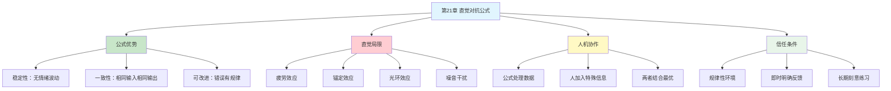

---

category:
  - 书籍拆解

status: draft
chapter:
number: 21
title: 直觉对抗公式
links:

  - "[[第20章-系统性风险偏好]]"
  - "[[第22章-感觉能做出好决定]]"
  - "[[_导航]]"
created: 2026-02-28
tags:
  - 思考快与慢
  - 直觉判断
  - 统计公式
  - 专家直觉
  - 算法决策
---

# 第21章 直觉对抗公式

## 📍 章节定位

### 全书位置
> 第21章探讨直觉判断与统计公式的对决——研究表明，在预测任务中，简单公式往往比专家直觉更准确。本章回答一个关键问题：什么时候相信直觉，什么时候相信公式？

- **全书核心问题**: 人类的决策是如何偏离理性模型的？
- **本章回答的问题**: 公式为什么比直觉更准？专家什么时候可以信任？
- **角色类型**: 核心概念型（算法决策 vs 人类直觉）
- **论证位置**: 第四部分"系统1的错误和偏见"，探讨决策工具的比较

### 章节序列
| 方向 | 章节标题 | 逻辑连接 |
|------|----------|----------|
| 前章 | [[第20章-系统性风险偏好]] | 从风险偏好转向决策工具比较 |
| 后章 | [[第22章-感觉能做出好决定]] | 从公式转向主观自信 |
| 整书 | [[思考快与慢-丹尼尔·卡尼曼]] | 理性决策工具核心章节 |

### 一句话定位
> 第21章揭示了一个反直觉的真相：简单的统计公式，往往比专家的直觉判断更准确——因为公式不会心情不好，不会疲劳，也不会被光环效应蒙蔽。

---

## 🎯 核心观点

### 第一层：表层案例

| 案例名称 | 简要描述 | 关键发现 |
|----------|----------|----------|
| 明尼苏达州假释预测 | 公式预测再犯率 vs 专家判断 | 公式准确率高23% |
| 普林斯顿录取公式 | 简单公式 vs 面试官直觉 | 公式预测学业成功更准 |
| 心脏病诊断 | 算法 vs 医生临床判断 | 算法准确率相当或更高 |
| 葡萄酒价格预测 | 天气数据公式 vs 专家品鉴 | 公式预测更准确 |
| 信贷风险评估 | 评分卡模型 vs 信贷员判断 | 评分卡坏账率更低 |

### 第二层：中层机制

| 机制名称 | 组成要素 | 因果链条 | 证据来源 |
|----------|----------|----------|----------|
| 公式稳定性 | 无情绪波动 + 一致性规则 | 相同输入→相同输出→可预测性高 | 大量实证研究 |
| 直觉脆弱性 | 疲劳效应 + 锚定效应 + 光环效应 | 环境变化→判断波动→准确性下降 | 实验室+现场研究 |
| 信息过载 | 专家处理太多变量 | 变量多→权重不稳定→预测下降 | 米尔研究 |
| 噪音干扰 | 随机波动 + 情绪影响 | 内部噪音→判断不一致→系统性偏差 | 《噪音》研究 |

### 第三层：底层规律

| 规律陈述 | 抽象层级 | 知识连接 | 适用范围 |
|----------|----------|----------|----------|
| 公式优势定律 | 行为经济学基础 | [[算法决策]], [[第22章-专家直觉何时可以信任]] | 可量化的预测任务 |
| 直觉信任条件 | 认知科学基础 | [[技能习得]], [[刻意练习]] | 高规律性环境+即时反馈 |
| 噪音-偏差框架 | 决策科学基础 | [[第4章-随机性、信息和噪音]], [[系统偏误]] | 所有判断决策场景 |

---

## 💬 降维翻译

### 观点1: 公式比直觉更准——这不是侮辱专家

#### 原文表达
> "米尔的研究发现，在预测任务中，简单的统计公式往往比专家的直觉判断更准确。这不是因为专家无能，而是因为人类判断受到太多干扰因素的影响：疲劳、情绪、环境、前一天的经历......而公式每次都给出相同的答案。"

#### 降维翻译（中学生能懂）
想象你要预测谁能考上好大学：
- 方法A：让校长看学生资料，凭直觉判断
- 方法B：用公式计算（高中成绩×0.6 + 标准化考试×0.4）

你猜哪个更准？**答案是方法B**。

为什么？因为校长今天可能心情不好，可能刚被一个长相像某学生的坏孩子惹怒，可能刚喝了第5杯咖啡......而公式每次计算都一样。

#### 日常类比（奶奶能懂）
就像称东西：
- 用弹簧秤（公式）：每次称都是同样的结果
- 用手掂量（直觉）：饿了觉得重，累了觉得轻，心情好觉得轻

专家不是笨，是人太不稳定了。

#### 检验
- Q: 如果一个中学生问你这是什么意思？
- A: 做预测的时候，公式比人的感觉更准，因为人会有情绪波动，公式没有。

### 观点2: 专家什么时候可以信任？两个条件

#### 原文表达
> "直觉并非总是不可靠。专家直觉在两个条件下可以信任：第一，环境具有高度规律性，同样的情况会导致类似的结果；第二，专家通过长期实践获得了即时、明确的反馈。国际象棋、消防、麻醉学就是这样的领域。"

#### 降维翻译（中学生能懂）
什么时候可以信专家的直觉？看两个条件：

**可以信任的场景**：
- 消防员判断火场有没有危险 → 经验管用
- 麻醉师判断病人有没有问题 → 经验管用
- 国际象棋大师看局面 → 经验管用

**不能信任的场景**：
- 股评家预测股市 → 经验不管用
- HR面试判断候选人 → 经验不管用
- 政治评论员预测选举 → 经验不管用

区别在哪？
- 消防员：每次判断都有即时反馈（成功或出事）
- 股评家：预测错了也不知道为什么，市场太复杂

#### 日常类比（奶奶能懂）
就像老中医和老股民：
- 老中医看舌苔，看了一辈子，什么舌苔对应什么病，有即时反馈 → 可以信
- 老股民看盘面，看了20年，市场变化莫测，预测总被打脸 → 不能信

关键不是看多久，是有没有**即时明确的反馈**。

#### 检验
- Q: 如果一个中学生问你这是什么意思？
- A: 专家的直觉在"有规律、有反馈"的领域管用（如下棋、开飞机），在"没规律、没反馈"的领域不管用（如股市、人事）。

### 观点3: 公式不完美，但比人更稳定

#### 原文表达
> "公式并不完美，它也会犯错。但公式的错误是系统性的、可预测的，而人类的错误是随机的、不可预测的。更重要的是，公式每次都犯同样的错误，这让我们可以研究和改进它。人类的错误今天这样、明天那样，根本无从下手。"

#### 降维翻译（中学生能懂）
公式和人都会犯错，但错的性质不同：

**公式的错误**：
- 总是偏高5%
- 你发现后可以调整公式

**人的错误**：
- 今天偏高10%，明天偏低8%
- 你根本不知道怎么改

**结论**：宁可要一个稳定犯错的朋友，也不要一个随机犯错的朋友。

#### 日常类比（奶奶能懂）
就像你家的老钟：
- 老钟每天慢3分钟 → 你知道它慢，加上3分钟就行了
- 新钟有时快有时慢，毫无规律 → 你根本不知道现在几点

稳定的不准确，胜过不稳定的不确定。

#### 检验
- Q: 如果一个中学生问你这是什么意思？
- A: 公式犯错是有规律的，可以修正；人犯错是随机的，改不了。

### 观点4: 最好的决策是公式+人，而不是二选一

#### 原文表达
> "最优的决策系统不是完全依赖公式，也不是完全依赖人类专家，而是两者的结合。公式处理数据，给出基准判断；人类专家在公式判断的基础上，加入公式无法捕捉的信息，做出最终决策。这种'人机协作'模式在医学诊断、信贷审批等领域已经证明了其价值。"

#### 降维翻译（中学生能懂）
不要把公式和人当成敌人，它们是队友：

**公式负责**：
- 处理数据
- 计算概率
- 给出基准判断

**人负责**：
- 确认数据是否准确
- 判断有没有特殊情况
- 加入公式不知道的信息

就像GPS导航：
- GPS算路线（公式）
- 你看路况决定要不要绕路（人）
- 两者结合，效果最好

#### 日常类比（奶奶能懂）
就像看病：
- 检查单给你一堆数字（公式结果）
- 医生看完数字，再看你脸色、问你怎么不舒服（人加入的信息）
- 两者结合，才能诊断

光看检查单不行，光凭医生感觉也不行。

#### 检验
- Q: 如果一个中学生问你这是什么意思？
- A: 最好的方法是公式算+人确认，不是二选一。

---

## ✨ 金句库

### 原书金句
| 金句 | 适用场景 |
|------|----------|
| "公式比直觉更准确，这不是侮辱专家，这是尊重人类的一致性局限" | 专业讨论 |
| "专家直觉在两个条件下可以信任：规律性环境+即时反馈" | 判断标准 |
| "人类判断的噪音，比我们想象的要大得多" | 决策研究 |
| "公式每次都给出相同的答案，这正是它的优势" | 稳定性讨论 |
| "我们不是要取代专家，而是要给专家更好的工具" | 人机协作 |
| "稳定的不准确，胜过不稳定的不确定" | 方法论 |
| "直觉不是魔法，是模式识别——但它需要正确的训练" | 直觉研究 |

### 降维金句
| 金句 | 来源观点 | 适用场景 |
|------|----------|----------|
| "公式不会心情不好，不会疲劳，不会被光环效应蒙蔽" | 公式优势 | 日常科普 |
| "专家不是笨，是人太不稳定了" | 人类局限 | 打破迷信 |
| "老中医可以信，老股民不能信——区别在于反馈" | 直觉条件 | 投资警示 |
| "有规律有反馈=直觉管用，没规律没反馈=公式管用" | 判断法则 | 快速判断 |
| "稳定犯错的朋友，比随机犯错的朋友更靠谱" | 稳定性价值 | 生活类比 |
| "宁可要一个偏慢的钟，也不要一个乱跳的钟" | 稳定偏好 | 日常比喻 |
| "公式算+人确认=最佳决策，不是二选一" | 协作模式 | 方法论 |
| "GPS算路线，你判断路况——这才是正确的人机关系" | 协作类比 | 通俗解释 |

## 🔗 当下映射

### 💰 财富应用

| 场景 | 具体行动 | 预期效果 | 风险提示 |
|------|----------|----------|----------|
| 选股决策 | 用量化指标筛选，再人工确认 | 减少情绪干扰 | 公式过时风险 |
| 基金选择 | 看长期业绩数据，不听故事 | 避免被营销忽悠 | 过去不代表未来 |
| 投资决策 | 建立自己的"投资公式" | 提高决策一致性 | 需要回测验证 |
| 风险评估 | 用信用评分而非"感觉" | 更客观的判断 | 数据可能不全 |

### 💼 职场应用

| 场景 | 具体行动 | 所需能力 | 适用职级 |
|------|----------|----------|----------|
| 招聘决策 | 用结构化评分表，减少"眼缘"判断 | 评分设计 | HR/管理层 |
| 绩效评估 | 建立量化KPI+主观评估 | 指标设计 | 管理层 |
| 项目筛选 | 用评分卡而非"拍脑袋" | 决策框架 | 所有级别 |
| 供应商选择 | 量化评分+实地考察 | 评估能力 | 采购/管理层 |

### 🏠 生活应用

| 场景 | 具体行动 | 可行性 | 见效时间 |
|------|----------|--------|----------|
| 购房决策 | 建立评分表（位置/价格/配套） | 高 | 即时生效 |
| 健康判断 | 信体检数据多于"感觉" | 高 | 长期受益 |
| 教育选择 | 看数据而非听故事 | 中 | 长期见效 |
| 日常消费 | 建立简单的决策公式 | 高 | 即时生效 |

### 72小时行动计划
1. **明天可以做的第一件事**: 找一个你经常凭"直觉"判断的事情（如选餐厅、买东西），试着建立一个简单的评分公式
2. **本周内可以尝试的事**: 在做重要决定时，先用公式/数据算一遍，再用直觉判断一遍，看看两者的差异
3. **需要准备资源才能做的事**: 建立一个投资或消费决策的"个人公式"，记录每次决策，检验公式有效性

---

## 🕸️ 章节关联

### 向上关联 → 整书
- **贡献**: 提供理性决策的具体工具对比，展示系统1直觉的局限
- **位置**: 第四部分"系统1的错误和偏见"核心章节

### 横向关联 → 章节间

| 章节编号 | 章节标题 | 关联类型 | 连接描述 |
|----------|----------|----------|----------|
| 第19章 | 理解的错觉 | 前置 | 过度自信导致直觉膨胀 |
| 第20章 | 系统性风险偏好 | 相关 | 风险判断中公式更优 |
| 第22章 | 感觉能做出好决定 | 延续 | 从公式转向主观信心 |
| 第11章 | 锚定效应 | 机制 | 直觉受锚定影响，公式不会 |

### 向下关联 → 具体应用

| 应用场景 | 难度 | 前置知识 |
|----------|------|----------|
| 投资决策量化 | 中 | 基础投资知识 |
| 招聘评分系统 | 高 | HR专业知识 |
| 个人决策公式 | 低 | 无 |

### 跨书关联 → 知识网络

| 书籍 | 概念 | 关系 | 备注 |
|------|------|------|------|
| [[思考快与慢-丹尼尔·卡尼曼]] | 公式vs直觉 | 同源 | 本章核心主题 |
| [[噪音-卡尼曼]] | 判断噪音 | 延伸 | 深入探讨人类判断的随机性 |
| [[超预测-泰洛克]] | 狐狸型预测者 | 相关 | 预测方法比较 |
| [[算法之美]] | 算法决策 | 互补 | 算法视角的决策优化 |
| [[黑天鹅-塔勒布]] | 专家预测失败 | 相关 | 复杂系统的不可预测性 |

### 关联可视化

---

## ❓ 问答设计

### Q1: [记忆型问题]
**认知层次**: 记忆
**难度**: 低
**描述**: 公式比直觉更准确的主要原因是什么？
**答案要点**:
- 公式不受情绪、疲劳等因素影响
- 公式每次给出相同的答案（一致性）
- 公式的错误是系统性的，可以改进

### Q2: [理解型问题]
**认知层次**: 理解
**难度**: 中
**描述**: 专家直觉在什么条件下可以信任？
**答案要点**:
- 环境具有高度规律性
- 可以获得即时、明确的反馈
- 专家经过长期刻意练习
- 例子：消防员、麻醉师、国际象棋大师

### Q3: [应用型问题]
**认知层次**: 应用
**难度**: 中
**描述**: 如何在实际决策中应用"公式+人"的协作模式？
**答案要点**:
- 用公式/数据建立基准判断
- 人确认数据准确性
- 人加入公式无法捕捉的特殊信息
- 最终决策由人负责，但以公式为基础

### Q4: [分析型问题]
**认知层次**: 分析
**难度**: 高
**描述**: 为什么股评家、HR面试官的直觉往往不可靠？
**答案要点**:
- 市场/人事是低规律性环境
- 反馈滞后且不明确
- 成功难以归因（运气vs能力）
- 太多变量，难以学习

### Q5: [创造型问题]
**认知层次**: 创造
**难度**: 高
**描述**: 设计一个用于购房决策的简单评分公式
**答案要点**:
- 确定关键因素（位置、价格、面积、配套等）
- 为每个因素设定权重
- 建立评分标准
- 加权求和得到总分
- 示例：位置(30%) + 价格(25%) + 面积(20%) + 配套(15%) + 房龄(10%)

### Q6: [理解型问题]
**认知层次**: 理解
**难度**: 中
**描述**: "稳定的不准确"为什么比"不稳定的不确定"更好？
**答案要点**:
- 稳定的错误可以被发现和修正
- 不稳定的错误无法预测和改进
- 稳定性是可靠性的基础
- 例子：偏慢的钟 vs 乱跳的钟

### Q7: [应用型问题]
**认知层次**: 应用
**难度**: 中
**描述**: 如何判断一个领域的专家是否值得信任？
**答案要点**:
- 检查该领域是否有规律性
- 检查专家是否能获得即时反馈
- 检查专家是否有长期实践经验
- 检查专家的预测记录（如果有的话）

### Q8: [分析型问题]
**认知层次**: 分析
**难度**: 高
**描述**: AI时代，人类专家的角色会发生什么变化？
**答案要点**:
- 算法处理标准化任务
- 人类专注于非标准化判断
- 人机协作成为主流
- 专家需要学会使用和解读算法结果

### Q9: [理解型问题]
**认知层次**: 理解
**难度**: 中
**描述**: 为什么公式处理的信息越多不一定越准确？
**答案要点**:
- 太多变量导致权重不稳定
- 过拟合风险
- 简单公式往往更稳健
- 人类处理信息能力有限

### Q10: [创造型问题]
**认知层次**: 创造
**难度**: 高
**描述**: 如何在团队中推广"公式决策"的文化？
**答案要点**:
- 从小范围试点开始
- 展示公式vs直觉的对比数据
- 强调公式是工具不是替代
- 允许人在公式基础上调整
- 建立反馈和改进机制

---
