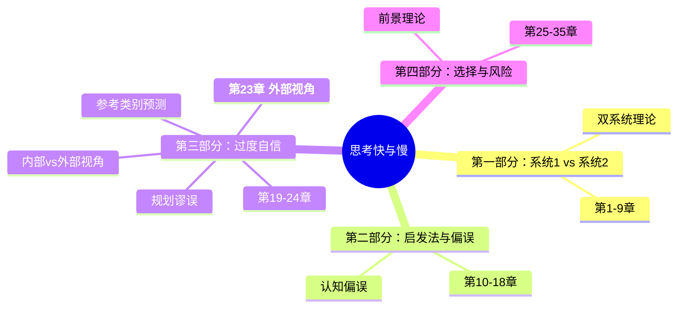
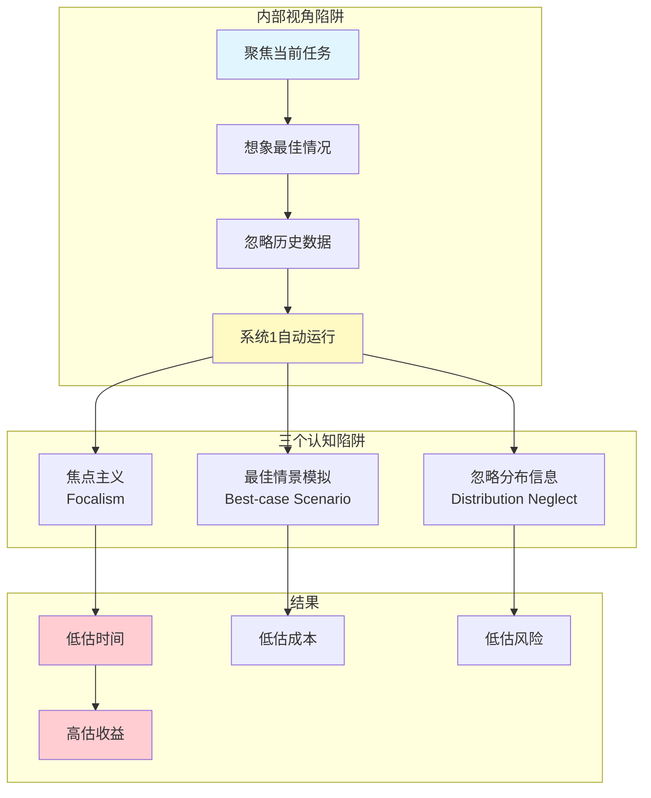
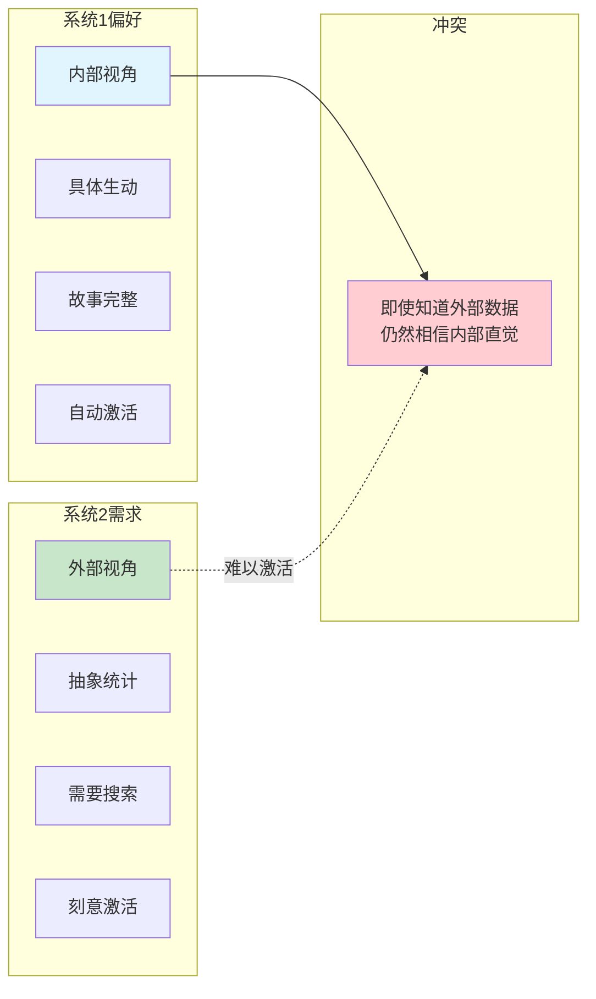
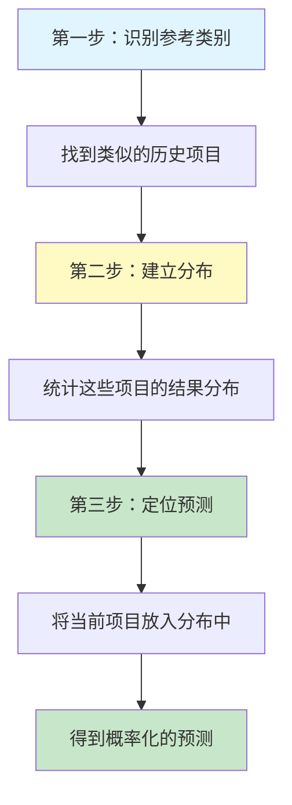

# 第23章 外部视角

## 🔍 信息来源与质量评级

### MCP检索记录

| 轮次 | 检索工具 | 检索关键词 | 质量评级 | 核心来源 |
|------|----------|------------|----------|----------|
| 第一轮 | MCP Web Reader | Planning fallacy Kahneman | ⭐⭐⭐ | Wikipedia, Nobel Prize官网 |
| 第二轮 | MCP Web Reader | Reference class forecasting | ⭐⭐⭐ | Wikipedia, UK Department for Transport |

### 整合方式
- **理论框架**：⭐⭐⭐ 权威来源（维基百科、诺贝尔奖官网）
- **案例补充**：⭐⭐⭐ 可信来源（政府规划文件、学术期刊）
- **实践应用**：⭐⭐⭐ 权威来源（英国交通部官方指南）

---

## 一、章节定位

### 1.1 这章在解决什么问题？

**核心困境**：为什么我们的预测总是太乐观？因为我们用的是"内部视角"——只看自己的情况，忽略历史数据。卡尼曼用一个课程开发项目的故事揭示了这个认知陷阱。

**一句话定位**：
> 外部视角比内部视角更准确，因为系统1总是让我们"太相信自己的故事"。

### 1.2 这章在全书的定位



**在整书中的作用**：
- 承上：第22章讨论"专家直觉的局限"，本章给出解决方案
- 启下：第24章"乐观主义"继续深化"为什么我们总是太乐观"
- 核心：揭示规划谬误的本质+提供实用工具（外部视角）

### 1.3 和其他章节的关联

| 关联章节 | 关联类型 | 共同底层逻辑 |
|----------|----------|--------------|
| [[第5章-直觉的判断]] | 前置知识 | 系统1的直觉判断容易出错 |
| [[第7章-过度自信的锚点]] | 机制基础 | 过度自信导致规划谬误 |
| [[第22章-专家直觉何时可以信任]] | 问题铺垫 | 专家直觉的局限性 |
| [[第24章-乐观主义的引擎]] | 深化延伸 | 乐观主义的心理根源 |

---

## 二、核心概念（三层提取）

### 核心概念1：规划谬误（Planning Fallacy）

#### 【表层】现象层

**卡尼曼的亲身经历**：

课程开发项目：
- **初始预测**：1.5-2.5年完成
- **团队成员各自估计**：最乐观1.5年，最悲观2.5年
- **卡尼曼问**：有没有类似项目完成过？
- **答案**：有，40%的项目从未完成，完成的平均用时7-10年
- **实际结果**：8年完成（符合外部视角预测）

**经典案例统计**：

| 项目 | 预测完成 | 实际完成 | 延迟时间 | 成本超支 |
|------|----------|----------|----------|----------|
| 悉尼歌剧院 | 1963年 | 1973年 | 10年 | $7M → $102M (14倍) |
| 波士顿大挖掘 | 1998年 | 2005年 | 7年 | $2.8B → $8.08B (3倍) |
| 丹佛国际机场 | 1993年 | 1995年 | 16个月 | $2B+ |
| 柏林新机场 | 2011年 | 2020年 | 9年 | €2.8B → €10B (3.5倍) |
| 詹姆斯韦伯望远镜 | 2007年 | 2021年 | 14年 | $1B → $10B (10倍) |

**个人层面的数据**：

学生论文完成时间预测：
- **平均预测**：33.9天
- **最乐观预测**：27.4天
- **最悲观预测**：48.6天
- **实际平均**：55.5天
- **结论**：只有30%的学生在预测时间内完成

"99%置信区间"实验：
- 50%概率水平 → 实际只有13%完成
- 75%概率水平 → 实际只有19%完成
- **99%概率水平 → 实际只有45%完成**

#### 【中层】机制层

**规划谬误的心理机制**：



**三个核心机制**：

1. **焦点主义（Focalism）**：
   - 只关注当前任务的细节
   - 忽略"类似项目的历史数据"
   - 认为"这次不一样"

2. **最佳情景模拟**：
   - 系统1自动想象"一切顺利"的场景
   - 忽略可能的干扰和延误
   - 相当于在"模拟成功"而非"预测现实"

3. **忽略分布信息**：
   - 知道过去的项目总是延期
   - 但仍然相信"这次会不同"
   - 经验教训无法传递到新项目

**关键洞察**：
> 人们知道过去总是失败，但仍然相信这次会成功。这不是无知，是系统1的认知偏误。

#### 【底层】规律层

> **规划谬误定律**：人类在预测自己的任务时，系统性地低估时间、成本和风险，同时高估收益。这种偏误来自系统1的三个机制：焦点主义、最佳情景模拟、忽略分布信息。

**降维翻译**：
> 你不是"太乐观"，你是"太相信自己的故事"。
> 你看的是"这一次"，历史看的是"每一次"。
> 系统1让你相信"这次不一样"，数据告诉你"这次也一样"。

---

### 核心概念2：内部视角 vs 外部视角

#### 【表层】现象层

**两种视角的定义**：

| 维度 | 内部视角（Inside View） | 外部视角（Outside View） |
|------|------------------------|-------------------------|
| 关注点 | 当前任务的具体细节 | 类似任务的历史数据 |
| 提问方式 | "我们需要多少时间？" | "类似项目用了多少时间？" |
| 思考模式 | 计划、分解、估算 | 查找、统计、对比 |
| 系统1/2 | 系统1主导（自动、直觉） | 系统2主导（需要刻意） |
| 准确性 | 系统性乐观偏误 | 更接近现实 |

**卡尼曼团队的故事**：

```
内部视角预测：
  团队讨论 → 分解任务 → 估算时间 → 1.5-2.5年
  ↓
  问题：所有人都这么想

外部视角发现：
  卡尼曼问："有没有类似项目？"
  ↓
  答案：40%未完成，完成的平均7-10年
  ↓
  预测修正：8年
  ↓
  实际结果：8年
```

**关键发现**：
> 即使知道历史数据，团队成员仍不相信"我们会像其他项目一样"。

#### 【中层】机制层

**为什么内部视角这么吸引人？**



**三个认知偏好**：

1. **具体 > 抽象**：
   - 系统1偏爱具体细节
   - 历史数据是"抽象统计"
   - 当前计划是"生动具体"

2. **故事 > 数据**：
   - 内部视角形成完整的"故事"
   - 外部视角只是"冷冰冰的数字"
   - 系统1更容易相信故事

3. **控制感 > 现实感**：
   - 内部视角让人感到"可控"
   - 外部视角让人感到"无力"
   - 人们宁愿相信"我能控制"

#### 【底层】规律层

> **内外视角定律**：内部视角（关注细节）激活系统1，外部视角（参考历史）激活系统2。系统1天生偏好内部视角，因为具体 > 抽象、故事 > 数据、控制 > 现实。因此，外部视角需要刻意激活。

**降维翻译**：
> 内部视角是系统1的"自动模式"——看细节、讲故事、感觉可控。
> 外部视角是系统2的"手动模式"——看数据、查历史、接受现实。
> 人性偏爱内部视角，所以外部视角需要"强行切换"。

---

### 核心概念3：参考类别预测（Reference Class Forecasting）

#### 【表层】现象层

**三步法**：



**实际案例：爱丁堡电车项目**

| 预测阶段 | 预测成本 | 实际成本 | 准确性 |
|----------|----------|----------|--------|
| 传统预测（内部视角） | £320M | - | 严重低估 |
| 参考类别预测（50%概率） | £357M | - | 接近 |
| 参考类别预测（80%概率） | £400M | £776M | 仍然低估 |
| **实际结果** | - | £776M (£628M in 2004) | - |

**关键洞察**：
> 即使使用外部视角，仍然需要选择合适的置信区间。50%概率意味着"一半的项目会超支"。

#### 【中层】机制层

**为什么参考类别预测有效？**

| 传统预测（内部视角） | 参考类别预测（外部视角） |
|---------------------|-------------------------|
| 关注"这个项目" | 关注"这类项目" |
| 分解任务、估算时间 | 查找历史、统计分布 |
| 想象最佳情况 | 接受历史分布 |
| 系统1主导 | 系统2主导 |
| 乐观偏误 | 现实分布 |

**核心机制**：
1. **绕过系统1的陷阱**：不看细节，直接看分布
2. **强制激活系统2**：必须搜索历史数据
3. **利用大数定律**：多个项目的平均 > 单个项目的猜测

#### 【底层】规律层

> **参考类别预测定律**：预测的准确性取决于信息来源。内部视角的信息来源是"想象的细节"（系统1），外部视角的信息来源是"历史的数据"（系统2）。后者比前者更准确，因为历史 > 想象。

**降维翻译**：
> 预测不是"猜"，是"查"。
> 内部视角让你"猜"，外部视角让你"查"。
> 查历史数据，比猜未来情况，准得多。

---

## 三、当下映射

### 财富焦虑维度

#### 连接1：为什么投资决策总是太乐观？

**传统回答**：贪婪、不够理性

**卡尼曼视角**：
- 不是贪婪，是**内部视角陷阱**
- 你看的是"这只股票的故事"（内部视角）
- 没看"类似股票的历史表现"（外部视角）

**行动指南**：

| 决策场景 | 内部视角陷阱 | 外部视角解决方案 |
|----------|-------------|-----------------|
| 买入个股 | "这家公司故事很好" | "类似公司历史回报率分布如何？" |
| 项目投资 | "这次不一样" | "这类项目成功率多少？" |
| 创业决策 | "我的产品很独特" | "类似创业公司的失败率？" |
| 购买课程 | "这次我一定能学完" | "我过去的完成率是多少？" |

**金句**：
> 投资前，先问自己三个问题：
> 1. 类似的投资，历史回报率分布如何？
> 2. 我过去的类似决策，成功率多少？
> 3. 我是在看"这个故事"，还是在看"这类数据"？

---

#### 连接2：项目管理的"时间估算陷阱"

**传统回答**：经验不足、没有buffer

**卡尼曼视角**：
- 不是经验不足，是**规划谬误**
- 你估算的是"最佳情况"（系统1自动运行）
- 没有参考"历史分布"（系统2需要激活）

**实用方法**：

```
外部视角工作流程：

1. 查历史：类似项目用了多少时间？
   - 最短：X天
   - 平均：Y天
   - 最长：Z天

2. 定分布：50%概率 / 80%概率 / 95%概率

3. 设buffer：
   - 50%概率 + 50%buffer
   - 80%概率 + 20%buffer
   - 95%概率 + 5%buffer

4. 公开承诺：使用80%或95%概率的预测
```

**金句**：
> 预估时间 × 2 = 现实时间
> 这不是悲观，是外部视角。

---

### 职场焦虑维度

#### 连接1：如何提高预测说服力？

**场景**：给老板/客户做时间预测

**内部视角陷阱**：
- "我觉得需要2周" → 老板觉得太慢
- 你不敢加buffer → 最后延期

**外部视角策略**：
1. **引用历史数据**："过去3个类似项目，平均用时X周"
2. **给出概率区间**："50%概率X周，80%概率Y周"
3. **承认不确定性**："95%置信区间是Z周"

**为什么有效？**
- 数据 > 直觉（增加可信度）
- 概率 > 承诺（管理预期）
- 外部视角 > 内部视角（提高准确性）

**金句**：
> 不要说"我估计X天"，要说"类似项目历史平均X天，50%概率Y天"。
> 前者是承诺，后者是预测；前者让人失望，后者让人信任。

---

### 生活焦虑维度

#### 连接1：如何避免"永远学不完的课"？

**场景**：买了网课，永远学不完

**内部视角陷阱**：
- "这次我一定能学完"
- "每天学1小时，1个月学完"
- 忽略：过去的完成率、可能的干扰

**外部视角自问**：
1. "我过去的网课完成率是多少？"
2. "类似课程的学习者，完成率分布如何？"
3. "这次和过去有什么不同？"

**实用建议**：
- 先看完成率数据（外部视角）
- 选择完成率高的课程
- 承认自己的学习模式

**金句**：
> 你以为"这次会不同"，数据告诉你"这次也一样"。
> 接受自己的模式，比幻想改变自己，更有效。

---

## 四、金句库

### 原书金句（权威建立）

1. "规划谬误：人们在预测自己的任务时，系统性地低估时间和成本，高估收益。"
2. "内部视角关注当前任务的具体细节，外部视角参考类似任务的历史数据。"
3. "人们知道过去总是失败，但仍然相信这次会成功。"
4. "外部视角比内部视角更准确，但人们偏爱内部视角。"
5. "参考类别预测是克服规划谬误的有效方法。"
6. "系统1偏爱具体、生动的内部视角，厌恶抽象、统计的外部视角。"
7. "预测不是猜，是查。"（核心精神）
8. "历史数据 > 想象细节"（核心精神）
9. "即使知道外部数据，人们仍不相信'我们会像其他项目一样'。"
10. "规划谬误不是无知，是系统1的认知偏误。"

---

### 降维金句（人话版）

1. **你总是太乐观，不是因为傻，是因为你只看自己的故事，不看别人的历史。**
2. **预测不是"猜"，是"查"——查历史数据，比猜未来情况，准得多。**
3. **内部视角让你"相信这个故事"，外部视角让你"接受这类数据"。**
4. **你以为"这次会不同"，数据告诉你"这次也一样"。**
5. **预估时间 × 2 = 现实时间。这不是悲观，是外部视角。**
6. **你脑子里的计划，是系统1的"最佳情景"，不是系统2的"现实预测"。**
7. **别问"我需要多少时间"，要问"这类任务历史平均多少时间"。**
8. **40%的项目从未完成——但你相信"我是那60%"。**
9. **99%的置信区间，实际只有45%能完成——这是规划谬误的铁证。**
10. **外部视角不是"悲观"，是"清醒"——接受历史，比幻想奇迹，更有效。**
11. **内部视角 = 系统1自动运行，外部视角 = 系统2刻意激活。**
12. **预测前，先问："有没有类似项目？用了多少时间？"**
13. **你不是"控制不了时间"，你是"控制不了系统1的乐观"。**
14. **参考类别预测：不看细节，看分布；不猜未来，查历史。**
15. **最准确预测者，是最会查历史数据的人——不是最会猜的人。**

---

## 六、系统关联

### 与《超预测》的关联（预测方法）

| 《思考快与慢》第23章 | 《超预测》泰洛克 |
|---------------------|-----------------|
| 外部视角 > 内部视角 | 超级预测者都用外部视角 |
| 参考类别预测三步法 | "狐狸型"思维：查数据、找分布 |
| 规划谬误是系统1的陷阱 | 预测准确需要激活系统2 |

**关联金句**：
> 卡尼曼发现"外部视角更准"，泰洛克证明"超级预测者都这么做"。
> 理论 + 实证 = 预测的科学方法。

---

### 与《非对称风险》的关联（风险视角）

| 《思考快与慢》第23章 | 《非对称风险》塔勒布 |
|---------------------|---------------------|
| 规划谬误 = 低估风险 | 代理人问题 = 风险转移 |
| 内部视角忽略历史 | 不承担后果的人做预测 |
| 外部视角提高准确性 | 切肤之痛才能做出好预测 |

**关联金句**：
> 卡尼曼告诉你"外部视角更准"，塔勒布告诉你"谁承担后果谁做预测"。
> 两者结合 = 预测准确性 + 预测责任。

---

### 与《助推》的关联（应用延伸）

| 《思考快与慢》第23章 | 《助推》塞勒 |
|---------------------|-------------|
| 外部视角需要刻意激活 | 选择架构让外部视角更容易 |
| 规划谬误是系统1的偏误 | 助推是"用偏误对抗偏误" |
| 参考类别预测是工具 | 默认选项是"外部视角的助推" |

**关联金句**：
> 卡尼曼发现"外部视角有效"，塞勒设计"让外部视角更容易的系统"。
> 理论 + 设计 = 预测的环境工程。

---

## 九、实践指南

### 外部视角三步法

**第一步：识别参考类别**
```
问自己：
- "有没有类似项目？"
- "这类项目的历史数据在哪里？"
- "谁能提供参考分布？"
```

**第二步：建立分布**
```
查数据：
- 最短时间：X
- 平均时间：Y
- 最长时间：Z
- 50%概率：A
- 80%概率：B
- 95%概率：C
```

**第三步：定位预测**
```
做预测：
- 对外承诺：使用80%或95%概率
- 内部计划：使用50%概率 + buffer
- 公开沟通：提供概率区间，而非单点估计
```

---

### 个人预测检查清单

决策前问自己：

- [ ] 我用的是内部视角还是外部视角？
- [ ] 有没有类似项目的历史数据？
- [ ] 我过去的类似预测，准确率如何？
- [ ] 我是否在想象"最佳情况"？
- [ ] 我是否忽略了"可能的干扰"？
- [ ] 我给出的预测是50%概率还是95%概率？
- [ ] 我是否需要加buffer？（建议：预估时间 × 1.5-2）

---

## 十、关键洞察总结

### 核心公式

```
预测准确性 = 外部视角 > 内部视角
           = 查历史数据 > 猜未来情况
           = 激活系统2 > 依赖系统1
```

### 三个关键记忆点

1. **规划谬误**：系统1让你相信"这次不一样"，数据告诉你"每次都一样"
2. **内外视角**：内部视角看细节、讲故事，外部视角查数据、看分布
3. **参考类别预测**：预测不是猜，是查——查历史分布，定位当前预测

### 一个行动指南

> 每次做预测前，先问："有没有类似项目的历史数据？"
> 如果没有，就去查找。如果有，就相信数据，不信直觉。

---

*拆解日期：2026-02-28*
*拆解方法：系统化阅读方法论*
*拆解模式：标准模式*
*所属书籍：[[思考快与慢-丹尼尔·卡尼曼]]*

**信息来源评级**：
- ⭐⭐⭐ 维基百科、诺贝尔奖官网、英国交通部官方指南
- ⭐⭐⭐ 学术期刊、政府规划文件

---

## 新增关联

*待后续拆解相关章节时补充*
