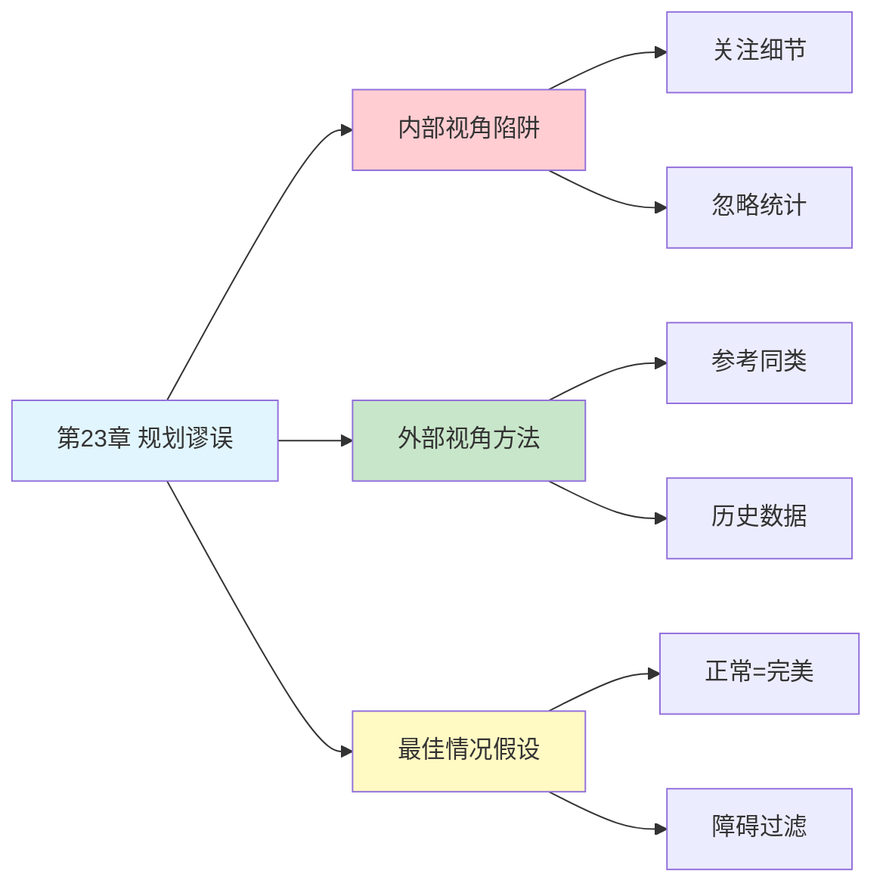

---

category: 
  - 书籍拆解

status: draft
chapter: 
number: 23
title: 未来的不确定性
links:

  - "[[第22章-感觉能做出好决定]]"
  - "[[第24章-被金钱扭曲的心灵]]"
  - "[[思考快与慢/_导航]]"
created: 2026-02-27
tags:
  - 思考快与慢
  - 规划谬误
  - 内部视角
  - 外部视角
  - 过度乐观
---

# 第23章 未来的不确定性

## 📍 章节定位

### 全书位置
> 第23章深入探讨规划谬误（Planning Fallacy）——人们在预测任务完成时间时系统性地过度乐观，低估所需时间和资源。卡尼曼通过亲身经历揭示了"内部视角"与"外部视角"的关键区别，并提出改善预测的实用方法。

- **全书核心问题**: 为什么人类的判断经常偏离理性？
- **本章回答的问题**: 为什么我们总是低估任务完成时间？如何改善预测准确性？
- **角色类型**: 核心概念型（揭示乐观偏差的时间预测机制）
- **论证位置**: 第四部分"过度自信"主题的核心章节，承接第22章决策错误估计

### 章节序列
| 方向 | 章节标题 | 逻辑连接 |
|------|----------|----------|
| 前章 | [[第22章-感觉能做出好决定]] | 从决策信心转向预测准确性 |
| 后章 | [[第24章-被金钱扭曲的心灵]] | 从时间预测转向金钱影响判断 |
| 整书 | [[思考快与慢-丹尼尔·卡尼曼]] | 过度自信主题核心章节 |

### 一句话定位
> 第23章揭示了规划谬误的本质——我们总是为"最佳情况"做计划，忽略历史数据和潜在障碍，解决方案是采用"外部视角"，参考类似项目的真实数据而非自己的理想预期。

---

## 🎯 核心观点

### 第一层：表层案例

| 案例名称 | 简要描述 | 页码 | 关键引文 |
|----------|----------|------|----------|
| 以色列课程项目 | 卡尼曼主持的课程委员会，团队预测2年完成，实际需7年 | p.— | "我们是专家，却对自己的项目一无所知" |
| 悉尼歌剧院 | 原计划4年建成、预算700万，实际14年、超预算15倍 | p.— | "最著名的规划谬误案例之一" |
| 学士论文实验 | 学生预测34天完成论文，实际平均56天 | p.— | "预测时间比实际时间少了近一倍" |
| 装修工程 | "两周搞定"的装修，通常拖延到一个月以上 | p.— | "最佳情况假设在装修中特别明显" |
| 寒暑假读书计划 | 搬一堆书回家，结果原封不动带回 | p.— | "计划很美好，现实很骨感" |

### 第二层：中层机制

| 机制名称 | 组成要素 | 因果链条 | 证据来源 |
|----------|----------|----------|----------|
| 内部视角陷阱 | 当前计划 + 最佳假设 | 关注细节→忽略统计→低估风险 | 卡尼曼课程项目实验 |
| 最佳情况假设 | 理想条件 + 障碍忽视 | 正常≈完美→排除意外→预测偏乐观 | 时间估计对比实验 |
| 信息选择偏差 | 关注相似 + 忽略差异 | 过度依赖正面信息→忽略反面案例 | 决策心理学研究 |
| 控制幻觉 | 能力高估 + 外因低估 | 相信"这次不同"→忽视统计规律 | 过度自信研究 |
| 记忆偏差 | 困难遗忘 + 成功强化 | 回忆偏向顺利→历史被美化→预测失真 | 记忆心理学实验 |

### 第三层：底层规律

| 规律陈述 | 抽象层级 | 知识连接 | 适用范围 |
|----------|----------|----------|----------|
| 侯世达定律 | 时间预测法则 | 复杂系统理论, 不确定性原理 | 所有复杂任务时间估计 |
| 内-外视角差异原理 | 认知框架理论 | 参照点理论, 统计思维 | 判断与决策领域 |
| 乐观偏见定律 | 认知偏差基础 | 进化心理学, 积极心理学 | 自我相关预测 |
| 基础概率忽视原则 | 启发式思维 | 代表性启发, 贝叶斯推理 | 概率判断领域 |

---

## 💬 降维翻译

### 观点1: 规划谬误的本质——为最佳情况做计划

#### 原文表达
> "规划谬误是指人们在估计未来任务的完成时间时，倾向于过度乐观，低估任务完成时间。当研究人员要求人们估计某件事按正常方式进行需要多长时间，以及如果一切顺利需要多长时间时，这两个估计值几乎完全相同。这表明我们倾向于认为典型情景与完美情景几乎相同。"

> p.—

#### 降维翻译（中学生能懂）
想象你要完成一个作业：
- 你心里想："2天就能搞定"
- 但实际上一拖再拖，最后用了5天
- 为什么？因为你假设的是"一切顺利"的情况
- 你没考虑：可能生病、被干扰、遇到难题、心情不好...

**核心问题**：你的"正常"计划，其实就是"完美"计划。

#### 日常类比（奶奶能懂）
就像你做馒头，心里想"一小时能蒸好"。但你没算上：面发不起来、水开了才发现没火、中间邻居来串门...结果一上午都没吃上。

我们做计划时，脑子里只有"顺利"两个字，障碍全被自动过滤了。

#### 检验
- Q: 如果一个中学生问你这是什么意思？
- A: 你做计划时想的都是"一切顺利"，但现实中总会有意外，所以你总是低估时间。

### 观点2: 内部视角 vs 外部视角

#### 原文表达
> "卡尼曼的团队已经为以色列高中课程项目工作了一年。当被问及还需要多久完成时，团队成员估计大约2年。但当卡尼曼问同事们'其他类似委员会完成这类项目通常需要多久'时，他发现这些项目通常需要7年，而且40%的项目甚至从未完成过。我们是这个领域的专家，却对自己的项目一无所知。"

> p.—

#### 降维翻译（中学生能懂）
两种提问方式，答案差3倍：

**内部视角**（盯着自己）：
- "我们还需要多久完成？"
- 回答："大概2年吧"

**外部视角**（看别人）：
- "类似的项目，别人花了多久？"
- 回答："通常7年，有的甚至没完成"

同一个项目，换个问法，答案就完全不同。为什么？因为内部视角只看细节，外部视角看统计规律。

#### 日常类比（奶奶能懂）
就像你孙子考试，他觉得自己能考90分（内部视角），但你知道他平时考试都是70分左右（外部视角）。

内部视角充满希望，外部视角反映历史。

#### 检验
- Q: 如果一个中学生问你这是什么意思？
- A: 预测时，别只看自己的计划，先看看类似的事情别人花了多久，那个数字更靠谱。

### 观点3: 侯世达定律——预测的终极警告

#### 原文表达
> "侯世达定律：做任何事所花的时间总是比你预期的长，即使你已经考虑了侯世达定律。这是一条递归定律——即使你知道它会起作用，它仍然会起作用。"

> p.—

#### 降维翻译（中学生能懂）
有个"套娃定律"：
- 你估计3天完成
- 你知道会拖延，改成5天
- 但5天还是不够
- 因为"知道会拖延"这个调整本身也低估了

就像你调闹钟：设7点，知道起不来改成6:30，结果6:30还是起不来，又改成6点...

#### 日常类比（奶奶能懂）
就像和面：你加了水觉得干了，加点水；又觉得稀了，加点面；又干了...

调整永远追不上真实需要的量。

#### 检验
- Q: 如果一个中学生问你这是什么意思？
- A: 你以为已经预留了足够的时间，但其实你的"预留"本身也是一种乐观估计。

---

## ✨ 金句库

### 原书金句
| 金句 | 页码 | 适用场景 |
|------|------|----------|
| "我们是专家，却对自己的项目一无所知" | p.— | 规划谬误警示 |
| "典型情景与完美情景几乎相同" | p.— | 最佳情况假设 |
| "40%的类似项目从未完成" | p.— | 统计数据冲击 |
| "做任何事所花的时间总是比你预期的长" | p.— | 侯世达定律 |

### 降维金句
| 金句 | 来源观点 | 适用场景 |
|------|----------|----------|
| "你的正常计划，就是你的完美计划" | 规划谬误本质 | 时间管理反思 |
| "内部看细节，外部看统计" | 内外视角对比 | 决策方法 |
| "预测时先看别人，再看自己" | 外部视角应用 | 项目规划 |
| "知道会拖延，还是会拖延" | 侯世达定律 | 自我认知 |

## 🔗 当下映射

### 💰 财富应用
| 场景 | 具体行动 | 预期效果 | 风险提示 |
|------|----------|----------|----------|
| 投资收益预测 | 参考历史平均收益而非理想回报 | 更现实的财务规划 | 可能错过高增长机会 |
| 项目成本估算 | 查询类似项目的实际成本 | 避免预算严重超支 | 需要获取历史数据 |
| 创业时间预期 | 调研同行从启动到盈利的平均时间 | 准备更充分的资金储备 | 可能打击创业热情 |

### 💼 职场应用
| 场景 | 具体行动 | 所需能力 | 适用职级 |
|------|----------|----------|----------|
| 项目时间申报 | 先查历史项目实际耗时，再报时间 | 数据分析能力 | 项目经理及以上 |
| OKR目标设定 | 参考过去完成率设定目标 | 历史数据意识 | 所有级别 |
| 升职加薪预期 | 了解同行业同岗位平均周期 | 信息收集能力 | 中级员工 |

### 🏠 生活应用
| 场景 | 具体行动 | 可行性 | 见效时间 |
|------|----------|--------|----------|
| 学习计划 | 预估时间×2作为实际计划 | 高 | 即时生效 |
| 装修预算 | 查询类似户型的实际花费 | 中 | 短期见效 |
| 旅行规划 | 预留50%的缓冲时间 | 高 | 即时生效 |

### 72小时行动计划
1. **明天可以做的第一件事**: 回顾一个你最近延误的项目，对比你的初始预期和实际耗时，计算偏差比例
2. **本周内可以尝试的事**: 在下一个时间预估中，主动查询"类似任务别人花了多久"，用外部视角校准
3. **需要准备资源才能做的事**: 建立个人"项目耗时记录表"，积累自己的外部视角数据库

---

## 🕸️ 章节关联

### 向上关联 → 整书
- **贡献**: 揭示过度自信在时间预测中的具体表现，提供改善预测的实用方法
- **位置**: 第四部分过度自信主题核心章节，承接决策信心问题

### 横向关联 → 章节间
| 章节编号 | 章节标题 | 关联类型 | 连接描述 |
|----------|----------|----------|----------|
| 第22章 | 感觉能做出好决定 | 前置 | 决策信心为规划谬误铺垫 |
| 第24章 | 被金钱扭曲的心灵 | 延续 | 从时间预测转向金钱判断 |
| 第7章 | 过度自信的锚点 | 相关 | 锚定效应与最佳情况假设同源 |
| 第10章 | 稀缺性和可能性的错觉 | 相关 | 有效性错觉在时间预测中的体现 |

### 向下关联 → 具体应用
| 应用场景 | 难度 | 前置知识 |
|----------|------|----------|
| 项目管理 | 中 | 统计思维基础 |
| 个人时间管理 | 低 | 自我反思习惯 |
| 投资决策 | 高 | 历史数据分析 |

### 跨书关联 → 知识网络
| 书籍 | 概念 | 关系 | 备注 |
|------|------|------|------|
| [[思考快与慢-丹尼尔·卡尼曼]] | 规划谬误 | 同源 | 理论来源 |
| [[助推-理查德·塞勒]] | 选择架构 | 应用 | 用外部视角设计助推 |
| [[黑天鹅-塔勒布]] | 火鸡问题 | 相关 | 对未来的过度自信 |
| [[反脆弱-塔勒布]] | 杠铃策略 | 对比 | 应对不确定性的方法 |

### 关联可视化

---

## ❓ 问答设计

### Q1: [记忆型问题]
**认知层次**: 记忆
**难度**: 低
**描述**: 什么是规划谬误？
**答案要点**:
- 人们低估任务完成时间的倾向
- 为最佳情况做计划
- 忽略历史数据和潜在障碍

### Q2: [理解型问题]
**认知层次**: 理解
**难度**: 中
**描述**: 内部视角和外部视角有什么区别？
**答案要点**:
- 内部视角：关注当前计划的细节
- 外部视角：参考类似项目的历史数据
- 外部视角预测更准确

### Q3: [应用型问题]
**认知层次**: 应用
**难度**: 中
**描述**: 如何利用外部视角改善项目时间预估？
**答案要点**:
- 查询类似项目的实际完成时间
- 了解类似项目的成功率
- 用统计数据校准个人预期

### Q4: [分析型问题]
**认知层次**: 分析
**难度**: 中
**描述**: 为什么知道规划谬误仍然会中招？
**答案要点**:
- 调整本身也是乐观估计
- 侯世达定律的递归特性
- 系统1的自动化乐观倾向

### Q5: [创造型问题]
**认知层次**: 创造
**难度**: 高
**描述**: 设计一个帮助团队避免规划谬误的决策流程？
**答案要点**:
- 强制要求查询历史数据
- 设置"外部视角"检查点
- 建立项目耗时数据库
- 预留固定比例的缓冲时间

### Q6: [理解型问题]
**认知层次**: 理解
**难度**: 中
**描述**: 为什么"正常情况"和"完美情况"的估计几乎相同？
**答案要点**:
- 我们默认排除障碍
- 典型情景被想象成顺利情景
- 系统1自动过滤负面信息

### Q7: [应用型问题]
**认知层次**: 应用
**难度**: 中
**描述**: 在装修项目中如何应用规划谬误知识？
**答案要点**:
- 查询类似户型的实际工期
- 预算按历史数据×1.5
- 准备资金和心理缓冲

### Q8: [分析型问题]
**认知层次**: 分析
**难度**: 高
**描述**: 规划谬误与锚定效应有什么关系？
**答案要点**:
- 都涉及参考点依赖
- 锚定影响数值判断
- 最佳情况假设充当"乐观锚点"

### Q9: [理解型问题]
**认知层次**: 高
**描述**: 侯世达定律的递归特性是什么意思？
**答案要点**:
- 即使考虑了拖延，仍然会拖延
- 调整本身也被低估
- 乐观偏差无法完全修正

### Q10: [创造型问题]
**认知层次**: 创造
**难度**: 高
**描述**: 如何在组织中建立"外部视角"文化？
**答案要点**:
- 项目复盘制度化
- 建立历史数据库
- 鼓励参考而非从零开始
- 奖励准确预测而非乐观预测

---
