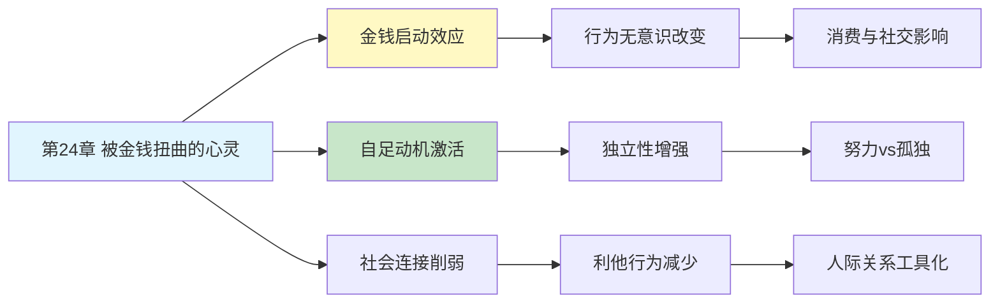

---

category: 
  - 书籍拆解

status: draft
chapter: 
number: 24
title: 被金钱扭曲的心灵
links:

  - "[[第23章-外部视角]]"
  - "[[第1章-哈吉斯]]"
  - "[[思考快与慢/_导航]]"
created: 2026-02-27
tags:
  - 思考快与慢
  - 金钱启动
  - 金钱心理
  - 消费决策
  - 社会启动
---

# 第24章 被金钱扭曲的心灵

## 📍 章节定位

### 全书位置
> 第24章探讨金钱启动效应——仅仅想到金钱就会深刻改变我们的思维方式和行为模式，使人变得更独立、更自私、更努力，揭示金钱概念如何在无意识层面重塑我们的社会行为。

- **全书核心问题**: 人类的决策是如何偏离理性模型的？
- **本章回答的问题**: 为什么仅仅想到钱就会改变我们的行为？金钱如何在无意识层面影响判断？
- **角色类型**: 核心概念型（启动效应的社会应用）
- **论证位置**: 从个体认知偏误延伸到社会行为的心理基础

### 章节序列
| 方向 | 章节标题 | 逻辑连接 |
|------|----------|----------|
| 前章 | [[第23章-外部视角]] | 从决策优化转向金钱心理 |
| 后章 | [[第1章-哈吉斯]] | 从金钱心理转向风险选择 |
| 整书 | [[思考快与慢-丹尼尔·卡尼曼]] | 系统1联想机制的社会应用 |

### 一句话定位
> 第24章揭示了"金钱启动"的惊人力量——仅仅是环境中出现金钱符号，就能让人变得更独立、更努力、也更自私，证明金钱不仅是交易媒介，更是一种深刻塑造心理的无形力量。

---

## 🎯 核心观点

### 第一层：表层案例

| 案例名称 | 简要描述 | 页码 | 关键引文 |
|----------|----------|------|----------|
| 造句实验 | 含金钱词汇的造句任务后，被试行为改变 | p.— | "想到钱就变了" |
| 铅笔掉落实验 | 金钱启动者更不愿帮捡铅笔 | p.— | "帮人意愿下降" |
| 独立性实验 | 金钱启动者更持久地独自解决难题 | p.— | "求助意愿降低" |
| 距离实验 | 金钱启动者与他人保持更大物理距离 | p.— | "社交距离感增加" |
| 消费选择实验 | 金钱启动增加实用性消费倾向 | p.— | "更倾向实用品" |

### 第二层：中层机制

| 机制名称 | 组成要素 | 因果链条 | 证据来源 |
|----------|----------|----------|----------|
| 金钱启动效应 | 金钱线索 + 概念激活 + 行为改变 | 环境金钱线索→激活金钱概念→改变社会行为 | Vohs等人实验 |
| 自足动机激活 | 自我效能 + 独立倾向 | 想到钱→感觉自足→减少依赖他人 | 心理定势理论 |
| 社会连接削弱 | 利他倾向 + 合作意愿 | 金钱概念→市场思维→人际关系工具化 | 社会心理学研究 |
| 解释水平提升 | 抽象思维 + 长期导向 | 金钱→抽象价值→高解释水平 | 解释水平理论 |

### 第三层：底层规律

| 规律陈述 | 抽象层级 | 知识连接 | 适用范围 |
|----------|----------|----------|----------|
| 联想激活原理 | 认知心理学基础 | [[启动效应]], [[联想记忆理论]] | 所有概念相关行为 |
| 心理定势转换 | 社会心理学基础 | [[心理定势理论]], [[情境认知]] | 目标导向行为 |
| 市场-社会双系统 | 行为经济学视角 | [[市场规范vs社会规范]] | 经济与社会行为交界 |

---

## 💬 降维翻译

### 观点1: 仅仅想到钱，你就变了

#### 原文表达
> "在一个经典实验中，研究者让被试完成一个简单的造句任务。一组人的句子中包含与金钱相关的词汇（如'薪水'、'工资'、'现金'），另一组则是中性词汇。任务完成后，研究者'不小心'把一捆铅笔掉在地上。结果：那些刚完成金钱造句的人，帮着捡铅笔的可能性明显更低。他们甚至没意识到自己变了，但行为已经不同。"

> p.—

#### 降维翻译（中学生能懂）
想象一下：
- 你正在做语文作业，要造句
- 题目里有很多词跟钱有关：工资、薪水、奖金、存款...
- 做完作业，老师不小心把笔掉地上了

奇怪的事发生了：你帮老师捡笔的意愿，比那些做普通造句题的同学要低。

你没有变坏，你只是刚刚"想到"了钱，但你的行为已经悄悄变了。

#### 日常类比（奶奶能懂）
就像你走进银行，哪怕只是去取个钱，出来后走路的样子都不太一样了。心里装着钱，人就会变得"独"一点。这不是故意装出来的，是脑子自动换了个频道。

#### 检验
- Q: 如果一个中学生问你这是什么意思？
- A: 想到钱会让你的脑子切换到"自己管自己"模式，不自觉地少管闲事。

### 观点2: 金钱让人更努力，也更孤独

#### 原文表达
> "金钱启动的人会更持久地独自解决一个难题，付出双倍努力也不轻易放弃。但同时，他们向他人求助的意愿大大降低，与他人保持的物理距离也更远。金钱概念激活的是'自足'心态——我能行，我不需要别人。这种心态是一把双刃剑。"

> p.—

#### 降维翻译（中学生能懂）
做一个很难的数学题：
- 刚刚想到钱的人：死磕到底，不问同学
- 没想到钱的人：试几次不行就去问老师

想到钱的好处：你会更努力，更能坚持。
想到钱的代价：你更不爱求助，更想自己扛。

就像打了鸡血，但鸡血里掺了"独行侠"药水。

#### 日常类比（奶奶能懂）
那些特别能挣钱的人，往往也是特别不爱麻烦别人的人。不是他们高冷，是脑子里天天装着钱，就把"自己扛"练成了习惯。钱是个好东西，但也会让人变"独"。

#### 检验
- Q: 如果一个中学生问你这是什么意思？
- A: 钱能让人更努力，但也会让人更不爱求助。好的一面和坏的一面是一起的。

### 观点3: 金钱把人际关系变成交易

#### 原文表达
> "金钱概念的激活会将人的思维模式从'社会规范'切换到'市场规范'。在社会规范下，我们帮助朋友不期望回报；在市场规范下，每件事都有一个价格。当金钱成为背景，人与人的关系就容易变得像交易。"

> p.—

#### 降维翻译（中学生能懂）
想想你帮同学两个场景：
- 场景A：朋友借你的笔记抄，你爽快答应，不要钱
- 场景B：有人出10块钱借你的笔记，你开始算值不值

脑子里有钱的时候，所有事都像在做买卖。

本来是"朋友帮朋友"，现在变成"我付出多少，得到多少"。

#### 日常类比（奶奶能懂）
以前邻里之间借个油盐酱醋，互相帮忙是情分。现在什么事都先问"多少钱"，人情味就淡了。不是人变坏了，是钱把人脑子里的"账本"翻开了。

#### 检验
- Q: 如果一个中学生问你这是什么意思？
- A: 想到钱的时候，你会不自觉地把人和人的关系当成交易来算。

---

## ✨ 金句库

### 原书金句
| 金句 | 页码 | 适用场景 |
|------|------|----------|
| "想到钱，人就变了" | p.— | 行为心理学讨论 |
| "金钱启动让人更独立也更自私" | p.— | 金钱心理科普 |
| "金钱概念无意识地重塑行为" | p.— | 认知偏误教育 |

### 降维金句
| 金句 | 来源观点 | 适用场景 |
|------|----------|----------|
| "脑子里装着钱，手就不爱帮人" | 金钱启动效应 | 社会心理科普 |
| "钱是强心针，也是独行侠药水" | 双刃剑效应 | 个人成长 |
| "想到钱，世界就变成市场" | 规范转换 | 人际关系讨论 |

## 🔗 当下映射

### 💰 财富应用
| 场景 | 具体行动 | 预期效果 | 风险提示 |
|------|----------|----------|----------|
| 消费决策 | 购物前减少金钱相关刺激 | 避免过度理性化 | 可能错失实惠 |
| 投资判断 | 意识到金钱启动的影响 | 减少偏见干扰 | 难以完全隔离 |
| 财务规划 | 在非金钱环境做长期决策 | 更平衡的选择 | 需要刻意安排 |

### 💼 职场应用
| 场景 | 具体行动 | 所需能力 | 适用职级 |
|------|----------|----------|----------|
| 团队协作 | 减少金钱话题激活合作氛围 | 环境设计意识 | 所有层级 |
| 谈判策略 | 利用金钱启动增强独立性 | 心理操控技巧 | 中高层 |
| 薪酬沟通 | 注意金钱启动对公平感的影响 | 沟通技巧 | HR及管理层 |

### 🏠 生活应用
| 场景 | 具体行动 | 可行性 | 见效时间 |
|------|----------|--------|----------|
| 家庭关系 | 避免在金钱氛围中讨论情感 | 高 | 即时生效 |
| 朋友相处 | 意识到金钱话题对关系的影响 | 高 | 长期维护 |
| 个人成长 | 平衡独立与求助的倾向 | 中 | 需要练习 |

### 72小时行动计划
1. **明天可以做的第一件事**: 观察今天接触到的金钱相关线索（广告、价格标签、新闻），记录它们可能在无意识中如何影响你
2. **本周内可以尝试的事**: 在一次重要的人际沟通前，刻意减少金钱话题和金钱相关环境刺激
3. **需要准备资源才能做的事**: 设计一个"无金钱启动"的决策环境，用于重要选择的思考

---

## 🕸️ 章节关联

### 向上关联 → 整书
- **贡献**: 揭示启动效应的社会应用，展示联想机制如何影响现实行为
- **位置**: 从认知机制延伸到社会行为，是系统1理论的重要应用

### 横向关联 → 章节间
| 章节编号 | 章节标题 | 关联类型 | 连接描述 |
|----------|----------|----------|----------|
| 第4章 | 心理账户的诱惑 | 前置 | 心理账户是金钱心理的另一个维度 |
| 第5章 | 直觉的判断 | 基础 | 启动效应是直觉判断的底层机制 |
| 第29章 | 心理账户 | 延伸 | 金钱启动与心理账户相互影响 |
| 第28章 | 公平偏好 | 对比 | 社会规范vs市场规范的转换 |

### 向下关联 → 具体应用
| 应用场景 | 难度 | 前置知识 |
|----------|------|----------|
| 消费环境设计 | 中 | 营销心理学基础 |
| 薪酬激励设计 | 高 | 人力资源管理 |
| 人际关系管理 | 低 | 沟通技巧 |

### 跨书关联 → 知识网络
| 书籍 | 概念 | 关系 | 备注 |
|------|------|------|------|
| [[思考快与慢-丹尼尔·卡尼曼]] | 启动效应 | 同源 | 核心理论来源 |
| [[助推-理查德·塞勒]] | 选择架构 | 延伸 | 环境设计应用 |
| [[金钱心理学]] | 财富心理 | 互补 | 金钱与幸福的关系 |
| [[怪诞行为学]] | 市场规范 | 相关 | 社会vs市场规范的对比 |

### 关联可视化

---

## ❓ 问答设计

### Q1: [记忆型问题]
**认知层次**: 记忆
**难度**: 低
**描述**: 什么是金钱启动效应？
**答案要点**:
- 环境中的金钱线索激活金钱概念
- 无意识地改变行为模式
- 是启动效应的一种具体应用

### Q2: [理解型问题]
**认知层次**: 理解
**难度**: 中
**描述**: 为什么想到钱会让人更不愿帮助他人？
**答案要点**:
- 金钱概念激活自足心态
- 思维从社会规范切换到市场规范
- 人际关系被工具化

### Q3: [应用型问题]
**认知层次**: 应用
**难度**: 中
**描述**: 如何利用金钱启动效应提升工作效率？
**答案要点**:
- 适度暴露金钱线索激发努力
- 注意平衡独立性与合作需求
- 避免过度激活导致团队隔阂

### Q4: [分析型问题]
**认知层次**: 分析
**难度**: 中
**描述**: 金钱启动效应如何体现系统1的运作特点？
**答案要点**:
- 自动激活，无需意识参与
- 联想网络快速扩散
- 行为改变在觉察之外

### Q5: [创造型问题]
**认知层次**: 创造
**难度**: 高
**描述**: 设计一个减少金钱启动负面影响的消费环境？
**答案要点**:
- 减少直接的金钱符号刺激
- 增加社会连接相关线索
- 营造非交易性的氛围

### Q6: [理解型问题]
**认知层次**: 理解
**难度**: 中
**描述**: 金钱启动让人更独立是好事还是坏事？
**答案要点**:
- 双刃剑效应
- 独立性增强有助于解决问题
- 但求助意愿降低可能导致孤立
- 关键在于情境和平衡

### Q7: [应用型问题]
**认知层次**: 应用
**难度**: 中
**描述**: 在家庭教育中如何平衡金钱话题的影响？
**答案要点**:
- 不回避金钱教育
- 注意讨论时的氛围设置
- 平衡独立与互助的培养

### Q8: [分析型问题]
**认知层次**: 分析
**难度**: 高
**描述**: 金钱启动效应研究的可重复性问题说明了什么？
**答案要点**:
- 心理学实验的复杂性
- 启动效应受多种因素调节
- 需要更多研究验证边界条件
- 科学进步需要批判性审视

### Q9: [理解型问题]
**认知层次**: 高
**描述**: 社会规范和市场规范的转换如何影响人际关系？
**答案要点**:
- 社会规范：基于情感和互助
- 市场规范：基于等价交换
- 金钱启动促进向后者的转换
- 影响关系的深度和质量

### Q10: [创造型问题]
**认知层次**: 创造
**难度**: 高
**描述**: 如何在追求财富的同时保持健康的人际关系？
**答案要点**:
- 意识到金钱启动的影响
- 刻意创造非金钱化的互动场景
- 保持社会规范空间
- 定期"清理"金钱思维

---
