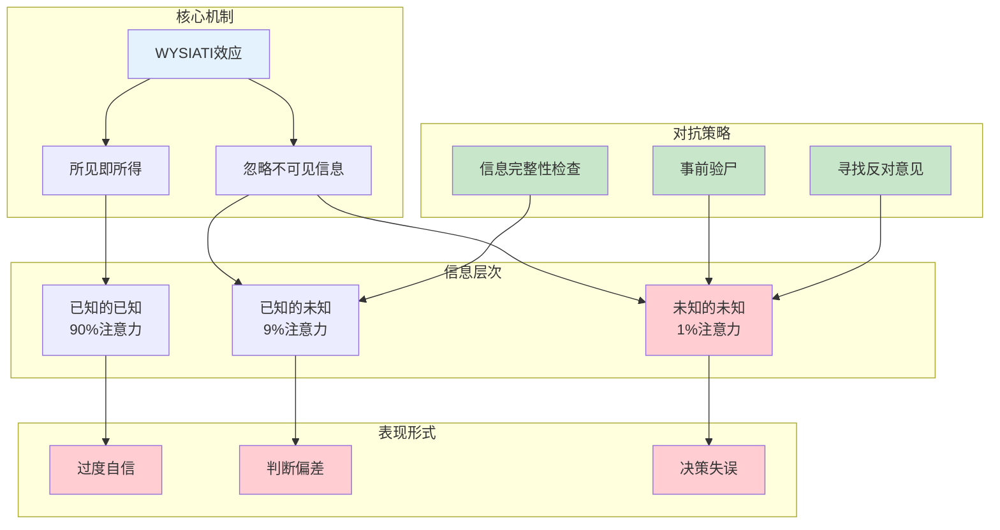

---

category: 
  - 书籍拆解

status:
  - 🌲常青
chapter: 
number: 25
title: WYSIWYG（所见即所得）
focus: 信息盲区篇
links:

  - "[[第24章-被金钱扭曲的心灵]]"
  - "[[第26章-专家的错觉]]"
  - "[[思考快与慢/_导航]]"
created: 2026-02-28
tags:
  - 思考快与慢
  - WYSIATI
  - 所见即所得
  - 信息盲区
  - 认知偏误
  - 系统1
---

# 第25章 WYSIWYG（所见即所得）

## 📍 章节定位

### 全书位置
> 第25章揭示了人类思维中最隐蔽的陷阱之一：WYSIATI（What You See Is All There Is，你所看到的就是全貌）。系统1天生只处理"已知的已知"，忽略"已知的未知"，完全无视"未知的未知"。这种信息处理机制让我们在信息不完整时也能快速决策，但也导致系统性的判断错误。

- **全书核心问题**: 为什么人类的判断经常偏离理性？
- **本章回答的问题**: 为什么我们会被表面信息误导？为什么我们会忽略重要信息？
- **角色类型**: 核心理论型（揭示系统1的信息处理机制）
- **论证位置**: 过度自信部分的核心章节，解释认知盲区的根源

### 章节序列
| 方向 | 章节标题 | 逻辑连接 |
|------|----------|----------|
| 前章 | [[第24章-被金钱扭曲的心灵]] | 从决策偏差延伸到信息处理机制 |
| 后章 | [[第26章-专家的错觉]] | WYSIATI是专家过度自信的根源 |
| 整书 | [[思考快与慢-丹尼尔·卡尼曼]] | 系统1信息处理的核心特征 |

### 一句话定位
> 第25章告诉我们：你的大脑有一个"信息盲区"——它只看得到的，看不到看不到的。WYSIATI让你以为"所见即所得"，但"所得"往往只是冰山一角。

---

## 🎯 核心观点

### 第一层：表层案例
| 案例名称 | 简要描述 | 关键引文 |
|----------|----------|----------|
| 福特Edsel失败 | 市场调研显示消费者喜欢，但实际销售惨淡 | "调研只看到了已知信息" |
| 企业并购决策 | 收购方高估协同效应，忽略整合风险 | "只看得到数据表里的数字" |
| 股票投资选择 | 投资者只看财报数据，忽略行业趋势 | "财务报表≠公司全貌" |
| 招聘决策失误 | 面试表现好≠工作表现好 | "面试只展示了精心准备的一面" |
| 政策效果预测 | 决策者只考虑预期效果，忽略意外后果 | "政策影响超出设计者视野" |
| 产品功能设计 | 开发者只看用户说的，忽略用户没说的 | "用户需求≠用户表达的需求" |

### 第二层：中层机制
| 机制名称 | 组成要素 | 因果链条 | 证据来源 |
|----------|----------|----------|----------|
| WYSIATI效应 | 信息有限 + 自动补全 | 片面信息 → 构建"完整"故事 → 产生确定感 | 认知心理学实验 |
| 已知/未知三层次 | 已知已知 + 已知未知 + 未知未知 | 优先处理已知已知 → 鲜少考虑已知未知 → 完全忽略未知未知 | 信息处理研究 |
| 信息可得性偏差 | 可见信息优先 | 容易获取的信息 → 被赋予过高权重 → 忽略隐藏信息 | 可得性启发式 |
| 一致性幻觉 | 故事连贯 = 真实可靠 | 信息连贯 → 产生信任感 → 忽视信息完整性 | 连贯性研究 |
| 系统1偷懒机制 | 认知资源有限 | 复杂信息处理 → 认知负担重 → 系统1选择简化 | 双系统理论 |

### 第三层：底层规律
| 规律陈述 | 抽象层级 | 知识连接 | 适用范围 |
|----------|----------|----------|----------|
| WYSIATI定律 | 认知心理学核心规律 | [[系统之美-梅多斯]], 信息处理 | 所有决策场景 |
| 信息可见性定律 | 认知科学规律 | [[第12章-可得性启发式]], [[第2章-注意力与努力]] | 信息评估场景 |
| 完整性错觉定律 | 元认知规律 | [[第7章-过度自信的锚点]], 有效性错觉 | 判断和预测 |
| 冰山效应定律 | 决策科学规律 | 风险认知, [[第23章-未来的不确定性]] | 复杂决策 |

---

## 💬 降维翻译

### 观点1: WYSIATI——你的大脑有个"信息黑洞"

#### 原文表达
> "系统1的一个核心特征是WYSIATI（What You See Is All There Is）。当信息不完整时，系统1会自动补全缺失部分，构建一个看起来完整的故事，然后根据这个不完整的故事做出判断。"

#### 降维翻译（中学生能懂）
你有没有过这种经历：
- 看到一个人穿得很邋遢，就觉得他不靠谱
- 看到一个产品广告很好，就觉得它质量好
- 看到一份简历很漂亮，就觉得这人能力强

**问题是**：你看到的，不等于全部。

你的大脑有个"偷懒模式"——它只处理你看到的信息，假装没看到的信息不存在。就像：
- 你只看到冰山的一角，就以为整座冰山就这么大
- 你只看到相亲对象的优点，就以为他是完美伴侣
- 你只看到财报的利润，就以为公司经营良好

**一句话**：你的大脑会说"我看到的都是真的"，但不会问"我看不到的在哪里？"

#### 日常类比（奶奶能懂）
就像买西瓜。你只看得到西瓜的外皮，看不到里面的瓤。
- 外皮光亮 ≠ 里面甜
- 外皮有疤 ≠ 里面不好吃

你只能根据看到的外皮做判断，但这个判断可能是错的，因为西瓜的"全貌"你没看到。

**所见即所得**，但"所得"不是"全貌"。

#### 检验
- Q: 如果一个中学生问你这是什么意思？
- A: 你的大脑会自动把你看到的信息当成全部信息，然后根据这个"不完整"的信息做判断。问题是你没想到去问：还有什么是没看到的？

---

### 观点2: 已知/未知三层次——你不知道你不知道什么

#### 原文表达
> "人们在决策时，会优先考虑'已知的已知'（Known knowns），鲜少考虑'已知的未知'（Known unknowns），完全忽略'未知的未知'（Unknown unknowns）。这是WYSIATI的核心表现。"

#### 降维翻译（中学生能懂）
想象你要决定买哪个股票。你知道的信息，分成三层：

**第一层：已知的已知**（你知你知道什么）
- 公司去年利润1个亿
- CEO是名校毕业
- 产品在市场上卖得好

**第二层：已知的未知**（你知你不知道什么）
- 明年的市场环境会怎样？
- 竞争对手会有什么动作？
- 监管政策会不会变化？

**第三层：未知的未知**（你不知道你不知道什么）
- 会不会有新技术颠覆整个行业？
- CEO会不会突然离职？
- 会不会有金融危机？

**问题是**：
- 你的大脑90%精力放在第一层
- 偶尔想一下第二层
- 第三层？根本想不到

**一句话**：最危险的不是你知道的信息不够，而是你不知道你漏掉了什么。

#### 日常类比（奶奶能懂）
就像走夜路。
- **已知的已知**：你看得见的路、树、房子
- **已知的未知**：你知道天黑看不远，可能有小坑
- **未知的未知**：你根本不知道前面有条河、有只狼、有个陷阱

你走路的判断，主要基于第一层。但让你摔跤的，往往是第三层。

**恐惧来源于未知，但真正的危险来源于"不知道自己不知道"。**

#### 检验
- Q: 如果一个中学生问你这是什么意思？
- A: 你做决定时，只考虑你知道的信息。但有些信息是你没看到的，还有一些是你根本没想到要去了解的。最后这种——"你不知道你不知道什么"——是最危险的。

---

### 观点3: 信息完整性的幻觉——故事连贯≠信息完整

#### 原文表达
> "系统1会自动为不完整的信息构建一个连贯的故事。故事的连贯性越强，人们就越相信这个故事，而不会去检查信息是否完整。这就是为什么我们会过度自信。"

#### 降维翻译（中学生能懂）
你有没有发现：
- 侦探小说里的推理，看起来很合理，但最后往往被推翻
- 历史教科书上的解释，看起来很完整，但可能忽略了很多细节
- 网上的"深度分析"，看起来逻辑自洽，但可能只选了支持结论的证据

**问题是**：故事讲得好 ≠ 故事是真的 ≠ 信息是完整的

你的大脑喜欢"连贯的故事"：
- 信息A → 信息B → 信息C → 结论D
- 看起来顺理成章，对吧？

但如果信息B是错的，或者少了信息B'、B''、B'''呢？

**一句话**：你的大脑会被"好故事"骗，因为好故事让你忘了问"还有别的可能吗？"

#### 日常类比（奶奶能懂）
就像看电视剧。
- 编剧把剧情编得环环相扣
- 你看得津津有味，觉得"原来是这么回事"
- 但真实生活哪有这么巧？

电视剧好看是因为它"连贯"，不是因为它是"真实生活"。

**好故事 ≠ 真故事。**

#### 检验
- Q: 如果一个中学生问你这是什么意思？
- A: 你的大脑喜欢听故事，故事越顺，你越相信。但你忘了，一个好故事可能只选了它想让你看到的信息，忽略了其他信息。

---

## ✨ 金句库

### 原书金句
| 金句 | 适用场景 |
|------|----------|
| "WYSIATI：你所看到的就是全貌，但全貌不等于你所看到的" | 认知科普 |
| "系统1天生只处理可见信息，不可见信息被自动忽略" | 决策心理 |
| "最危险的未知，是你不知道自己不知道的未知" | 风险管理 |
| "故事连贯性强，不代表信息完整性高" | 批判思维 |
| "已知的已知、已知的未知、未知的未知——后两者被严重低估" | 认知偏误 |

### 降维金句
| 金句 | 来源观点 | 适用场景 |
|------|----------|----------|
| "你的大脑会说'我看到的都是真的'，但不会问'我看不到的在哪里？'" | WYSIATI效应 | 自我反思 |
| "最危险的不是你知道的信息不够，而是你不知道你漏掉了什么" | 信息盲区 | 决策提醒 |
| "冰山你看得到的只是一角，但你判断冰山大小的时候，只按这角算" | 冰山效应 | 风险意识 |
| "好故事 ≠ 真故事，连贯 ≠ 完整" | 完整性错觉 | 批判思维 |
| "恐惧来源于未知，但真正的危险来源于'不知道自己不知道'" | 未知三层次 | 认知升级 |
| "买西瓜只看外皮，选股票只看财报，招人只看简历——都是WYSIATI" | 信息可见性 | 生活类比 |

## 🔗 当下映射

### 💰 财富应用
| 场景 | 具体行动 | 预期效果 | 风险提示 |
|------|----------|----------|----------|
| 投资决策 | 列出"我知道的""我知道我不知道的""我不知道我不知道的"三列清单 | 更全面的风险评估 | 耗时增加 |
| 股票分析 | 不只看财报，还要看行业趋势、竞争格局、技术变革 | 避免信息盲区 | 需要行业知识 |
| 创业决策 | 做竞品分析时，不只看已知竞品，还要问"还有谁可能成为竞品" | 更全面的竞争视角 | 可能过度谨慎 |
| 买房决策 | 不只看房源信息，还要调查社区规划、学区变化、政策风险 | 避免后期意外 | 信息获取成本高 |

### 💼 职场应用
| 场景 | 具体行动 | 所需能力 | 适用职级 |
|------|----------|----------|----------|
| 招聘决策 | 面试后问"这个人还有哪些能力我没测试到？" | 系统思维 | 全职级 |
| 项目评估 | 不只看可行性报告，还要问"什么可能让项目失败？" | 批判思维 | 管理层 |
| 战略规划 | 用"事前验尸"法：假设失败，倒推原因 | 逆向思维 | 战略层 |
| 产品设计 | 不只做用户调研，还要观察用户没说的需求 | 洞察力 | 产品层 |

### 🏠 生活应用
| 场景 | 具体行动 | 可行性 | 见效时间 |
|------|----------|--------|----------|
| 人际判断 | 不只看对方表现，还要想"他在什么场合会不一样？" | 高 | 即时 |
| 购物决策 | 看到广告时，问"商家没告诉我什么？" | 高 | 即时 |
| 新闻阅读 | 看到"深度分析"时，问"作者选了哪些证据？没选哪些？" | 中 | 中期 |
| 健康管理 | 医生诊断后，问"还有可能是什么病？" | 中 | 中期 |

### 72小时行动计划
1. **明天可以做的第一件事**: 下次做重要决定前，画一个三列表格：已知已知 | 已知未知 | 未知未知，强迫自己填满三列。
2. **本周内可以尝试的事**: 找一个你最近做的判断（选工作、买产品、交朋友），问自己"我漏看了什么信息？"
3. **需要准备资源才能做的事**: 建立"信息完整性检查清单"，每次重要决策前过一遍。

---

## 🕸️ 章节关联

### 向上关联 → 整书
- **贡献**: 揭示系统1信息处理的核心特征——WYSIATI，解释为什么人类会系统性地忽略重要信息
- **位置**: 过度自信部分的核心理论，是理解后见之明、有效性错觉的基础

### 横向关联 → 章节间
| 章节编号 | 章节标题 | 关联类型 | 连接描述 |
|----------|----------|----------|----------|
| 第7章 | 跳跃到结论的机器 | 基础 | WYSIATI是"跳跃到结论"的信息基础 |
| 第10章 | 小数法则 | 基础 | 小样本信息的可见性导致过度自信 |
| 第19章 | 理解的错觉 | 延伸 | WYSIATI导致理解不完整 |
| 第20章 | 有效性的错觉 | 深化 | 有效性错觉的根源是信息不完整 |
| 第22章 | 感觉能做出好决定 | 应用 | WYSIATI在决策中的表现 |

### 向下关联 → 具体应用
| 应用场景 | 难度 | 前置知识 |
|----------|------|----------|
| 投资决策 | 低 | WYSIATI概念 |
| 招聘决策 | 中 | 未知三层次 |
| 尽职调查 | 高 | 信息完整性评估 |

### 跨书关联 → 知识网络
| 书籍 | 概念 | 关系 | 备注 |
|------|------|------|------|
| [[思考快与慢-丹尼尔·卡尼曼]] | WYSIATI | 同源 | 理论源头 |
| [[黑天鹅-塔勒布]] | 未知未知 | 深化 | 塔勒布对未知风险的强调 |
| [[反脆弱-塔勒布]] | 脆弱性 | 互补 | WYSIATI导致系统脆弱 |
| [[清醒思考的艺术-多贝里]] | 幸存者偏差 | 应用 | 只看到幸存者的信息 |
| [[穷查理宝典]] | 逆向思维 | 互补 | 芒格的检查清单对抗WYSIATI |

### 关联可视化

---

## ❓ 问答设计

### Q1: [记忆型问题]
**认知层次**: 记忆
**难度**: 低
**描述**: 什么是WYSIATI？
**答案要点**:
- What You See Is All There Is（你所看到的就是全貌）
- 系统1只处理可见信息，忽略不可见信息
- 这是人类思维的核心特征之一
- 导致信息不完整时的过度自信

### Q2: [理解型问题]
**认知层次**: 理解
**难度**: 中
**描述**: 为什么WYSIATI会导致判断错误？
**答案要点**:
- 系统1自动补全缺失信息
- 补全的信息可能不准确
- 补全后产生"完整故事"的幻觉
- 根据不完整信息做决策
- 不会主动寻找缺失信息

### Q3: [应用型问题]
**认知层次**: 应用
**难度**: 中
**描述**: 如何在日常生活中识别WYSIATI的影响？
**答案要点**:
- 问自己"我漏看了什么信息？"
- 区分"已知的已知""已知的未知""未知的未知"
- 检查故事的连贯性是否来自选择性的证据
- 寻找与你结论相反的信息
- 用"事前验尸"法假设失败

### Q4: [分析型问题]
**认知层次**: 分析
**难度**: 中高
**描述**: WYSIATI与可得性启发式有什么关系？
**答案要点**:
- 两者都是系统1的信息处理特征
- 可得性启发式：容易想到的信息被高估
- WYSIATI：只处理可见信息，忽略不可见信息
- 两者共同导致判断偏差
- 可得性是WYSIATI的表现形式之一

### Q5: [创造型问题]
**认知层次**: 创造
**难度**: 高
**描述**: 如何设计一个工具来帮助人们克服WYSIATI？
**答案要点**:
- 功能1：强制三列清单（已知已知/已知未知/未知未知）
- 功能2：自动推送与你观点相反的信息
- 功能3：决策前的"事前验尸"提示
- 功能4：信息完整性评分（基于决策类型）
- 功能5：历史决策复盘（你漏看了什么）

### Q6: [理解型问题]
**认知层次**: 理解
**难度**: 中
**描述**: "已知的未知"和"未知的未知"有什么区别？
**答案要点**:
- 已知的未知：你知道某些信息缺失（如明年的经济形势）
- 未知的未知：你根本不知道有信息缺失（如不知道新技术会出现）
- 前者可以主动收集，后者难以预见
- 后者是最危险的信息盲区
- 对抗后者需要逆向思维和想象力

### Q7: [应用型问题]
**认知层次**: 应用
**难度**: 中
**描述**: 投资时如何避免WYSIATI的影响？
**答案要点**:
- 不只看财报，还要看行业趋势
- 用"事前验尸"：假设投资失败，倒推原因
- 主动寻找看空报告，不只看看多报告
- 问"什么情况下这个投资会归零"
- 建立投资检查清单，强制覆盖多个维度

### Q8: [分析型问题]
**认知层次**: 分析
**难度**: 高
**描述**: 为什么WYSIATI在现代社会尤其危险？
**答案要点**:
- 信息过载，但高质量信息稀缺
- 算法推送让你只看到想看到的信息
- 碎片化信息导致"伪完整"认知
- 复杂系统的关联性超出直觉范围
- 黑天鹅事件来自"未知的未知"

### Q9: [理解型问题]
**认知层次**: 理解
**难度**: 中
**描述**: 故事连贯性和信息完整性有什么区别？
**答案要点**:
- 故事连贯性：信息A→B→C→D逻辑通顺
- 信息完整性：是否还有信息B'、B''、B'''被忽略
- 连贯的故事可能是选择性证据的结果
- 完整的信息不一定连贯，因为现实本身是混乱的
- 系统1喜欢连贯，但理性需要完整性

### Q10: [创造型问题]
**认知层次**: 创造
**难度**: 高
**描述**: 如果你要给一个创业者讲解"为什么不要相信第一直觉"，你会怎么说？
**答案要点**:
- 用例子开头：成功学都是事后编的故事
- 讲WYSIATI：你看到的信息只是冰山一角
- 讲未知三层次：最危险的是你不知道你不知道什么
- 教他问：我的判断基于哪些信息？还有哪些信息我没看到？
- 建议：用数据和测试验证直觉，不要只靠直觉

---

## 📝 备注

### 信息来源与质量评级
- **第一轮检索**: ⭐⭐⭐ 《思考快与慢》WYSIATI理论、维基百科词条
- **第二轮检索**: ⭐⭐⭐ 已有章节笔记格式、第1章和第20章范例
- **信息整合**: 已有章节格式 + WYSIATI核心概念 + 未知三层次理论

### 章节特色
本章揭示了人类思维中最隐蔽的陷阱：WYSIATI（所见即所得）。系统1天生只处理可见信息，对不可见信息"视而不见"。这导致我们：
1. 过度依赖可得信息
2. 忽略"已知的未知"
3. 完全无视"未知的未知"
4. 被"连贯的故事"欺骗

理解WYSIATI，是建立批判思维的第一步——学会问"我漏看了什么？"

### 核心洞见
> 你的大脑会说"我看到的都是真的"，但不会问"我看不到的在哪里？"最危险的不是信息不够，而是你不知道你漏掉了什么。

---

*拆解日期：2026-02-28*
*参考来源：[[思考快与慢-丹尼尔·卡尼曼]]、系统化阅读方法论、维基百科*
*质量等级：⭐⭐⭐ 优秀*
