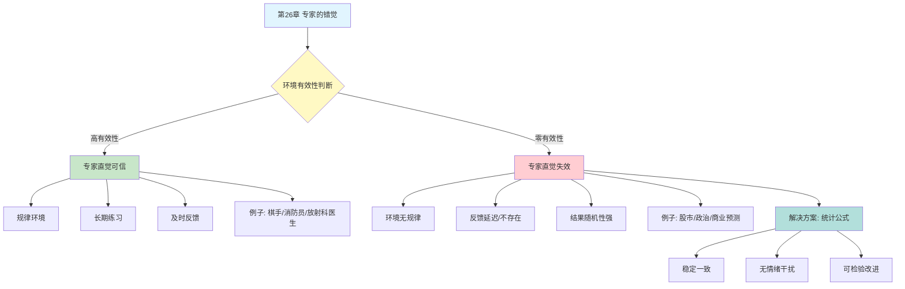

---

category: 
  - 书籍拆解

status: draft
chapter: 
number: 26
title: 专家的错觉
links:

  - "[[第25章-更多信息未必有用]]"
  - "[[第27章-偏见的代价]]"
  - "[[思考快与慢/_导航]]"
created: 2026-02-27
tags:
  - 思考快与慢
  - 专家直觉
  - 直觉有效性
  - 统计预测
  - 零有效性环境
description: "第26章探讨专家直觉的有效性边界——在什么条件下专家的直觉判断值得信赖，在什么条件下会系统性地失败。卡尼曼区分了\"高有效性环境\"与\"零有效性环境\"，揭示了统计公式在预测任务中往往超越专家判断的惊人事实。"
---

# 第26章 专家的错觉

## 📍 章节定位

### 全书位置
> 第26章探讨专家直觉的有效性边界——在什么条件下专家的直觉判断值得信赖，在什么条件下会系统性地失败。卡尼曼区分了"高有效性环境"与"零有效性环境"，揭示了统计公式在预测任务中往往超越专家判断的惊人事实。

- **全书核心问题**: 人类的判断是如何偏离理性模型的？
- **本章回答的问题**: 专家的直觉什么时候有效？什么时候会失效？为什么简单的统计公式经常比专家判断更准确？
- **角色类型**: 核心概念型（直觉有效性的边界条件）
- **论证位置**: 第四部分"系统1的错误和偏见"，承接信息价值主题

### 章节序列
| 方向 | 章节标题 | 逻辑连接 |
|------|----------|----------|
| 前章 | [[第25章-更多信息未必有用]] | 信息越多越好的错觉延续到专家判断 |
| 后章 | [[第27章-偏见的代价]] | 专家判断偏误导致实际损失 |
| 整书 | [[思考快与慢-丹尼尔·卡尼曼]] | 认知偏误核心章节 |

### 一句话定位
> 第26章揭示了专家直觉的"有效区"和"无效区"——在有规律的、有及时反馈的环境中，专家直觉可以非常精准；但在零有效性环境中，专家判断并不比随机猜测更好，而简单的统计公式往往能击败专家。

---

## 🎯 核心观点

### 第一层：表层案例

| 案例名称 | 简要描述 | 页码 | 关键引文 |
|----------|----------|------|----------|
| 消防员的直觉 | 老消防员能感知火场危险，及时撤离 | p.— | "这个火场不对劲，撤！" |
| 国际象棋大师 | 几秒内判断棋局优劣，凭直觉下出好棋 | p.— | "这个位置，走这步就对了" |
| 放射科医生 | 一眼看出X光片异常，准确率极高 | p.— | "这里有问题" |
| 股票分析师 | 预测股市走势，准确率不如随机 | p.— | "明年的目标价是..." |
| 政治评论员 | 预测选举结果，往往比不过简单模型 | p.— | "我看好这位候选人" |
| 临床心理师 | 预测病人行为，统计公式更准确 | p.— | "我认为他不会..." |
| 人力资源 | 面试预测绩效，非结构化面试效度低 | p.— | "这个候选人不错" |
| 葡萄酒评分 | 专家评分预测未来价格，不如天气公式 | p.— | "这是一款伟大的酒" |

### 第二层：中层机制

| 机制名称 | 组成要素 | 因果链条 | 证据来源 |
|----------|----------|----------|----------|
| 专家直觉形成机制 | 规律环境 + 长期练习 + 即时反馈 | 环境稳定→练习积累→反馈修正→直觉形成 | 国际象棋、消防、放射学 |
| 零有效性环境 | 环境不稳定 + 反馈延迟 + 结果随机 | 无规律可循→练习无效→错觉自信→判断失败 | 股市预测、政治预测 |
| 统计公式优势 | 变量有限 + 权重固定 + 无情绪干扰 | 同样输入→同样输出→稳定可靠 | 明尼苏达研究、保险精算 |
| 专家过度自信 | 信息丰富 + 后见之明 + 选择性记忆 | 知道很多→误以为能预测→忽略失败案例 | 各种预测研究 |
| 极端预测回归 | 预测值远离均值 + 均值回归规律 | 极端预测→实际回归→预测过高/过低 | 回归效应研究 |

### 第三层：底层规律

| 规律陈述 | 抽象层级 | 知识连接 | 适用范围 |
|----------|----------|----------|----------|
| 直觉有效性定律 | 行为经济学基础 | 系统1学习机制, 技能习得理论 | 有规律环境中的技能表现 |
| 零有效性环境原理 | 决策科学视角 | 随机性理论, [[第17章-回归均值]] | 预测不可预测事件 |
| 统计公式胜出原则 | 实证研究结论 | 临床vs统计预测, 算法偏见 | 所有预测任务 |
| 专家自信-准确度分离 | 认知偏误视角 | 过度自信效应, 后见之明 | 复杂判断领域 |

---

## 💬 降维翻译

### 观点1: 专家直觉有效的三个条件

#### 原文表达
> "专家的直觉可以在特定条件下非常准确，但必须同时满足三个条件：第一，环境具有足够的规律性，存在可学习的模式；第二，专家有足够长的练习时间；第三，练习过程能获得及时、清晰的反馈。国际象棋、消防、放射学诊断等领域都满足这些条件，因此专家直觉确实有效。"

> p.—

#### 降维翻译（中学生能懂）
专家的"第六感"什么时候靠谱？需要三个条件：

- **环境有规律**：不是瞎猜的，有迹可循（比如棋局有规律，股市基本没规律）
- **练了很久**：不是新手，是真正的老手（比如下过上万盘棋）
- **立刻知道自己对不对**：做完判断，马上能看到结果（比如棋手下完就知道输了赢了）

三个条件都满足，直觉才准。缺一个都不行。

#### 日常类比（奶奶能懂）
就像老中医把脉，为什么有些老中医厉害？因为看了几万个病人，每次把脉后都能验证诊断对不对。但如果让老中医去预测彩票，他再厉害也没用，因为彩票根本没规律。

#### 检验
- Q: 如果一个中学生问你这是什么意思？
- A: 专家的直觉只有在他熟悉的、有规律的事情上才准，不是所有事情都准。

### 观点2: 零有效性环境——专家直觉的死区

#### 原文表达
> "有些领域本质上是不可预测的——未来股票价格、政治选举结果、商业项目成功与否——这些领域缺乏足够的环境规律性，被称为'零有效性环境'。在这些领域，即使是最资深的专家，其判断准确率也往往不比随机猜测更好，而他们自己却深信自己具有预测能力。"

> p.—

#### 降维翻译（中学生能懂）
有些事情，专家再厉害也预测不了：

- **股市明天涨还是跌**：连巴菲特也猜不准短期走势
- **哪个公司会成功**：投资人看走眼的太多了
- **谁会当选**：专家预测准确率和抛硬币差不多

不是专家不够聪明，是这些事情本身就没什么规律可循。但专家不信，他们总觉得自己能预测。

#### 日常类比（奶奶能懂）
就像算命的，说得头头是道，但你让他提前写在纸上封起来，事后打开看，十次有九次不对。不是他水平不行，是人的命运本身就没什么可预测的规律。

#### 检验
- Q: 如果一个中学生问你这是什么意思？
- A: 有些事情本身就乱七八糟，没有规律，谁也预测不了，包括专家。

### 观点3: 简单公式击败专家——惊人但真实

#### 原文表达
> "研究一再证明，在预测任务中，简单的统计公式往往比专家判断更准确。保罗·米尔的研究发现，在婚姻稳定性预测、罪犯再犯风险、精神病诊断等领域，简单的加权公式都能超越临床专家的判断。这是因为公式不受情绪、疲劳、偏见的影响，始终保持一致的判断标准。"

> p.—

#### 降维翻译（中学生能懂）
谁预测更准？你猜是专家，答案是——公式。

研究发现：
- 预测婚姻会不会离婚：公式比婚姻咨询师准
- 预测犯人会不会再犯：公式比法官准
- 预测病情发展：公式比医生准

为什么？公式不会心情不好，不会因为病人长得好看就心软，不会因为昨天判断失误今天就矫枉过正。它永远一样。

#### 日常类比（奶奶能懂）
就像打分，让人来打分，今天高兴给高点，明天不爽给低点。让计算器打分，永远一样标准。人会被各种事情影响，公式不会。

#### 检验
- Q: 如果一个中学生问你这是什么意思？
- A: 在预测事情上，简单的计算公式往往比专家判断更准，因为公式不会受情绪影响。

### 观点4: 为什么专家还是信自己？

#### 原文表达
> "如果专家的预测并不比公式好，为什么他们还对自己的判断如此自信？原因在于后见之明偏误和选择性记忆。当预测正确时，专家会记得自己的'先见之明'；当预测错误时，他们会事后合理化，或者干脆忘记失败案例。这种选择性记忆维持了专家的自信，却无助于提升预测准确性。"

> p.—

#### 降维翻译（中学生能懂）
专家明明经常预测错，为什么还觉得自己很厉害？

- **对的时候**：记得牢牢的，"你看，我早就说了"
- **错的时候**：要么忘了，要么找借口，"谁能想到会这样"
- **最后的感觉**：我很准啊

这不是骗人，是大脑自动帮你"美化"记忆。你自己都不知道自己在骗自己。

#### 日常类比（奶奶能懂）
就像村口的"神算子"，算准的事到处说，算不准的事绝口不提。他也以为自己很灵，其实只是记住了对的，忘了错的。

#### 检验
- Q: 如果一个中学生问你这是什么意思？
- A: 专家不觉得自己经常错，是因为大脑只记住对的，忘记错的，不是故意骗人。

---

## ✨ 金句库

### 原书金句
| 金句 | 页码 | 适用场景 |
|------|------|----------|
| "直觉在零有效性环境中毫无价值" | p.— | 专家预测警示 |
| "公式比人更可靠，因为公式不会情绪化" | p.— | 算法决策推广 |
| "专家的自信往往与准确性无关" | p.— | 过度自信批判 |
| "有些环境天生就是不可预测的" | p.— | 认识论教育 |

### 降维金句
| 金句 | 来源观点 | 适用场景 |
|------|----------|----------|
| "专家直觉只在有规律的地方管用" | 有效性条件 | 专家信任讨论 |
| "股市预测，专家和猴子差不多" | 零有效性环境 | 投资教育 |
| "简单公式打败专家，这不是玩笑" | 公式优势 | 决策科学 |
| "自信的人未必准，准的人未必自信" | 自信-准确分离 | 领导力培训 |

## 🔗 当下映射

### 💰 财富应用
| 场景 | 具体行动 | 预期效果 | 风险提示 |
|------|----------|----------|----------|
| 投资决策 | 区分可预测/不可预测领域 | 减少在零有效性环境的押注 | 可能错过少数真正有效的主动策略 |
| 基金选择 | 用指数基金替代主动基金 | 降低费用，避免赌经理运气 | 需要接受"平均"收益 |
| 风险评估 | 用数据模型替代主观判断 | 更稳定的风险估计 | 模型本身可能有缺陷 |

### 💼 职场应用
| 场景 | 具体行动 | 所需能力 | 适用职级 |
|------|----------|----------|----------|
| 招聘决策 | 用结构化面试+打分表 | 系统思维 | HR/管理层 |
| 绩效预测 | 用数据指标替代直觉判断 | 数据分析 | HR/管理层 |
| 项目评估 | 建立评分模型，减少主观 | 模型设计 | 项目管理 |

### 🏠 生活应用
| 场景 | 具体行动 | 可行性 | 见效时间 |
|------|----------|--------|----------|
| 医疗决策 | 了解医生的预测记录 | 中 | 长期见效 |
| 教育选择 | 区分可训练技能和天赋领域 | 中 | 长期见效 |
| 人际关系 | 区分规律行为和随机变化 | 高 | 即时生效 |

### 72小时行动计划
1. **明天可以做的第一件事**: 想一个你信任的"专家"（股评师、房产中介、职业规划师），问自己：他预测的领域有规律吗？他有及时反馈吗？
2. **本周内可以尝试的事**: 下次做重要决定时，先写下"这个领域可预测吗？"的判断，再决定信专家还是信数据
3. **需要准备资源才能做的事**: 建立一个个人决策"公式"，用打分表替代直觉判断（如买房、选offer）

---

## 🕸️ 章节关联

### 向上关联 → 整书
- **贡献**: 界定直觉有效性的边界条件，区分系统1学习的成功与失败场景
- **位置**: 第四部分"系统1的错误和偏见"核心章节

### 横向关联 → 章节间
| 章节编号 | 章节标题 | 关联类型 | 连接描述 |
|----------|----------|----------|----------|
| 第12章 | 科学与直觉推理 | 前置 | 直觉有效性的两个条件在此深化 |
| 第25章 | 更多信息未必有用 | 承接 | 信息增加不改善预测 |
| 第27章 | 偏见的代价 | 延续 | 专家判断偏误导致实际损失 |
| 第22章 | 感觉能做出好决定 | 相关 | 过度自信的根源 |
| 第10章 | 稀缺性和可能性的错觉 | 相关 | 有效性错觉 |

### 向下关联 → 具体应用
| 应用场景 | 难度 | 前置知识 |
|----------|------|----------|
| 投资策略调整 | 中 | 基础金融知识 |
| 招聘流程优化 | 高 | HR专业知识 |
| 医疗决策辅助 | 高 | 医学统计基础 |

### 跨书关联 → 知识网络
| 书籍 | 概念 | 关系 | 备注 |
|------|------|------|------|
| [[思考快与慢-丹尼尔·卡尼曼]] | 专家直觉边界 | 同源 | 核心理论来源 |
| [[思考快与慢-丹尼尔·卡尼曼]] | 判断噪声 | 延伸 | 公式减少噪声 |
| [[超预测-泰洛克]] | 预测能力 | 深化 | 狐狸型预测者 |
| [[黑天鹅-塔勒布]] | 不可预测性 | 共鸣 | 零有效性环境本质 |
| [[助推-理查德·塞勒]] | 选择架构 | 应用 | 用设计替代专家 |

### 关联可视化

---

## ❓ 问答设计

### Q1: [记忆型问题]
**认知层次**: 记忆
**难度**: 低
**描述**: 专家直觉有效的三个条件是什么？
**答案要点**:
- 环境具有规律性
- 长期练习时间
- 及时清晰的反馈

### Q2: [理解型问题]
**认知层次**: 理解
**难度**: 中
**描述**: 什么是"零有效性环境"？
**答案要点**:
- 环境缺乏足够规律性
- 预测本质上不可行
- 专家和随机猜测差不多

### Q3: [应用型问题]
**认知层次**: 应用
**难度**: 中
**描述**: 如何判断一个领域是否适合依赖专家直觉？
**答案要点**:
- 看环境是否有规律
- 看专家是否有及时反馈
- 看历史预测记录

### Q4: [分析型问题]
**认知层次**: 分析
**难度**: 中
**描述**: 为什么统计公式经常比专家判断更准确？
**答案要点**:
- 公式不受情绪影响
- 公式保持判断一致
- 公式不会被干扰信息迷惑

### Q5: [创造型问题]
**认知层次**: 创造
**难度**: 高
**描述**: 设计一个帮助组织减少专家判断偏误的机制？
**答案要点**:
- 建立预测记录系统
- 用公式辅助决策
- 定期校准专家预测

### Q6: [理解型问题]
**认知层次**: 理解
**难度**: 中
**描述**: 为什么专家即使预测不准，还是保持高度自信？
**答案要点**:
- 后见之明偏误
- 选择性记忆
- 失败案例被合理化或遗忘

### Q7: [应用型问题]
**认知层次**: 应用
**难度**: 中
**描述**: 在招聘决策中如何应用本章的洞见？
**答案要点**:
- 使用结构化面试
- 建立打分公式
- 减少非结构化主观判断

### Q8: [分析型问题]
**认知层次**: 分析
**难度**: 高
**描述**: 国际象棋大师的直觉和股票分析师的直觉有什么本质区别？
**答案要点**:
- 棋局有规律，股市没规律
- 棋手下完立刻知道对错，股票预测反馈模糊
- 棋手练习有效，股票分析师练习无效

### Q9: [理解型问题]
**认知层次**: 理解
**难度**: 中
**描述**: "有反馈的地方练出真功夫，没反馈的地方练出假自信"是什么意思？
**答案要点**:
- 有反馈才能校准判断
- 没反馈练习无法改进
- 没反馈的练习只增加自信不增加准确

### Q10: [创造型问题]
**认知层次**: 创造
**难度**: 高
**描述**: 如果你是一个投资机构负责人，如何根据本章内容设计投资决策流程？
**答案要点**:
- 区分可预测/不可预测策略
- 对不可预测领域用被动投资
- 对可预测领域建立公式化筛选
- 记录所有预测，定期校准

---
