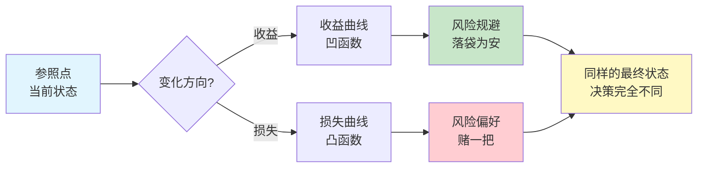
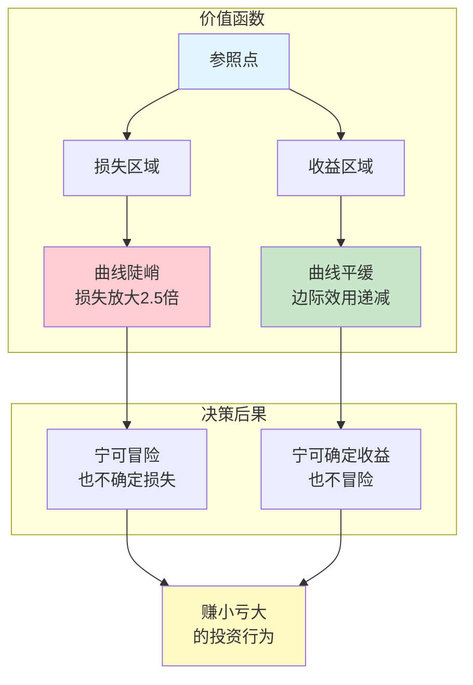
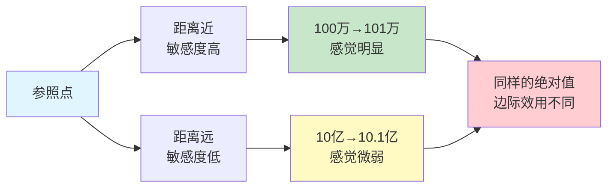
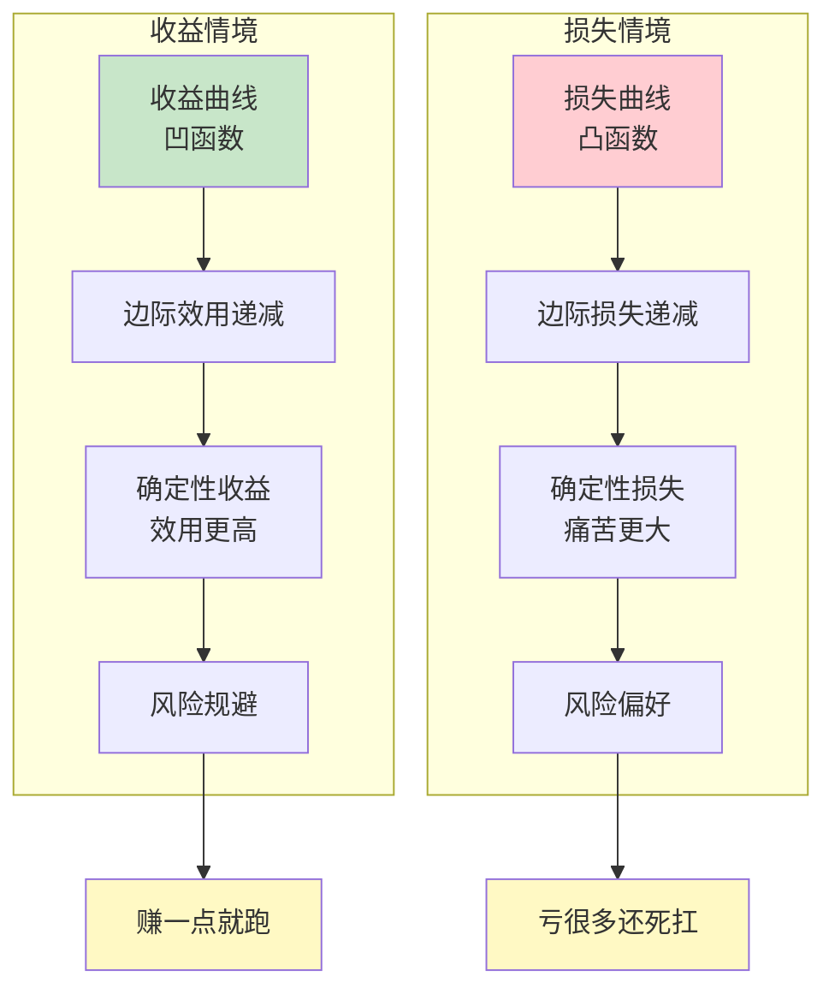
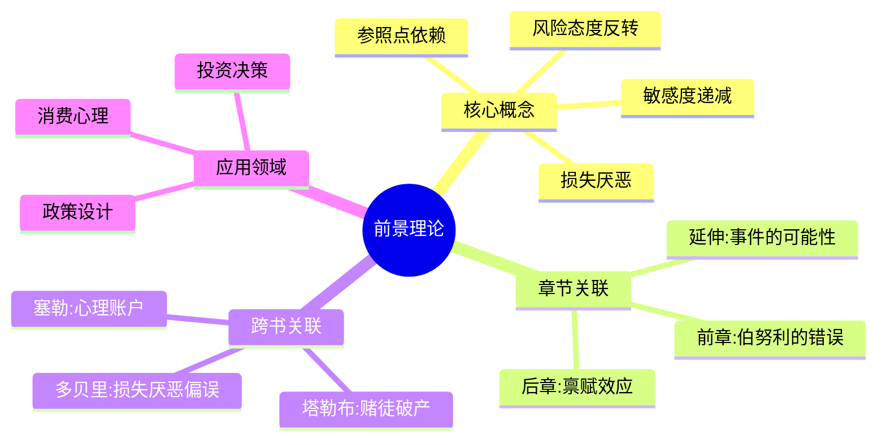

---

category: 
  - 书籍拆解

status: 
  - 🌲常青
chapter: 
number: 26
title: 前景理论
links:

  - "[[第27章-禀赋效应]]"
  - "[[第1章-哈吉斯]]"
created: 2026-02-28
tags:
  - 前景理论
  - 损失厌恶
  - 决策心理学
  - 诺贝尔奖理论
keywords: ["前景理论", "损失厌恶", "参照点", "框架效应", "风险态度"]
description: "第26章是全书核心章节之一，系统阐述前景理论（Prospect Theory）——卡尼曼获得2002年诺贝尔经济学奖的理论基础。本章揭示了人类决策的非理性本质，颠覆了传统经济学的\"理性人\"假设。"
---

# 第26章 前景理论

## 📍 章节定位

### 全书位置
> 第26章是全书核心章节之一，系统阐述前景理论（Prospect Theory）——卡尼曼获得2002年诺贝尔经济学奖的理论基础。本章揭示了人类决策的非理性本质，颠覆了传统经济学的"理性人"假设。

- **全书核心问题**: 人类如何在不确定条件下做决策？
- **本章回答的问题**: 为什么我们的决策偏离理性？价值是如何被感知的？
- **角色类型**: 理论核心型，诺贝尔奖获奖理论的完整阐述
- **论证位置**: 从伯努利效用理论的缺陷出发，建立全新的决策模型

### 章节序列

| 方向 | 章节标题 | 逻辑连接 |
|------|----------|----------|
| 前章 | [[第1章-哈吉斯]] | 批判传统效用理论 |
| 后章 | [[第27章-禀赋效应]] | 前景理论的具体应用 |
| 延伸 | [[第1章-哈吉斯]] | 概率权重的深入探讨 |

### 一句话定位
> 第26章通过前景理论揭示人类决策的三大反常：参照点依赖、损失厌恶、敏感度递减，颠覆了250年的理性人假设，为行为经济学奠定理论基石。

---

## 🎯 核心观点

### 观点1：参照点依赖——价值是相对的

#### 【表层】现象层

**经典实验**：
- 问题：你现在的财富是X，有两种选择
  - A. 50%概率变成2X，50%概率保持X
  - B. 100%变成1.5X
- 大多数人选B（确定性收益）

**反转实验**：
- 问题：你现在的财富是2X，有两种选择
  - A. 50%概率变成X，50%概率保持2X
  - B. 100%变成1.5X
- 大多数人选A（冒险避免确定性损失）

**关键发现**：
- 两个问题最终状态完全相同（50%→2X，50%→X）
- 但选择完全相反
- 说明：决策取决于参照点，不是最终状态

#### 【中层】机制层

**参照点依赖的心理机制**：

**核心机制**：
1. 价值是相对于参照点定义的
2. 参照点通常是当前状态
3. 改变参照点，决策随之改变
4. 这是框架效应的根源

#### 【底层】规律层

> **参照点定律**：人类对价值的感知不是绝对的，而是相对于参照点的。同一个客观结果，从不同的参照点看，会做出完全不同的决策。

**降维翻译**：
> 你觉得100块是多是少，取决于你口袋里有多少钱。
> 穷人觉得100块很多，富人觉得100块很少。
> 不是钱变了，是参照点变了。

#### 【当下连接】

|----------|----------|----------|
| 为什么打折那么香？ | 原价成了参照点，打折感觉赚了 | "原来是锚在作怪" |
| 为什么涨工资开心不了一周？ | 新工资成了参照点，又想涨 | "参照点一直在动" |
| 为什么分手后总想回头？ | 恋爱状态成了参照点，单身感觉失去 | "失去比得不到更痛苦" |

---

### 观点2：损失厌恶——失去比得到更痛

#### 【表层】现象层

**损失厌恶实验**：
- 问题：抛硬币，正面赢150元，反面输100元，你玩吗？
- 大多数人：不玩
- 即使把赢提高到200元，很多人还是不玩

**关键数据**：
- 损失的痛苦 ≈ 2-2.5倍收益的快乐
- 这就是为什么大多数人不愿意玩"公平"的赌局
- 只有当收益是损失的2.5倍以上，人们才愿意冒险

**真实案例**：
- 投资者卖出赚钱股票的概率，远高于卖出亏损股票
- 这就是为什么"赚小亏大"是投资常态

#### 【中层】机制层

**损失厌恶的价值函数**：

**核心机制**：
1. 价值函数呈S形
2. 损失区域斜率约是收益区域的2.5倍
3. 这是进化形成的生存机制
4. 在原始社会，损失的代价可能是死亡

#### 【底层】规律层

> **损失厌恶定律**：损失带来的心理痛苦约是等量收益带来的快乐的2-2.5倍。这导致人们在收益时风险规避，在损失时风险偏好，产生系统性的非理性决策。

**降维翻译**：
> 赚100块的快乐，抵不上亏100块的痛苦。
> 所以你赚一点就跑（怕亏回去），
> 亏了很多还死扛（不愿承认损失）。
> 这不是心态问题，是人性出厂设置。

#### 【当下连接】

|----------|----------|----------|
| 为什么止损这么难？ | 承认损失太痛苦，宁愿赌一把 | "原来这是人性bug" |
| 为什么免费试用有效？ | 拿到了就不想失去（禀赋效应） | "免费的最贵" |
| 为什么保险卖得好？ | 损失厌恶让人愿意为确定性付费 | "买个心安" |

---

### 观点3：敏感度递减——边际效应递减

#### 【表层】现象层

**敏感度递减实验**：
- 从100万到101万，你会很高兴
- 从10亿到10亿零1万，你几乎没感觉
- 同样是1万，边际价值完全不同

**日常案例**：
- 第一口冰淇淋很爽，第十口就腻了
- 工资从5000涨到8000很激动，从10万涨到10.3万没感觉
- 买了一套房很兴奋，买第二套房就平淡了

#### 【中层】机制层

**敏感度递减的心理机制**：

**核心机制**：
1. 价值函数在收益和损失方向都呈递减趋势
2. 离参照点越近，敏感度越高
3. 离参照点越远，敏感度越低
4. 这是韦伯-费希纳定律的心理学表现

#### 【底层】规律层

> **敏感度递减定律**：价值变化的感知敏感度与参照点的距离成反比。同样的客观变化，离参照点越近感知越强，越远感知越弱。

**降维翻译**：
> 饿的时候一口饭很香，饱的时候一桌菜没感觉。
> 穷的时候100块很多，富的时候1000块没感觉。
> 不是钱变了，是你的敏感度变了。

---

### 观点4：风险态度反转——收益规避，损失偏好

#### 【表层】现象层

**风险态度实验**：

**场景1（收益）**：
- 你有1000元，选择：
  - A. 50%概率再得1000元
  - B. 100%再得500元
- 大多数人选B（风险规避）

**场景2（损失）**：
- 你有2000元，选择：
  - C. 50%概率损失1000元
  - D. 100%损失500元
- 大多数人选C（风险偏好）

**矛盾之处**：
- 两种场景的最终结果完全相同
- 但选择却完全相反
- 证明了传统效用理论的根本错误

#### 【中层】机制层

**风险态度反转机制**：

**核心机制**：
1. 收益曲线是凹的（边际效用递减）
2. 损失曲线是凸的（边际损失递减）
3. 曲线形状决定了风险态度
4. 这是"赚小亏大"行为模式的数学根源

#### 【底层】规律层

> **风险态度反转定律**：人们在收益情境下风险规避（偏好确定性），在损失情境下风险偏好（偏好冒险）。这种反转导致系统性的非理性决策。

**降维翻译**：
> 赚钱时你很怂，亏钱时你很勇。
> 赚一点就想跑，亏很多还敢赌。
> 结果就是：小赚大亏，越亏越多。
> 这是前景理论的数学证明。

---

## 💬 降维翻译汇总

### 前景理论四句话版

| 专业术语 | 降维表达 |
|----------|----------|
| 参照点依赖 | "你觉得贵不贵，看的是你口袋里有多少钱" |
| 损失厌恶 | "赚100的乐，抵不上亏100的痛" |
| 敏感度递减 | "第一口冰淇淋最甜，第十口就腻了" |
| 风险态度反转 | "赚钱时你很怂，亏钱时你很勇" |

## ✨ 金句库

### 原书金句

| 金句 | 页码 | 适用场景 |
|------|------|----------|
| "损失带来的痛苦，是等量收益带来的快乐的2-2.5倍" | p.284 | 投资心理学 |
| "人们在收益时风险规避，在损失时风险偏好" | p.286 | 决策分析 |
| "价值是相对于参照点定义的" | p.282 | 行为经济学 |
| "你拥有的，看起来更值钱" | p.290 | 禀赋效应 |
| "人们不是风险厌恶，而是损失厌恶" | p.284 | 风险管理 |

### 降维金句

| 金句 | 来源观点 | 适用场景 |
|------|----------|----------|
| 赚100的快乐，抵不上亏100的痛苦 | 损失厌恶 | 大众传播 |
| 你觉得贵不贵，看你口袋有多少钱 | 参照点依赖 | 消费心理 |
| 赚钱时你很怂，亏钱时你很勇 | 风险态度反转 | 投资警示 |
| 第一口最甜，第十口就腻了 | 敏感度递减 | 边际效用 |
| 同样的结果，换个说法，你就选反了 | 框架效应 | 沟通技巧 |

## 🔗 当下映射

### 💰 财富应用

| 场景 | 具体行动 | 预期效果 | 风险提示 |
|------|----------|----------|----------|
| 股票投资 | 预设止损点，写在纸上执行 | 避免损失厌恶导致的死扛 | 需要纪律执行 |
| 基金定投 | 机械执行，不看短期波动 | 避免情绪化决策 | 长期坚持是关键 |
| 房产决策 | 用"没有这套房会怎样"改变参照点 | 理性评估真实价值 | 市场环境变化 |
| 保险购买 | 用损失厌恶解释为什么买保险 | 理解保险的价值 | 不要过度保险 |

**投资决策检查清单**：
- [ ] 我现在的参照点是什么？
- [ ] 如果我没有持仓，现在会买入吗？（改变参照点）
- [ ] 我是在规避风险还是规避损失？
- [ ] 我设置的止损点是否写在纸上？

### 💼 职场应用

| 场景 | 具体行动 | 所需能力 | 适用职级 |
|------|----------|----------|----------|
| 薪资谈判 | 强调不给涨薪的损失（而非收益） | 框架设计 | 所有职场人 |
| 项目提案 | 描述不做的风险（激活损失厌恶） | 风险沟通 | 中层管理 |
| 团队激励 | 让团队"拥有"项目（激发禀赋效应） | 心理激励 | 团队领导 |
| 决策汇报 | 用收益框架而非损失框架呈现 | 沟通技巧 | 所有管理 |

**职场沟通技巧**：
- 不要说："做这个项目我们能赚100万"
- 要说："不做这个项目我们会失去100万的机会"
- 利用损失厌恶，让决策更容易通过

### 🏠 生活应用

| 场景 | 具体行动 | 可行性 | 见效时间 |
|------|----------|--------|----------|
| 健身习惯 | 把"每天要健身"改成"不健身会失去健康" | 高 | 即时 |
| 消费决策 | 问自己"如果没有这个东西，我会买吗" | 高 | 即时 |
| 恋爱关系 | 不要把对方的好当理所当然（防止参照点漂移） | 中 | 长期 |
| 断舍离 | 用"这些东西占了我多少空间"代替"这些东西值多少钱" | 高 | 1周见效 |

### 72小时行动计划

1. **今天**：回顾最近一次投资/消费决策，识别你的参照点是什么
2. **本周**：用"不做会失去什么"的框架，重新评估一个待决定的事项
3. **本月**：为你的投资账户设置机械化的止损规则，并写在纸上

---

## 🕸️ 章节关联

### 向上关联 → 整书

- **贡献**: 本章系统阐述前景理论，是卡尼曼获得诺贝尔奖的核心理论，为全书决策心理学提供理论基础
- **位置**: 从理论批判（伯努利错误）到理论构建（前景理论），是第二部分的高潮

### 横向关联 → 章节间

| 章节编号 | 章节标题 | 关联类型 | 连接描述 |
|----------|----------|----------|----------|
| 第25章 | [[第1章-哈吉斯]] | 前置 | 批判传统效用理论的缺陷 |
| 第27章 | [[第27章-禀赋效应]] | 应用 | 损失厌恶的具体表现 |
| 第28章 | [[第1章-哈吉斯]] | 延伸 | 概率权重的深入分析 |
| 第11章 | [[第11章-锚定效应]] | 呼应 | 锚点即参照点 |

### 跨书关联 → 知识网络

| 书籍 | 概念 | 关系 | 备注 |
|------|------|------|------|
| [[错误的行为-理查德·塞勒]] | 心理账户 | 应用 | 塞勒将前景理论应用于经济学 |
| [[助推-理查德·塞勒]] | 选择架构 | 应用 | 利用损失厌恶设计助推 |
| [[清醒思考的艺术-多贝里]] | 损失厌恶偏误 | 清单 | 多贝里的52偏误之一 |
| [[黑天鹅-塔勒布]] | 赌徒破产 | 延伸 | 风险偏好导致的归零风险 |

### 关联可视化

---

## ❓ 问答设计

### Q1: 什么是前景理论？(记忆型)
**认知层次**: 记忆
**难度**: 低
**答案要点**:
- 卡尼曼和特沃斯基提出的决策理论
- 核心观点：人类决策偏离传统经济学假设
- 四大核心：参照点依赖、损失厌恶、敏感度递减、风险态度反转

### Q2: 为什么损失厌恶会让人"赚小亏大"？(理解型)
**认知层次**: 理解
**难度**: 中
**答案要点**:
- 损失痛苦是收益快乐的2.5倍
- 收益时风险规避，赚一点就跑
- 损失时风险偏好，亏很多还赌
- 结果：小赚大亏，系统性错误

### Q3: 如何利用参照点依赖改善消费决策？(应用型)
**认知层次**: 应用
**难度**: 中
**答案要点**:
- 意识到当前参照点是什么
- 改变参照点："如果没有这个东西，我会买吗"
- 不被"原价"锚定，只看"现价"值不值
- 避免参照点漂移带来的不满足

### Q4: 前景理论如何颠覆传统经济学？(分析型)
**认知层次**: 分析
**难度**: 高
**答案要点**:
- 颠覆"理性人"假设
- 证明价值是相对的，不是绝对的
- 揭示风险态度会根据收益/损失情境反转
- 为行为经济学奠定理论基础

### Q5: 如何用前景理论设计更好的政策？(评价型)
**认知层次**: 评价
**难度**: 高
**答案要点**:
- 利用损失厌恶：强调不行动的代价
- 利用框架效应：改变政策表述方式
- 利用参照点：调整人们的心理基准
- 典型案例：器官捐献的默认选项设计

### Q6: 如果损失厌恶是人性，那投资还有可能理性吗？(创造型)
**认知层次**: 创造
**难度**: 高
**答案要点**:
- 承认人性bug，设计机械化系统
- 预设止损点，写在纸上执行
- 定期复盘，用数据对抗情绪
- 接受不完美，追求"足够好"而非"最优"

---

## 📊 理论对比表

### 前景理论 vs 期望效用理论

| 维度 | 期望效用理论 | 前景理论 |
|------|--------------|----------|
| 假设前提 | 人是理性的 | 人是有限理性的 |
| 价值基础 | 最终财富状态 | 相对于参照点的变化 |
| 损失处理 | 损失=负收益 | 损失≠收益的对称 |
| 风险态度 | 恒定（风险厌恶） | 情境依赖（收益规避，损失偏好） |
| 概率处理 | 线性加权 | 非线性加权 |
| 理论地位 | 传统经济学基石 | 行为经济学基石 |
| 诺贝尔奖 | 无 | 2002年经济学奖 |

---

## 🏆 理论意义

### 学术地位
- 2002年诺贝尔经济学奖获奖理论
- 颠覆了250年的"理性人"假设
- 行为经济学的理论基石
- 心理学与经济学的跨学科典范

### 实践价值
- 投资决策：解释"赚小亏大"的行为模式
- 营销策略：设计定价和促销策略
- 政策设计：设计更有效的公共政策
- 个人成长：认识自己的决策偏误

---

## 📚 延伸阅读

### 原始论文
- Kahneman, D., & Tversky, A. (1979). Prospect Theory: An Analysis of Decision under Risk. *Econometrica*, 47(2), 263-291.

### 相关书籍
- [[错误的行为-理查德·塞勒]] - 前景理论的经济学应用
- [[助推-理查德·塞勒]] - 基于前景理论的政策设计
- [[清醒思考的艺术-多贝里]] - 损失厌恶偏误的清单式总结

---

*拆解日期: 2026-02-28*
*拆解方法: 系统化阅读方法论 v2.0*
*核心公式: 前景理论 = 参照点依赖 + 损失厌恶 + 敏感度递减 + 风险态度反转*
