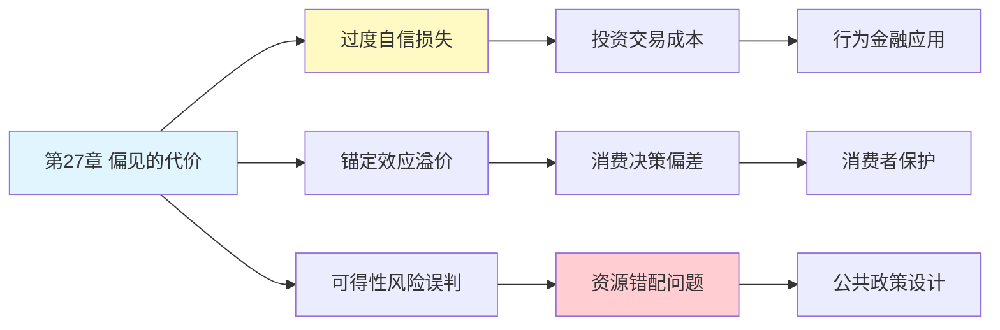

---

category: 
  - 书籍拆解

status: draft
chapter: 
number: 27
title: 偏见的代价
links:

  - "[[第26章-专家的错觉]]"
  - "[[第28章-公平偏好]]"
  - "[[思考快与慢/_导航]]"
created: 2026-02-27
tags:
  - 思考快与慢
  - 决策错误
  - 偏见代价
  - 理性边界
---

# 第27章 偏见的代价

## 📍 章节定位

### 全书位置
> 第27章探讨认知偏见在实际决策中造成的真实损失，揭示了系统性判断错误如何影响经济决策、医疗选择和公共政策，量化了非理性思维的"价格标签"。

- **全书核心问题**: 为什么人类的判断经常偏离理性？
- **本章回答的问题**: 认知偏见给我们带来了多大的实际损失？我们为非理性付出了什么代价？
- **角色类型**: 核心概念型（量化偏见的实际影响）
- **论证位置**: 从理论偏误转向实际损失，连接认知心理学与行为经济学

### 章节序列
| 方向 | 章节标题 | 逻辑连接 |
|------|----------|----------|
| 前章 | [[第26章-专家的错觉]] | 专家判断中的偏误延续到本章的实际代价 |
| 后章 | [[第28章-公平偏好]] | 从理性代价转向社会偏好与公平心理 |
| 整书 | [[思考快与慢-丹尼尔·卡尼曼]] | 展示认知偏见在现实世界的巨大影响 |

### 一句话定位
> 第27章揭示了认知偏见的"美元价格"——系统性判断错误在投资、医疗、司法等领域造成的巨额损失，证明非理性思维的代价远超我们的想象。

---

## 🎯 核心观点

### 第一层：表层案例

| 案例名称 | 简要描述 | 页码 | 关键引文 |
|----------|----------|------|----------|
| 股市过度交易 | 投资者因过度自信频繁交易，导致显著收益损失 | p.— | "交易越频繁，收益越低" |
| CEO并购决策 | 高管过度自信导致溢价收购，股东价值损失巨大 | p.— | "76%的并购未能创造价值" |
| 医疗过度诊断 | 医生因可得性偏误进行不必要检查，增加成本风险 | p.— | "防御性医疗代价高昂" |
| 司法判决偏差 | 法官决策受无关因素影响，导致判决不公 | p.— | "判决随午餐时间波动" |
| 房地产泡沫 | 集体过度乐观导致市场扭曲，最终崩盘 | p.— | "非理性繁荣的代价" |

### 第二层：中层机制

| 机制名称 | 组成要素 | 因果链条 | 证据来源 |
|----------|----------|----------|----------|
| 过度自信-交易陷阱 | 自信过高 + 信息幻觉 + 控制幻觉 | 过度自信→频繁交易→交易成本侵蚀收益 | 行为金融学研究 |
| 锚定-价格接受 | 初始锚点 + 调整不足 | 高锚点→价格接受度高→溢价支付 | 价格心理学实验 |
| 可得性-风险误判 | 媒体放大 + 情感唤醒 | 鲜活案例→风险高估→资源错配 | 风险感知研究 |
| 确证偏误-决策锁定 | 选择性搜索 + 解释偏向 | 初步判断→确认信息→路径依赖 | 决策科学实验 |

### 第三层：底层规律

| 规律陈述 | 抽象层级 | 知识连接 | 适用范围 |
|----------|----------|----------|----------|
| 偏见的成本外化原理 | 经济学视角 | [[外部性理论]], [[行为经济学]] | 所有涉及决策的经济领域 |
| 非理性的系统性特征 | 心理学基础 | [[认知偏误理论]], [[双系统理论]] | 人类决策行为 |
| 有限理性的边界效应 | 认知科学视角 | [[西蒙有限理性]], [[进化心理学]] | 复杂决策环境 |

---

## 💬 降维翻译

### 观点1: 偏见有价格标签

#### 原文表达
> "认知偏见不仅是实验室里的有趣现象，它们在现实世界中造成巨大的经济损失。过度自信让投资者每年损失数十亿美元，锚定效应让购房者多付数万美元，可得性偏误让社会在罕见风险上浪费大量资源。偏见是有价格的，而且这个价格比我们想象的要高得多。"

> p.—

#### 降维翻译（中学生能懂）
我们的思维习惯会让我们亏钱，而且亏很多：

- 觉得自己能跑赢股市 → 频繁买卖 → 亏给手续费和时机错误
- 看到别人出价 → 以此为参考 → 买东西多付钱
- 新闻总报道空难 → 害怕坐飞机 → 开车反而更危险

这不是小事。研究表明，过度交易让普通投资者每年少赚好几个百分点，长期下来差几十万。

#### 日常类比（奶奶能懂）
就像买东西不问价，别人说多少就给多少。你以为自己精明，其实每一笔都在多花钱。一年下来，这些"小亏"加起来能买辆车。

#### 检验
- Q: 如果一个中学生问你这是什么意思？
- A: 咱们的脑子有些习惯会让我们在做决定时吃亏，而且吃亏的金额比想象的大得多。

### 观点2: 知道偏见不等于能避免偏见

#### 原文表达
> "即使人们被告知认知偏见的存在，也难以有效避免。这不是无知的问题，而是思维系统结构的问题。系统1的快速判断在我们的进化历史中具有生存价值，但在现代社会中，这种快速判断可能导致系统性错误。认识到偏见的存在只是第一步，真正改变行为需要更系统的干预。"

> p.—

#### 降维翻译（中学生能懂）
知道有坑，还是会掉进去：

- 知道过度自信不好 → 还是觉得自己能行
- 知道广告在忽悠 → 还是会被影响
- 知道应该理性 → 情绪上来就忘了

这不是你不够聪明。是大脑的设计就是这样。第一反应（系统1）太快了，等你反应过来（系统2），已经做了决定。

#### 日常类比（奶奶能懂）
就像知道吃糖不好，但看到蛋糕还是想吃。脑子有两套系统：一套反应快，一套想得多。快的那套总先出手。

#### 检验
- Q: 如果一个中学生问你这是什么意思？
- A: 光知道人会犯错没用，因为犯错的原因在大脑的结构里，不是你知道就能改的。

---

## ✨ 金句库

### 原书金句
| 金句 | 页码 | 适用场景 |
|------|------|----------|
| "偏见是有价格的，而且这个价格很高" | p.— | 行为经济学科普 |
| "认识到偏见只是第一步" | p.— | 认知纠偏提醒 |
| "非理性的代价在复利作用下惊人" | p.— | 长期影响说明 |

### 降维金句
| 金句 | 来源观点 | 适用场景 |
|------|----------|----------|
| "每一个思维陷阱都有价格标签" | 偏见成本化 | 财务教育 |
| "知道不等于做到，懂了还会掉坑" | 认识vs改变差距 | 自我提升 |
| "小偏见的复利是大损失" | 长期累积效应 | 投资教育 |

## 🔗 当下映射

### 💰 财富应用
| 场景 | 具体行动 | 预期效果 | 风险提示 |
|------|----------|----------|----------|
| 投资决策 | 减少交易频率，采用被动投资 | 降低交易成本，提高长期收益 | 可能错过短期机会 |
| 大额消费 | 先独立估值再看市场价 | 避免锚定，做出更客观判断 | 可能错过好时机 |
| 保险选择 | 基于统计数据而非恐惧选择 | 避免过度投保，节省保费 | 可能保障不足 |

### 💼 职场应用
| 场景 | 具体行动 | 所需能力 | 适用职级 |
|------|----------|----------|----------|
| 项目决策 | 建立决策检查清单，识别常见偏误 | 批判性思维 | 所有管理层 |
| 团队管理 | 引入"事前验尸"等反偏见工具 | 结构化思考 | 项目经理及以上 |
| 战略规划 | 多方案比较，避免承诺升级 | 战略思维 | 高管层 |

### 🏠 生活应用
| 场景 | 具体行动 | 可行性 | 见效时间 |
|------|----------|--------|----------|
| 健康决策 | 查询疾病基础概率，不过度焦虑 | 高 | 即时生效 |
| 教育投资 | 基于数据而非个例做选择 | 中 | 长期见效 |
| 日常购物 | 设定预算后再看商品 | 高 | 即时生效 |

### 72小时行动计划
1. **明天可以做的第一件事**: 回顾最近一笔大额消费，检查是否受到锚定或可得性偏误影响
2. **本周内可以尝试的事**: 在做重要决定前，列出可能影响判断的认知偏误类型
3. **需要准备资源才能做的事**: 建立个人"决策审计"模板，定期检查自己的判断质量

---

## 🕸️ 章节关联

### 向上关联 → 整书
- **贡献**: 量化认知偏误的现实影响，从理论走向实践
- **位置**: 从心理机制转向实际后果，连接认知心理学与行为经济学

### 横向关联 → 章节间
| 章节编号 | 章节标题 | 关联类型 | 连接描述 |
|----------|----------|----------|----------|
| 第26章 | 专家的错觉 | 延续 | 专家判断偏误导致实际损失 |
| 第28章 | 公平偏好 | 承接 | 从个体损失扩展到社会公平问题 |
| 第7章 | 过度自信的锚点 | 溯源 | 过度自信是造成代价的核心偏误 |
| 第14章 | 参考点和框架 | 相关 | 框架效应影响决策代价评估 |

### 向下关联 → 具体应用
| 应用场景 | 难度 | 前置知识 |
|----------|------|----------|
| 投资行为改善 | 中 | 基础金融知识 |
| 医疗决策优化 | 高 | 医学统计基础 |
| 公共政策设计 | 高 | 经济学原理 |

### 跨书关联 → 知识网络
| 书籍 | 概念 | 关系 | 备注 |
|------|------|------|------|
| [[思考快与慢-丹尼尔·卡尼曼]] | 认知偏误代价 | 同源 | 核心理论来源 |
| [[思考快与慢-丹尼尔·卡尼曼]] | 决策噪声成本 | 延伸 | 进一步探讨判断误差的经济影响 |
| [[助推-理查德·塞勒]] | 选择架构 | 应用 | 用设计减少偏见代价 |
| [[怪诞行为学]] | 非理性行为 | 相关 | 行为经济学视角 |

### 关联可视化

---

## ❓ 问答设计

### Q1: [记忆型问题]
**认知层次**: 记忆
**难度**: 低
**描述**: 认知偏见的主要代价体现在哪些领域？
**答案要点**:
- 投资领域：过度交易导致收益损失
- 消费领域：锚定效应导致溢价支付
- 公共政策：风险误判导致资源错配

### Q2: [理解型问题]
**认知层次**: 理解
**难度**: 中
**描述**: 为什么知道偏见存在不等于能避免偏见？
**答案要点**:
- 系统1反应太快
- 认知结构根深蒂固
- 需要系统性干预而非简单认知

### Q3: [应用型问题]
**认知层次**: 应用
**难度**: 中
**描述**: 在投资决策中如何减少过度自信带来的损失？
**答案要点**:
- 减少交易频率
- 采用被动投资策略
- 建立决策检查清单

### Q4: [分析型问题]
**认知层次**: 分析
**难度**: 中
**描述**: 偏见代价的"复利效应"是如何形成的？
**答案要点**:
- 单次决策偏差累积
- 时间放大效应
- 系统性重复错误

### Q5: [创造型问题]
**认知层次**: 创造
**难度**: 高
**描述**: 设计一个帮助普通人减少认知偏误代价的干预方案？
**答案要点**:
- 决策前清单提醒
- 冷却期机制
- 第三方视角引入

### Q6: [理解型问题]
**认知层次**: 理解
**难度**: 中
**描述**: 锚定效应如何导致消费者多付钱？
**答案要点**:
- 初始价格设定参照系
- 调整幅度不足
- 价格感知被锚定

### Q7: [应用型问题]
**认知层次**: 应用
**难度**: 中
**描述**: 如何在医疗决策中避免可得性偏误的代价？
**答案要点**:
- 查询基础概率数据
- 避免被媒体案例影响
- 寻求专业统计建议

### Q8: [分析型问题]
**认知层次**: 分析
**难度**: 高
**描述**: 为什么专家也会因为认知偏误付出代价？
**答案要点**:
- 过度自信更严重
- 信息丰富反而增加偏误
- 缺乏反馈机制

### Q9: [理解型问题]
**认知层次**: 高
**描述**: 偏见代价的"外化"是什么意思？
**答案要点**:
- 个人决策成本转移给他人
- 社会承担非理性后果
- 集体为个体偏误买单

### Q10: [创造型问题]
**认知层次**: 创造
**难度**: 高
**描述**: 如何用技术手段帮助人们减少偏见带来的经济损失？
**答案要点**:
- 决策辅助APP设计
- 实时偏见提醒功能
- 数据驱动的替代建议

---
