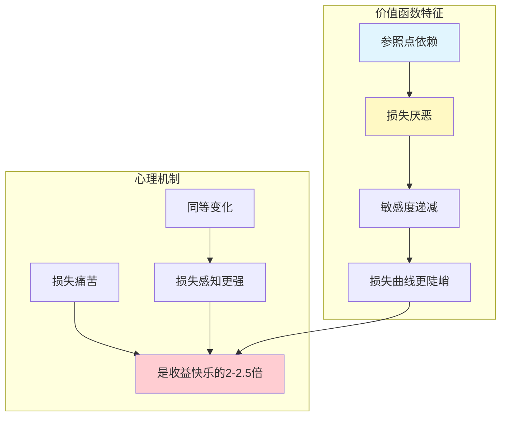
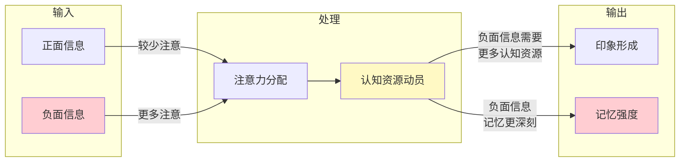
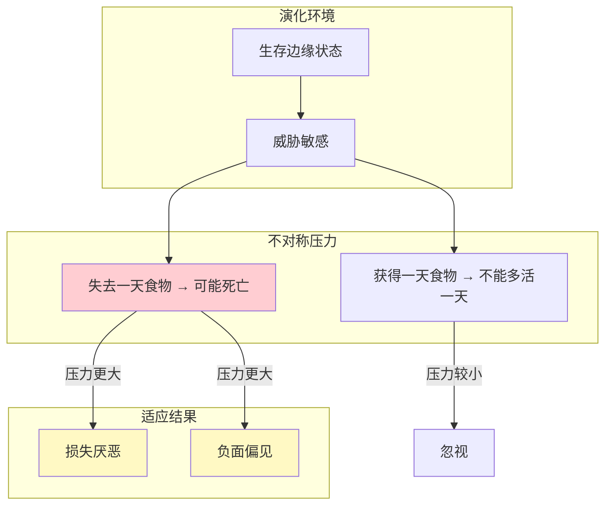
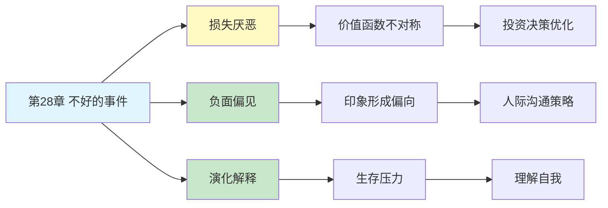

---

category:
  - 书籍拆解

status: 🌲常青
chapter:
number: 28
title: 不好的事件
links:

  - "[[第27章-偏见的代价]]"
  - "[[第29章-心理账户]]"
  - "[[_导航]]"
created: 2026-02-28
tags:
  - 思考快与慢
  - 损失厌恶
  - 负面偏见
  - 前景理论
  - 风险决策
---

# 第28章 不好的事件（Bad Events）

## 📍 章节定位

### 全书位置
> 第28章探讨损失厌恶和负面偏见——为什么坏事比好事对我们的影响更大，揭示了前景理论的核心发现：损失带来的痛苦是等量收益带来快乐的2-2.5倍。

- **全书核心问题**: 人类的决策是如何偏离纯粹理性计算的？
- **本章回答的问题**: 为什么坏事比好事影响更大？为什么我们宁愿避免损失也不追求收益？
- **角色类型**: 核心概念型（前景理论的关键组成部分）
- **论证位置**: 前景理论系列的深化，连接损失厌恶与风险决策

### 章节序列
| 方向 | 章节标题 | 逻辑连接 |
|------|----------|----------|
| 前章 | [[第27章-偏见的代价]] | 从个体偏误代价转向损失厌恶机制 |
| 后章 | [[第29章-心理账户]] | 从损失厌恶转向心理记账方式 |
| 整书 | [[思考快与慢-丹尼尔·卡尼曼]] | 前景理论的核心章节 |

### 一句话定位
> 第28章揭示了人类决策的"负面偏向"——损失厌恶让我们对坏事的反应比好事强烈2.5倍，负面偏见让负面信息主导印象形成，这些机制解释了为什么我们总是"赚小亏大"。

---

## 🎯 核心观点

### 观点1：损失厌恶——损失的痛苦是收益快乐的2.5倍

#### 【表层】现象层

**经典实验**：
- **问题1**：给你1000元，然后让你选：
  - A. 50%概率赢1000元
  - B. 肯定得500元
  - **大多数人选B**（确定性收益）

- **问题2**：给你2000元，然后让你选：
  - C. 50%概率丢1000元
  - D. 肯定丢500元
  - **大多数人选C**（冒险避免确定性损失）

**日常案例**：
| 场景 | 表现 | 机制 |
|------|------|------|
| 股票投资 | 赚10%就卖出，亏30%还死扛 | 收益时风险规避，损失时风险偏好 |
| 购物决策 | 宁可不买也不买错 | 避免损失 > 追求收益 |
| 职业选择 | 宁愿留在不喜欢的工作也不跳槽 | 失去的恐惧 > 获得的期待 |

#### 【中层】机制层

**价值函数的四个特征**：

**核心机制**：
1. **参照点依赖**：价值判断是相对于参照点，不是绝对值
2. **损失厌恶**：损失痛苦 ≈ 2.5 × 收益快乐
3. **敏感度递减**：离参照点越远，影响越小
4. **不对称性**：损失曲线比收益曲线更陡峭

#### 【底层】规律层

> **损失厌恶定律**：人们对损失的反应比收益强烈约2-2.5倍。等量的损失和收益，损失带来的心理冲击远大于收益。这种不对称性是演化结果——在生存边缘，失去一天食物可能致命，获得一天食物并不能多活一天。

**降维翻译**：
> 你赚100的快乐，抵不上亏100的痛苦。
> 所以你总赚小亏大——
> 赚了一点就跑（风险规避），
> 亏了很多还死扛（风险偏好）。
> 这不是心态问题，是出厂设置。

#### 【当下连接】

|----------|----------|----------|
| 为什么股票赚小亏大？ | 损失厌恶+框架效应 | "不是心态问题，是人性" |
| 为什么止损这么难？ | 损失痛苦是收益的2.5倍 | "亏钱比赚钱更疼" |
| 为什么我总做保守决定？ | 避免损失 > 追求收益 | "人天生怕输不怕赢" |

---

### 观点2：负面偏见——坏事比好事"更重"

#### 【表层】现象层

**印象形成实验**：
- 给你看一个人的10个特征，9个好+1个坏
- 结果：你的印象主要由那个"坏"决定
- **负面信息权重 > 正面信息权重**

**日常案例**：
| 场景 | 表现 | 机制 |
|------|------|------|
| 社交印象 | 一次失误毁掉十次成功印象 | 负面信息主导 |
| 新闻消费 | 坏新闻比好新闻更吸引人 | 负面信息更"抓眼球" |
| 评价他人 | 一个缺点抵消多个优点 | 负面权重更大 |

**负面偏见的四个维度**：
1. **负面效能**：负面信息更有影响力
2. **更陡的负面梯度**：越接近负面事件，感知越强烈
3. **负面主导**：正负组合偏向负面解读
4. **负面分化**：负面概念更复杂、词汇更丰富

#### 【中层】机制层

**负面偏见的心理机制**：

**核心机制**：
1. **注意力磁铁**：负面信息自动吸引更多注意
2. **自动警觉**：对负面刺激的快速反应
3. **认知动员**：负面事件需要更多认知资源处理
4. **记忆增强**：负面信息更容易被记住

#### 【底层】规律层

> **负面偏见定律**：人类认知对负面信息的处理比正面信息更深入、更持久、更有影响力。一个负面事件可以抵消多个正面事件的效果。这是演化适应——在威胁敏感的环境中，忽视危险的代价远大于忽视机会的代价。

**降维翻译**：
> 坏事就像磁铁，自动吸走你的注意力。
> 一句批评，抵得上十句表扬。
> 一条坏新闻，比十条好新闻更让人记住。
> 你的大脑天生就是"悲观主义者"——
> 不是它想悲观，是怕死。

#### 【当下连接】

|----------|----------|----------|
| 为什么我总记住不好的事？ | 负面偏见是出厂设置 | "你的大脑在保护你" |
| 为什么一次失败让我崩溃？ | 负面权重 > 正面权重 | "一个坏抵十个好" |
| 如何不被负面信息绑架？ | 理解机制，主动平衡 | "知道bug才能打补丁" |

---

### 观点3：演化解释——为什么大脑"偏心"坏事？

#### 【表层】现象层

**跨物种证据**：
- 卷尾猴也表现出损失厌恶
- 实验中猴子更讨厌"先给2块再拿走1块"的选项
- 即使最终结果相同，"失去"的感觉更糟

**人类普遍性**：
- 不同文化背景的人都表现出损失厌恶
- 婴儿就对负面表情反应更强烈
- 老年人可能表现出"正面偏见"（年龄相关变化）

#### 【中层】机制层

**演化心理学解释**：

**核心机制**：
1. **不对称的演化压力**：失去的代价 > 获得的收益
2. **生存优先**：优先处理威胁，其次才是机会
3. **硬件预设**：损失厌恶是"出厂设置"，不是后天学习

#### 【底层】规律层

> **演化适应定律**：损失厌恶和负面偏见是演化适应的结果。在生存边缘的环境中，忽视威胁的代价远大于忽视机会的代价。这种不对称压力塑造了人类大脑对负面信息的优先处理机制。

**降维翻译**：
> 你的祖先靠"怕死"活下来。
> 乐观的祖先被狮子吃了，
> 悲观的祖先躲起来活下来。
> 所以你天生就"偏心"坏事——
> 这是写在基因里的生存智慧。

#### 【当下连接】

|----------|----------|----------|
| 为什么我总是焦虑？ | 负面偏见是演化遗产 | "你的大脑在保护你" |
| 悲观是性格问题吗？ | 不是，是演化适应 | "这是生存智慧" |
| 如何克服悲观倾向？ | 理解机制，刻意练习 | "升级你的软件" |

---

## 💬 降维翻译

### 观点1: 损失厌恶

#### 原文表达
> "损失带来的痛苦，是等量收益带来的快乐的2-2.5倍。人们不是风险厌恶，而是损失厌恶。"

#### 降维翻译（中学生能懂）
想象你丢了100块钱，又捡到了100块钱。
按理说，你不应该有任何情绪波动——一进一出嘛。
但实际上，丢钱的痛苦 > 捡钱的快乐。

这就是损失厌恶：亏100的痛苦，需要赚250才能弥补。

#### 日常类比（奶奶能懂）
就像借东西，借出去的不想还，借回来的还想留着。不是贪心，是人性。丢东西的难受劲儿，比捡东西的高兴劲儿大得多。

#### 检验
- Q: 如果一个中学生问你这是什么意思？
- A: 你丢100块的难受，比捡100块的高兴强两三倍。所以人总想着"别亏"，而不是"多赚"。

---

### 观点2: 负面偏见

#### 原文表达
> "负面信息在印象形成中比正面信息权重更大。一个不诚实的行为可以毁掉多次诚实行为建立的印象。"

#### 降维翻译（中学生能懂）
假设你做了10件事，9件做得很好，1件搞砸了。
别人对你的印象，主要由那1件搞砸的事决定。

这就是负面偏见：一个坏抵十个好。

#### 日常类比（奶奶能懂）
就像腌咸菜，一粒老鼠屎坏了一缸酱。你做了一辈子好人，做一件坏事就被骂。不是世道坏，是人性。

#### 检验
- Q: 如果一个中学生问你这是什么意思？
- A: 别人记住你的错误，比记住你的优点更容易。一次考试砸了，比十次考好更让人记住。

---

## ✨ 金句库

### 原书金句
| 金句 | 页码 | 适用场景 |
|------|------|----------|
| "损失带来的痛苦，是等量收益带来的快乐的2-2.5倍" | p.— | 行为经济学科普 |
| "人们不是风险厌恶，而是损失厌恶" | p.— | 投资心理分析 |
| "坏比好更强" | p.— | 心理学教育 |
| "负面信息在印象形成中权重更大" | p.— | 社交心理学 |
| "在生存边缘，失去一天食物可能致命" | p.— | 演化心理学 |

### 降维金句
| 金句 | 来源观点 | 适用场景 |
|------|----------|----------|
| "赚100的快乐，抵不上亏100的痛苦" | 损失厌恶 | 投资教育 |
| "一个坏抵十个好" | 负面偏见 | 人际关系 |
| "你的大脑天生就是悲观主义者" | 演化解释 | 心理科普 |
| "亏钱比赚钱更疼" | 损失厌恶 | 投资心态 |
| "坏事就像磁铁，自动吸走注意力" | 负面偏见 | 注意力管理 |

## 🔗 当下映射

### 💰 财富应用
| 场景 | 具体行动 | 预期效果 | 风险提示 |
|------|----------|----------|----------|
| 股票投资 | 预设止损点，写成规则 | 避免损失厌恶导致的死扛 | 可能错过反弹 |
| 购物决策 | 问自己"如果我没有，会买吗" | 打破参照点依赖 | 需要练习 |
| 谈判策略 | 强调对方不行动的损失 | 利用对方的损失厌恶 | 可能引发防御 |

### 💼 职场应用
| 场景 | 具体行动 | 所需能力 | 适用职级 |
|------|----------|----------|----------|
| 绩效反馈 | 先说正面，再提改进 | 沟通技巧 | 所有管理层 |
| 印象管理 | 避免负面事件，比做好事更重要 | 风险意识 | 所有职场人 |
| 决策优化 | 意识到损失厌恶的存在 | 元认知能力 | 中层及以上 |

### 🏠 生活应用
| 场景 | 具体行动 | 可行性 | 见效时间 |
|------|----------|--------|----------|
| 情绪管理 | 理解负面偏见是演化结果 | 高 | 即时缓解 |
| 人际关系 | 一个坏需要十个好来弥补 | 高 | 长期维护 |
| 信息消费 | 刻意关注正面新闻平衡 | 中 | 需要练习 |

### 72小时行动计划
1. **明天可以做的第一件事**: 回想最近一次投资/购物决策，分析是否被损失厌恶影响
2. **本周内可以尝试的事**: 在一次重要反馈中，先说3个正面，再说1个改进点
3. **需要准备资源才能做的事**: 建立投资决策规则，预设止损点

---

## 🕸️ 章节关联

### 向上关联 → 整书
- **贡献**: 前景理论的核心发现，解释人类决策的"负面偏向"
- **位置**: 连接损失厌恶与风险决策，是行为经济学的基石

### 横向关联 → 章节间
| 章节编号 | 章节标题 | 关联类型 | 连接描述 |
|----------|----------|----------|----------|
| 第27章 | 偏见的代价 | 延续 | 偏误的代价延伸到损失厌恶 |
| 第29章 | 心理账户 | 承接 | 损失厌恶影响心理记账方式 |
| 第14章 | 参考点和框架 | 相关 | 框架改变损失感知 |
| 第15章 | 禀赋效应 | 相关 | 拥有就怕失去 |

### 向下关联 → 具体应用
| 应用场景 | 难度 | 前置知识 |
|----------|------|----------|
| 投资决策优化 | 中 | 行为金融学基础 |
| 谈判策略设计 | 中 | 博弈论入门 |
| 情绪管理技巧 | 低 | 心理学入门 |

### 跨书关联 → 知识网络
| 书籍 | 概念 | 关系 | 备注 |
|------|------|------|------|
| [[思考快与慢-丹尼尔·卡尼曼]] | 损失厌恶 | 核心来源 | 本章主题 |
| [[助推-理查德·塞勒]] | 损失厌恶应用 | 延伸 | 如何利用损失厌恶设计政策 |
| [[影响力-西奥迪尼]] | 稀缺原则 | 相关 | 损失厌恶是稀缺原则的心理基础 |
| [[错误的行为-理查德·塞勒]] | 禀赋效应 | 相关 | 拥有就怕失去 |

### 关联可视化

---

## ❓ 问答设计

### Q1: [记忆型问题]
**认知层次**: 记忆
**难度**: 低
**描述**: 什么是损失厌恶？
**答案要点**:
- 损失带来的痛苦是等量收益快乐的2-2.5倍
- 人们不是风险厌恶，而是损失厌恶
- 这是前景理论的核心发现

### Q2: [理解型问题]
**认知层次**: 理解
**难度**: 中
**描述**: 为什么坏事比好事影响更大？
**答案要点**:
- 负面偏见：负面信息权重更大
- 演化解释：忽视威胁的代价 > 忽视机会的代价
- 认知机制：负面信息需要更多认知资源处理

### Q3: [应用型问题]
**认知层次**: 应用
**难度**: 中
**描述**: 如何在投资中应对损失厌恶？
**答案要点**:
- 预设止损点，写成规则
- 问自己"如果我没有持仓，会买入吗"
- 理解这是出厂设置，不是心态问题

### Q4: [分析型问题]
**认知层次**: 分析
**难度**: 高
**描述**: 损失厌恶与风险厌恶有什么区别？
**答案要点**:
- 风险厌恶：对不确定性的回避
- 损失厌恶：对损失的过度敏感
- 损失厌恶导致收益时风险规避，损失时风险偏好

### Q5: [创造型问题]
**认知层次**: 创造
**难度**: 高
**描述**: 如何设计一个利用损失厌恶的销售策略？
**答案要点**:
- 强调不购买的损失而非购买的好处
- 使用"限时优惠"制造失去的恐惧
- 让顾客先体验，再谈失去的感觉

### Q6: [理解型问题]
**认知层次**: 理解
**难度**: 中
**描述**: 负面偏见如何影响人际关系？
**答案要点**:
- 一个坏印象需要十个好印象来弥补
- 负面事件更容易被记住和传播
- 印象形成中负面信息权重更大

### Q7: [应用型问题]
**认知层次**: 应用
**难度**: 中
**描述**: 如何在绩效反馈中考虑负面偏见？
**答案要点**:
- 先说正面，再提改进
- 正面反馈需要更多次
- 一次负面可能抵消多次正面

### Q8: [分析型问题]
**认知层次**: 分析
**难度**: 高
**描述**: 损失厌恶的演化意义是什么？
**答案要点**:
- 在生存边缘，失去的代价 > 获得的收益
- 优先处理威胁是生存策略
- 这种适应在现代社会可能失效

### Q9: [理解型问题]
**认知层次**: 理解
**难度**: 中
**描述**: 负面偏见的四个维度是什么？
**答案要点**:
- 负面效能：负面信息更有影响力
- 更陡的负面梯度：越接近越强烈
- 负面主导：正负组合偏向负面
- 负面分化：负面概念更复杂

### Q10: [创造型问题]
**认知层次**: 创造
**难度**: 高
**描述**: 如何设计一个帮助人们克服损失厌恶的干预方案？
**答案要点**:
- 提供决策框架，预设止损规则
- 改变参照点，问"如果没有会怎样"
- 刻意练习，在小决策中测试

---

## 📊 检索记录

### MCP检索信息来源
| 轮次 | 检索工具 | 检索关键词 | 质量评级 | 核心来源 |
|------|----------|------------|----------|----------|
| 第一轮 | MCP Web Reader | "Loss aversion Wikipedia" | ⭐⭐⭐ | Wikipedia, 学术文献 |
| 第二轮 | MCP Web Reader | "Negativity bias Wikipedia" | ⭐⭐⭐ | Wikipedia, 心理学研究 |

### 信息整合公式
= 主读书笔记的损失厌恶内容
+ ⭐⭐⭐ Wikipedia权威信息（损失厌恶、负面偏见）
+ 降维翻译（生活化类比、金句创作）

---

*拆解日期：2026-02-28*
*拆解方法：系统化阅读方法论*
*拆解模式：标准模式*
*下次回访：拆解后1周检查应用执行情况*
