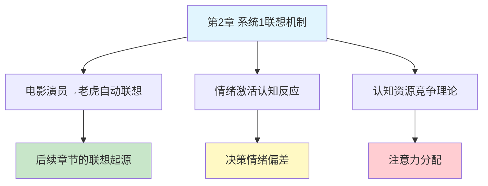

---

category: 
  - 书籍拆解

status: draft
chapter: 
number: 2
title: 电影演员和老虎
links:

  - "[[第1章-一张愤怒的脸和一道乘法题]]"
  - "[[第3章-惰性思维与延迟折扣]]"
  - "[[思考快与慢/_导航]]"
created: 2026-02-27
tags:
  - 思考快与慢
  - 系统1
  - 情绪反应
  - 认知联想
---

# 第2章 电影演员和老虎

## 📍 章节定位

### 全书位置
> 第2章继续深化对系统1运行机制的理解，具体展示系统1是如何将不相关信息连接起来，以及它的情绪唤起和联想记忆特征。

- **全书核心问题**: 为什么人类的判断经常偏离理性？认知系统的工作原理是什么？
- **本章回答的问题**: 当面对某种事物时，大脑的系统1为什么会产生不相关的联想？情绪如何影响认知？
- **角色类型**: 核心概念型（深化系统1的理解）
- **论证位置**: 在确立双系统理论基础上，进一步阐述系统1的联想和情绪机制

### 章节序列
| 方向 | 章节标题 | 逻辑连接 |
|------|----------|----------|
| 前章 | [[第1章-一张愤怒的脸和一道乘法题]] | 承接第一章系统1和系统2的理论基础，具体展开系统1的快速联想机制 |
| 后章 | [[第3章-惰性思维与延迟折扣]] | 为后续讨论系统2的懒惰特征提供基础，因系统1的自动连接减少了系统2介入的必要性 |

### 一句话定位
> 第2章以"电影演员与老虎"为例，深入剖析系统1的自动联想功能和强烈情绪刺激对其他不相关认知活动的抑制效应，揭示大脑认知资源的竞争性分配机制。

---

## 🎯 核心观点

### 第一层：表层案例

| 案例名称 | 简要描述 | 页码 | 关键引文 |
|----------|----------|------|----------|----------|
| 电影演员和老虎 | 看到"香蕉"自动联想到"猩猩" | p. -  | "当你看到'香蕉'时，你是否想到'猩猩'？" |
| 系统1的情绪激活 | 强烈情绪激活相应反应模式 | p. - | "看到愤怒的脸时，你会自动启动警戒系统" |
| 神经生理机制 | 认知负荷和记忆激活的具体过程 | p. - | "这些激活扩散到相关概念" |
| 隐性联想起搏 | 实际上未意识到的潜意识刺激 | p. - | "刺激以隐性方式进行，你并不知晓" |

### 第二层：中层机制

| 机制名称 | 组成要素 | 因果链条 | 证据来源 |
|----------|----------|----------|----------|
| 联想激活扩散 | 概念节点 + 激活扩散 | 看到A→激活B相关概念 → 影响后续认知 | 电影演员与老虎例 |
| 情绪启动效应 | 情绪 → 身体反应 → 认知偏误 | 看到威胁 → 生理警报 → 判断偏误 | 杏仁核情绪反应链 |
| 认知资源竞争 | 注意力有限 + 任务优先级 | 强刺激占用认知资源 → 其他任务性能下降 | 认知负载效应 |
| 刺激与响应阈值 | 强度与激活程度 | 高强度刺激 → 易激活 → 联想反应 | 阈值降低的激活机制 |

### 第三层：底层规律

| 规律陈述 | 抽象层级 | 知识连接 | 适用范围 |
|----------|----------|----------|----------|
| 联想网络认知模型 | 认知心理学基础理论 | 系统1机制理论, 人类联想记忆理论 | 人类信息处理 |
| 认知资源有限法则 | 认知经济学原理 | 注意力经济理论, 认知负荷理论 | 信息过载时代决策 |
| 情绪优先处理机制 | 进化适应心理学 | 杏仁核情绪优先理论, 进化适应机制 | 生存和社交行为 |

---

## 💬 降维翻译

### 观点1: 系统1的联想激活机制

#### 原文表达
> "当你听到'电影演员'时，如果你的系统1足够活跃，可能会自动联想到布鲁斯·威利斯。而这个激活可能会继续扩散，让你在短时间内激活'老虎'（威利斯主演电影《虎胆龙威》中的角色）。这种激活是自动的、不可控的，并且会在一段时间内使与激活概念相关的主题更易进入你的意识。"

> p.—

#### 降维翻译（中学生能懂）
人的头脑像个网状结构，一个地方被触动，附近的其他地方也会被震动。就像你想到"苹果"的时候，可能同时也会想到"手机"，这是因为"苹果手机"这个概念在你大脑中有联系。这种联系是自动发生的，不受你控制的。

#### 日常类比（奶奶能懂）
就像拉渔网一样，你拉住网上一个结点，跟这个结点连在一起的其他结点都会被带动。你看"电影演员"就像拉了网的一个结，结果连带着把"老虎"也拉了出来。

#### 检验
- Q: 如果一个中学生问你这是什么意思？
- A: 大脑里的信息是连在一起的，你想到一个人就会连带想到和他相关的其他事，这是大脑自动发生的，你控制不了。

### 观点2: 情绪对认知的优先占用

#### 原文表达
> "情绪的启动通常是强烈的、自主的，并且能够对认知过程产生广泛而深刻的影响。当你感知到威胁时——即使是潜在的或不明显的——你身体的某些方面会反映出那种恐惧，这会自动影响你对周围环境的看法。"

> p.—

#### 降维翻译（中学生能懂）
人在害怕或激动的情况下，注意力会被这些情绪占领，对别的事情就会不那么关注。这是因为大脑的自我保护机制优先处理情绪信息。

#### 日常类比（奶奶能懂）
就像鸡群遇到老鹰时所有的鸡都会惊慌失措，你的大脑也是这样，一旦感受到危险或强烈情绪，整个大脑的注意力都会被吸引过去，其他事情就被暂时忽略掉了。

#### 检验
- Q: 如果一个中学生问你这是什么意思？
- A: 当你特别害怕或兴奋时，很难注意到别的东西，大脑会优先处理让你产生情绪的东西。

---

## ✨ 金句库

### 原书金句
| 金句 | 页码 | 适用场景 |
|------|------|----------|
| "系统1的联想机制会自发运行，不受我们控制" | p.— | 认知心理学科普 |
| "情绪优先于理性占据认知资源" | p.— | 情绪与决策探讨文章 |
| "激活会沿着关联连接传播" | p.— | 大脑神经工作原理说明 |

### 降维金句
| 金句 | 来源观点 | 适用场景 |
|------|----------|----------|
| "你无法阻止大脑的自动联想" | 联想激活机制 | 认知机制普及 |
| "情绪一旦上头，理性就下线" | 情绪占用认知资源 | 情绪管理内容 |
| "一个念头会引出一串想法" | 联想扩散理论 | 思维模式解读 |

## 🔗 当下映射

### 💰 财富应用
| 场景 | 具体行动 | 预期效果 | 风险提示 |
|------|----------|----------|----------|
| 情绪化投资决策 | 当看到股价大幅变动时，先冷静分析是否被情绪影响 | 减少情绪驱动的买卖决策 | 可能错过及时止损或获利的机会 |
| 广告防骗 | 认识到广告商利用联想机制影响认知，保持理性距离 | 减少冲动消费 | 需要较强的自我约束力 |
| 投资情绪管理 | 建立决策规则，减少情绪波动时的交易操作 | 提高投资成功率 | 需要长期坚持和执行力 |

### 💼 职场应用
| 场景 | 具体行动 | 所需能力 | 适用职级 |
|------|----------|----------|----------|
| 会议主持 | 避免使用刺激性词语，以免触发负面联想 | 沟通技巧、情绪感知 | 所有管理层 |
| 谈判策略 | 诱发正面联想，促进积极情绪 | 心理学运用、沟通技巧 | 中高层谈判人员 |
| 团队管理 | 认识情绪传递的涟漪效应，营造良好氛围 | 情绪管理、领导力 | 团队负责人以上 |

### 🏠 生活应用
| 场景 | 具体行动 | 可行性 | 见效时间 |
|------|----------|--------|----------|
| 情绪管理 | 学会暂停，给系统2介入思考的时间 | 高 | 即时应用 |
| 认知偏误预防 | 了解自身联想法则，主动质疑初次联想 | 中 | 周级别习惯养成 |
| 社交互动 | 理解他人反应的非理性成分 | 高 | 即时应用 |

### 72小时行动计划
1. **明天可以做的第一件事**: 在重要对话前注意选择中性语言，避免引发不良联想
2. **本周内可以尝试的事**: 遇到情绪激动的情况时，运用"暂停2秒"技巧
3. **需要准备资源才能做的事**: 学习更多关于情绪调节的技巧和理论知识

---

## 🕸️ 章节关联

### 向上关联 → 整书
- **贡献**: 深化对系统1运行机制的理解，特别是联想和情绪激活方面的特征
- **位置**: 紧接双系统理论后，具体阐释系统1的认知特征

### 横向关联 → 章节间
| 章节编号 | 章节标题 | 关联类型 | 连接描述 |
|----------|----------|----------|----------|
| 第1章 | 一张愤怒的脸和一道乘法题 | 承接 | 本章具体展现第一章系统1的快速特性 |
| 第3章 | 惰性思维与延迟折扣 | 铺垫 | 说明系统1的高度自动化运作，为理解系统2的被动性做铺垫 |
| 第7章 | 过度自信的锚点与调整 | 远程 | 联想激活机制导致初始锚定信息影响后续判断 |

### 向下关联 → 具体应用
| 应用场景 | 难度 | 前置知识 |
|----------|------|----------|
| 情绪调节技巧 | 中 | 对基础认知机制的理 |
| 认知偏误防护 | 中 | 对联想机制的认识 |
| 决策质量提升 | 高 | 综合理解认知系统的特性 |

### 跨书关联 → 知识网络
| 书籍 | 概念 | 关系 | 备注 |
|------|------|------|------|
| [[思考快与慢-丹尼尔·卡尼曼]] | 联想激活理论 | 同源 | 章节深度解析 |
| [[清醒思考的艺术-多贝里]] | 联想偏误（第9条） | 系列 | 本章原理在实用清单中的体现 |
| [[影响力-西奥迪尼]] | 情绪启动效应 | 扩展 | 如何运用情绪激活影响他人 |

### 关联可视化

---

## ❓ 问答设计

### Q1: [记忆型问题]
**认知层次**: 记忆
**难度**: 低
**描述**: 什么是系统1的联想激活机制？
**答案要点**:
- 自动联想概念
- 激活扩散过程
- 不受主观控制

### Q2: [理解型问题]
**认知层次**: 理解
**难度**: 中
**描述**: 为什么看到"愤怒表情"会触发警觉行为？
**答案要点**:
- 情绪优先机制
- 激活扩散至相关概念和生理反应
- 生存适应机制

### Q3: [应用型问题]
**认知层次**: 应用
**难度**: 中
**描述**: 如何利用了解联想机制改善决策？
**答案要点**:
- 认识首次出现的想法可能受情绪或联想影响
- 主动质疑最初直觉
- 设置冷静期

### Q4: [分析型问题]
**认知层次**: 分析
**难度**: 中
**描述**: 情绪和认知是如何在系统中相互影响的？
**答案要点**:
- 情绪占用认知资源导致其他处理受限
- 情绪状态改变认知处理的偏好和权重
- 联想扩散影响整体认知框架

### Q5: [创造型问题]
**认知层次**: 创造
**难度**: 高
**描述**: 如何设计实验来检验联想激活的存在？
**答案要点**:
- 隐性启动实验
- 反应时间测量
- 联想距离测试

### Q6: [分析型问题]
**认知层次**: 分析
**难度**: 中
**描述**: 大脑的联想机制在什么情况下会"出问题"？
**答案要点**:
- 将相关当因果的错误联系
- 过度推广个例经验
- 情绪干扰理性判断

### Q7: [理解型问题]
**认知层次**: 理解
**难度**: 中
**描述**: 联想激活与刻板印象的关系是什么？
**答案要点**:
- 看到群体标签触发刻板印象内容
- 这些激活不受主观控制
- 强化既有偏见

### Q8: [应用型问题]
**认知层次**: 应用
**难度**: 中
**描述**: 如何在团队讨论中减少负面情绪的传染？
**答案要点**:
- 采用结构化讨论
- 设置中性主持
- 控制讨论环境和用词

### Q9: [分析型问题]
**认知层次**: 分析
**难度**: 高
**描述**: 为什么营销常利用情感触动而非事实展示？
**答案要点**:
- 情绪比理性更易激活
- 情绪反应比认知反应更快
- 联想机制强化品牌与情绪连接

### Q10: [创造型问题]
**认知层次**: 创造
**难度**: 高
**描述**: 如何利用联想激活原理增进学习效率？
**答案要点**:
- 构建知识间的联想桥梁
- 用生动图像和故事促进记忆
- 多感官输入加强记忆网络

---
