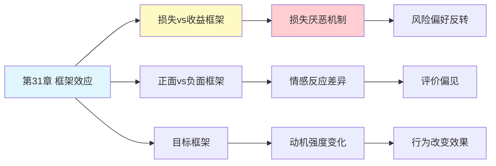

---

category: 
  - 书籍拆解

status: draft
chapter: 
number: 31
title: 框架效应
links:

  - "[[第30章-选择架构]]"
  - "[[第32章-两个自我]]"
  - "[[思考快与慢/_导航]]"
created: 2026-02-27
tags:
  - 思考快与慢
  - 框架效应
  - 表述方式
  - 损失厌恶
  - 前景理论
---

# 第31章 框架效应

## 📍 章节定位

### 全书位置
> 第31章深入探讨框架效应——同样的客观事实，用不同的方式表述会产生截然不同的决策反应，揭示了"怎么说"比"说什么"更能影响人们的判断和选择。

- **全书核心问题**: 人类的决策是如何被信息呈现方式塑造的？
- **本章回答的问题**: 为什么同样的内容，换一种说法就能改变人们的决定？
- **角色类型**: 核心概念型（揭示语言与决策的深层关系）
- **论证位置**: 连接前景理论、选择架构等概念，展示系统1的主导作用

### 章节序列
| 方向 | 章节标题 | 逻辑连接 |
|------|----------|----------|
| 前章 | [[第30章-选择架构]] | 框架是选择架构的核心工具 |
| 后章 | [[第32章-两个自我]] | 从决策框架转向自我认知框架 |
| 整书 | [[思考快与慢-丹尼尔·卡尼曼]] | 前景理论的核心应用章节 |

### 一句话定位
> 第31章揭示了"表述即现实"的力量——90%存活率与10%死亡率是完全相同的事实，却会引发截然不同的情绪反应和决策选择。

---

## 🎯 核心观点

### 第一层：表层案例

| 案例名称 | 简要描述 | 页码 | 关键引文 |
|----------|----------|------|----------|
| 亚洲病问题 | 同样的治疗方案，用"存活"还是"死亡"描述影响选择 | p.— | "90%存活 vs 10%死亡，选择截然不同" |
| 肉类标签 | "75%瘦肉"比"25%肥肉"更受欢迎 | p.— | "正面框架更吸引人" |
| 信用卡附加费 | "现金折扣"比"信用卡附加费"更易接受 | p.— | "得比失好接受" |
| 考试反馈 | "答对80%"比"答错20%"更有激励作用 | p.— | "正向表述提升信心" |
| 政治口号 | 同样的政策用不同框架表达支持率不同 | p.— | "表述决定态度" |

### 第二层：中层机制

| 机制名称 | 组成要素 | 因果链条 | 证据来源 |
|----------|----------|----------|----------|
| 损失框架效应 | 参考点设定 + 损失厌恶 | 损失表述→损失厌恶→风险寻求 | 亚洲病实验 |
| 属性框架效应 | 正面vs负面 + 情感反应 | 正面描述→积极情感→偏好提升 | 消费者研究 |
| 目标框架效应 | 收益vs损失 + 动机强度 | 损失框架→更强动机→行为改变 | 健康传播研究 |
| 诚实框架 | 透明度 + 信任感 | 清晰框架→减少操纵感→接受度提高 | 沟通效果研究 |

### 第三层：底层规律

| 规律陈述 | 抽象层级 | 知识连接 | 适用范围 |
|----------|----------|----------|----------|
| 参考点依赖原理 | 前景理论核心 | [[损失厌恶]], [[第26章-前景理论]] | 所有价值判断 |
| 情感框架效应 | 心理学基础 | [[情感决策理论]], [[情绪认知]] | 信息处理与决策 |
| 系统1主导原则 | 认知心理学 | [[双系统理论]], [[启发式处理]] | 快速判断场景 |

---

## 💬 降维翻译

### 观点1: 同样的事实，不同的框架，不同的选择

#### 原文表达
> "在经典的亚洲病问题中，实验者被告知600人将死于一种疾病。当治疗方案被描述为'能救活200人'时，72%的人选择保守治疗；当同样的方案被描述为'会有400人死亡'时，只有22%的人选择它。两种描述在数学上完全等价，但人们的反应截然不同。"

> p.—

#### 降维翻译（中学生能懂）
假设有600人会生病，你选治疗方案：

方案A的两种说法：
- 说法1："能救活200人"（很多人选）
- 说法2："会有400人死亡"（很少人选）

等等，这不是一回事吗？救活200人 = 死400人，600-200=400。

是的，数学上一样。但脑子反应不一样：
- "救活"让你想到"救"，感觉在赚
- "会死"让你想到"死"，感觉在亏

人讨厌"亏"的感觉，所以选择就不同了。

#### 日常类比（奶奶能懂）
就像卖肉，说"75%瘦肉"人家愿意买，说"25%肥肉"就没人要了。肉还是那块肉，但话怎么说，结果就不一样。

#### 检验
- Q: 如果一个中学生问你这是什么意思？
- A: 同一件事，换个说法就能改变人的决定。人不是算账的机器，是看感觉做决定的。

### 观点2: 损失框架比收益框架更有力量

#### 原文表达
> "框架效应的核心机制是损失厌恶。当信息被框架为损失时（'你会失去...'），人们的情绪反应比框架为收益时强烈得多。这种不对称性使得损失框架在说服、健康行为促进等领域更有效——告诉人们'不运动会让你损失健康'比'运动会让你获得健康'更有说服力。"

> p.—

#### 降维翻译（中学生能懂）
你想说服别人做一件事，有两种说法：

- "做了这件事，你能得到X"
- "不做这件事，你会失去X"

研究发现，第二种说法更有用。人更怕"失去"已有的，不那么在乎"得到"可能有的。

比如：
- "每天锻炼能多活3年"
- "不锻炼会让你少活3年"

第二种让人更想动起来。

#### 日常类比（奶奶能懂）
就像哄小孩子，说"不吃饭会被打"比"吃饭有奖励"管用。怕损失比想得到更能推动人。

#### 检验
- Q: 如果一个中学生问你这是什么意思？
- A: 人对"失去"的恐惧比对"得到"的渴望更强。所以想说服人，就说"不做会亏什么"，别说"做能赚什么"。

---

## ✨ 金句库

### 原书金句
| 金句 | 页码 | 适用场景 |
|------|------|----------|
| "90%存活和10%死亡，是一样的，但人的反应完全不同" | p.— | 框架效应科普 |
| "表述方式决定决策，这是系统1的特征" | p.— | 认知心理学 |
| "损失框架比收益框架更有说服力" | p.— | 沟通策略 |

### 降维金句
| 金句 | 来源观点 | 适用场景 |
|------|----------|----------|
| "怎么说比说什么更重要" | 框架效应核心 | 沟通教育 |
| "同样的事，换个说法就是两个世界" | 表述力量 | 说服技巧 |
| "怕失去比想得到更有动力" | 损失框架 | 激励设计 |

## 🔗 当下映射

### 💰 财富应用
| 场景 | 具体行动 | 预期效果 | 风险提示 |
|------|----------|----------|----------|
| 投资决策 | 用收益框架而非损失框架评估 | 减少恐慌性抛售 | 可能忽视风险 |
| 价格呈现 | 用"省了多少钱"而非"花了多少钱" | 提升购买意愿 | 可能过度消费 |
| 理财规划 | 强调"不储蓄会失去的复利" | 提高储蓄动力 | 需要长期坚持 |

### 💼 职场应用
| 场景 | 具体行动 | 所需能力 | 适用职级 |
|------|----------|----------|----------|
| 汇报沟通 | 用正面框架呈现进展 | 沟通策略 | 所有层级 |
| 绩效反馈 | 强调"还有进步空间"而非"不足" | 反馈技巧 | 管理层 |
| 变革管理 | 用机会框架而非威胁框架 | 变革领导力 | 高管层 |

### 🏠 生活应用
| 场景 | 具体行动 | 可行性 | 见效时间 |
|------|----------|--------|----------|
| 健康行为 | 用损失框架提醒健康代价 | 高 | 即时生效 |
| 亲子教育 | 用正面框架鼓励孩子 | 高 | 长期见效 |
| 人际沟通 | 觉察自己的语言框架 | 中 | 长期修炼 |

### 72小时行动计划
1. **明天可以做的第一件事**: 回忆最近一次说服别人的场景，分析你用的框架是收益还是损失型
2. **本周内可以尝试的事**: 故意用两种框架表述同一件事，观察对方的反应差异
3. **需要准备资源才能做的事**: 建立个人"框架意识"清单，在做重要决策前检查语言框架

---

## 🕸️ 章节关联

### 向上关联 → 整书
- **贡献**: 揭示语言与决策的深层关系，展示系统1的核心特征
- **位置**: 连接前景理论与选择架构，是全书理论体系的枢纽

### 横向关联 → 章节间
| 章节编号 | 章节标题 | 关联类型 | 连接描述 |
|----------|----------|----------|----------|
| 第30章 | 选择架构 | 前置 | 框架是选择架构的核心工具 |
| 第32章 | 两个自我 | 延续 | 自我认知也受框架影响 |
| 第14章 | 参考点和框架 | 溯源 | 框架效应的理论基础 |
| 第7章 | 过度自信的锚点 | 相关 | 锚定也是一种框架 |

### 向下关联 → 具体应用
| 应用场景 | 难度 | 前置知识 |
|----------|------|----------|
| 健康传播 | 中 | 传播学基础 |
| 政治营销 | 高 | 政治学、心理学 |
| 日常沟通 | 低 | 自我意识 |

### 跨书关联 → 知识网络
| 书籍 | 概念 | 关系 | 备注 |
|------|------|------|------|
| [[思考快与慢-丹尼尔·卡尼曼]] | 框架效应 | 同源 | 核心理论来源 |
| [[助推-理查德·塞勒]] | 框架助推 | 延伸 | 政策应用视角 |
| [[影响力-西奥迪尼]] | 语言说服 | 相关 | 说服心理学 |
| [[清醒思考的艺术-多贝里]] | 批判思维 | 互补 | 如何突破框架 |

### 关联可视化

---

## ❓ 问答设计

### Q1: [记忆型问题]
**认知层次**: 记忆
**难度**: 低
**描述**: 什么是框架效应？
**答案要点**:
- 同样的内容用不同表述
- 产生不同的决策反应
- 表述方式影响选择

### Q2: [理解型问题]
**认知层次**: 理解
**难度**: 中
**描述**: 为什么"90%存活"和"10%死亡"会引起不同的反应？
**答案要点**:
- 参考点不同
- 存活是"得"，死亡是"失"
- 损失厌恶导致差异

### Q3: [应用型问题]
**认知层次**: 应用
**难度**: 中
**描述**: 如何利用框架效应说服家人做健康检查？
**答案要点**:
- 使用损失框架
- 强调"不检查会错过什么"
- 而非"检查会发现什么好处"

### Q4: [分析型问题]
**认知层次**: 分析
**难度**: 中
**描述**: 框架效应与损失厌恶的关系是什么？
**答案要点**:
- 框架效应的核心机制是损失厌恶
- 损失框架激活损失厌恶
- 导致风险偏好改变

### Q5: [创造型问题]
**认知层次**: 创造
**难度**: 高
**描述**: 设计一个利用框架效应促进环保行为的宣传活动？
**答案要点**:
- 使用损失框架描述环境破坏
- 强调"不行动会失去什么"
- 视觉化损失呈现

### Q6: [理解型问题]
**认知层次**: 理解
**难度**: 中
**描述**: 为什么损失框架比收益框架更有说服力？
**答案要点**:
- 损失厌恶强度更大
- 负面信息权重更高
- 情感反应更强烈

### Q7: [应用型问题]
**认知层次**: 应用
**难度**: 中
**描述**: 在产品营销中如何运用框架效应？
**答案要点**:
- 正面框架描述产品特点
- 价格用"省钱"而非"花费"框架
- 避免激活损失感

### Q8: [分析型问题]
**认知层次**: 分析
**难度**: 高
**描述**: 框架效应如何体现系统1的主导作用？
**答案要点**:
- 快速、自动的反应
- 不经过深思熟虑
- 情感驱动的判断

### Q9: [理解型问题]
**认知层次**: 高
**描述**: 框架效应与锚定效应有什么异同？
**答案要点**:
- 同：都是参照系效应
- 异：锚定是数值影响，框架是表述方式影响
- 都利用系统1的特点

### Q10: [创造型问题]
**认知层次**: 创造
**难度**: 高
**描述**: 如何帮助人们突破框架效应，做出更理性的决策？
**答案要点**:
- 多角度重新表述问题
- 主动识别框架类型
- 启用系统2深思熟虑

---
