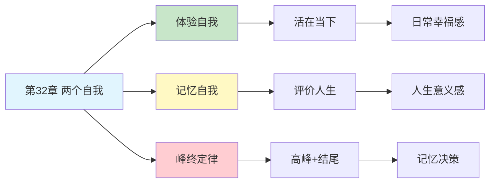

---

category: 
  - 书籍拆解

status: draft
chapter: 
number: 32
title: 两个自我
links:

  - "[[第31章-框架效应]]"
  - "[[思考快与慢/_导航]]"
created: 2026-02-27
tags:
  - 思考快与慢
  - 两个自我
  - 体验自我
  - 记忆自我
  - 峰终定律
  - 幸福感
description: "第32章是全书最具哲学深度的章节之一，探讨了\"体验自我\"与\"记忆自我\"的根本分歧——我们活在当下，却由记忆定义人生，这两个自我对幸福有着截然不同的理解和追求。"
---

# 第32章 两个自我

## 📍 章节定位

### 全书位置
> 第32章是全书最具哲学深度的章节之一，探讨了"体验自我"与"记忆自我"的根本分歧——我们活在当下，却由记忆定义人生，这两个自我对幸福有着截然不同的理解和追求。

- **全书核心问题**: 什么是幸福？我们如何做出关乎幸福的选择？
- **本章回答的问题**: 为什么当下体验和事后回忆常常矛盾？哪个自我才是"真正的你"？
- **角色类型**: 核心概念型（全书哲学升华的关键章节）
- **论证位置**: 从决策偏误上升到人生意义，是全书的哲学总结

### 章节序列
| 方向 | 章节标题 | 逻辑连接 |
|------|----------|----------|
| 前章 | [[第31章-框架效应]] | 框架影响记忆，记忆定义自我 |
| 后章 | 全书总结 | 两个自我是理解全书的核心框架 |
| 整书 | [[思考快与慢-丹尼尔·卡尼曼]] | 全书哲学升华的关键章节 |

### 一句话定位
> 第32章揭示了人生最深刻的矛盾：我们活在"体验自我"的每一个当下，却由"记忆自我"来评价人生——而这两个自我常常对什么是幸福持相反意见。

---

## 🎯 核心观点

### 第一层：表层案例

| 案例名称 | 简要描述 | 页码 | 关键引文 |
|----------|----------|------|----------|
| 结肠镜实验 | 痛苦检查的最后时刻影响整体记忆评价 | p.— | "最后5分钟的体验改变整个记忆" |
| 假期回忆 | 假期中 vs 假期后的满意度差异 | p.— | "享受当下与回忆评价常常矛盾" |
| 关系结束效应 | 一段关系的结束方式影响整体评价 | p.— | "结尾定义整个故事" |
| 职业生涯回顾 | 整体满意与日常体验的不一致 | p.— | "回忆的幸福不等于生活的幸福" |
| 人生意义判断 | 峰终时刻决定人生评价 | p.— | "人生由高峰和结尾定义" |

### 第二层：中层机制

| 机制名称 | 组成要素 | 因果链条 | 证据来源 |
|----------|----------|----------|----------|
| 峰终定律 | 峰值体验 + 结尾体验 | 最强烈时刻+最后时刻→记忆评价 | 结肠镜实验等 |
| 时长忽视 | 总体时长 + 忽略机制 | 时间长度被忽视→记忆只取关键时刻 | 疼痛记忆研究 |
| 体验-记忆分离 | 实时体验 + 记忆重构 | 体验被记录→记忆被选择→评价分歧 | 幸福感研究 |
| 叙事自我 | 故事建构 + 意义赋予 | 片段→叙事→自我认同 | 叙事心理学 |

### 第三层：底层规律

| 规律陈述 | 抽象层级 | 知识连接 | 适用范围 |
|----------|----------|----------|----------|
| 双自我理论 | 哲学/心理学基础 | 自我理论, 意识哲学 | 人生意义与决策 |
| 记忆建构原理 | 认知心理学 | 记忆重构理论, 叙事心理学 | 所有记忆相关行为 |
| 时间感知悖论 | 时间心理学 | 时间感知理论, 存在心理学 | 人生选择与评价 |

---

## 💬 降维翻译

### 观点1: 你有两个自我，它们常常打架

#### 原文表达
> "体验自我活在每一个当下，感受每一个瞬间的快乐或痛苦；记忆自我则负责回顾和评价，通过选择性的记忆来定义'我的人生'。问题是，这两个自我对幸福的理解完全不同。体验自我关心当下的感受，记忆自我关心故事的完整性。它们经常做出相反的选择。"

> p.—

#### 降维翻译（中学生能懂）
你体内住着两个人：

- 体验自我：正在经历当下的你。吃饭时觉得好吃，考试时觉得紧张。
- 记忆自我：回顾过去的你。"那次旅行真好"，"那段日子很难熬"。

问题来了：它们经常唱反调。
比如：
- 一个假期，每天都有小烦恼，但最后一天很完美 → 记忆自我觉得"这假期真棒"
- 一段感情，大部分时间很幸福，但分手很惨烈 → 记忆自我觉得"这段感情不好"

体验自我过了一年，记忆自我只记得几个片段。

#### 日常类比（奶奶能懂）
就像看戏，台上演的是体验自我，一幕一幕过。但散场后，你只记得高潮和结尾。中间演了多久、演了多少，反而不重要了。

#### 检验
- Q: 如果一个中学生问你这是什么意思？
- A: 你活在每一个当下，但评价人生的时候只看几个关键时刻。中间大部分时间怎么过的，你自己都忘了。

### 观点2: 峰终定律——人生由高峰和结尾定义

#### 原文表达
> "峰终定律揭示了记忆自我的核心运作方式：我们对一段经历的评价，几乎完全取决于两个因素——最强烈的时刻（峰）和最后的时刻（终）。整个经历的时长反而被忽视。这就是为什么痛苦的医疗检查，如果最后时刻稍微舒服一点，整体记忆评价会好得多。"

> p.—

#### 降维翻译（中学生能懂）
假设你要回忆一段经历，比如一次旅行、一段感情、一份工作。你的大脑怎么评价它？

- 会把所有天数加起来算平均吗？不会
- 会仔细回忆每一天的细节吗？不会

大脑只抓两个点：
1. **最爽/最惨的那一时刻**（峰）
2. **最后的印象**（终）

所以：
- 痛苦的治疗，最后收尾温柔点，回忆起来就不那么糟糕
- 一段感情，分手方式决定了整个回忆的基调
- 一个假期，最后一天的体验影响整体评价

中间过了多久，反而被忽略。

#### 日常类比（奶奶能懂）
就像吃东西，记住的是最好吃的那一口和最后一口。中间吃了多少、吃了多久，反而不记得了。

#### 检验
- Q: 如果一个中学生问你这是什么意思？
- A: 评价一段经历，大脑只抓两个点：最高潮和结尾。所以结尾很重要，好结尾能救整个故事。

### 观点3: 时长忽视——时间长度被遗忘

#### 原文表达
> "与峰终定律相伴的是时长忽视——我们对经历持续时间的敏感性极低。10分钟的痛苦和50分钟的痛苦，如果峰值和结尾相似，记忆评价也相似。这一发现对医疗、幸福研究等领域有深远影响。"

> p.—

#### 降维翻译（中学生能懂）
痛苦的手术做了10分钟 vs 做了50分钟，哪个印象更差？

你可能会说，50分钟肯定更难熬啊。

但研究发现：如果两种情况最痛的程度一样、结束的方式一样，事后回忆起来，差别不大。

奇怪吗？是的。但记忆就是这样——它不记"多久"，只记"多痛"和"怎么结束"。

#### 日常类比（奶奶能懂）
就像听人讲故事，讲了10分钟和讲了1小时，如果笑点一样、结尾一样，你感觉可能差不多。中间说了多久，反而忘了。

#### 检验
- Q: 如果一个中学生问你这是什么意思？
- A: 记忆不关心时间长短，只关心最强烈的感受和最后的印象。

---

## ✨ 金句库

### 原书金句
| 金句 | 页码 | 适用场景 |
|------|------|----------|
| "我们活在当下，却由记忆定义人生" | p.— | 人生哲学讨论 |
| "峰终定律：人生由高峰和结尾定义" | p.— | 记忆心理学 |
| "体验自我和记忆自我对幸福有不同定义" | p.— | 幸福感研究 |

### 降维金句
| 金句 | 来源观点 | 适用场景 |
|------|----------|----------|
| "你活一辈子，但只记住几个瞬间" | 时长忽视 | 人生反思 |
| "结尾决定故事的温度" | 峰终定律 | 叙事创作 |
| "体验是当下，记忆是选择" | 双自我理论 | 认知心理 |

## 🔗 当下映射

### 💰 财富应用
| 场景 | 具体行动 | 预期效果 | 风险提示 |
|------|----------|----------|----------|
| 消费决策 | 关注体验而非仅关注结果 | 提升当下幸福感 | 可能忽略长期影响 |
| 投资回顾 | 用峰终定律理解投资记忆 | 减少情绪化决策 | 需要客观记录辅助 |
| 职业选择 | 平衡日常体验与未来记忆 | 更全面的决策 | 两个自我可能冲突 |

### 💼 职场应用
| 场景 | 具体行动 | 所需能力 | 适用职级 |
|------|----------|----------|----------|
| 项目收尾 | 精心设计项目结尾体验 | 项目管理能力 | 所有管理者 |
| 员工离职 | 确保离职体验正面 | 离职管理能力 | HR及管理层 |
| 客户关系 | 关注关键时刻和最后印象 | 客户管理能力 | 客户相关岗位 |

### 🏠 生活应用
| 场景 | 具体行动 | 可行性 | 见效时间 |
|------|----------|--------|----------|
| 亲密关系 | 重视关系中的高峰和结尾 | 高 | 即时生效 |
| 旅行规划 | 确保旅行有精彩高峰和美好结尾 | 高 | 即时生效 |
| 人生规划 | 有意识地创造记忆高峰 | 中 | 长期见效 |

### 72小时行动计划
1. **明天可以做的第一件事**: 回忆一段重要经历，找出峰值和结尾，看看它们如何定义你的记忆
2. **本周内可以尝试的事**: 为一件正在进行的事精心设计结尾，观察记忆效果的变化
3. **需要准备资源才能做的事**: 建立体验日记，记录当下的感受，对比记忆评价的差异

---

## 🕸️ 章节关联

### 向上关联 → 整书
- **贡献**: 升华全书的哲学内涵，揭示人生选择的深层矛盾
- **位置**: 全书最具哲学深度的章节，是从心理学到人生哲学的桥梁

### 横向关联 → 章节间
| 章节编号 | 章节标题 | 关联类型 | 连接描述 |
|----------|----------|----------|----------|
| 第31章 | 框架效应 | 前置 | 框架影响记忆，记忆定义自我 |
| 第33章 | 对经历的记忆 | 延伸 | 峰终定理是记忆自我的核心运作规律 |
| 第1章 | 双系统理论 | 溯源 | 系统1/2的另一种表达 |
| 第14章 | 参考点和框架 | 相关 | 参考点影响记忆评价 |
| 第27章 | 偏见的代价 | 相关 | 记忆偏见也是偏见的代价 |

### 向下关联 → 具体应用
| 应用场景 | 难度 | 前置知识 |
|----------|------|----------|
| 人生规划 | 高 | 哲学思考能力 |
| 医疗体验设计 | 中 | 用户体验知识 |
| 关系管理 | 中 | 心理学基础 |

### 跨书关联 → 知识网络
| 书籍 | 概念 | 关系 | 备注 |
|------|------|------|------|
| [[思考快与慢-丹尼尔·卡尼曼]] | 两个自我 | 同源 | 核心理论来源 |
| 自我的追索-布鲁斯 | 自我理论 | 延伸 | 哲学视角 |
| 幸福的假设-海特 | 幸福感 | 相关 | 幸福心理学 |
| 记忆的七宗罪-沙克特 | 记忆偏见 | 延伸 | 记忆的系统性错误 |

### 关联可视化

---

## ❓ 问答设计

### Q1: [记忆型问题]
**认知层次**: 记忆
**难度**: 低
**描述**: 什么是体验自我和记忆自我？
**答案要点**:
- 体验自我：活在当下，感受每一个瞬间
- 记忆自我：回顾过去，评价人生经历
- 两者对幸福的理解不同

### Q2: [理解型问题]
**认知层次**: 理解
**难度**: 中
**描述**: 什么是峰终定律？
**答案要点**:
- 记忆评价取决于峰值和结尾
- 时长被忽视
- 影响所有经历评价

### Q3: [应用型问题]
**认知层次**: 应用
**难度**: 中
**描述**: 如何利用峰终定律改善医疗体验？
**答案要点**:
- 关注最痛苦时刻的管理
- 精心设计治疗结尾体验
- 减少峰值痛苦

### Q4: [分析型问题]
**认知层次**: 分析
**难度**: 中
**描述**: 体验自我和记忆自我的矛盾如何影响人生选择？
**答案要点**:
- 体验自我追求当下快乐
- 记忆自我追求好故事
- 两者可能做出相反选择

### Q5: [创造型问题]
**认知层次**: 创造
**难度**: 高
**描述**: 如何设计一个既能满足体验自我又能满足记忆自我的人生？
**答案要点**:
- 确保有美好的当下体验
- 有意识地创造记忆高峰
- 重视人生重要节点的结尾

### Q6: [理解型问题]
**认知层次**: 理解
**难度**: 中
**描述**: 为什么会出现时长忽视？
**答案要点**:
- 记忆的存储机制
- 选择性编码
- 认知资源限制

### Q7: [应用型问题]
**认知层次**: 应用
**难度**: 中
**描述**: 在亲密关系中如何应用两个自我理论？
**答案要点**:
- 关注日常体验质量
- 创造关系高峰时刻
- 重视关系的"结尾"体验

### Q8: [分析型问题]
**认知层次**: 分析
**难度**: 高
**描述**: 两个自我理论与系统1/2理论有什么关系？
**答案要点**:
- 体验自我更接近系统1
- 记忆自我涉及系统2的叙事
- 都是双系统视角的应用

### Q9: [理解型问题]
**认知层次**: 高
**描述**: "我们活在当下，却由记忆定义人生"这句话意味着什么？
**答案要点**:
- 体验在当下发生
- 评价由记忆完成
- 两者可能不一致

### Q10: [创造型问题]
**认知层次**: 创造
**难度**: 高
**描述**: 如果让你设计一个"幸福追踪系统"，如何同时照顾两个自我？
**答案要点**:
- 实时记录当下感受
- 定期回顾高峰时刻
- 提醒创造积极结尾

---
