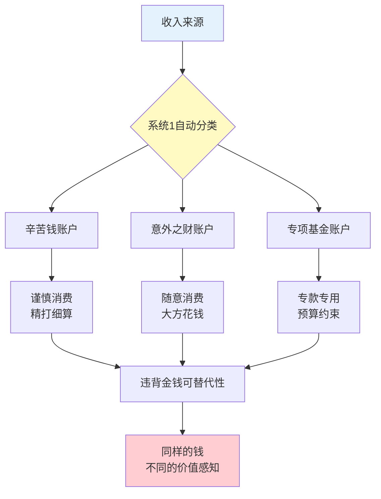
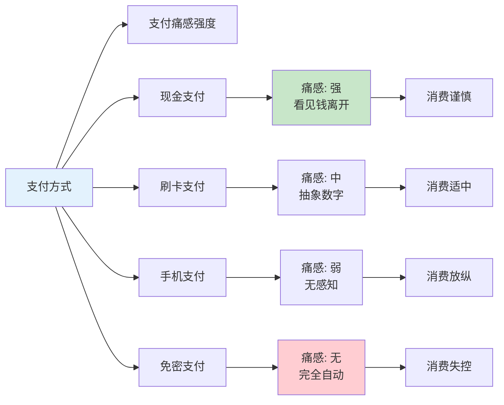
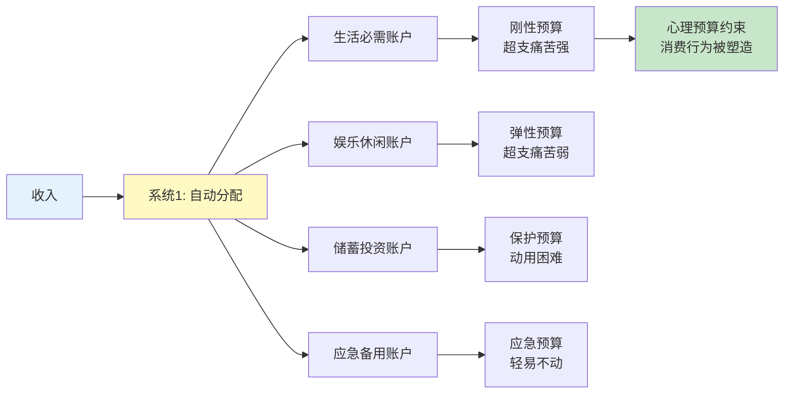
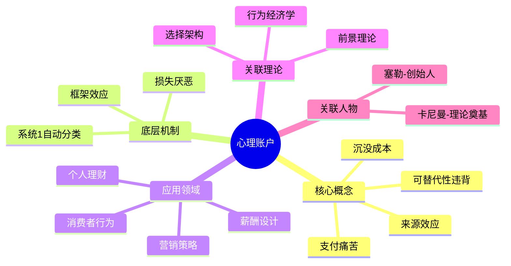

---

category: 
  - 书籍拆解

status: draft
chapter: 
number: 32
title: 心理账户
links:

  - "[[第31章-框架效应]]"
  - "[[第33章-对经历的记忆]]"

created: 2026-02-28
tags:
  - 思考快与慢
  - 心理账户
  - 金钱心理
  - 消费决策
  - 行为经济学
  - 塞勒
keywords:
  - 心理账户
  - 可替代性违背
  - 来源效应
  - 支付痛苦
  - 沉没成本
---

# 第32章 心理账户

## 📍 章节定位

### 全书位置
> 第32章深入探讨心理账户这一行为经济学核心概念——人们如何在心中将金钱分门别类，对不同来源、不同用途的钱采取截然不同的态度。这违背了传统经济学的"金钱可替代性"假设，揭示了人类金钱决策的非理性本质。

- **全书核心问题**: 人类的决策是如何偏离理性经济模型的？
- **本章回答的问题**: 为什么同样的钱在不同情境下价值不同？我们如何在心里给钱"记账"？
- **角色类型**: 核心概念型（行为经济学奠基概念）
- **论证位置**: 从个体决策偏误延伸到消费行为，连接前景理论与选择架构

### 章节序列
| 方向 | 章节标题 | 逻辑连接 |
|------|----------|----------|
| 前章 | [[第31章-框架效应]] | 框架影响心理账户分类 |
| 后章 | [[第33章-对经历的记忆]] | 从金钱决策转向幸福感知 |
| 整书 | [[思考快与慢-丹尼尔·卡尼曼]] | 行为经济学核心概念章节 |

### 一句话定位
> 第32章揭示了心理账户的非理性特征——我们把钱分成"辛苦钱""意外之财""度假基金"等类别，导致同样的100块钱在不同账户里有着截然不同的消费倾向，这是系统1对金钱的自动分类。

---

## 🎯 核心观点（三层提取）

### 观点1：金钱的可替代性违背

#### 【表层】现象层

**经典实验：戏剧票问题**
- 场景A：你花了100元买戏票，到剧院发现票丢了，你会再买一张吗？
- 场景B：你准备花100元买戏票，到剧院发现丢了100元现金，你还会买票吗？
- 结果：场景A大多数人选择不买，场景B大多数人选择买

**为什么？**
- 场景A：票丢了 → "娱乐账户"已经花了100元 → 再买一张等于"花200元看戏" → 不值
- 场景B：钱丢了 → "现金账户"少了100元 → "娱乐账户"还没花钱 → 买票是"花100元看戏" → 值得

**更多案例**：
| 案例名称 | 简要描述 | 关键引文 |
|----------|----------|----------|
| 工资与奖金 | 同样金额，工资省着花，奖金大方花 | "钱的来源决定花的速度" |
| 压岁钱 | 小时候的压岁钱和自己的工资，花起来感觉不同 | "不是自己挣的，花着不心疼" |
| 中奖钱 | 彩票中奖的钱更容易挥霍 | "意外之财，不花白不花" |

#### 【中层】机制层

**心理账户的核心机制**：



**核心机制解析**：
1. **来源标签效应**：系统1自动给钱贴上"辛苦挣的"或"白得的"标签
2. **账户边界效应**：每个心理账户有独立的预算和消费规则
3. **情感价值差异**：不同账户的钱承载不同的情感重量

#### 【底层】规律层

> **心理账户定律**：人类违背金钱可替代性原则，在心中建立多个互不流通的"账户"。同样的钱在不同账户里具有不同的心理价值，这违背了传统经济学的理性人假设。

**降维翻译**：
> 经济学说：100块钱就是100块钱，不管从哪来的。
> 你的脑子说：不！辛苦挣的100块，和捡来的100块，能一样吗？
> 前者像存钱罐里的，后者像天上掉的。
> 钱"看起来"一样，但花起来感觉完全不同。

#### 【当下连接】

|----------|----------|----------|
| 为什么年终奖总存不住？ | 被系统1归类为"意外之财" | "原来是脑子的bug" |
| 为什么工资发下来就想花？ | 心理账户还没建立"保护" | "不是不自律，是机制问题" |
| 如何改变这种非理性？ | 统一账户视角，重新分类 | "可以人为修正" |

---

### 观点2：支付方式影响消费——支付痛苦

#### 【表层】现象层

**支付痛苦实验**：
- 现金支付：消费者更容易感知"花钱"
- 信用卡支付：消费金额平均增加12-18%
- 手机支付：消费冲动最强，超支最严重

**生活场景**：
- 用现金买咖啡：犹豫一下，可能不买了
- 刷卡买咖啡：毫不犹豫
- 手机扫一下：根本没感觉在花钱

**商家策略**：
- 为什么超市收银台放零食？刷卡时最后一点心理防线消失
- 为什么APP用"虚拟币"？消除真实货币的支付痛苦
- 为什么分期付款受欢迎？把大痛苦拆成小痛苦

#### 【中层】机制层

**支付痛苦的神经机制**：



**核心机制**：
- **具象化程度**：钱越"看得见"，支付痛苦越强
- **心理距离**：支付和消费越"分离"，理性越弱
- **认知负荷**：复杂的支付方式增加系统2参与

#### 【底层】规律层

> **支付痛苦定律**：支付方式影响消费决策。现金支付的"疼痛感"最强，能有效抑制冲动消费；电子支付的"无痛感"则会放大消费倾向。这是系统1对"失去"的敏感性被技术弱化的结果。

**降维翻译**：
> 掏现金：一张一张数出去，心疼。
> 刷卡：滴一下，好像没花钱。
> 手机付：点两下，钱没了都不知道怎么没的。
> 
> 不是你变能花了，是花钱的"痛感"被消灭了。
> 支付越方便，钱包越危险。

#### 【当下连接】

|----------|----------|----------|
| 为什么总是月底没钱？ | 无痛支付放大了消费 | "原来是被设计了" |
| 怎样控制消费？ | 大额用现金，增加支付痛感 | "有办法对抗" |
| 为什么APP都想绑卡？ | 消除支付障碍，让你多花 | "资本家真聪明" |

---

### 观点3：沉没成本与心理账户锁定

#### 【表层】现象层

**健身房会员卡陷阱**：
- 办了年卡3000元
- 去了3次就不去了
- 但还是不想"浪费"，偶尔去一下
- 最后算下来，每次去花费1000元

**演唱会门票悖论**：
- 买了500元的演唱会票
- 当天大雨，不想出门
- "票都买了，不去就亏了"
- 结果冒雨去，体验很差

**更多案例**：
| 场景 | 沉没成本表现 | 心理账户解释 |
|------|-------------|-------------|
| 自助餐 | 吃到撑还要吃 | "钱都付了，不吃亏" |
| 买书不读 | 越买越多，越读越少 | 书架账户已"付费" |
| 投资套牢 | 亏损了不卖，继续持有 | 不想"坐实"损失 |
| 会员续费 | 明明不用，还是续了 | 不想"浪费"已投入 |

#### 【中层】机制层

**沉没成本的心理账户机制**：

```mermaid
flowchart TD
    A[已付款项] --> B[系统1: 建立"专项账户"]
    B --> C[账户状态: 未完成]
    
    C --> D{消费或不消费?}
    D -->|消费| E[账户状态: 完成<br/>心理平衡]
    D -->|不消费| F[账户状态: 失败<br/>心理失衡]
    
    E --> G[安心]
    F --> H[痛苦感<br/>"浪费了"]
    
    H --> I[被迫继续投入<br/>只为"平衡账户"]
    
    I --> J[越陷越深<br/>恶性循环]
    
    style A fill:#e3f2fd
    style F fill:#ffcdd2
    style J fill:#ffcdd2
```

**核心机制**：
1. **账户完整性需求**：系统1追求每个账户的"完满"状态
2. **损失厌恶放大**：放弃等于"承认损失"，痛苦加倍
3. **心理平衡强迫**：宁可继续投入，也要"值回票价"

#### 【底层】规律层

> **沉没成本-心理账户锁定定律**：一旦在某个心理账户中投入资金，系统1会产生强烈的"账户完整性"需求，即使继续投入已不理性，也会被"不能浪费"的心理驱动继续投入。

**降维翻译**：
> 票买了不去，感觉"亏了"。
> 去了发现不好看，更难受。
> 
> 但你想过没有：
> 钱已经花了，去不去都"亏了"。
> 去了还搭上时间和好心情。
> 
> 沉没成本不是成本，是系统1的执念。

#### 【当下连接】

|----------|----------|----------|
| 为什么办了健身卡就去了几次？ | 沉没成本让你觉得"不能浪费" | "原来是被自己绑架" |
| 为什么亏损的股票不肯卖？ | 卖了就是"承认失败" | "损失厌恶在作怪" |
| 怎样避免沉没成本陷阱？ | 问自己：如果现在没持有，会买吗？ | "换个视角就清醒了" |

---

### 观点4：心理预算与消费控制

#### 【表层】现象层

**月度预算效应**：
- 月初：预算充足，消费大方
- 月末：预算紧张，消费谨慎
- 同样的100元，月初和月末消费意愿完全不同

**类别预算约束**：
- 吃饭预算：2000元/月
- 娱乐预算：500元/月
- 吃饭超支100元：心理痛苦
- 娱乐省下100元：感觉"赚了"
- 同样100元，在不同类别预算中价值不同

**节日消费异常**：
- 春节、双十一期间消费激增
- 心理账户被"节日基金"打开
- 平时舍不得买的，节日毫不犹豫

#### 【中层】机制层

**心理预算的运作机制**：



**核心机制**：
1. **自动分类分配**：收入进入不同心理账户
2. **预算边界效应**：每个账户有独立的消费上限
3. **跨账户转移困难**：一个账户超支，不容易从其他账户"借"

#### 【底层】规律层

> **心理预算定律**：人类自动为不同消费类别设定心理预算上限。这种非正式预算虽能帮助控制消费，但也导致跨类别的不理性决策——宁愿借债也不愿动用"储蓄账户"。

**降维翻译**：
> 你脑子里有好多小账本：
> - 吃饭的账本
> - 买衣服的账本
> - 存钱的账本
> 
> 吃饭的账本花了，买衣服的账本省了，也不会把省的钱挪过来。
> 每个账本自己算自己的，互不通气。
> 这叫"心理预算"，是你的财务防火墙，也是你的决策陷阱。

#### 【当下连接】

|----------|----------|----------|
| 为什么月末总没钱？ | 心理预算月初消耗过快 | "不是赚得少，是花得早" |
| 为什么存不下钱？ | 心理账户把钱锁死了 | "钱在账本里不动" |
| 怎样更好管理金钱？ | 统一视角，打破账户壁垒 | "可以重新设计账本" |

---

## ✨ 金句库

### 原书金句（权威建立）
| 金句 | 适用场景 |
|------|----------|
| "钱有心理标签，不是所有钱都一样" | 消费心理科普 |
| "心理账户是人类理性的边界" | 行为经济学讨论 |
| "我们不是在管钱，是在管心里的账" | 理财教育 |
| "同样的100元，在不同账户里价值不同" | 经济学入门 |
| "心理账户违背了金钱的可替代性" | 学术讨论 |

### 降维金句（人话版）
| 金句 | 来源观点 | 适用场景 |
|------|----------|----------|
| "辛苦钱存着，意外财花掉" | 来源效应 | 理财教育 |
| "刷卡不疼，所以花得多" | 支付痛苦 | 消费警示 |
| "心里有本算不清的账" | 心理账户复杂 | 自我觉察 |
| "付钱越容易，钱包越危险" | 支付方式 | 消费控制 |
| "沉没成本不是成本，是执念" | 沉没成本 | 决策教育 |
| "不是钱贵，是心理账户贵" | 价值感知 | 消费分析 |
| "每个心理账户都是一个小监狱" | 账户隔离 | 理财规划 |

## 🔗 当下映射

### 💰 财富应用

| 场景 | 具体行动 | 预期效果 | 风险提示 |
|------|----------|----------|----------|
| 日常消费 | 大额消费用现金支付 | 增加支付痛苦，减少冲动 | 不便捷 |
| 奖金处理 | 把意外收入转入储蓄账户 | 避免"意外之财"心态挥霍 | 可能降低消费幸福感 |
| 预算管理 | 建立统一账户视角 | 减少心理账户的干扰 | 需要自律 |
| 投资决策 | 问自己：如果没有持仓，会买吗？ | 突破沉没成本陷阱 | 需要勇气 |
| 月度规划 | 月初不超预算30% | 避免月末紧张 | 需要自律 |

### 💼 职场应用

| 场景 | 具体行动 | 所需能力 | 适用职级 |
|------|----------|----------|----------|
| 薪酬设计 | 把奖金和工资分开发放 | 心理学知识 | HR及管理层 |
| 营销策略 | 利用返现而非打折 | 消费心理洞察 | 营销岗位 |
| 项目预算 | 统一预算视角，避免分项决策 | 财务管理能力 | 项目经理 |
| 销售话术 | 强调"不买会失去什么" | 说服心理学 | 销售岗位 |
| 产品定价 | 分期付款降低支付痛苦 | 行为经济学 | 产品经理 |

### 🏠 生活应用

| 场景 | 具体行动 | 可行性 | 见效时间 |
|------|----------|--------|----------|
| 家庭财务 | 建立统一记账系统 | 高 | 长期见效 |
| 冲动消费 | 设置支付冷却期 | 高 | 即时生效 |
| 旅游预算 | 设定独立账户避免超支 | 中 | 短期见效 |
| 健身计划 | 办卡前先试用一个月 | 高 | 预防性 |
| 会员订阅 | 定期审查，取消不用的 | 高 | 即时省钱 |

### 72小时行动计划

1. **明天可以做的第一件事**: 统计本周各渠道消费，看看不同支付方式下的消费金额差异
2. **本周内可以尝试的事**: 尝试一天只用现金支付，感受支付痛苦的变化
3. **需要准备资源才能做的事**: 建立个人"统一账户"视角，重新审视所有财务决策

---

## 🕸️ 章节关联

### 向上关联 → 整书
- **贡献**: 揭示金钱决策的非理性机制，展示有限理性的具体表现
- **位置**: 连接前景理论与选择架构，是行为经济学核心章节
- **理论根基**: 系统1的自动分类机制 + 损失厌恶

### 横向关联 → 章节间

| 章节编号 | 章节标题 | 关联类型 | 连接描述 |
|----------|----------|----------|----------|
| 第31章 | 框架效应 | 前置 | 框架影响心理账户分类 |
| 第33章 | 对经历的记忆 | 延续 | 从金钱转向幸福感知 |
| 第14章 | 参考点和框架 | 溯源 | 参考点决定账户分类 |
| 第13章 | 损失厌恶 | 基础 | 损失厌恶是心理账户的底层机制 |

### 跨书关联 → 知识网络

| 书籍 | 概念 | 关系 | 备注 |
|------|------|------|------|
| [[错误的行为-理查德·塞勒]] | 心理账户 | 同源 | 塞勒是该概念创始人 |
| [[助推-理查德·塞勒]] | 心理账户应用 | 延伸 | 政策与选择架构 |
| 金钱心理学 | 财富心理 | 延伸 | 投资心理视角 |
| 怪诞行为学 | 非理性消费 | 相关 | 消费行为学视角 |

### 关联可视化



---

## ❓ 问答设计

### Q1: [记忆型问题]
**认知层次**: 记忆
**难度**: 低
**描述**: 什么是心理账户？
**答案要点**:
- 人在心中将钱分门别类
- 不同账户有不同的消费规则
- 违背金钱可替代性原则

### Q2: [理解型问题]
**认知层次**: 理解
**难度**: 中
**描述**: 为什么辛苦赚的钱和意外得到的钱消费方式不同？
**答案要点**:
- 来源不同产生不同情感标签
- 辛苦钱带有"珍惜"心理
- 意外之财被视为"额外"的
- 系统1自动分类机制

### Q3: [应用型问题]
**认知层次**: 应用
**难度**: 中
**描述**: 如何利用心理账户知识帮助控制消费？
**答案要点**:
- 用现金支付增加支付痛苦
- 把意外收入快速转入储蓄
- 建立统一账户视角
- 设置消费冷却期

### Q4: [分析型问题]
**认知层次**: 分析
**难度**: 中
**描述**: 心理账户如何违背传统经济学的"可替代性"假设？
**答案要点**:
- 传统经济学认为钱是等价的
- 实际上钱的来源影响使用
- 情感标签导致非等价对待
- 系统1的自动分类机制

### Q5: [创造型问题]
**认知层次**: 创造
**难度**: 高
**描述**: 设计一个帮助人们克服心理账户偏误的个人财务系统？
**答案要点**:
- 统一账户视角呈现
- 支付方式提醒功能
- 消费分类与统计
- 沉没成本预警

### Q6: [理解型问题]
**认知层次**: 理解
**难度**: 中
**描述**: 支付痛苦是如何影响消费决策的？
**答案要点**:
- 现金支付痛苦明显
- 电子支付痛苦钝化
- 痛苦感与消费意愿负相关
- 商家利用无痛支付增加消费

### Q7: [应用型问题]
**认知层次**: 应用
**难度**: 中
**描述**: 为什么商家喜欢用返现而非直接打折？
**答案要点**:
- 返现被心理账户视为"额外收入"
- 打折只是"少花"
- 返现更受欢迎
- 激活不同的心理账户

### Q8: [分析型问题]
**认知层次**: 分析
**难度**: 高
**描述**: 沉没成本谬误与心理账户有什么关系？
**答案要点**:
- 已付的钱在特定账户里
- 不想"浪费"账户余额
- 导致继续投入
- 账户完整性需求驱动非理性行为

### Q9: [理解型问题]
**认知层次**: 高
**描述**: 为什么说心理账户是"人类理性的边界"？
**答案要点**:
- 违背经济学基本假设
- 体现有限理性特征
- 情感因素干扰理性计算
- 系统1主导的结果

### Q10: [创造型问题]
**认知层次**: 创造
**难度**: 高
**描述**: 如何设计营销策略利用消费者的心理账户特点？
**答案要点**:
- 分期付款降低支付痛苦
- 返现/积分刺激消费
- 创造"意外之财"感觉
- 利用不同账户的消费倾向差异

---
