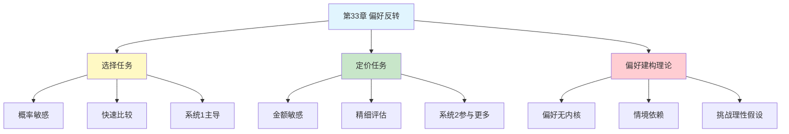

---

category: 
  - 书籍拆解

status: draft
chapter: 
number: 33
title: 偏好反转
links:

  - "[[第32章-两个自我]]"
  - "[[第31章-框架效应]]"
created: 2026-02-28
tags:
  - 思考快与慢
  - 偏好反转
  - 选择不一致
  - 决策偏误
  - 偏好建构
---

# 第33章 偏好反转

## 📍 章节定位

### 全书位置
> 第33章揭示了人类选择最令人不安的缺陷——偏好反转：我们对自己的偏好并不稳定，在不同的决策情境下，面对同样的选项会做出截然相反的选择。这直接挑战了经济学"稳定偏好"的基本假设。

- **全书核心问题**: 人的偏好是稳定的吗？我们的选择真的反映我们想要什么吗？
- **本章回答的问题**: 为什么我在选择时喜欢A，但让我给它定价时却觉得B更值钱？
- **角色类型**: 核心概念型（揭示偏好的建构本质）
- **论证位置**: 连接前景理论（第三部分）与行为经济学应用，是理性选择理论的致命挑战

### 章节序列
| 方向 | 章节标题 | 逻辑连接 |
|------|----------|----------|
| 前章 | [[第31章-框架效应]] | 框架影响选择，偏好反转揭示更深的不一致 |
| 后章 | [[第32章-两个自我]] | 偏好不稳定的哲学根源 |
| 整书 | [[思考快与慢-丹尼尔·卡尼曼]] | 挑战理性经济人假设的核心证据 |

### 一句话定位
> 第33章用一个反直觉的实验证明：你对自己的偏好并不了解——同样的两个选项，你选择时喜欢A，定价时却觉得B更值钱，而且你还觉得自己很一致。

---

## 🎯 核心观点

### 第一层：表层案例

| 案例名称 | 简要描述 | 页码 | 关键引文 |
|----------|----------|------|----------|
| P-bet vs $-bet实验 | 高概率小收益选项 vs 低概率大收益选项 | p.— | "选择时67%选P-bet，定价时86%给$-bet更高价" |
| 彩票选择悖论 | 确定的较小收益 vs 不确定的较大收益 | p.— | "同样的概率结构，不同任务偏好相反" |
| 医疗决策反转 | 选择治疗方案 vs 评估治疗价值 | p.— | "选择时保守，定价时冒险" |
| 消费者偏好实验 | 选择商品 vs 愿付价格 | p.— | "选的不一定是最肯花钱买的" |
| 投资者行为异常 | 选择投资标的 vs 估值定价 | p.— | "选股和估值的标准不一致" |

### 第二层：中层机制

| 机制名称 | 组成要素 | 因果链条 | 证据来源 |
|----------|----------|----------|----------|
| 任务依赖效应 | 选择任务 vs 定价任务 | 不同任务激活不同认知过程→偏好建构不同 | 经典偏好反转实验 |
| 概率敏感性差异 | 选择时看概率 vs 定价时看金额 | 系统1在定价时更关注奖金额度 | 实验对比研究 |
| 尺度效应 | 选择（0/1）vs 定价（连续） | 离散vs连续量表导致不同心理加工 | 认知心理学研究 |
| 锚定差异 | 不同任务的参考点不同 | 选择锚定概率，定价锚定金额 | 锚定效应研究 |
| 偏好建构理论 | 偏好不是发现，而是建构 | 任务特征塑造偏好→不稳定是本质 | Slovic, Lichtenstein研究 |

### 第三层：底层规律

| 规律陈述 | 抽象层级 | 知识连接 | 适用范围 |
|----------|----------|----------|----------|
| 偏好建构原理 | 认知心理学基础 | [[建构心理学]], [[决策理论]] | 所有偏好表达行为 |
| 任务框架效应 | 行为经济学定律 | [[第31章-框架效应]], [[助推理论]] | 决策情境设计 |
| 理性边界原理 | 经济学/哲学基础 | [[有限理性理论]], [[行为经济学]] | 挑战新古典经济学 |
| 系统1/2任务分工 | 认知心理学定律 | [[双系统理论]] | 选择vs评估任务 |

---

## 💬 降维翻译

### 观点1: 你的偏好会"变脸"

#### 原文表达
> "偏好反转是我们发现的最令人不安的现象之一。当被问及更喜欢哪个选项时，人们选择A；当被问及愿意为每个选项付多少钱时，人们却给B更高的价格。这不是偶尔的错误，而是系统性的模式。它揭示了一个深刻的事实：偏好不是预先存在于脑海中的稳定实体，而是在不同任务中被建构出来的。"

> p.—

#### 降维翻译（中学生能懂）
假设给你两个彩票：

- **彩票P**：90%概率赢10块，10%概率啥也没有
- **彩票$**：10%概率赢100块，90%概率啥也没有

问你"选哪个"，大多数人选P——毕竟90%的概率很稳。

问你"这两个彩票各值多少钱"，大多数人给$更高的价格——毕竟100块很诱人。

等等，你不是更喜欢P吗？怎么现在觉得$更值钱了？

这就是偏好反转——同样的你，同样的选项，换个问法，偏好就翻了。

#### 日常类比（奶奶能懂）
就像问孩子"想吃苹果还是橘子"，他选苹果。但问他"苹果和橘子各值多少钱"，他觉得橘子更贵。不是孩子撒谎，是他的偏好本身就不稳定。

#### 检验
- Q: 如果一个中学生问你这是什么意思？
- A: 你以为你知道自己想要什么，但其实你的偏好会跟着问法变。让你选和让你估价，你给出的答案可能完全相反。

### 观点2: 选择和定价用的大脑机制不同

#### 原文表达
> "为什么会出现偏好反转？关键在于选择任务和定价任务激活了不同的认知过程。选择是一个'比较'的过程，大脑会简化信息，抓住最显著的特征——在赌局中，概率往往是最显眼的。定价则是一个'评估'的过程，大脑会更仔细地考虑所有维度——奖金额度在这个时候获得更多权重。系统1和系统2在这两种任务中的参与程度不同。"

> p.—

#### 降维翻译（中学生能懂）
问你"选哪个"，你脑子走的是快车道：
- 快速比较
- 抓最明显的特征
- "90%概率"听起来很稳，就它了

问你"值多少钱"，你脑子走的是慢车道：
- 仔细评估
- 考虑更多因素
- "能赢100块"想想就很爽，给它更高的价

两种问法，两种加工模式，两种偏好。

#### 日常类比（奶奶能懂）
就像买衣服，让你"挑一件"你可能选舒服的，让你"估个价"你可能觉得好看的那件更值钱。不是你虚伪，是脑子在不同任务里用的"尺子"不一样。

#### 检验
- Q: 如果一个中学生问你这是什么意思？
- A: 你的大脑在不同任务里用的"思考方式"不一样。选的时候抓重点，定价的时候看全面。所以你的答案会变。

### 观点3: 偏好不是发现的，是建构的

#### 原文表达
> "偏好反转最深刻的启示是：偏好不是像口袋里的硬币一样，预先存在那里等着被'发现'。偏好是在决策过程中被'建构'出来的。决策情境的特征——问题的措辞、选项的呈现方式、任务的性质——都会影响最终表达出的偏好。这意味着'真实的偏好'可能根本不存在，或者说，偏好本身就是情境依赖的。"

> p.—

#### 降维翻译（中学生能懂）
你可能以为：我喜欢什么，心里有数，做选择只是把它"找出来"。

但研究发现：你根本没那么多"固定"的喜好。偏好是临时搭出来的——看你怎么问、怎么看、怎么想。

问法一变，偏好就变。

所以，别太相信"我就是这样的人"这种话。你只是"在这种情况下是这样的人"。

#### 日常类比（奶奶能懂）
就像去饭店，菜单怎么排、服务员怎么推荐、今天心情怎么样，都会影响你点什么菜。你不是"点宫保鸡丁的人"，你是"在这种菜单排列下、这种心情下点宫保鸡丁的人"。

#### 检验
- Q: 如果一个中学生问你这是什么意思？
- A: 你的喜好不是藏在脑子里的固定答案，而是每次做选择时临时拼出来的。问法不同、情境不同，拼出来的答案就不同。

---

## ✨ 金句库

### 原书金句
| 金句 | 页码 | 适用场景 |
|------|------|----------|
| "偏好不是发现的，而是建构的" | p.— | 认知心理科普 |
| "你选择时喜欢A，定价时却觉得B更值钱" | p.— | 决策偏误讨论 |
| "任务特征塑造偏好表达" | p.— | 行为经济学教学 |
| "偏好的不稳定性是系统性的，不是偶然的" | p.— | 理性批判 |

### 降维金句
| 金句 | 来源观点 | 适用场景 |
|------|----------|----------|
| "你的偏好会随问法变脸" | 偏好反转核心 | 决策智慧 |
| "选择和定价用的是两套脑子" | 任务依赖效应 | 认知科普 |
| "你不是知道自己想要什么的人" | 偏好建构论 | 自我认知 |
| "偏好是临时搭的，不是提前备的" | 建构主义视角 | 心理科普 |

## 🔗 当下映射

### 💰 财富应用
| 场景 | 具体行动 | 预期效果 | 风险提示 |
|------|----------|----------|----------|
| 投资决策 | 区分"选股"和"估值"两个阶段，警惕不一致 | 减少追涨杀跌 | 需要建立检查清单 |
| 消费选择 | 问自己"选它"和"愿意付多少钱"是否一致 | 减少冲动消费 | 可能浪费时间纠结 |
| 理财规划 | 用多种方式评估同一选项（选择/排序/定价） | 发现隐藏的偏好不一致 | 需要额外认知投入 |

### 💼 职场应用
| 场景 | 具体行动 | 所需能力 | 适用职级 |
|------|----------|----------|----------|
| 招聘决策 | 用多种任务形式评估候选人（选择/评分/排序） | 人力资源知识 | HR及管理者 |
| 产品定价 | 区分"用户选择偏好"和"用户价值感知" | 市场研究能力 | 产品及营销 |
| 绩效评估 | 警惕评估方式对结果的影响 | 管理心理学 | 所有管理者 |

### 🏠 生活应用
| 场景 | 具体行动 | 可行性 | 见效时间 |
|------|----------|--------|----------|
| 重要选择 | 用选择+排序+定价三种方式验证偏好一致性 | 高 | 即时生效 |
| 购物决策 | 先问"选哪个"再问"值多少钱"，看是否矛盾 | 高 | 即时生效 |
| 关系决策 | 区分"想在一起"和"愿意为关系付出多少" | 中 | 需要反思 |

### 72小时行动计划
1. **明天可以做的第一件事**: 找一个待做的选择，用"选择"和"定价"两种方式问自己，看看答案是否一致
2. **本周内可以尝试的事**: 在一次消费决策中，先快速选择再估价，记录两者差异
3. **需要准备资源才能做的事**: 建立一个"偏好一致性检查"清单，用于重要决策

---

## 🕸️ 章节关联

### 向上关联 → 整书
- **贡献**: 提供偏好不稳定的核心证据，挑战理性选择假设
- **位置**: 连接前景理论与行为经济学应用，是全书的"反理性"高潮

### 横向关联 → 章节间
| 章节编号 | 章节标题 | 关联类型 | 连接描述 |
|----------|----------|----------|----------|
| 第31章 | 框架效应 | 前置 | 框架影响选择，偏好反转揭示更深的不稳定 |
| 第14章 | 参考点和框架 | 相关 | 参考点不同导致偏好表达不同 |
| 第26章 | 概率权重 | 相关 | 选择和定价对概率的敏感度不同 |
| 第17章 | 冷热情感 | 相关 | 不同状态下偏好表达不同 |

### 向下关联 → 具体应用
| 应用场景 | 难度 | 前置知识 |
|----------|------|----------|
| 市场研究 | 中 | 调研方法论 |
| 政策设计 | 高 | 行为经济学 |
| 个人决策优化 | 中 | 自我认知 |

### 跨书关联 → 知识网络
| 书籍 | 概念 | 关系 | 备注 |
|------|------|------|------|
| [[思考快与慢-丹尼尔·卡尼曼]] | 偏好反转 | 同源 | 核心理论来源 |
| [[助推-理查德·塞勒]] | 选择架构 | 应用 | 利用偏好不稳定性设计助推 |
| [[怪诞行为学]] | 非理性决策 | 延伸 | 更多偏好异常现象 |
| [[选择的悖论-施瓦茨]] | 选择困难 | 相关 | 选择情境的复杂性 |

### 关联可视化

---

## ❓ 问答设计

### Q1: [记忆型问题]
**认知层次**: 记忆
**难度**: 低
**描述**: 什么是偏好反转？
**答案要点**:
- 人们对同一组选项的偏好随任务类型而改变
- 选择任务和定价任务可能导致相反的偏好表达
- 是偏好不稳定性的核心证据

### Q2: [理解型问题]
**认知层次**: 理解
**难度**: 中
**描述**: 为什么会出现偏好反转？
**答案要点**:
- 选择和定价激活不同的认知过程
- 选择时更关注概率，定价时更关注金额
- 任务特征塑造偏好表达

### Q3: [应用型问题]
**认知层次**: 应用
**难度**: 中
**描述**: 如何在重要决策中避免偏好反转的陷阱？
**答案要点**:
- 用多种任务形式评估同一选项
- 意识到问法会影响答案
- 建立"偏好一致性检查"清单

### Q4: [分析型问题]
**认知层次**: 分析
**难度**: 中
**描述**: 偏好反转如何挑战经济学"理性人"假设？
**答案要点**:
- 理性人假设偏好稳定、一致
- 偏好反转证明偏好随任务变化
- "真实偏好"可能不存在

### Q5: [创造型问题]
**认知层次**: 创造
**难度**: 高
**描述**: 如果让你设计一个"偏好诊断工具"，如何检测一个人的真实偏好？
**答案要点**:
- 使用多种任务形式（选择/排序/定价/匹配）
- 观察不同任务下的偏好一致性
- 承认"真实偏好"可能是情境建构的

### Q6: [理解型问题]
**认知层次**: 理解
**难度**: 中
**描述**: 偏好建构理论的核心观点是什么？
**答案要点**:
- 偏好不是预先存在的稳定实体
- 偏好是在决策过程中被建构的
- 情境和任务特征影响偏好表达

### Q7: [应用型问题]
**认知层次**: 应用
**难度**: 中
**描述**: 市场研究人员如何利用偏好反转的洞察？
**答案要点**:
- 区分"选择偏好"和"价值感知"
- 用多种方法测量消费者偏好
- 警惕单一测量方法的局限

### Q8: [分析型问题]
**认知层次**: 分析
**难度**: 高
**描述**: 偏好反转与系统1/2理论有什么关系？
**答案要点**:
- 选择任务更依赖系统1的快速比较
- 定价任务更多调动系统2的精细评估
- 两个系统的权重不同导致偏好表达不同

### Q9: [理解型问题]
**认知层次**: 理解
**难度**: 中
**描述**: P-bet和$-bet实验的核心发现是什么？
**答案要点**:
- P-bet：高概率小收益
- $-bet：低概率大收益
- 选择时多数人选P，定价时多数人给$更高价

### Q10: [创造型问题]
**认知层次**: 创造
**难度**: 高
**描述**: 如果偏好是建构的，那么"做真实的自己"这句话还有意义吗？
**答案要点**:
- "真实的自己"可能是情境依赖的
- 更准确的说法可能是"在特定情境下的自己"
- 自我认知需要包含对情境敏感性的理解

---
