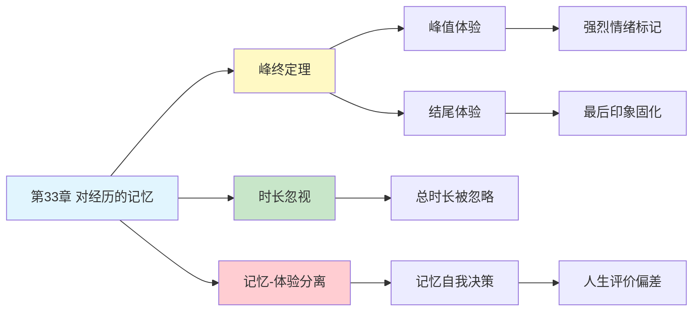

---

category: 
  - 书籍拆解

status: draft
chapter: 
number: 33
title: 对经历的记忆
links:

  - "[[第32章-两个自我]]"
  - "[[思考快与慢/_导航]]"
created: 2026-02-27
tags:
  - 思考快与慢
  - 峰终定理
  - 记忆自我
  - 体验自我
  - 时长忽视
  - 幸福感测量
---

# 第33章 对经历的记忆

## 📍 章节定位

### 全书位置
> 第33章是"两个自我"主题的核心展开，通过峰终定理揭示记忆自我如何评估经历——我们对一段经历的记忆几乎完全由峰值时刻和结尾时刻决定，经历的总时长反而被严重忽视。

- **全书核心问题**: 我们如何评估自己的人生？什么决定了幸福感？
- **本章回答的问题**: 为什么痛苦的手术和愉快的假期，回忆起来只取决于几个关键时刻？
- **角色类型**: 核心概念型（连接第32章两个自我与实际幸福感测量）
- **论证位置**: 承接第32章的哲学框架，转向可验证的心理学定律

### 章节序列
| 方向 | 章节标题 | 逻辑连接 |
|------|----------|----------|
| 前章 | [[第32章-两个自我]] | 提出体验自我vs记忆自我的框架 |
| 后章 | 生活幸福感章节 | 从经历记忆到生活满意度的延伸 |
| 整书 | [[思考快与慢-丹尼尔·卡尼曼]] | 峰终定理是行为经济学奠基发现 |

### 一句话定位
> 第33章揭示了一个反直觉的真相：人生的"长度"几乎不影响幸福感评估，只有"高峰"和"结尾"在记忆中留下痕迹——这解释了为什么医生最后温柔一下就能改变病人对整个治疗的评价。

---

## 🎯 核心观点

### 第一层：表层案例

| 案例名称 | 简要描述 | 页码 | 关键引文 |
|----------|----------|------|----------|
| 结肠镜实验 | 病人A检查8分钟（剧痛），病人B检查24分钟（同样剧痛但结尾较温和） | p.— | "病人B的疼痛总量是A的3倍，但记忆评价更好" |
| 冷水手浸实验 | 60秒冷水 vs 60秒冷水+30秒微温水 | p.— | "加了30秒'额外折磨'的版本反而记忆更好" |
| 假期满意度 | 假期中每日评分 vs 假期后整体回忆 | p.— | "当天体验与事后回忆几乎无关" |
| 演讲评价 | 演讲内容相同但结尾不同 | p.— | "精彩结尾能挽救整个平庸演讲" |
| 感情分手 | 一段关系的分手方式影响整体评价 | p.— | "分手的痛让整段感情在记忆中失色" |

### 第二层：中层机制

| 机制名称 | 组成要素 | 因果链条 | 证据来源 |
|----------|----------|----------|----------|
| 峰终定理 | 峰值体验 + 结尾体验 | 最强时刻+最后印象→记忆评价 | 结肠镜实验、冷水实验 |
| 时长忽视 | 总体时长 + 忽略机制 | 持续时间被记忆系统丢弃 | 疼痛记忆研究、假期评价研究 |
| 过程忽视 | 中间过程 + 选择性编码 | 经历过程被压缩→只保留关键时刻 | 记忆编码研究 |
| 叙事简化 | 复杂经历 → 简单故事 | 大脑需要"好故事"→只取峰终 | 叙事心理学 |

### 第三层：底层规律

| 规律陈述 | 抽象层级 | 知识连接 | 适用范围 |
|----------|----------|----------|----------|
| 峰终定理 | 认知心理学定律 | [[记忆心理学]], [[幸福感研究]] | 所有经历评价 |
| 时长忽视定律 | 记忆认知规律 | [[时间感知理论]] | 持续性经历评价 |
| 记忆-体验分离原则 | 哲学/心理学基础 | [[自我理论]], [[意识哲学]] | 人生意义判断 |
| 系统1记忆压缩 | 认知经济原则 | [[双系统理论]] | 快速经历评价 |

---

## 💬 降维翻译

### 观点1: 峰终定理——人生只记两个点

#### 原文表达
> "峰终定理（Peak-End Rule）是我们最反直觉的发现之一：人们对一段经历的整体评价，几乎完全取决于两个因素——最强烈的时刻（峰）和最后的时刻（终）。整个经历的持续时间对记忆评价的影响微乎其微。这意味着一段24分钟的疼痛经历，如果结尾比8分钟的疼痛经历温和，整体记忆评价反而更好。"

> p.—

#### 降维翻译（中学生能懂）
想象你要评价一次旅行、一份工作、一段感情。你脑子里会怎么算？

大多数人会以为：把每天的感受加起来，算个平均分。

但大脑根本不这么干。它只抓两个点：
1. **最爽或最惨的那一瞬间**（峰）
2. **最后的印象**（终）

中间过了多久，重要吗？几乎不重要。

所以：
- 痛苦的手术，最后温柔收尾，回忆起来就不那么糟
- 一段感情，分手很难看，回忆起来全是灰
- 一个假期，最后两天下雨，整个假期印象都打折

#### 日常类比（奶奶能懂）
就像看戏，演了三个小时你只记得高潮那一幕和大结局。中间演了多久、演了多少，散场就忘了。

#### 检验
- Q: 如果一个中学生问你这是什么意思？
- A: 评价一段经历，大脑只记两件事：最刺激的时候和结束的时候。时间长短几乎不影响记忆。

### 观点2: 时长忽视——时间是记忆的隐形人

#### 原文表达
> "时长忽视（Duration Neglect）是峰终定理的伴生现象。当被要求评价一段经历的'整体'感受时，人们几乎完全忽略经历持续了多久。10分钟的剧痛和50分钟的剧痛，如果峰值和结尾相似，记忆评价也相似。这一发现对医疗、司法、幸福研究都有深远影响。"

> p.—

#### 降维翻译（中学生能懂）
痛苦的检查做了10分钟 vs 做了50分钟，哪个印象更差？

你肯定想：50分钟更惨啊，多受了40分钟的罪。

但研究发现：如果两种情况最痛的程度一样、结束的方式一样，事后回忆起来，差别不大。

奇怪吗？非常奇怪。但记忆就是这么工作的——它不记"多久"，只记"多痛"和"怎么结束"。

这意味着：你受的苦，时间长度不算数。

#### 日常类比（奶奶能懂）
就像被人骂了10分钟和骂了1小时，如果骂得最难听的话一样、最后收尾的话一样，你回忆起来气差不多。

#### 检验
- Q: 如果一个中学生问你这是什么意思？
- A: 记忆有个bug：它不关心时间长短。你难受了多久不重要，重要的是当时多难受、最后怎么结束的。

### 观点3: 记忆自我是人生评价的裁判

#### 原文表达
> "我们的人生选择，很大程度上是由记忆自我决定的。当决定是否重复某段经历、是否推荐给他人、如何评价自己的一生时，是记忆自我在发言——而记忆自我只掌握了峰终信息，完全丢弃了过程和时长。这导致了系统性的决策偏差。"

> p.—

#### 降维翻译（中学生能懂）
你体内有个"记忆自我"，它负责回答这些问题：
- 这段感情值不值得？
- 这份工作要不要继续？
- 这一生过得怎么样？

问题是，这个裁判手里的证据不完整。它只看了"高峰"和"结尾"，中间95%的时间都扔了。

所以你可能：
- 明明每天很幸福，但因为分手很难看，觉得"这段感情不好"
- 明明每天很痛苦，但因为最后拿了个奖，觉得"这工作挺好"
- 明明人生很长，但只记得几个关键时刻

#### 日常类比（奶奶能懂）
就像用两个截图来评价一部电影。你只看了高潮和大结局，中间演了什么、演了多久，你一概不知。但你就要下结论了。

#### 检验
- Q: 如果一个中学生问你这是什么意思？
- A: 我们评价人生靠的是记忆，但记忆只抓几个关键时刻。这意味着你对人生的评价可能严重失真。

---

## ✨ 金句库

### 原书金句
| 金句 | 页码 | 适用场景 |
|------|------|----------|
| "人生由高峰和结尾定义" | p.— | 人生哲学 |
| "时长在记忆里没有分量" | p.— | 记忆心理学 |
| "痛苦的总量不重要，峰值和结尾才重要" | p.— | 医疗体验设计 |
| "记忆是人生最不诚实的编辑" | p.— | 认知反思 |

### 降维金句
| 金句 | 来源观点 | 适用场景 |
|------|----------|----------|
| "你活一辈子，但只记住几个瞬间" | 时长忽视 | 人生反思 |
| "结尾决定故事的温度" | 峰终定理 | 叙事创作 |
| "时间是记忆的隐形人" | 时长忽视 | 认知科普 |
| "人生不记长度，只记高峰和句号" | 峰终定理 | 人生哲学 |

## 🔗 当下映射

### 💰 财富应用
| 场景 | 具体行动 | 预期效果 | 风险提示 |
|------|----------|----------|----------|
| 投资回顾 | 用客观数据而非峰终记忆评估投资表现 | 减少情绪化决策 | 需要建立记录习惯 |
| 消费体验 | 在重要消费结尾设计美好体验 | 提升复购率和口碑 | 可能增加成本 |
| 职业规划 | 关注日常体验质量而非仅看终点 | 更可持续的职业选择 | 两个自我可能冲突 |

### 💼 职场应用
| 场景 | 具体行动 | 所需能力 | 适用职级 |
|------|----------|----------|----------|
| 项目收尾 | 精心设计项目结尾的庆祝和总结 | 项目管理 | 所有管理者 |
| 员工离职 | 确保离职体验体面、温暖 | 离职管理 | HR及管理层 |
| 客户服务 | 在服务结尾制造惊喜时刻 | 服务设计 | 客户相关岗位 |
| 汇报演讲 | 把最重要的内容放在结尾 | 沟通技巧 | 所有层级 |

### 🏠 生活应用
| 场景 | 具体行动 | 可行性 | 见效时间 |
|------|----------|--------|----------|
| 亲密关系 | 重视每次互动的结尾印象 | 高 | 即时生效 |
| 旅行规划 | 确保旅行最后一天精彩 | 高 | 即时生效 |
| 亲子教育 | 在每天结束时留下温暖互动 | 高 | 长期见效 |
| 人生规划 | 有意识地创造记忆高峰 | 中 | 长期见效 |

### 72小时行动计划
1. **明天可以做的第一件事**: 回忆最近一段重要经历，找出峰值和结尾，看看它们如何定义你的记忆
2. **本周内可以尝试的事**: 为一件正在进行的事精心设计结尾，观察自己和他人记忆效果的变化
3. **需要准备资源才能做的事**: 建立体验日记，每天记录当天体验的峰终，一周后对比记忆评价的差异

---

## 🕸️ 章节关联

### 向上关联 → 整书
- **贡献**: 提供可验证的心理学定律，支撑"两个自我"的哲学框架
- **位置**: 连接理论（第32章）与应用（幸福感测量），是全书最具实用价值的章节之一

### 横向关联 → 章节间
| 章节编号 | 章节标题 | 关联类型 | 连接描述 |
|----------|----------|----------|----------|
| 第32章 | 两个自我 | 前置 | 体验自我vs记忆自我的框架，峰终定理是记忆自我的核心运作规律 |
| 第14章 | 参考点和框架 | 相关 | 参考点影响价值评估，峰终是特殊的参考点选择 |
| 第6章 | 回忆的便利性 | 相关 | 可用性启发法与峰终定理共享"记忆选择"机制 |
| 第15章 | 禀赋效应 | 相关 | 损失厌恶导致结尾的负面权重更大 |

### 向下关联 → 具体应用
| 应用场景 | 难度 | 前置知识 |
|----------|------|----------|
| 医疗体验设计 | 中 | 用户体验知识 |
| 客户旅程设计 | 中 | 服务设计方法论 |
| 人生规划 | 高 | 哲学思考能力 |
| 演讲/汇报技巧 | 低 | 基本沟通能力 |

### 跨书关联 → 知识网络
| 书籍 | 概念 | 关系 | 备注 |
|------|------|------|------|
| [[思考快与慢-丹尼尔·卡尼曼]] | 峰终定理 | 同源 | 核心理论来源 |
| [[记忆的七宗罪-沙克特]] | 记忆偏见 | 延伸 | 记忆的系统性错误 |
| [[助推-理查德·塞勒]] | 选择架构 | 应用 | 利用峰终设计助推 |
| [[心流-契克森米哈赖]] | 体验自我 | 对比 | 关注当下体验而非记忆评价 |

### 关联可视化

---

## ❓ 问答设计

### Q1: [记忆型问题]
**认知层次**: 记忆
**难度**: 低
**描述**: 什么是峰终定理？
**答案要点**:
- 人们对经历的评价主要取决于两个时刻
- 峰值（最强烈的体验）和结尾（最后的体验）
- 经历的持续时间几乎不影响评价

### Q2: [理解型问题]
**认知层次**: 理解
**难度**: 中
**描述**: 为什么结肠镜实验中，经历更长时间痛苦的病人反而记忆评价更好？
**答案要点**:
- 病人B的结尾更温和
- 峰终定理决定记忆评价
- 总疼痛量被时长忽视

### Q3: [应用型问题]
**认知层次**: 应用
**难度**: 中
**描述**: 医生如何利用峰终定理改善病人的治疗体验？
**答案要点**:
- 管理峰值痛苦（分散注意力、镇痛）
- 精心设计治疗结尾（温柔收尾、温暖告别）
- 不必过度担心治疗时长

### Q4: [分析型问题]
**认知层次**: 分析
**难度**: 中
**描述**: 峰终定理与损失厌恶有什么关系？
**答案要点**:
- 负面峰值的权重更高
- 结尾的负面体验影响更大
- 损失厌恶放大了负面峰终的作用

### Q5: [创造型问题]
**认知层次**: 创造
**难度**: 高
**描述**: 如何设计一次旅行，既让体验自我满意，又让记忆自我满意？
**答案要点**:
- 确保日常体验舒适（体验自我）
- 安排1-2个精彩的高峰时刻（记忆自我）
- 精心设计旅行的最后一天（峰终定理）

### Q6: [理解型问题]
**认知层次**: 理解
**难度**: 中
**描述**: 什么是时长忽视？它有什么实际意义？
**答案要点**:
- 人们评价经历时几乎不考虑持续时间
- 意味着痛苦的"总量"在记忆中不重要
- 对医疗、司法、幸福研究都有启示

### Q7: [应用型问题]
**认知层次**: 应用
**难度**: 中
**描述**: 在演讲中如何运用峰终定理？
**答案要点**:
- 设计一个情绪高潮（最精彩的内容）
- 把最重要的结论放在结尾
- 结尾要简洁有力、令人难忘

### Q8: [分析型问题]
**认知层次**: 分析
**难度**: 高
**描述**: 峰终定理如何体现系统1的特征？
**答案要点**:
- 快速、自动的记忆评价
- 选择性提取关键信息
- 忽略复杂计算（如平均、求和）
- 符合认知经济原则

### Q9: [理解型问题]
**认知层次**: 高
**描述**: 为什么我们的人生选择更多由记忆自我而非体验自我决定？
**答案要点**:
- 决策需要回顾和比较
- 回顾依赖记忆，记忆只有峰终
- 体验自我无法"发言"，只能活在当下

### Q10: [创造型问题]
**认知层次**: 创造
**难度**: 高
**描述**: 如果让你设计一个"幸福感追踪系统"，如何同时照顾体验自我和记忆自我？
**答案要点**:
- 实时记录当日体验评分（体验自我）
- 标记每周/每月的峰值时刻（记忆自我）
- 每周回顾时确保结尾积极（峰终定理）
- 定期比较实时评分与记忆评价的差异

---
