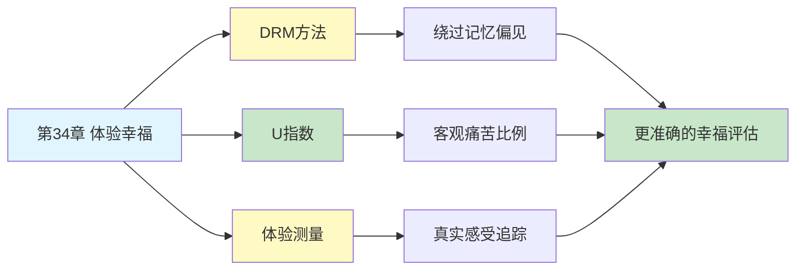

---

category: 
  - 书籍拆解

status: draft
chapter: 
number: 34
title: 体验幸福
links:

  - "[[第32章-两个自我]]"
  - "[[思考快与慢/_导航]]"
created: 2026-02-27
tags:
  - 思考快与慢
  - 体验幸福
  - 主观幸福感
  - 生活质量测度
  - DRM方法
  - 体验效用
---

# 第34章 体验幸福

## 📍 章节定位

### 全书位置
> 第34章是全书幸福研究的实践应用——探讨如何科学地测量"体验幸福"，将第32章的"两个自我"理论转化为可操作的测量方法，揭示主观幸福感的科学测度之路。

- **全书核心问题**: 什么是幸福？如何科学地测量幸福？
- **本章回答的问题**: 如何绕过记忆的偏见，直接测量当下的体验幸福？生活质量可以用什么指标来衡量？
- **角色类型**: 方法论型（将理论转化为可操作的研究工具）
- **论证位置**: 全书幸福研究的实践总结，是方法论与政策应用的桥梁

### 章节序列
| 方向 | 章节标题 | 逻辑连接 |
|------|----------|----------|
| 前章 | [[第32章-两个自我]] | 理论基础：体验自我与记忆自我的分离 |
| 后章 | 全书总结 | 方法论是理论走向实践的桥梁 |
| 整书 | [[思考快与慢-丹尼尔·卡尼曼]] | 幸福研究的实践应用 |

### 一句话定位
> 第34章展示了测量体验幸福的方法论——用"一天体验重构法"绕过记忆偏见，直接捕捉当下的感受，为科学评估生活质量提供了一条可行之路。

---

## 🎯 核心观点

### 第一层：表层案例

| 案例名称 | 简要描述 | 页码 | 关键引文 |
|----------|----------|------|----------|
| DRM实验 | 让被试按时间顺序重构前一天的活动与感受 | p.— | "按小时重构当天的体验" |
| 幸福感问卷 | 传统生活满意度问卷与体验测量的对比 | p.— | "问'你有多幸福'得到的是记忆而非体验" |
| 时间利用研究 | 记录人们如何分配时间与对应的情绪 | p.— | "知道时间花在哪里" |
| U指数 | 测量不愉快时间占总时间的比例 | p.— | "用客观指标替代主观评价" |
| 跨国比较 | 不同国家体验幸福感的测量结果 | p.— | "GDP与体验幸福不完全相关" |

### 第二层：中层机制

| 机制名称 | 组成要素 | 因果链条 | 证据来源 |
|----------|----------|----------|----------|
| 体验重构法 | 时间分割 + 活动记录 + 情绪标注 | 按时间顺序→逐一回忆活动→标注当时感受→汇总分析 | DRM研究 |
| 记忆-体验分离 | 记忆偏见 + 峰终定律 | 事后回忆→峰终主导→忽略时长→偏差评价 | 第32章实验 |
| U指数机制 | 消极情绪时长 + 总时长 | 不愉快时间/总时间→客观痛苦比例 | 时间利用研究 |
| 体验效用测量 | 当下感受 + 强度标注 | 实时记录→避免记忆重构→更准确评估 | 体验抽样法 |

### 第三层：底层规律

| 规律陈述 | 抽象层级 | 知识连接 | 适用范围 |
|----------|----------|----------|----------|
| 体验可测量原理 | 方法论基础 | 心理测量学, 体验抽样法 | 主观幸福感研究 |
| 记忆不可靠原理 | 认知心理学 | 记忆重构理论, 峰终定律 | 所有回顾性研究 |
| 客观-主观分离原则 | 科学方法论 | 测量理论, 社会科学方法 | 社会科学测量 |

---

## 💬 降维翻译

### 观点1: 问"你幸福吗"得到的是谎言

#### 原文表达
> "当我们问一个人'你有多幸福'时，他给出的答案并不反映他真实的体验，而是他的记忆自我在作答。记忆自我会用几个关键时刻来概括整个人生，这正是峰终定律的体现。要真正知道一个人有多幸福，不能问他'你觉得怎么样'，而要问他'昨天下午3点你在做什么，感受如何'。"

> p.—

#### 降维翻译（中学生能懂）
想象两种问法：

**问法A**："你这辈子幸福吗？"
- 你会想：嗯，结婚那天很幸福，升职那天很开心...好像是幸福的吧？
- 你用几个高光时刻来回答

**问法B**："昨天下午你在干什么？当时感觉怎么样？"
- 你会想：昨天下午在开会，有点无聊...然后刷手机，还行...
- 你报告的是真实体验

问题是：大多数人用问法A来研究幸福，但得到的其实是"记忆的自我评价"，不是"真实的生活体验"。

#### 日常类比（奶奶能懂）
就像问你"这饭好吃吗"——你可能说"好吃"，但那是因为最后一道菜是甜点。如果问你"第三口什么味道"，你才会认真回想。

问"幸福吗"，是问总印象；问"昨天下午怎么样"，是问真实体验。

#### 检验
- Q: 如果一个中学生问你这是什么意思？
- A: 问"你幸福吗"得到的答案是回忆，不是真实体验。要问"昨天具体做了什么"，才能知道真正过得怎么样。

### 观点2: 一天体验重构法——绕过记忆的作弊

#### 原文表达
> "为了绕过记忆的系统性偏见，研究者发明了'一天体验重构法'（Day Reconstruction Method, DRM）。被试被要求按时间顺序，详细回忆前一天从起床到睡觉的每一个片段：在做什么、和谁在一起、当时感受如何。这种方法虽然仍是回忆，但通过结构化的时间线，大大减少了记忆重构的空间。"

> p.—

#### 降维翻译（中学生能懂）
怎么知道一个人真的过得好不好？

**笨办法**：问他"你幸福吗？" → 他会美化自己
**聪明办法**：让他像写日记一样，把昨天的事一件件写出来，每件事标注当时的心情。

比如：
- 7:00 起床 → 烦躁
- 8:00 上班路上 → 无聊
- 9:00 开会 → 有点焦虑
- 12:00 午饭 → 开心

这样就把"记忆的滤镜"拆掉了，只剩下真实的体验。

#### 日常类比（奶奶能懂）
就像查账。问"你花了多少钱"，人会乱说。但把每一笔消费记录拿出来，就赖不掉了。DRM就是让幸福"记账"。

#### 检验
- Q: 如果一个中学生问你这是什么意思？
- A: 让人把昨天每一小时干了什么都写出来，包括当时的心情，这样就不能用"我整体很幸福"来骗人了。

### 观点3: U指数——用数字说话

#### 原文表达
> "U指数（不愉快指数）是一个更客观的指标：在一天中，经历不愉快情绪的时间占总时间的比例。比如一个人一天有2小时处于焦虑、愤怒或悲伤状态，16小时醒着，那他的U指数就是2/16=12.5%。这个指标的优点是：它不依赖主观的'满意度评分'，而是直接测量负面体验的时间占比。"

> p.—

#### 降维翻译（中学生能懂）
怎么比较谁更幸福？

**旧办法**：问"1到10分，你有多幸福？" → 有人打7分，有人打8分，不知道什么意思

**新办法**：算算"不开心的时间占多少"
- 小明：一天16小时醒着，2小时不开心 → U指数=12.5%
- 小红：一天16小时醒着，4小时不开心 → U指数=25%

谁更幸福？一目了然。小红的不开心时间是小明的两倍。

#### 日常类比（奶奶能懂）
就像体检报告。不说"你觉得身体怎么样"，而是说"你血压多少、血糖多少"。U指数就是幸福的"体检指标"。

#### 检验
- Q: 如果一个中学生问你这是什么意思？
- A: 把一天里不开心的时间加起来，除以总时间，就得到一个"痛苦比例"。这个数字越小，说明日子过得越顺。

### 观点4: 有钱不等于体验幸福

#### 原文表达
> "研究发现，收入与体验幸福感的相关性比人们想象的要弱得多。在一定收入水平之上（如年入7.5万美元），收入的增加几乎不再提升体验幸福感。但收入与'生活满意度'（记忆自我的评价）持续相关——越有钱的人越觉得'我这辈子过得不错'，但他们当下的体验并不比中等收入者更幸福。"

> p.—

#### 降维翻译（中学生能懂）
有钱人更幸福吗？

**用"满意度"来问**：
- 年入10万的人：我觉得还行
- 年入100万的人：我觉得挺幸福
- 结论：越有钱越幸福？

**用"体验"来问**：
- 年入10万的人：昨天下午和朋友聊天，挺开心的
- 年入100万的人：昨天下午开董事会，有点累
- 结论：好像差不多？

为什么？因为"我觉得我幸福"是记忆自我在说话，而"我昨天开心吗"是体验自我在说话。钱能让记忆自我满意，但不能让体验自我更开心。

#### 日常类比（奶奶能懂）
就像住酒店。五星级酒店的人会说"我住得很好"，但如果问他昨天晚上睡得香不香，可能和住快捷酒店的人差不多。房间再豪华，睡觉的时候眼睛是闭着的。

#### 检验
- Q: 如果一个中学生问你这是什么意思？
- A: 有钱人觉得自己幸福，但每天的真实感受不一定比普通人更好。钱买得到"满意"，买不到"快乐"。

---

## ✨ 金句库

### 原书金句
| 金句 | 页码 | 适用场景 |
|------|------|----------|
| "问'你幸福吗'得到的不是体验，是记忆" | p.— | 幸福感研究 |
| "体验是当下的，评价是事后的" | p.— | 认知心理学 |
| "钱能提升满意度，但买不到更多快乐" | p.— | 财富与幸福 |
| "U指数：用痛苦时间占比来衡量幸福" | p.— | 测量方法论 |
| "要测量幸福，先绕过记忆的滤镜" | p.— | 科学方法论 |

### 降维金句
| 金句 | 来源观点 | 适用场景 |
|------|----------|----------|
| "问'你幸福吗'就像问'这饭好吃吗'，答案是被最后一口决定的" | 记忆偏见 | 日常对话 |
| "幸福不是评价，是每一小时的感受" | 体验测量 | 人生哲学 |
| "有钱人觉得自己幸福，但每天不一定更开心" | 收入与幸福 | 财富话题 |
| "U指数就是幸福的体检报告" | 测量方法 | 科普讲解 |

## 🔗 当下映射

### 💰 财富应用
| 场景 | 具体行动 | 预期效果 | 风险提示 |
|------|----------|----------|----------|
| 收入决策 | 不再以"幸福感"作为加薪的唯一理由 | 更理性的财务规划 | 可能忽视体验改善 |
| 消费选择 | 关注消费对"日常体验"的影响 | 提升真实幸福感 | 需要细致追踪 |
| 理财目标 | 设定"体验幸福"目标而非仅财富目标 | 更有意义的人生规划 | 难以量化 |

### 💼 职场应用
| 场景 | 具体行动 | 所需能力 | 适用职级 |
|------|----------|----------|----------|
| 工作满意度评估 | 记录每小时感受而非仅问"满意吗" | 自我觉察能力 | 所有层级 |
| 职业选择 | 考虑日常工作体验而非仅薪资职位 | 体验评估能力 | 求职者 |
| 团队管理 | 关注团队日常情绪而非仅绩效 | 情绪感知能力 | 管理者 |

### 🏠 生活应用
| 场景 | 具体行动 | 可行性 | 见效时间 |
|------|----------|--------|----------|
| 日常记录 | 尝试用简化版DRM记录一周的体验 | 高 | 即时生效 |
| 时间分配 | 分析时间花在哪些体验上 | 高 | 一周见效 |
| 生活调整 | 减少"高U值"活动，增加积极体验 | 中 | 持续改善 |

### 72小时行动计划
1. **明天可以做的第一件事**: 记录今天每个主要活动时的情绪状态，计算自己的"U指数"
2. **本周内可以尝试的事**: 做一次完整的"一天体验重构"，找出最不愉快的时间段
3. **需要准备资源才能做的事**: 建立一个简单的体验追踪表格，长期记录日常感受

---

## 🕸️ 章节关联

### 向上关联 → 整书
- **贡献**: 将第32章的"两个自我"理论转化为可操作的测量方法
- **位置**: 幸福研究的实践应用，是理论与实践的桥梁

### 横向关联 → 章节间
| 章节编号 | 章节标题 | 关联类型 | 连接描述 |
|----------|----------|----------|----------|
| 第32章 | 两个自我 | 前置理论 | DRM是为了测量"体验自我"而发明的 |
| 第24章 | 被金钱扭曲的心灵 | 相关 | 金钱启动影响体验但不影响满意度评价 |
| 第1章 | 双系统理论 | 基础 | 系统1的体验vs系统2的评价 |

### 向下关联 → 具体应用
| 应用场景 | 难度 | 前置知识 |
|----------|------|----------|
| 个人幸福追踪 | 低 | 自我觉察能力 |
| 公共政策评估 | 高 | 统计学基础 |
| 企业员工满意度 | 中 | 组织行为学 |

### 跨书关联 → 知识网络
| 书籍 | 概念 | 关系 | 备注 |
|------|------|------|------|
| [[思考快与慢-丹尼尔·卡尼曼]] | 体验幸福 | 同源 | 核心理论来源 |
| 幸福的方法-本-沙哈尔 | 幸福感 | 互补 | 实践导向的幸福感 |
| 金钱心理学 | 财富与幸福 | 相关 | 收入与幸福的关系 |
| [[助推-理查德·塞勒]] | 政策评估 | 延伸 | 用幸福感指标评估政策 |

### 关联可视化

---

## ❓ 问答设计

### Q1: [记忆型问题]
**认知层次**: 记忆
**难度**: 低
**描述**: 什么是DRM（一天体验重构法）？
**答案要点**:
- 让被试按时间顺序回忆前一天的活动
- 记录每个活动的情绪状态
- 通过结构化时间线减少记忆偏见

### Q2: [理解型问题]
**认知层次**: 理解
**难度**: 中
**描述**: 为什么问"你幸福吗"不能反映真实体验？
**答案要点**:
- 这类问题激活的是记忆自我
- 记忆自我受峰终定律影响
- 用少数关键时刻概括整体
- 忽略了大部分日常体验

### Q3: [应用型问题]
**认知层次**: 应用
**难度**: 中
**描述**: 如何用U指数来比较两个人的幸福感？
**答案要点**:
- 计算每个人不愉快时间占总时间比例
- 比例越低说明体验越好
- 不依赖主观满意度评分
- 提供客观可比较的指标

### Q4: [分析型问题]
**认知层次**: 分析
**难度**: 中
**描述**: 为什么收入与体验幸福的相关性较弱？
**答案要点**:
- 体验幸福由日常感受决定
- 收入提升主要影响记忆自我的评价
- 一定收入水平后边际效应递减
- 钱买得到满意但买不到更多快乐时刻

### Q5: [创造型问题]
**认知层次**: 创造
**难度**: 高
**描述**: 设计一个简化版的个人体验追踪方案？
**答案要点**:
- 选择3-5个核心情绪维度
- 每天记录主要活动及对应情绪
- 周末计算各活动的时间占比和情绪均值
- 识别需要调整的活动模式

### Q6: [理解型问题]
**认知层次**: 理解
**难度**: 中
**描述**: DRM方法如何绕过记忆的系统性偏见？
**答案要点**:
- 按时间顺序强制回忆
- 把整体体验切分成小片段
- 每个片段单独评价
- 减少峰终定律的影响

### Q7: [应用型问题]
**认知层次**: 应用
**难度**: 中
**描述**: 企业如何用体验测量来改善员工幸福感？
**答案要点**:
- 不只问"满意度"，追踪日常体验
- 识别高U值的时间段和活动
- 针对性改善负面体验来源
- 关注体验而非仅关注评价

### Q8: [分析型问题]
**认知层次**: 分析
**难度**: 高
**描述**: 体验测量方法对公共政策有什么启示？
**答案要点**:
- GDP不是唯一的幸福指标
- 需要测量公民的日常体验
- 政策效果要看体验改善而非满意度变化
- 关注减少痛苦时间而非增加满意评价

### Q9: [理解型问题]
**认知层次**: 高
**描述**: 本章与第32章"两个自我"有什么关系？
**答案要点**:
- 第32章提出理论：体验自我vs记忆自我
- 本章提供方法：如何测量体验自我
- 理论指导方法，方法验证理论
- 共同构成幸福研究的完整框架

### Q10: [创造型问题]
**认知层次**: 创造
**难度**: 高
**描述**: 如果让你设计一个APP来追踪日常体验幸福，核心功能应该是什么？
**答案要点**:
- 时间轴记录每日活动
- 快速情绪标注（简单滑动）
- 自动计算U指数和情绪分布
- 识别幸福/不幸福的活动模式
- 提供改善建议

---
