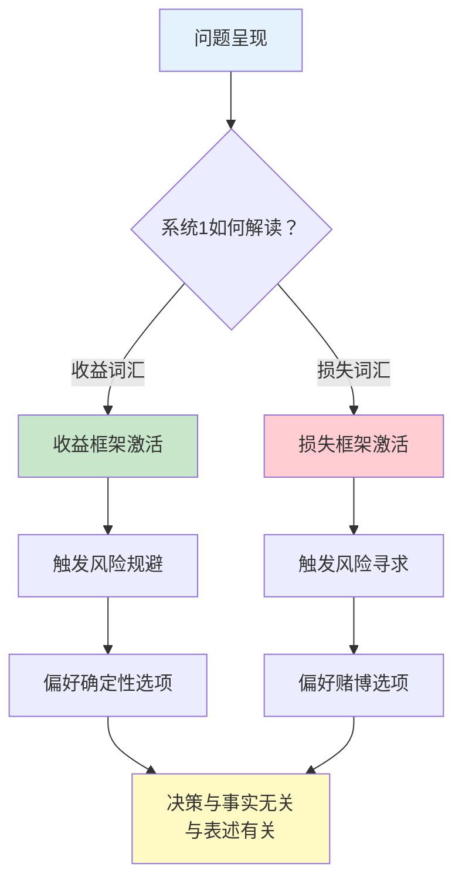
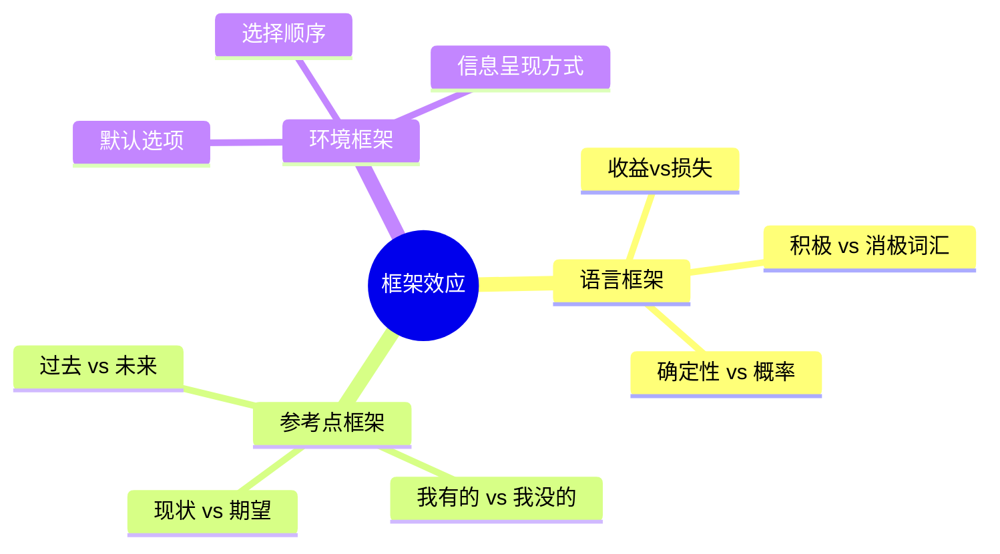
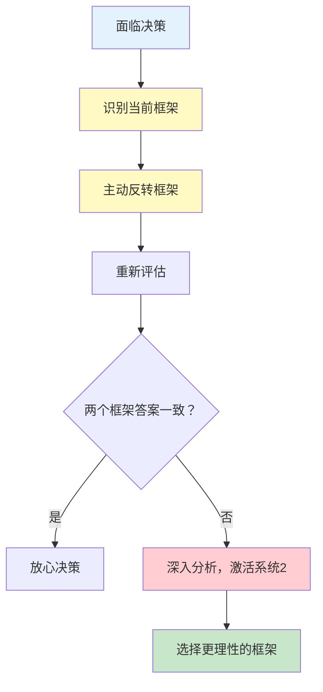
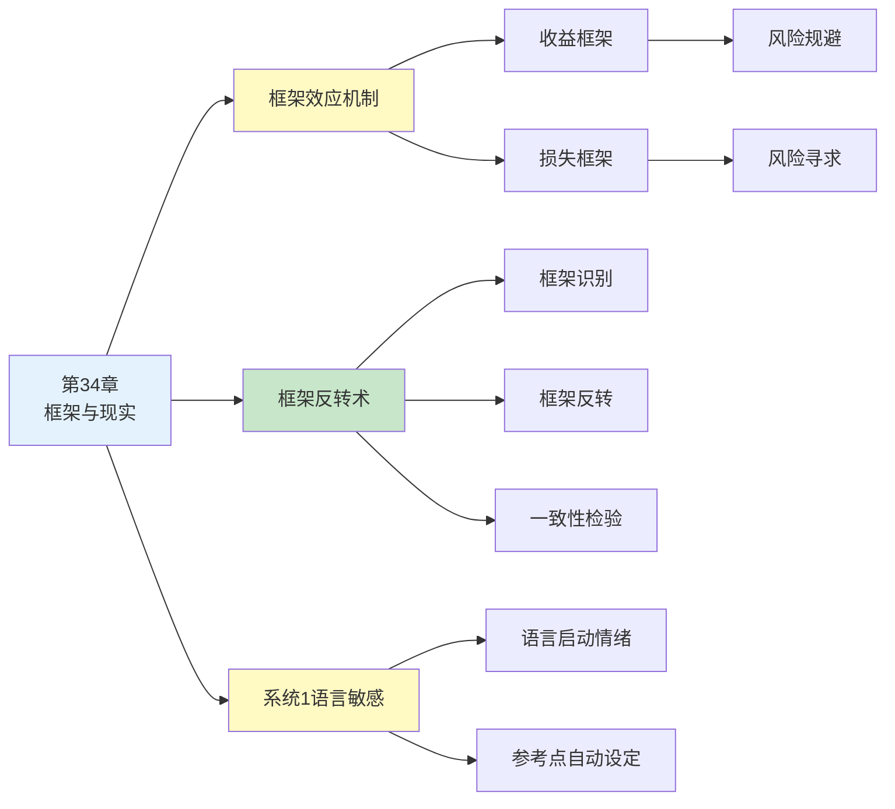

---

category: 
  - 书籍拆解

status: draft
chapter: 
number: 34
title: 框架与现实
links:

  - "[[第14章-参考点和框架]]"
  - "[[第31章-框架效应]]"
  - "[[第13章-拒绝风险的穷人和寻求风险的富人]]"
created: 2026-02-28
tags:
  - 思考快与慢
  - 框架效应
  - 决策偏误
  - 系统1
  - 前景理论
---

# 第34章 框架与现实

## 📍 章节定位

### 全书位置
> 第34章探讨框架效应的核心机制——同样的事实，不同的表述，如何导致截然不同的选择。这是系统1被语言"操控"的典型案例，也是理解决策非理性的关键窗口。

- **全书核心问题**: 为什么同样的信息，不同的呈现方式会改变人的决策？
- **本章回答的问题**: 框架效应如何运作？为什么系统1对表述方式如此敏感？
- **角色类型**: 理论深化型（框架效应的机制剖析）
- **论证位置**: 承接参考点理论，深化框架效应的应用场景

### 章节序列
| 方向 | 章节标题 | 逻辑连接 |
|------|----------|----------|
| 前章 | [[第14章-参考点和框架]] | 框架效应的理论基础 |
| 相关 | [[第31章-框架效应]] | 框架效应的更多案例 |
| 延伸 | [[第13章-拒绝风险的穷人和寻求风险的富人]] | 损失厌恶与风险偏好 |

### 一句话定位
> 第34章揭示了一个令人不安的真相：你以为你在做理性决策，但其实你在对"问题的表述方式"做反应，而不是对"问题的本质"做反应。

---

## 🎯 核心观点

### 观点1：框架效应——表述即决策

#### 【表层】现象层

**经典案例：亚洲病问题**

| 表述框架 | 问题内容 | 选择结果 |
|----------|----------|----------|
| **收益框架** | A方案：200人会获救<br/>B方案：1/3概率600人获救，2/3概率无人获救 | **72%选A**（确定性偏好） |
| **损失框架** | A方案：400人会死亡<br/>B方案：1/3概率无人死亡，2/3概率600人死亡 | **78%选B**（风险寻求） |

**关键发现**：
- 两道题说的是完全一样的事（救200人 = 死400人）
- 但表述方式不同，选择结果完全反转
- 系统1对"救命"和"死亡"的情绪反应不同

**更多案例**：

| 案例名称 | 表述A | 表述B | 选择变化 |
|----------|-------|-------|----------|
| 肥肉标注 | "80%瘦肉" | "20%肥肉" | A更受欢迎 |
| 手术风险 | "成功率90%" | "失败率10%" | A更被接受 |
| 信用卡附加费 | "现金折扣" | "信用卡附加费" | A更少被抵制 |
| 打折促销 | "立省30元" | "原价恢复，之前省30" | A更有吸引力 |

#### 【中层】机制层

**框架效应的心理机制**：



**核心机制**：
1. **语言启动情绪**：系统1对"救""省""赚"等词产生积极反应，对"死""亏""损失"产生消极反应
2. **参考点自动设定**：收益框架把参考点设为"可能失去的"，损失框架把参考点设为"可能保住的"
3. **系统2懒惰**：大多数人不会转换框架重新思考，系统1的直觉反应就成了最终决定

#### 【底层】规律层

> **框架效应定律**：当同一个决策问题的不同表述导致不同的选择偏好时，就发生了框架效应。框架效应表明，人们是对"问题的表述"做反应，而不是对"问题的实质"做反应。

**降维翻译**：
> 你以为你在选"要不要做手术"，其实你在对"成功率90%"这几个字做反应。
> 换成"失败率10%"，你就可能不做手术了。
> 同一件事，换个说法，你就换了决定。

#### 【当下连接】

|----------|----------|----------|
| 为什么同样的事换个说法我就改主意了？ | 框架效应在操控你的系统1 | "原来我被语言绑架了" |
| 如何避免被框架操控？ | 激活系统2，主动转换框架 | "换个角度再想想" |
| 商家为什么要说"省了XX元"？ | 在帮你设定收益框架 | "营销就是框架设计" |
| 为什么"限时优惠"总管用？ | 损失框架激活损失厌恶 | "怕失去的比想得到的更强" |

---

### 观点2：框架效应无处不在——你不是在选选项，是在选框架

#### 【表层】现象层

**日常生活中的框架效应**：

| 场景 | 框架A | 框架B | 你的反应 |
|------|-------|-------|----------|
| 购物 | "限时3折" | "恢复原价，之前7折" | A让你觉得赚了 |
| 职场 | "还有3天截止" | "截止日期是XX号" | A更紧迫感 |
| 投资 | "亏了20%" | "还剩80%" | B让你更淡定 |
| 健康 | "95%的人戒烟成功" | "5%的人戒烟失败" | A更鼓舞人心 |
| 谈判 | "我可以给你95折" | "我只能给你95折" | B更让你觉得对方在让步 |

**框架效应的三个层次**：



#### 【中层】机制层

**框架效应的类型学**：

| 框架类型 | 机制 | 例子 | 应对策略 |
|----------|------|------|----------|
| **属性框架** | 单一属性的正负面表述 | "80%瘦肉" vs "20%肥肉" | 关注绝对值，忽略描述 |
| **目标框架** | 强调收益还是损失 | "每天锻炼身体更健康" vs "不锻炼会生病" | 两种框架都想一遍 |
| **风险选择框架** | 确定性 vs 不确定性 | "100%救200人" vs "1/3救600人" | 转换框架重新计算 |
| **默认框架** | 默认选项的设定 | "默认加入" vs "默认不加入" | 问自己"如果默认反过来呢" |

#### 【底层】规律层

> **框架无处不在定律**：任何决策情境都存在框架效应，区别只在于框架是别人帮你设的，还是你自己设的。聪明人会主动设定框架，普通人被框架设定。

**降维翻译**：
> 你不是在做选择，你是在对"问题怎么问"做反应。
> 商家问你"要不要加个配件"，你大概率拒绝
> 但他问"要不要去掉这个配件"，你就觉得去掉可惜
> 东西还是那个东西，但问题怎么问，决定了你怎么选

---

### 观点3：对抗框架效应——框架反转术

#### 【表层】现象层

**框架反转实验**：

| 原始决策 | 反转框架 | 决策变化 |
|----------|----------|----------|
| "我要买这件衣服吗？" | "如果我已经有了这件衣服，我会花钱再买一件吗？" | 很多人就不买了 |
| "这个投资亏了20%，要不要割肉？" | "如果我现在有这笔钱，我会买这个股票吗？" | 很多人就卖了 |
| "要不要续费这个会员？" | "如果会员刚过期，我会重新购买吗？" | 很多人就不续了 |
| "要不要接这个工作？" | "如果我已经接了这个工作，有人出钱让我放弃，我会放弃吗？" | 答案可能反转 |

#### 【中层】机制层

**框架反转三步法**：



**核心机制**：
1. **识别框架**：问自己"这个问题是怎么呈现给我的？"
2. **反转框架**：把收益变损失，把损失变收益，把有变无，把无变有
3. **一致性检验**：如果两个框架下的答案不一致，说明你被框架绑架了

#### 【底层】规律层

> **框架反转定律**：如果一个决策在不同框架下给出不同答案，说明你的决策不是基于问题的实质，而是基于问题的表述。框架反转是检验决策理性的有效工具。

**降维翻译**：
> 怎么知道自己是不是被框架绑架了？
> 把问题换个问法，看答案变不变。
> 答案变了，你就被绑架了。
> 答案没变，才是真正想清楚了。

---

## ✨ 金句库

### 原书金句

| 金句 | 页码 | 适用场景 |
|------|------|----------|
| "框架效应表明，人们是对问题的表述做反应，而不是对问题本身做反应" | — | 框架效应科普 |
| "同一个决策问题的不同表述，可以导致完全不同的选择" | — | 认知偏误讲解 |
| "系统1对语言的微妙差异极其敏感" | — | 系统1特性说明 |
| "改变框架，就改变了参考点，从而改变了选择" | — | 决策机制分析 |
| "理性的人应该对问题的实质做出反应，而不是对表述方式做出反应" | — | 理性决策倡导 |

### 降维金句

| 金句 | 来源观点 | 适用场景 |
|------|----------|----------|
| "你选的不是答案，是问题的问法" | 框架效应核心 | 认知科普 |
| "同一件事，换个说法，你就换了决定" | 表述即决策 | 决策教育 |
| "成功率和失败率说的是一回事，但你的反应不是一回事" | 语言启动情绪 | 心理机制 |
| "框架效应：你被语言操控，却以为自己在选择" | 系统1陷阱 | 批判思维 |
| "问题怎么问，比问题问什么更重要" | 表述优先级 | 提问技巧 |

## 🔗 当下映射

### 💰 财富应用

| 场景 | 框架陷阱 | 反框架策略 | 预期效果 |
|------|----------|------------|----------|
| 股票决策 | "亏了20%要不要割肉" | "如果现在空仓，我会买这只股票吗？" | 减少沉没成本偏误 |
| 购物决策 | "立省300元" | "如果没有这个折扣，我会买吗？" | 减少冲动消费 |
| 投资产品 | "95%的年份正收益" | "5%的年份亏损是多少？" | 更理性评估风险 |
| 基金选择 | "过去3年收益率TOP10" | "如果排名倒数，我还会买吗？" | 减少追涨杀跌 |

### 💼 职场应用

| 场景 | 框架陷阱 | 反框架策略 | 所需能力 |
|------|----------|------------|----------|
| 薪资谈判 | "你能接受这个薪资吗？" | "市场平均水平是多少？" | 信息收集 |
| 项目评估 | "这个项目有哪些风险？" | "如果不做这个项目会错过什么？" | 机会成本思维 |
| 职业选择 | "这份工作有什么缺点？" | "这份工作有什么让我兴奋的地方？" | 重新框架 |
| 绩效沟通 | "你哪里做得不好？" | "你哪里可以做得更好？" | 正向框架 |

### 🏠 生活应用

| 场景 | 框架陷阱 | 反框架策略 | 可行性 |
|------|----------|------------|--------|
| 时间管理 | "我今天没做完什么？" | "我今天完成了什么？" | 高 |
| 人际沟通 | "你为什么总迟到？" | "我们怎么能让见面更准时？" | 中 |
| 健康习惯 | "我不能吃垃圾食品" | "我选择吃健康食品" | 高 |
| 学习进步 | "我还差多少？" | "我比昨天进步了多少？" | 高 |

### 72小时行动计划

1. **明天可以做的第一件事**: 回想最近一次让你纠结的决定，分析你是在对"问题的实质"做反应，还是对"问题的表述"做反应
2. **本周内可以尝试的事**: 找一个重要决定，用两种相反的框架重新提问，看答案是否一致
3. **需要长期养成的习惯**: 做重要决定前，习惯性问自己"如果换个问法，我的答案会变吗？"

---

## 🕸️ 章节关联

### 向上关联 → 整书
- **贡献**: 深化框架效应的机制分析，揭示系统1如何被语言操控
- **位置**: 前景理论应用的重要章节

### 横向关联 → 章节间

| 章节编号 | 章节标题 | 关联类型 | 连接描述 |
|----------|----------|----------|----------|
| 第14章 | 参考点和框架 | 前置 | 框架效应的理论基础 |
| 第31章 | 框架效应 | 延伸 | 框架效应的更多应用案例 |
| 第13章 | 拒绝风险的穷人和寻求风险的富人 | 相关 | 损失厌恶与框架效应的互动 |
| 第15章 | 禀赋效应 | 相关 | 拥有感改变参考点和框架 |

### 向下关联 → 具体应用

| 应用场景 | 难度 | 前置知识 |
|----------|------|----------|
| 消费决策 | 低 | 基本框架效应概念 |
| 谈判技巧 | 中 | 框架设计能力 |
| 投资决策 | 中 | 风险偏好理解 |
| 团队决策 | 高 | 组织行为学基础 |

### 跨书关联 → 知识网络

| 书籍 | 概念 | 关系 | 备注 |
|------|------|------|------|
| [[影响力-西奥迪尼]] | 对比原理 | 相关 | 对比就是框架设定 |
| [[助推-理查德·塞勒]] | 选择架构 | 延伸 | 默认选项是最强框架 |
| [[清醒思考的艺术-多贝里]] | 框架偏误 | 同源 | 框架效应的简化版 |
| [[穷查理宝典]] | 反向思考 | 互补 | 反框架思维 |

### 关联可视化



---

## ❓ 问答设计

### Q1: [记忆型问题]
**认知层次**: 记忆
**难度**: 低
**描述**: 什么是框架效应？
**答案要点**:
- 框架效应指同一个决策问题的不同表述导致不同选择
- 人们是对"问题表述"做反应，不是对"问题实质"做反应
- 是系统1被语言操控的典型表现

### Q2: [理解型问题]
**认知层次**: 理解
**难度**: 中
**描述**: 为什么"成功率90%"和"失败率10%"会导致不同的决策？
**答案要点**:
- "成功"是收益框架，激活积极情绪，触发风险规避
- "失败"是损失框架，激活消极情绪，触发风险寻求
- 系统1对词汇的情绪联想不同
- 系统2懒得转换框架重新计算

### Q3: [应用型问题]
**认知层次**: 应用
**难度**: 中
**描述**: 如何用框架反转术帮助自己做出更理性的投资决策？
**答案要点**:
- 识别当前框架："亏了20%要不要卖？"
- 反转框架："如果现在空仓，我会买这只股票吗？"
- 一致性检验：两个框架下答案是否一致
- 如果不一致，深入分析，激活系统2

### Q4: [分析型问题]
**认知层次**: 分析
**难度**: 高
**描述**: 框架效应与损失厌恶的关系是什么？
**答案要点**:
- 损失厌恶是框架效应生效的心理基础
- 损失框架激活损失厌恶，触发风险寻求
- 收益框架避免损失厌恶，触发风险规避
- 框架决定了"什么是损失"

### Q5: [创造型问题]
**认知层次**: 创造
**难度**: 高
**描述**: 设计一个利用框架效应促进员工学习的企业培训方案？
**答案要点**:
- 把"培训考核"框架改为"技能提升机会"
- 把"不参加会错过XX"（损失框架）而非"参加能获得XX"（收益框架）
- 把学习进度可视化，展示"已经掌握XX"（已有框架）而非"还差XX"（缺失框架）
- 默认框架：自动报名，需要主动取消

### Q6: [理解型问题]
**认知层次**: 理解
**难度**: 中
**描述**: 为什么默认选项是最隐蔽的框架？
**答案要点**:
- 默认选项把"不改变"设定为"零成本"
- 人们倾向于不改变现状（现状偏误）
- 改变需要主动决策，激活系统2
- 大多数人懒得改变默认设置

### Q7: [应用型问题]
**认知层次**: 应用
**难度**: 中
**描述**: 在面试中，如何利用框架效应更好地展示自己？
**答案要点**:
- 主动设定框架，不让面试官单独设定
- 把"你的缺点是什么"重新框架为"你正在改进什么"
- 用具体案例框架代替抽象概念框架
- 把"我没有XX经验"换成"我有XX相关的YY经验"

### Q8: [分析型问题]
**认知层次**: 分析
**难度**: 高
**描述**: 框架效应如何解释"升米恩，斗米仇"？
**答案要点**:
- 小恩惠时，框架是"意外收获"（收益框架）
- 大恩惠后，框架变成"应该得到"（新参考点）
- 稍微减少恩惠，变成"损失"（损失框架）
- 损失感远大于之前的收益感

### Q9: [理解型问题]
**认知层次**: 理解
**难度**: 中
**描述**: 系统1和系统2在框架效应中分别扮演什么角色？
**答案要点**:
- 系统1：对语言框架快速产生情绪反应
- 系统2：懒惰，不主动转换框架重新思考
- 框架效应 = 系统1主导 + 系统2缺席
- 激活系统2可以对抗框架效应

### Q10: [创造型问题]
**认知层次**: 创造
**难度**: 高
**描述**: 如何帮助一个被负面情绪困住的朋友"重新框架"？
**答案要点**:
- 识别当前框架："我失去了XX"（损失框架）
- 提供替代框架："你还拥有XX"（收益框架）
- 用"得到了什么"代替"失去了什么"
- 把参考点从"理想状态"换成"最坏情况"
- 引导对方自己发现新框架，而非直接灌输

---

## 📊 核心公式总结

```
框架效应 = 系统1语言敏感 + 系统2懒惰
        = 对表述做反应，而非对实质做反应
        = 被动的参考点设定

对抗框架 = 框架识别 + 框架反转 + 一致性检验
        = 主动激活系统2
        = 重新掌控决策
```

---

*拆解日期：2026-02-28*
*拆解方法：[[系统化阅读方法论]]*
*拆解模式：标准模式*

**核心收获**：
> 框架效应告诉我们，人类决策远不如我们想象中理性。我们不是在选择选项，而是在对问题的呈现方式做反应。认识到这一点，是迈向理性决策的第一步。
