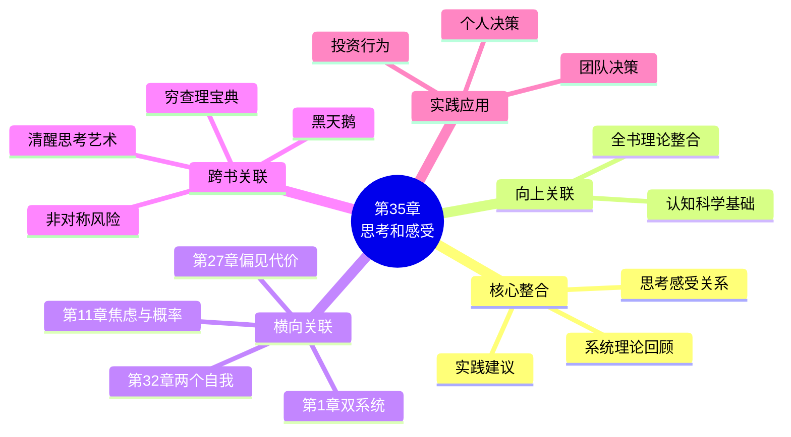

---

category: 
  - 书籍拆解

status: draft
chapter: 
number: 35
title: 总结：思考和感受
links:

  - "[[第32章-两个自我]]"
  - "[[思考快与慢/_导航]]"
created: 2026-02-27
tags:
  - 思考快与慢
  - 全书总结
  - 系统1
  - 系统2
  - 感受与思考
  - 认知整合
---

# 第35章 总结：思考和感受

## 📍 章节定位

### 全书位置
> 第35章是全书的终章总结，将系统1/2框架、启发式偏误、前景理论、两个自我等核心概念融会贯通，回答一个根本问题：思考与感受如何共同塑造我们的判断和选择？

- **全书核心问题**: 人类的判断为什么经常出错？我们如何认识自己的认知局限？
- **本章回答的问题**: 思考（系统2）和感受（系统1）各自的角色是什么？它们如何协作又如何冲突？我们应该如何与自己的认知局限和解？
- **角色类型**: 终章整合型（全书的哲学升华与方法论落地）
- **论证位置**: 全书理论总结，从认知科学上升至人生智慧

### 章节序列
| 方向 | 章节标题 | 逻辑连接 |
|------|----------|----------|
| 前章 | [[第32章-两个自我]] | 体验自我vs记忆自我的矛盾，是思考与感受分离的终极体现 |
| 本章 | 第35章 总结 | 整合全书理论，给出实践建议 |
| 终章 | 全书完结 | 认知科学的终极反思 |

### 一句话定位
> 第35章是《思考，快与慢》的收官之作，卡尼曼用"感受和思考"这对概念重新解读双系统理论，告诉我们：理性不是消灭感受，而是学会与系统1共处，并在关键时刻唤醒系统2。

---

## 🎯 核心观点

### 第一层：表层案例

| 案例名称 | 简要描述 | 页码 | 关键引文 |
|----------|----------|------|----------|
| 股票交易员决策 | 专业人士也难逃认知偏误的束缚 | p.— | "专家的直觉同样不可靠" |
| 医生诊断偏见 | 专家判断同样受制于系统1 | p.— | "经验不等于正确" |
| 投资者过度自信 | 知识越多，过度自信越强 | p.— | "了解越多，越觉得自己知道" |
| 政策制定失误 | 即使有数据支持，政策仍可能失败 | p.— | "好意图不等于好结果" |
| 日常生活决策 | 购物、选择中的系统性错误 | p.— | "理性是稀缺资源" |

### 第二层：中层机制

| 机制名称 | 组成要素 | 因果链条 | 证据来源 |
|----------|----------|----------|----------|
| 思考-感受分离 | 认知（思考）+ 情绪（感受） | 系统1产生感受→系统2进行思考→两者经常分离 | 全书实验证据 |
| 理性边界原理 | 系统2有限 + 系统1不可避免 | 理性努力→资源消耗→无法持续→回归直觉 | 认知负荷研究 |
| 偏见可预测性 | 偏见的系统性 + 可识别性 | 环境线索→偏见触发→结果可预测 | 启发式研究 |
| 自我认知悖论 | 知道偏误 vs 避免偏误 | 学习偏误→认为自己能避免→反而更危险 | 过度自信研究 |

### 第三层：底层规律

| 规律陈述 | 抽象层级 | 知识连接 | 适用范围 |
|----------|----------|----------|----------|
| 双系统认知架构 | 认知科学基础理论 | 系统1与系统2理论, 进化心理学 | 所有人类判断决策 |
| 认知吝啬原则 | 进化心理学规律 | 认知经济学, 有限理性理论 | 日常决策、长期规划 |
| 元认知必要性 | 认知心理学原则 | 元认知理论, [[批判性思维工具-保罗]] | 自我提升、决策改进 |
| 理性与感受共生 | 哲学/心理学整合 | [[第11卷-理性与情感]], 具身认知 | 人生智慧、存在意义 |

---

## 💬 降维翻译

### 观点1: 思考和感受是两回事，但它们总是绑在一起

#### 原文表达
> "思考和感受是两种不同的心理活动，但它们在日常生活中几乎总是同时出现。系统1产生感受——喜欢、厌恶、恐惧、信任——这些感受会影响我们的判断。系统2负责思考——推理、计算、比较——但它经常只是为系统1的感受找理由。我们以为自己在思考，其实是在为感受辩护。"

> p.—

#### 降维翻译（中学生能懂）
你大脑里有两个部门：

- 感受部（系统1）：看到一个人，0.1秒就决定"喜欢"还是"讨厌"
- 思考部（系统2）：认真分析，列出优点缺点，做理性判断

问题是：感受部反应太快了。等思考部开始工作的时候，感受部早就给出了答案。

结果就是：
- 你"理性分析"为什么这个人不好，其实你一开始就不喜欢他
- 你"认真比较"两个商品，其实你早就被广告洗脑了
- 你"深思熟虑"做决定，其实只是给直觉找理由

#### 日常类比（奶奶能懂）
就像吃菜，嘴巴尝了一口就决定好不好吃（感受），然后脑子才开始想"这道菜盐放多了""这菜不新鲜"（思考）。但其实，嘴巴早就有答案了，脑子只是在解释为什么。

#### 检验
- Q: 如果一个中学生问你这是什么意思？
- A: 你以为自己很理性，其实你的感受早就在做决定了。思考只是在给感受找理由。

### 观点2: 认识偏见不能消除偏见，有时反而更危险

#### 原文表达
> "学习认知偏误并不能让你免于这些偏误。相反，知道自己有偏见的人，往往会更加自信地犯错——他们认为自己已经'考虑到偏见'，因此判断更可靠。这是一种'偏见盲点'：我们能清楚地看到别人的偏见，却对自己的偏见视而不见。"

> p.—

#### 降维翻译（中学生能懂）
读完这本书，你以为自己变得更聪明了？

错。你可能变得更危险了。

因为：
- 你知道人有"过度自信"的偏见
- 你觉得自己已经知道这个偏见了，所以不会犯错
- 结果你更加自信地做错误决定

这叫"偏见盲点"：
- 看别人的偏见，一目了然
- 看自己的偏见，一无所知

#### 日常类比（奶奶能懂）
就像学开车，刚学会的人最容易出事故，因为觉得自己"会了"但其实不熟练。学了点心理学知识，反而更容易自以为是。

#### 检验
- Q: 如果一个中学生问你这是什么意思？
- A: 知道自己会犯错，不等于你就不犯错。有时候，"我知道我会犯错"这种想法，反而让你更自信地犯错。

### 观点3: 理性不是消灭感受，而是学会和感受相处

#### 原文表达
> "理性主义者的梦想——用纯粹的逻辑取代感受——注定失败。感受不是思考的敌人，它是思考的基础。没有感受，我们甚至无法做最简单的决定。理性的目标不是消灭系统1，而是学会识别它的局限，在关键时刻唤醒系统2，让两者协同工作。"

> p.—

#### 降维翻译（中学生能懂）
很多人以为"理性"就是要消灭情绪、变成机器人。

但卡尼曼说：不可能，也没必要。

为什么？
- 没有感受，你连"中午吃什么"都决定不了
- 感受是思考的起点，不是敌人
- 真正的理性是：知道什么时候该信感受，什么时候该用脑子

怎么做到？
1. 小事（吃什么、穿什么）→ 相信直觉（系统1）
2. 大事（买房、换工作）→ 强制慢下来（系统2）
3. 看到别人的错误 → 检查自己有没有同样的问题

#### 日常类比（奶奶能懂）
就像骑自行车，直觉是你的平衡感，思考是你的眼睛。你不能只用眼睛不用平衡感，也不能只凭感觉不看路。两个配合好，才能骑得稳。

#### 检验
- Q: 如果一个中学生问你这是什么意思？
- A: 理性不是变成机器人。真正的理性是：知道什么时候该相信直觉，什么时候该停下来认真想。

---

## ✨ 金句库

### 原书金句
| 金句 | 页码 | 适用场景 |
|------|------|----------|
| "思考和感受是两种不同的活动，但它们几乎总是同时发生" | p.— | 认知心理科普 |
| "知道自己有偏见的人，往往更自信地犯错" | p.— | 元认知反思 |
| "感受不是思考的敌人，它是思考的基础" | p.— | 理性感性整合 |
| "理性的目标不是消灭系统1，而是学会与它共处" | p.— | 实践指导 |
| "我们能看到别人的偏见，却对自己的偏见视而不见" | p.— | 偏见盲点 |

### 降维金句
| 金句 | 来源观点 | 适用场景 |
|------|----------|----------|
| "你以为在思考，其实是在给感受找理由" | 思考感受分离 | 认知科普 |
| "知道偏见，反而让你更自信地犯错" | 偏见盲点 | 自我反思 |
| "理性不是消灭情绪，而是和情绪做朋友" | 理性感性整合 | 人生智慧 |
| "小事靠直觉，大事靠暂停" | 实践指导 | 决策建议 |
| "感受是思考的起点，不是敌人" | 理性感性关系 | 哲学讨论 |

## 🔗 当下映射

### 💰 财富应用
| 场景 | 具体行动 | 预期效果 | 风险提示 |
|------|----------|----------|----------|
| 投资决策 | 设置"强制冷静期"，重大投资前暂停24小时 | 减少情绪化交易 | 可能错过短线机会 |
| 消费选择 | 区分"想要"（感受）和"需要"（思考） | 减少冲动消费 | 可能过度理性化 |
| 理财规划 | 承认自己会犯错，设置容错机制 | 降低系统性风险 | 可能过于保守 |

### 💼 职场应用
| 场景 | 具体行动 | 所需能力 | 适用职级 |
|------|----------|----------|----------|
| 招聘决策 | 使用结构化面试，减少第一印象影响 | 面试技巧 | HR及管理者 |
| 绩效评估 | 建立"偏见检查清单" | 自我反思能力 | 所有管理者 |
| 战略决策 | 引入"红队思维"，强制反对声音 | 批判性思维 | 高层决策者 |

### 🏠 生活应用
| 场景 | 具体行动 | 可行性 | 见效时间 |
|------|----------|--------|----------|
| 重要选择 | 写下"感受"和"理由"，区分两者 | 高 | 即时 |
| 人际关系 | 承认第一印象可能是错的 | 中 | 持续见效 |
| 自我提升 | 建立"错误日记"，记录判断失误 | 中 | 长期见效 |

### 72小时行动计划
1. **明天可以做的第一件事**: 回顾一个最近的重要决定，区分其中"感受"和"思考"各占多少比例
2. **本周内可以尝试的事**: 设置一个"决策暂停键"，在冲动消费或重大决定前强制等待24小时
3. **需要准备资源才能做的事**: 建立个人"偏见检查清单"，列出自己最容易犯的认知错误

---

## 🕸️ 章节关联

### 向上关联 → 整书
- **贡献**: 整合全书理论，从认知科学上升到人生智慧
- **位置**: 全书终章，是理论与实践的桥梁

### 横向关联 → 章节间
| 章节编号 | 章节标题 | 关联类型 | 连接描述 |
|----------|----------|----------|----------|
| 第1章 | 双系统理论 | 溯源 | 本章是第1章理论的终极应用 |
| 第32章 | 两个自我 | 前置 | 体验/记忆自我的矛盾是思考/感受分离的体现 |
| 第11章 | 焦虑情绪和概率错觉 | 相关 | 感受如何扭曲概率判断 |
| 第12章 | 科学与直觉推理 | 相关 | 直觉（感受）vs 科学（思考）的张力 |
| 第27章 | 偏见的代价 | 相关 | 偏见盲点的代价 |

### 向下关联 → 具体应用
| 应用场景 | 难度 | 前置知识 |
|----------|------|----------|
| 个人决策改进 | 中 | 理解双系统理论 |
| 团队决策优化 | 高 | 组织行为学基础 |
| 投资行为修正 | 中 | 行为金融学知识 |

### 跨书关联 → 知识网络
| 书籍 | 概念 | 关系 | 备注 |
|------|------|------|------|
| [[思考快与慢-丹尼尔·卡尼曼]] | 双系统理论 | 同源 | 全书核心理论 |
| [[清醒思考的艺术-多贝里]] | 52种认知偏误 | 延伸 | 具体偏误清单 |
| [[穷查理宝典]] | 人类误判心理学 | 对话 | 芒格的误判心理学 |
| [[黑天鹅-塔勒布]] | 认知谦卑 | 呼应 | 承认无知的重要性 |
| [[非对称风险-塔勒布]] | 切肤之痛 | 互补 | 感受与责任的连接 |

### 关联可视化

---

## ❓ 问答设计

### Q1: [记忆型问题]
**认知层次**: 记忆
**难度**: 低
**描述**: 卡尼曼如何定义"思考"和"感受"的关系？
**答案要点**:
- 思考：系统2的活动，包括推理、计算、比较
- 感受：系统1的活动，包括喜欢、厌恶、恐惧、信任
- 两者几乎总是同时出现，但经常相互矛盾

### Q2: [理解型问题]
**认知层次**: 理解
**难度**: 中
**描述**: 为什么"知道自己有偏见"反而可能更危险？
**答案要点**:
- 产生"偏见盲点"效应
- 看到别人的偏见，忽视自己的偏见
- 过度自信导致更严重的判断失误

### Q3: [应用型问题]
**认知层次**: 应用
**难度**: 中
**描述**: 如何在实际生活中区分"思考"和"感受"？
**答案要点**:
- 感受来得快，思考来得慢
- 写下判断的理由，区分"直觉"和"逻辑"
- 问自己：这个决定是0.1秒做出的，还是深思熟虑的？

### Q4: [分析型问题]
**认知层次**: 分析
**难度**: 中
**描述**: 思考-感受分离与系统1/2理论有什么内在联系？
**答案要点**:
- 感受是系统1的核心输出
- 思考是系统2的核心功能
- 两者分离是双系统架构的必然结果

### Q5: [创造型问题]
**认知层次**: 创造
**难度**: 高
**描述**: 如何设计一个"偏见检查清单"来改善日常决策？
**答案要点**:
- 列出自己最容易犯的认知偏误
- 在重要决定前强制过一遍清单
- 设置"反对者视角"，寻找反面证据

### Q6: [理解型问题]
**认知层次**: 理解
**难度**: 中
**描述**: 为什么卡尼曼说"理性不是消灭感受"？
**答案要点**:
- 感受是思考的基础，不是敌人
- 没有感受，简单决定都做不了
- 理性的目标是让两个系统协同工作

### Q7: [应用型问题]
**认知层次**: 应用
**难度**: 中
**描述**: 在投资决策中，如何平衡思考和感受？
**答案要点**:
- 设置强制冷静期
- 区分"市场情绪"和"基本面分析"
- 建立投资规则，减少情绪干扰

### Q8: [分析型问题]
**认知层次**: 分析
**难度**: 高
**描述**: 第35章如何整合全书的核心概念？
**答案要点**:
- 系统1/2框架是基础
- 启发式偏误是系统1的缺陷
- 前景理论是感受影响决策的例证
- 两个自我是思考/感受分离的终极体现

### Q9: [评价型问题]
**认知层次**: 评价
**难度**: 高
**描述**: 卡尼曼对"理性"的定义与传统理性主义有何不同？
**答案要点**:
- 传统理性主义追求消灭情绪
- 卡尼曼认为感受是思考的基础
- 真正的理性是承认局限，与系统1共处

### Q10: [创造型问题]
**认知层次**: 创造
**难度**: 高
**描述**: 如果让你向一个完全没读过这本书的人解释"思考和感受"的关系，你会怎么说？
**答案要点**:
- 用生活化类比（如骑自行车、吃菜）
- 强调感受来得快、思考来得慢
- 说明真正的智慧是知道何时相信哪个

---
