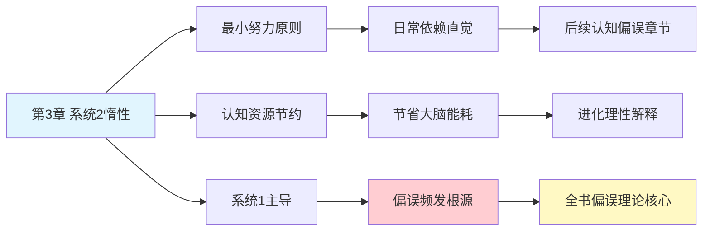

---

category: 
  - 书籍拆解

status: draft
chapter: 
number: 3
title: 惰性思维与延迟折扣
links:

  - "[[第2章-电影演员和老虎]]"
  - "[[第4章-心理账户的诱惑]]"
  - "[[思考快与慢/_导航]]"
created: 2026-02-27
tags:
  - 思考快与慢
  - 系统2
  - 认知资源
  - 惰性思维
---

# 第3章 惰性思维与延迟折扣

## 📍 章节定位

### 全书位置
> 第3章揭示认知系统的另一个核心特征：系统2的能量保护机制和惰性特性。它解释为什么大脑倾向于保存精力，优先使用系统1而不愿启动费力的系统2，为后续章节中人类认知错误的发生根源提供解释。

- **全书核心问题**: 为什么人类的判断经常偏离理性？认知系统的工作原理是什么？
- **本章回答的问题**: 为什么系统2（费力的理性思考）如此懒惰？人类认知系统的能量保护机制是什么？
- **角色类型**: 核心概念型（揭示系统2的惰性特征）
- **论证位置**: 深化双系统理论，解释后续认知错误的根本原因

### 章节序列
| 方向 | 章节标题 | 逻辑连接 |
|------|----------|----------|
| 前章 | [[第2章-电影演员和老虎]] | 延续系统1强大运作能力的论述，进一步说明系统2为何不常干预 |
| 后章 | [[第4章-心理账户的诱惑]] | 为理解心理账户等启发式错误提供基础：因为系统2懒惰而依赖系统1的简便法则 |
| 整书 | [[思考快与慢-丹尼尔·卡尼曼]] | 阐释造成整体认知偏误的深层机制之一 |

### 一句话定位
> 第3章解释了核心问题：系统2为何如此懒惰？通过阐述人类认知系统的能量保护机制和惰性倾向，为全书的认知偏误现象提供根本性解释。

---

## 🎯 核心观点

### 第一层：表层案例

| 案例名称 | 简要描述 | 页码 | 关键引文 |
|----------|----------|------|----------|
| 斯特鲁普效应 | 看到红字写的"蓝"字，需要刻意抑制直觉反应 | p. — | "这个简单的任务需要系统2的参与" |
| 理性经济人谬误 | 经济学假设与现实认知能力不符 | p. — | "人并非完美的决策机器" |
| 数学题测试 | 34 * 18 = ? 需要专注计算 | p. — | "没有简单答案，需要费力思考" |
| 认知负荷任务 | 同时进行多项任务时的注意力分散 | p. — | "多任务会削弱每个任务的表现" |

### 第二层：中层机制

| 机制名称 | 组成要素 | 因果链条 | 证据来源 |
|----------|----------|----------|----------|
| 惰性原则 | 认知资源节约 + 最小努力原则 | 启动系统2→消耗能量→系统选择最小路径 | 系统能量消耗研究 |
| 认知资源限制 | 有限容量 + 注意力竞争 | 多任务→资源分散→表现下降 | 认知负荷理论 |
| 节能偏好 | 生存机制 + 能量保护 | 系统2耗能→大脑倾向系统1节能模式 | 进化心理学证据 |
| 刺激-反应通道 | 自动化处理 + 路径固化 | 重复刺激→习惯化→快速处理 | 神经网络可塑性研究 |

### 第三层：底层规律

| 规律陈述 | 抽象层级 | 知识连接 | 适用范围 |
|----------|----------|----------|----------|
| 最小能量原则（认知经济学） | 认知资源分配理论 | [[思考快与慢整体框架]], [[认知资源有限论]] | 人类信息处理决策 |
| 认知吝啬鬼法则 | 进化生存策略 | [[进化心理学理论]], [[资源限制理论]] | 所有认知活动领域 |
| 二元处理模式 | 认知双理论体系 | [[系统1与系统2理论]], [[启发式与分析式思维]] | 人类思维基本架构 |

---

## 💬 降维翻译

### 观点1: 系统2的惰性机制

#### 原文表达
> "系统2的很多功能都需要我们付出努力，而人类天生是节能导向的。系统2只有在系统1无法处理问题时才会被调用，这是一个'最小努力原则'的体现。在日常生活中，只要系统1的直觉判断看起来可行，我们就会选择相信它，而不会进一步动用心智资源进行验证。"

> p.— 

#### 降维翻译（中学生能懂）
大脑像是有个专职司机和备用司机：
- 专职司机：随时在开车（系统1），不费劲，但有时会走错路
- 备用司机：驾驶技术很好，但很懒惰，除非车子彻底抛锚，不然不会接手方向盘

所以平时我们都用那个不太靠谱但勤快的专用司机开车，直到他完全无法驾驶了才换人。

#### 日常类比（奶奶能懂）
就像家里有个干杂活的老妈子和一个精明的管家：
- 老妈子：啥都能干，不挑剔，不费事，但有时会搞错（给你茶杯倒上酱油）
- 管家：非常可靠精准，但你必须主动叫他，并且他还不大乐意干小事

所以平常大家都用老妈子，她能搞定的事绝不麻烦管事的。

#### 检验
- Q: 如果一个中学生问你这是什么意思？
- A: 你的大脑中有两个做工系统，一个是懒人用的，一个是聪明但懒惰的。平时都用懒的那个，直到它彻底不行了才喊另一个。

### 观点2: 能量保护机制的重要性

#### 原文表达
> "大脑是人体消耗能量最多的器官之一，约占全身能量消耗的20%。因此，大脑进化出了严格的节省能源机制。当我们面临一个问题时，大脑会默认使用能耗最低的方式处理 - 即优先调用系统1，只有当这个问题显现出复杂性时，才会被迫启动系统2。"

> p.— 

#### 降维翻译（中学生能懂）
大脑很耗电，就像你手机电量有限，所以系统默认开节能模式。每次遇到问题时，它先用最节省电力的方式解决，只在实在搞不定的情况下才会开耗电的大功能模式。

#### 日常类比（奶奶能懂）
大脑就像家里用的灯泡，平时用节能灯（系统1），只有晚上特别暗看书时才会开功率大的主灯（系统2）。因为主灯太费电了，能用节能灯解决的问题就不会开主灯。

#### 检验
- Q: 如果一个中学生问你这是什么意思？
- A: 大脑很费能量，所以它默认用最便宜的方式思考，像手机省电一样，只在特别需要时才用力思考。

---

## ✨ 金句库

### 原书金句
| 金句 | 页码 | 适用场景 |
|------|------|----------|
| "系统2本质上是惰性的，只有在必要时才会被唤醒" | p.— | 认知心理学科普 |
| "人类思维遵循最小努力原则" | p.— | 人类行为解读文章 |
| "系统1的直觉占据了我们95%的思维活动" | p.— | 决策认知分析 |

### 降维金句
| 金句 | 来源观点 | 适用场景 |
|------|----------|----------|
| "大脑是个节能高手，能懒就懒" | 系统2惰性机制 | 日常决策反思 |
| "思考是大脑的高耗能活动，所以它不爱思考" | 能耗机制 | 认知科普 |
| "95%的情况下，都是懒人司机在开车" | 联系日常经验 | 决策质量分析 |

## 🔗 当下映射

### 💰 财富应用
| 场景 | 具体行动 | 预期效果 | 风险提示 |
|------|----------|----------|----------|
| 投资前思考 | 重要投资决策前强制自己做理性计算，不依赖直觉 | 避免冲动投资损失 | 可能错过短期机会 |
| 防范金融骗局 | 遇到所谓高盈利机会时启动系统2，核查真实性 | 减少金融诈骗损失 | 需要一定专业知识 |
| 日常消费审计 | 定期审视自己的消费决策，检查有哪些是冲动购买 | 降低非必要开支 | 花费额外时间 |

### 💼 职场应用
| 场景 | 具体行动 | 所需能力 | 适用职级 |
|------|----------|----------|----------|
| 重要决策审核 | 重大决策前强制列出多种方案并比较优劣 | 分析思考能力 | 管理层 |
| 跨部门沟通 | 主动验证自己对他部门的印象是否准确 | 换位思考，客观分析 | 所有员工 |
| 绩效判断 | 评估同事时避免首因效应，基于客观数据 | 数据分析，逻辑判断 | 项目经理及以上 |

### 🏠 生活应用
| 场景 | 具体行动 | 可行性 | 见效时间 |
|------|----------|--------|----------|
| 社交偏见自查 | 定期反思自己对某些群体或事物的初始印象 | 高 | 1个月 |
| 健康习惯制定 | 利用系统1的自动化特性建立良好习惯 | 高 | 2-3周 |
| 学习效率提升 | 理解大脑疲劳机制，合理安排学习时间 | 高 | 即时应用 |

### 72小时行动计划
1. **明天可以做的第一件事**: 在购物时，遇到第一眼"很喜欢"的商品，告诉自己停一停，问问是否真的需要
2. **本周内可以尝试的事**: 每天下班后花5分钟思考：今天有几个决定是"懒人司机"开的？有没有需要重新思考的？
3. **需要准备资源才能做的事**: 设置每日/每周提醒，进行决策反思，逐步建立定期激活系统2的习惯

---

## 🕸️ 章节关联

### 向上关联 → 整书
- **贡献**: 解释认知偏误现象的核心机制：系统2的惰性使得系统1的偏差得以延续
- **位置**: 位于系统理论阐述部分，为全书偏误理论提供基础解释

### 横向关联 → 章节间
| 章节编号 | 章节标题 | 关联类型 | 连接描述 |
|----------|----------|----------|----------|
| 第1章 | 一张愤怒的脸和一道乘法题 | 延续 | 继续阐明系统1/2理论，深入解释系统2特性 |
| 第2章 | 电影演员和老虎 | 承接 | 说明系统1的强大联想能力，此章解释为何系统2不常干预 |
| 第4章 | 心理账户的诱惑 | 铺垫 | 由于系统2惰性，人容易依赖启发式规则如心理账户 |
| 第5章 | 直觉的判断 | 遥远连接 | 系统2惰性是造成过度相信直觉的主要原因 |

### 向下关联 → 具体应用
| 应用场景 | 难度 | 前置知识 |
|----------|------|----------|
| 理性决策技巧 | 中 | 对双系统理论的基本理解 |
| 认知偏误防护 | 高 | 完整掌握系统特性及互动关系 |
| 说服与营销技巧 | 高 | 深入理解受众系统1/2启动状态 |

### 跨书关联 → 知识网络
| 书籍 | 概念 | 关系 | 备注 |
|------|------|------|------|
| [[思考快与慢-丹尼尔·卡尼曼]] | 认知系统惰性 | 同源 | 全书基本理论之一 |
| [[清醒思考的艺术-多贝里]] | 认知偏误系列 | 相继理论 | 本书理论在实用清单中的体现 |
| [[穷查理宝典]] | 误判心理学 | 互补视角 | 从投资角度看同样认知局限 |
| [[助推-理查德·塞勒]] | 选择架构设计 | 应用延伸 | 利用人类认知特点设计环境 |

### 关联可视化

---

## ❓ 问答设计

### Q1: [记忆型问题]
**认知层次**: 记忆
**难度**: 低
**描述**: 系统2的基本特征是什么？
**答案要点**:
- 需要努力
- 耗费能量
- 偶尔上线
- 理性计算

### Q2: [理解型问题]
**认知层次**: 理解
**难度**: 中
**描述**: 为什么大脑倾向于使用系统1而非系统2？
**答案要点**:
- 系统1不耗能
- 系统2费力耗能
- 能量保护机制
- 最小努力原则

### Q3: [应用型问题]
**认知层次**: 应用
**难度**: 中
**描述**: 如何在日常中强制启动系统2？
**答案要点**:
- 设置缓冲时间
- 主动质疑直觉
- 提问检查假设
- 列表比较选项

### Q4: [分析型问题]
**认知层次**: 分析
**难度**: 中
**描述**: 系统2惰性对人类进化有何意义？
**答案要点**:
- 节能有助于生存
- 快速反应适应环境
- 减少过度思考损耗
- 优先处理紧急问题

### Q5: [创造型问题]
**认知层次**: 创造
**难度**: 高
**描述**: 设计一个日常系统2激活小工具？
**答案要点**:
- 设置思考提醒
- 设计验证框架
- 建立监督习惯
- 量化激活指标

### Q6: [理解型问题]
**认知层次**: 理解
**难度**: 中
**描述**: 延迟折扣与系统2惰性有何关联？
**答案要点**:
- 即时奖励优先（系统1冲动)
- 远期规划需要系统2介入
- 系统2惰性导致延迟决策不执行

### Q7: [应用型问题]
**认知层次**: 应用
**难度**: 中
**描述**: 如何避免因系统2惰性造成的投资误区？
**答案要点**:
- 预先设定投资规则
- 定期检查资产配置
- 避免情绪化决策
- 保持理性投资计划

### Q8: [分析型问题]
**认知层次**: 分析
**难度**: 中
**描述**: 在哪些情况下系统2被强制激活？
**答案要点**:
- 遇到异常信息
- 多任务处理
- 认知负荷过高
- 系统1出现困难

### Q9: [理解型问题]
**认知层次**: 理解
**难度**: 高
**描述**: 系统2惰性与习惯形成的关系？
**答案要点**:
- 系统2负责新模式建立
- 一旦习惯形成转入系统1自动执行
- 这是能量节约的重要机制

### Q10: [创造型问题]
**认知层次**: 创造
**难度**: 高
**描述**: 如何运用系统2惰性原理在团队管理中提升效率？
**答案要点**:
- 建立自动化工作流程
- 提供清晰决策框架
- 减少不必要思考负荷
- 保留大脑资源处理复问题

---
