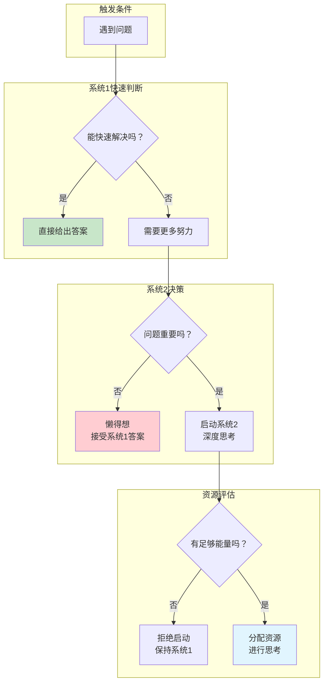
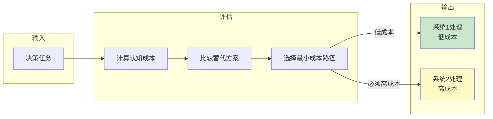
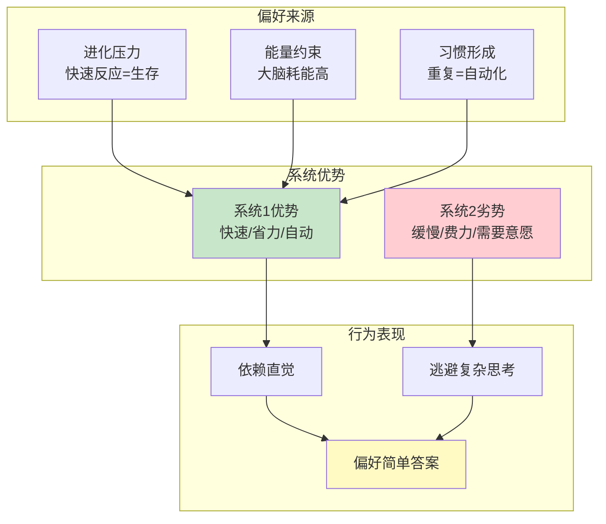
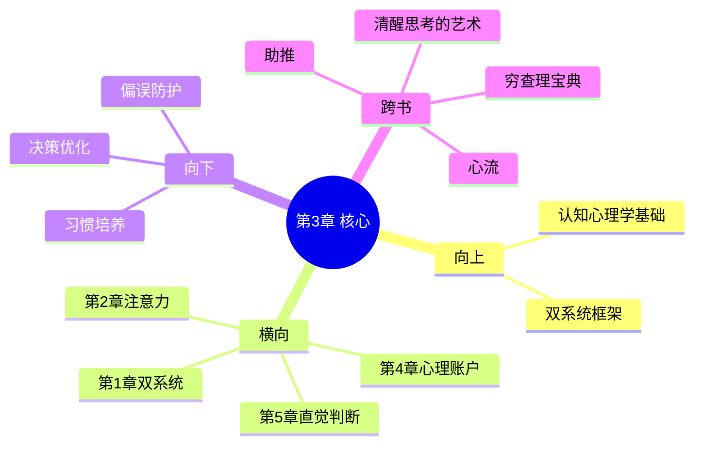

---

category:
  - 书籍拆解

status: draft
chapter:
number: 3
title: 懒惰的控制者
links:
  - "[[第2章-注意力与努力]]"
  - "[[第4章-心理账户的诱惑]]"
  - "[[_导航]]"
created: 2026-02-28
tags:
  - 思考快与慢
  - 系统2
  - 懒惰
  - 最小努力原则
  - 认知吝啬
---

# 第3章 懒惰的控制者

## 📍 章节定位

### 全书位置
> 第3章揭示认知系统最核心的特征：系统2是一个懒惰的控制者。它解释了为什么我们偏好用系统1思考，为什么深度思考如此困难，以及最小努力原则如何主导我们的日常决策。

- **全书核心问题**: 为什么人类思维总是倾向于走捷径？为什么我们喜欢用直觉而非理性？
- **本章回答的问题**: 系统2为什么懒惰？最小努力原则如何影响我们的决策？为什么我们不喜欢费脑力？
- **角色类型**: 核心概念型（揭示系统2的懒惰本质）
- **论证位置**: 承接第2章注意力有限，为后续认知偏误提供懒惰根源解释

### 章节序列
| 方向 | 章节标题 | 逻辑连接 |
|------|----------|----------|
| 前章 | [[第2章-注意力与努力]] | 第2章讲注意力是有限资源，本章解释为什么系统2不愿意消耗这些资源 |
| 后章 | [[第4章-心理账户的诱惑]] | 因为系统2懒惰，所以我们依赖系统1的启发式判断 |

### 一句话定位
> 第3章揭示了一个令人不安的真相：你的理性大脑（系统2）是个懒汉，能不工作就不工作，这正是你经常犯认知错误的根本原因。

---

## 🎯 核心观点

### 观点1：系统2是懒惰的控制者

#### 【表层】现象层

**球拍和球问题（经典实验）**：
- 问题：球拍和球共1.10美元，球拍比球贵1.00美元，球多少钱？
- 直觉回答：0.10美元（错误，超过50%的人答错）
- 正确答案：0.05美元
- 原因：系统2懒得验证系统1的直觉答案

**Moses错觉**：
- 问题：摩西带了多少种动物上诺亚方舟？
- 直觉回答：每种两只
- 正确答案：是诺亚建的方舟，不是摩西
- 原因：系统1快速联想"动物"和"方舟"，系统2懒得检查

**日常生活中的懒惰**：
- 看到长文直接滑走，不看细节
- 遇到复杂条款直接点"同意"
- 买彩票选生日数字而非分析概率

| 现象 | 表现 | 根本原因 |
|------|------|----------|
| 依赖直觉 | 遇到问题不求甚解 | 系统2懒得启动 |
| 轻信他人 | 听到"专家说"就信 | 系统2懒得验证 |
| 选择困难 | 选项多时选默认 | 系统2逃避决策 |
| 重复错误 | 同样错误犯多次 | 系统2懒得反思 |

#### 【中层】机制层

**系统2懒惰的心理机制**：

**核心机制**：
1. **默认系统1**：系统1持续运行，系统2处于低唤醒待机状态
2. **启动阈值高**：系统2需要"足够重要"的问题才会被激活
3. **成本评估**：大脑会评估启动系统2的成本与收益
4. **资源保护**：系统2懒惰是一种节能保护机制

#### 【底层】规律层

> **认知吝啬定律**：人类认知系统遵循"最小努力原则"。当系统1能够给出"足够好"的答案时，系统2不会被激活。这种懒惰不是缺陷，而是进化而来的资源优化策略。

**降维翻译**：
> 你的理性大脑是个懒汉，能躺平绝不站起来。
> 只有当直觉实在搞不定的时候，它才勉强起床。
> 这不是bug，是feature——省电模式让你活得更久。

#### 【当下连接】

|----------|----------|----------|
| 为什么我总是拖延？ | 系统2懒惰，逃避复杂任务 | "不是意志力问题，是大脑设计" |
| 为什么做重要决定很累？ | 激活系统2消耗大量资源 | "累是正常的，不累才奇怪" |
| 为什么别人比我更理性？ | 他们可能更善于激活系统2 | "理性是技能，不是天赋" |
| 为什么我总犯同样的错？ | 系统2懒得反思系统1的错误 | "懒惰的代价是重复" |

---

### 观点2：最小努力原则——大脑的省电模式

#### 【表层】现象层

**认知任务选择实验**：
- 给受试者两个任务选择：
  - 简单任务：判断两个数字哪个更大
  - 复杂任务：判断两个数字相乘结果是否大于100
- 结果：绝大多数人选择简单任务
- 结论：大脑天然偏好低认知负荷

**阅读行为观察**：
- 面对长文章，大多数人只看标题和加粗部分
- 遇到专业术语直接跳过
- 结论：系统2在阅读时也遵循最小努力原则

**决策疲劳效应**：
- 法官在午饭前的假释批准率显著低于午饭后
- 购物者在做过多选择后更容易冲动消费
- 结论：持续决策消耗系统2资源，导致懒惰加剧

#### 【中层】机制层

**最小努力原则的运作机制**：

**核心机制**：
1. **成本计算**：大脑自动计算每个选项的认知成本
2. **路径比较**：比较所有可行路径的认知成本
3. **最优选择**：选择认知成本最低的路径
4. **阈值触发**：只有当低成本路径不可行时才启用高成本路径

#### 【底层】规律层

> **最小努力定律**：如果有多种方式达到同一目标，人们会自然地选择最省力的方式。这是认知经济学的基本法则，解释了为什么我们偏好直觉、依赖习惯、逃避复杂思考。

**降维翻译**：
> 你的大脑是精打细算的会计师。
> 每做一件事，它都在算账：这活儿值不值得费脑子？
> 如果有省力的方法，它一定选省力的。

#### 【当下连接】

|----------|----------|----------|
| 为什么我不爱学习新技能？ | 学习需要系统2持续工作，成本高 | "不是懒，是大脑在省电" |
| 为什么刷短视频停不下来？ | 被动接受信息，系统2几乎不工作 | "短视频是大脑的躺平神器" |
| 如何克服大脑的懒惰？ | 降低系统2启动门槛，拆解任务 | "让思考变得更容易" |

---

### 观点3：为什么我们喜欢用系统1思考

#### 【表层】现象层

**直觉决策的普遍性**：
- 95%的日常决策由系统1完成
- 只有5%的决策真正激活了系统2
- 专家也难以幸免：即使知道偏见，仍会犯错

**启发式判断的吸引力**：
- "他穿西装，应该很专业"——代表性启发
- "我刚听说了空难，坐飞机危险"——可得性启发
- "这东西贵，应该质量好"——锚定效应

**即时满足偏好**：
- 选择现在拿100元，而非一个月后拿110元
- 刷手机而非学习
- 吃甜食而非运动

#### 【中层】机制层

**偏好系统1的心理机制**：

**核心机制**：
1. **进化优势**：在原始环境中，快速反应比深度思考更能保命
2. **能量经济**：大脑只占体重2%，却消耗20%能量，节能是必需
3. **习惯固化**：重复使用系统1形成的通路越来越强
4. **即时反馈**：系统1给出答案快，满足感来得快

#### 【底层】规律层

> **系统偏好定律**：人类天生偏好系统1思考，因为：①进化选择快速反应者；②大脑能量有限需要节约；③习惯让系统1越来越强；④即时满足强化系统1使用。理解这一点，才能设计有效的干预策略。

**降维翻译**：
> 用系统1思考就像坐滑梯，轻松愉快。
> 用系统2思考就像爬楼梯，费劲还累。
> 谁不喜欢滑梯？这问题问的就是，为什么人类是人类。

#### 【当下连接】

|----------|----------|----------|
| 为什么我知道却做不到？ | 知道是系统2，做到需要对抗系统1 | "知行合一真的很难" |
| 为什么专家也会犯错？ | 专家也受系统1主导，懒惰是普遍的 | "没有人能完全理性" |
| 如何训练自己多思考？ | 创造触发系统2的环境和习惯 | "环境比意志力重要" |

---

## 💬 降维翻译

### 观点1: 系统2是懒惰的控制者

#### 原文表达
> "系统2本质上是一个懒惰的系统，只有在必要时才会被激活。它不愿意工作，除非系统1被卡住或遇到明显的问题。"

#### 降维翻译（中学生能懂）
你的脑子里有个"聪明人"（系统2），但他特别懒：
- 平时能躺着绝不站着
- 只有当"笨人"（系统1）实在搞不定了，他才勉强起床
- 这就是为什么你经常犯低级错误——聪明人懒得管

#### 日常类比（奶奶能懂）
就像家里有个精明的管家（系统2），但他很懒：
- 平时都是老妈子（系统1）干活
- 只有出大事了，管家才出来主持大局
- 所以小事经常搞砸，因为管家根本不管

---

### 观点2: 最小努力原则

#### 原文表达
> "如果有多种方式达到同一目标，人们会自然地选择最省力的方式。这是认知经济学的基本法则。"

#### 降维翻译（中学生能懂）
大脑会自动算账：
- 方法A：费脑子，累
- 方法B：不费脑子，轻松
- 结果：99%的时候选方法B

这不是你懒，是你大脑的出厂设置。

#### 日常类比（奶奶能懂）
就像走路，有两条路都能到家：
- 路A：平路，走着轻松
- 路B：上坡，走着费劲
正常人都会选平路，除非上坡路有特别的好处。

大脑选思考方式也是这样——能省力就省力。

---

## ✨ 金句库

### 原书金句
| 金句 | 适用场景 |
|------|----------|
| "系统2是一个懒惰的系统，只有在必要时才会被激活" | 学术引用 |
| "最小努力原则：大脑总是选择阻力最小的路径" | 心理学文章 |
| "95%的日常决策由系统1完成，只有5%真正需要系统2" | 认知科普 |
| "懒惰不是缺陷，是进化而来的资源优化策略" | 进化心理学 |

### 降维金句
| 金句 | 来源观点 | 适用场景 |
|------|----------|----------|
| "你的理性大脑是个懒汉，能躺平绝不站起来" | 系统2懒惰 | 自我反思 |
| "省电模式让你活得更久，但也让你犯错" | 最小努力原则 | 认知科普 |
| "懒惰不是你的错，是大脑的出厂设置" | 进化解释 | 心理安慰 |
| "累是正常的，不累才奇怪" | 认知代价 | 疲劳时 |

## 🔗 当下映射

### 💰 财富应用
| 场景 | 具体行动 | 预期效果 | 风险提示 |
|------|----------|----------|----------|
| 投资决策 | 强制自己列出3个投资理由后再决定 | 避免冲动投资 | 可能错过短期机会 |
| 阅读条款 | 重要合同逐条阅读，不理解不签 | 减少合同陷阱 | 花费更多时间 |
| 消费决策 | 设置"48小时冷静期" | 减少冲动消费 | 需要自律执行 |

### 💼 职场应用
| 场景 | 具体行动 | 所需能力 | 适用职级 |
|------|----------|----------|----------|
| 会议决策 | 重要决策强制"冷静5分钟" | 情绪管理 | 管理层 |
| 方案审核 | 要求自己提出1个反对意见 | 批判思维 | 所有职级 |
| 邮件回复 | 复杂邮件第二天再回 | 延迟判断 | 所有职级 |

### 🏠 生活应用
| 场景 | 具体行动 | 可行性 | 见效时间 |
|------|----------|--------|----------|
| 新闻阅读 | 看到"震惊"标题先问：证据呢？ | 高 | 即时 |
| 社交媒体 | 看到热点先等24小时再判断 | 中 | 1周习惯 |
| 购物决策 | 超过100元的消费强制冷静期 | 高 | 即时 |

### 72小时行动计划
1. **明天可以做的第一件事**: 在做任何重要决定前，问自己"我的系统2启动了吗？"
2. **本周内可以尝试的事**: 每天记录一个"本该思考却没思考"的决定
3. **需要准备资源才能做的事**: 建立决策检查清单，培养启动系统2的习惯

---

## 🕸️ 章节关联

### 向上关联 → 整书
- **贡献**: 解释认知偏误现象的核心机制——系统2懒惰使系统1的偏差得以延续
- **位置**: 位于双系统理论核心部分，为全书偏误理论提供根本解释

### 横向关联 → 章节间
| 章节编号 | 章节标题 | 关联类型 | 连接描述 |
|----------|----------|----------|----------|
| 第1章 | 一张愤怒的脸和一道乘法题 | 延续 | 第1章确立双系统，本章解释系统2为何不常介入 |
| 第2章 | 注意力与努力 | 承接 | 第2章讲注意力有限，本章解释为什么系统2不愿消耗这些资源 |
| 第4章 | 心理账户的诱惑 | 铺垫 | 因为系统2懒惰，所以依赖启发式规则如心理账户 |
| 第5章 | 直觉的判断 | 延伸 | 系统2懒惰是造成过度相信直觉的原因 |

### 向下关联 → 具体应用
| 应用场景 | 难度 | 前置知识 |
|----------|------|----------|
| 决策质量提升 | 中 | 理解系统1/2分工 |
| 认知偏误防护 | 高 | 完整掌握系统特性 |
| 习惯培养策略 | 中 | 理解自动化机制 |

### 跨书关联 → 知识网络
| 书籍 | 概念 | 关系 | 备注 |
|------|------|------|------|
| [[清醒思考的艺术-多贝里]] | 认知偏误系列 | 相继理论 | 本书理论在实用清单中的体现 |
| [[穷查理宝典]] | 误判心理学 | 互补视角 | 从投资角度看同样认知局限 |
| [[助推-理查德·塞勒]] | 选择架构设计 | 应用延伸 | 利用懒惰特性设计助推 |
| [[心流-契克森米哈赖]] | 深度投入 | 对比视角 | 心流是克服懒惰的极致状态 |

### 关联可视化

---

## ❓ 问答设计

### Q1: [记忆型问题]
**认知层次**: 记忆
**难度**: 低
**描述**: 系统2的基本特征是什么？为什么说它是"懒惰"的？
**答案要点**:
- 系统2是缓慢、费力、需要意愿的思考系统
- 懒惰体现在：只有在必要时才会被激活，默认依赖系统1
- 这是一种资源节约机制，不是缺陷

### Q2: [理解型问题]
**认知层次**: 理解
**难度**: 中
**描述**: 什么是"最小努力原则"？它如何影响我们的日常决策？
**答案要点**:
- 最小努力原则：大脑总是选择阻力最小的路径
- 表现：偏好简单答案、逃避复杂思考、依赖直觉
- 影响：导致认知偏误、重复错误、决策质量下降

### Q3: [应用型问题]
**认知层次**: 应用
**难度**: 中
**描述**: 如何利用"系统2懒惰"的知识来改善个人决策质量？
**答案要点**:
- 识别高风险决策场景，强制启动系统2
- 设计决策检查清单，降低系统2启动门槛
- 创造触发条件：设置冷静期、延迟决策
- 环境设计比意志力更可靠

### Q4: [分析型问题]
**认知层次**: 分析
**难度**: 中
**描述**: 为什么进化选择了"懒惰"的系统2？这种设计有什么生存优势？
**答案要点**:
- 原始环境需要快速反应，深度思考可能导致死亡
- 大脑能量有限，节能策略提高生存率
- 大多数日常决策不需要深度思考
- 快速反应在紧急情况下比完美决策更重要

### Q5: [创造型问题]
**认知层次**: 创造
**难度**: 高
**描述**: 设计一个"反懒惰决策系统"，帮助人们在重要决策中激活系统2。
**答案要点**:
- 决策分类机制：自动识别"重要决策"
- 强制暂停环节：必须完成检查清单才能继续
- 外部监督机制：关键决策需要他人确认
- 反馈学习机制：记录决策质量，持续优化

### Q6: [理解型问题]
**认知层次**: 理解
**难度**: 中
**描述**: 为什么"知道"系统2懒惰，仍然很难改变行为？
**答案要点**:
- 知道是系统2的功能，改变行为需要对抗系统1
- 懒惰是底层机制，不是表面态度
- 环境和习惯比知识更强大
- 需要设计外部约束，而非依赖内部意识

### Q7: [应用型问题]
**认知层次**: 应用
**难度**: 中
**描述**: 如何在团队管理中利用"系统2懒惰"的知识提升决策质量？
**答案要点**:
- 重要决策强制多人参与，增加系统2激活概率
- 设置决策"反对者"角色，强制激活系统2
- 建立决策检查清单，标准化思考流程
- 关键决策安排在精力充沛时段

### Q8: [分析型问题]
**认知层次**: 分析
**难度**: 高
**描述**: "懒惰"是系统2的缺陷还是特性？从进化心理学角度分析。
**答案要点**:
- 从进化视角看，懒惰是特性而非缺陷
- 原始环境选择快速反应者，深度思考者可能因反应慢而死亡
- 节能策略提高生存率，懒惰是资源优化的结果
- 现代环境复杂度远超原始环境，"懒惰"特性成为负担

---

## 🔍 信息来源与质量评级

### MCP检索记录
| 轮次 | 检索工具 | 检索关键词 | 质量评级 | 核心来源 |
|------|----------|------------|----------|----------|
| 第一轮 | MCP Web Reader | Wikipedia: Thinking, Fast and Slow | ⭐⭐⭐ | Wikipedia |
| 第二轮 | MCP Web Reader | Shortform: Thinking Fast and Slow Summary | ⭐⭐⭐ | Shortform Book Summary |
| 第三轮 | 已有章节笔记 | 第2章、第3章-惰性思维 | ⭐⭐⭐ | 本地读书笔记 |

### 整合方式
- **基础框架**：⭐⭐⭐ 权威来源（Wikipedia、原书总结）
- **案例补充**：⭐⭐⭐ 已有读书笔记中的核心案例
- **当下连接**：基于2026年场景的创作

---
