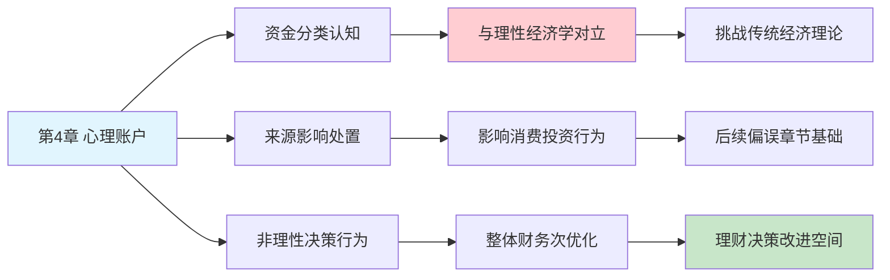

---

category: 
  - 书籍拆解

status: draft
chapter: 
number: 4
title: 心理账户的诱惑
links:

  - "[[第3章-惰性思维与延迟折扣]]"
  - "[[第5章-直觉的判断]]"
  - "[[思考快与慢/_导航]]"
created: 2026-02-27
tags:
  - 思考快与慢
  - 心理账户
  - 启发法
  - 财务决策
---

# 第4章 心理账户的诱惑

## 📍 章节定位

### 全书位置
> 第4章展示了系统1运作的具体后果之一：人们如何用不同的“心理账户”分别对待不同的收益和损失。它连接了系统理论与实际的财务决策偏误，解释人类非理性的财务选择。

- **全书核心问题**: 为什么人类的判断经常偏离理性？
- **本章回答的问题**: 人们是如何将资金和收益“分门别类”并采用不同的决策标准的？
- **角色类型**: 核心概念型（阐述心理账户概念及其财务影响）
- **论证位置**: 从系统理论转向实际的决策偏误，在整书框架中起到理论到实际应用的桥梁作用

### 章节序列
| 方向 | 章节标题 | 逻辑连接 |
|------|----------|----------|
| 前章 | [[第3章-惰性思维与延迟折扣]] | 本章展示惰性的具体后果，系统2未介入验证系统1的“分类账” |
| 后章 | [[第5章-直觉的判断]] | 进一步讨论更多直觉导致的判断错误，心理账户是其中一种表现 |
| 整书 | [[思考快与慢-丹尼尔·卡尼曼]] | 阐释重要的财务认知偏误之一 |

### 一句话定位
> 第4章通过"心理账户"概念展示了系统1如何将事物归类并影响决策，说明大脑在处理金钱时的非理性分类倾向，揭示了一个重要的财务决策认知偏误。

---

## 🎯 核心观点

### 第一层：表层案例

| 案例名称 | 简要描述 | 页码 | 关键引文 |
|----------|----------|------|----------|
| 易碎品实验 | 游戏中获得的奖金用于购买易碎物品的不同选择 | p. — | "这笔钱是游戏奖金，好像可以随意花" |
| 庆祝晚餐 | 意外获得的50元和工资单上多出50元不同处理方式 | p. — | "工资的钱不舍得乱花，奖金的钱可以庆祝" |
| 经济学理论与现实 | 理论上金钱都是金钱，实际上人们区别对待 | p. — | "1美元就是1美元，但我们的心理不如此运作" |
| 旅游支出 | "血汗钱旅游"与"意外之财旅游"不同的心态 | p. — | "用辛苦赚来的钱旅游就舍不得" |

### 第二层：中层机制

| 机制名称 | 组成要素 | 因果链条 | 证据来源 |
|----------|----------|----------|----------|
| 心理账户划分 | 资金归类 + 不同评价标准 | 资金来源→账户类别→支出态度 | 行为经济学实验研究 |
| 感性标签机制 | 情感附着 + 认知区分 | 获取方式→赋予特殊含义→不同处理方式 | 认知心理学研究 |
| 范围依赖性 | 会计核算 + 狭窄框架 | 就事论事+局部优化→整体次优 | 决策理论研究 |
| 偏误维持循环 | 习惯性处理 + 系统2疏于审核 | 反复应用→固化模式→系统2不质疑 | 认知惰性连锁反应 |

### 第三层：底层规律

| 规律陈述 | 抽象层级 | 知识连接 | 适用范围 |
|----------|----------|----------|----------|
| 认知简化法则 | 心理学归类机制 | 思维简化理论, 认知加工 | 所有信息处理 |
| 情感附加价值 | 情感经济学 | 情绪经济学, 行为金融学 | 财务金融决策 |
| 非一致性决策 | 理性决策背离 | 双系统理论, 有限理性理论 | 经济决策领域 |

---

## 💬 降维翻译

### 观点1: 心理账户的核心概念

#### 原文表达
> "人们倾向于将财富划分为不同的mental accounts（心理账户），每一个账户都有自己的预算、参考点，且不同账户之间不容易发生替换。即使从客观上看，这些财富在经济上应该是等价的。这个现象违背了标准经济学'一块钱就是一块钱'的基本假设。"

> p.—

#### 降维翻译（中学生能懂）
你的头脑里好像有很多个不同的钱包在管钱：
- 这个钱包里的钱是工资，不舍得乱花
- 那个钱包里的钱是奖金，可以庆祝一下
- 还有个钱包的钱是兼职收入，可以去买喜欢的小东西

但其实所有的钱本质都一样，都是一块钱等于一百毛钱。这只是你脑子里的一种分类错觉。

#### 日常类比（奶奶能懂）
就像家里有专门放粮食的口袋、放衣服口袋、放日常用钱的口袋。虽然都是自家的东西，但是你会觉得：粮食口袋的钱不能买衣服，衣服口袋的钱不能买吃的。其实这些都是你们家的财产，应该整体规划。

#### 检验
- Q: 如果一个中学生问你这是什么意思？
- A: 人脑对钱会有不同的分类，在头脑中有不同的"账户"概念，即使实际上它们是相同的。

### 观点2: 心理账户如何影响财务决策

#### 原文表达
> "当人们对钱财进行分类记账时，他们的消费行为也会相应调整。比如，一笔'意外收获'的金钱往往会被更快地消费或者用来购买奢侈品，而同样的数额如果是'辛苦工作所得'就会被更谨慎地对待。"

> p.—

#### 降维翻译（中学生能懂）
同样是钱，来路不一样，你的感受不一样：
- 工作挣的血汗钱：舍不得花，总想着攒着
- 意外得到的钱：花得快，愿意买东西奖励自己

其实钱都一样，但你的感受让你做出不同的选择。

#### 日常类比（奶奶能懂）
就像自己劳动赚来的鸡蛋和捡到的鸡蛋，你心里会觉得：自己劳动的要留着慢慢吃，捡来的一下就煮了吃掉。其实鸡蛋都是一样的。

#### 检验
- Q: 如果一个中学生问你这是什么意思？
- A: 对于资金的来源不同，人们会有不同的处置心态，这种心理差异会影响实际决策。

---

## ✨ 金句库

### 原书金句
| 金句 | 页码 | 适用场景 |
|------|------|----------|
| "在我们的大脑里，一块钱真的不等于一块钱" | p.— | 理财决策科普 |
| "人们创造了不同类别的心理账户" | p.— | 行为经济学文章 |
| "心理账户让人们在做决策时表现出非理性" | p.— | 决策心理解读 |

### 降维金句
| 金句 | 来源观点 | 适用场景 |
|------|----------|----------|
| "你的大脑给钱做了分类账" | 心理账户概念 | 个人理财反思 |
| "同样的钱，来路不同感受不同" | 来源影响判断 | 财务决策分析 |
| "钱本身没有差别，人脑让它有差别" | 认知归类机制 | 理性思维普及 |

## 🔗 当下映射

### 💰 财富应用
| 场景 | 具体行动 | 预期效果 | 风险提示 |
|------|----------|----------|----------|
| 开立通用账户 | 将不同来源的资金汇入统一理财账户 | 统一管理，减少心理分类 | 长期习惯养成难度高 |
| 理财观念校正 | 意识到"意外之财"和"血汗钱"同等价值 | 减少冲动消费 | 需持续自省和练习 |
| 支出分类审计 | 检查不同收入来源的支出标准是否合理 | 提升财务效率 | 初期需要较大的意识转换 |

### 💼 职场应用
| 场景 | 具体行动 | 所需能力 | 适用职级 |
|------|----------|----------|----------|
| 薪资谈判 | 理解员工对不同形式报酬的感知差异 | 激励理论应用 | HR管理层 |
| 奖金设计 | 设计分层激励但整体统一目标 | 行为经济学了解 | 激励体系制定人员 |
| 成本效益判断 | 避免因为资金来源分类影响合理决策 | 理性分析能力 | 管理层 |

### 🏠 生活应用
| 场景 | 具体行动 | 可行性 | 见效时间 |
|------|----------|--------|----------|
| 购物决策反思 | 每遇购买决策时询问自己是否受不同收入分类影响 | 高 | 立即应用 |
| 家庭财务管理 | 与家人共享心理账户知识，共同改进理财方式 | 中 | 1-2周 |
| 预算制定技巧 | 设置整体预算而非分项预算，避免狭隘框架 | 中 | 1个月 |

### 72小时行动计划
1. **明天可以做的第一件事**: 回顾最近一次用"奖金"或"意外收入"购买非必需品的决策，评估如果这笔钱来自工资会如何决定
2. **本周内可以尝试的事**: 建立一个统一的心理概念：所有的钱都是"我们的钱"，与来源无关
3. **需要准备资源才能做的事**: 学习行为经济学基础，系统理解金钱认知偏误

---

## 🕸️ 章节关联

### 向上关联 → 整书
- **贡献**: 展示认知偏差的具体财务应用，解释经济理性假设为何不成立
- **位置**: 在双系统理论基础上，深入阐释重要的一种认知偏误表现

### 横向关联 → 章节间
| 章节编号 | 章节标题 | 关联类型 | 连接描述 |
|----------|----------|----------|----------|
| 第3章 | 惰性思维与延迟折扣 | 承接 | 系统2的惰性导致其未能识别心理账户的非理性分法 |
| 第5章 | 直觉的判断 | 铺垫 | 心理账户体现了直觉分类的非理性后果 |
| 第7章 | 过度自信的锚点与调整 | 扩展 | 都属于系统1运行产生的认知偏误 |
| 第13章 | 拒绝风险的穷人和寻求风险的富人 | 遥远关联 | 均涉及非理性的风险管理策略 |

### 向下关联 → 具体应用
| 应用场景 | 难度 | 前置知识 |
|----------|------|----------|
| 财务管理咨询 | 中 | 需了解基础心理账户理论 |
| 投资决策优化 | 高 | 理解财务偏误机制 |
| 预算制定技巧 | 低 | 初步认知偏误知识 |

### 跨书关联 → 知识网络
| 书籍 | 概念 | 关系 | 备注 |
|------|------|------|------|
| [[思考快与慢-丹尼尔·卡尼曼]] | 心理账户理论 | 同源 | 理论源头 |
| [[清醒思考的艺术-多贝里]] | 第21条认知偏误 | 扩展应用 | 心理账户作为一种常见认知偏误 |
| [[错误的行为-理查德·塞勒]] | 选择架构与政策影响 | 发展应用 | 心理账户理论在政策制定中的应用 |
| [[助推-理查德·塞勒]] | 理性选择设计 | 延伸应用 | 利用心理账户认知特点设计选择环境 |

### 关联可视化

---

## ❓ 问答设计

### Q1: [记忆型问题]
**认知层次**: 记忆
**难度**: 低
**描述**: 什么是心理账户？
**答案要点**:
- 人类大脑将资金按来源/类型分类
- 按不同分类使用不同决策标准
- 违背经济学"金钱等价"原则

### Q2: [理解型问题]
**认知层次**: 理解
**难度**: 中
**描述**: 为什么同一个数额不同来源的金钱会有不同用途？
**答案要点**:
- 钱上有情感标签
- 大脑自动分类
- 不同分类对应不同使用规则

### Q3: [应用型问题]
**认知层次**: 应用
**难度**: 中
**描述**: 如何减少心理账户效应对理财的不利影响？
**答案要点**:
- 认识心理账户的存在
- 统一资金管理意识
- 定期审查支出合理性

### Q4: [分析型问题]
**认知层次**: 分析
**难度**: 中
**描述**: 心理账户效应与双系统理论的关系？
**答案要点**:
- 系统1自动分类并建立规则
- 系统2因惰性不常审查
- 分类认知成为习惯性反应

### Q5: [创造型问题]
**认知层次**: 创造
**难度**: 高
**描述**: 如何设计一个帮助个人克服心理账户效应的工具？
**答案要点**:
- 统一账户可视化
- 实时余额显示
- 金额来源无感化
- 理性决策提醒机制

### Q6: [理解型问题]
**认知层次**: 理解
**难度**: 中
**描述**: 为什么人们会为中奖的金额设立更奢侈的支用标准？
**答案要点**:
- 情感标记使其被视为"增量"而非"基准"
- 风险容忍度相对更高
- 心理账户设定了特殊使用权限

### Q7: [应用型问题]
**认知层次**: 应用
**难度**: 中
**描述**: 在公司奖金发放中可如何利用心理账户效应？
**答案要点**:
- 精心设计奖金命名（如：绩效、创新等）
- 设计特定用途场景鼓励消费
- 利用非现金化增强体验感

### Q8: [分析型问题]
**认知层次**: 分析
**难度**: 高
**描述**: 心理账户如何影响投资组合的整体表现？
**答案要点**:
- 资产来源分类影响风险承受能力
- 局部优化导致整体非最优
- 可能违背现代投资组合理论

### Q9: [理解型问题]
**认知层次**: 理解
**难度**: 高
**描述**: 心理账户与认知负荷的关系？
**答案要点**:
- 是系统1自动信息处理简化
- 减少决策时认知资源需求
- 但可能导致局部非最优决策

### Q10: [创造型问题]
**认知层次**: 创造
**难度**: 高
**描述**: 基于心理账户理论，如何设计家庭理财产品？
**答案要点**:
- 设立不同主题账户满足分类心理
- 平衡心理满足与实际收益
- 利用分类效应提升参与积极性
- 内置全局优化机制

---
