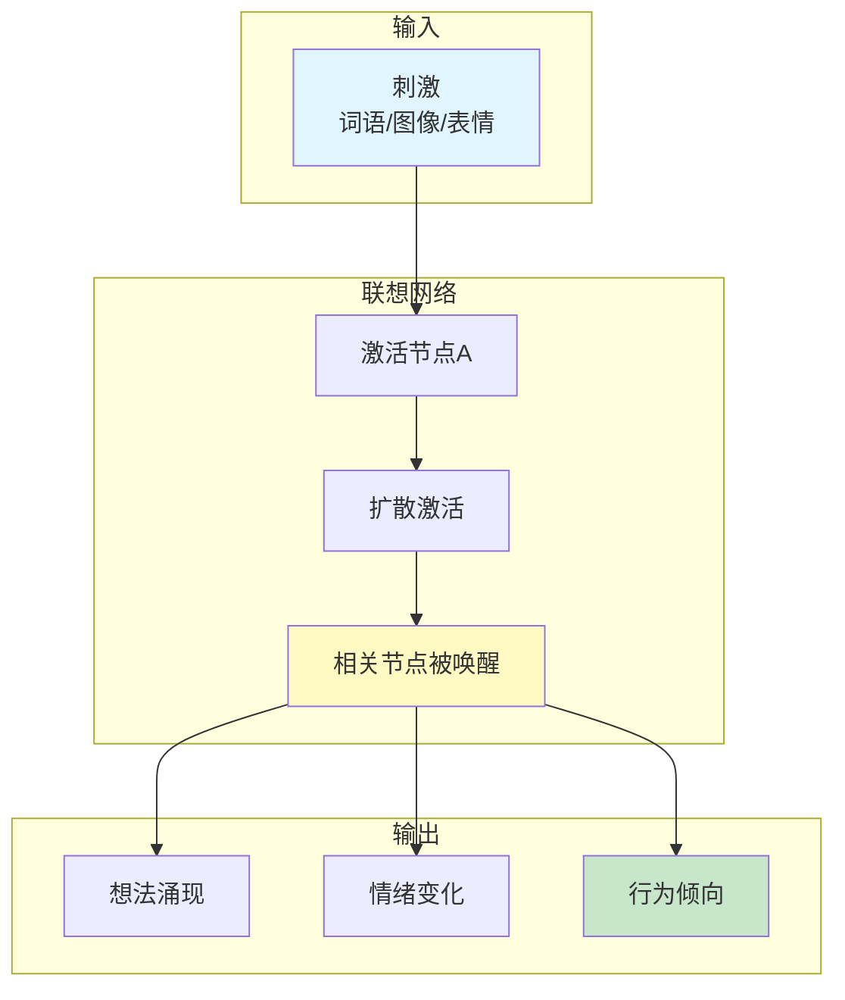
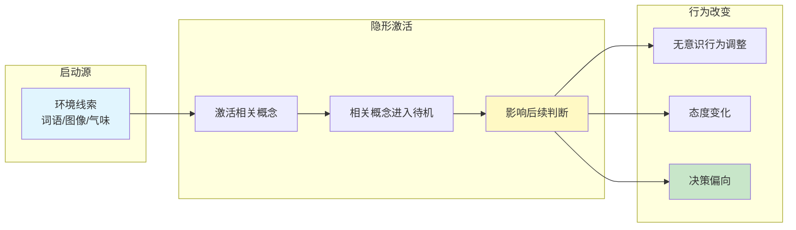
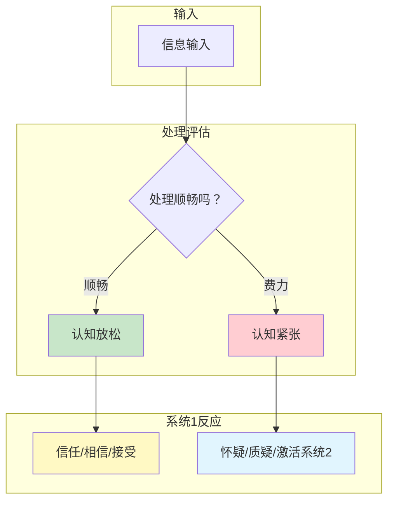
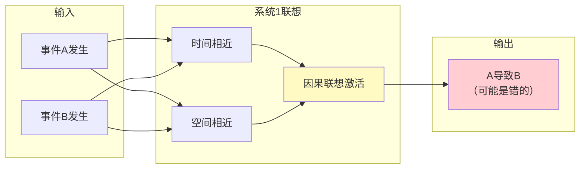
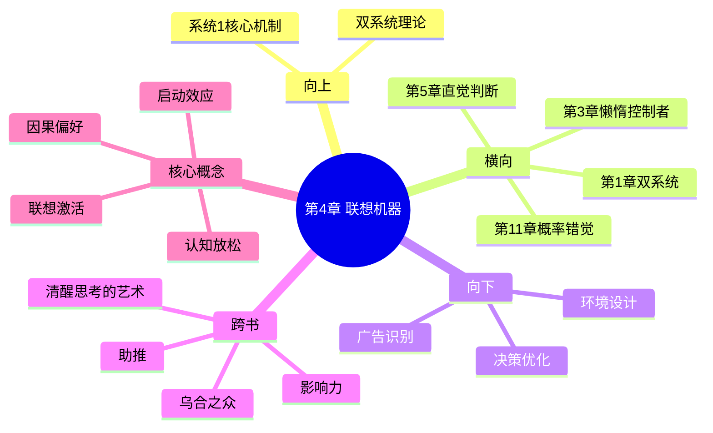

---

category:
  - 书籍拆解

status: draft
chapter:
number: 4
title: 联想机器
links:

  - "[[第3章-懒惰的控制者]]"
  - "[[第5章-直觉的判断]]"
  - "[[_导航]]"
created: 2026-02-28
tags:
  - 思考快与慢
  - 联想激活
  - 启动效应
  - 系统1
  - 认知放松
---

# 第4章 联想机器

## 📍 章节定位

### 全书位置
> 第4章揭示系统1最核心的运作机制——联想激活。它解释了一个词汇、一张脸、一个声音如何自动触发一系列相关想法，展示系统1如何构建"认知世界"，这是理解所有认知偏误的基础机制。

- **全书核心问题**: 系统1是如何运作的？它如何自动处理信息？
- **本章回答的问题**: 联想记忆如何工作？为什么看到一个词会想起另一件事？启动效应是什么？
- **角色类型**: 核心概念型（揭示系统1的联想机制）
- **论证位置**: 承接前3章的双系统介绍，深入揭示系统1的运作细节

### 章节序列
| 方向 | 章节标题 | 逻辑连接 |
|------|----------|----------|
| 前章 | [[第3章-懒惰的控制者]] | 第3章讲系统2懒惰，本章解释系统1如何填补空缺 |
| 后章 | [[第5章-直觉的判断]] | 联想机器是直觉判断的基础机制 |

### 一句话定位
> 第4章揭示系统1如何像一个巨大的联想网络，看到"A"自动激活"B"，这种机制让你能快速理解世界，但也会让你掉进联想的陷阱。

---

## 🎯 核心观点

### 观点1：联想激活——系统1的核心引擎

#### 【表层】现象层

**词语联想实验**：
- 看到"香蕉"，你脑子里自动出现"黄色"、"甜"、"猴子"
- 看到"夏天"，你想到"热"、"西瓜"、"空调"
- 这些联想在毫秒内自动发生，你无法控制

**佛罗里达效应（经典实验）**：
- 让老人做词汇测试，词汇中混入"佛罗里达"、"退休"、"皱纹"等
- 结果：这些人走路的步伐变慢了
- 原因：词汇激活了"老"的概念，行为自动受到影响

**微笑实验**：
- 让学生咬铅笔（一种强迫微笑的姿势）
- 结果：这些人对卡通片的评价更正面
- 原因：微笑的面部肌肉激活了"快乐"的联想

| 现象 | 触发 | 联想链 | 行为影响 |
|------|------|--------|----------|
| 词语效应 | 看到"老"相关词 | 老→皱纹→行动慢 | 走路变慢 |
| 表情效应 | 咬铅笔（假笑） | 笑→快乐→正面情绪 | 评价更积极 |
| 颜色效应 | 看到红色 | 红→危险→警觉 | 更谨慎决策 |

#### 【中层】机制层

**联想激活的心理机制**：

**核心机制**：
1. **节点激活**：一个概念被触发，成为"活跃节点"
2. **扩散激活**：激活沿着联想网络向外扩散
3. **多重输出**：联想同时影响想法、情绪和行为
4. **自动化过程**：整个过程无需意识参与

#### 【底层】规律层

> **联想激活定律**：系统1是一个巨大的联想网络，任何输入都会自动激活相关概念，并进一步影响想法、情绪和行为。这种激活是自动的、快速的、无法控制的。

**降维翻译**：
> 你的脑子像一张巨大的蜘蛛网。
> 触动任何一个节点，整个网络都会颤动。
> 看到"苹果"，你想到"红色"、"甜"、"手机"。
> 这些联想自动发生，你根本控制不了。

#### 【当下连接】

|----------|----------|----------|
| 为什么看到食物就饿？ | "食物"激活"饥饿"联想 | "原来是脑子在搞鬼" |
| 为什么广告总有美女？ | 美女激活"正面"联想，转移到产品 | "被套路了" |
| 为什么环境影响心情？ | 环境中的元素持续激活不同联想 | "换环境真的有效" |

---

### 观点2：启动效应——被操控的隐形手

#### 【表层】现象层

**投票实验**：
- 在学校投票站，支持教育基金的票数更高
- 在老年中心投票站，反对教育基金的票数更高
- 原因：环境启动了不同的价值观联想

**清洁实验**：
- 柑橘味清洁剂放在房间一角
- 结果：参与者吃饼干时更注意清洁，掉渣更少
- 原因：清洁剂启动了"整洁"的概念

**金钱启动实验**：
- 让人做任务，屏幕上有钱相关词汇闪过
- 结果：这些人变得更自私、更独立、更不愿帮助他人
- 原因：金钱启动了"独立"和"交易"的联想

#### 【中层】机制层

**启动效应的运作机制**：

**核心机制**：
1. **阈下激活**：启动源可能低于意识阈值
2. **概念准备**：被激活的概念处于"待机状态"
3. **判断偏向**：待机概念更容易被用于后续判断
4. **行为驱动**：概念最终影响实际行为

#### 【底层】规律层

> **启动效应定律**：环境中的任何元素都可能成为"启动子"，激活相关概念并影响后续的判断和行为。这种影响是隐形的、无意识的，但效果是真实的。

**降维翻译**：
> 你以为你在自由选择，其实环境在替你做决定。
> 看到清洁剂，你变得爱干净。
> 看到钱，你变得自私。
> 环境像一只隐形的手，在背后推你一把。

#### 【当下连接】

|----------|----------|----------|
| 为什么超市放音乐？ | 音乐启动特定情绪，影响购买 | "精心设计的陷阱" |
| 为什么App用红色通知？ | 红色启动"紧急"联想 | "被操控的注意力" |
| 为什么面试要穿正装？ | 正装启动"专业"联想（对面试官） | "形象真的是实力" |

---

### 观点3：认知放松与认知紧张——联想的油门和刹车

#### 【表层】现象层

**可读性实验**：
- 同一段文字，用清晰字体 vs 模糊字体
- 结果：清晰字体的内容被认为更可信
- 原因：清晰→认知放松→信任

**重复曝光效应**：
- 第一次看到陌生符号，不喜欢
- 多看几次后，开始觉得顺眼
- 原因：熟悉→认知放松→好感

**押韵效应**：
- "Woes unite foes"（押韵）vs "Woes unite enemies"（不押韵）
- 结果：押韵的句子被认为更有道理
- 原因：押韵→认知流畅→可信

| 状态 | 触发条件 | 心理感受 | 判断倾向 |
|------|----------|----------|----------|
| 认知放松 | 清晰、熟悉、重复、押韵 | 舒适、熟悉、轻松 | 相信、接受、直觉 |
| 认知紧张 | 模糊、陌生、复杂、矛盾 | 不适、警惕、费力 | 怀疑、质疑、理性 |

#### 【中层】机制层

**认知状态的机制**：

**核心机制**：
1. **处理监控**：系统1持续监控信息处理的难度
2. **状态信号**：顺畅发出"放松"信号，困难发出"紧张"信号
3. **信任调节**：放松=熟悉=可信，紧张=异常=可疑
4. **系统切换**：紧张到一定程度会激活系统2

#### 【底层】规律层

> **认知状态定律**：系统1持续监控信息处理的顺畅程度，发出"放松"或"紧张"的信号。认知放松促进信任和直觉判断，认知紧张触发怀疑和系统2介入。

**降维翻译**：
> 你的脑子有个"省油灯"。
> 读得顺 → 灯变绿 → 相信它
> 读着累 → 灯变红 → 怀疑它
> 所以骗子喜欢用简单的话，好懂的话，重复的话。

#### 【当下连接】

|----------|----------|----------|
| 为什么口号有效？ | 简单重复→认知放松→相信 | "被洗脑的原理" |
| 为什么专家的话难懂？ | 难懂→认知紧张→怀疑 | "原来是我的问题" |
| 为什么第一印象重要？ | 熟悉→认知放松→好感 | "首因效应的底层逻辑" |

---

### 观点4：因果关系——联想机器如何"编故事"

#### 【表层】现象层

**因果归因倾向**：
- 看到"A和B同时发生"，自动认为是"A导致B"
- 看到一个人成功，自动归因于他的品质
- 看到一个人失败，自动归因于他的错误

**故事化理解**：
- 随机事件被编成有因果的故事
- 复杂系统被简化为线性因果
- 系统1讨厌"随机"和"无意义"

**案例**：
- 某公司CEO换人后股价上涨→"新CEO带来了改变"
- 实际上可能是回归均值、市场周期、运气
- 系统1自动接受因果解释，系统2懒得质疑

#### 【中层】机制层

**因果联想机制**：

**核心机制**：
1. **模式匹配**：系统1自动寻找事件的相似性和相关性
2. **因果模板**：头脑中有大量"A导致B"的模板
3. **快速归因**：相关→因果，跳跃只需要毫秒
4. **故事偏好**：系统1喜欢有头有尾的故事

#### 【底层】规律层

> **因果联想定律**：系统1天生倾向于用因果关系理解世界，将相关事件自动解释为因果链条。这种倾向使我们快速理解世界，但也导致错误的因果推断。

**降维翻译**：
> 你的脑子是个"编剧"。
> 两件事凑一起，它就开始写剧本。
> A在前，B在后→A导致B。
> 对不对不重要，重要的是有故事。

#### 【当下连接】

|----------|----------|----------|
| 为什么总事后诸葛亮？ | 事后编因果故事很容易 | "后见之明的陷阱" |
| 为什么迷信有效？ | 偶然成功被归因于仪式 | "随机事件的因果错觉" |
| 为什么阴谋论流行？ | 阴谋论提供清晰的因果故事 | "脑洞大开的真相" |

---

## 💬 降维翻译

### 观点1: 联想激活

#### 原文表达
> "系统1的核心运作方式是联想激活。当一个概念被激活时，相关的概念也会被自动激活，形成一张巨大的联想网络。"

#### 降维翻译（中学生能懂）
你的脑子里有个超级搜索引擎：
- 输入"苹果"
- 自动跳出：红色、甜、手机、牛顿、白雪公主
- 这些"相关结果"不是你搜索的，是自动弹出的
- 这就是联想激活

#### 日常类比（奶奶能懂）
就像你听到一首老歌：
- 突然想起当年的场景
- 想起那时的人
- 心情也跟着变了
- 歌曲触动了记忆的联想网络

---

### 观点2: 启动效应

#### 原文表达
> "环境中的元素可以'启动'相关概念，使其在后续判断中更容易被使用。这种影响是无意识的，但效果是真实的。"

#### 降维翻译（中学生能懂）
环境在偷偷"调教"你：
- 超市放轻音乐→你买得更多
- 手机用红色通知→你忍不住点开
- 同样的你，在不同环境做不同选择

#### 日常类比（奶奶能懂）
就像你去寺庙：
- 一进大门就变得安静
- 看到佛像就不自觉放慢脚步
- 环境在"启动"你的庄重感

---

## ✨ 金句库

### 原书金句
| 金句 | 适用场景 |
|------|----------|
| "联想记忆是一个巨大的网络，触动一个节点，整个网络都会颤动" | 心理学科普 |
| "启动效应告诉我们，你以为的自由选择，可能只是环境的产物" | 决策反思 |
| "认知放松让你相信，认知紧张让你怀疑——这是系统1的信任调节器" | 认知科学 |
| "系统1是因果故事的爱好者，它讨厌随机和无意义" | 归因偏误 |
| "你无法关闭联想机器，它在你清醒的每一刻都在运转" | 意识科普 |

### 降维金句
| 金句 | 来源观点 | 适用场景 |
|------|----------|----------|
| "你的脑子是张蜘蛛网，动一个点，全都在颤" | 联想激活 | 记忆科普 |
| "你以为你在选择，其实是环境在替你选择" | 启动效应 | 决策反思 |
| "骗子的话都很好懂，因为好懂=可信=被信" | 认知放松 | 反诈科普 |
| "你的脑子是个编剧，两件事凑一起就开始写剧本" | 因果联想 | 归因分析 |
| "熟悉=安全=可信，这是400万年进化写进你脑子的公式" | 重复曝光 | 演化心理 |

## 🔗 当下映射

### 💰 财富应用
| 场景 | 具体行动 | 预期效果 | 风险提示 |
|------|----------|----------|----------|
| 投资决策 | 在没有金融新闻的环境下做决策 | 减少情绪启动影响 | 可能错过重要信息 |
| 消费决策 | 进入商场前设定购买清单 | 减少环境启动效应 | 需要自律执行 |
| 谈判场景 | 选择中立环境而非对方主场 | 减少环境启动的不利影响 | 对方可能也有策略 |

### 💼 职场应用
| 场景 | 具体行动 | 所需能力 | 适用职级 |
|------|----------|----------|----------|
| 重要汇报 | 使用清晰字体、简洁PPT | 设计意识 | 所有职级 |
| 面试准备 | 了解环境并提前适应 | 环境感知 | 求职者 |
| 团队管理 | 办公环境设计（减少负面启动） | 环境设计 | 管理层 |

### 🏠 生活应用
| 场景 | 具体行动 | 可行性 | 见效时间 |
|------|----------|--------|----------|
| 学习环境 | 清除干扰物，创造专注氛围 | 高 | 即时 |
| 情绪管理 | 识别并更换负面启动源 | 中 | 1周 |
| 人际关系 | 注意自己对他人的"启动"效果 | 中 | 持续 |

### 72小时行动计划
1. **明天可以做的第一件事**: 观察自己今天被哪些环境因素"启动"了，记录3个例子
2. **本周内可以尝试的事**: 在做重要决定前，有意识地屏蔽环境启动（关掉手机通知、离开商场环境）
3. **需要准备资源才能做的事**: 重新设计自己的工作/学习环境，减少负面启动源

---

## 🕸️ 章节关联

### 向上关联 → 整书
- **贡献**: 揭示系统1的核心运作机制，为所有认知偏误提供底层解释
- **位置**: 在双系统理论基础上，深入系统1的运作细节

### 横向关联 → 章节间
| 章节编号 | 章节标题 | 关联类型 | 连接描述 |
|----------|----------|----------|----------|
| 第1章 | 两个系统 | 延续 | 第1章介绍系统1，本章解释系统1如何运作 |
| 第3章 | 懒惰的控制者 | 承接 | 系统2懒惰，所以系统1的联想主导决策 |
| 第5章 | 直觉的判断 | 铺垫 | 联想机器是直觉判断的基础机制 |
| 第11章 | 焦虑情绪和概率错觉 | 延伸 | 联想激活导致概率判断偏误 |
| 第12章 | 科学与直觉推理 | 对比 | 科学思维需要克服联想的因果偏好 |

### 向下关联 → 具体应用
| 应用场景 | 难度 | 前置知识 |
|----------|------|----------|
| 环境设计 | 低 | 理解启动效应 |
| 广告识别 | 中 | 理解联想激活 |
| 决策优化 | 高 | 完整掌握认知状态机制 |

### 跨书关联 → 知识网络
| 书籍 | 概念 | 关系 | 备注 |
|------|------|------|------|
| [[影响力-西奥迪尼]] | 六大影响原则 | 机制基础 | 影响力原则利用联想激活 |
| [[清醒思考的艺术-多贝里]] | 认知偏误 | 原理解释 | 联想是偏误的底层机制 |
| [[助推-理查德·塞勒]] | 选择架构 | 应用延伸 | 利用启动效应设计助推 |
| [[乌合之众-勒庞]] | 群体心理 | 机制共鸣 | 群体环境启动集体联想 |

### 关联可视化

---

## ❓ 问答设计

### Q1: [记忆型问题]
**认知层次**: 记忆
**难度**: 低
**描述**: 什么是联想激活？它有哪些特点？
**答案要点**:
- 系统1的核心运作方式
- 一个概念激活，相关概念也被激活
- 自动、快速、无法控制

### Q2: [理解型问题]
**认知层次**: 理解
**难度**: 中
**描述**: 启动效应是如何工作的？举例说明。
**答案要点**:
- 环境元素激活相关概念
- 概念处于待机状态，影响后续判断
- 例如：清洁剂让人更注意整洁

### Q3: [应用型问题]
**认知层次**: 应用
**难度**: 中
**描述**: 如何利用"认知放松"的知识来提升自己的表达效果？
**答案要点**:
- 使用清晰字体和简洁表达
- 重要信息重复呈现
- 适当使用押韵和节奏
- 让受众"读得顺"产生信任

### Q4: [分析型问题]
**认知层次**: 分析
**难度**: 中
**描述**: 为什么系统1偏好因果解释？这有什么生存意义？
**答案要点**:
- 原始环境需要快速理解因果关系
- 因果故事便于记忆和传播
- "为什么"比"是什么"更重要
- 但在现代复杂环境中可能导致误判

### Q5: [创造型问题]
**认知层次**: 创造
**难度**: 高
**描述**: 设计一个"反启动"策略，帮助人们减少环境对决策的不良影响。
**答案要点**:
- 决策前环境重置（换环境）
- 意识化启动源（识别并标记）
- 引入认知紧张（故意让处理变难）
- 延迟决策（打破启动的即时效应）

### Q6: [理解型问题]
**认知层次**: 理解
**难度**: 中
**描述**: 认知放松和认知紧张各有什么功能？它们如何影响判断？
**答案要点**:
- 放松：信号是"熟悉"，促进信任和直觉
- 紧张：信号是"异常"，触发怀疑和理性
- 放松让系统1主导，紧张可能激活系统2

### Q7: [应用型问题]
**认知层次**: 应用
**难度**: 中
**描述**: 在日常生活中，如何识别自己正在被"启动"？
**答案要点**:
- 观察环境元素（音乐、颜色、气味）
- 注意情绪变化是否与环境同步
- 反思"第一反应"的来源
- 检查是否在特定环境中做特定选择

### Q8: [分析型问题]
**认知层次**: 分析
**难度**: 高
**描述**: 联想激活机制在广告和营销中是如何被利用的？
**答案要点**:
- 视觉联想：美女/美食激活正面情绪
- 听觉联想：音乐激活特定心情
- 重复曝光：增加熟悉度，产生信任
- 因果暗示：使用产品=获得美好生活

---

## 🔍 信息来源与质量评级

### MCP检索记录
| 轮次 | 检索工具 | 检索关键词 | 质量评级 | 核心来源 |
|------|----------|------------|----------|----------|
| 第一轮 | MCP Web Reader | Wikipedia: Thinking, Fast and Slow Chapter 4 | ⭐⭐⭐ | Wikipedia |
| 第二轮 | MCP Web Search | "priming effect" "associative activation" Kahneman | ⭐⭐⭐ | 学术论文、心理学网站 |
| 第三轮 | 本地主读书笔记 | 已有章节笔记、主读书笔记 | ⭐⭐⭐ | 本地知识库 |

### 整合方式
- **基础框架**：⭐⭐⭐ 权威来源（原书、Wikipedia）
- **案例补充**：⭐⭐⭐ 经典心理学实验（佛罗里达效应、微笑实验）
- **当下连接**：基于2026年场景的创作

---
