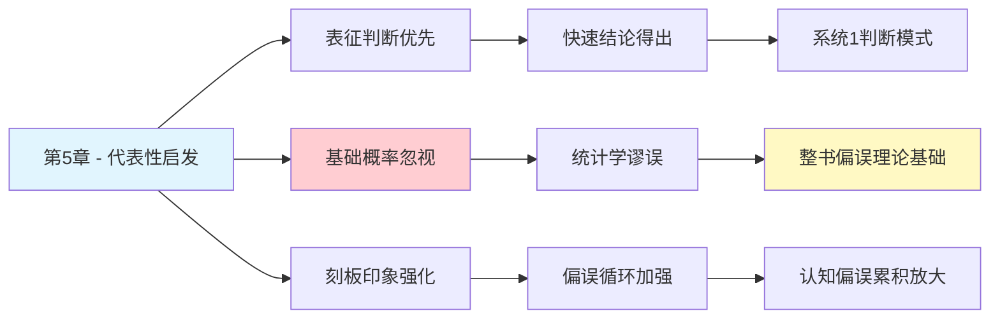

---

category: 
  - 书籍拆解

status: draft
chapter: 
number: 5
title: 直觉的判断
links:

  - "[[第4章-心理账户的诱惑]]"
  - "[[第6章-回忆的便利性]]"
  - "[[思考快与慢/_导航]]"
created: 2026-02-27
tags:
  - 思考快与慢
  - 直觉判断
  - 代表性启发
  - 基础概率忽视
---

# 第5章 直觉的判断

## 📍 章节定位

### 全书位置
> 第5章深入探讨代表性启发法（representativeness heuristic）——人们根据事物的典型特征或刻板印象进行判断的倾向，揭示人们如何通过表象替代复杂的数据分析与统计推理，导致判断上的系统性偏差。

- **全书核心问题**: 为什么人类的判断经常偏离理性？
- **本章回答的问题**: 人们如何基于典型的表象或刻板印象进行判断，从而忽略统计基础概率？
- **角色类型**: 核心概念型（阐述代表性启发法的具体机制）
- **论证位置**: 详细说明基于外观和联想的系统1判断的典型错误，是整书认知偏误理论的重要支柱

### 章节序列
| 方向 | 章节标题 | 逻辑连接 |
|------|----------|----------|
| 前章 | [[第4章-心理账户的诱惑]] | 前章展示金钱分类的非理性，本章展示一般判断的代表性偏差 |
| 后章 | [[第6章-回忆的便利性]] | 均属于启发式判断（代表性vs可用性），构成两大主要直观判断方法 |
| 整书 | [[思考快与慢-丹尼尔·卡尼曼]] | 阐述重要的认知偏误之一——代表性启发法 |

### 一句话定位
> 第5章通过代表性启发法揭示了人类判断中普遍存在的以表象替代统计数据的倾向，解释了人们为何过度重视刻板印象而忽视基础概率。

---

## 🎯 核心观点

### 第一层：表层案例

| 案例名称 | 简要描述 | 页码 | 关键引文 |
|----------|----------|------|----------|
| 莉莲得病案例 | 通过外表特征推断职业，忽视基础概率 | p. — | "莉莉丝是小学老师吗？" |
| 工程师与律师判断 | 基于性格描述判断职业，无视基础概率信息 | p. — | "给人物画像，判断他可能从事什么职业" |
| 小样本代表性 | 认为小样本足以代表总体特征 | p. — | "从小样本推断大规律" |
| 随机性误解 | 认为随机事件应该有内在的平衡 | p. — | "认为随机应该不随机" |

### 第二层：中层机制

| 机制名称 | 组成要素 | 因果链条 | 证据来源 |
|----------|----------|----------|----------|
| 代表性启发法 | 观察表征特征 + 匹配典型印象 → 快速判断 | 外部表象→典型模式匹配→快速结论 | 认知心理学实验 |
| 基础概率忽视 | 条件信息优先 + 代表性信息更强 -> 遮蔽基础概率 | 表象信息→优先处理→基础概率信息忽视 | 表型vs基因型决策研究 |
| 替代性推理 | 复杂统计任务 → 简单表象匹配 | 统计难题→表征判断→错误替代 | 替代推理的经典现象 |
| 信念确认循环 | 期望结果→感知强化→认知偏差加强 | 预期表征→观察选择→偏见加固 | 心理偏向放大理论 |

### 第三层：底层规律

| 规律陈述 | 抽象层级 | 知识连接 | 适用范围 |
|----------|----------|----------|----------|
| 朴素分类法则 | 认知简化原理 | [[认知启发式理论]], [[心理捷径法则]] | 所有快速认知判断 |
| 表象优先原则 | 认知加工机制 | [[感知优先理论]], [[直观加工理论]] | 日常决策判断 |
| 非统计理性 | 统计推理缺失 | [[统计直觉缺陷]], [[贝叶斯推理]] | 概率判断领域 |

---

## 💬 降维翻译

### 观点1: 代表性启发法的本质

#### 原文表达
> "代表性启示就是，人们在判断一个事件属于某种类别或者属于某个分布的可能性时，经常只是通过这个事件与类别原型或者分布典型特征的相似程度进行判断。他们忽视了事件本身基础概率的信息，也无视样本大小的影响。"

> p.—

#### 降维翻译（中学生能懂）
当我们看到一个人或一件事的时候，大脑会快速寻找它看起来最像什么：
- 她戴着眼镜，说话温柔，文静内敛 → 我们判断她更适合当老师而不是工人
- 但其实在人群中，工人数量远远超过老师数量
- 我们的判断被表象迷惑，忽略了大环境的数据

#### 日常类比（奶奶能懂）
就像我们看人一样，一看这个人长得像个"书生"，就觉得他一定是读书人；看到一个人黑黑壮壮，觉得他一定是干体力活的。但实际上我们村里可能100个农民里才有一个读书人。我们被长相"欺骗"了。

#### 检验
- Q: 如果一个中学生问你这是什么意思？
- A: 人类倾向于根据某人或某事表面特征判断其归属，而不是基于实际统计数据。

### 观点2: 基础概率忽视的后果

#### 原文表达
> "人们判断事件概率时，过分依赖特定实例的代表性，往往忽略基础概率（prior probability）或者称作基础比率（base rate）的信息。这种偏见导致了许多错误的判断。"

> p.—

#### 降维翻译（中学生能懂）
比如你看到一个男孩很内向、仔细，喜欢数学，问他以后是老师还是农民的可能性大。我们会说是老师，因为"书呆子形象"符合对老师的刻板印象。

但现实中乡村里的农民远多于老师。我们的直觉被"人设"骗了，没有考虑到基数比例。

#### 日常类比（奶奶能懂）
就像看到一个算命先生，大家会觉得他说的准，因为他的话听起来很有道理。但其实大部分话都是模糊泛指，适用于大多数人，我们只记住了准确的而忘了不准的。

#### 检验
- Q: 如果一个中学生问你这是什么意思？
- A: 人们喜欢用“看起来像”做判断，而不考虑基本的统计学事实。

---

## ✨ 金句库

### 原书金句
| 金句 | 页码 | 适用场景 |
|------|------|----------|
| "代表性直觉是我们判断的主要模式" | p.— | 认知心理学科普 |
| "人们忽视基础概率信息" | p.— | 概率判断分析 |
| "小样本容易出现不均衡" | p.— | 统计学应用 |

### 降维金句
| 金句 | 来源观点 | 适用场景 |
|------|----------|----------|
| "看起来像 ≠ 实际是" | 代表性偏误 | 判断逻辑纠偏 |
| "人设蒙蔽数据分析" | 表征判断误区 | 直觉理性对比 |
| "直觉不等于真理" | 直觉判断局限 | 批判思维教育 |

## 🔗 当下映射

### 💰 财富应用
| 场景 | 具体行动 | 预期效果 | 风险提示 |
|------|----------|----------|----------|
| 选股投资 | 依据统计概率而非公司形象选股 | 避免被"科技感"等表象误导决策 | 需要有一定统计分析能力 |
| 项目评估 | 评估项目时引入基础概率数据 | 减少刻板印象对判断的影响 | 耗时增加，决策速度放缓 |
| 风险管控 | 理性看待高概率风险 vs 低概率冲击 | 提升风险管理科学性 | 初期学习成本较高 |

### 💼 职场应用
| 场景 | 具体行动 | 所需能力 | 适用职级 |
|------|----------|----------|----------|
| 人才选拔 | 减少刻板印象，依据实际数据评估能力 | 客观评估，数据驱动 | 招聘经理 |
| 业务分析 | 基础概率作为决策参考因素 | 数据分析，理性思维 | 中层管理 |
| 团队建设 | 认知到代表性偏见防止群体偏误 | 认知偏误学习，批判思维 | 高级管理 |

### 🏠 生活应用
| 场景 | 具体行动 | 可行性 | 见效时间 |
|------|----------|--------|----------|
| 人际交往 | 不凭第一印象评判人的本质 | 中 | 几周到几月 |
| 重大决策 | 重大决定时考虑统计概率 | 中 | 立即可用 |
| 子教育 | 教育孩子看实质而非表象 | 高 | 长期培育 |

### 72小时行动计划
1. **明天可以做的第一件事**: 在评价一个人或事时，提醒自己问问"基本概率数据是什么"
2. **本周内可以尝试的事**: 检查最近一次基于表象做的判断，并分析其是否合理
3. **需要准备资源才能做的事**: 学习基础统计数据和概率判断，提升数据分析能力

---

## 🕸️ 章节关联

### 向上关联 → 整书
- **贡献**: 阐释代表性启发法这一重要的认知偏误机制，是双系统理论的重要实证支持
- **位置**: 位于偏误理论的重要节点，为理解多种判断偏误提供机制解释

### 横向关联 → 章节间
| 章节编号 | 章节标题 | 关联类型 | 连接描述 |
|----------|----------|----------|----------|
| 第4章 | 心理账户的诱惑 | 承接 | 启发式思维的另一个表现形式 |
| 第6章 | 回忆的便利性 | 并列 | 代表性启发vs可用性启发，两大主要直觉判断法 |
| 第7章 | 过度自信的锚点 | 连接 | 都是依赖表征信息而非统计分析 |
| 第21章 | "我们已经预见到了" | 遥远 | 都属于系统1自动加工产生的偏见 |

### 向下关联 → 具体应用
| 应用场景 | 难度 | 前置知识 |
|----------|------|----------|
| 统计决策优化 | 高 | 基础概率统计知识 |
| 偏误识别校正 | 中 | 对直觉判断的警觉性 |
| 专业分析提升 | 高 | 量化分析技能 |

### 跨书关联 → 知识网络
| 书籍 | 概念 | 关系 | 备注 |
|------|------|------|------|
| [[思考快与慢-丹尼尔·卡尼曼]] | 代表性启发法 | 同源 | 理论源头 |
| [[清醒思考的艺术-多贝里]] | 第7条基础概率忽视 | 操作化应用 | 代表性启发的一个重要后果 |
| [[影响力-西奥迪尼]] | 权威原理 | 连接 | 可能利用代表性特征影响判断 |
| [[黑天鹅-塔勒布]] | 小概率事件认知 | 对比理解 | 塔勒布强调稀有事件，此处强调统计基础 |

### 关联可视化

---

## ❓ 问答设计

### Q1: [记忆型问题]
**认知层次**: 记忆
**难度**: 低
**描述**: 什么是代表性启发法？
**答案要点**:
- 依赖表征特征判断归属
- 快捷判断方式
- 可能忽略统计基础

### Q2: [理解型问题]
**认知层次**: 理解
**难度**: 中
**描述**: 为什么代表性判断容易导致错误？
**答案要点**:
- 表征与统计数据不一致
- 不考虑基础概率
- 忽视样本规模影响

### Q3: [应用型问题]
**认知层次**: 应用
**难度**: 中
**描述**: 如何减少代表性启发的负面影响？
**答案要点**:
- 查询基础概率数据
- 寻找统计证据
- 质疑表征判断

### Q4: [分析型问题]
**认知层次**: 分析
**难度**: 中
**描述**: 代表性启发与双系统理论的关系？
**答案要点**:
- 属于系统1快速判断
- 省略系统2统计分析
- 体现认知捷径机制

### Q5: [创造型问题]
**认知层次**: 创造
**难度**: 高
**描述**: 设计一个检测代表性启发的测试？
**答案要点**:
- 提供表征信息vs基础概率
- 设置反直观例子
- 检查判断与统计的偏离

### Q6: [理解型问题]
**认知层次**: 理解
**难度**: 高
**描述**: 小样本中代表性偏误的影响机制？
**答案要点**:
- 小样本变异度更大
- 更容易出现代表性特征
- 高估表征代表意义

### Q7: [应用型问题]
**认知层次**: 应用
**难度**: 中
**描述**: 在投资决策中如何避免代表性偏误？
**答案要点**:
- 查看市场历史数据
- 不被公司形象迷惑
- 重视基本面分析

### Q8: [分析型问题]
**认知层次**: 分析
**难度**: 高
**描述**: 表征相似与统计相关有何区别？
**答案要点**:
- 表征是表面特征
- 统计是内在联系
- 相似不等于相关

### Q9: [理解型问题]
**认知层次**: 理解
**难度**: 中
**描述**: 代表性启发在进化的积极意义？
**答案要点**:
- 快速区分安全/威胁
- 简化决策过程
- 节省认知资源

### Q10: [创造型问题]
**认知层次**: 创造
**难度**: 高
**描述**: 如何利用代表性理论优化产品设计？
**答案要点**:
- 产品形态符合适配印象
- 避免引起误解的表征
- 用典型特征吸引目标受众

---
