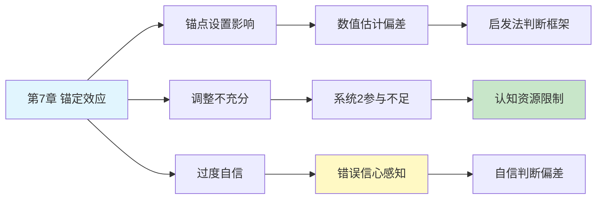

---

category: 
  - 书籍拆解

status: draft
chapter: 
number: 7
title: 过度自信的锚点
links:

  - "[[第6章-回忆的便利性]]"
  - "[[第8章-多重信念的不一致]]"
  - "[[思考快与慢/_导航]]"
created: 2026-02-27
tags:
  - 思考快与慢
  - 锚定效应
  - 过度自信
  - 调整不充分
description: "第7章深入阐述锚定效应（anchoring effect）——人们在做出定量估计时，会受到最先获得信息（锚点）的过度影响，即使该信息与实际估计内容完全无关，同时揭示锚点如何激发过度自信的判断。"
---

# 第7章 过度自信的锚点

## 📍 章节定位

### 全书位置
> 第7章深入阐述锚定效应（anchoring effect）——人们在做出定量估计时，会受到最先获得信息（锚点）的过度影响，即使该信息与实际估计内容完全无关，同时揭示锚点如何激发过度自信的判断。

- **全书核心问题**: 为什么人类的判断经常偏离理性？
- **本章回答的问题**: 人们如何被第一眼看到的数量信息所影响，哪怕这个数字与判断目标完全无关？
- **角色类型**: 核心概念型（阐述锚定-调整启发的机制）
- **论证位置**: 探讨系统1的另一个重要判断机制，并引出过度自信主题

### 章节序列
| 方向 | 章节标题 | 逻辑连接 |
|------|----------|----------|
| 前章 | [[第6章-回忆的便利性]] | 与可用性启发并列为系统1重要判断方法之一 |
| 后章 | [[第8章-多重信念的不一致]] | 锚定导致的初步判断可能与其他信念冲突 |
| 整书 | [[思考快与慢-丹尼尔·卡尼曼]] | 论述重要认知偏误——锚定效应及其后果 |

### 一句话定位
> 第7章揭示了锚定效应——人类判断被初始数值严重影响的现象，展示了人们在量化估计中如何受无关信息支配，并由此衍生出过度自信。

---

## 🎯 核心观点

### 第一层：表层案例

| 案例名称 | 简要描述 | 页码 | 关键引文 |
|----------|----------|------|----------|
| 轮盘数字实验 | 拇指数值影响对联合国非洲国家比例的估计 | p.— | "轮盘停在数字上，参与者估计数值接近此数" |
| 联合国问题 | 模糊问题与锚点数字的混合效应 | p.— | "即使锚点不真实也影响估计" |
| 价格锚点 | 贵产品的存在提升其他产品相对吸引力 | p.— | "锚定价格成为参照系" |
| 风险评估 | 基数效应影响风险程度主观评估 | p.— | "初始数值影响最终判断" |

### 第二层：中层机制

| 机制名称 | 组成要素 | 因果链条 | 证据来源 |
|----------|----------|----------|----------|
| 锚定-调整启发 | 锚点设置 + 不足调整 | 初始数字→调整不充分→锚点影响 | 认知加工机制实验 |
| 启动效应 | 激活相关范围 + 高估相关 | 锚点数值→心理范围激活→估计趋近 | 无意识启动影响 |
| 启发式替代 | 复杂估算→简单对比转换 | 复杂问题→锚点参考→简化判断 | 替代策略实证研究 |
| 认知资源约束 | 判断努力 + 节省原则 | 不完全调整→系统2参与不足 | 认知负荷干预实验 |

### 第三层：底层规律

| 规律陈述 | 抽象层级 | 知识连接 | 适用范围 |
|----------|----------|----------|----------|
| 参照系依赖原则 | 知觉相对性原理 | 感知对比原理, 认知框架理论 | 人类所有定量评估领域 |
| 启发式加工倾向 | 认知节能法则 | 双重处理理论, 认知资源限制 | 快速判断决策领域 |
| 有界理性特性 | 有限认知理性 | 西蒙理性理论, 心理捷径法则 | 人类理性决策边界 |

---

## 💬 降维翻译

### 观点1: 锚定效应的运作机制

#### 原文表达
> "锚定效应是指在做出数量估计时，人们受到一个不相关初始值（锚点）的影响，即使被明确告知该数值与问题无关，仍然影响人们的判断。这个现象揭示了系统1在缺乏足够信息时会利用任意可用的数值作为判断起点，并做出不充分的调整。"

> p.—

#### 降维翻译（中学生能懂）
当你需要猜一个数值的时候，如果别人先告诉你一个数字，你的猜测就会受到这个数字的影响：
- 如果他们先说10万，你会猜更高的数
- 如果他们先说1万，你的猜测就会低一些
- 即使你知道第一个数字跟你需要判断的毫无关系

就像称体重时，秤的指针如果没有归零，所有重量都会受影响。

#### 日常类比（奶奶能懂）
就像你心里有个固定的价格杆子，所有的价格都在跟它比较：
- 去市场买菜，第一家店很贵，后面看起来便宜的其实也不便宜
- 看房子时中介先带你看个极差的房子，之后看普通的都觉得不错
- 薪资谈判也是，先开口说的数字就像定音调一样影响最终结果

#### 检验
- Q: 如果一个中学生问你这是什么意思？
- A: 别人先说的数字会悄悄影响你后面的判断，即使那个数字跟你要判断的事没关系。

### 观点2: 锚点如何导致过度自信

#### 原文表达
> "锚定不仅是数值判断的偏差，也是自信判断的偏差来源：有了锚点之后，人们会围绕锚点进行有限调整，但调整的幅度通常过小。这种局限的调整过程会让人感觉自己的判断是经过充分考量的，从而导致过度自信。"

> p.—

#### 降维翻译（中学生能懂）
锚点不仅影响你的答案，还让你对自己的答案更有自信：
- 锚让你有个起点思考
- 你的大脑在这个起点上"调整"一些（但调整得不够）
- 然后你觉得"我仔细想了想"，对自己答案很自信
- 但其实这个"想"是从锚点开始的，从一开始就偏了

#### 日常类比（奶奶能懂）
就像你被问到某件事情的概率时，如果对方先提到"会不会是80%"，你就可能会回答"我觉得是70%"，因为你在锚的基础上往回调了点。你觉得自己调整了，所以很自信，但实际上偏离了本来应该的状态。

#### 检验
- Q: 如果一个中学生问你这是什么意思？
- A: 别人说的数字不仅影响你的答案，还会让你对自己答案的准确度过度有信心。

---

## ✨ 金句库

### 原书金句
| 金句 | 页码 | 适用场景 |
|------|------|----------|
| "锚定效应无处不在，甚至影响专家判断" | p.— | 锚定普遍性说明 |
| "我们经常基于不足的调整做出判断" | p.— | 调整不足问题 |
| "锚点一旦设定，就会主导我们思维" | p.— | 锚点控制效应 |

### 降维金句
| 金句 | 来源观点 | 适用场景 |
|------|----------|----------|
| "数字一旦进大脑，就不走了" | 锚点记忆持久力 | 认知偏误普及 |
| "第一眼看到多少，心里就定调了" | 锚定效应特征 | 日常生活分析 |
| "微调不等于独立思考" | 调整不足现象 | 偏误警惕提醒 |

## 🔗 当下映射

### 💰 财富应用
| 场景 | 具体行动 | 预期效果 | 风险提示 |
|------|----------|----------|----------|
| 价格谈判 | 引导性开局或防范锚定陷阱 | 获得更有利的谈判结果 | 过度防范失去协商空间 |
| 商品消费 | 忽略原价，仅专注于实际所需价值 | 减少冲动消费和价格欺骗影响 | 需要更多的自律和理性分析 |
| 投资估值 | 避免基于历史价位判断当前价值 | 建立更客观的投资决策模式 | 容易忽视趋势和历史价值参考 |

### 💼 职场应用
| 场景 | 具体行动 | 所需能力 | 适用职级 |
|------|----------|----------|----------|
| 薪资谈判 | 设定预期锚点或避免被设定 | 策略性沟通能力 | 所有管理层 |
| 工作量评估 | 避免根据粗略的初始估计调整 | 客观评估和批判思维 | 项目经理及以上 |
| 决策汇报 | 提供多个参照系而非单一数字 | 分析框架搭建能力 | 所有管理层 |

### 🏠 生活应用
| 场景 | 具体行动 | 可行性 | 见效时间 |
|------|----------|--------|----------|
| 人际交往判断 | 避免基于初次印象形成固化观念 | 高 | 即时生效 |
| 家庭预算规划 | 针对各项支出设定独立预算而非相对比较 | 中 | 2-4周 |
| 学习进步评估 | 客观衡量而非与初期进展对比 | 中 | 1个月 |

### 72小时行动计划
1. **明天可以做的第一件事**: 在接下来的任何涉及数字的对话或购买中，留意别人给出的第一个数字是否影响了你的想法
2. **本周内可以尝试的事**: 故意在谈判或估价时，尝试提出与对方初始报价完全不同的数值，测试锚点效果
3. **需要准备资源才能做的事**: 学习并实践"反锚定"技巧，例如在重要决策前查询无关联参考值

---

## 🕸️ 章节关联

### 向上关联 → 整书
- **贡献**: 阐释重要的数字判断偏误机制，并引出过度自信主题
- **位置**: 启发法偏见部分重要组成部分，衔接至过度自信主题

### 横向关联 → 章节间
| 章节编号 | 章节标题 | 关联类型 | 连接描述 |
|----------|----------|----------|----------|
| 第6章 | 回忆的便利性 | 并列 | 两者均属启发法，可用性影响频率估计，锚定影响量值估计 |
| 第8章 | 多重信念的不一致 | 铺垫 | 锚点设置可能与既有信念产生冲突，影响整合判断 |
| 第14章 | 参考点和框架 | 相关 | 框架效应与锚定效应共享参照系机制 |
| 第19章 | 避免主观怀疑 | 承接 | 锚点导致有限调整和过度自信 |

### 向下关联 → 具体应用
| 应用场景 | 难度 | 前置知识 |
|----------|------|----------|
| 风险评估纠错 | 高 | 专业统计知识 |
| 商务谈判策略 | 中 | 锚点效应应用能力 |
| 消费决策优化 | 低 | 日常决策意识 |

### 跨书关联 → 知识网络
| 书籍 | 概念 | 关系 | 备注 |
|------|------|------|------|
| [[思考快与慢-丹尼尔·卡尼曼]] | 锚定效应 | 同源 | 理论源头 |
| [[清醒思考的艺术-多贝里]] | 第28条锚定效应 | 系列应用 | 同一概念在实用清单中的体现 |
| [[影响力-西奥迪尼]] | 互惠原则、社会认同 | 应用扩展 | 锚定可作为影响技巧 |
| [[从0到1-彼得蒂尔]] | 独特性思维 | 对比反思 | 商业决策中的非锚定思维需求 |

### 关联可视化

---

## ❓ 问答设计

### Q1: [记忆型问题]
**认知层次**: 记忆
**难度**: 低
**描述**: 什么是锚定效应？
**答案要点**:
- 初始数值影响后续判断
- 与判断对象可能无关联
- 普遍存在于各种判断中

### Q2: [理解型问题]
**认知层次**: 理解
**难度**: 中
**描述**: 为什么锚定会产生？ 
**答案要点**:
- 认知资源限制
- 启发式策略节省
- 系统2参与不足

### Q3: [应用型问题]
**认知层次**: 应用
**难度**: 中
**描述**: 如何避免锚定效应的影响？
**答案要点**:
- 意识到锚点的存在
- 主动进行反向思考
- 查询独立基准信息

### Q4: [分析型问题]
**认知层次**: 分析
**难度**: 中
**描述**: 锚定效应与系统1/2的关系？
**答案要点**:
- 系统1设置锚点
- 系统2调整不充分
- 双系统交互产生的后果

### Q5: [创造型问题]
**认知层次**: 创造
**难度**: 高
**描述**: 设计一个减少锚定的决策辅助工具？
**答案要点**:
- 独立数值输入
- 多重参照显示
- 锚点影响提醒

### Q6: [理解型问题]
**认知层次**: 理解
**难度**: 中
**描述**: 调整不充分在锚定中的作用？
**答案要点**:
- 调整过程未达到合理范围
- 系统2参与有限
- 保持锚点影响轨迹

### Q7: [应用型问题]
**认知层次**: 应用
**难度**: 中
**描述**: 谈判中如何使用锚效应优势？
**答案要点**:
- 争取首报价权
- 设置合理但有利锚点
- 用数字影响对方预期

### Q8: [分析型问题]
**认知层次**: 分析
**难度**: 高
**描述**: 锚点与框架效应的区别？
**答案要点**:
- 锚定：影响数值估量
- 框架：影响选择偏好
- 都涉及参照系影响

### Q9: [理解型问题]
**认知层次**: 高
**描述**: 锚定与过度自信的关系？
**答案要点**:
- 锚点导致有限调整
- 调整过程感觉充分
- 导致错误的信心

### Q10: [创造型问题]
**认知层次**: 创造
**难度**: 高
**描述**: 如何在产品定价中利用锚定心理？
**答案要点**:
- 设置高价参考点
- 引导用户对比感知
- 强化性价比心理

---
