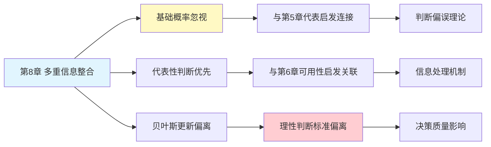

---

category: 
  - 书籍拆解

status: draft
chapter: 
number: 8
title: 多重信念的不一致
links:

  - "[[第7章-过度自信的锚点]]"
  - "[[第9章-模拟启发]]"
  - "[[思考快与慢/_导航]]"
created: 2026-02-27
tags:
  - 思考快与慢
  - 贝叶斯更新
  - 信念整合
  - 概率判断
---

# 第8章 多重信念的不一致

## 📍 章节定位

### 全书位置
> 第8章探讨人们在面对新信息时，如何错误地更新已有信念，特别是如何不恰当地加权不同来源信息，揭示信念整合中的系统性偏差。

- **全书核心问题**: 为什么人类的学习和决策会偏离理性标准？
- **本章回答的问题**: 人们如何不当整合不同类型的证据来更新信念？
- **角色类型**: 核心概念型（探讨信念更新机制及偏误）
- **论证位置**: 阐述人们处理信息和更新认知的偏误机制，连接前几章的判断偏误与更深层的信念结构

### 章节序列
| 方向 | 章节标题 | 逻辑连接 |
|------|----------|----------|
| 前章 | [[第7章-过度自信的锚点]] | 延续锚定与更新不足问题，探讨信息整合偏差 |
| 后章 | [[第9章-模拟启发]] | 与模拟启发一起阐述不同信息处理方式的认知特点 |
| 整书 | [[思考快与慢-丹尼尔·卡尼曼]] | 扩展信念结构与更新机制的重要理论 |

### 一句话定位
> 第8章揭示了人类在整合多个信息源更新信念时的非理性特点，展示了人们如何不当分配证据权重以及难以有效整合基础概率和具体证据。

---

## 🎯 核心观点

### 第一层：表层案例

| 案例名称 | 简要描述 | 页码 | 关键引文 |
|----------|----------|------|----------|
| 学校录取推理 | 招生官对学生能力的评估与基础概率的忽略 | p. — | "招生面试往往高估个人特质的影响" |
| 医疗诊断判断 | 医生如何在基础发病率低的情况下重视诊断测试 | p. — | "即便阳性, 罕见疾病的概率可能仍然低" |
| 雇佣决策 | 雇主基于面试结果忽视背景信息的倾向 | p. — | "面试表现容易影响总体评估" |
| 概率更新实验 | 实验展示人们如何错误分配概率权重 | p. — | "人们不遵循贝叶斯规律" |

### 第二层：中层机制

| 机制名称 | 组成要素 | 因果链条 | 证据来源 |
|----------|----------|----------|----------|
| 基础概率忽视 | 具体信息优先 + 概率信息弱化 | 具体描述→情感投入→基础概率被弱化 | 基础概率实验研究 |
| 代表性直觉取代 | 代表性判断 + 统计推断置换 | 表征相似→直觉判断→统计推断被替代 | 决策科学实验 |
| 记忆可用性影响 | 可得性与重要性误置 | 易回忆→高权重→判断偏误 | 可用性与概率判断实验 |
| 更新规则简化 | 复杂贝叶斯更新→简化启发式 | 理论复杂→简化操作→结果偏误 | 信念更新实验研究 |

### 第三层：底层规律

| 规律陈述 | 抽象层级 | 知识连接 | 适用范围 |
|----------|----------|----------|----------|
| 启发式信息整合法则 | 捷径思维规律 | [[双重过程理论]], [[认知启发式机制]] | 人类所有推断领域 |
| 情境信息优先原理 | 认知心理基础 | [[情境记忆理论]], [[情感认知理论]] | 概率判断与决策 |
| 贝叶斯推理偏差 | 概率认知机制 | [[理性决策理论]], [[统计思维缺陷]] | 信息更新场景 |

---

## 💬 降维翻译

### 观点1: 基础概率忽视的机制

#### 原文表达
> "人们在形成或更新关于某一事件概率的判断时，经常忽视基础概率（prior probability）信息，而过分依赖具体的新证据。即使给定基础概率信息，也会被新提供的具象化个人信息所压倒，这种倾向违背了贝叶斯统计推断的理性标准。"

> p.— 

#### 降维翻译（中学生能懂）
当你判断一件可能发生的事时，如果别人给你两个信息：
1. 大数据显示，这种事情发生的概率是1%
2. 这次具体情况，看起来特别容易发生

多数人会重视具体情况，忽略统计数据。比如：
- 医生说：这病在人口中只占0.01%
- 验血结果显示：阳性
多数人只看阳性结果，忘了疾病根本很罕见。

#### 日常类比（奶奶能懂）
就像村里有人说："虽然村里的寿星只有一个，但你看张大爷身体多好，肯定能活90岁。" 人们往往会忽略"全村只有1个百岁老人"这个事实，而被张大爷"身体好"的表象影响。

#### 检验
- Q: 如果一个中学生问你这是什么意思？
- A: 人在分析事情时，容易被眼前的具体情况影响，而忘记统计数据告诉你的真实概率。

### 观点2: 信念更新的偏差

#### 原文表达
> "人类信念更新过程并不遵循贝叶斯理性法则，而是使用各种快捷但非最优的启发式方法。这些方法虽然提高了处理效率，但也带来了系统性的判断偏误，特别是在面临复杂概率更新时。"

> p.— 

#### 降维翻译（中学生能懂）
理性的信念更新应该是这样的：
- 拿到新信息时，把它的可信度和之前的经验一起考虑
- 新旧信息按各自的重要程度进行综合判断

但实际上我们的判断更像：
- 感觉强烈的信息就认为很重要
- 模糊的信息就被忽略
- 算复杂统计？没时间，直接凭感觉

#### 日常类比（奶奶能懂）
就像听天气预报"可能下雨（30%）"和感觉"天阴沉沉的"，大多数人都会相信自己看到的"阴沉天空"而忘记预报说下雨概率不高。

#### 检验
- Q: 如果一个中学生问你这是什么意思？
- A: 人不善于按照严格的概率规则更新自己的看法，而是用简单的“感觉”方法。

---

## ✨ 金句库

### 原书金句
| 金句 | 页码 | 适用场景 |
|------|------|----------|
| "人们更新信念时不像贝叶斯学者" | p. — | 概率判断科普 |
| "基础概率被具体情况掩盖" | p. — | 决策偏误分析 |
| "代表性取代统计推断" | p. — | 推理偏差探讨 |

### 降维金句
| 金句 | 来源观点 | 适用场景 |
|------|----------|----------|
| "眼前信息压倒统计数据" | 基础概率忽视 | 判断逻辑校正 |
| "感觉比逻辑更有力" | 信念更新偏误 | 理性思维培养 |
| "具体盖过了普遍" | 直觉优先机制 | 决策思维提醒 |

## 🔗 当下映射

### 💰 财富应用
| 场景 | 具体行动 | 预期效果 | 风险提示 |
|------|----------|----------|----------|
| 投资决策 | 面对个股利好新闻时，同时查询市场基准表现 | 避免过度自信和追高风险 | 容易错过真正的投资机会 |
| 保险选择 | 考虑概率数据而不过分忧虑个别案例 | 选择合适的风险保障 | 忽略潜在重要警示 |
| 理财规划 | 重视长期统计数据而非短期市场情绪 | 制定更理性的理财计划 | 短期内可能错失机会 |

### 💼 职场应用
| 场景 | 具体行动 | 所需能力 | 适用职级 |
|------|----------|----------|----------|
| 人才招聘 | 结合统计趋势和个人能力评估 | 数据与人结合判断 | HR及管理岗 |
| 绩效管理 | 避免因特殊情况影响长期评价 | 全局观及分析判断 | 管理岗位 |
| 战略制定 | 重视基础数据分析，不过分依赖个例 | 数据分析与战略眼光 | 高管层 |

### 🏠 生活应用
| 场景 | 具体行动 | 可行性 | 见效时间 |
|------|----------|--------|----------|
| 健康决策 | 疾病概率参考结合个体体检结果 | 高 | 长期受益 |
| 教育选择 | 参考教育统计而不过分被个别案例影响 | 中 | 2-3年 |
| 居住地点 | 结合地区犯罪率等统计数据考虑 | 高 | 即时应用 |

### 72小时行动计划
1. **明天可以做的第一件事**: 回顾最近一次基于单一"鲜活案例"做的判断，尝试补充基础概率信息重新评估
2. **本周内可以尝试的事**: 在做任何重要决定时，主动询问："这种情况通常的概率是多少？"
3. **需要准备资源才能做的事**: 建立个人统计数据库，收集常见决策场景的基础概率信息

---

## 🕸️ 章节关联

### 向上关联 → 整书
- **贡献**: 深化概率判断偏误理论，展示信息整合过程中的具体偏误机制
- **位置**: 位于判断偏误机制的深化部分，连接基础判断与信念更新机制

### 横向关联 → 章节间
| 章节编号 | 章节标题 | 关联类型 | 连接描述 |
|----------|----------|----------|----------|
| 第7章 | 过度自信的锚点 | 延续 | 锚定效应影响初始信念形成，本章探讨信念更新过程 |
| 第9章 | 模拟启发 | 承接 | 两者都探讨信息处理方式的非统计性特征 |
| 第5章 | 直觉的判断 | 升华 | 延续代表性启发在信念更新中的应用 |
| 第6章 | 回忆的便利性 | 相关 | 邻近信息常被高估重要性，类似可用性影响信念更新 |

### 向下关联 → 具体应用
| 应用场景 | 难度 | 前置知识 |
|----------|------|----------|
| 决策分析改进 | 高 | 概率统计基础 |
| 专业判断提升 | 中 | 领域专业知识 |
| 直觉纠错训练 | 高 | 认知偏误意识 |

### 跨书关联 → 知识网络
| 书籍 | 概念 | 关系 | 备注 |
|------|------|------|------|
| [[思考快与慢-丹尼尔·卡尼曼]] | 信念更新机制 | 同源 | 理论基础 |
| [[清醒思考的艺术-多贝里]] | 证实偏误等 | 相关理论 | 偏误系列的重要方面 |
| [[黑天鹅-塔勒布]] | 稀有事件处理 | 视角互补 | 都涉及统计判断问题 |
| [[概率思维致胜-威廉·邓拉普]] | 概率推理 | 学科延伸 | 与贝叶斯方法密切相关 |

### 关联可视化

---

## ❓ 问答设计

### Q1: [记忆型问题]
**认知层次**: 记忆
**难度**: 低
**描述**: 什么是基础概率忽视？
**答案要点**:
- 重视具体情况信息
- 忽略统计基准数据
- 违背贝叶斯更新法则

### Q2: [理解型问题]
**认知层次**: 理解
**难度**: 中
**描述**: 为什么人们容易忽视基础概率？
**答案要点**:
- 具体信息更具情感冲击
- 系统1处理便捷优先
- 贝叶斯计算复杂

### Q3: [应用型问题]
**认知层次**: 应用
**难度**: 中
**描述**: 如何在生活中避免基础概率忽视？
**答案要点**:
- 主动查找统计基准
- 量化概率关系
- 评估信息权重

### Q4: [分析型问题]
**认知层次**: 分析
**难度**: 中
**描述**: 多重信念不一致如何影响判断？
**答案要点**:
- 信息来源优先级错误
- 权重分配不恰当
- 更新规则非理性

### Q5: [创造型问题]
**认知层次**: 创造
**难度**: 高
**描述**: 设计一个改进信念更新的教学模型？
**答案要点**:
- 直观展示概率关系
- 对比统计与情况信息
- 训练贝叶斯思维

### Q6: [理解型问题]
**认知层次**: 理解
**难度**: 中
**描述**: 基础概率忽视与锚定效应的关系？
**答案要点**:
- 初始信念形成时被锚定
- 后续更新不充分
- 都反映不完全处理特征

### Q7: [应用型问题]
**认知层次**: 应用
**难度**: 中
**描述**: 在招聘决策中如何平衡具体面试信息和统计背景?
**答案要点**:
- 设定统计基准线
- 量化面试分数范围
- 结构化评估流程

### Q8: [分析型问题]
**认知层次**: 分析
**难度**: 高
**描述**: 基础概率忽视与系统1/2的关系？
**答案要点**:
- 系统1偏好具体具象
- 系统2懒于进行统计计算
- 认知资源分配不均

### Q9: [理解型问题]
**认知层次**: 高
**描述**: 代表性直觉如何影响统计推断？
**答案要点**:
- 具象特征影响判断
- 看似代表实际不等
- 忽略样本基础规模

### Q10: [创造型问题]
**认知层次**: 创造
**难度**: 高
**描述**: 如何设计一个概率判断辅助工具？
**答案要点**:
- 基础概率提醒功能
- 信息权重可视化
- 直观的贝叶斯计算器

---
