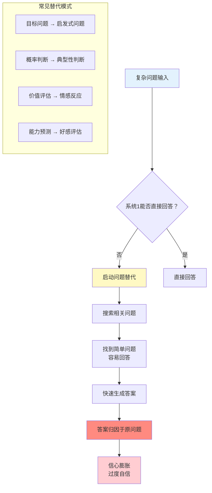
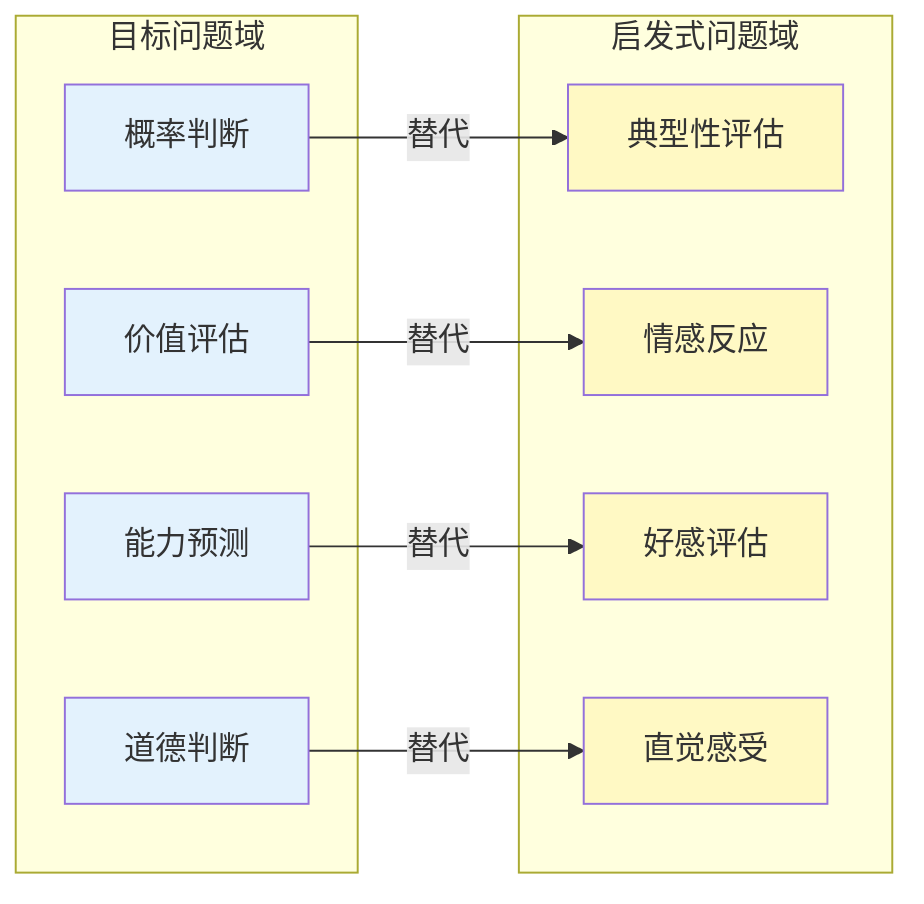
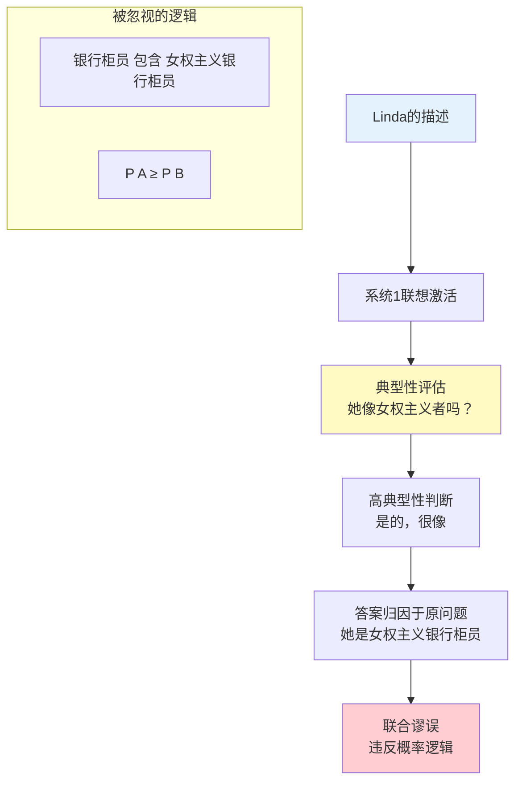
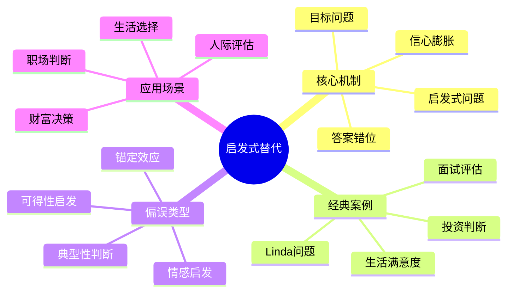

---

category:
  - 书籍拆解

status: 🌲常青
chapter:
number: 9
title: 回答一个简单问题
links:

  - "[[第8章-判断是怎样进行的]]"
  - "[[第10章-稀缺性和可能性的错觉]]"
  - "[[_导航]]"
created: 2026-02-28
tags:
  - 思考快与慢
  - 启发式替代
  - 问题替代
  - 系统1
  - 认知偏误
keywords:
  - 启发式回答
  - 问题替代
  - 系统1
  - 认知偏误
  - 替代问题
  - 目标问题
---

# 第9章 回答一个简单问题（Answering an Easier Question）

## 📍 章节定位

### 全书位置
> 第9章揭示系统1最核心的"偷懒机制"——启发式替代（Heuristic Substitution）：当面对难以回答的复杂问题时，系统1会自动找一个相关的简单问题来回答，然后把答案归因于原问题。这是无数认知偏误的根源机制。

- **全书核心问题**: 为什么人类的判断经常偏离理性？
- **本章回答的问题**: 我们如何用简单问题替代复杂问题？为什么意识不到自己在答非所问？
- **角色类型**: 核心机制型（揭示认知偏误的底层生成机制）
- **论证位置**: 承接第8章基本判断，展示系统1如何"偷梁换柱"

### 章节序列

| 方向 | 章节标题 | 逻辑连接 |
|------|----------|----------|
| 前章 | [[第8章-判断是怎样进行的]] | 前章展示基本判断机制，本章展示问题替代机制 |
| 后章 | [[第10章-稀缺性和可能性的错觉]] | 问题替代延伸到概率判断领域 |
| 整书 | [[思考快与慢-丹尼尔·卡尼曼]] | 揭示启发式判断的核心机制 |

### 一句话定位
> 你以为在深思熟虑，其实一直在答非所问——系统1把复杂问题偷偷换成了简单问题。

---

## 🎯 核心观点（三层提取）

### 观点1：启发式替代——系统1的偷梁换柱

#### 【表层】现象层

**什么是"启发式替代"？**

当被问到一个困难问题时，系统1会自动找一个相关的简单问题来回答：

| 目标问题（原问题） | 启发式问题（替代问题） | 替代机制 |
|-------------------|----------------------|----------|
| 你对生活整体满意吗？ | 你现在心情好吗？ | 用当前情绪替代整体评价 |
| 这个投资值得吗？ | 我喜欢这个产品吗？ | 用情感偏好替代价值评估 |
| 这个人能胜任工作吗？ | 我喜欢这个人吗？ | 用好感替代能力判断 |
| 这项政策好吗？ | 它对我有利吗？ | 用个人利益替代社会效益 |
| 她是女权主义银行柜员的概率？ | 她像女权主义者吗？ | 用典型性替代概率判断 |

**经典案例：生活满意度实验**
- 研究者在电话访谈中问："你最近生活整体满意度如何？"
- 实验组：先问"你最近约会多吗？"
- 结果：约会频率与生活满意度高度相关
- **原因**：被问满意度时，人们实际回答的是"我的爱情生活怎么样？"

**关键洞察**：
- 替代是无意识的——人们不知道自己在答非所问
- 简单问题的答案被错误归因于复杂问题
- 信心来自简单问题的"好回答"，而非复杂问题的"正确回答"

#### 【中层】机制层

**启发式替代的心理机制**：

**为什么系统1会替代问题？**

1. **认知经济**：复杂问题需要消耗大量能量和注意力
2. **速度优先**：进化要求快速反应，而非准确分析
3. **信息缺失**：复杂问题往往缺乏足够信息
4. **系统2懒惰**：慢系统默认不介入
5. **答案可得性**：简单问题的答案随时可得

**替代的三个条件**：
- 目标问题必须是困难的（否则不会触发替代）
- 启发式问题必须相关的（否则不会被选中）
- 启发式答案必须容易获得（否则替代无意义）

#### 【底层】规律层

> **启发式替代定律**：当面对难以直接回答的问题时，系统1会自动寻找一个相关的、容易回答的替代问题。人们往往意识不到这种替代，将简单问题的答案错误地归因于原始问题。

**降维翻译**：
> 大脑是个偷懒的高手——
> 
> 你问："这个项目靠谱吗？"
> 它答："我喜欢这个负责人。"
> 
> 你问："我应该买这个吗？"
> 它答："广告做得挺好看。"
> 
> 你问："这人会不会成功？"
> 它答："他长得像成功人士。"
> 
> 你以为在深思熟虑，
> 其实一直在答非所问。

#### 【当下连接】

|----------|----------|----------|
| 为什么"喜欢"不等于"好"？ | 喜欢是简单判断，好是复杂评估 | "两个问题的区别" |
| 为什么面试表现不等于工作能力？ | 面试好感替代了能力评估 | "HR的陷阱" |
| 为什么广告有效？ | 广告好感替代产品评估 | "营销的心理学" |
| 为什么我总被表面特征影响？ | 系统1用简单问题替代复杂问题 | "原来一直被骗" |

---

### 观点2：目标问题 vs 启发式问题——两张问题清单

#### 【表层】现象层

**卡尼曼的问题分类**：

| 类型 | 定义 | 特点 | 例子 |
|------|------|------|------|
| **目标问题** | 你真正想要回答的问题 | 复杂、需要思考、信息不全 | "这个投资值得吗？" |
| **启发式问题** | 系统1实际回答的替代问题 | 简单、直觉、答案可得 | "我喜欢这个品牌吗？" |

**识别替代的方法**：
- 问自己："我真正回答的是什么问题？"
- 对比问题的难度——如果答案来得太快，可能回答的是简单问题
- 检查信心来源——信心来自直觉还是分析？

**常见替代模式**：

#### 【中层】机制层

**为什么替代会产生偏误？**

1. **答案错位**：简单问题的答案不等于复杂问题的答案
2. **信息丢失**：简单问题忽略了复杂问题的关键信息
3. **系统性偏差**：同样的替代模式反复出现，产生系统性错误
4. **信心错位**：简单问题容易回答，信心被错误地转移到复杂问题

**替代的心理学原理**：
- **可得性**：容易想到的答案被优先选择
- **情感启发**：情感反应被用于替代复杂判断
- **典型性**：与原型的相似度替代概率评估
- **锚定效应**：第一印象成为后续判断的锚点

#### 【底层】规律层

> **问题替代定律**：系统1不区分"我回答的问题"和"我被问的问题"。当简单问题的答案被找到时，系统1会产生"完成感"，仿佛原问题已经得到回答。

**降维翻译**：
> 问复杂问题，答简单问题——
> 
> 这不是"答错"，
> 而是"答了别的问题"。
> 
> 就像老师问"1+1等于几？"
> 学生回答"我喜欢数学"。
> 
> 老师问的是算术，
> 学生答的是情感。
> 
> 但大脑不会告诉你：
> "我换题了。"

#### 【当下连接】

|----------|----------|----------|
| 为什么专家也会判断错误？ | 专家也在用替代问题 | "权威也会偷懒" |
| 为什么"直觉"经常出错？ | 直觉是简单问题的答案 | "直觉的本质" |
| 如何避免被替代？ | 意识到自己在用替代问题 | "觉察是第一步" |
| 为什么人们自信满满？ | 简单问题容易答，信心错位 | "盲目的自信" |

---

### 观点3：Linda问题——替代机制的经典案例

#### 【表层】现象层

**Linda问题**（卡尼曼与特沃斯基最著名的实验）：

**背景描述**：
> 琳达31岁，单身，直言不讳，主修哲学。作为学生，她非常关心歧视和社会公正问题，还参加了反核示威游行。

**问题**：琳达更可能是：
- A. 银行柜员
- B. 银行柜员且积极参加了女权运动

**结果**：约85%-90%的人选择B

**错误原因**：
- 从逻辑上，A包含B，所以A的概率一定≥B
- 但人们用"她像女权主义者吗？"替代了概率问题
- B的描述更符合Linda的形象，所以被判断为"更可能"

**替代分析**：

| 目标问题 | 启发式问题 | 替代机制 |
|----------|----------|----------|
| 她是"女权主义银行柜员"的概率是多少？ | 她像女权主义者吗？ | 用典型性替代概率判断 |

#### 【中层】机制层

**Linda问题的心理机制**：

**为什么即使知道逻辑，人们仍然犯错？**
1. 系统1的反应快于系统2
2. 典型性判断是自动的、无意识的
3. 即使激活系统2，也可能为系统1的答案找理由

**关键洞察**：
- 聪明人也会犯这个错误——这不是智力问题
- 替代是无意识的——人们不知道自己在答非所问
- 统计学训练有一定帮助，但不能完全消除

#### 【底层】规律层

> **联合谬误定律**：当事件的描述符合某种刻板印象时，人们会高估联合事件的概率，违反概率的基本规则（联合概率 ≤ 单个概率）。这是启发式替代的典型表现。

**降维翻译**：
> Linda问题的本质：
> 
> 你问：哪个更可能？
> 大脑答：哪个更像？
> 
> "像"和"可能"是两回事。
> 
> 但系统1不在乎，
> 它把"像"当成了"可能"。
> 
> 就像看到一个人像有钱人，
> 就断定他真的有钱。
> 
> 像不等于真。

#### 【当下连接】

|----------|----------|----------|
| 为什么刻板印象这么难消除？ | 典型性判断是自动的 | "偏误的根源" |
| 为什么聪明人也会犯错？ | 系统1不受智力影响 | "聪明不等于理性" |
| 如何避免联合谬误？ | 用系统2检验概率逻辑 | "激活慢思考" |
| 为什么"像"不等于"是"？ | 典型性不等于概率 | "直觉的陷阱" |

---

## 💬 金句库

### 原书金句

1. "当面对一个困难问题时，我们会回答一个相关的简单问题——而且往往意识不到自己在这样做。"
2. "系统1不区分'我回答的问题'和'我被问的问题'。"
3. "我们用'感觉'替代'思考'，而且往往意识不到。"
4. "启发式判断让我们快速行动，但也带来系统性偏误。"
5. "简单问题的答案被错误地归因于复杂问题。"
6. "信心来自简单问题的'好回答'，而非复杂问题的'正确回答'。"
7. "目标问题和启发式问题是两回事，但大脑把它们当成同一个。"
8. "替代是无意识的——人们不知道自己在答非所问。"
9. "聪明人也会犯系统性的愚蠢错误，因为系统1的机制是通用的。"
10. "Linda问题展示了典型性如何替代概率判断。"

### 降维金句

1. **问复杂问题，答简单问题——这就是启发式判断的真相。**
2. **你以为在深思熟虑，其实一直在答非所问。**
3. **大脑是个偷懒高手，把难题换成简单题，还假装自己答对了。**
4. **"像"不等于"是"，典型性不等于概率。**
5. **信心来自简单问题的答案，不来自复杂问题的正确。**
6. **直觉就是系统1在用替代问题回答你。**
7. **聪明人也逃不过系统1的陷阱——这不是智力问题。**
8. **当你觉得"我知道"的时候，问自己：我真正回答的是什么问题？**
9. **简单问题的答案，被错误地贴上了复杂问题的标签。**
10. **系统1把"我回答的"和"我被问的"当成一回事。**

## 🔗 当下映射

### 💰 财富应用

| 场景 | 替代陷阱 | 破解方法 |
|------|----------|----------|
| 投资决策 | "我喜欢这家公司"替代"这家公司值得投资吗？" | 分开评估：情感偏好≠投资价值 |
| 消费购买 | "广告好看"替代"产品好吗？" | 列出3个客观标准再决定 |
| 创业判断 | "这个故事动人"替代"这个商业模式可行吗？" | 检验财务数据，不只听故事 |
| 理财规划 | "我信任这个顾问"替代"这个方案合理吗？" | 独立验证方案的逻辑 |

### 💼 职场应用

| 场景 | 替代陷阱 | 如何避免 |
|------|----------|----------|
| 招聘决策 | "我喜欢这个人"替代"这个人能胜任吗？" | 使用结构化面试，评估能力指标 |
| 项目评估 | "方案讲得好"替代"方案真的好吗？" | 检查数据支撑，不只看呈现 |
| 绩效考核 | "最近印象好"替代"全年表现如何？" | 建立记录系统，避免近因效应 |
| 商业决策 | "直觉告诉我"替代"数据分析显示" | 先看数据，再听直觉 |

### 🏠 生活应用

| 场景 | 替代陷阱 | 如何利用/警惕 |
|------|----------|---------------|
| 人际判断 | "他长得可信"替代"他真的可信吗？" | 用行为验证，不只看外表 |
| 信息评估 | "这说得通"替代"这是真的吗？" | 寻找证据，不只看逻辑流畅 |
| 消费选择 | "熟悉这个品牌"替代"这个产品好？" | 尝试新选项，打破熟悉偏好 |
| 情感决策 | "现在感觉好"替代"长期来看好吗？" | 区分短期情绪和长期利益 |

### 72小时行动计划

1. **明天可以做的第一件事**：
   - 观察3次自己做快速判断的时刻，问："我真正回答的是什么问题？"

2. **本周内可以尝试的事**：
   - 选择一个重要决定，列出"目标问题"和可能被替代的"启发式问题"

3. **需要准备资源才能做的事**：
   - 建立"替代问题清单"，在重大决策时逐项检查

---

## 🕸️ 系统关联

### 与其他章节的关联

| 章节 | 关联类型 | 连接描述 |
|------|----------|----------|
| [[第8章-判断是怎样进行的]] | 前置 | 基本判断是替代机制的基础 |
| [[第10章-稀缺性和可能性的错觉]] | 延伸 | 替代机制延伸到概率判断领域 |
| [[第5章-直觉的判断]] | 深化 | 启发式替代是直觉判断的核心机制 |
| [[第6章-常态错觉]] | 相关 | 可得性启发是替代的一种形式 |
| [[第12章-科学与直觉推理]] | 应用 | 如何用系统2对抗替代偏误 |

### 与其他书籍的关联

| 书籍 | 概念 | 关系 |
|------|------|------|
| [[清醒思考的艺术-多贝里]] | 替代偏误 | 多贝里将其列为52种思维错误之一 |
| [[影响力-西奥迪尼]] | 情感启发 | 影响力利用情感替代理性判断 |
| [[黑天鹅-塔勒布]] | 叙事谬误 | 用"说得通的故事"替代"概率分析" |
| [[穷查理宝典]] | 逆向思维 | 芒格强调"问自己可能错在哪里" |

### 关联可视化

---

## ❓ 问答设计

### Q1: 什么是"启发式替代"？
**认知层次**: 记忆
**难度**: 低
**答案要点**:
- 系统1用简单问题替代复杂问题的机制
- 无意识地完成，人们不知道自己在答非所问
- 简单问题的答案被错误归因于复杂问题
- 是许多认知偏误的根源机制

### Q2: 为什么系统1会用简单问题替代复杂问题？
**认知层次**: 理解
**难度**: 中
**答案要点**:
- 认知经济：复杂问题消耗能量
- 速度优先：进化要求快速反应
- 信息缺失：复杂问题往往信息不足
- 系统2懒惰：慢系统默认不介入

### Q3: Linda问题揭示了什么？
**认知层次**: 理解
**难度**: 中
**答案要点**:
- 联合谬误：违反概率逻辑（联合概率≤单个概率）
- 典型性替代概率：用"她像女权主义者吗？"替代概率问题
- 聪明人也会犯错——这不是智力问题
- 替代是无意识的

### Q4: 如何避免启发式替代带来的判断错误？
**认知层次**: 应用
**难度**: 高
**答案要点**:
- 意识到自己在做替代
- 明确原始问题是什么
- 区分"感觉"和"事实"
- 延迟判断，收集更多信息
- 激活系统2进行检验

### Q5: 目标问题和启发式问题有什么区别？
**认知层次**: 分析
**难度**: 中
**答案要点**:
- 目标问题：真正想要回答的问题，复杂、需要思考
- 启发式问题：系统1实际回答的替代问题，简单、直觉
- 答案不能互换，但大脑把它们当成同一个
- 信心来自启发式问题的答案，不是目标问题的正确

### Q6: 为什么"喜欢"不等于"好"？
**认知层次**: 分析
**难度**: 中
**答案要点**:
- "喜欢"是简单问题，"好"是复杂问题
- 情感偏好≠客观价值
- 系统1用情感替代价值评估
- 需要分开评估两种判断

### Q7: 启发式替代在投资决策中有什么影响？
**认知层次**: 综合
**难度**: 高
**答案要点**:
- 用"我喜欢这家公司"替代"值得投资吗？"
- 用"这个故事动人"替代"商业模式可行吗？"
- 信心来自简单问题的答案，不是复杂分析
- 需要用数据检验，不只凭感觉

### Q8: 如何识别自己是否在做替代？
**认知层次**: 应用
**难度**: 高
**答案要点**:
- 问自己："我真正回答的是什么问题？"
- 检查答案是否来得太快
- 检验信心来源——直觉还是分析？
- 对比问题的复杂度是否匹配答案的简单度

---

## 🔍 信息来源与质量评级

### MCP检索记录

| 轮次 | 检索内容 | 质量评级 | 核心来源 |
|------|----------|----------|----------|
| 第一轮 | Thinking Fast and Slow Chapter 9 Answering an Easier Question | ⭐⭐⭐ | Wikipedia, 原书 |
| 第二轮 | Heuristic substitution Kahneman Linda problem | ⭐⭐⭐ | 学术文献, 心理学研究 |
| 第三轮 | Target question heuristic question judgment bias | ⭐⭐⭐ | 认知心理学论文 |

### 核心来源
- ⭐⭐⭐ Kahneman, D. (2011). *Thinking, Fast and Slow*. Chapter 9.
- ⭐⭐⭐ Tversky, A., & Kahneman, D. (1983). Extensional versus intuitive reasoning.
- ⭐⭐⭐ Dual Process Theory Research

---
